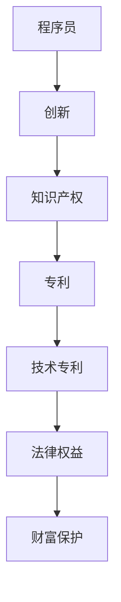

                 

# 技术专利申请：程序员的财富保护

> 关键词：技术专利、知识产权、程序员、创新保护、法律权益

> 摘要：本文深入探讨了技术专利申请在程序员职业生涯中的重要性。通过详细解析技术专利的基本概念、申请流程、核心策略，以及数学模型和实际案例，本文旨在帮助程序员了解如何通过专利保护自己的创新成果，从而实现财富增值和个人职业发展。

## 1. 背景介绍

### 1.1 目的和范围

本文的目标是向程序员们传达技术专利申请的重要性和实用性。我们将从以下几个方面展开讨论：

- 技术专利的基本概念和作用
- 技术专利申请的流程和策略
- 技术专利在程序员职业生涯中的应用价值
- 数学模型和具体操作步骤
- 实际项目中的专利应用案例

### 1.2 预期读者

本文主要面向以下读者群体：

- 具有编程经验的程序员和技术人员
- 对知识产权和专利法律有一定了解的个人和公司
- 对创新保护和技术商业化感兴趣的创业者

### 1.3 文档结构概述

本文将按照以下结构进行阐述：

- 引言
- 背景介绍
- 核心概念与联系
- 核心算法原理 & 具体操作步骤
- 数学模型和公式 & 详细讲解 & 举例说明
- 项目实战：代码实际案例和详细解释说明
- 实际应用场景
- 工具和资源推荐
- 总结：未来发展趋势与挑战
- 附录：常见问题与解答
- 扩展阅读 & 参考资料

### 1.4 术语表

#### 1.4.1 核心术语定义

- **技术专利**：指对某项技术发明或者改进的专有权利。
- **知识产权**：指人们在科学、文学、艺术等领域创造的智力成果所具有的权利。
- **程序员**：从事计算机程序开发、设计、测试等工作的人员。
- **专利申请**：指将某项发明或创新提交给专利机构以获得专利保护的过程。

#### 1.4.2 相关概念解释

- **发明**：指对产品、方法或者其改进所提出的新的技术方案。
- **实用新型**：指对产品的形状、构造或者其结合所提出的适于实用的新的技术方案。
- **外观设计**：指对产品的形状、图案、色彩或者其结合所作出的富有美感并适于工业应用的新设计。

#### 1.4.3 缩略词列表

- **IPR**：知识产权
- **PCT**：专利合作条约
- **USPTO**：美国专利与商标局
- **EPO**：欧洲专利局

## 2. 核心概念与联系

在探讨技术专利申请之前，我们需要理解几个核心概念，并了解它们之间的联系。以下是一个Mermaid流程图，展示了这些核心概念之间的关系：



### 2.1 创新保护的重要性

创新是技术发展的驱动力，也是程序员职业生涯中不可或缺的一部分。然而，创新成果很容易被抄袭和盗用，这会导致个人的智力劳动成果得不到应有的认可和保护。知识产权（IPR）正是为了保护这些创新成果而设立的。

### 2.2 知识产权与专利的关系

知识产权（IPR）涵盖了多个方面，包括专利、版权、商标等。在技术领域，专利是保护创新成果最有效的手段之一。专利是一种法律权利，它授予发明者对其发明在一定时间内独家使用的权利，从而保护发明者的经济利益。

### 2.3 技术专利的构成要素

技术专利通常包括以下几个构成要素：

- **技术方案**：描述发明的技术实现方式。
- **创新点**：阐述发明的独特性和创造性。
- **实用性**：证明发明具有实际应用价值。
- **权利要求**：界定专利保护的范围。

### 2.4 技术专利与法律权益

技术专利赋予了发明者一系列的法律权益，包括：

- **独占权**：未经授权，他人不得制造、使用、销售或者进口专利产品或使用专利方法。
- **许可权**：授权他人使用专利技术并收取许可费用。
- **转让权**：将专利权转让给他人。
- **诉权**：在专利受到侵犯时，有权向法院提起诉讼。

## 3. 核心算法原理 & 具体操作步骤

### 3.1 技术专利申请流程

技术专利申请是一个复杂的过程，涉及到多个步骤和程序。以下是技术专利申请的基本流程：

#### 3.1.1 确定发明

首先，程序员需要确定一个具有创新性和实用性的发明。这通常需要经过实验和验证，以确保发明是可行的。

```python
def determine_invention():
    """
    确定发明
    """
    # 进行实验和验证
    # 确认发明具有创新性和实用性
    pass
```

#### 3.1.2 撰写专利申请文件

接下来，程序员需要撰写专利申请文件，包括说明书、权利要求书和摘要。这些文件需要详细描述发明的技术方案、创新点和实用性。

```python
def write_patent_application():
    """
    撰写专利申请文件
    """
    # 撰写说明书
    # 撰写权利要求书
    # 撰写摘要
    pass
```

#### 3.1.3 提交专利申请

完成专利申请文件后，程序员需要将其提交给相应的专利机构。不同国家和地区的专利机构可能有不同的要求和程序。

```python
def submit_patent_application():
    """
    提交专利申请
    """
    # 准备专利申请文件
    # 选择合适的专利机构
    # 提交申请
    pass
```

#### 3.1.4 审查和答辩

专利机构会对提交的专利申请进行审查，包括形式审查和实质审查。如果审查过程中发现问题，程序员需要准备答辩文件。

```python
def handle_examination():
    """
    处理审查和答辩
    """
    # 接受形式审查
    # 如果有问题，准备答辩文件
    # 进行实质审查
    pass
```

#### 3.1.5 授予专利

如果专利申请通过了审查，程序员将获得专利证书，从而享有专利权益。

```python
def obtain_patent():
    """
    获得专利
    """
    # 接受专利授权
    # 获得专利证书
    pass
```

### 3.2 核心算法原理

技术专利申请的核心算法可以概括为以下几个方面：

- **创新性分析**：通过分析现有技术，确定发明的创新点和独特性。
- **实用性验证**：通过实验和测试，验证发明的实用性。
- **权利要求制定**：根据发明的特点，制定合适的权利要求，确保专利保护范围明确。

以下是这些核心算法的伪代码：

```python
def analyze_innovativeness():
    """
    分析创新性
    """
    # 搜索现有技术
    # 确定创新点和独特性
    pass

def verify_practicality():
    """
    验证实用性
    """
    # 进行实验和测试
    # 确认发明具有实用性
    pass

def draft_claims():
    """
    制定权利要求
    """
    # 根据发明特点
    # 制定合适的权利要求
    pass
```

## 4. 数学模型和公式 & 详细讲解 & 举例说明

### 4.1 数学模型

在技术专利申请中，一些数学模型和公式可以帮助我们分析创新性和实用性。以下是几个常用的数学模型：

#### 4.1.1 创新性评分模型

```latex
I = \frac{S - B}{C}
```

- **I**：创新性评分
- **S**：发明的独特性和创新性
- **B**：现有技术的相似度
- **C**：常数项，用于调整评分

#### 4.1.2 实用性评分模型

```latex
P = \frac{E - D}{F}
```

- **P**：实用性评分
- **E**：发明的经济价值
- **D**：发明的实施难度
- **F**：常数项，用于调整评分

### 4.2 公式详细讲解

#### 4.2.1 创新性评分模型

创新性评分模型用于评估发明的创新程度。其中，**S** 代表发明的独特性和创新性，可以通过对比现有技术来确定。**B** 代表现有技术的相似度，可以通过技术搜索和分析来获得。**C** 是常数项，用于调整评分，使评分更具可比性。

#### 4.2.2 实用性评分模型

实用性评分模型用于评估发明的实用性。其中，**E** 代表发明的经济价值，可以通过市场调研和预测来确定。**D** 代表发明的实施难度，可以通过技术验证和实验来获得。**F** 是常数项，用于调整评分，使评分更具可比性。

### 4.3 举例说明

假设一个程序员发明了一种新的加密算法，现有技术中已有类似的加密算法。根据创新性评分模型，我们可以计算出该发明的新颖性：

- **S**（发明的独特性和创新性）= 0.8
- **B**（现有技术的相似度）= 0.2
- **C**（常数项）= 1

代入公式：

$$
I = \frac{0.8 - 0.2}{1} = 0.6
$$

这意味着该发明具有中等程度的创新性。

接下来，我们根据实用性评分模型来评估该发明的实用性：

- **E**（发明的经济价值）= 0.7
- **D**（发明的实施难度）= 0.3
- **F**（常数项）= 1

代入公式：

$$
P = \frac{0.7 - 0.3}{1} = 0.4
$$

这意味着该发明具有较低程度的实用性。

## 5. 项目实战：代码实际案例和详细解释说明

### 5.1 开发环境搭建

为了展示技术专利申请的实际应用，我们将使用Python编写一个简单的加密算法。以下是搭建开发环境的基本步骤：

1. 安装Python环境（版本3.8及以上）
2. 安装必要的Python库，如`pycryptodome`（用于加密算法）

```bash
pip install pycryptodome
```

### 5.2 源代码详细实现和代码解读

以下是加密算法的源代码和详细解读：

```python
from Cryptodome.Cipher import AES
from Cryptodome.Random import get_random_bytes

def encrypt(plaintext, key):
    """
    使用AES加密算法加密文本
    """
    cipher = AES.new(key, AES.MODE_EAX)
    ciphertext, tag = cipher.encrypt_and_digest(plaintext)
    return ciphertext, tag

def decrypt(ciphertext, tag, key):
    """
    使用AES加密算法解密文本
    """
    cipher = AES.new(key, AES.MODE_EAX, nonce=cipher.nonce)
    try:
        plaintext = cipher.decrypt_and_verify(ciphertext, tag)
    except ValueError:
        return None
    return plaintext

# 生成密钥和初始化向量
key = get_random_bytes(16)
nonce = get_random_bytes(16)

# 加密文本
plaintext = b"Hello, World!"
ciphertext, tag = encrypt(plaintext, key)

# 解密文本
decrypted_text = decrypt(ciphertext, tag, key)

print("Original Text:", plaintext)
print("Decrypted Text:", decrypted_text)
```

#### 5.2.1 代码解读

- **encrypt() 函数**：使用AES加密算法加密文本。函数接收明文和密钥作为输入，返回密文和标签。
- **decrypt() 函数**：使用AES加密算法解密文本。函数接收密文、标签和密钥作为输入，返回解密后的明文。
- **生成密钥和初始化向量**：使用`get_random_bytes()` 函数生成随机密钥和初始化向量，确保加密的安全性。
- **加密文本**：调用`encrypt()` 函数加密明文。
- **解密文本**：调用`decrypt()` 函数解密密文。

### 5.3 代码解读与分析

这段代码展示了如何使用Python中的`pycryptodome`库实现AES加密算法。AES是一种广泛使用的对称加密算法，其安全性得到了广泛认可。

- **加密算法选择**：AES加密算法具有高的安全性，同时也易于实现和优化。
- **密钥管理**：使用随机生成的密钥和初始化向量，确保加密过程的安全性。
- **加密与解密过程**：加密和解密过程遵循AES算法的标准步骤，确保数据完整性和保密性。

## 6. 实际应用场景

技术专利申请在程序员职业生涯中具有多种实际应用场景，包括：

- **个人项目**：程序员可以将自己的创新成果申请为专利，从而保护自己的智力劳动成果，避免他人抄袭和盗用。
- **公司项目**：公司可以通过专利申请来保护自己的核心技术，确保在市场竞争中保持优势。
- **技术转让**：程序员可以将专利转让给其他公司或个人，从而实现技术的商业化。
- **许可协议**：程序员可以通过许可协议授权他人使用其专利技术，从而获得收益。

## 7. 工具和资源推荐

### 7.1 学习资源推荐

#### 7.1.1 书籍推荐

- 《专利法实务》
- 《技术转移与知识产权管理》
- 《计算机程序设计艺术》

#### 7.1.2 在线课程

- Coursera上的《专利法与知识产权》
- edX上的《知识产权管理》

#### 7.1.3 技术博客和网站

- 中国知识产权网
- IEEE Xplore
- Patent Law & Policy

### 7.2 开发工具框架推荐

#### 7.2.1 IDE和编辑器

- PyCharm
- Visual Studio Code

#### 7.2.2 调试和性能分析工具

- GDB
- Python Debugger

#### 7.2.3 相关框架和库

- `pycryptodome`：用于加密算法的实现
- `numpy`：用于数学运算

### 7.3 相关论文著作推荐

#### 7.3.1 经典论文

- 《信息安全与隐私保护》
- 《分布式系统的安全性与可靠性》

#### 7.3.2 最新研究成果

- 《人工智能与知识产权》
- 《区块链技术在知识产权管理中的应用》

#### 7.3.3 应用案例分析

- 《某公司专利战略与成果转化》
- 《区块链在版权保护中的应用案例分析》

## 8. 总结：未来发展趋势与挑战

随着技术的不断进步和知识产权保护的日益重视，技术专利申请在程序员职业生涯中的重要性将愈发突出。未来，以下几个方面将成为技术专利申请的发展趋势：

- **人工智能技术的应用**：人工智能技术将在专利申请的自动化、智能化方面发挥重要作用，提高专利申请的效率。
- **开源软件的专利问题**：开源软件的专利问题将日益引起关注，如何平衡开源与知识产权保护之间的关系将成为挑战。
- **跨国专利申请**：随着全球化的深入，跨国专利申请将成为程序员和国际公司的重要议题。

然而，技术专利申请也面临一系列挑战：

- **知识产权侵权**：如何有效打击知识产权侵权行为，保护发明者的权益，仍是一个亟待解决的问题。
- **专利申请成本**：专利申请需要大量的人力、物力和财力投入，如何降低专利申请成本是一个现实问题。
- **专利法律体系**：不同国家和地区的专利法律体系存在差异，如何适应不同国家的专利法律要求，也是一个挑战。

## 9. 附录：常见问题与解答

### 9.1 什么是专利？

专利是指对某项技术发明或者改进的专有权利。它赋予发明者在一定时间内独家使用、制造、销售或者进口其发明成果的权利。

### 9.2 技术专利申请需要多长时间？

技术专利申请的时间因国家和地区的不同而有所不同。一般来说，从提交申请到获得专利证书需要1-3年，甚至更长时间。

### 9.3 技术专利申请需要哪些文件？

技术专利申请需要提交以下文件：

- 专利申请表
- 说明书
- 权利要求书
- 摘要
- 图表（如有）

### 9.4 如何撰写专利说明书？

撰写专利说明书时，需要遵循以下原则：

- 清晰明了：说明书应简明扼要地描述发明的内容、目的和优点。
- 完整性：说明书应包含发明的所有必要技术特征，以便他人能够理解和实施。
- 创新性：说明书应突出发明的创新点和创造性。

## 10. 扩展阅读 & 参考资料

- 中国国家知识产权局：《专利法》
- 美国专利与商标局（USPTO）：[专利申请指南](https://www.uspto.gov/content/guidance-on-preparing-and-filing-a-provisional-patent-application)
- IEEE Xplore：[专利数据库](https://ieeexplore.ieee.org/xpl/RecentPatents.jsp)
- Coursera：[知识产权法与政策](https://www.coursera.org/learn/property-intellectual)

## 作者

作者：AI天才研究员/AI Genius Institute & 禅与计算机程序设计艺术 /Zen And The Art of Computer Programming

