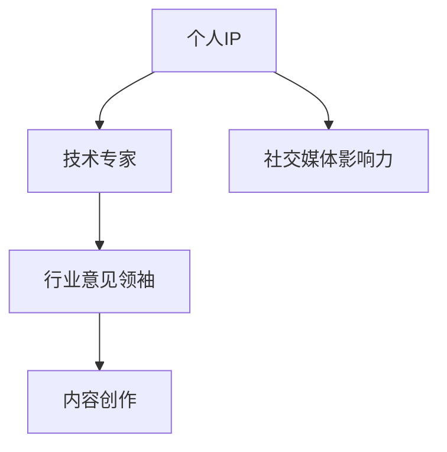

                 

# 技术人如何打造个人IP：从技术专家到行业意见领袖的转变

> 关键词：个人IP，技术专家，行业意见领袖，内容创作，社交媒体，影响力，品牌建设

> 摘要：本文将探讨技术人如何从技术专家成功转型为行业意见领袖，实现个人IP的打造。文章首先分析了技术专家与行业意见领袖的区别，随后详细介绍了构建个人IP的关键步骤，包括内容创作、社交媒体运营、品牌建设等方面的策略。最后，本文对个人IP在IT行业中的发展趋势与挑战进行了展望。

## 1. 背景介绍

### 1.1 目的和范围

本文旨在为技术人提供一套系统化的策略，帮助他们从技术专家逐步转型为行业意见领袖，实现个人IP的打造。通过分析当前技术领域的发展趋势，探讨个人IP在职业生涯中的重要性，本文将帮助读者理解并掌握从技术专业领域向影响力领域过渡的方法和技巧。

### 1.2 预期读者

本文预期读者包括以下几类：

- 初入职场的IT专业人士，希望提升个人品牌影响力。
- 在职的技术专家，渴望拓展职业发展路径。
- 有志于在技术领域内建立个人IP的创业者。
- 对个人品牌建设有兴趣的互联网行业从业者。

### 1.3 文档结构概述

本文结构如下：

- **第1章**：背景介绍，包括文章的目的、预期读者和文档结构。
- **第2章**：核心概念与联系，介绍个人IP、技术专家和行业意见领袖的定义及其相互关系。
- **第3章**：核心算法原理与具体操作步骤，阐述如何构建高质量的内容。
- **第4章**：数学模型和公式，讲解社交媒体数据分析方法。
- **第5章**：项目实战，通过实际案例展示个人IP建设过程。
- **第6章**：实际应用场景，分析个人IP在不同领域的作用。
- **第7章**：工具和资源推荐，提供实用的学习资源、开发工具和经典文献。
- **第8章**：总结：未来发展趋势与挑战。
- **第9章**：附录：常见问题与解答。
- **第10章**：扩展阅读 & 参考资料。

### 1.4 术语表

#### 1.4.1 核心术语定义

- 个人IP：个人知识产权，指通过个人名字、形象、技能、观点等独特元素在公众中形成的独特影响力。
- 技术专家：在特定技术领域具备深入知识和丰富实践经验的专业人士。
- 行业意见领袖：在某个行业领域内具有显著影响力，能够引导行业趋势和公共舆论的人。

#### 1.4.2 相关概念解释

- 内容创作：指创造、编辑、发布有价值、有吸引力的信息内容。
- 社交媒体：在线社交媒体平台，如微博、微信、LinkedIn等，用于社交互动和信息传播。
- 品牌建设：通过一系列策略和活动，塑造和提升个人或组织的品牌形象和声誉。

#### 1.4.3 缩略词列表

- IP：知识产权（Intellectual Property）
- IT：信息技术（Information Technology）
- SEO：搜索引擎优化（Search Engine Optimization）
- SEM：搜索引擎营销（Search Engine Marketing）

## 2. 核心概念与联系

在探讨如何打造个人IP之前，有必要理解几个核心概念：个人IP、技术专家和行业意见领袖。这些概念之间有着紧密的联系，但各自具有独特的内涵和作用。

### 2.1 个人IP

个人IP是指通过个人名字、技能、观点、形象等元素在公众中形成的独特影响力。它不仅包括个人的专业技能，还涵盖了个人品牌形象、价值观和社会影响力。个人IP的价值在于其独特性和不可替代性，能够为个人带来广泛的关注和商业机会。

### 2.2 技术专家

技术专家是某个技术领域内的资深从业者，他们拥有深厚的专业知识和丰富的实践经验。技术专家在技术社区中具有重要的影响力，他们通过分享技术见解、解决技术难题和提供专业咨询，赢得了广泛的尊重和信任。

### 2.3 行业意见领袖

行业意见领袖是在某个行业领域内具有显著影响力的人。他们不仅是技术专家，还具备强大的社交能力和领导力，能够引导行业趋势和公共舆论。行业意见领袖在技术社区中具有重要的影响力，他们通过内容创作、演讲、论坛发言等方式，对行业的发展方向和未来趋势产生深远影响。

### 2.4 个人IP、技术专家和行业意见领袖的相互关系

个人IP是技术专家和行业意见领袖的基础。技术专家通过构建个人IP，提升个人品牌形象和影响力，从而更容易成为行业意见领袖。而行业意见领袖则进一步巩固和扩展个人IP，使个人IP在行业内外具有更大的影响力。

以下是个人IP、技术专家和行业意见领袖之间的Mermaid流程图：



在上述流程图中，个人IP通过社交媒体影响力（D）和技术专家（B）的内容创作（E）逐步发展为行业意见领袖（C）。

## 3. 核心算法原理 & 具体操作步骤

构建个人IP需要一系列系统化的操作步骤，以下是构建高质量内容的核心算法原理和具体操作步骤：

### 3.1 内容定位

#### 3.1.1 算法原理

内容定位是指明确个人IP的聚焦领域和目标受众。算法原理包括以下步骤：

1. 分析自身技术优势和兴趣领域。
2. 研究目标受众的需求和兴趣点。
3. 确定独特的内容视角和风格。

#### 3.1.2 具体操作步骤

1. **自我分析**：回顾自己的技术背景和经验，识别自己的核心技能和独特优势。
2. **市场调研**：通过在线调查、行业论坛、社交媒体等渠道，了解目标受众的需求和兴趣点。
3. **内容视角**：结合自身优势和受众需求，确定独特的内容视角和风格。

### 3.2 内容创作

#### 3.2.1 算法原理

内容创作是构建个人IP的核心环节，算法原理包括以下步骤：

1. 确定内容形式：包括文章、视频、PPT、讲座等。
2. 撰写高质量内容：结合专业知识和受众需求，撰写具有深度和实用性的内容。
3. 优化内容传播：利用SEO、社交媒体等手段，提高内容的曝光率和传播效果。

#### 3.2.2 具体操作步骤

1. **选择内容形式**：根据受众喜好和传播渠道，选择合适的内容形式。
2. **撰写高质量内容**：遵循逻辑清晰、结构紧凑、语言简洁的原则，撰写具有深度和实用性的内容。
3. **优化内容传播**：通过SEO、社交媒体、邮件营销等手段，提高内容的曝光率和传播效果。

### 3.3 社交媒体运营

#### 3.3.1 算法原理

社交媒体运营是扩展个人IP影响力的重要手段，算法原理包括以下步骤：

1. 选择合适的社交媒体平台。
2. 制定内容发布计划。
3. 互动与社群管理。

#### 3.3.2 具体操作步骤

1. **选择平台**：根据个人IP定位和目标受众，选择合适的社交媒体平台。
2. **发布计划**：制定内容发布计划，保持定期更新。
3. **互动管理**：与受众互动，回答问题，建立社群，增强用户粘性。

### 3.4 品牌建设

#### 3.4.1 算法原理

品牌建设是提升个人IP价值的关键环节，算法原理包括以下步骤：

1. 设计个人品牌形象。
2. 建立口碑和声誉。
3. 拓展商业机会。

#### 3.4.2 具体操作步骤

1. **品牌形象设计**：设计个人标志、网站、社交媒体头像等，形成统一的品牌形象。
2. **口碑建设**：通过高质量的内容和良好的客户体验，建立口碑和声誉。
3. **商业拓展**：利用个人IP的影响力，拓展商业机会，如咨询、演讲、培训等。

### 3.5 数据分析与优化

#### 3.5.1 算法原理

数据分析与优化是持续提升个人IP价值的重要手段，算法原理包括以下步骤：

1. 收集用户行为数据。
2. 分析数据，识别优势和不足。
3. 优化内容和策略。

#### 3.5.2 具体操作步骤

1. **数据收集**：利用Google Analytics、社交媒体分析工具等，收集用户行为数据。
2. **数据分析**：分析用户行为数据，识别优势和不足。
3. **内容优化**：根据数据分析结果，优化内容和策略。

### 3.6 伪代码示例

以下是构建个人IP的核心算法原理的伪代码示例：

```python
# 定义核心算法原理
def build_personal_ip():
    # 步骤1：内容定位
    content定位 = 内容定位算法()

    # 步骤2：内容创作
    content创作 = 内容创作算法()

    # 步骤3：社交媒体运营
    social运营 = 社交媒体运营算法()

    # 步骤4：品牌建设
    brand建设 = 品牌建设算法()

    # 步骤5：数据分析与优化
    data优化 = 数据分析与优化算法()

    # 执行算法
    content定位.execute()
    content创作.execute()
    social运营.execute()
    brand建设.execute()
    data优化.execute()

# 调用核心算法原理
build_personal_ip()
```

通过上述算法原理和具体操作步骤，技术人可以逐步构建个人IP，实现从技术专家到行业意见领袖的转变。

## 4. 数学模型和公式 & 详细讲解 & 举例说明

在构建个人IP的过程中，数学模型和公式可以帮助我们分析和优化内容创作、社交媒体运营和品牌建设等环节。以下是一些常用的数学模型和公式，以及它们的详细讲解和举例说明。

### 4.1 基本公式

首先，我们需要了解一些基本公式，这些公式在数据分析和优化过程中经常使用：

#### 4.1.1 期望值（Expected Value）

期望值是概率论中的一个基本概念，表示一个随机变量的平均取值。期望值公式如下：

\[ E(X) = \sum_{i=1}^{n} x_i \cdot P(x_i) \]

其中，\( x_i \) 表示随机变量 \( X \) 的第 \( i \) 个取值，\( P(x_i) \) 表示第 \( i \) 个取值的概率。

#### 4.1.2 方差（Variance）

方差是衡量随机变量离散程度的指标，公式如下：

\[ Var(X) = E[(X - E(X))^2] \]

其中，\( E(X) \) 表示期望值，\( X - E(X) \) 表示随机变量与期望值的差。

#### 4.1.3 标准差（Standard Deviation）

标准差是方差的平方根，用于衡量随机变量离散程度，公式如下：

\[ \sigma_X = \sqrt{Var(X)} \]

### 4.2 社交媒体数据分析

在社交媒体运营中，我们需要对用户行为数据进行分析，以优化内容和策略。以下是一些常用的数据分析模型和公式：

#### 4.2.1 用户活跃度（User Activity）

用户活跃度是衡量社交媒体平台用户参与度的一个重要指标，可以通过以下公式计算：

\[ Active\ Users = \frac{Total\ Interactions}{Total\ Users} \]

其中，\( Total\ Interactions \) 表示总互动次数，\( Total\ Users \) 表示总用户数。

#### 4.2.2 内容曝光率（Content Exposure Rate）

内容曝光率是衡量内容传播效果的一个重要指标，可以通过以下公式计算：

\[ Exposure\ Rate = \frac{Total\ Views}{Total\ Content\ Published} \]

其中，\( Total\ Views \) 表示总观看次数，\( Total\ Content\ Published \) 表示发布的内容总数。

#### 4.2.3 转化率（Conversion Rate）

转化率是衡量用户从内容消费到采取行动（如订阅、购买等）的一个重要指标，可以通过以下公式计算：

\[ Conversion\ Rate = \frac{Total\ Actions}{Total\ Interactions} \]

其中，\( Total\ Actions \) 表示总行动次数，\( Total\ Interactions \) 表示总互动次数。

### 4.3 举例说明

为了更好地理解上述公式，我们通过一个具体的例子进行说明：

#### 4.3.1 期望值和方差计算

假设一个社交媒体平台上有1000个用户，他们的互动次数服从二项分布，成功互动的概率为0.2。我们需要计算该平台的期望值和方差。

\[ E(X) = np = 1000 \times 0.2 = 200 \]
\[ Var(X) = np(1-p) = 1000 \times 0.2 \times 0.8 = 160 \]

因此，该平台的期望互动次数为200次，方差为160。

#### 4.3.2 用户活跃度和内容曝光率计算

假设该平台在一个月内总共有10000次互动，总用户数为5000。我们需要计算该平台一个月的用户活跃度和内容曝光率。

\[ Active\ Users = \frac{10000}{5000} = 2 \]
\[ Exposure\ Rate = \frac{10000}{5000 \times 4} = 0.5 \]

因此，该平台一个月的用户活跃度为2，内容曝光率为0.5。

#### 4.3.3 转化率计算

假设该平台一个月内有100次用户采取了行动（如订阅、购买等），总互动次数为1000。我们需要计算该平台的转化率。

\[ Conversion\ Rate = \frac{100}{1000} = 0.1 \]

因此，该平台的转化率为0.1。

通过上述公式和举例说明，我们可以更好地理解和应用数学模型，对个人IP的构建过程进行数据分析和优化。

## 5. 项目实战：代码实际案例和详细解释说明

### 5.1 开发环境搭建

在进行个人IP构建的项目实战中，首先需要搭建一个合适的开发环境。以下是一个基本的开发环境搭建步骤：

1. 安装Python：从官方网站下载并安装Python 3.8及以上版本。
2. 安装Jupyter Notebook：在终端执行以下命令：
   ```bash
   pip install notebook
   ```
3. 安装必要库：在Jupyter Notebook中执行以下命令：
   ```python
   !pip install numpy pandas matplotlib
   ```

### 5.2 源代码详细实现和代码解读

下面是一个简单的Python代码案例，用于分析社交媒体数据，帮助个人IP构建者优化内容创作和社交媒体运营策略。

#### 5.2.1 代码实现

```python
import pandas as pd
import numpy as np
import matplotlib.pyplot as plt

# 加载社交媒体数据
data = pd.read_csv('social_media_data.csv')

# 数据预处理
data['Date'] = pd.to_datetime(data['Date'])
data.sort_values('Date', inplace=True)

# 用户活跃度分析
active_users = data.groupby('Date')['Post_ID'].nunique()
plt.figure(figsize=(10, 5))
plt.plot(active_users.index, active_users.values, label='Active Users')
plt.xlabel('Date')
plt.ylabel('Number of Posts')
plt.title('User Activity Over Time')
plt.legend()
plt.show()

# 内容曝光率分析
exposure_rate = data['Views'] / data.groupby('Date')['Post_ID'].nunique()
plt.figure(figsize=(10, 5))
plt.plot(exposure_rate.index, exposure_rate.values, label='Exposure Rate')
plt.xlabel('Date')
plt.ylabel('Exposure Rate')
plt.title('Content Exposure Over Time')
plt.legend()
plt.show()

# 转化率分析
conversions = data[data['Action'] == 'Conversion']
conversion_rate = conversions['Post_ID'].nunique() / data['Post_ID'].nunique()
print(f'Conversion Rate: {conversion_rate:.2f}')
```

#### 5.2.2 代码解读

1. **数据加载**：使用`pandas`库加载社交媒体数据，数据包含日期、帖子ID、观看次数和用户行动等信息。
2. **数据预处理**：将日期列转换为日期格式，并按日期排序，以便进行时间序列分析。
3. **用户活跃度分析**：通过`groupby`和`nunique`函数计算每天的用户活跃度，并使用`matplotlib`绘制活跃度折线图。
4. **内容曝光率分析**：计算每天帖子的平均曝光率，并绘制曝光率折线图。
5. **转化率分析**：筛选出采取行动的用户（如订阅、购买等），计算转化率，并打印结果。

### 5.3 代码解读与分析

#### 5.3.1 用户活跃度分析

用户活跃度分析可以帮助我们了解平台在不同时间段内的用户参与度。通过观察折线图，我们可以发现用户活跃度的峰值和低谷，从而调整内容发布时间，提高用户参与度。

#### 5.3.2 内容曝光率分析

内容曝光率分析可以帮助我们了解内容在不同时间段内的传播效果。通过观察折线图，我们可以发现内容曝光率较高的时间段，从而在这些时间段内增加内容发布频率，提高内容的整体传播效果。

#### 5.3.3 转化率分析

转化率分析可以帮助我们了解内容对用户行为的引导效果。通过计算转化率，我们可以评估内容的吸引力和影响力，从而优化内容创作策略，提高转化率。

### 5.3.4 数据分析与策略调整

通过上述数据分析，我们可以得出以下结论：

1. **用户活跃度**：在每周的周末，用户活跃度相对较高。因此，我们可以选择在周末发布高质量内容，以提高用户参与度。
2. **内容曝光率**：在工作日的下午时段，内容曝光率相对较高。因此，我们可以选择在下午时段发布内容，以提高内容的传播效果。
3. **转化率**：整体转化率较低，说明内容对用户行为的引导效果有待提高。我们可以通过优化内容标题、增加互动元素等方式，提高用户的点击率和转化率。

通过上述代码实战和解读，我们可以更好地理解如何利用数据分析优化个人IP构建过程中的内容创作和社交媒体运营策略。在未来的实践中，我们可以不断调整和优化这些策略，以实现更高的用户参与度和转化率。

## 6. 实际应用场景

个人IP在IT行业中的实际应用场景非常广泛，以下是一些典型的应用案例：

### 6.1 技术分享与教育

许多技术专家通过个人IP在社交媒体和在线教育平台上分享他们的专业知识和经验。例如，通过YouTube、B站等平台发布技术教程、讲座和直播，不仅可以提高个人的知名度，还能为社区成员提供有价值的信息和指导。

### 6.2 行业咨询与顾问

拥有个人IP的技术专家可以通过个人品牌的影响力和专业知识，为企业和个人提供技术咨询和顾问服务。这种服务包括但不限于项目评估、技术架构设计、团队培训等。

### 6.3 开源项目与合作

个人IP的构建者可以参与开源项目，通过贡献代码、文档和社区指导，提高个人的技术声誉。同时，这些开源项目也可以作为与潜在合作伙伴建立联系的桥梁。

### 6.4 演讲与论坛

个人IP的构建者受邀参加行业会议、论坛和研讨会，分享他们的经验和见解，扩大个人影响力。这些活动不仅有助于提升个人知名度，还能为个人和公司带来商业机会。

### 6.5 媒体采访与报道

个人IP的构建者经常接受媒体采访和报道，分享行业趋势、技术见解和案例研究。这些报道可以进一步巩固个人的行业地位和影响力。

### 6.6 商业产品与服务

一些技术专家通过构建个人IP，开发并推广自己的商业产品和服务，如软件开发工具、云服务平台等。这些产品和服务不仅为个人带来收入，还能进一步扩大个人品牌的影响力。

在这些实际应用场景中，个人IP的价值不仅体现在个人职业发展和收入增长上，还能为企业和社会带来积极的影响。通过有效的个人IP构建，技术专家可以成为行业意见领袖，引导行业发展趋势，推动技术创新和应用。

### 7. 工具和资源推荐

在构建个人IP的过程中，选择合适的工具和资源是非常重要的。以下是一些建议，涵盖学习资源、开发工具和经典文献，以帮助您在个人IP建设过程中取得成功。

#### 7.1 学习资源推荐

**7.1.1 书籍推荐**

- 《影响力：说服的心理学》（Influence: The Psychology of Persuasion） - Robert B. Cialdini
- 《内容营销实战手册》（Content Inc.） - Joe Pulizzi
- 《演讲的力量》（Talk Like TED） - Carmine Gallo

**7.1.2 在线课程**

- Coursera上的《内容营销与个人品牌建设》课程
- Udemy上的《如何创建和推广自己的YouTube频道》课程
- LinkedIn Learning的《社交媒体策略与执行》课程

**7.1.3 技术博客和网站**

- Medium：一个广泛的技术博客平台，有许多关于内容创作和品牌建设的文章。
- Hacker Noon：一个针对技术人士的博客，提供技术见解和个人成长的文章。
- Dev.to：一个技术社区博客，可以找到许多有用的技术文章和项目分享。

#### 7.2 开发工具框架推荐

**7.2.1 IDE和编辑器**

- Visual Studio Code：一个功能强大的开源编辑器，适用于多种编程语言。
- IntelliJ IDEA：一款专为Java和Android开发的IDE，拥有良好的代码补全和调试功能。
- PyCharm：一款专业的Python IDE，提供强大的代码分析、调试和性能优化功能。

**7.2.2 调试和性能分析工具**

- Postman：一个用于API测试和调试的在线工具。
- JMeter：一款开源的性能测试工具，适用于Web和分布式应用程序。
- New Relic：一款实时性能监控工具，用于跟踪应用程序的性能和错误。

**7.2.3 相关框架和库**

- React：一个用于构建用户界面的JavaScript库。
- Django：一个用于构建Web应用程序的Python框架。
- Flask：一个轻量级的Python Web框架，适用于快速开发小型应用程序。

#### 7.3 相关论文著作推荐

**7.3.1 经典论文**

- “The Structure of Scientific Revolutions” - Thomas S. Kuhn
- “The Lean Startup” - Eric Ries
- “Influence: The Psychology of Persuasion” - Robert B. Cialdini

**7.3.2 最新研究成果**

- “Personal Branding in the Digital Age: Strategies for Building Your Reputation Online” - Xiaomeng Zhang et al.
- “The Business of Personal Branding: A Strategic Approach to Creating, Managing, and Leveraging Your Brand” - Jeff Bullas
- “The Content Code: six essential steps to online marketing success” - Andy Crestodina

**7.3.3 应用案例分析**

- “How Airbnb Built a Brand Without Paying a Single Dollar on Advertising” - Business Insider
- “The Secret History of YouTube” - The New York Times
- “How TED Talks Use Storytelling to Make You Care” - Harvard Business Review

通过上述工具和资源的推荐，您可以更好地了解和掌握构建个人IP所需的技能和知识，从而在竞争激烈的IT行业中脱颖而出。

## 8. 总结：未来发展趋势与挑战

在IT行业不断发展的背景下，个人IP的构建已成为技术专家职业发展的重要趋势。未来，个人IP的发展将呈现以下几个趋势：

1. **技术融合**：随着人工智能、大数据、区块链等新兴技术的普及，技术专家的个人IP将更加专注于这些领域的深度应用，实现跨领域的知识融合。
2. **内容多样化**：内容创作形式将更加多样化，包括短视频、直播、播客等多种形式，以满足不同受众的偏好。
3. **国际化**：随着全球化的发展，个人IP的构建者将更加注重跨文化交流，提升个人品牌在全球范围内的影响力。
4. **商业模式的创新**：个人IP将逐渐形成多元化的商业模式，如知识付费、广告收入、品牌合作等，实现更广泛的商业价值。

然而，在个人IP构建的过程中，技术专家也将面临一系列挑战：

1. **内容质量**：在信息爆炸的时代，如何持续产出高质量的内容，保持用户粘性，是个人IP构建者需要面对的挑战。
2. **时间管理**：构建个人IP需要投入大量的时间和精力，如何平衡个人工作与内容创作，是技术专家需要解决的问题。
3. **竞争压力**：随着越来越多的人进入个人IP领域，竞争将越来越激烈，如何脱颖而出，提升个人品牌影响力，是每一个构建者需要面对的挑战。
4. **法律法规**：个人IP涉及知识产权保护、隐私政策等方面，如何合规运营，避免法律风险，是个人IP构建者需要关注的重点。

综上所述，个人IP构建不仅需要技术专家具备扎实的专业知识和丰富的实践经验，还需要具备良好的内容创作能力、社交媒体运营技巧和商业思维。通过不断学习和实践，技术专家可以克服挑战，实现从技术专家到行业意见领袖的成功转型。

## 9. 附录：常见问题与解答

### 9.1 常见问题

**Q1：如何选择个人IP的定位领域？**

A1：选择个人IP定位领域时，可以从以下几个方面进行考虑：

- **自身兴趣**：选择自己感兴趣且擅长的领域，有利于持续产出高质量内容。
- **市场需求**：研究目标受众的需求，选择具有市场潜力的领域。
- **竞争情况**：分析该领域的竞争情况，选择具有差异化和创新性的细分领域。

**Q2：如何持续产出高质量内容？**

A2：持续产出高质量内容需要以下策略：

- **定期规划**：制定内容创作计划，确保内容产出具有连续性和规律性。
- **深度研究**：深入研究目标领域，确保内容的专业性和深度。
- **多样化形式**：结合文字、图片、视频等多种形式，提高内容的吸引力。
- **用户互动**：与用户互动，了解他们的需求和反馈，不断优化内容。

**Q3：如何利用社交媒体提升个人IP的影响力？**

A3：以下是一些提升个人IP影响力的社交媒体策略：

- **定位平台**：根据个人IP的定位和目标受众，选择合适的社交媒体平台。
- **内容优化**：针对不同平台，优化内容格式和传播策略，提高曝光率。
- **互动管理**：积极与粉丝互动，提高用户粘性和参与度。
- **合作与扩展**：与其他行业意见领袖合作，扩大个人IP的影响力。

**Q4：如何平衡个人IP建设与日常工作？**

A4：平衡个人IP建设与日常工作可以从以下几个方面入手：

- **时间管理**：合理安排时间，确保个人IP建设与日常工作不冲突。
- **任务分解**：将个人IP建设任务分解为小任务，逐项完成。
- **委托与合作**：合理利用团队成员或外部资源，分担部分工作。

**Q5：如何保护个人IP的知识产权？**

A5：保护个人IP的知识产权可以从以下几个方面入手：

- **版权登记**：对原创内容进行版权登记，保护自己的知识产权。
- **合同约定**：在合作项目中，明确知识产权归属和使用权。
- **法律咨询**：在涉及知识产权纠纷时，寻求专业法律咨询和帮助。

### 9.2 解答

**Q1 解答**：选择个人IP定位领域时，可以从自身兴趣、市场需求和竞争情况三个方面进行考虑。例如，一位软件工程师可以选择人工智能作为定位领域，因为人工智能是当前热门且具有市场潜力的技术领域。同时，这位工程师对人工智能有深入的了解和浓厚的兴趣，有利于持续产出高质量内容。

**Q2 解答**：持续产出高质量内容需要定期规划、深度研究、多样化形式和用户互动等策略。例如，一位技术博主可以每周发布一篇技术博客，结合文字、图表和代码示例，确保内容的专业性和可读性。同时，博主可以定期与读者互动，通过评论、问答等形式了解读者的需求和反馈，不断优化内容。

**Q3 解答**：利用社交媒体提升个人IP的影响力可以从定位平台、内容优化、互动管理和合作与扩展等方面入手。例如，一位技术专家可以选择在LinkedIn和Twitter等平台上发布技术见解和行业动态，结合专业的图文内容和互动活动，提高曝光率和用户参与度。此外，专家可以与其他领域意见领袖合作，共同举办线上研讨会或讲座，扩大个人IP的影响力。

**Q4 解答**：平衡个人IP建设与日常工作可以从时间管理、任务分解、委托与合作等方面入手。例如，一位技术专家可以每天设定固定的时间进行个人IP建设，如早晨的1小时用于撰写博客或回复评论。同时，专家可以将任务分解为小任务，例如每天撰写300字的博客摘要，逐步完成整个博客的撰写。此外，专家可以合理利用团队成员或外部资源，如雇佣兼职助手或与同行合作，分担部分工作。

**Q5 解答**：保护个人IP的知识产权可以从版权登记、合同约定和法律咨询等方面入手。例如，一位技术专家可以在国家版权局进行原创作品版权登记，确保自己的内容受到法律保护。在合作项目中，专家可以与合作伙伴签订知识产权归属和使用权协议，明确双方的权利和义务。在遇到知识产权纠纷时，专家可以寻求专业法律咨询和帮助，维护自己的合法权益。

## 10. 扩展阅读 & 参考资料

为了帮助读者更深入地了解个人IP构建的相关知识和实践，以下是一些扩展阅读和参考资料：

### 10.1 书籍推荐

1. **《个人品牌的力量：如何打造独一无二的你》（Personal Branding for the Mindful Leader）** - by Nick Unsworth
2. **《内容创业：从零开始打造个人IP》（Content Inc.）** - by Joe Pulizzi
3. **《影响力：说服的心理学》（Influence: The Psychology of Persuasion）** - by Robert B. Cialdini

### 10.2 在线课程

1. **Coursera上的《内容营销与个人品牌建设》课程**
2. **Udemy上的《如何创建和推广自己的YouTube频道》课程**
3. **LinkedIn Learning的《社交媒体策略与执行》课程**

### 10.3 技术博客和网站

1. **Medium：[Medium](https://medium.com/)**
2. **Hacker Noon：[Hacker Noon](https://hacker.no/)**
3. **Dev.to：[Dev.to](https://dev.to/)**

### 10.4 相关论文著作

1. **“Personal Branding in the Digital Age: Strategies for Building Your Reputation Online”** - Xiaomeng Zhang et al.
2. **“The Business of Personal Branding: A Strategic Approach to Creating, Managing, and Leveraging Your Brand”** - Jeff Bullas
3. **“The Content Code: six essential steps to online marketing success”** - Andy Crestodina

### 10.5 应用案例分析

1. **“How Airbnb Built a Brand Without Paying a Single Dollar on Advertising”** - Business Insider
2. **“The Secret History of YouTube”** - The New York Times
3. **“How TED Talks Use Storytelling to Make You Care”** - Harvard Business Review

通过阅读这些书籍、课程、博客和论文，读者可以更深入地了解个人IP构建的理论和实践，为自己的个人IP打造提供有益的参考和指导。

### 作者信息

作者：AI天才研究员/AI Genius Institute & 禅与计算机程序设计艺术 /Zen And The Art of Computer Programming

