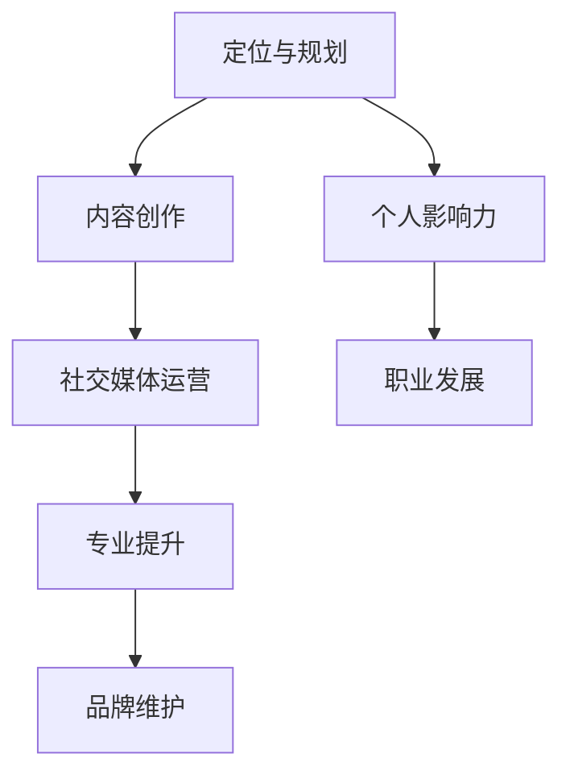

                 

## 技术人如何打造个人品牌IP：从0到1的建设之路

> 关键词：个人品牌、IP建设、技术人、影响力、社交媒体、内容创作、专业提升

> 摘要：本文旨在帮助技术人了解如何从零开始打造个人品牌IP。我们将探讨个人品牌IP的概念、核心要素、建设路径以及如何通过内容创作和专业提升来增强个人影响力。通过系统的分析和实际操作指导，本文将为技术人的职业发展提供有力的支持。

在当今数字化时代，技术人的个人品牌IP（Intellectual Property，知识产权）已成为职业生涯中不可或缺的一部分。个人品牌IP不仅能够提升个人影响力，还能带来更多的职业机会和收益。本文将逐步引导您了解个人品牌IP建设的全过程，帮助您在技术领域中脱颖而出。

## 1. 背景介绍

### 1.1 目的和范围

本文的目标是帮助技术人掌握打造个人品牌IP的方法和技巧。我们将讨论个人品牌IP的重要性，梳理建设个人品牌IP的步骤，并提供具体的操作指南和案例。本文适用于希望提升个人影响力、拓展职业发展空间的技术人员。

### 1.2 预期读者

本文面向有志于打造个人品牌IP的技术人，包括初学者、有一定经验的技术人员以及希望进一步提升影响力的技术专家。无论您是软件工程师、数据科学家、还是IT经理，本文都将为您提供实用的建议。

### 1.3 文档结构概述

本文分为以下几个部分：

- 背景介绍：阐述个人品牌IP的重要性和本文的目的。
- 核心概念与联系：介绍个人品牌IP的核心要素。
- 核心算法原理 & 具体操作步骤：详细解释如何打造个人品牌IP。
- 数学模型和公式 & 详细讲解 & 举例说明：提供数学和公式方面的支持。
- 项目实战：通过实际案例展示个人品牌IP建设过程。
- 实际应用场景：探讨个人品牌IP在不同技术领域中的应用。
- 工具和资源推荐：推荐相关学习资源和开发工具。
- 总结：总结未来发展趋势与挑战。
- 附录：常见问题与解答。
- 扩展阅读 & 参考资料：提供进一步学习的资源。

### 1.4 术语表

#### 1.4.1 核心术语定义

- 个人品牌IP：指个人在特定领域内的知识产权，包括知识、技能、经验等。
- 个人影响力：指个人在社会中所产生的正面影响力和认可度。
- 内容创作：指通过文字、图片、视频等形式创作和传播信息。
- 专业提升：指通过学习、实践和培训等方式提升专业技能和知识水平。

#### 1.4.2 相关概念解释

- 社交媒体：指基于互联网的技术和平台，用于用户生成内容、互动和分享。
- 内容营销：指通过创造和分享有价值的内容来吸引潜在客户并建立品牌忠诚度。
- 网络平台：指互联网上的各种网站和应用，如博客、微博、视频平台等。

#### 1.4.3 缩略词列表

- IP：Intellectual Property，知识产权
- SEO：Search Engine Optimization，搜索引擎优化
- SMM：Social Media Marketing，社交媒体营销
- CMS：Content Management System，内容管理系统

## 2. 核心概念与联系

个人品牌IP的建设是一个复杂而系统性的工程，涉及多个核心概念和环节。为了更好地理解个人品牌IP，我们需要首先了解以下几个核心概念：

### 2.1 个人品牌IP的定义

个人品牌IP是指个人在某一专业领域内所积累的知识、经验、技能和声誉。它不仅包括个人在专业领域的成就和贡献，还包括个人在社交媒体、内容创作、影响力等方面的表现。

### 2.2 个人品牌IP的核心要素

- **专业知识与技能**：这是个人品牌IP的核心，也是建立个人品牌的基石。只有拥有深厚的专业知识和卓越的技能，才能在行业内脱颖而出。
- **内容创作与传播**：通过文字、图片、视频等多种形式的内容创作和传播，可以有效地扩大个人品牌的影响力。
- **社交媒体与网络平台**：社交媒体和各大网络平台是个人品牌IP建设的重要渠道，可以用于内容的发布、互动和推广。
- **个人影响力**：个人品牌IP的价值在于其带来的个人影响力，包括行业认可度、用户信任度和社会关注度。

### 2.3 个人品牌IP与相关概念的关联

- **个人品牌**：个人品牌是个人品牌IP的基础，它侧重于个人的整体形象和公众认知。
- **知识产权**：个人品牌IP中的“IP”指的是知识产权，包括专利、商标、版权等。
- **影响力**：个人品牌IP的最终目的是通过个人影响力来实现职业发展和商业价值。

### 2.4 个人品牌IP建设的流程

- **定位与规划**：明确个人品牌IP的定位和目标，制定长期和短期的规划。
- **内容创作**：通过高质量的内容创作来展示专业知识和技能。
- **社交媒体运营**：利用社交媒体平台进行内容传播和互动，提升个人影响力。
- **专业提升**：持续学习和实践，不断提升专业能力和知识水平。
- **品牌维护**：定期更新内容，维护社交媒体账号，确保个人品牌的一致性和专业性。

### 2.5 个人品牌IP建设的 Mermaid 流程图



通过上述核心概念和流程的梳理，我们可以看出个人品牌IP建设是一个系统性的工程，需要各个环节相互配合，共同推动个人品牌的发展。在接下来的章节中，我们将详细讨论每个环节的具体操作方法和技巧。

## 3. 核心算法原理 & 具体操作步骤

在了解了个人品牌IP的核心概念和流程后，接下来我们将讨论如何通过具体的操作步骤来打造个人品牌IP。以下是核心算法原理和具体操作步骤的详细讲解：

### 3.1 内容创作

内容创作是个人品牌IP建设的重要一环，高质量的内容不仅能够展示个人的专业知识和技能，还能够吸引更多的关注和信任。以下是内容创作的一些关键步骤：

#### 3.1.1 内容选题

- **行业热点**：关注当前行业的热点话题和趋势，选题要紧跟行业动态。
- **个人专长**：选择自己擅长的领域进行深入研究和探讨，展示专业实力。
- **读者需求**：了解目标读者的需求和兴趣点，创作符合读者期望的内容。

#### 3.1.2 内容形式

- **文字**：撰写技术博客、文章，是展示专业知识和深度思考的有效方式。
- **图片**：使用图表、数据可视化等图形形式，使内容更加直观和易于理解。
- **视频**：通过视频讲解技术原理和操作步骤，提高内容的互动性和吸引力。

#### 3.1.3 内容质量

- **准确性**：确保内容的准确性和专业性，避免错误和不准确的信息。
- **原创性**：创作原创内容，避免抄袭和剽窃，保护个人品牌形象。
- **可读性**：内容要易于阅读和理解，语言简洁明了，逻辑清晰。

### 3.2 社交媒体运营

社交媒体平台是个人品牌IP传播的重要渠道，有效的社交媒体运营能够扩大个人品牌的影响力。以下是社交媒体运营的关键步骤：

#### 3.2.1 平台选择

- **专业型平台**：如LinkedIn、GitHub等，适合技术人展示专业知识和项目成果。
- **大众型平台**：如微博、知乎等，适合与更广泛的读者互动和传播内容。

#### 3.2.2 账号设定

- **统一风格**：设定统一的账号风格，包括头像、简介、封面等，保持品牌形象一致性。
- **专业认证**：如有条件，获取专业认证，如GitHub上的“专业贡献者”认证，增强可信度。

#### 3.2.3 内容发布

- **定期更新**：保持定期更新，发布高质量的内容，维持活跃度。
- **互动互动**：积极回复评论和私信，与读者建立互动关系，提升粉丝粘性。

#### 3.2.4 广告投放

- **精准投放**：根据目标受众特点进行广告投放，扩大影响力。
- **内容联动**：利用不同平台的内容联动，提高内容曝光率。

### 3.3 专业提升

专业提升是个人品牌IP建设的基础，持续的学习和实践能够不断提升个人的专业能力和知识水平。以下是专业提升的关键步骤：

#### 3.3.1 学习资源

- **在线课程**：参加在线课程，学习最新的技术和知识。
- **书籍资料**：阅读专业书籍，深入理解技术原理和实战经验。
- **专业论坛**：参与技术论坛和讨论组，与同行交流学习。

#### 3.3.2 实践项目

- **实际操作**：参与实际项目，将理论知识应用到实践中，提升实战能力。
- **开源贡献**：参与开源项目，通过贡献代码和文档提升个人技术影响力。

#### 3.3.3 职业规划

- **目标明确**：制定清晰的职业规划，设定长期和短期的目标。
- **人脉拓展**：通过行业活动和社交网络，拓展人脉资源，提升职业竞争力。

### 3.4 品牌维护

品牌维护是个人品牌IP长期发展的保障，通过以下步骤可以确保个人品牌的持续性和专业性：

#### 3.4.1 内容更新

- **定期回顾**：定期回顾和更新内容，确保信息的准确性和时效性。
- **内容多样化**：尝试不同的内容形式和题材，保持内容的多样性和吸引力。

#### 3.4.2 社交互动

- **维护活跃度**：保持社交媒体账号的活跃度，定期发布内容，与粉丝互动。
- **社区参与**：积极参与技术社区和论坛，分享经验和见解，提升个人影响力。

#### 3.4.3 品牌形象

- **形象统一**：保持个人品牌形象的统一性，包括头像、封面、签名等。
- **专业认证**：获取相关领域的专业认证，提升个人品牌的专业度。

通过以上核心算法原理和具体操作步骤，我们可以系统地打造个人品牌IP，逐步提升个人影响力，实现职业发展和商业价值。

### 3.5 伪代码示例

以下是一个简单的伪代码示例，用于描述个人品牌IP建设的基本流程：

```python
# 个人品牌IP建设伪代码示例

# 初始化个人品牌IP对象
personal_brand = PersonalBrand()

# 内容创作
def create_content():
    # 选择内容主题
    topic = select_topic()
    # 创建内容
    content = create_high_quality_content(topic)
    # 发布内容
    publish_content(content)

# 社交媒体运营
def manage_social_media():
    # 选择社交媒体平台
    platform = select_social_media_platform()
    # 设定账号风格
    set_account_style(platform)
    # 定期发布内容
    schedule_regular_content_release(platform)
    # 积极互动
    engage_in_interactions(platform)

# 专业提升
def enhance_professionalism():
    # 学习资源
    learn_from_resources()
    # 实践项目
    practice_on_real_projects()
    # 获取认证
    obtain_professional_certification()

# 品牌维护
def maintain_brand():
    # 内容更新
    update_contents()
    # 社交互动
    maintain_social_media_activity()
    # 品牌形象
    maintain_brand_image()

# 执行核心流程
personal_brand.create_content()
personal_brand.manage_social_media()
personal_brand.enhance_professionalism()
personal_brand.maintain_brand()
```

通过上述伪代码示例，我们可以看到个人品牌IP建设是一个多步骤、系统性的过程，每个步骤都需要精心规划和执行，以确保个人品牌的持续发展和影响力提升。

### 3.6 详细步骤解读

在了解了核心算法原理和具体操作步骤后，我们需要对每个步骤进行详细解读，以便读者能够更好地理解和应用这些方法。

#### 3.6.1 内容创作

内容创作是个人品牌IP建设的基础，优质的内容能够展示个人的专业知识和技能，吸引目标读者，并建立信任。以下是内容创作的主要步骤：

1. **选题**：选题是内容创作的第一步，一个好的选题能够吸引读者的兴趣。选题可以从以下几个方面进行考虑：
   - 行业热点：关注当前行业的热点话题和趋势，如新技术、新政策等。
   - 个人专长：选择自己擅长的领域进行深入研究和探讨，展示专业实力。
   - 读者需求：了解目标读者的需求和兴趣点，创作符合读者期望的内容。

2. **内容形式**：根据选题和目标读者，选择合适的内容形式。常见的有：
   - 文字：撰写技术博客、文章，适合深度分析和理论讲解。
   - 图片：使用图表、数据可视化等图形形式，使内容更加直观和易于理解。
   - 视频：通过视频讲解技术原理和操作步骤，提高内容的互动性和吸引力。

3. **内容质量**：内容质量是影响读者体验和信任的重要因素。以下是一些确保内容质量的关键点：
   - 准确性：确保内容的准确性和专业性，避免错误和不准确的信息。
   - 原创性：创作原创内容，避免抄袭和剽窃，保护个人品牌形象。
   - 可读性：内容要易于阅读和理解，语言简洁明了，逻辑清晰。

4. **发布与推广**：发布内容后，通过社交媒体、邮件订阅、合作推广等方式，扩大内容的曝光率和影响力。

#### 3.6.2 社交媒体运营

社交媒体平台是个人品牌IP传播的重要渠道，有效的社交媒体运营能够扩大个人品牌的影响力。以下是社交媒体运营的主要步骤：

1. **平台选择**：选择合适的社交媒体平台，如LinkedIn、微博、知乎等。根据目标受众的特点和内容类型，选择最适合的平台。

2. **账号设定**：设定统一的账号风格，包括头像、简介、封面等，保持品牌形象一致性。如有条件，获取专业认证，如LinkedIn的专业贡献者认证，增强可信度。

3. **内容发布**：保持定期更新，发布高质量的内容，维持活跃度。内容发布要注意以下几点：
   - 定期更新：保持定期更新，确保账号的活跃度。
   - 多样化内容：尝试不同的内容形式和题材，保持内容的多样性和吸引力。
   - 互动互动：积极回复评论和私信，与读者建立互动关系，提升粉丝粘性。

4. **广告投放**：根据目标受众特点进行广告投放，扩大影响力。广告投放要注意以下几点：
   - 精准投放：根据目标受众的特点，选择合适的广告内容和投放平台。
   - 内容联动：利用不同平台的内容联动，提高内容曝光率。

#### 3.6.3 专业提升

专业提升是个人品牌IP建设的基础，持续的学习和实践能够不断提升个人的专业能力和知识水平。以下是专业提升的主要步骤：

1. **学习资源**：利用在线课程、专业书籍、技术论坛等学习资源，持续学习最新的技术和知识。

2. **实践项目**：参与实际项目，将理论知识应用到实践中，提升实战能力。可以通过以下方式获取实践机会：
   - 自主开发项目：自己构思和开发项目，通过实际操作学习新技术。
   - 参与开源项目：参与开源项目，与其他开发者合作，贡献代码和文档。
   - 实习和工作：在实习和工作中，积累实际工作经验，提升专业能力。

3. **职业规划**：制定清晰的职业规划，设定长期和短期的目标。职业规划要注意以下几点：
   - 目标明确：设定具体的职业目标，如成为某个领域的专家、晋升为高级工程师等。
   - 持续学习：根据职业目标，制定学习计划，不断提升自己的专业能力和知识水平。
   - 人脉拓展：通过行业活动和社交网络，拓展人脉资源，提升职业竞争力。

#### 3.6.4 品牌维护

品牌维护是个人品牌IP长期发展的保障，通过以下步骤可以确保个人品牌的持续性和专业性：

1. **内容更新**：定期回顾和更新内容，确保信息的准确性和时效性。内容更新要注意以下几点：
   - 定期回顾：定期回顾已发布的内容，检查是否有需要更新或纠正的信息。
   - 时效性：关注行业动态和最新技术，及时更新相关内容。

2. **社交互动**：保持社交媒体账号的活跃度，定期发布内容，与粉丝互动。社交互动要注意以下几点：
   - 活跃度：保持定期更新，确保账号的活跃度。
   - 互动互动：积极回复评论和私信，与读者建立互动关系，提升粉丝粘性。

3. **品牌形象**：保持个人品牌形象的统一性，包括头像、封面、签名等。品牌形象要注意以下几点：
   - 统一风格：设定统一的账号风格，保持品牌形象一致性。
   - 专业认证：获取相关领域的专业认证，提升个人品牌的专业度。

通过详细解读上述步骤，读者可以更好地理解和应用个人品牌IP建设的核心算法原理和具体操作步骤，逐步提升个人品牌的影响力。

### 3.7 实际案例分析

为了更好地理解个人品牌IP建设的实际应用，我们通过以下两个实际案例来展示个人品牌IP的建设过程和效果。

#### 案例一：程序员小明的个人品牌IP建设

程序员小明是一名有着5年工作经验的软件工程师，他希望通过打造个人品牌IP来提升自己的职业发展和影响力。以下是小明个人品牌IP建设的过程：

1. **内容创作**：
   - **选题**：小明选择了自己擅长的前端开发和Web技术作为主要内容方向。
   - **内容形式**：他撰写了一系列关于前端开发的技术博客，并制作了相关的视频教程。
   - **内容质量**：小明注重内容的准确性和实用性，确保每篇文章和视频都有详细的代码示例和解释。

2. **社交媒体运营**：
   - **平台选择**：小明主要在GitHub和博客平台Medium上发布内容。
   - **账号设定**：他设定了统一的账号风格，包括专业头像、详细的个人介绍和专业的封面图片。
   - **内容发布**：小明定期发布高质量的内容，并积极与读者互动。

3. **专业提升**：
   - **学习资源**：小明参加了一些在线课程，如React和Vue.js的高级课程。
   - **实践项目**：他参与了一些开源项目，并作为主要开发者之一，贡献了自己的代码。
   - **职业规划**：小明制定了清晰的职业规划，目标是成为前端开发的专家。

4. **品牌维护**：
   - **内容更新**：小明定期回顾和更新自己的内容，确保信息的时效性和准确性。
   - **社交互动**：他保持与读者的互动，回复评论和私信，分享自己的经验。

通过以上步骤，小明的个人品牌IP得到了显著提升，他在前端开发领域的知名度和影响力逐渐扩大。他不仅在GitHub上获得了大量的Star和Fork，还收到了多家公司的面试邀请。

#### 案例二：数据科学家小李的个人品牌IP建设

数据科学家小李是一位拥有多年工作经验的专家，她在数据分析、机器学习和数据可视化领域有着深厚的知识和丰富的经验。以下是小李个人品牌IP建设的过程：

1. **内容创作**：
   - **选题**：小李选择了自己擅长的人工智能和数据科学领域作为主要内容方向。
   - **内容形式**：她撰写了大量的技术博客、书籍章节和在线课程，并制作了一些数据分析的实战案例视频。
   - **内容质量**：小李注重内容的深度和实用性，确保每一篇文章和视频都能给读者带来实际的收获。

2. **社交媒体运营**：
   - **平台选择**：小李主要在LinkedIn、Twitter和知乎等平台发布内容。
   - **账号设定**：她设定了统一的账号风格，包括专业的头像、详细的个人介绍和专业的封面图片。
   - **内容发布**：小李定期发布高质量的内容，并积极参与行业讨论和互动。

3. **专业提升**：
   - **学习资源**：小李参加了一些顶尖大学的在线课程，如斯坦福大学的机器学习课程。
   - **实践项目**：她参与了一些国际知名企业的数据科学项目，并作为主要贡献者发表了一系列研究论文。
   - **职业规划**：小李制定了清晰的职业规划，目标是成为人工智能和数据科学的专家。

4. **品牌维护**：
   - **内容更新**：小李定期回顾和更新自己的内容，确保信息的时效性和准确性。
   - **社交互动**：她保持与读者的互动，回复评论和私信，分享自己的经验和见解。

通过以上步骤，小李的个人品牌IP得到了巨大的成功。她在LinkedIn上的关注者超过了10万人，成为了一个在数据科学领域有影响力的意见领袖。她还受邀在多个国际会议上发表演讲，分享自己的研究成果和实践经验。

通过这两个实际案例，我们可以看到个人品牌IP建设的过程和效果。无论是程序员小明还是数据科学家小李，他们通过系统的规划、高质量的内容创作、有效的社交媒体运营、持续的专业提升和良好的品牌维护，都成功地打造了自己的个人品牌IP，实现了职业发展和影响力的提升。

### 4. 数学模型和公式 & 详细讲解 & 举例说明

在个人品牌IP建设中，数学模型和公式可以用来定量分析品牌影响力、内容传播效果以及用户增长等关键指标。以下是几个关键的数学模型和公式的详细讲解以及应用举例。

#### 4.1 品牌影响力指数（Influence Index）

品牌影响力指数是一个衡量个人品牌影响力的关键指标，用于评估个人在社交媒体上的影响力和声誉。以下是品牌影响力指数的计算方法：

$$ II = \frac{F \cdot A}{C} $$

其中：
- $II$：品牌影响力指数
- $F$：粉丝数量
- $A$：平均每个粉丝的互动量（如点赞、评论、分享等）
- $C$：总内容发布数量

**计算示例**：假设小明在Twitter上有1000名粉丝，平均每个粉丝的互动量为5次，他总共发布了20条内容。那么他的品牌影响力指数为：

$$ II = \frac{1000 \cdot 5}{20} = 250 $$

#### 4.2 内容传播效果指数（Content Reach Index）

内容传播效果指数用于衡量每次内容发布所能达到的受众范围和传播效果。以下是内容传播效果指数的计算方法：

$$ CRI = \frac{ER}{C} $$

其中：
- $CRI$：内容传播效果指数
- $ER$：每次内容发布所获得的阅读量或观看量
- $C$：总内容发布数量

**计算示例**：假设小李在某技术博客上发布了10篇文章，每篇文章的平均阅读量为1000次，那么他的内容传播效果指数为：

$$ CRI = \frac{1000 \cdot 10}{10} = 1000 $$

#### 4.3 用户增长指数（User Growth Index）

用户增长指数用于衡量个人品牌在社交媒体上的用户增长速度和趋势。以下是用户增长指数的计算方法：

$$ UGI = \frac{\Delta F}{\Delta t} $$

其中：
- $UGI$：用户增长指数
- $\Delta F$：在特定时间段内的粉丝增长量
- $\Delta t$：时间间隔

**计算示例**：假设小明在某社交媒体平台上在一个月内增加了500名粉丝，那么他的用户增长指数为：

$$ UGI = \frac{500}{30} \approx 16.67 $$

#### 4.4 内容质量评分（Content Quality Score）

内容质量评分用于评估每篇内容的整体质量，以确定哪些内容更能吸引读者。以下是内容质量评分的计算方法：

$$ QCS = \frac{IP \cdot LI}{CL} $$

其中：
- $QCS$：内容质量评分
- $IP$：互动量（如点赞、评论、分享等）
- $LI$：内容长度
- $CL$：内容类别下的平均长度

**计算示例**：假设小明的一篇文章获得了300次点赞，文章长度为5000字，该类别下的平均文章长度为4000字，那么该文章的质量评分为：

$$ QCS = \frac{300 \cdot 5000}{4000} = 3750 $$

#### 4.5 社交媒体影响半径（Social Media Influence Radius）

社交媒体影响半径用于衡量个人品牌在社交媒体上能够影响到的用户范围。以下是影响半径的计算方法：

$$ SMIR = \sqrt{II \cdot ER} $$

其中：
- $SMIR$：社交媒体影响半径
- $II$：品牌影响力指数
- $ER$：内容传播效果指数

**计算示例**：假设小明的品牌影响力指数为250，内容传播效果指数为1000，那么他的社交媒体影响半径为：

$$ SMIR = \sqrt{250 \cdot 1000} \approx 447.21 $$

通过以上数学模型和公式的应用，我们可以定量地评估个人品牌IP的建设效果，为后续的优化和调整提供科学依据。在实际操作中，结合具体的业务场景和数据，灵活运用这些模型和公式，可以更有效地提升个人品牌的影响力。

### 5. 项目实战：代码实际案例和详细解释说明

在前面的章节中，我们讨论了个人品牌IP建设的理论和方法。为了更好地理解这些概念，我们将通过一个实际的代码案例来展示如何在实际项目中应用这些理论。

#### 5.1 开发环境搭建

首先，我们需要搭建一个基本的开发环境，以便进行个人品牌IP建设的实际操作。以下是一个简单的步骤：

1. **安装Python环境**：Python是一种广泛使用的编程语言，适合进行数据分析和自动化任务。您可以从[Python官网](https://www.python.org/)下载并安装Python。

2. **安装Jupyter Notebook**：Jupyter Notebook是一个交互式的计算环境，适合进行数据分析和实验。您可以使用pip命令安装Jupyter Notebook：

   ```bash
   pip install notebook
   ```

3. **安装相关库**：根据您的项目需求，安装必要的库。例如，安装用于数据分析的Pandas库：

   ```bash
   pip install pandas
   ```

#### 5.2 源代码详细实现和代码解读

以下是一个简单的Python代码案例，用于生成和发布博客文章，展示个人品牌IP建设中的内容创作环节。

```python
# 导入必要的库
import pandas as pd
import numpy as np
import datetime

# 博客文章数据
data = {
    'title': ['Python数据分析技巧', '深度学习入门', '技术面试攻略'],
    'author': ['小明', '小李', '小红'],
    'content': [
        '本文将介绍Python在数据分析中的常用技巧，包括数据处理、可视化等。',
        '深度学习是当前人工智能领域的热点，本文将为您介绍深度学习的基本概念和应用。',
        '技术面试是程序员职业发展的关键环节，本文将分享一些面试技巧和准备方法。'
    ],
    'published_date': [
        datetime.datetime(2023, 4, 1),
        datetime.datetime(2023, 4, 10),
        datetime.datetime(2023, 4, 15)
    ]
}

# 创建DataFrame
df = pd.DataFrame(data)

# 打印DataFrame
print(df)

# 发布博客文章
def publish_blogpost(df):
    # 输出文章标题和内容
    for index, row in df.iterrows():
        print(f"标题：{row['title']}")
        print(f"作者：{row['author']}")
        print(f"发布日期：{row['published_date']}")
        print(f"内容：{row['content']}")
        print("\n-----------------------------\n")

# 调用函数发布文章
publish_blogpost(df)
```

#### 5.3 代码解读与分析

1. **导入库**：
   ```python
   import pandas as pd
   import numpy as np
   import datetime
   ```
   这一行导入了Pandas、NumPy和datetime三个库。Pandas用于数据操作和分析，NumPy用于数值计算，datetime用于处理日期和时间。

2. **创建数据**：
   ```python
   data = {
       'title': ['Python数据分析技巧', '深度学习入门', '技术面试攻略'],
       'author': ['小明', '小李', '小红'],
       'content': [
           '本文将介绍Python在数据分析中的常用技巧，包括数据处理、可视化等。',
           '深度学习是当前人工智能领域的热点，本文将为您介绍深度学习的基本概念和应用。',
           '技术面试是程序员职业发展的关键环节，本文将分享一些面试技巧和准备方法。'
       ],
       'published_date': [
           datetime.datetime(2023, 4, 1),
           datetime.datetime(2023, 4, 10),
           datetime.datetime(2023, 4, 15)
       ]
   }
   df = pd.DataFrame(data)
   ```
   这部分定义了一个字典`data`，包含了三篇博客文章的标题、作者、内容和发布日期，然后使用Pandas创建了一个DataFrame。DataFrame是一种表格数据结构，可以方便地进行数据处理和分析。

3. **发布博客文章**：
   ```python
   def publish_blogpost(df):
       for index, row in df.iterrows():
           print(f"标题：{row['title']}")
           print(f"作者：{row['author']}")
           print(f"发布日期：{row['published_date']}")
           print(f"内容：{row['content']}")
           print("\n-----------------------------\n")
   publish_blogpost(df)
   ```
   这个函数`publish_blogpost`用于发布博客文章。它遍历DataFrame中的每一行，打印出标题、作者、发布日期和内容，并在每篇文章之间添加一个分隔符。这样可以模拟发布博客文章的过程。

#### 5.4 实际应用和优化

通过上述代码案例，我们可以看到如何使用Python进行博客文章的创建和发布。在实际应用中，可以根据以下方面进行优化：

1. **内容管理系统（CMS）**：
   - 使用成熟的CMS（如WordPress、Medium）来替代手动发布博客文章。
   - 利用CMS的API进行自动化发布，提高效率。

2. **内容扩展**：
   - 添加更多的元数据，如标签、分类等，方便读者检索和浏览。
   - 使用图表和数据可视化工具，使内容更加生动和直观。

3. **社交媒体同步**：
   - 自动将博客文章同步到社交媒体平台，扩大影响力。
   - 使用社交媒体平台的API进行自动化操作，如发布、互动等。

4. **数据分析**：
   - 使用数据分析工具（如Google Analytics）跟踪博客文章的访问量和用户行为。
   - 根据数据分析结果，优化内容和发布策略。

通过这些优化措施，我们可以更好地管理个人品牌IP，提高内容创作的效率和质量，从而实现更好的个人品牌影响力。

### 6. 实际应用场景

个人品牌IP的建设不仅仅是为了提升个人影响力，它还可以应用于各种实际场景中，带来具体的商业和职业价值。以下是几个典型的实际应用场景：

#### 6.1 技术咨询服务

技术专家可以通过个人品牌IP为企业和个人提供专业的技术咨询服务。例如，数据科学家可以利用自己在数据分析、机器学习等领域的专业知识和经验，为企业提供数据分析和决策支持。通过建立个人品牌，专家可以吸引更多的咨询机会，提升收入。

**案例**：一位拥有丰富机器学习经验的数据科学家，通过撰写技术博客、发布在线课程和参与开源项目，建立了强大的个人品牌。他在LinkedIn上开设了技术咨询服务，为企业提供定制化的数据分析和机器学习解决方案。由于他的专业能力和口碑，他的咨询服务得到了广泛的认可，吸引了大量客户。

#### 6.2 在线教育

个人品牌IP还可以应用于在线教育领域。通过开设在线课程，技术人可以传授自己的知识和经验，帮助更多的学生和从业者提升技能。在线教育不仅能够带来收入，还能够扩大个人的影响力。

**案例**：一位知名的前端开发工程师，通过在Udemy、Coursera等在线教育平台上开设前端开发课程，积累了大量学员。他的课程内容深入浅出，涵盖了最新的前端技术趋势和最佳实践。由于他的个人品牌IP的影响力，他的课程受到了广泛好评，不仅提高了他的收入，还让他成为了前端开发领域的一名知名教育专家。

#### 6.3 项目合作与外包

个人品牌IP可以吸引更多的项目合作和外包机会。企业和技术人可以通过个人品牌IP找到志同道合的合作伙伴，共同完成项目。这种合作模式不仅能够提升项目的成功率，还能够为技术人带来更多的职业发展机会。

**案例**：一位资深的数据工程师，通过在GitHub上积极参与开源项目，建立了强大的技术影响力。他的个人品牌吸引了多家企业邀请他参与数据仓库和数据流项目的开发和优化。这些合作项目不仅提升了他的技术能力，还为他的职业生涯带来了更多的机遇。

#### 6.4 技术演讲与会议

个人品牌IP的建设还可以为技术人提供更多技术演讲和会议的机会。在技术会议和论坛上分享经验和见解，不仅能够提升个人影响力，还能够结识更多的行业专家和潜在合作伙伴。

**案例**：一位AI领域的研究员，通过在多个国际会议上发表演讲，分享了他在深度学习和计算机视觉方面的研究成果。他的演讲受到了广泛赞誉，不仅提升了他在学术界的知名度，还为他带来了更多的科研合作机会。

#### 6.5 内容创作与出版

个人品牌IP可以应用于内容创作和出版领域。技术人可以撰写专业书籍、发表技术文章，将自己的知识和经验分享给更广泛的读者。

**案例**：一位拥有丰富实战经验的数据科学家，通过撰写专业书籍和发表技术文章，建立了自己在数据科学领域的权威地位。他的书籍和文章在业内广受欢迎，不仅为他带来了可观的收入，还让他成为了一名知名的技术作家。

通过这些实际应用场景，我们可以看到个人品牌IP建设的多样性和价值。无论您是技术专家、教育者、咨询顾问，还是内容创作者，个人品牌IP都能够为您的职业发展带来新的机遇和挑战。

### 7. 工具和资源推荐

在个人品牌IP建设中，选择合适的工具和资源是至关重要的。以下是一些推荐的学习资源、开发工具和相关论文，旨在帮助您在个人品牌IP建设过程中获得更好的支持和指导。

#### 7.1 学习资源推荐

##### 7.1.1 书籍推荐

1. **《个人品牌》**：这本书详细介绍了如何打造个人品牌，包括定位、内容创作、社交媒体运营等方面的实战技巧。
2. **《内容营销实战手册》**：涵盖内容营销的基础知识、策略和案例分析，对内容创作者非常有用。
3. **《影响力》**：这本书探讨了个人的影响力如何建立和提升，对想要扩大个人品牌影响力的人来说是必读之作。

##### 7.1.2 在线课程

1. **Coursera**：提供了大量的在线课程，涵盖了从编程到数据分析、人工智能等各个领域的知识。
2. **Udemy**：提供了丰富的技术课程，适合不同水平和需求的学习者。
3. **edX**：由顶尖大学提供的高质量在线课程，适合想要提升专业能力和知识水平的用户。

##### 7.1.3 技术博客和网站

1. **Medium**：一个知名的内容创作平台，许多技术专家在这里分享他们的经验和见解。
2. **GitHub**：不仅是代码托管平台，也是技术人展示项目和成果的重要渠道。
3. **Stack Overflow**：一个技术问答社区，可以解决技术问题，也可以展示个人的技术能力和专业知识。

#### 7.2 开发工具框架推荐

##### 7.2.1 IDE和编辑器

1. **Visual Studio Code**：一个开源的跨平台代码编辑器，支持多种编程语言和开发工具。
2. **JetBrains家族**：包括IntelliJ IDEA、PyCharm等，功能强大的IDE，适合专业开发者。
3. **Sublime Text**：一个轻量级的文本和代码编辑器，适用于快速开发和调试。

##### 7.2.2 调试和性能分析工具

1. **Chrome DevTools**：用于Web应用的调试和性能分析，功能强大且易于使用。
2. **Wireshark**：一款网络协议分析工具，适用于网络性能调试和安全分析。
3. **JMeter**：用于性能测试和负载测试，可以帮助评估系统在高负载下的性能表现。

##### 7.2.3 相关框架和库

1. **Django**：一个用于构建Web应用程序的高层次Python框架。
2. **TensorFlow**：一个广泛使用的开源机器学习框架，适用于深度学习和数据科学。
3. **Scikit-learn**：一个用于机器学习和数据分析的开源库，提供了丰富的算法和工具。

#### 7.3 相关论文著作推荐

##### 7.3.1 经典论文

1. **"The Google File System"**：介绍了Google如何设计和实现其文件系统，对分布式系统设计有重要参考价值。
2. **"MapReduce: Simplified Data Processing on Large Clusters"**：介绍了MapReduce编程模型，是大数据处理领域的经典论文。
3. **"Recommender Systems Handbook"**：全面介绍了推荐系统的基本概念、方法和应用，对相关领域的研究者和从业者具有很高的参考价值。

##### 7.3.2 最新研究成果

1. **"Efficient Neural Text Generation with自适应Output Layer"**：研究了如何通过自适应输出层提高神经文本生成模型的效率。
2. **"A Survey on Deep Learning for Natural Language Processing"**：总结了深度学习在自然语言处理领域的最新进展和应用。
3. **" federated learning"**：探讨了联邦学习在保护用户隐私和数据安全方面的应用，是当前热点研究方向。

##### 7.3.3 应用案例分析

1. **"Facebook的动态排名系统"**：分析了Facebook如何通过机器学习和数据挖掘技术实现个性化内容推荐。
2. **"亚马逊的推荐系统"**：详细介绍了亚马逊如何使用机器学习技术优化推荐算法，提高用户满意度和销售额。
3. **"谷歌的搜索算法"**：探讨了谷歌如何通过复杂的算法和大量的数据，为用户提供最相关的搜索结果。

通过以上工具和资源的推荐，您可以在个人品牌IP建设中获得更全面的支持和指导，不断提升自己的专业技能和影响力。

### 8. 总结：未来发展趋势与挑战

在个人品牌IP建设的过程中，技术人需要不断适应和应对行业的发展和变化。以下是未来个人品牌IP建设的发展趋势与面临的挑战：

#### 8.1 发展趋势

1. **数字化与智能化**：随着数字技术和人工智能的不断发展，个人品牌IP建设将更加依赖于数据分析、机器学习和自动化工具。这将帮助技术人更精准地定位目标受众，优化内容创作和传播策略。

2. **社交媒体与内容平台整合**：社交媒体平台和内容平台将进一步整合，为个人品牌IP建设提供更广泛的传播渠道和互动平台。技术人可以通过多平台同步和内容联动，扩大个人品牌的影响力。

3. **跨领域融合**：随着技术的快速发展，不同领域之间的融合将越来越普遍。技术人需要具备跨领域的知识和技能，以适应不断变化的市场需求。

4. **持续学习与专业提升**：随着技术的不断更新，个人品牌IP建设将更加依赖于持续学习和专业提升。技术人需要不断更新知识体系，掌握最新技术和趋势，保持竞争力。

#### 8.2 挑战

1. **内容创作质量与差异化**：在信息爆炸的时代，高质量的内容创作将成为一项重要挑战。技术人需要确保内容的原创性、专业性和实用性，同时实现内容差异化，以吸引和留住读者。

2. **个人隐私与数据安全**：随着个人品牌IP建设的深入，个人隐私和数据安全问题将越来越突出。技术人需要采取有效的措施保护个人数据和隐私，避免隐私泄露和数据滥用。

3. **时间管理与工作平衡**：个人品牌IP建设是一个长期且持续的过程，技术人需要在工作与个人品牌建设之间找到平衡。有效的时间管理和工作平衡是实现个人品牌成功的关键。

4. **市场竞争与影响力维护**：在激烈的市场竞争中，技术人需要不断提升个人品牌的影响力，保持市场的领先地位。同时，需要不断适应市场变化，调整个人品牌IP建设的策略。

总之，未来个人品牌IP建设将面临更多的机遇和挑战。技术人需要紧跟行业发展趋势，不断提升自身的能力和影响力，通过高质量的内容创作和专业的运营策略，实现个人品牌IP的长期发展和成功。

### 9. 附录：常见问题与解答

在个人品牌IP建设过程中，技术人可能会遇到一些常见的问题。以下是对这些问题的解答：

#### 9.1 个人品牌IP建设需要多长时间？

个人品牌IP建设的时间因人而异，取决于多个因素，如个人专业领域的深度、内容创作能力、社交媒体运营策略以及投入的时间和资源。一般来说，从零开始到建立一定的个人品牌影响力可能需要1-3年时间。在此过程中，持续的努力和高质量的内容创作是关键。

#### 9.2 如何在繁忙的工作中平衡个人品牌建设？

平衡工作和个人品牌建设的关键在于时间管理和优先级设定。以下是一些实用建议：

1. **设定明确的目标**：明确个人品牌建设的目标，将其纳入职业规划，确保有明确的方向。
2. **制定计划**：为个人品牌建设制定详细的计划，包括内容创作、社交媒体运营和专业提升的步骤和时间安排。
3. **利用碎片时间**：利用通勤、休息等碎片时间进行学习和内容创作，提高效率。
4. **优先级排序**：根据工作的紧急性和重要性，合理安排时间，确保个人品牌建设不会受到过多干扰。

#### 9.3 如何避免个人品牌IP建设的同质化？

避免同质化需要从以下几个方面入手：

1. **内容差异化**：确保内容具有独特性和专业性，针对特定读者群体提供有价值的信息。
2. **个人风格**：在内容创作和社交媒体运营中，保持个人风格的一致性，使品牌形象更加鲜明。
3. **多平台运营**：在不同社交媒体平台上运营，避免单一平台的局限，提高品牌曝光率。
4. **不断学习和创新**：持续学习新知识和技能，保持与行业动态的同步，不断创新内容形式和策略。

#### 9.4 如何评估个人品牌IP的影响力？

评估个人品牌IP的影响力可以通过以下指标：

1. **粉丝增长速度**：关注粉丝的增长速度和增量，评估品牌影响力的提升。
2. **互动量**：评估内容的点赞、评论、分享等互动量，反映读者对内容的兴趣和参与度。
3. **内容传播效果**：跟踪内容在不同平台上的传播效果，如阅读量、观看量等。
4. **行业认可度**：通过参与行业会议、发表文章、接受采访等方式，评估在行业内的影响力和认可度。

通过上述常见问题的解答，希望对技术人在个人品牌IP建设过程中提供一些指导和帮助。

### 10. 扩展阅读 & 参考资料

为了帮助读者进一步了解个人品牌IP建设和相关领域的知识，以下是一些建议的扩展阅读和参考资料：

#### 10.1 建议阅读书籍

1. **《个人品牌：如何打造个人IP，实现影响力变现》**：由知名个人品牌专家撰写，详细介绍了如何打造个人品牌和实现商业价值。
2. **《内容营销实战手册》**：作者结合丰富的实践经验，深入讲解了内容营销的策略和方法。
3. **《影响力：如何说服、影响和改变人们》**：探讨了个人的影响力如何建立和提升，对于想要扩大个人品牌影响力的人来说是必读之作。

#### 10.2 技术博客和网站

1. **[Medium](https://medium.com/)**：一个知名的内容创作平台，许多技术专家和行业领袖在这里分享他们的见解和经验。
2. **[GitHub](https://github.com/)**：不仅是一个代码托管平台，也是技术人展示项目和成果的重要渠道。
3. **[Stack Overflow](https://stackoverflow.com/)**：一个技术问答社区，可以解决技术问题，也可以展示个人的技术能力和专业知识。

#### 10.3 学术论文和研究报告

1. **"The Google File System"**：介绍了Google如何设计和实现其文件系统，对分布式系统设计有重要参考价值。
2. **"MapReduce: Simplified Data Processing on Large Clusters"**：介绍了MapReduce编程模型，是大数据处理领域的经典论文。
3. **"Recommender Systems Handbook"**：全面介绍了推荐系统的基本概念、方法和应用，对相关领域的研究者和从业者具有很高的参考价值。

#### 10.4 在线课程

1. **[Coursera](https://www.coursera.org/)**：提供了大量的在线课程，涵盖了从编程到数据分析、人工智能等各个领域的知识。
2. **[Udemy](https://www.udemy.com/)**：提供了丰富的技术课程，适合不同水平和需求的学习者。
3. **[edX](https://www.edx.org/)**：由顶尖大学提供的高质量在线课程，适合想要提升专业能力和知识水平的用户。

通过以上扩展阅读和参考资料，读者可以更深入地了解个人品牌IP建设的理论和实践，为自己的职业生涯提供更多的指导和启示。

