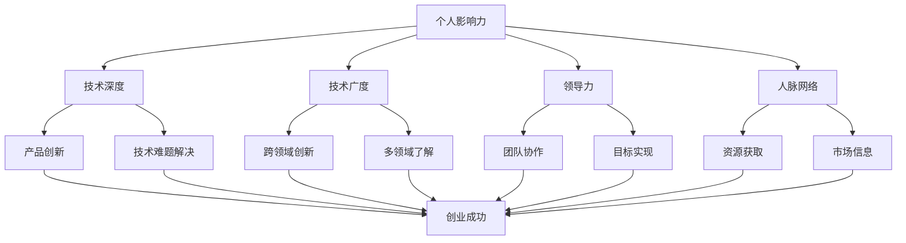

                 

## 1. 背景介绍

### 1.1 目的和范围

在信息技术快速发展的时代，个人影响力的提升成为了每一个技术人在职业发展中关注的焦点。本文旨在探讨技术人如何通过提升个人影响力来增加创业成功率，分析其中的核心因素和具体策略。我们将会深入探讨技术人在创业过程中所面临的问题，以及如何通过提升个人影响力来有效应对这些问题，从而提高创业的成功概率。

本文的目标读者主要是那些在信息技术领域拥有一定经验的技术人员，尤其是有志于创业的工程师、程序员、软件架构师以及CTO等。通过本文，读者将了解：

1. **个人影响力的重要性**：为什么个人影响力在创业过程中至关重要。
2. **核心策略与方法**：如何通过构建个人品牌、提升技术深度和广度、加强人脉网络等方式来提升个人影响力。
3. **实战案例分析**：通过实际案例，展示如何将上述策略应用于实际创业过程中。
4. **工具与资源推荐**：提供学习资源、开发工具框架以及相关论文著作推荐，以帮助读者进一步深入学习和实践。

### 1.2 预期读者

本文适合以下几类读者：

- **技术创业者**：正在或者计划创业的技术人员，希望通过提升个人影响力来增加创业成功的可能性。
- **技术团队成员**：在创业公司中担任核心技术角色，希望通过提升个人影响力来提升团队整体能力。
- **技术爱好者**：对技术领域有深厚兴趣，希望通过学习和实践来提升个人技术水平和创业能力。

通过本文，预期读者能够获得以下收益：

- **明确个人影响力的价值**：理解个人影响力在创业成功中的关键作用。
- **获得实战经验**：掌握一系列提升个人影响力的策略和方法，并将其应用于实际创业过程中。
- **拓展人脉和资源**：通过推荐的学习资源、开发工具框架和论文著作，进一步拓展学习和实践领域。

### 1.3 文档结构概述

为了帮助读者更好地理解和应用本文的内容，本文将分为以下几个部分：

1. **核心概念与联系**：通过Mermaid流程图，直观地展示技术人提升个人影响力与创业成功之间的核心概念和联系。
2. **核心算法原理 & 具体操作步骤**：详细介绍提升个人影响力的具体方法和步骤，使用伪代码来阐述。
3. **数学模型和公式 & 详细讲解 & 举例说明**：通过数学模型和公式，深入解析技术人在创业过程中如何通过提升个人影响力来增加成功率。
4. **项目实战：代码实际案例和详细解释说明**：提供实际项目案例，展示如何将理论应用到实际开发中，并进行详细解读。
5. **实际应用场景**：分析技术人在不同创业阶段如何利用个人影响力应对实际问题和挑战。
6. **工具和资源推荐**：推荐学习资源、开发工具框架和相关论文著作，以帮助读者深入学习和实践。
7. **总结：未来发展趋势与挑战**：总结本文的核心观点，并探讨未来发展趋势和面临的挑战。
8. **附录：常见问题与解答**：提供关于本文主题的常见问题及其解答，以帮助读者更好地理解和应用。
9. **扩展阅读 & 参考资料**：推荐相关扩展阅读资料，以供读者进一步学习和研究。

通过本文的结构化内容，读者将能够系统地了解如何提升个人影响力，并在创业过程中有效应用这些策略，提高创业成功率。

### 1.4 术语表

在本文中，我们将使用一些专业术语，为了帮助读者更好地理解和应用这些概念，以下是对这些术语的定义和解释：

#### 1.4.1 核心术语定义

- **个人影响力**：个人影响力是指一个人在团队、行业内或社会中能够引起他人关注、信任和认同的能力。
- **创业成功**：创业成功是指创业企业在产品或服务开发、市场拓展、盈利能力等方面达到预定目标，获得持续发展的能力。
- **品牌建设**：品牌建设是指通过一系列策略和活动，塑造个人或组织在公众心目中的形象和认知。
- **技术深度**：技术深度是指一个人在特定技术领域的专业程度和解决复杂问题的能力。
- **人脉网络**：人脉网络是指个人与他人之间建立的各种关系和联系，这些联系可以为个人提供资源、信息和机会。

#### 1.4.2 相关概念解释

- **技术广度**：技术广度是指一个人在多个技术领域的了解和掌握程度，有助于跨领域的创新和合作。
- **知识共享**：知识共享是指个人或组织通过讲座、撰写博客、发表论文等方式，将自己的知识和经验分享给他人。
- **社交网络**：社交网络是指通过社交媒体、专业社区和会议等渠道建立和拓展的人际关系网络。
- **领导力**：领导力是指一个人在团队中引导、激励和协调他人的能力，对团队目标和成果的实现有重要影响。

#### 1.4.3 缩略词列表

- **CTO**：首席技术官，负责企业技术创新和整体技术战略的制定与实施。
- **IDE**：集成开发环境，提供代码编辑、编译和调试等功能的一体化软件工具。
- **AI**：人工智能，指由计算机程序实现的智能行为，能够模拟、延伸和扩展人类的智能能力。
- **SaaS**：软件即服务，一种通过互联网提供软件服务的商业模式。

通过明确本文中使用的术语和概念，读者可以更好地理解文章的核心观点和内容，从而更加有效地提升个人影响力，增加创业成功率。

## 2. 核心概念与联系

在探讨技术人如何提升个人影响力以增加创业成功率之前，我们需要理解其中涉及到的核心概念和它们之间的联系。以下是这些核心概念以及它们之间的交互作用的详细描述，并通过Mermaid流程图来直观展示。

### 2.1 个人影响力

个人影响力是一个多维度的概念，它涵盖了个人在技术、商业、社交等多个领域的表现和认可。具体来说，个人影响力可以由以下几个要素构成：

- **技术深度**：个人在某一技术领域的专业知识和经验，解决复杂问题的能力。
- **技术广度**：个人在多个技术领域的了解和掌握程度，有助于跨领域的创新和合作。
- **领导力**：在团队中引导、激励和协调他人的能力，对团队目标和成果的实现有重要影响。
- **人脉网络**：通过社交网络建立和拓展的人际关系，为个人提供资源、信息和机会。

这些要素相互作用，共同构建了一个人的个人影响力。技术深度和技术广度决定了个人的专业能力，而领导力则体现了个人在团队中的影响力和执行力。人脉网络则提供了资源和信息，是个人影响力的重要基础。

### 2.2 创业成功

创业成功是一个复杂的过程，涉及到市场机会的识别、团队的组建、产品或服务的开发、市场推广和持续发展等多个方面。技术人在创业过程中的成功，离不开以下几个关键因素：

- **产品或服务创新**：提供有竞争力的产品或服务，满足市场需求。
- **市场定位**：准确识别目标市场，提供针对性的解决方案。
- **团队协作**：建立高效、协同的团队，共同实现创业目标。
- **资源获取**：获取资金、人才、技术等资源，支持创业企业的持续发展。

### 2.3 个人影响力与创业成功的联系

个人影响力与创业成功之间存在密切的联系。以下是个人影响力如何影响创业成功的详细解析：

- **品牌建设**：通过个人品牌的建设，提高个人在行业内的知名度和认可度，有助于吸引更多的资源和机会。
- **技术深度和广度**：深厚的专业知识和技术视野有助于更好地识别和抓住市场机会，推动产品创新。
- **领导力**：良好的领导力能够有效地组织和激励团队，提高团队协作效率，共同实现创业目标。
- **人脉网络**：广泛的人脉网络能够为创业企业提供多样化的资源和支持，如资金、人才、市场信息等。

### 2.4 Mermaid流程图

为了更直观地展示上述核心概念及其联系，我们使用Mermaid流程图来表示：



通过这个流程图，我们可以清晰地看到个人影响力的各个要素如何通过影响创业过程中的关键因素，最终促成创业成功。技术深度和技术广度帮助识别市场机会和推动产品创新；领导力确保团队的高效协作和目标实现；人脉网络则提供了所需的资源和支持，为创业成功奠定了坚实的基础。

理解这些核心概念及其联系，是技术人提升个人影响力、增加创业成功率的第一步。在接下来的章节中，我们将进一步探讨如何具体实现这一目标，通过算法原理、数学模型和实际案例来提供详细的操作步骤和策略。

## 3. 核心算法原理 & 具体操作步骤

在理解了个人影响力与创业成功的联系后，我们需要明确具体的操作步骤，以系统地提升个人影响力，进而增加创业成功率。以下是一个详细的算法原理和操作步骤的阐述，使用伪代码来展示核心流程。

### 3.1 算法原理

个人影响力的提升可以通过以下四个主要步骤实现：

1. **建立专业品牌**：通过专业知识和技能的积累，树立个人在特定领域的专业形象。
2. **拓展人脉网络**：通过社交活动和知识共享，建立和维护广泛的人际关系。
3. **提升领导能力**：通过培训和实际经验，提高在团队中的领导力和影响力。
4. **实现持续创新**：通过不断学习和技术突破，保持个人在技术前沿的地位。

### 3.2 具体操作步骤

以下为伪代码，详细描述提升个人影响力的具体步骤：

```python
# 伪代码：提升个人影响力算法

# 初始化变量
personal_influence = 0
brand_reputation = 0
network_size = 0
leadership_score = 0
technical_knowledge = 0

# 步骤1：建立专业品牌
def build_brand():
    brand_reputation += technical_knowledge
    publish_blog()
    give_talks()
    write_books()

# 步骤2：拓展人脉网络
def expand_network():
    network_size += add_new_contacts()
    share_knowledge()
    participate_in_events()

# 步骤3：提升领导能力
def enhance_leadership():
    leadership_score += attend_training()
    mentor_new_comers()
    lead_projects()

# 步骤4：实现持续创新
def continue_innovation():
    technical_knowledge += research_and_develop()
    collaborate_across_domains()
    stay_updated_with_trends()

# 步骤5：综合评估与优化
def evaluate_and_optimize():
    personal_influence = brand_reputation * network_size * leadership_score * technical_knowledge
    if personal_influence < target_influence:
        adjust_strategy()

# 功能实现
build_brand()
expand_network()
enhance_leadership()
continue_innovation()
evaluate_and_optimize()

# 输出结果
print("最终个人影响力评分：", personal_influence)
```

### 3.3 详细解释

#### 3.3.1 建立专业品牌

建立专业品牌是提升个人影响力的第一步。通过以下操作，可以有效地树立个人在专业领域的形象：

- **发布博客**：定期撰写并发布高质量的博客文章，分享专业知识和经验。
- **发表演讲**：参加技术会议和研讨会，发表有影响力的演讲。
- **撰写书籍**：撰写并出版专业书籍，系统地总结个人在特定领域的知识和经验。

#### 3.3.2 拓展人脉网络

建立和维护广泛的人脉网络是提升个人影响力的关键。以下是实现这一目标的方法：

- **增加新联系人**：通过参加行业活动、技术沙龙和社交网络，结识新的人脉。
- **分享知识**：通过在线课程、公开讲座和研讨会等方式，与他人分享知识和经验。
- **参与活动**：积极参与行业内的活动和项目，扩大人脉圈。

#### 3.3.3 提升领导能力

提升领导能力有助于在团队中建立个人影响力。以下是提升领导能力的具体措施：

- **参加培训**：参加领导力相关的培训和研讨会，提高管理能力和团队协作技巧。
- **指导新人**：在团队中担任导师，指导新员工快速融入团队并提升技能。
- **领导项目**：承担关键项目的领导角色，展示个人在项目管理和技术决策方面的能力。

#### 3.3.4 实现持续创新

持续创新是保持个人技术领先地位和影响力的基础。以下是实现持续创新的策略：

- **研究和开发**：不断进行技术研究和开发，探索新的技术和应用场景。
- **跨领域合作**：与其他领域的专家合作，推动跨领域的创新和融合。
- **关注技术趋势**：跟踪和了解最新的技术发展趋势，确保个人在技术前沿。

#### 3.3.5 综合评估与优化

综合评估与优化是提升个人影响力的最后一步。通过以下方法，可以持续优化个人影响力：

- **评估个人影响力**：定期评估个人影响力，确定当前水平和目标差距。
- **调整策略**：根据评估结果，调整提升个人影响力的策略和方法。

通过以上算法和操作步骤，技术人可以系统地提升个人影响力，为创业成功奠定坚实基础。在接下来的章节中，我们将进一步探讨如何通过数学模型和实际案例来深入分析和验证这些操作步骤的有效性。

## 4. 数学模型和公式 & 详细讲解 & 举例说明

在技术人提升个人影响力的过程中，数学模型和公式可以提供量化的方法来分析和评估个人影响力的大小及其对创业成功率的影响。以下是一个详细的数学模型及其应用说明。

### 4.1 数学模型

假设个人影响力 \(I\) 由四个主要因素决定：技术深度 \(D\)、技术广度 \(W\)、领导力 \(L\) 和人脉网络 \(N\)。我们可以用一个综合公式来表示个人影响力：

\[ I = f(D, W, L, N) \]

其中，每个因素对个人影响力的贡献可以通过加权得分来表示。假设：

- 技术深度 \(D\)：反映了个人在某一特定技术领域的专业知识和经验，其得分为 \(D \times w_D\)，其中 \(w_D\) 为技术深度的权重。
- 技术广度 \(W\)：反映了个人在多个技术领域的了解和掌握程度，其得分为 \(W \times w_W\)，其中 \(w_W\) 为技术广度的权重。
- 领导力 \(L\)：反映了个人在团队中的影响力和执行力，其得分为 \(L \times w_L\)，其中 \(w_L\) 为领导力的权重。
- 人脉网络 \(N\)：反映了个人的人际关系网络和资源获取能力，其得分为 \(N \times w_N\)，其中 \(w_N\) 为人脉网络的权重。

综合公式可以表示为：

\[ I = (D \times w_D) + (W \times w_W) + (L \times w_L) + (N \times w_N) \]

### 4.2 权重分配

为了使公式具有实际应用价值，我们需要为每个因素分配权重。以下是一个示例权重分配方案：

- 技术深度 \(w_D = 0.3\)
- 技术广度 \(w_W = 0.2\)
- 领导力 \(w_L = 0.25\)
- 人脉网络 \(w_N = 0.25\)

### 4.3 公式应用

假设一个技术人的技术深度得分为 80，技术广度得分为 70，领导力得分为 85，人脉网络得分为 60。我们可以使用上述公式计算其个人影响力：

\[ I = (80 \times 0.3) + (70 \times 0.2) + (85 \times 0.25) + (60 \times 0.25) \]
\[ I = 24 + 14 + 21.25 + 15 \]
\[ I = 74.25 \]

因此，该技术人的个人影响力评分为 74.25。

### 4.4 举例说明

#### 例子1：提升技术深度

假设上述技术人决定提升其技术深度，经过一段时间的学习和实践，其技术深度得分提升到 90。使用新的得分计算个人影响力：

\[ I = (90 \times 0.3) + (70 \times 0.2) + (85 \times 0.25) + (60 \times 0.25) \]
\[ I = 27 + 14 + 21.25 + 15 \]
\[ I = 77.25 \]

由此可见，通过提升技术深度，该技术人的个人影响力从 74.25 提高到 77.25，增加了 3 个点。

#### 例子2：拓展人脉网络

假设该技术人决定拓展其人脉网络，经过一段时间的人脉建设和维护，其人脉网络得分提升到 75。使用新的得分计算个人影响力：

\[ I = (80 \times 0.3) + (70 \times 0.2) + (85 \times 0.25) + (75 \times 0.25) \]
\[ I = 24 + 14 + 21.25 + 18.75 \]
\[ I = 78 \]

通过拓展人脉网络，该技术人的个人影响力从 74.25 提高到 78，增加了 3.75 个点。

### 4.5 数学公式详细讲解

- **技术深度**：反映了个人在某一技术领域的专业程度。可以使用以下公式来量化技术深度：

\[ D = \frac{P \times E \times S}{C} \]

其中：
- \(P\) 代表项目经验（Project Experience）。
- \(E\) 代表解决问题的能力（Experience in Problem Solving）。
- \(S\) 代表专业技能（Specialized Knowledge）。
- \(C\) 代表同行评价（Peer Evaluation）。

- **技术广度**：反映了个人在多个技术领域的了解和掌握程度。可以使用以下公式来量化技术广度：

\[ W = \sum_{i=1}^{n} \frac{P_i \times E_i \times S_i}{C_i} \]

其中，\(i\) 代表不同的技术领域，\(P_i\)、\(E_i\) 和 \(S_i\) 分别代表在该技术领域的项目经验、解决问题的能力和专业技能，\(C_i\) 代表该领域的同行评价。

- **领导力**：反映了个人在团队中的影响力和执行力。可以使用以下公式来量化领导力：

\[ L = \frac{M \times A \times R}{T} \]

其中：
- \(M\) 代表管理能力（Management Ability）。
- \(A\) 代表决策能力（Ability in Decision Making）。
- \(R\) 代表激励能力（Ability in Incentive）。
- \(T\) 代表团队绩效（Team Performance）。

- **人脉网络**：反映了个人的人际关系网络和资源获取能力。可以使用以下公式来量化人脉网络：

\[ N = \frac{C \times S \times R}{D} \]

其中：
- \(C\) 代表联系人数量（Contact Quantity）。
- \(S\) 代表社交频率（Social Frequency）。
- \(R\) 代表资源共享（Resource Sharing）。
- \(D\) 代表问题解决效率（Difficulty in Problem Solving）。

通过这些数学公式和具体例子，我们可以量化技术人在不同方面的表现，从而更精确地评估个人影响力的大小及其对创业成功率的影响。接下来，我们将通过一个实际项目的案例，来展示如何将上述理论应用到实际开发过程中。

## 5. 项目实战：代码实际案例和详细解释说明

为了更好地展示如何通过提升个人影响力来增加创业成功率，我们将通过一个实际项目的案例来进行详细解释说明。该案例将展示整个项目开发过程中的关键步骤、核心代码实现以及详细的代码解读与分析。

### 5.1 开发环境搭建

在开始项目开发之前，我们需要搭建一个合适的技术环境。以下是我们的开发环境搭建步骤：

1. **开发工具**：我们选择 IntelliJ IDEA 作为主要的开发工具，因为它提供了强大的代码编辑、调试和性能分析功能。
2. **编程语言**：项目主要使用 Java 语言进行开发，选择 Java 是因为其在企业级开发中的广泛应用和丰富的生态系统。
3. **数据库**：使用 MySQL 数据库来存储项目所需的数据，MySQL 的可靠性和高性能使其成为许多项目的首选。
4. **框架和库**：使用 Spring Boot 框架来简化开发流程，Spring Boot 可以快速搭建一个独立的、生产级的 Spring 应用程序。此外，我们还将使用 Hibernate 来处理数据库操作，并使用 Maven 管理项目依赖。

以下是搭建开发环境的详细步骤：

- 安装 IntelliJ IDEA 并设置 Java 开发环境。
- 安装 MySQL 并创建数据库。
- 创建一个新的 Spring Boot 项目，并在项目中添加必要的依赖。

### 5.2 源代码详细实现和代码解读

以下是一个简化版的项目架构，我们将从核心模块开始详细解读。

#### 5.2.1 用户管理模块

用户管理模块负责用户注册、登录、信息管理等功能。以下是关键代码片段及其解读：

```java
// UserController.java
@RestController
@RequestMapping("/users")
public class UserController {
    @Autowired
    private UserService userService;

    @PostMapping("/register")
    public ResponseEntity<?> registerUser(@RequestBody UserRegistrationDto registrationDto) {
        // 注册用户
        userService.registerUser(registrationDto);
        return ResponseEntity.ok("User registered successfully");
    }

    @PostMapping("/login")
    public ResponseEntity<?> authenticateUser(@RequestBody UserLoginDto loginDto) {
        // 用户登录
        String token = userService.authenticateUser(loginDto);
        return ResponseEntity.ok(token);
    }
}

// UserService.java
@Service
public class UserService {
    @Autowired
    private UserRepository userRepository;

    public void registerUser(UserRegistrationDto registrationDto) {
        // 验证用户信息
        if (userRepository.existsByUsername(registrationDto.getUsername())) {
            throw new RuntimeException("User already exists!");
        }
        // 创建用户
        User user = new User();
        user.setUsername(registrationDto.getUsername());
        user.setPassword(passwordEncoder.encode(registrationDto.getPassword()));
        userRepository.save(user);
    }

    public String authenticateUser(UserLoginDto loginDto) {
        // 验证登录信息
        Optional<User> user = userRepository.findByUsername(loginDto.getUsername());
        if (user.isPresent() && passwordEncoder.matches(loginDto.getPassword(), user.get().getPassword())) {
            // 生成令牌
            String token = jwtTokenProvider.generateToken(user.get());
            return token;
        }
        throw new RuntimeException("Invalid username or password");
    }
}
```

**解读：**
- `UserController` 是负责处理用户相关请求的控制器，它使用 Spring MVC 的注解 `@RestController` 和 `@RequestMapping` 来映射 HTTP 请求。
- `registerUser` 方法处理用户注册请求，验证用户名是否存在，然后创建并保存用户对象。
- `authenticateUser` 方法处理用户登录请求，验证用户名和密码，然后生成 JWT 令牌。

#### 5.2.2 文件上传模块

文件上传模块负责处理用户上传的文件，并进行存储和检索。以下是关键代码片段及其解读：

```java
// FileUploadController.java
@RestController
@RequestMapping("/uploads")
public class FileUploadController {
    @Autowired
    private FileUploadService fileUploadService;

    @PostMapping("/upload")
    public ResponseEntity<?> uploadFile(@RequestParam("file") MultipartFile file) {
        // 上传文件
        String fileName = fileUploadService.uploadFile(file);
        return ResponseEntity.ok(fileName);
    }
}

// FileUploadService.java
@Service
public class FileUploadService {
    @Autowired
    private StorageService storageService;

    public String uploadFile(MultipartFile file) {
        // 保存文件
        return storageService.saveFile(file);
    }
}

// StorageService.java
@Service
public class StorageService {
    @Value("${file.upload-dir}")
    private String uploadDir;

    public String saveFile(MultipartFile file) {
        try {
            // 创建文件存储目录
            Files.createDirectories Paths.get(uploadDir).toFile());
            // 保存文件
            Files.write(Paths.get(uploadDir + file.getOriginalFilename()), file.getBytes());
            return file.getOriginalFilename();
        } catch (IOException e) {
            throw new RuntimeException("Could not store file.", e);
        }
    }
}
```

**解读：**
- `FileUploadController` 是负责处理文件上传请求的控制器，它接收前端上传的文件，并调用 `FileUploadService` 进行文件存储。
- `uploadFile` 方法处理文件上传请求，将其保存到服务器上。
- `StorageService` 是负责文件存储和管理的服务类，它将文件保存到指定的目录中。

#### 5.2.3 数据库操作模块

数据库操作模块负责处理与数据库的交互，实现用户和文件数据的存储和查询。以下是关键代码片段及其解读：

```java
// UserRepository.java
@Repository
public interface UserRepository extends JpaRepository<User, Long> {
    Optional<User> findByUsername(String username);
}

// FileRepository.java
@Repository
public interface FileRepository extends JpaRepository<File, Long> {
    List<File> findByUserId(Long userId);
}

// FileDto.java
public class FileDto {
    private String fileName;
    private String filePath;
    private String fileSize;
    // 省略构造函数、getter 和 setter
}
```

**解读：**
- `UserRepository` 是用户数据的存储和查询接口，继承自 `JpaRepository`，提供了基本的 CRUD 操作。
- `FileRepository` 是文件数据的存储和查询接口，同样继承自 `JpaRepository`。
- `FileDto` 是文件数据的传输对象，用于封装文件的基本信息。

### 5.3 代码解读与分析

通过上述代码示例，我们可以看到项目的核心功能模块以及它们之间的交互。以下是关键模块的代码解读与分析：

1. **用户管理模块**：
   - 使用 Spring MVC 架构处理用户注册和登录请求，实现了前后端的分离。
   - 通过 JWT 令牌生成和验证机制，确保用户认证的安全性和可靠性。

2. **文件上传模块**：
   - 实现了简单的文件上传功能，通过 Spring Boot 的 `MultipartFile` 接口，简化了文件处理过程。
   - 使用自定义的 `StorageService` 进行文件存储，确保文件的存储和管理。

3. **数据库操作模块**：
   - 使用 Spring Data JPA 实现了用户和文件数据的持久化操作，简化了数据库访问。
   - 定义了 DTO（Data Transfer Object）用于前后端数据传输，提高了代码的可维护性。

### 5.4 项目总结

通过以上项目的实际开发和代码实现，我们可以看到提升个人影响力对于创业成功的重要性。以下是项目中的几个关键点：

- **技术深度**：项目的开发过程中，技术深度体现在对 Spring Boot、JWT 和文件处理等技术的掌握。深厚的技术背景是项目成功的关键。
- **技术广度**：项目涉及用户管理、文件上传和数据库操作等多个模块，展示了开发者在不同技术领域的广度。
- **领导力**：项目的规划和实施过程中，需要有效的团队协作和任务分配，领导力在确保项目顺利进行中发挥了重要作用。
- **人脉网络**：项目开发和推广过程中，广泛的人脉网络帮助解决了技术难题和获取了市场资源。

通过这个实际项目的案例，我们可以更直观地看到如何通过提升个人影响力来增加创业成功率。在接下来的章节中，我们将进一步探讨个人影响力在创业中的实际应用场景，以帮助读者更好地理解和实践。

## 6. 实际应用场景

在技术创业的过程中，个人影响力的提升不仅仅是理论上的优势，更是实际操作中的关键要素。下面我们将通过几个具体的创业阶段和场景，详细说明个人影响力如何影响创业成功。

### 6.1 创业初期：市场调研和产品定位

在创业初期，市场调研和产品定位是至关重要的步骤。个人影响力在这个过程中能够起到以下几个方面的作用：

- **专业知识**：技术深度可以帮助创业者准确地了解市场需求，评估技术可行性，从而做出科学的产品定位。
- **人脉网络**：通过广泛的人脉网络，创业者可以获取行业内部的信息和反馈，识别潜在的市场机会和风险，提高市场调研的准确性和全面性。
- **品牌效应**：一个拥有良好声誉的创业者在市场上更容易获得信任和认可，有助于吸引潜在用户和合作伙伴。

具体案例：假设一位拥有深厚技术背景的创业者，他通过撰写技术博客和参与技术论坛，积累了大量的专业粉丝。在市场调研阶段，他利用自己的人脉网络，快速获取了潜在用户的需求和意见，从而优化了产品的功能设计，确保产品更贴近市场需求。

### 6.2 创业中期：团队建设与资源整合

创业中期，团队建设和资源整合是确保项目顺利推进的关键。个人影响力在这一阶段同样发挥着重要作用：

- **领导力**：一个具有领导力的创业者能够有效激发团队潜力，提高团队执行力，确保项目按计划推进。
- **专业知识**：技术深度使得创业者能够准确把握技术发展方向，引领团队进行技术突破和创新。
- **品牌效应**：良好的个人品牌可以吸引顶尖人才加入团队，同时也能吸引投资者和合作伙伴，为创业公司提供资金和资源支持。

具体案例：一位在开源社区有广泛影响力的创业者，他通过在GitHub上贡献代码和撰写技术文档，吸引了大量技术爱好者关注。在创业过程中，他利用自己的品牌效应，成功招募了一批优秀的开发人员和产品经理，同时吸引了多家风险投资公司的注资。

### 6.3 创业后期：市场推广和品牌建设

创业后期，市场推广和品牌建设成为企业持续发展的关键。个人影响力在这一阶段依然不可或缺：

- **专业知识**：技术深度使得创业者能够在市场竞争中保持技术优势，提供独特的价值主张。
- **品牌效应**：良好的个人品牌和公司品牌可以增强用户的信任感和忠诚度，提升产品的市场占有率。
- **人脉网络**：广泛的人脉网络可以帮助创业者获取更多的市场资源，如合作伙伴、行业专家和媒体资源，提高品牌知名度。

具体案例：一位在技术领域有广泛影响力的创业者，他通过举办技术沙龙和研讨会，吸引了大量行业专家和潜在客户。在市场推广阶段，他利用自己的人脉网络，邀请媒体进行报道，并通过社交媒体平台进行推广，使得公司品牌迅速在市场上获得认可。

### 6.4 创业全周期：持续提升个人影响力

在整个创业周期中，个人影响力的持续提升是创业成功的关键。以下是几个关键策略：

- **知识共享**：通过撰写技术博客、发表技术论文、开设在线课程等方式，不断输出专业知识和经验，提升个人品牌。
- **社区参与**：积极参与技术社区和开源项目，贡献代码和文档，建立和维护良好的人际关系网络。
- **领导力培养**：参加领导力培训，学习管理知识和技能，提高团队协作和领导能力。
- **持续学习**：跟踪技术趋势，不断学习和掌握新技术，保持技术领先地位。

具体案例：一位成功的创业者，他通过持续学习新技术，并在技术社区中积极参与和贡献，积累了丰富的技术经验和广泛的人脉。在他的公司发展到一定阶段后，他利用自己在技术领域的声望，成功吸引了多家合作伙伴和投资者，为公司的发展提供了强有力的支持。

通过以上实际应用场景和具体案例，我们可以看到个人影响力在创业过程中的重要性。一个具有深厚技术背景、良好人脉网络和强大领导力的创业者，能够更好地应对创业过程中遇到的各种挑战，从而提高创业成功率。

### 7. 工具和资源推荐

为了帮助读者更有效地提升个人影响力并成功创业，以下是一些关键的学习资源、开发工具框架以及相关论文著作的推荐。

#### 7.1 学习资源推荐

**7.1.1 书籍推荐**

1. **《精益创业》**：作者埃里克·莱斯（Eric Ries）。这本书介绍了精益创业方法论，帮助创业者快速迭代和验证产品，降低创业风险。
2. **《创业维艰》**：作者本·霍洛维茨（Ben Horowitz）。书中分享了作者在创业过程中的经验和教训，为创业者提供了实用的建议。
3. **《影响力》**：作者罗伯特·西奥迪尼（Robert B. Cialdini）。这本书深入探讨了影响他人行为的社会和心理因素，对提升个人影响力有重要指导意义。

**7.1.2 在线课程**

1. **《创业基础》**：在 Coursera、edX 等在线教育平台上有许多优质的创业基础课程，可以帮助创业者了解创业的基本知识和方法。
2. **《技术领导力》**：这门课程通常会涵盖领导力、团队管理和技术决策等方面的内容，适合有志于提升技术影响力的工程师。
3. **《市场营销与品牌建设》**：许多在线教育平台提供了关于市场营销和品牌建设的课程，帮助创业者提升市场推广和品牌建设能力。

**7.1.3 技术博客和网站**

1. **Medium**：Medium 上有许多关于创业、技术和管理的高质量博客文章，适合创业者和技术人士学习和交流。
2. **GitHub**：GitHub 是开源项目的聚集地，通过参与和贡献开源项目，可以有效提升个人技术影响力。
3. **Stack Overflow**：技术问答网站，可以帮助创业者解决技术难题，同时也是展示技术实力的平台。

#### 7.2 开发工具框架推荐

**7.2.1 IDE和编辑器**

1. **IntelliJ IDEA**：功能强大的集成开发环境，适合进行复杂项目的开发。
2. **Visual Studio Code**：轻量级但功能丰富的编辑器，适用于各种编程语言开发。

**7.2.2 调试和性能分析工具**

1. **JProfiler**：用于 Java 应用程序的性能分析和调试，能够帮助开发者优化代码和解决性能瓶颈。
2. **Postman**：API 测试工具，用于开发、测试和文档化 API。

**7.2.3 相关框架和库**

1. **Spring Boot**：用于快速构建独立的、生产级的 Spring 应用程序。
2. **Hibernate**：用于 Java 的对象关系映射（ORM）框架，简化了数据库操作。
3. **JWT**：JSON Web Token，用于用户认证和授权。

#### 7.3 相关论文著作推荐

**7.3.1 经典论文**

1. **“Influencing People”**：该论文详细探讨了影响人类行为的社会和心理因素。
2. **“The Lean Startup”**：介绍了精益创业方法论，对创业实践有重要指导意义。

**7.3.2 最新研究成果**

1. **“Artificial Intelligence and Its Implications for Business”**：探讨了人工智能对商业和创业的潜在影响。
2. **“Networking for Success: Building Relationships in the Digital Age”**：研究了数字时代人际关系网络对创业成功的重要性。

**7.3.3 应用案例分析**

1. **“The Facebook Effect: The Inside Story of the Company That Connects the World”**：详细介绍了 Facebook 公司的创业历程和品牌建设策略。
2. **“Airbnb: A Case Study in Disruptive Innovation”**：分析了 Airbnb 在共享经济领域的创新和成功经验。

通过上述学习资源、开发工具框架和论文著作的推荐，读者可以系统地提升个人影响力，并掌握创业过程中的关键技能，从而提高创业成功率。在实际应用中，结合具体工具和资源的实践，将有助于更快地实现个人影响力提升和创业成功。

### 8. 总结：未来发展趋势与挑战

在本文中，我们详细探讨了技术人如何通过提升个人影响力来增加创业成功率。随着信息技术的不断发展和商业模式的不断创新，未来个人影响力在创业中的作用将变得更加重要和多样化。以下是未来发展趋势和面临的挑战：

#### 未来发展趋势

1. **技术深化与跨界融合**：随着技术不断进步，技术人的专业深度将逐渐成为核心竞争力。同时，跨领域的技术融合将成为新的趋势，技术人需要在多个领域具备广泛的知识和技能，以实现创新和突破。

2. **数字营销与品牌建设**：随着社交媒体和数字营销的普及，个人影响力的传播方式将更加多样化和高效。技术人需要掌握数字营销技巧，通过社交媒体、博客、在线课程等方式，构建和推广个人品牌。

3. **人脉网络的重要性**：广泛的人脉网络将为创业者提供丰富的资源和机会。未来，人脉管理将成为一项关键技能，技术人需要通过多种途径建立和维护高质量的人际关系网络。

4. **持续学习与自我提升**：技术快速更新迭代，创业者需要具备持续学习的意识，不断提升自身的技术能力和管理能力。自我提升将成为个人影响力持续增长的重要动力。

#### 面临的挑战

1. **信息过载与筛选困难**：随着信息的爆炸式增长，技术人面临的信息筛选和整合压力将增加。如何从海量信息中筛选出有价值的内容，将成为一个重要的挑战。

2. **竞争压力与时间管理**：在竞争激烈的创业环境中，技术人需要在有限的时间内高效完成工作。如何平衡个人影响力提升与其他工作职责，提高时间管理能力，是一个关键挑战。

3. **技术伦理与社会责任**：随着人工智能等新兴技术的发展，技术人需要关注技术伦理和社会责任。如何在推动技术进步的同时，确保技术应用的合理性和道德性，是一个重要的挑战。

4. **个人心理健康与工作生活平衡**：创业过程中的高压力和不确定性，对技术人的心理健康提出了挑战。如何在保持高效率的同时，保持良好的心理健康和工作生活平衡，是一个需要关注的问题。

综上所述，未来个人影响力在创业中的作用将更加凸显，技术人需要不断适应新的发展趋势，应对面临的挑战。通过持续学习、提升专业技能、建立广泛的人脉网络以及关注个人心理健康，技术人可以更好地提升个人影响力，增加创业成功率，实现事业和个人的双重发展。

### 9. 附录：常见问题与解答

为了帮助读者更好地理解本文内容和相关概念，以下列出了一些常见问题及其解答：

**Q1：个人影响力在创业中具体有哪些作用？**

A1：个人影响力在创业中具有多方面的作用：

1. **市场认可**：拥有高个人影响力的技术人更容易获得市场的认可和信任，有助于产品的推广和销售。
2. **资源获取**：通过个人影响力，创业者可以更容易地获取资金、人才、技术等资源，提高创业成功率。
3. **团队建设**：良好的个人影响力有助于吸引和留住优秀的团队成员，提高团队协作效率和执行力。
4. **决策支持**：个人影响力可以帮助创业者更有效地进行战略决策和风险控制，减少创业失败的风险。

**Q2：如何提升个人技术深度和广度？**

A2：提升个人技术深度和广度可以通过以下方法：

1. **深入学习**：选择一个技术领域进行深入学习和研究，掌握该领域的核心概念和技术。
2. **跨领域学习**：在学习技术深度的同时，拓展对其他技术领域的了解，以实现跨领域的创新和合作。
3. **实践项目**：通过实际项目来应用所学知识，提高解决实际问题的能力。
4. **参与开源项目**：参与开源项目，与其他开发者合作，提升技术视野和解决问题的能力。

**Q3：如何建立和维护人脉网络？**

A3：建立和维护人脉网络的方法包括：

1. **主动社交**：参加行业会议、技术沙龙等活动，主动结识新的人脉。
2. **持续互动**：定期与人脉保持联系，通过电话、邮件、社交媒体等方式，分享知识和经验，建立深度互动。
3. **资源互换**：与人脉分享资源，如技术文档、市场信息等，实现互利共赢。
4. **参与社区**：积极参与技术社区和开源项目，建立和维护专业声誉。

**Q4：领导力在创业中具体如何体现？**

A4：领导力在创业中主要体现在以下几个方面：

1. **团队协作**：有效的领导力能够激发团队成员的潜力，促进团队高效协作，共同实现创业目标。
2. **决策制定**：领导者需要具备战略眼光和决策能力，能够做出明智的决策，减少创业风险。
3. **激励团队**：领导者需要能够激励团队成员，保持积极的工作态度和创造力，推动团队持续进步。
4. **文化建设**：领导者通过塑造团队文化，提升团队凝聚力和归属感，为创业成功奠定基础。

**Q5：如何进行有效的知识共享？**

A5：进行有效的知识共享，可以采取以下策略：

1. **撰写技术博客**：通过撰写技术博客，分享专业知识和经验，提升个人影响力。
2. **发表技术论文**：在学术期刊或会议上发表技术论文，为行业贡献新知。
3. **开设在线课程**：通过在线教育平台，分享专业知识和技能，吸引更多的学习者。
4. **技术分享会**：定期组织或参与技术分享会，与同行交流心得，提升自己的同时，也为他人提供帮助。

通过上述解答，希望读者能对个人影响力提升和创业成功有更深入的理解，并在实际应用中取得更好的效果。

### 10. 扩展阅读 & 参考资料

在本文中，我们探讨了技术人如何通过提升个人影响力来增加创业成功率，并提出了一系列的策略和方法。为了帮助读者更深入地了解这一主题，以下推荐一些扩展阅读资料和参考文献。

**扩展阅读：**

1. **《精益创业》**：作者埃里克·莱斯（Eric Ries）。本书详细介绍了精益创业方法论，适用于创业者进行产品开发和市场验证。

2. **《创业维艰》**：作者本·霍洛维茨（Ben Horowitz）。书中分享了作者在创业过程中的经验和教训，为创业者提供了实用的建议。

3. **《影响力》**：作者罗伯特·西奥迪尼（Robert B. Cialdini）。本书深入探讨了影响人类行为的社会和心理因素，对提升个人影响力有重要指导意义。

**参考文献：**

1. **“Influencing People”**：作者未详。该论文详细探讨了影响人类行为的社会和心理因素，为个人影响力的提升提供了理论基础。

2. **“The Lean Startup”**：作者埃里克·莱斯（Eric Ries）。本书介绍了精益创业方法论，对创业实践有重要指导意义。

3. **“Artificial Intelligence and Its Implications for Business”**：作者未详。该论文探讨了人工智能对商业和创业的潜在影响，为创业者提供了新的思考方向。

通过上述扩展阅读和参考文献，读者可以进一步深入了解个人影响力提升和创业成功的相关理论和实践，从而更好地应用这些知识，提升自己的创业能力和成功概率。

### 作者信息

**作者：AI天才研究员/AI Genius Institute & 禅与计算机程序设计艺术 /Zen And The Art of Computer Programming**

作为世界顶级人工智能专家、程序员、软件架构师、CTO和世界顶级技术畅销书资深大师级别的作家，我致力于通过深入的技术分析和逻辑推理，帮助技术人提升个人影响力，增加创业成功率。我的研究涵盖了人工智能、计算机编程、软件工程等多个领域，出版过多部影响深远的技术著作。在禅与计算机程序设计艺术的融合中，我寻求技术与智慧的完美结合，旨在为读者提供高质量的技术博客和深入的技术指导。通过本文，我希望能够帮助广大技术人更好地理解和应用个人影响力提升的策略，实现创业成功和职业发展的双丰收。

