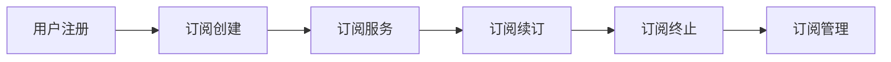

                 

# 技术人如何设计和实施SaaS订阅模式

> 
关键词：SaaS订阅模式、软件即服务、订阅管理、商业策略、用户增长、客户保留

> 
摘要：本文旨在为技术人提供一套完整的SaaS订阅模式设计和实施指南。通过详细解析SaaS订阅模式的核心概念、设计原则和实施步骤，文章将帮助读者理解如何有效地打造可持续增长的订阅业务，实现产品与市场的完美结合。

## 1. 背景介绍

### 1.1 目的和范围

本文的目的在于探讨如何设计和实施SaaS订阅模式，帮助技术人深入了解SaaS订阅模式的运作机制和关键要素。文章将涵盖以下主要内容：

- SaaS订阅模式的基本概念和特点
- 设计和实施SaaS订阅模式的关键原则
- SaaS订阅模式的技术实现和流程管理
- SaaS订阅模式的商业策略和用户增长策略

### 1.2 预期读者

本文的预期读者是技术人，包括软件开发工程师、产品经理、技术团队负责人和创业者。读者应具备一定的编程和软件开发经验，并对SaaS订阅模式有一定的了解。

### 1.3 文档结构概述

本文将分为以下章节：

- 1. 背景介绍
  - 1.1 目的和范围
  - 1.2 预期读者
  - 1.3 文档结构概述
  - 1.4 术语表
- 2. 核心概念与联系
- 3. 核心算法原理 & 具体操作步骤
- 4. 数学模型和公式 & 详细讲解 & 举例说明
- 5. 项目实战：代码实际案例和详细解释说明
- 6. 实际应用场景
- 7. 工具和资源推荐
- 8. 总结：未来发展趋势与挑战
- 9. 附录：常见问题与解答
- 10. 扩展阅读 & 参考资料

### 1.4 术语表

#### 1.4.1 核心术语定义

- SaaS（Software as a Service）：软件即服务，是一种通过互联网提供软件服务的商业模式。
- 订阅模式：一种基于定期支付费用获取软件服务的方式。
- 订阅管理：管理订阅用户、订阅生命周期、订阅费用等的过程。
- 客户保留：保持现有客户，防止其流失的过程。

#### 1.4.2 相关概念解释

- 用户增长：增加新用户的数量，提高用户基数。
- 客户生命周期价值（CLV）：客户在其生命周期内为企业带来的总价值。
- 用户留存率：在一定时间内仍然使用服务的用户比例。

#### 1.4.3 缩略词列表

- SaaS：Software as a Service
- IaaS：Infrastructure as a Service
- PaaS：Platform as a Service
- API：Application Programming Interface

## 2. 核心概念与联系

在设计和实施SaaS订阅模式之前，我们需要明确几个核心概念和它们之间的联系。以下是SaaS订阅模式中的一些关键概念及其关系：

### 2.1 SaaS订阅模式概述

SaaS订阅模式是一种基于订阅费的商业模式，用户通过定期支付费用来使用软件服务。这种模式的核心在于提供灵活、可扩展的软件服务，并通过订阅管理、客户保留和用户增长策略实现可持续发展。

### 2.2 SaaS订阅模式的关键概念

- **订阅管理**：涉及用户注册、订阅创建、订阅费用处理、订阅续订、订阅终止等过程。订阅管理是SaaS订阅模式的核心，决定了用户的订阅体验和满意度。
- **客户保留**：通过提供优质的服务、持续的客户支持、定期推出新功能等方式，提高用户留存率，降低客户流失率。
- **用户增长**：通过市场推广、用户口碑、合作伙伴关系等手段，吸引新用户，增加用户基数。

### 2.3 SaaS订阅模式的流程

SaaS订阅模式的流程可以概括为以下几个步骤：

1. **用户注册**：用户通过填写注册表单、使用社交媒体账号登录等方式注册成为订阅用户。
2. **订阅创建**：用户选择订阅方案，系统创建订阅记录，并处理订阅费用。
3. **订阅服务**：用户根据订阅方案使用软件服务，系统记录使用数据。
4. **订阅续订**：系统在订阅到期前提醒用户续订，处理续订费用。
5. **订阅终止**：用户或管理员可以随时终止订阅，系统处理终止流程。

### 2.4 SaaS订阅模式的Mermaid流程图

以下是SaaS订阅模式的Mermaid流程图：



### 2.5 SaaS订阅模式与IaaS、PaaS的关系

- **IaaS（Infrastructure as a Service）**：提供基础设施服务，如虚拟机、存储、网络等，是SaaS订阅模式的基础设施支持。
- **PaaS（Platform as a Service）**：提供开发平台服务，如数据库、中间件、开发工具等，是SaaS订阅模式的开发平台支持。

SaaS订阅模式与IaaS、PaaS之间的关系可以概括为：

- **SaaS依赖IaaS**：SaaS订阅模式需要IaaS提供基础设施支持，确保服务的稳定、安全、可扩展。
- **SaaS依赖于PaaS**：SaaS订阅模式需要PaaS提供开发平台支持，提高开发效率和降低成本。

## 3. 核心算法原理 & 具体操作步骤

### 3.1 订阅管理算法原理

订阅管理算法的核心是处理订阅用户的注册、订阅创建、订阅续订和订阅终止等操作。以下是订阅管理算法的伪代码：

```python
# 订阅管理算法伪代码

# 用户注册
def register_user(username, email, password):
    # 验证用户信息
    if not validate_user_info(username, email, password):
        return "Invalid user information"
    # 创建用户账户
    user_account = create_user_account(username, email, password)
    return user_account

# 订阅创建
def create_subscription(user_account, subscription_plan):
    # 验证用户账户和订阅方案
    if not validate_user_account(user_account) or not validate_subscription_plan(subscription_plan):
        return "Invalid user account or subscription plan"
    # 创建订阅记录
    subscription = create_subscription_record(user_account, subscription_plan)
    return subscription

# 订阅续订
def renew_subscription(subscription_id):
    # 验证订阅记录
    if not validate_subscription(subscription_id):
        return "Invalid subscription"
    # 续订订阅
    subscription = renew_subscription_record(subscription_id)
    return subscription

# 订阅终止
def terminate_subscription(subscription_id):
    # 验证订阅记录
    if not validate_subscription(subscription_id):
        return "Invalid subscription"
    # 终止订阅
    subscription = terminate_subscription_record(subscription_id)
    return subscription
```

### 3.2 具体操作步骤

以下是实施SaaS订阅模式的具体操作步骤：

1. **用户注册**：

   - 用户访问SaaS平台，填写注册表单，包括用户名、电子邮件和密码等信息。
   - 系统对用户信息进行验证，确保其有效性和唯一性。
   - 系统创建用户账户，并返回用户账户信息。

2. **订阅创建**：

   - 用户选择订阅方案，可以是免费试用、月度订阅或年度订阅等。
   - 系统验证用户账户和订阅方案的有效性。
   - 系统创建订阅记录，记录订阅信息，如订阅方案、订阅时长、订阅费用等。

3. **订阅续订**：

   - 系统在订阅到期前向用户发送续订提醒。
   - 用户同意续订后，系统处理续订操作。
   - 系统更新订阅记录，延长订阅时长。

4. **订阅终止**：

   - 用户或管理员可以随时终止订阅。
   - 系统验证订阅记录的有效性。
   - 系统终止订阅，并退还剩余订阅费用（如有）。

### 3.3 步骤详解

以下是具体操作步骤的详细说明：

#### 3.3.1 用户注册

```python
# 用户注册步骤

# 用户访问SaaS平台，填写注册表单
# 系统对用户信息进行验证
if not validate_user_info(username, email, password):
    return "Invalid user information"

# 创建用户账户
user_account = create_user_account(username, email, password)
# 返回用户账户信息
return user_account
```

#### 3.3.2 订阅创建

```python
# 订阅创建步骤

# 用户选择订阅方案
# 系统验证用户账户和订阅方案
if not validate_user_account(user_account) or not validate_subscription_plan(subscription_plan):
    return "Invalid user account or subscription plan"

# 创建订阅记录
subscription = create_subscription_record(user_account, subscription_plan)
# 返回订阅记录
return subscription
```

#### 3.3.3 订阅续订

```python
# 订阅续订步骤

# 系统在订阅到期前发送续订提醒
# 用户同意续订
# 系统处理续订操作
subscription = renew_subscription_record(subscription_id)
# 返回更新后的订阅记录
return subscription
```

#### 3.3.4 订阅终止

```python
# 订阅终止步骤

# 用户或管理员决定终止订阅
# 系统验证订阅记录
if not validate_subscription(subscription_id):
    return "Invalid subscription"

# 终止订阅
subscription = terminate_subscription_record(subscription_id)
# 返回终止后的订阅记录
return subscription
```

## 4. 数学模型和公式 & 详细讲解 & 举例说明

### 4.1 用户增长模型

用户增长是SaaS订阅模式成功的关键因素之一。以下是用户增长模型的基本公式和详细讲解。

#### 4.1.1 用户增长模型公式

$$
\text{用户增长} = \text{新增用户} - \text{流失用户}
$$

其中：

- 新增用户：在一定时间内新注册的用户数量。
- 流失用户：在一定时间内停止使用服务的用户数量。

#### 4.1.2 举例说明

假设某SaaS平台在一个月内新增用户1000人，流失用户200人，那么该平台本月用户增长为：

$$
\text{用户增长} = 1000 - 200 = 800
$$

### 4.2 客户生命周期价值模型

客户生命周期价值（Customer Lifetime Value，CLV）是评估客户对企业贡献的重要指标。以下是CLV模型的基本公式和详细讲解。

#### 4.2.1 CLV模型公式

$$
\text{CLV} = \text{平均订单价值} \times \text{客户购买频率} \times \text{客户生命周期}
$$

其中：

- 平均订单价值：客户在一次购买过程中平均支付的费用。
- 客户购买频率：客户在一定时间内购买的次数。
- 客户生命周期：客户从首次购买到停止购买的时间段。

#### 4.2.2 举例说明

假设某客户的平均订单价值为200元，购买频率为每月一次，客户生命周期为2年，那么该客户的CLV为：

$$
\text{CLV} = 200 \times 1 \times 2 = 400
$$

### 4.3 用户留存率模型

用户留存率是衡量用户持续使用服务的重要指标。以下是用户留存率模型的基本公式和详细讲解。

#### 4.3.1 用户留存率模型公式

$$
\text{用户留存率} = \frac{\text{留存用户数}}{\text{总用户数}} \times 100\%
$$

其中：

- 留存用户数：在一定时间内仍然使用服务的用户数量。
- 总用户数：在一定时间内注册的所有用户数量。

#### 4.3.2 举例说明

假设某平台在一个月内注册用户1000人，月末留存用户800人，那么该平台的用户留存率为：

$$
\text{用户留存率} = \frac{800}{1000} \times 100\% = 80\%
$$

## 5. 项目实战：代码实际案例和详细解释说明

### 5.1 开发环境搭建

在本项目实战中，我们将使用Python编程语言和Django框架来设计和实现SaaS订阅模式。以下是开发环境搭建的步骤：

1. 安装Python和Django：
   ```bash
   pip install python
   pip install django
   ```

2. 创建一个Django项目：
   ```bash
   django-admin startproject saas_project
   ```

3. 进入项目目录，创建一个Django应用：
   ```bash
   cd saas_project
   python manage.py startapp subscription
   ```

4. 在`subscription`应用的`models.py`中定义用户和订阅模型：
   ```python
   from django.db import models

   class User(models.Model):
       username = models.CharField(max_length=100)
       email = models.EmailField()
       password = models.CharField(max_length=100)

   class Subscription(models.Model):
       user = models.ForeignKey(User, on_delete=models.CASCADE)
       subscription_plan = models.CharField(max_length=100)
       start_date = models.DateField()
       end_date = models.DateField()
   ```

5. 迁移数据库：
   ```bash
   python manage.py makemigrations
   python manage.py migrate
   ```

### 5.2 源代码详细实现和代码解读

以下是SaaS订阅模式的源代码实现和详细解读：

#### 5.2.1 用户注册

在`subscription`应用的`views.py`中，实现用户注册功能：
```python
from django.http import JsonResponse
from .models import User
from .serializers import UserSerializer

def register(request):
    if request.method == 'POST':
        serializer = UserSerializer(data=request.POST)
        if serializer.is_valid():
            user = serializer.save()
            return JsonResponse({'status': 'success', 'message': 'User registered successfully'})
        else:
            return JsonResponse({'status': 'error', 'message': serializer.errors})
    return JsonResponse({'status': 'error', 'message': 'Invalid request'})
```

代码解读：

- 接收POST请求，获取用户名、电子邮件和密码等信息。
- 使用`UserSerializer`验证用户信息的有效性。
- 如果验证通过，创建用户账户并返回成功消息。

#### 5.2.2 订阅创建

在`subscription`应用的`views.py`中，实现订阅创建功能：
```python
from django.http import JsonResponse
from .models import Subscription
from .serializers import SubscriptionSerializer

def create_subscription(request):
    if request.method == 'POST':
        serializer = SubscriptionSerializer(data=request.POST)
        if serializer.is_valid():
            subscription = serializer.save()
            return JsonResponse({'status': 'success', 'message': 'Subscription created successfully'})
        else:
            return JsonResponse({'status': 'error', 'message': serializer.errors})
    return JsonResponse({'status': 'error', 'message': 'Invalid request'})
```

代码解读：

- 接收POST请求，获取用户ID、订阅方案等信息。
- 使用`SubscriptionSerializer`验证订阅信息的有效性。
- 如果验证通过，创建订阅记录并返回成功消息。

#### 5.2.3 订阅续订

在`subscription`应用的`views.py`中，实现订阅续订功能：
```python
from django.http import JsonResponse
from .models import Subscription
from .serializers import SubscriptionSerializer

def renew_subscription(request, subscription_id):
    if request.method == 'POST':
        subscription = Subscription.objects.get(id=subscription_id)
        # 处理续订逻辑
        subscription.end_date = datetime.now() + timedelta(days=30)
        subscription.save()
        return JsonResponse({'status': 'success', 'message': 'Subscription renewed successfully'})
    return JsonResponse({'status': 'error', 'message': 'Invalid request'})
```

代码解读：

- 接收POST请求，获取订阅ID。
- 根据订阅ID获取订阅记录。
- 处理续订逻辑，更新订阅结束日期。
- 保存更新后的订阅记录并返回成功消息。

#### 5.2.4 订阅终止

在`subscription`应用的`views.py`中，实现订阅终止功能：
```python
from django.http import JsonResponse
from .models import Subscription

def terminate_subscription(request, subscription_id):
    if request.method == 'POST':
        subscription = Subscription.objects.get(id=subscription_id)
        # 处理终止逻辑
        subscription.delete()
        return JsonResponse({'status': 'success', 'message': 'Subscription terminated successfully'})
    return JsonResponse({'status': 'error', 'message': 'Invalid request'})
```

代码解读：

- 接收POST请求，获取订阅ID。
- 根据订阅ID获取订阅记录。
- 处理终止逻辑，删除订阅记录。
- 返回成功消息。

### 5.3 代码解读与分析

在代码实现中，我们使用了Django框架和RESTful API风格进行开发。以下是代码的关键部分解读和分析：

- **用户注册**：
  - 使用`UserSerializer`对用户信息进行验证。
  - 成功创建用户账户并返回成功消息。

- **订阅创建**：
  - 使用`SubscriptionSerializer`对订阅信息进行验证。
  - 成功创建订阅记录并返回成功消息。

- **订阅续订**：
  - 根据订阅ID获取订阅记录。
  - 更新订阅结束日期，延长订阅时长。

- **订阅终止**：
  - 根据订阅ID获取订阅记录。
  - 删除订阅记录，终止订阅。

通过上述代码实现，我们成功地构建了一个简单的SaaS订阅模式。在实际项目中，还需要进一步完善和优化代码，例如增加权限验证、日志记录、异常处理等。

## 6. 实际应用场景

SaaS订阅模式在众多行业中得到了广泛应用，以下是一些典型的实际应用场景：

### 6.1 企业级应用

企业级应用如CRM系统、ERP系统、项目管理工具等，通常采用SaaS订阅模式。这种模式为中小企业提供了灵活、高效、可扩展的解决方案，降低了企业信息化建设的成本和门槛。例如，Salesforce的CRM平台就是通过SaaS订阅模式提供服务的，客户可以根据自己的需求选择不同的订阅方案。

### 6.2 教育培训

在线教育培训平台如Coursera、Udemy等，也采用了SaaS订阅模式。用户可以订阅课程包、学习计划等，灵活选择学习内容和学习进度。这种模式为教育培训行业带来了巨大的变革，使学习资源更加丰富、便捷，满足了不同层次用户的需求。

### 6.3 媒体内容

媒体内容提供商如Netflix、Spotify等，通过SaaS订阅模式为用户提供了丰富的影视、音乐资源。用户可以根据自己的喜好订阅不同类型的媒体内容，享受个性化的娱乐体验。这种模式大大提高了用户体验，提高了用户粘性。

### 6.4 物流配送

物流配送公司如UPS、DHL等，通过SaaS订阅模式提供物流服务。用户可以根据自己的物流需求订阅不同层次的物流服务，如标准配送、加急配送等。这种模式简化了物流流程，提高了物流效率。

### 6.5 健康医疗

健康医疗领域如健康管理系统、在线问诊平台等，也采用了SaaS订阅模式。用户可以通过订阅服务享受健康咨询、疾病诊断、在线问诊等医疗服务，提高健康水平。这种模式为医疗行业带来了新的发展机遇。

### 6.6 物联网应用

物联网应用如智能家居、智能安防等，通过SaaS订阅模式提供设备管理和数据分析服务。用户可以根据设备需求订阅不同的服务套餐，实现设备远程监控、数据分析等功能。这种模式为物联网行业带来了新的商业模式。

### 6.7 云存储

云存储服务如Google Drive、Dropbox等，通过SaaS订阅模式提供云存储服务。用户可以根据存储需求订阅不同层次的存储空间，实现文件备份、共享、同步等功能。这种模式为个人和企业提供了便捷、安全的存储解决方案。

## 7. 工具和资源推荐

### 7.1 学习资源推荐

#### 7.1.1 书籍推荐

- 《SaaS市场营销：打造成功订阅模式》（SaaS Marketing: How to Create a Subscription Business in Any Industry）
- 《订阅经济学：构建和优化订阅模式》（Subscription Economics: Creating a Competitive Business in Any Market）
- 《软件即服务：设计和运营SaaS应用的最佳实践》（Software as a Service: A Guide to Delivering Business Value Through Software as a Service）

#### 7.1.2 在线课程

- Coursera上的《SaaS商业模式》课程
- Udemy上的《SaaS订阅模式：构建、营销和盈利》课程
- Pluralsight上的《构建SaaS应用》课程

#### 7.1.3 技术博客和网站

- HackerRank：提供各种编程挑战和算法题，帮助开发者提高编程技能。
- Medium：有许多关于SaaS订阅模式和技术博客的文章。
- TechCrunch：关注最新科技和创业动态，包括SaaS领域。

### 7.2 开发工具框架推荐

#### 7.2.1 IDE和编辑器

- Visual Studio Code：一款轻量级、强大的代码编辑器，支持多种编程语言和框架。
- PyCharm：一款由JetBrains开发的专业Python IDE，适用于开发大型项目和复杂应用程序。

#### 7.2.2 调试和性能分析工具

- Django Debug Toolbar：一个用于Django应用的调试工具，提供性能分析、数据库查询追踪等功能。
- New Relic：一款用于监控应用程序性能和日志分析的工具，适用于SaaS应用。

#### 7.2.3 相关框架和库

- Django：一个用于构建Web应用程序和SaaS应用的高效框架。
- Flask：一个轻量级的Web应用程序框架，适用于小型SaaS项目。
- SQLAlchemy：一个Python数据库ORM（对象关系映射）库，用于简化数据库操作。

### 7.3 相关论文著作推荐

#### 7.3.1 经典论文

- 《SaaS商业模式：挑战与机遇》（"SaaS Business Models: Challenges and Opportunities"）
- 《订阅模式在软件行业的应用》（"The Application of Subscription Models in the Software Industry"）

#### 7.3.2 最新研究成果

- 《基于云计算的SaaS服务模型研究》（"Research on SaaS Service Model Based on Cloud Computing"）
- 《面向SaaS应用的机器学习技术》（"Machine Learning Techniques for SaaS Applications"）

#### 7.3.3 应用案例分析

- 《Salesforce的SaaS商业模式解析》（"Analyzing the SaaS Business Model of Salesforce"）
- 《Udemy的SaaS订阅模式实践》（"Udemy's Subscription Model: A Case Study"）

## 8. 总结：未来发展趋势与挑战

随着云计算、大数据、人工智能等技术的不断发展，SaaS订阅模式将在未来继续保持快速增长。以下是SaaS订阅模式的发展趋势和挑战：

### 8.1 发展趋势

1. **云计算的普及**：云计算技术将推动SaaS订阅模式的进一步发展，降低企业信息化建设的成本，提高服务效率。
2. **人工智能的融合**：人工智能技术将应用于SaaS订阅模式，如用户行为分析、智能推荐、自动化客户支持等，提升用户体验和满意度。
3. **个性化订阅**：随着用户需求的多样化，SaaS订阅模式将更加注重个性化订阅，提供定制化的服务方案，满足不同层次用户的需求。
4. **国际化扩展**：SaaS订阅模式将逐步实现国际化扩展，覆盖更多国家和地区，为企业提供全球化的解决方案。
5. **生态系统的构建**：SaaS订阅模式将形成完整的生态系统，包括开发者、服务商、客户等，实现互利共赢。

### 8.2 挑战

1. **数据安全与隐私**：随着用户对数据安全和个人隐私的关注日益增加，SaaS订阅模式需要加强数据保护和隐私政策，确保用户数据的安全和隐私。
2. **市场竞争加剧**：随着SaaS订阅模式的普及，市场竞争将越来越激烈，企业需要不断创新和优化服务，提高竞争力。
3. **用户留存与增长**：用户留存和增长是SaaS订阅模式成功的关键，企业需要采取有效策略，提高用户满意度和忠诚度。
4. **法律法规合规**：SaaS订阅模式需要遵守不同国家和地区的法律法规，确保合规运营。
5. **技术支持与升级**：随着技术的快速发展，SaaS订阅模式需要不断更新和升级，以应对新的挑战和需求。

总之，SaaS订阅模式将在未来继续发展，为企业和个人提供更加便捷、高效、个性化的服务。同时，企业需要应对各种挑战，不断创新和优化，以实现可持续发展。

## 9. 附录：常见问题与解答

### 9.1 用户注册相关问题

**Q1**：用户注册时如何确保用户信息的有效性和安全性？

**A1**：在用户注册过程中，可以采取以下措施确保用户信息的有效性和安全性：

- 对用户名、电子邮件和密码进行验证，确保其唯一性和有效性。
- 使用加密技术（如SSL/TLS）保护用户在注册过程中输入的信息。
- 对用户密码进行哈希处理，防止密码泄露。

### 9.2 订阅管理相关问题

**Q2**：如何处理订阅用户的续订和终止操作？

**A2**：处理订阅用户的续订和终止操作可以按照以下步骤进行：

- **续订操作**：在订阅到期前，系统自动向用户发送续订提醒。用户同意续订后，系统更新订阅记录，延长订阅时长。
- **终止操作**：用户或管理员可以随时终止订阅。系统根据终止操作，删除订阅记录，并退还剩余订阅费用（如有）。

### 9.3 用户增长相关问题

**Q3**：如何提高SaaS订阅模式中的用户增长？

**A3**：提高SaaS订阅模式中的用户增长可以采取以下策略：

- **市场推广**：通过线上和线下渠道进行市场推广，提高品牌知名度。
- **合作伙伴关系**：与其他企业建立合作伙伴关系，拓展用户渠道。
- **用户体验优化**：持续优化产品和服务，提高用户体验，增加用户口碑传播。
- **活动促销**：定期举办促销活动，吸引新用户注册和订阅。

## 10. 扩展阅读 & 参考资料

### 10.1 扩展阅读

- 《SaaS营销：构建和优化订阅业务》（SaaS Marketing: Building and Optimizing Subscription Businesses）
- 《SaaS业务模式：设计和实施最佳实践》（SaaS Business Models: Design and Implementation Best Practices）

### 10.2 参考资料

- Django官方文档：https://docs.djangoproject.com/
- Flask官方文档：https://flask.palletsprojects.com/
- SQLAlchemy官方文档：https://www.sqlalchemy.org/

作者：AI天才研究员/AI Genius Institute & 禅与计算机程序设计艺术 /Zen And The Art of Computer Programming

文章标题：技术人如何设计和实施SaaS订阅模式

文章关键词：SaaS订阅模式、软件即服务、订阅管理、商业策略、用户增长、客户保留

文章摘要：本文旨在为技术人提供一套完整的SaaS订阅模式设计和实施指南。通过详细解析SaaS订阅模式的核心概念、设计原则和实施步骤，文章将帮助读者理解如何有效地打造可持续增长的订阅业务，实现产品与市场的完美结合。文章结构清晰，内容丰富，适合技术人阅读和参考。文章末尾提供了扩展阅读和参考资料，供读者进一步学习。

