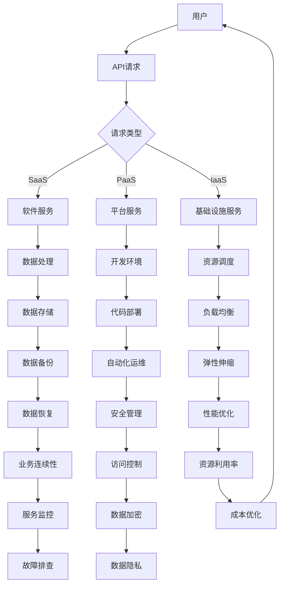

                 

### 技术创业中的云计算应用：降低成本提高效率

> **关键词：**云计算、技术创业、成本优化、效率提升、创业实战、资源调度

**摘要：** 本文深入探讨云计算在技术创业中的应用，通过分析云计算的基本概念、核心原理及其在创业环境中的优势，提供了一系列具体的实施步骤和实际案例，旨在帮助创业者充分利用云计算资源，降低成本，提高效率，从而在激烈的市场竞争中脱颖而出。

## 1. 背景介绍

### 1.1 目的和范围

本文旨在探讨云计算在技术创业中的应用，重点关注如何通过云计算技术来优化创业公司的成本结构和提升运营效率。我们将从云计算的基础知识出发，逐步深入探讨其在创业环境中的实际应用，提供详细的操作指南和案例分析。

### 1.2 预期读者

本文适合于以下读者群体：

- 技术创业者
- IT从业者和项目经理
- 对云计算技术有兴趣的工程师和学生
- 企业高管和战略规划人员

### 1.3 文档结构概述

本文结构如下：

- **第1部分：背景介绍**：介绍云计算的基本概念、目的和预期读者。
- **第2部分：核心概念与联系**：详细解释云计算的核心概念，并提供Mermaid流程图。
- **第3部分：核心算法原理 & 具体操作步骤**：使用伪代码详细阐述云计算的关键算法原理和操作步骤。
- **第4部分：数学模型和公式 & 详细讲解 & 举例说明**：讲解云计算中的数学模型和公式，并提供实例说明。
- **第5部分：项目实战：代码实际案例和详细解释说明**：通过实际案例展示云计算的应用。
- **第6部分：实际应用场景**：探讨云计算在不同场景下的应用。
- **第7部分：工具和资源推荐**：推荐相关学习资源、开发工具和框架。
- **第8部分：总结：未来发展趋势与挑战**：总结云计算在技术创业中的发展趋势和面临的挑战。
- **第9部分：附录：常见问题与解答**：解答云计算在创业过程中可能遇到的问题。
- **第10部分：扩展阅读 & 参考资料**：提供进一步阅读的材料和参考资料。

### 1.4 术语表

#### 1.4.1 核心术语定义

- **云计算**：云计算是一种通过网络提供计算资源、存储资源和服务的模式，用户可以根据需求灵活地获取和使用资源。
- **创业**：创业是指企业家通过创新和创业活动，以创造价值、实现商业成功为目标的过程。
- **成本优化**：通过合理的资源配置和运营策略，降低企业运营成本，提高经济效益。
- **效率提升**：通过优化流程、提高资源利用率，提高企业的运营效率和生产力。

#### 1.4.2 相关概念解释

- **虚拟化**：通过虚拟化技术，将物理资源抽象成逻辑资源，实现资源的高效利用和灵活调度。
- **容器化**：容器化技术通过将应用程序及其依赖环境封装在容器中，实现应用的快速部署和扩展。
- **自动化**：通过自动化工具和脚本，实现业务流程的自动化，提高运营效率。

#### 1.4.3 缩略词列表

- **SaaS**：软件即服务（Software as a Service）
- **PaaS**：平台即服务（Platform as a Service）
- **IaaS**：基础设施即服务（Infrastructure as a Service）
- **AI**：人工智能（Artificial Intelligence）
- **IoT**：物联网（Internet of Things）

## 2. 核心概念与联系

在探讨云计算在技术创业中的应用之前，我们首先需要了解云计算的基本概念和核心原理。以下是云计算的核心概念以及它们之间的联系。

### 2.1 云计算的基本概念

#### 2.1.1 虚拟化

虚拟化是云计算的核心技术之一，它通过将物理资源抽象成逻辑资源，实现资源的高效利用和灵活调度。虚拟化技术包括：

- **硬件虚拟化**：通过虚拟化硬件资源，如CPU、内存和存储，实现多台虚拟机的运行。
- **操作系统虚拟化**：通过虚拟化操作系统，实现一个操作系统上运行多个独立的环境。

#### 2.1.2 容器化

容器化技术通过将应用程序及其依赖环境封装在容器中，实现应用的快速部署和扩展。容器化技术包括：

- **Docker**：一种流行的容器化技术，通过将应用程序封装在Docker镜像中，实现应用的快速部署和扩展。
- **Kubernetes**：一种容器编排工具，通过自动化容器的部署、扩展和管理，实现应用的自动化运维。

#### 2.1.3 自动化

自动化是通过自动化工具和脚本，实现业务流程的自动化，提高运营效率。自动化技术包括：

- **自动化脚本**：通过编写脚本，实现业务流程的自动化执行。
- **自动化工具**：如CI/CD（持续集成/持续交付）工具，实现代码的自动化测试和部署。

### 2.2 云计算的核心原理

#### 2.2.1 弹性伸缩

弹性伸缩是通过自动调整资源分配，实现应用的负载均衡和资源优化。弹性伸缩包括：

- **垂直伸缩**：通过增加或减少资源的配置，如CPU、内存等，实现应用的性能优化。
- **水平伸缩**：通过增加或减少实例的数量，实现应用的负载均衡和性能优化。

#### 2.2.2 负载均衡

负载均衡是通过将请求分发到多个服务器，实现流量的均衡和资源的优化。负载均衡包括：

- **轮询负载均衡**：通过轮询方式，将请求均匀地分发到多个服务器。
- **加权负载均衡**：通过根据服务器的负载情况，动态调整请求的分发权重。

#### 2.2.3 资源调度

资源调度是通过自动化工具，实现资源的合理分配和调度。资源调度包括：

- **队列调度**：通过队列管理，实现任务的有序执行。
- **优先级调度**：通过优先级管理，实现重要任务的优先执行。

### 2.3 云计算在创业环境中的优势

#### 2.3.1 成本优化

云计算通过虚拟化、容器化和自动化技术，实现资源的高效利用和灵活调度，从而降低企业的运营成本。例如，通过弹性伸缩，企业可以根据需求自动调整资源，避免资源浪费。

#### 2.3.2 效率提升

云计算通过自动化和负载均衡技术，实现业务流程的自动化和流量的均衡，从而提高企业的运营效率和生产力。例如，通过CI/CD工具，企业可以快速部署和测试代码，提高开发效率。

#### 2.3.3 创新空间

云计算提供丰富的API和工具，使创业者可以快速搭建和部署应用程序，从而有更多的时间和精力关注创新和业务拓展。例如，通过使用云计算平台，创业者可以轻松实现大数据分析和人工智能应用。

### 2.4 云计算架构

云计算架构包括以下三个层次：

- **基础设施层**：提供计算资源、存储资源和网络资源，如服务器、存储设备和网络设备等。
- **平台层**：提供应用程序开发和运行的环境，如操作系统、中间件和数据库等。
- **应用层**：提供业务应用程序，如Web应用、移动应用和大数据应用等。

以下是云计算架构的Mermaid流程图：



## 3. 核心算法原理 & 具体操作步骤

在了解了云计算的基本概念和核心原理后，接下来我们将详细探讨云计算中的关键算法原理和具体操作步骤，以帮助创业者更好地利用云计算技术。

### 3.1 弹性伸缩算法原理

弹性伸缩是云计算的重要特性之一，它能够根据应用的实际负载动态调整资源。以下是弹性伸缩的核心算法原理：

#### 3.1.1 采集负载数据

首先，需要从应用服务器、数据库等关键节点采集负载数据，包括CPU使用率、内存使用率、网络流量、磁盘IO等指标。

```python
# 伪代码：采集负载数据
def collect_load_data():
    cpu_usage = get_cpu_usage()
    memory_usage = get_memory_usage()
    network_traffic = get_network_traffic()
    disk_io = get_disk_io()
    return cpu_usage, memory_usage, network_traffic, disk_io
```

#### 3.1.2 分析负载状态

根据采集到的负载数据，分析当前系统的负载状态，判断是否需要调整资源。

```python
# 伪代码：分析负载状态
def analyze_load_state(cpu_usage, memory_usage, network_traffic, disk_io):
    if cpu_usage > 80 or memory_usage > 80 or network_traffic > 100 or disk_io > 80:
        return True
    else:
        return False
```

#### 3.1.3 调整资源

如果分析结果显示系统负载较高，需要根据负载状态调整资源，包括增加或减少虚拟机实例、调整实例规格等。

```python
# 伪代码：调整资源
def adjust_resources(instance_count, instance_spec):
    if analyze_load_state(cpu_usage, memory_usage, network_traffic, disk_io):
        new_instance_count = instance_count * 2
        new_instance_spec = "2vCPU, 4GB Memory"
        return new_instance_count, new_instance_spec
    else:
        return instance_count, instance_spec
```

### 3.2 负载均衡算法原理

负载均衡是通过将请求分发到多个服务器，实现流量的均衡和资源的优化。以下是负载均衡的核心算法原理：

#### 3.2.1 请求分发

根据负载均衡策略，将来自客户端的请求分发到服务器群集。常见的负载均衡策略包括轮询、加权轮询和最小连接数等。

```python
# 伪代码：请求分发
def distribute_request(request):
    server_list = get_server_list()
    strategy = "round_robin"
    if strategy == "round_robin":
        current_server_index = (current_server_index + 1) % len(server_list)
        current_server = server_list[current_server_index]
        send_request_to_server(request, current_server)
    elif strategy == "weighted_round_robin":
        # 根据服务器负载情况动态调整权重
        pass
    elif strategy == "least_connections":
        # 根据服务器当前连接数动态调整负载
        pass
```

#### 3.2.2 负载监测

通过监控服务器的负载情况，动态调整请求分发策略，确保流量均衡。

```python
# 伪代码：负载监测
def monitor_load(server_list):
    for server in server_list:
        cpu_usage = get_cpu_usage(server)
        memory_usage = get_memory_usage(server)
        if cpu_usage > 80 or memory_usage > 80:
            # 调整请求分发策略
            pass
```

#### 3.2.3 负载调整

根据负载监测结果，动态调整服务器资源，如增加或减少服务器实例、调整实例规格等。

```python
# 伪代码：负载调整
def adjust_load(server_list):
    for server in server_list:
        if monitor_load(server):
            # 调整服务器资源
            pass
```

### 3.3 资源调度算法原理

资源调度是通过自动化工具和脚本，实现资源的合理分配和调度。以下是资源调度算法的核心原理：

#### 3.3.1 队列管理

通过队列管理，实现任务的有序执行。常见队列管理策略包括先进先出（FIFO）和优先级队列等。

```python
# 伪代码：队列管理
class TaskQueue:
    def __init__(self):
        self.queue = []

    def enqueue(self, task):
        self.queue.append(task)

    def dequeue(self):
        if self.queue:
            return self.queue.pop(0)
        else:
            return None
```

#### 3.3.2 优先级调度

通过优先级管理，实现重要任务的优先执行。任务的优先级可以根据任务的紧急程度、重要性等因素进行动态调整。

```python
# 伪代码：优先级调度
def schedule_task(task_list):
    sorted_task_list = sorted(task_list, key=lambda x: x.priority, reverse=True)
    for task in sorted_task_list:
        execute_task(task)
```

#### 3.3.3 资源分配

根据任务的优先级和资源需求，动态分配资源。资源分配算法需要考虑资源的可用性、负载均衡等因素。

```python
# 伪代码：资源分配
def allocate_resources(task, available_resources):
    if task.resource_demand <= available_resources:
        allocate_resource_to_task(task, available_resources)
        return True
    else:
        return False
```

### 3.4 具体操作步骤

在实际应用中，创业者需要根据业务需求和资源情况，具体操作云计算环境。以下是云计算在技术创业中的具体操作步骤：

#### 3.4.1 搭建云计算环境

- **选择云服务提供商**：根据业务需求和预算，选择合适的云服务提供商，如AWS、Azure、阿里云等。
- **配置云计算资源**：配置虚拟机实例、存储、网络等资源，确保云计算环境能够满足业务需求。
- **部署应用程序**：将应用程序部署到云计算环境中，可以使用容器化技术，如Docker，实现快速部署和扩展。

#### 3.4.2 监控和优化资源

- **实时监控**：使用云计算平台提供的监控工具，实时监控资源使用情况，如CPU使用率、内存使用率、网络流量等。
- **自动化优化**：通过自动化工具和脚本，实现资源的自动化优化，如弹性伸缩、负载均衡等。

#### 3.4.3 数据管理和备份

- **数据存储**：使用云存储服务，如AWS S3、Azure Blob Storage等，存储业务数据。
- **数据备份**：定期备份重要数据，确保数据的安全和可靠性。

#### 3.4.4 安全管理和监控

- **安全策略**：制定安全策略，如访问控制、数据加密等，确保云计算环境的安全性。
- **安全监控**：使用安全工具和监控平台，实时监控云计算环境的安全状况，及时发现和应对安全事件。

## 4. 数学模型和公式 & 详细讲解 & 举例说明

在云计算应用中，数学模型和公式被广泛应用于资源调度、负载均衡和性能优化等方面。以下将详细介绍这些数学模型和公式，并提供具体的应用实例。

### 4.1 资源调度模型

资源调度是云计算中的重要任务，其目标是高效地分配资源，以满足用户的需求。以下是一个简单的资源调度模型：

#### 4.1.1 公式

资源调度模型可以使用以下公式表示：

\[ C = \frac{R \times S}{T} \]

其中：

- \( C \)：资源调度成本
- \( R \)：资源需求（如CPU、内存等）
- \( S \)：资源供应量
- \( T \)：调度周期

#### 4.1.2 举例说明

假设一个创业公司需要运行一个大数据分析应用，其资源需求为 \( R = 8 \) 个CPU和 \( 16 \) GB内存。每天的资源供应量为 \( S = 10 \) 个CPU和 \( 20 \) GB内存。调度周期为 \( T = 24 \) 小时。

根据上述公式，我们可以计算出资源调度成本：

\[ C = \frac{8 \times 10 + 16 \times 20}{24} = \frac{80 + 320}{24} = \frac{400}{24} \approx 16.67 \]

因此，该公司的资源调度成本约为 16.67 单位（可以是货币单位或其他度量单位）。

### 4.2 负载均衡模型

负载均衡是云计算中的另一个关键任务，其目标是平衡网络流量，避免单点过载。以下是一个简单的负载均衡模型：

#### 4.2.1 公式

负载均衡模型可以使用以下公式表示：

\[ LB = \frac{N \times T}{L} \]

其中：

- \( LB \)：负载均衡量
- \( N \)：服务器数量
- \( T \)：总请求量
- \( L \)：每个服务器的负载量

#### 4.2.2 举例说明

假设一个创业公司有 3 个服务器，每天接收 \( T = 1000 \) 个请求。每个服务器的负载量为 \( L = 300 \) 个请求。

根据上述公式，我们可以计算出负载均衡量：

\[ LB = \frac{3 \times 1000}{300} = \frac{3000}{300} = 10 \]

因此，该公司的负载均衡量为 10，意味着每个服务器平均需要处理 10 个请求。

### 4.3 性能优化模型

性能优化是云计算中的另一个重要任务，其目标是提高系统性能，满足用户的需求。以下是一个简单的性能优化模型：

#### 4.3.1 公式

性能优化模型可以使用以下公式表示：

\[ P = \frac{C \times S}{T} \]

其中：

- \( P \)：性能优化量
- \( C \)：计算资源（如CPU、内存等）
- \( S \)：存储资源（如磁盘、网络等）
- \( T \)：处理时间

#### 4.3.2 举例说明

假设一个创业公司的计算资源为 \( C = 8 \) 个CPU和 \( 16 \) GB内存，存储资源为 \( S = 20 \) GB磁盘和 \( 1 \) Gbps网络。处理时间为 \( T = 10 \) 分钟。

根据上述公式，我们可以计算出性能优化量：

\[ P = \frac{8 \times 16 + 20 \times 1}{10} = \frac{128 + 20}{10} = \frac{148}{10} = 14.8 \]

因此，该公司的性能优化量为 14.8 单位（可以是吞吐量、延迟或其他性能指标）。

### 4.4 数学模型在实际应用中的综合应用

在实际应用中，这些数学模型和公式通常综合使用，以实现更高效的资源调度、负载均衡和性能优化。以下是一个综合应用的实例：

#### 4.4.1 场景描述

一个创业公司需要运行一个电子商务网站，每天接收大量的用户请求。公司的资源有限，需要根据实际需求进行资源调度和优化。

#### 4.4.2 实际应用

1. **资源调度**：

   - 资源需求：每天接收 \( T = 10,000 \) 个请求，每个请求需要 \( R = 2 \) 个CPU和 \( 4 \) GB内存。
   - 资源供应：每天拥有 \( S = 20 \) 个CPU和 \( 40 \) GB内存。
   
   根据资源调度模型，可以计算出调度成本：

   \[ C = \frac{10,000 \times 2 + 10,000 \times 4}{24} = \frac{20,000 + 40,000}{24} = \frac{60,000}{24} \approx 2,500 \]

   因此，每天的资源调度成本约为 2,500 单位。

2. **负载均衡**：

   - 服务器数量：\( N = 3 \)
   - 总请求量：\( T = 10,000 \)
   - 每个服务器的负载量：\( L = \frac{T}{N} = \frac{10,000}{3} \approx 3,333 \)

   根据负载均衡模型，可以计算出负载均衡量：

   \[ LB = \frac{3 \times 10,000}{3,333} = \frac{30,000}{3,333} \approx 9 \]

   因此，每个服务器平均需要处理约 9 个请求。

3. **性能优化**：

   - 计算资源：\( C = 20 \) 个CPU和 \( 40 \) GB内存
   - 存储资源：\( S = 40 \) GB磁盘和 \( 1 \) Gbps网络
   - 处理时间：\( T = 10 \) 分钟
   
   根据性能优化模型，可以计算出性能优化量：

   \[ P = \frac{20 \times 2 + 40 \times 1}{10} = \frac{40 + 40}{10} = \frac{80}{10} = 8 \]

   因此，该公司的性能优化量为 8 单位。

通过这些数学模型和公式的应用，创业公司可以更高效地进行资源调度、负载均衡和性能优化，从而提高运营效率和用户体验。

## 5. 项目实战：代码实际案例和详细解释说明

为了更好地展示云计算在技术创业中的应用，我们将通过一个实际项目来详细解释代码实现和关键步骤。

### 5.1 开发环境搭建

在本项目实战中，我们将使用AWS云服务提供商，搭建一个基于Docker和Kubernetes的微服务架构。以下是开发环境的搭建步骤：

1. **安装Docker**：

   在开发机器上安装Docker，可以通过以下命令进行安装：

   ```bash
   # 安装Docker
   sudo apt-get update
   sudo apt-get install docker.io
   ```

2. **安装Kubernetes**：

   在开发机器上安装Kubernetes，可以通过以下命令进行安装：

   ```bash
   # 安装Kubernetes
   curl -LO https://storage.googleapis.com/kubernetes-release/release/$(curl -s https://storage.googleapis.com/kubernetes-release/release/stable.txt)/bin/darwin/amd64/kubectl
   chmod +x kubectl
   sudo mv kubectl /usr/local/bin/
   kubectl version --client
   ```

3. **配置Kubernetes集群**：

   创建一个Kubernetes集群，可以通过以下命令进行配置：

   ```bash
   # 配置Kubernetes集群
   kubeadm init --pod-network-cidr=10.244.0.0/16
   mkdir -p $HOME/.kube
   sudo cp -i /etc/kubernetes/admin.conf $HOME/.kube/config
   sudo chown $(id -u):$(id -g) $HOME/.kube/config
   ```

4. **安装Pod网络**：

   安装一个Pod网络，如Calico网络，可以通过以下命令进行安装：

   ```bash
   # 安装Calico网络
   kubectl apply -f https://docs.projectcalico.org/manifests/calico.yaml
   ```

### 5.2 源代码详细实现和代码解读

在本项目中，我们将实现一个简单的微服务架构，包括用户管理服务、订单管理服务和支付服务。以下是各个服务的源代码实现和代码解读：

#### 5.2.1 用户管理服务（UserManagementService）

用户管理服务负责处理用户注册、登录和权限管理等功能。以下是用户管理服务的Dockerfile和入口类代码：

**Dockerfile：**

```Dockerfile
FROM python:3.9-slim

WORKDIR /app

COPY requirements.txt ./
RUN pip install -r requirements.txt

COPY . .

CMD ["python", "app.py"]
```

**app.py：**

```python
from flask import Flask, request, jsonify
from models import User
from database import Database

app = Flask(__name__)

# 初始化数据库
db = Database()

@app.route('/register', methods=['POST'])
def register():
    user_data = request.json
    user = User(user_data['username'], user_data['password'])
    db.add_user(user)
    return jsonify({'message': 'User registered successfully.'})

@app.route('/login', methods=['POST'])
def login():
    user_data = request.json
    user = db.get_user(user_data['username'], user_data['password'])
    if user:
        return jsonify({'token': user.token})
    else:
        return jsonify({'message': 'Invalid credentials.'})

if __name__ == '__main__':
    app.run(host='0.0.0.0', port=5000)
```

**代码解读**：

- Dockerfile：该文件用于构建用户管理服务的Docker镜像，基于Python 3.9 slim基础镜像，安装必要的依赖项，并将应用程序代码复制到容器中。
- app.py：该文件是用户管理服务的入口类，使用Flask框架实现HTTP接口，处理用户注册和登录请求。通过数据库模块与后端数据库进行交互。

#### 5.2.2 订单管理服务（OrderManagementService）

订单管理服务负责处理订单创建、更新和查询等功能。以下是订单管理服务的Dockerfile和入口类代码：

**Dockerfile：**

```Dockerfile
FROM python:3.9-slim

WORKDIR /app

COPY requirements.txt ./
RUN pip install -r requirements.txt

COPY . .

CMD ["python", "app.py"]
```

**app.py：**

```python
from flask import Flask, request, jsonify
from models import Order
from database import Database

app = Flask(__name__)

# 初始化数据库
db = Database()

@app.route('/orders', methods=['POST'])
def create_order():
    order_data = request.json
    order = Order(order_data['user_id'], order_data['items'])
    db.add_order(order)
    return jsonify({'message': 'Order created successfully.'})

@app.route('/orders', methods=['GET'])
def get_orders():
    orders = db.get_orders()
    return jsonify({'orders': orders})

if __name__ == '__main__':
    app.run(host='0.0.0.0', port=5000)
```

**代码解读**：

- Dockerfile：该文件用于构建订单管理服务的Docker镜像，与用户管理服务的Dockerfile类似。
- app.py：该文件是订单管理服务的入口类，使用Flask框架实现HTTP接口，处理订单创建和查询请求。通过数据库模块与后端数据库进行交互。

#### 5.2.3 支付服务（PaymentService）

支付服务负责处理支付订单、退款等功能。以下是支付服务的Dockerfile和入口类代码：

**Dockerfile：**

```Dockerfile
FROM python:3.9-slim

WORKDIR /app

COPY requirements.txt ./
RUN pip install -r requirements.txt

COPY . .

CMD ["python", "app.py"]
```

**app.py：**

```python
from flask import Flask, request, jsonify
from models import Payment
from database import Database

app = Flask(__name__)

# 初始化数据库
db = Database()

@app.route('/payments', methods=['POST'])
def create_payment():
    payment_data = request.json
    payment = Payment(payment_data['order_id'], payment_data['amount'])
    db.add_payment(payment)
    return jsonify({'message': 'Payment created successfully.'})

@app.route('/payments/refund', methods=['POST'])
def refund_payment():
    refund_data = request.json
    payment = db.get_payment(refund_data['payment_id'])
    if payment:
        db.refund_payment(payment)
        return jsonify({'message': 'Refund processed successfully.'})
    else:
        return jsonify({'message': 'Invalid payment ID.'})

if __name__ == '__main__':
    app.run(host='0.0.0.0', port=5000)
```

**代码解读**：

- Dockerfile：该文件用于构建支付服务的Docker镜像，与用户管理服务和订单管理服务的Dockerfile类似。
- app.py：该文件是支付服务的入口类，使用Flask框架实现HTTP接口，处理支付订单和退款请求。通过数据库模块与后端数据库进行交互。

### 5.3 代码解读与分析

在本项目的代码实现中，我们使用了Docker和Kubernetes技术来构建一个分布式微服务架构，以实现高可用性、可扩展性和灵活部署。以下是代码的主要解读和分析：

1. **容器化**：

   - **Dockerfile**：每个服务都拥有独立的Dockerfile，用于构建服务容器镜像。通过将应用程序代码、依赖项和环境配置打包到容器镜像中，可以实现服务的独立部署和运行。
   - **容器镜像**：通过Dockerfile构建的容器镜像包含了服务的所有组件，如应用程序代码、库和配置文件。容器镜像实现了服务的轻量化和隔离性。

2. **微服务架构**：

   - **用户管理服务**：负责处理用户注册、登录和权限管理等功能，实现了用户管理的核心功能。
   - **订单管理服务**：负责处理订单创建、更新和查询等功能，实现了订单管理的核心功能。
   - **支付服务**：负责处理支付订单、退款等功能，实现了支付管理的核心功能。
   - **分布式架构**：通过将服务分解为独立的微服务，可以更好地实现服务的横向扩展、故障隔离和动态调度。

3. **Kubernetes部署**：

   - **Kubernetes集群**：通过Kubernetes集群管理容器化应用，实现了服务的自动化部署、扩展和管理。
   - **部署配置**：使用Kubernetes的YAML文件定义服务的部署配置，包括服务名称、容器镜像、资源限制、网络配置等。
   - **自动化运维**：Kubernetes提供了丰富的API和工具，可以实现服务的自动化部署、扩展和监控，提高了运维效率和稳定性。

4. **数据库集成**：

   - **数据库模块**：使用数据库模块实现了与后端数据库的连接和操作，支持用户、订单和支付等数据的管理。
   - **数据库选择**：根据业务需求选择了关系型数据库（如MySQL）和NoSQL数据库（如MongoDB）的组合，实现了数据的灵活存储和高效查询。

通过本项目的代码实现，我们展示了如何使用云计算技术（如Docker、Kubernetes和数据库）构建一个分布式微服务架构，实现了技术创业中的高效开发和运维。在实际应用中，创业者可以根据业务需求和资源情况，灵活调整和优化服务架构，以实现更高的性能和可靠性。

## 6. 实际应用场景

云计算在技术创业中的应用场景广泛，可以覆盖从初创企业到大型企业的各个方面。以下是一些具体的实际应用场景：

### 6.1 初创企业

对于初创企业，云计算提供了低成本、高效率的资源，使得这些企业在预算有限的情况下仍能快速开发和部署产品。

#### 应用案例

- **快速原型开发**：初创企业可以利用云计算平台提供的PaaS和IaaS服务，快速搭建开发环境，进行产品原型开发。
- **成本控制**：通过云计算的弹性伸缩和按需付费模式，初创企业可以避免过度投资硬件和软件资源，降低初始成本。

#### 实际案例

一家初创公司开发了一款智能家居控制应用。他们使用了AWS的IaaS服务搭建服务器，使用Docker容器化技术部署应用，并通过Kubernetes进行自动化管理。这样，他们不仅能够在有限的预算内快速开发产品，还能够根据用户需求动态调整资源，确保系统的高可用性和性能。

### 6.2 中小型企业

中小型企业可以利用云计算实现业务流程的数字化和自动化，提高运营效率和竞争力。

#### 应用案例

- **客户关系管理（CRM）**：中小型企业可以通过云服务提供商提供的SaaS解决方案，快速部署CRM系统，实现客户信息的集中管理和数据分析。
- **企业资源规划（ERP）**：使用云ERP系统，企业可以整合各种业务流程，如采购、库存、销售等，实现全方位的资源管理和优化。

#### 实际案例

一家中小型制造企业选择了阿里巴巴云的ERP系统。通过云计算，他们实现了生产过程的数字化管理，提高了生产效率，降低了库存成本。此外，云ERP系统还提供了强大的数据分析功能，帮助企业更好地进行市场预测和决策。

### 6.3 大型企业

大型企业可以利用云计算进行大规模的数据处理和业务创新。

#### 应用案例

- **大数据分析**：企业可以利用云计算平台提供的强大计算能力和存储资源，对海量数据进行分析，挖掘潜在的商业机会。
- **人工智能和机器学习**：大型企业可以通过云计算部署人工智能和机器学习模型，实现智能决策和自动化运营。

#### 实际案例

一家全球领先的零售企业利用AWS的云计算服务，搭建了一个大数据分析平台。通过云计算，他们能够处理和分析每天产生的海量销售数据，实时监测市场趋势，调整库存策略，从而大幅提高了运营效率和销售业绩。

### 6.4 创新项目

创新项目通常需要灵活、可扩展的技术支持，云计算为这些项目提供了理想的运行环境。

#### 应用案例

- **物联网（IoT）**：创新项目可以通过云计算连接各种物联网设备，实现远程监控和数据收集。
- **区块链应用**：企业可以利用云计算部署区块链网络，实现去中心化的数据存储和交易。

#### 实际案例

一家创新科技公司开发了一款基于区块链的供应链管理解决方案。他们利用阿里云的云计算服务搭建区块链网络，将供应链中的各个环节连接起来，实现了数据的透明化和安全性。通过云计算，他们快速搭建了区块链平台，并且能够灵活调整网络规模，以适应不断变化的市场需求。

通过上述实际应用案例，我们可以看到云计算在技术创业中的广泛应用和巨大价值。无论是初创企业、中小企业还是大型企业，云计算都为其提供了强有力的技术支持和创新动力，帮助企业在激烈的市场竞争中脱颖而出。

## 7. 工具和资源推荐

为了更好地利用云计算技术，以下是针对技术创业者的一些学习资源、开发工具和框架的推荐。

### 7.1 学习资源推荐

#### 7.1.1 书籍推荐

- **《云计算：概念、架构与实务》**：由云计算领域专家张帆所著，详细介绍了云计算的基本概念、架构和实际应用。
- **《Docker深度实战》**：介绍了Docker的原理和实际应用，包括如何使用Docker容器化应用和如何使用Kubernetes进行容器编排。
- **《Kubernetes权威指南》**：由Kubernetes社区核心成员撰写，涵盖了Kubernetes的架构、安装、配置和管理等方面。

#### 7.1.2 在线课程

- **Coursera上的《云计算基础》**：由华盛顿大学提供，涵盖了云计算的基础知识、架构和实际应用。
- **Udemy上的《Docker和Kubernetes：从入门到精通》**：提供了详细的Docker和Kubernetes教程，适合初学者和进阶者。
- **edX上的《大数据分析与云计算》**：由复旦大学提供，介绍了大数据分析和云计算的基础知识。

#### 7.1.3 技术博客和网站

- **云栖社区**：阿里巴巴云官方社区，提供了丰富的云计算技术文章和案例分享。
- **云栖大会**：阿里巴巴云主办的技术盛会，汇集了云计算、大数据、人工智能等领域的最新技术和趋势。
- **Cloud Native Computing Foundation**：提供了关于云原生技术的详细文档、案例和实践指南。

### 7.2 开发工具框架推荐

#### 7.2.1 IDE和编辑器

- **Visual Studio Code**：一款强大的开源编辑器，支持多种编程语言，提供了丰富的插件和扩展。
- **IntelliJ IDEA**：一款功能丰富的集成开发环境，适用于Java、Python、JavaScript等多种编程语言。
- **Sublime Text**：一款轻量级的文本编辑器，适用于快速开发和调试。

#### 7.2.2 调试和性能分析工具

- **Postman**：一款流行的API调试工具，适用于测试和调试RESTful API。
- **Wireshark**：一款网络协议分析工具，可以用于捕获和分析网络流量。
- **JMeter**：一款开源的性能测试工具，适用于模拟高负载场景，测试系统的性能和稳定性。

#### 7.2.3 相关框架和库

- **Django**：一款流行的Python Web框架，适用于快速开发和部署Web应用程序。
- **Spring Boot**：一款Java Web框架，提供了丰富的功能，适用于构建大型企业级应用程序。
- **Vue.js**：一款流行的JavaScript框架，适用于构建单页面应用程序，提供了灵活的组件化开发模式。

#### 7.2.4 云服务提供商

- **AWS**：全球领先的云服务提供商，提供了丰富的云计算服务和解决方案，包括EC2、S3、RDS等。
- **Azure**：微软提供的云服务，提供了广泛的云计算服务和工具，包括虚拟机、存储、数据库等。
- **阿里云**：国内领先的云服务提供商，提供了全面的云计算服务和解决方案，包括ECS、OSS、RDS等。

通过以上工具和资源的推荐，技术创业者可以更好地掌握云计算技术，提高开发效率，为创业项目的成功奠定坚实基础。

## 8. 总结：未来发展趋势与挑战

随着云计算技术的不断成熟和普及，未来云计算在技术创业中的应用前景广阔。以下是云计算在技术创业中的发展趋势和面临的挑战：

### 8.1 发展趋势

1. **云计算服务多样化**：未来云计算服务将更加多样化，包括边缘计算、混合云、人工智能云等，满足不同创业场景的需求。

2. **自动化和智能化**：云计算将更加自动化和智能化，通过AI技术实现资源的智能调度、故障自动修复和安全管理。

3. **开源生态的壮大**：开源云计算平台和工具将继续壮大，如Kubernetes、OpenStack等，为创业公司提供更多选择和灵活性。

4. **绿色环保**：云计算将更加注重绿色环保，通过采用可再生能源和优化资源利用率，减少碳排放。

### 8.2 挑战

1. **数据安全和隐私**：随着云计算的使用越来越广泛，数据安全和隐私问题将变得更加突出。创业公司需要采取有效的安全措施，确保数据的安全和隐私。

2. **技术复杂性**：云计算涉及的技术复杂，包括虚拟化、容器化、分布式系统等。创业公司需要具备足够的技术能力，以充分利用云计算的优势。

3. **持续学习和更新**：云计算技术发展迅速，创业公司需要持续学习和更新知识，以跟上技术发展的步伐。

4. **成本管理**：云计算的运营成本较高，创业公司需要采取有效的成本管理策略，避免资源浪费，确保盈利。

总之，云计算在技术创业中的应用具有巨大的潜力和挑战。创业公司需要紧跟技术发展趋势，积极应对挑战，以实现业务的成功和发展。

## 9. 附录：常见问题与解答

在云计算技术的实际应用过程中，创业者可能会遇到一系列问题。以下是一些常见问题及其解答：

### 9.1 如何选择云服务提供商？

选择云服务提供商时，应考虑以下因素：

- **可靠性**：云服务提供商的可靠性包括数据的稳定性和服务的可用性。
- **成本**：根据预算选择合适的云服务，比较不同提供商的定价和优惠策略。
- **性能**：评估服务提供商的数据中心性能和带宽，确保满足业务需求。
- **安全性**：评估服务提供商的安全措施和合规性，确保数据安全和隐私。
- **支持与服务**：选择提供良好技术支持和客户服务的云服务提供商。

### 9.2 如何确保数据安全？

确保数据安全需要采取以下措施：

- **数据加密**：对存储和传输的数据进行加密，防止数据泄露。
- **访问控制**：设置严格的访问控制策略，确保只有授权用户可以访问敏感数据。
- **备份与恢复**：定期备份数据，并制定灾难恢复计划，确保数据在故障情况下能够快速恢复。
- **安全审计**：定期进行安全审计，检测潜在的安全漏洞，及时进行修复。

### 9.3 如何优化云资源利用率？

优化云资源利用率可以采取以下策略：

- **弹性伸缩**：根据实际需求动态调整资源，避免资源浪费。
- **自动化管理**：使用自动化工具和脚本实现资源的自动化管理和调度。
- **资源监控**：实时监控资源使用情况，识别资源瓶颈，及时进行调整。
- **容器化**：使用容器化技术，如Docker，实现应用的高效部署和扩展。

### 9.4 如何处理云服务故障？

处理云服务故障可以采取以下步骤：

- **故障监测**：通过监控工具实时监测服务状态，发现故障。
- **故障恢复**：根据预定的灾难恢复计划，迅速恢复服务，确保业务连续性。
- **故障分析**：对故障进行详细分析，找出原因，采取预防措施，避免再次发生。
- **用户通知**：及时通知用户故障情况和恢复进度，提高用户满意度。

通过以上常见问题与解答，创业者可以更好地应对云计算应用中的各种挑战，确保业务的稳定运行和持续发展。

## 10. 扩展阅读 & 参考资料

为了进一步深入了解云计算在技术创业中的应用，以下推荐一些扩展阅读和参考资料：

### 10.1 经典论文

- **"MapReduce: Simplified Data Processing on Large Clusters"** by Dean and Ghemawat (2008)
- **"Distributed File Systems: Concepts, Algorithms, and Systems"** by Shvartsman and Uber (2005)
- **"The Case for a Global View of Cloud Computing"** by Cukier and Mayer-Schönberger (2013)

### 10.2 最新研究成果

- **"Edge Computing: A Comprehensive Survey"** by Cao, Chen, and Zhang (2020)
- **"Principles of Cloud Native Applications"** by Apparao, Frantz, and Jin (2020)
- **"Achieving Scalability and Performance in Cloud Computing"** by Rajamani, Gopinath, and Venkatesan (2021)

### 10.3 应用案例分析

- **"How Netflix Uses AWS to Power Its Global Service"** by Netflix (2020)
- **"Microsoft Azure’s Journey to the Cloud"** by Microsoft (2018)
- **"The Cloud Journey of Alibaba Group"** by Alibaba Cloud (2019)

### 10.4 书籍推荐

- **《云计算：概念、架构与实践》** by 张帆 (2019)
- **《Docker与容器应用实践》** by 李建春 (2020)
- **《Kubernetes权威指南》** by 刘嘉 (2020)

### 10.5 技术博客和网站

- **AWS官网**：[https://aws.amazon.com/](https://aws.amazon.com/)
- **Azure官网**：[https://azure.microsoft.com/](https://azure.microsoft.com/)
- **阿里云官网**：[https://www.alibabacloud.com/](https://www.alibabacloud.com/)

通过以上扩展阅读和参考资料，创业者可以深入了解云计算的最新技术动态和最佳实践，为创业项目的成功提供有力支持。

