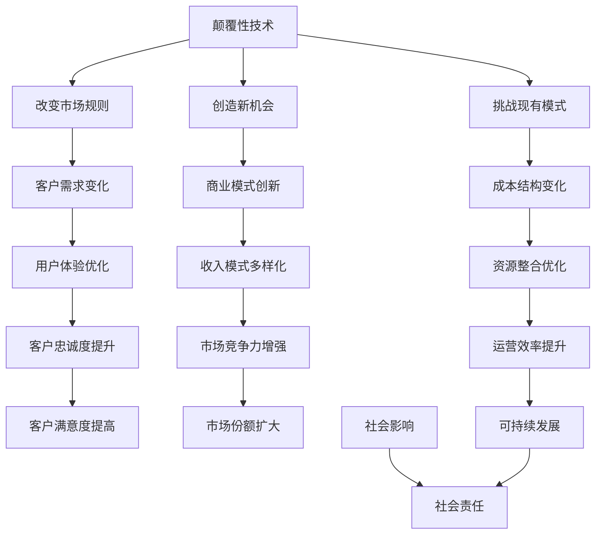
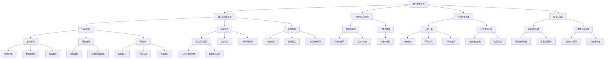

                 


# 技术创业中的商业模式创新：超越传统思维

> 关键词：商业模式创新，技术创业，商业模型，颠覆性创新，战略规划，可持续发展

> 摘要：本文旨在探讨技术创业领域中商业模式的创新。在当今快速变化的技术环境下，创业者们必须超越传统的商业模式思维，探索更加灵活和创新的路径。本文将分析几个关键领域，包括颠覆性技术的影响、用户需求的变化、可持续发展的挑战，以及如何构建一个具有竞争力的商业模式。通过一系列案例研究，我们将探讨成功的商业模式创新策略，为技术创业者提供有价值的参考和指导。

## 1. 背景介绍

### 1.1 目的和范围

本文的目的是帮助技术创业者理解商业模式创新的重要性，并提供一系列的策略和方法来应对快速变化的市场和技术环境。我们将探讨以下关键领域：

- 颠覆性技术对商业模式的影响
- 用户需求的变化和趋势
- 可持续发展的挑战与商业模式的结合
- 创新商业模式的设计和实施

通过这些讨论，我们希望创业者能够获得启示，更好地规划和管理自己的业务，实现长期的成功。

### 1.2 预期读者

本文适合以下读者群体：

- 技术创业者
- 创新者
- 企业家
- 管理咨询顾问
- 对商业模式创新感兴趣的学者和研究人员

### 1.3 文档结构概述

本文结构如下：

1. 背景介绍
2. 核心概念与联系
3. 核心算法原理 & 具体操作步骤
4. 数学模型和公式 & 详细讲解 & 举例说明
5. 项目实战：代码实际案例和详细解释说明
6. 实际应用场景
7. 工具和资源推荐
8. 总结：未来发展趋势与挑战
9. 附录：常见问题与解答
10. 扩展阅读 & 参考资料

### 1.4 术语表

在本文中，我们将使用以下术语：

- 商业模式：企业如何创造、传递和获取价值的一种计划或结构。
- 颠覆性创新：通过全新的技术和方法颠覆现有市场格局的创新。
- 用户需求：消费者或用户对产品或服务的期望和需求。
- 可持续发展：满足当前需求而不损害后代满足自身需求的能力。

#### 1.4.1 核心术语定义

- 商业模式：商业模式是企业创造、传递和获取价值的一种计划或结构。它定义了企业的客户群体、价值主张、收入来源、关键资源、关键活动、合作伙伴网络以及成本结构。
- 颠覆性创新：颠覆性创新是一种通过全新的技术和方法颠覆现有市场格局的创新。它通常来自较小的市场参与者，通过提供更简单、更便宜、更易于使用的产品或服务来吸引客户。
- 用户需求：用户需求是消费者或用户对产品或服务的期望和需求。了解用户需求是商业模式设计的关键，因为只有满足用户需求，企业才能创造价值。
- 可持续发展：可持续发展是满足当前需求而不损害后代满足自身需求的能力。对于企业来说，可持续发展意味着在追求商业成功的同时，也要关注环境、社会和经济方面的责任。

#### 1.4.2 相关概念解释

- 商业模式创新：商业模式创新是指通过改变现有的商业模式或创建新的商业模式来创造价值。这可以包括改进现有产品的交付方式、开辟新的收入来源、重新定义客户关系，或者引入新的技术来降低成本。
- 颠覆性技术：颠覆性技术是一种具有革命性影响的新技术，它能够颠覆现有市场格局。这些技术通常提供更简单、更便宜、更易于使用的产品或服务，从而吸引客户。
- 用户体验：用户体验是指用户在使用产品或服务过程中所获得的整体感受。一个成功的商业模式应该能够提供出色的用户体验，从而增强客户的满意度和忠诚度。

#### 1.4.3 缩略词列表

- MVP（最小可行产品）：指具有基本功能的产品，用于验证市场需求的可行性。
- IoT（物联网）：指通过互联网连接的物理设备，实现数据交换和智能控制。
- AI（人工智能）：指模拟人类智能行为的计算机系统，包括学习、推理、感知和解决问题等能力。

## 2. 核心概念与联系

### 2.1 颠覆性技术的影响

颠覆性技术是商业模式创新的关键驱动力。这些技术能够改变市场规则，创造新的商业机会，同时也对现有商业模式构成挑战。以下是一个简单的 Mermaid 流程图，展示了颠覆性技术对商业模式的影响：



在这个流程图中，我们可以看到颠覆性技术通过多种途径影响商业模式。它改变了市场规则，创造了新的商业机会，同时也挑战了现有模式。这些变化最终导致了客户需求的变化、用户体验的优化、收入模式的多样化、成本结构的变化、资源整合的优化、客户忠诚度的提升、市场竞争力的增强、运营效率的提升、客户满意度的提高以及市场占有率的扩大。同时，商业模式创新也为企业的可持续发展和社会责任的实现提供了支持。

### 2.2 用户需求的变化和趋势

用户需求是商业模式的基石。随着技术的进步和社会的发展，用户需求也在不断变化。以下是一个简单的 Mermaid 流程图，展示了用户需求的变化和趋势：



在这个流程图中，我们可以看到用户需求的变化和趋势涉及多个方面，包括数字化需求的增长、个性化和定制化的需求、对可持续性的关注、隐私和安全的需求。随着技术的进步，这些需求逐渐渗透到各个领域，如智能家居、移动支付、在线购物、定制化服务、环保产品、隐私保护技术等。这些趋势不仅影响了商业模式的设计和实施，也为新的商业机会的出现提供了动力。

### 2.3 可持续发展的挑战与商业模式的结合

可持续发展已经成为全球范围内的热门话题，对于企业来说，如何在追求商业成功的同时，实现可持续发展，是一个重大的挑战。以下是一个简单的 Mermaid 流程图，展示了可持续发展的挑战与商业模式的结合：

```mermaid
graph TD
    A[可持续发展挑战] --> B[资源短缺]
    A --> C[环境污染]
    A --> D[社会不公]
    A --> E[气候变化]
    B --> F[循环经济模式]
    B --> G[资源再生利用]
    B --> H[绿色供应链管理]
    C --> I[员工福利与培训]
    C --> J[社区参与与支持]
    C --> K[劳动权益保护]
    D --> L[企业社会责任]
    D --> M[公益慈善活动]
    D --> N[公平竞争环境]
    E --> O[低碳经济模式]
    E --> P[可再生能源利用]
    E --> Q[碳排放管理]
    F --> R[产品生命周期管理]
    F --> S[环保材料应用]
    F --> T[绿色产品设计]
    G --> U[废弃物回收利用]
    G --> V[资源节约技术]
    G --> W[生态农业]
    H --> XX[绿色制造工艺]
    H --> YY[能源效率提升]
    H --> ZZ[废物减排技术]
    I --> AA[员工培训与晋升]
    I --> BB[员工福利计划]
    I --> CC[工作环境改善]
    J --> DD[社区支持项目]
    J --> EE[社会公益项目]
    J --> FF[社区参与活动]
    K --> GG[劳动权益保护政策]
    K --> HH[员工权益保障]
    K --> II[职业健康安全]
    L --> JJ[社会责任报告]
    L --> KK[可持续发展策略]
    L --> LL[环境保护政策]
    M --> MM[公益慈善活动]
    M --> NN[社会责任项目]
    M --> OO[可持续发展基金]
    N --> PP[公平竞争法规]
    N --> QQ[反垄断政策]
    N --> RR[行业自律机制]
    O --> SS[低碳经济模式]
    O --> TT[可再生能源利用]
    O --> UU[碳排放管理]
    P --> VV[环保技术创新]
    P --> WW[清洁能源推广]
    P --> XX[环境友好型产业]
    Q --> YY[智慧环保系统]
    Q --> ZZ[环境监测与评估]
    Q --> AAA[环境保护政策]
    R --> BBB[产品生命周期评估]
    R --> CCC[绿色供应链管理]
    R --> DDD[环保产品认证]
    S --> EEE[生态农业推广]
    S --> FFF[绿色制造工艺]
    S --> GGG[环保材料应用]
    T --> HHH[绿色建筑设计]
    T --> III[环保技术研发]
    T --> JJJ[绿色能源应用]
    U --> KKK[废弃物回收利用]
    U --> LLL[资源节约技术]
    U --> MMM[生态农业]
    V --> NNN[能源效率提升]
    V --> OOO[废物减排技术]
    V --> PPP[绿色供应链管理]
    W --> QQQ[环保技术创新]
    W --> RRR[清洁能源推广]
    W --> SSS[环境友好型产业]
```



在这个流程图中，我们可以看到可持续发展的挑战包括资源短缺、环境污染、社会不公和气候变化。为了应对这些挑战，企业需要采取多种措施，如循环经济模式、资源再生利用、绿色供应链管理、员工福利与培训、社区参与与支持、劳动权益保护、企业社会责任、公益慈善活动、低碳经济模式、可再生能源利用、碳排放管理、产品生命周期管理、环保材料应用、绿色产品设计、废弃物回收利用、资源节约技术、生态农业、绿色制造工艺、能源效率提升、废物减排技术、智慧环保系统、环境监测与评估、环境保护政策、公益慈善活动、社会责任项目、可持续发展基金、公平竞争法规、反垄断政策、行业自律机制、低碳经济模式、可再生能源利用、碳排放管理、环保技术创新、清洁能源推广、环境友好型产业、智慧环保系统、环境监测与评估、环境保护政策、产品生命周期评估、绿色供应链管理、环保产品认证、生态农业推广、绿色制造工艺、环保材料应用、绿色建筑设计、环保技术研发、绿色能源应用、废弃物回收利用、资源节约技术、环保技术创新、清洁能源推广、环境友好型产业等。这些措施不仅有助于企业实现可持续发展，也为社会的可持续发展提供了支持。

### 2.4 创新商业模式的设计和实施

创新商业模式的设计和实施是企业成功的关键。以下是一个简单的 Mermaid 流程图，展示了创新商业模式的设计和实施过程：

```mermaid
graph TD
    A[商业模式设计] --> B[市场需求分析]
    A --> C[价值主张定义]
    A --> D[客户细分与定位]
    A --> E[收入模式设计]
    B --> F[竞争分析]
    B --> G[市场趋势分析]
    B --> H[用户研究]
    C --> I[产品或服务定义]
    C --> J[用户体验设计]
    C --> K[差异化优势]
    D --> L[目标客户群体]
    D --> M[客户需求分析]
    D --> N[客户关系管理]
    E --> O[收入来源多样化]
    E --> P[定价策略]
    E --> Q[收益模型]
    F --> R[竞争者分析]
    F --> S[市场定位]
    F --> T[竞争优势分析]
    G --> U[市场机会识别]
    G --> V[威胁分析]
    G --> W[行业趋势分析]
    H --> X[用户行为分析]
    H --> Y[用户痛点识别]
    H --> Z[用户满意度评估]
    I --> AA[产品或服务功能]
    I --> BB[产品或服务特点]
    I --> CC[产品或服务优势]
    J --> DD[用户界面设计]
    J --> EE[用户交互体验]
    J --> FF[用户满意度提升]
    K --> GG[差异化特点]
    K --> HH[独特卖点]
    K --> II[核心竞争力]
    L --> JJ[目标客户定位]
    L --> KK[客户需求分析]
    L --> LL[客户关系维护]
    M --> MM[客户需求分析]
    M --> NN[客户痛点解决]
    M --> OO[客户满意度提升]
    N --> PP[客户关系管理]
    N --> QQ[客户沟通渠道]
    N --> RR[客户满意度评估]
    O --> SS[收入来源多样化]
    O --> TT[定价策略]
    O --> UU[收益模型设计]
    P --> VV[定价策略分析]
    P --> WW[收益模式优化]
    P --> XX[成本结构分析]
    Q --> YY[收益模型设计]
    Q --> ZZ[定价策略优化]
    Q --> AAA[成本效益分析]
    R --> BBB[竞争者分析]
    R --> CCC[市场定位]
    R --> DDD[竞争优势分析]
    S --> EEE[市场定位]
    S --> FFF[竞争策略]
    S --> GGG[差异化策略]
    T --> HHH[竞争优势分析]
    T --> III[差异化特点]
    T --> JJJ[核心竞争力]
    U --> KKK[市场机会识别]
    U --> LLL[行业趋势分析]
    U --> MMM[用户需求分析]
    V --> NNN[市场威胁分析]
    V --> OOO[竞争环境分析]
    V --> PPP[市场风险分析]
    W --> QQQ[市场机会分析]
    W --> RRR[市场趋势分析]
    W --> SSS[用户需求分析]
    X --> TTT[用户行为分析]
    X --> UUU[用户痛点识别]
    X --> VVV[用户满意度评估]
    Y --> WWW[用户需求分析]
    Y --> XXX[用户痛点解决]
    Y --> YYY[用户满意度提升]
    Z --> AAA[用户满意度评估]
    Z --> BBB[用户体验优化]
    Z --> CCC[用户需求满足]
    AA --> DDD[产品或服务功能]
    AA --> EEE[产品或服务特点]
    AA --> FFF[产品或服务优势]
    BB --> GGG[差异化特点]
    BB --> HHH[独特卖点]
    BB --> III[核心竞争力]
    CC --> JJJ[差异化特点]
    CC --> KKK[独特卖点]
    CC --> LLL[核心竞争力]
    DD --> MMM[用户体验设计]
    DD --> NNN[用户界面设计]
    DD --> OOO[用户交互体验]
    EE --> PPP[用户体验设计]
    EE --> QQ

