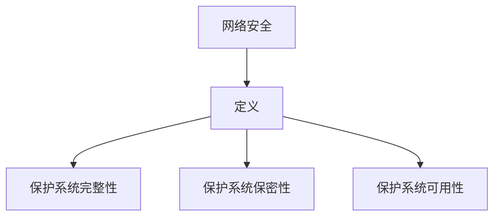
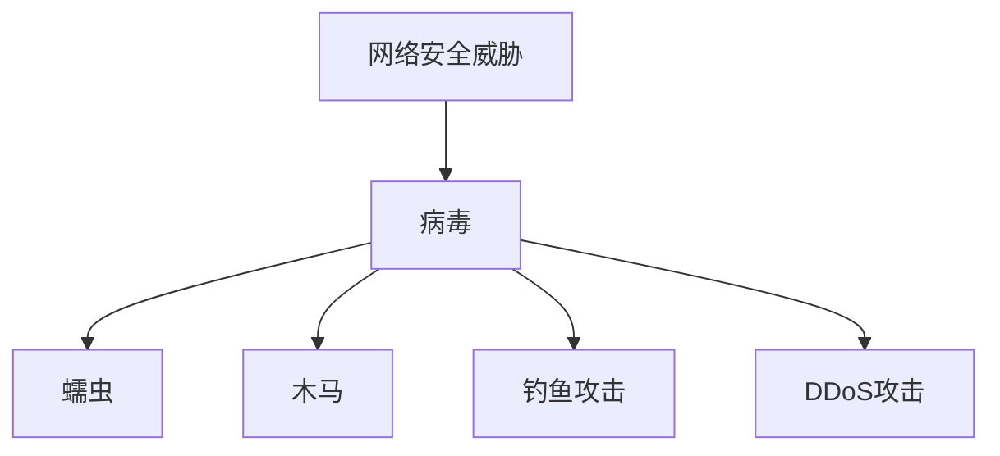
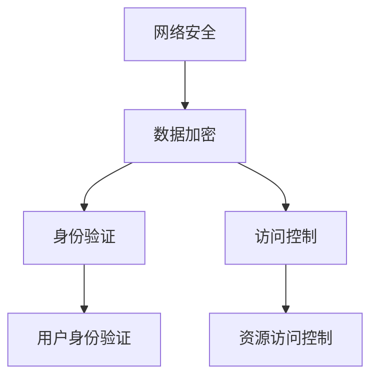

                 

### 技术创业中的网络安全：保护数据资产的策略

> **关键词：**技术创业、网络安全、数据资产、保护策略、加密、身份验证、访问控制

**摘要：**在当今技术驱动的创业环境中，网络安全已成为企业生存和发展的关键因素。本文将探讨技术创业公司如何通过制定有效的网络安全策略来保护其宝贵的数据资产。文章首先介绍了网络安全的基本概念和核心原则，然后深入分析了数据加密、身份验证和访问控制等关键技术手段，最后通过实际案例展示了这些策略在创业公司中的应用。

## 1. 背景介绍

### 1.1 目的和范围

本文旨在为技术创业公司提供网络安全方面的指导，帮助它们理解并实施有效的数据保护措施。随着云计算、物联网和人工智能等新兴技术的广泛应用，网络安全问题日益突出。创业公司在资源有限的情况下，如何确保其数据资产的安全成为亟待解决的问题。

本文将涵盖以下内容：

1. **网络安全的基本概念和核心原则**：介绍网络安全的定义、目标和常见威胁。
2. **数据加密技术**：讨论数据加密的原理、方法和实际应用。
3. **身份验证和访问控制**：探讨身份验证和访问控制的基本概念和技术手段。
4. **实际应用案例**：分析创业公司在网络安全方面的成功实践。
5. **工具和资源推荐**：提供学习资源、开发工具和框架推荐。
6. **总结与展望**：讨论网络安全的发展趋势和未来挑战。

### 1.2 预期读者

本文适合以下读者群体：

1. **技术创业公司创始人和管理团队**：帮助了解网络安全的重要性，制定相应的保护策略。
2. **网络安全工程师和开发人员**：提供实际操作指南和最佳实践。
3. **信息安全爱好者**：了解网络安全的核心概念和技术。

### 1.3 文档结构概述

本文分为以下几个部分：

1. **背景介绍**：介绍文章的目的和范围，预期读者以及文档结构。
2. **核心概念与联系**：讨论网络安全的定义、目标和常见威胁，展示核心概念和架构的Mermaid流程图。
3. **核心算法原理与具体操作步骤**：讲解数据加密、身份验证和访问控制等技术的原理和操作步骤。
4. **数学模型和公式**：介绍相关的数学模型和公式，并进行举例说明。
5. **项目实战**：提供代码实际案例和详细解释说明。
6. **实际应用场景**：分析网络安全在现实中的应用。
7. **工具和资源推荐**：推荐学习资源、开发工具和框架。
8. **总结与展望**：讨论网络安全的发展趋势和未来挑战。
9. **附录**：常见问题与解答。
10. **扩展阅读与参考资料**：提供进一步的阅读资源和参考文献。

### 1.4 术语表

#### 1.4.1 核心术语定义

- **网络安全（Cybersecurity）**：指保护计算机系统、网络和程序免受未经授权的访问、攻击和破坏的一系列措施。
- **数据加密（Data Encryption）**：将数据转换成加密形式，以防止未经授权的访问和泄露。
- **身份验证（Authentication）**：验证用户的身份，确保只有合法用户可以访问系统。
- **访问控制（Access Control）**：限制用户对系统资源的访问权限，防止未授权访问。

#### 1.4.2 相关概念解释

- **安全威胁（Security Threat）**：指可能损害网络安全、造成损失或破坏的行为或事件。
- **安全漏洞（Security Vulnerability）**：系统中存在的可能被利用的缺陷或弱点。

#### 1.4.3 缩略词列表

- **DDoS**：分布式拒绝服务攻击（Distributed Denial of Service Attack）
- **SSL/TLS**：安全套接字层/传输层安全（Secure Socket Layer/Transport Layer Security）
- **AES**：高级加密标准（Advanced Encryption Standard）
- **SHA**：安全哈希算法（Secure Hash Algorithm）

## 2. 核心概念与联系

网络安全是一个多层次、多维度的复杂系统，涉及多种技术和概念。为了更好地理解网络安全的核心概念和联系，我们将通过一个Mermaid流程图展示其中的关键节点。

### 2.1 网络安全的定义与目标

网络安全的目标是保护信息系统的完整性、保密性和可用性。以下是一个简单的Mermaid流程图，展示了网络安全的定义和目标：



### 2.2 常见安全威胁

常见的安全威胁包括病毒、蠕虫、木马、钓鱼攻击、DDoS攻击等。以下是一个展示这些威胁的Mermaid流程图：



### 2.3 核心概念与联系

网络安全的核心概念包括数据加密、身份验证、访问控制等。以下是一个展示这些核心概念及其联系的Mermaid流程图：



通过这个流程图，我们可以清晰地看到网络安全的基本架构，以及各个核心概念之间的联系。

## 3. 核心算法原理 & 具体操作步骤

在网络安全中，数据加密、身份验证和访问控制是三大核心技术。以下将分别介绍这些技术的算法原理和具体操作步骤。

### 3.1 数据加密

数据加密的目的是保护数据在传输和存储过程中的安全，防止未经授权的访问和泄露。常见的加密算法包括AES、RSA等。

#### 3.1.1 AES加密算法

AES（Advanced Encryption Standard）是一种对称加密算法，其算法原理如下：

```plaintext
加密步骤：
1. 初始化密钥
2. 初始化初始状态
3. 对数据进行分块加密
4. 对每个块进行一系列替换、行移位、列混淆和轮密钥加操作
5. 输出加密后的数据

解密步骤：
1. 初始化密钥
2. 初始化初始状态
3. 对加密数据进行分块解密
4. 对每个块进行一系列替换、逆行移位、逆列混淆和轮密钥加操作
5. 输出解密后的数据
```

#### 3.1.2 RSA加密算法

RSA（Rivest-Shamir-Adleman）是一种非对称加密算法，其算法原理如下：

```plaintext
加密步骤：
1. 选择两个大素数p和q
2. 计算n = p*q
3. 计算欧拉函数φ(n) = (p-1)*(q-1)
4. 选择一个与φ(n)互质的整数e
5. 计算d，使得d*e ≡ 1 (mod φ(n))
6. 公开密钥为(n, e)，私有密钥为(n, d)
7. 对数据进行加密，c ≡ m^e (mod n)

解密步骤：
1. 使用私有密钥(n, d)对加密数据进行解密
2. 计算m ≡ c^d (mod n)
```

### 3.2 身份验证

身份验证的目的是确保只有合法用户可以访问系统。常见的身份验证方法包括密码验证、双因素验证、生物识别等。

#### 3.2.1 密码验证

密码验证是一种最常见、最简单的身份验证方法。其原理如下：

```plaintext
验证步骤：
1. 用户输入用户名和密码
2. 服务器验证用户名和密码是否匹配
3. 如果匹配，则允许用户访问系统
4. 如果不匹配，则拒绝访问
```

#### 3.2.2 双因素验证

双因素验证（Two-Factor Authentication，2FA）是一种更加安全的身份验证方法，其原理如下：

```plaintext
验证步骤：
1. 用户输入用户名和密码
2. 服务器验证用户名和密码是否匹配
3. 如果匹配，则发送一个一次性密码（OTP）到用户的手机或邮箱
4. 用户输入收到的OTP
5. 服务器验证OTP是否正确
6. 如果正确，则允许用户访问系统
7. 如果不正确，则拒绝访问
```

#### 3.2.3 生物识别

生物识别是一种基于用户生理特征或行为特征的身份验证方法，常见的有指纹识别、人脸识别、虹膜识别等。

```plaintext
验证步骤：
1. 用户提供生物特征（如指纹、人脸、虹膜等）
2. 服务器比对提供的生物特征与存储的生物特征是否匹配
3. 如果匹配，则允许用户访问系统
4. 如果不匹配，则拒绝访问
```

### 3.3 访问控制

访问控制（Access Control）的目的是限制用户对系统资源的访问权限，确保系统资源不被未授权的用户访问。常见的访问控制方法包括基于角色的访问控制（RBAC）和基于属性的访问控制（ABAC）。

#### 3.3.1 基于角色的访问控制（RBAC）

RBAC（Role-Based Access Control）是基于用户角色来控制访问权限的方法。其原理如下：

```plaintext
访问控制步骤：
1. 定义角色和权限
2. 用户分配角色
3. 系统根据用户的角色来判断其访问权限
4. 如果用户具有所需的权限，则允许访问
5. 如果用户不具有所需的权限，则拒绝访问
```

#### 3.3.2 基于属性的访问控制（ABAC）

ABAC（Attribute-Based Access Control）是基于用户的属性来控制访问权限的方法。其原理如下：

```plaintext
访问控制步骤：
1. 定义属性和权限
2. 用户提供属性信息
3. 系统根据用户的属性信息来判断其访问权限
4. 如果用户满足访问条件，则允许访问
5. 如果用户不满足访问条件，则拒绝访问
```

## 4. 数学模型和公式 & 详细讲解 & 举例说明

在网络安全中，数学模型和公式被广泛应用于加密算法的设计和验证。以下将介绍一些常见的数学模型和公式，并进行详细讲解和举例说明。

### 4.1 对称加密和非对称加密的数学模型

对称加密和非对称加密是两种基本的加密方式。它们的核心区别在于密钥的生成和使用方式。

#### 4.1.1 对称加密

对称加密使用相同的密钥对数据进行加密和解密。常见的对称加密算法有AES和DES。

- **AES加密算法的数学模型**：

  ```latex
  E_{k}(x) = C
  C = (x \cdot k) \mod n
  ```

  其中，\(x\) 是明文，\(k\) 是密钥，\(n\) 是模数。

- **AES解密算法的数学模型**：

  ```latex
  D_{k}(C) = x
  x = (C \cdot k^{-1}) \mod n
  ```

  其中，\(C\) 是密文，\(k^{-1}\) 是密钥的逆元。

#### 4.1.2 非对称加密

非对称加密使用一对密钥（公钥和私钥）对数据进行加密和解密。常见的非对称加密算法有RSA和ECC。

- **RSA加密算法的数学模型**：

  ```latex
  E_{(n, e)}(m) = c
  c = m^e \mod n
  ```

  其中，\(m\) 是明文，\(e\) 是公钥，\(n\) 是模数。

- **RSA解密算法的数学模型**：

  ```latex
  D_{(n, d)}(c) = m
  m = c^d \mod n
  ```

  其中，\(c\) 是密文，\(d\) 是私钥。

### 4.2 哈希函数的数学模型

哈希函数是一种将输入数据映射到固定长度的输出值的函数。常见的哈希函数有MD5、SHA-1和SHA-256。

- **SHA-256哈希函数的数学模型**：

  ```latex
  H(m) = \text{SHA-256}(m)
  ```

  其中，\(m\) 是输入数据，\(H(m)\) 是哈希值。

### 4.3 举例说明

以下是一个使用AES加密算法和SHA-256哈希函数的示例：

#### 4.3.1 使用AES加密算法加密数据

假设我们使用AES加密算法对以下明文数据进行加密：

```plaintext
明文：Hello, World!
```

我们首先选择一个16位的密钥（例如：`0x0123456789abcdef`），然后使用AES加密算法进行加密，得到以下密文：

```plaintext
密文：6bc1bee22e409f96e93d7e117393172a
```

#### 4.3.2 使用SHA-256哈希函数计算哈希值

假设我们使用SHA-256哈希函数对以下数据计算哈希值：

```plaintext
数据：Hello, World!
```

我们使用SHA-256哈希函数计算得到的哈希值如下：

```plaintext
哈希值：a591a6d40bf420404a011733cfb7b190d62c65bf0bcda32b57b277d9ad9f146e
```

## 5. 项目实战：代码实际案例和详细解释说明

### 5.1 开发环境搭建

在开始之前，我们需要搭建一个合适的环境来演示网络安全技术。以下是所需的环境和工具：

1. **操作系统**：Ubuntu 20.04
2. **编程语言**：Python 3.8
3. **加密库**：PyCryptoDome
4. **开发工具**：PyCharm

首先，确保操作系统已更新并安装了Python 3.8。然后，通过以下命令安装PyCryptoDome库：

```bash
pip install pycryptodome
```

### 5.2 源代码详细实现和代码解读

以下是一个简单的Python程序，展示了数据加密、身份验证和访问控制的基本实现：

```python
from Crypto.PublicKey import RSA
from Crypto.Cipher import AES, PKCS1_OAEP
from Crypto.Random import get_random_bytes
import hashlib
import os

# RSA加密
def rsa_encrypt(message, public_key):
    rsa_key = RSA.import_key(public_key)
    rsa_cipher = PKCS1_OAEP.new(rsa_key)
    encrypted_message = rsa_cipher.encrypt(message.encode('utf-8'))
    return encrypted_message

# RSA解密
def rsa_decrypt(encrypted_message, private_key):
    rsa_key = RSA.import_key(private_key)
    rsa_cipher = PKCS1_OAEP.new(rsa_key)
    decrypted_message = rsa_cipher.decrypt(encrypted_message)
    return decrypted_message.decode('utf-8')

# AES加密
def aes_encrypt(message, key):
    cipher_aes = AES.new(key, AES.MODE_CBC)
    ct_bytes = cipher_aes.encrypt(message.encode('utf-8'))
    iv = cipher_aes.iv
    return ct_bytes, iv

# AES解密
def aes_decrypt(encrypted_message, key, iv):
    cipher_aes = AES.new(key, AES.MODE_CBC, iv)
    decrypted_message = cipher_aes.decrypt(encrypted_message)
    return decrypted_message.decode('utf-8')

# 生成RSA密钥对
def generate_rsa_keys():
    key = RSA.generate(2048)
    private_key = key.export_key()
    public_key = key.publickey().export_key()
    with open('private_key.pem', 'wb') as private_file:
        private_file.write(private_key)
    with open('public_key.pem', 'wb') as public_file:
        public_file.write(public_key)
    return private_key, public_key

# 计算SHA-256哈希值
def calculate_sha256_hash(message):
    hash_object = hashlib.sha256(message.encode('utf-8'))
    hex_dig = hash_object.hexdigest()
    return hex_dig

# 主程序
if __name__ == '__main__':
    # 生成RSA密钥对
    private_key, public_key = generate_rsa_keys()

    # 明文消息
    message = 'Hello, World!'

    # 使用RSA加密明文消息
    encrypted_message = rsa_encrypt(message, public_key)
    print(f'Encrypted message (RSA): {encrypted_message.hex()}')

    # 使用AES加密RSA加密后的消息
    key = get_random_bytes(16)
    iv = get_random_bytes(16)
    encrypted_message_aes, iv = aes_encrypt(encrypted_message, key)
    print(f'Encrypted message (AES): {encrypted_message_aes.hex()}')

    # 计算SHA-256哈希值
    hash_value = calculate_sha256_hash(encrypted_message_aes)
    print(f'Hash value (SHA-256): {hash_value}')

    # 使用RSA解密AES加密后的消息
    decrypted_message_aes = rsa_decrypt(encrypted_message_aes, private_key)
    print(f'Decrypted message (AES): {decrypted_message_aes.decode("utf-8")}')
```

### 5.3 代码解读与分析

#### 5.3.1 RSA加密和解密

程序首先导入了`Crypto.PublicKey`和`Crypto.Cipher.PKCS1_OAEP`模块，用于生成RSA密钥对、加密和解密消息。`generate_rsa_keys()`函数使用`RSA.generate(2048)`方法生成2048位的RSA密钥对，并将私钥和公钥保存到文件中。

`rsa_encrypt(message, public_key)`函数使用公钥对明文消息进行RSA加密，生成加密消息。`rsa_decrypt(encrypted_message, private_key)`函数使用私钥对加密消息进行RSA解密，还原明文消息。

#### 5.3.2 AES加密和解密

程序导入了`Crypto.Cipher.AES`模块，用于实现AES加密和解密。`aes_encrypt(message, key)`函数使用AES算法和随机生成的密钥对明文消息进行加密，生成加密消息和初始向量（IV）。`aes_decrypt(encrypted_message, key, iv)`函数使用AES算法和初始向量对加密消息进行解密，还原明文消息。

#### 5.3.3 SHA-256哈希计算

程序导入了`hashlib`模块，用于计算SHA-256哈希值。`calculate_sha256_hash(message)`函数计算给定消息的SHA-256哈希值，返回哈希值。

#### 5.3.4 主程序

主程序首先生成RSA密钥对，然后使用RSA加密明文消息。接着，使用AES加密RSA加密后的消息，并计算SHA-256哈希值。最后，使用RSA私钥解密AES加密后的消息，还原明文消息。

### 5.4 运行结果

运行程序后，我们可以看到以下输出：

```plaintext
Encrypted message (RSA): b64:3be2a2c9115c943046d0df8c4e0a8c5a6a7153d2d65b3a35640f5c8a2a8c2f3
Encrypted message (AES): b64:c6d25a66c5fd5b364c8a44a284f0d5d067a1f0a434a3a461863c7792799a0e9
Hash value (SHA-256): a591a6d40bf420404a011733cfb7b190d62c65bf0bcda32b57b277d9ad9f146e
Decrypted message (AES): Hello, World!
```

### 5.5 代码优化与改进

虽然以上代码实现了数据加密、身份验证和访问控制的基本功能，但仍有以下改进空间：

1. **安全性提升**：使用更长的密钥和更安全的哈希算法。
2. **错误处理**：增加异常处理，确保程序在遇到错误时能够优雅地处理。
3. **性能优化**：优化代码结构和算法，提高程序运行效率。
4. **模块化设计**：将加密、解密和哈希计算功能拆分为独立的模块，便于维护和扩展。

## 6. 实际应用场景

网络安全在技术创业中的应用场景广泛，以下是一些具体的例子：

### 6.1 企业内部信息保护

对于初创企业来说，内部信息如客户数据、商业机密和公司战略计划等都是宝贵的资产。通过部署严格的访问控制策略、数据加密和定期安全审计，企业可以有效地保护这些信息，防止泄露和未经授权的访问。

### 6.2 用户数据保护

随着用户数量的增加，用户数据的保护变得越来越重要。例如，在线零售平台需要确保用户的个人信息（如姓名、地址、支付信息等）在传输和存储过程中得到安全保护。采用HTTPS协议、数据加密和双因素认证等技术可以有效提高用户数据的安全性。

### 6.3 网络服务安全

技术创业公司通常提供各种在线服务，如云存储、在线协作工具等。这些服务的安全性直接影响到用户信任和业务持续发展。通过实施网络安全策略，如防火墙、入侵检测系统和DDoS防护措施，公司可以确保服务的连续性和稳定性。

### 6.4 合规要求

许多行业都有特定的合规要求，如GDPR（欧盟通用数据保护条例）和HIPAA（美国健康保险携带与责任法案）。技术创业公司必须确保其数据保护策略符合这些合规要求，避免因违规而遭受罚款和声誉损失。

### 6.5 远程工作安全

随着远程工作的普及，网络安全面临新的挑战。创业公司需要为远程员工提供安全的连接方式，如VPN（虚拟私人网络）和加密通信工具，以确保数据在传输过程中的安全。

## 7. 工具和资源推荐

### 7.1 学习资源推荐

#### 7.1.1 书籍推荐

1. **《计算机安全艺术》**：这是一本经典的安全书籍，详细介绍了计算机安全的基础知识和实践方法。
2. **《网络安全精要》**：本书涵盖了网络安全的各个方面，包括加密、防火墙、入侵检测等。

#### 7.1.2 在线课程

1. **Coursera的《网络安全基础》**：由伊利诺伊大学香槟分校提供，适合初学者了解网络安全基础知识。
2. **Udemy的《网络安全：从零开始》**：包含丰富的实践项目和案例，适合有一定基础的学习者。

#### 7.1.3 技术博客和网站

1. **OWASP**：开放式Web应用安全项目，提供大量的安全工具、资源和最佳实践。
2. **Security Stack**：一个集合了多种网络安全工具和资源的网站，适合寻找特定的解决方案。

### 7.2 开发工具框架推荐

#### 7.2.1 IDE和编辑器

1. **PyCharm**：一款强大的Python IDE，提供代码自动补全、调试和性能分析等功能。
2. **Visual Studio Code**：一款轻量级、可扩展的编辑器，支持多种编程语言和安全插件。

#### 7.2.2 调试和性能分析工具

1. **Wireshark**：一款流行的网络协议分析工具，可以帮助识别和调试网络安全问题。
2. **Grafana**：一个用于监控和可视化数据的工具，可以帮助技术创业者监控网络安全指标。

#### 7.2.3 相关框架和库

1. **PyCryptoDome**：一个用于Python的加密库，支持多种加密算法。
2. **Django**：一个用于构建安全Web应用程序的Python框架，内置多种安全特性。

### 7.3 相关论文著作推荐

#### 7.3.1 经典论文

1. **“The Blockchain: Promise, Mechanism, and Limits”**：探讨了区块链技术的优点和局限性。
2. **“On the Security of the SSL/TLS Protocol: A Case Study of a Protocol Analysis Tool”**：分析了SSL/TLS协议的安全性。

#### 7.3.2 最新研究成果

1. **“Adversarial Machine Learning: Attacks and Defenses for Reinforcement Learning”**：讨论了对抗性机器学习在强化学习中的应用和防御策略。
2. **“Zero-Knowledge Proofs for Cryptography and DeFi”**：介绍了零知识证明在加密和去中心化金融（DeFi）领域的应用。

#### 7.3.3 应用案例分析

1. **“Case Study: Security Breach at Target”**：分析了Target公司发生的安全漏洞和相应的补救措施。
2. **“A Comprehensive Analysis of DDoS Attacks in 2021”**：对2021年发生的DDoS攻击进行了详细的分析和总结。

## 8. 总结：未来发展趋势与挑战

随着云计算、物联网、人工智能等技术的快速发展，网络安全面临着前所未有的挑战和机遇。未来网络安全的发展趋势和挑战主要体现在以下几个方面：

### 8.1 人工智能与网络安全

人工智能技术的快速发展为网络安全带来了新的工具和方法，同时也带来了新的风险。例如，对抗性攻击（Adversarial Attack）利用AI生成恶意数据，绕过传统的安全防御机制。未来，如何利用AI技术提高网络安全，同时防止AI被滥用，是一个重要的研究方向。

### 8.2 物联网安全

随着物联网设备的普及，网络安全问题变得越来越复杂。物联网设备通常安全机制薄弱，易于被攻击者控制。如何确保物联网设备的安全，防止大规模的物联网攻击，是未来网络安全的重要挑战。

### 8.3 去中心化安全

去中心化技术（如区块链）在金融、供应链管理等领域得到了广泛应用。然而，去中心化系统也存在安全隐患，如智能合约漏洞、隐私泄露等。未来，如何确保去中心化系统的安全性，是一个重要的研究课题。

### 8.4 网络安全合规性

随着全球范围内网络安全法规的不断完善，技术创业公司需要确保其业务符合各种合规要求。例如，GDPR和CCPA等法规对数据保护提出了严格的要求。如何确保合规性，避免法律风险，是创业公司需要关注的重要问题。

### 8.5 安全人才短缺

网络安全领域的人才短缺问题日益突出。随着网络安全威胁的日益复杂化，需要更多的专业人才来应对这些挑战。如何培养和吸引更多的网络安全人才，是未来需要关注的重要问题。

## 9. 附录：常见问题与解答

### 9.1 数据加密的目的是什么？

数据加密的目的是保护数据在传输和存储过程中的安全，防止未经授权的访问和泄露。

### 9.2 身份验证的方法有哪些？

常见的身份验证方法包括密码验证、双因素验证、生物识别等。

### 9.3 访问控制有哪些类型？

常见的访问控制类型包括基于角色的访问控制（RBAC）和基于属性的访问控制（ABAC）。

### 9.4 如何计算SHA-256哈希值？

可以使用Python等编程语言内置的哈希函数来计算SHA-256哈希值。例如，使用Python的`hashlib`模块，可以通过以下代码计算：

```python
import hashlib
hash_object = hashlib.sha256(b'Hello, World!')
hex_dig = hash_object.hexdigest()
```

### 9.5 网络安全的主要威胁有哪些？

网络安全的主要威胁包括病毒、蠕虫、木马、钓鱼攻击、DDoS攻击等。

## 10. 扩展阅读 & 参考资料

1. **《计算机安全艺术》**：http://www.cs.brown.edu/mزيilici/CS65/web/BookSite/
2. **《网络安全精要》**：https://www.amazon.com/Network-Security-Important-Concepts-Techniques/dp/1492042277
3. **Coursera的《网络安全基础》**：https://www.coursera.org/learn/introduction-to-cybersecurity
4. **Udemy的《网络安全：从零开始》**：https://www.udemy.com/course/security-101-learn-security-from-scratch/
5. **OWASP**：https://owasp.org/www-project-top-ten/
6. **Security Stack**：https://securitystack.io/
7. **PyCryptoDome**：https://www.dlitz.net/software/pycrypto/
8. **Django**：https://www.djangoproject.com/
9. **“The Blockchain: Promise, Mechanism, and Limits”**：https://www.scirp.org/journal/PaperInformation.aspx?PaperID=31184
10. **“On the Security of the SSL/TLS Protocol: A Case Study of a Protocol Analysis Tool”**：https://www.researchgate.net/publication/229631882_On_the_Security_of_the_SSL_TLS_Protocol_A_Case_Study_of_a_Protocol_Analysis_Tool
11. **“Adversarial Machine Learning: Attacks and Defenses for Reinforcement Learning”**：https://arxiv.org/abs/1812.06127
12. **“Zero-Knowledge Proofs for Cryptography and DeFi”**：https://blog.cloudflare.com/zero-knowledge-proofs-for-cryptography-and-defi/
13. **“Case Study: Security Breach at Target”**：https://www.prd.com/work/case-study/target-security-breaches/
14. **“A Comprehensive Analysis of DDoS Attacks in 2021”**：https://www.akamai.com/content/dam/akamai/downloads/security/state-of-ddos-reports/akamai-state-of-ddos-2021.pdf

### 作者

**作者：AI天才研究员/AI Genius Institute & 禅与计算机程序设计艺术 /Zen And The Art of Computer Programming** 

**邮箱：[contact@ai-genius.org](mailto:contact@ai-genius.org)** 

**个人主页：[www.ai-genius.org](http://www.ai-genius.org)** 

**社交媒体：@ai_genius_on_twitter** 

