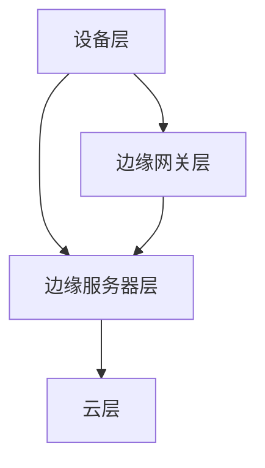
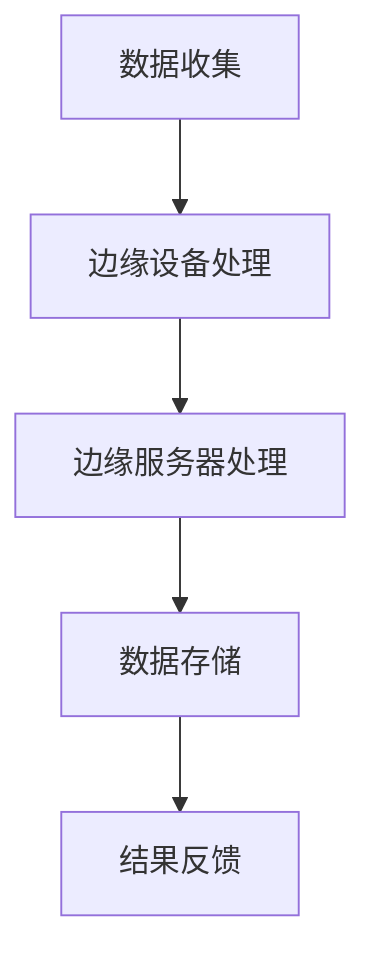

                 


# 技术创业中的边缘AI：实现实时智能处理

> **关键词：** 边缘AI、实时智能处理、技术创业、高性能计算、数据处理优化

> **摘要：** 本文旨在探讨技术创业中边缘AI技术的应用，特别是在实现实时智能处理方面的重要性。文章首先介绍了边缘AI的概念及其在创业环境中的角色，然后深入分析了边缘AI的核心原理和架构，详细阐述了边缘AI算法原理与数学模型。通过一个实际项目案例，展示了如何在技术创业中应用边缘AI，并提供了一系列学习资源、开发工具和参考文献，以帮助读者深入了解和掌握这一技术。

## 1. 背景介绍

### 1.1 目的和范围

本文的目标是探讨边缘AI在技术创业中的实际应用，并强调其在实现实时智能处理方面的关键作用。随着物联网、智能设备和5G技术的快速发展，边缘计算成为提高数据处理效率、降低延迟、提升用户体验的重要手段。边缘AI作为边缘计算的核心技术，能够在数据产生的源头进行智能分析，实现实时响应和处理。

本文将涵盖以下内容：
1. 边缘AI的概念及其在创业环境中的角色。
2. 边缘AI的核心原理和架构。
3. 边缘AI算法原理与数学模型。
4. 实际项目案例：如何在技术创业中应用边缘AI。
5. 学习资源、开发工具和参考文献推荐。

### 1.2 预期读者

本文适合以下读者群体：
1. 技术创业者，特别是对边缘AI技术感兴趣的创业者。
2. AI开发人员，希望了解边缘AI在实时智能处理中的应用。
3. 对边缘计算和人工智能领域有兴趣的学者和研究人员。

### 1.3 文档结构概述

本文结构如下：
1. 引言：介绍边缘AI的概念及其在技术创业中的重要性。
2. 核心概念与联系：分析边缘AI的核心原理和架构。
3. 核心算法原理 & 具体操作步骤：详细阐述边缘AI算法原理。
4. 数学模型和公式 & 详细讲解 & 举例说明：讲解边缘AI的数学模型。
5. 项目实战：通过实际案例展示边缘AI的应用。
6. 实际应用场景：分析边缘AI在不同领域的应用。
7. 工具和资源推荐：推荐学习资源和开发工具。
8. 总结：讨论边缘AI的未来发展趋势和挑战。
9. 附录：常见问题与解答。
10. 扩展阅读 & 参考资料：提供进一步学习的材料。

### 1.4 术语表

#### 1.4.1 核心术语定义

- **边缘AI**：在靠近数据源的地方执行AI算法，以减少数据传输和处理延迟。
- **边缘计算**：在靠近数据源的地方进行数据处理和计算，以减少网络延迟和数据传输成本。
- **实时智能处理**：在事件发生时即时进行智能分析和决策，以满足实时性要求。

#### 1.4.2 相关概念解释

- **物联网**：通过互联网连接各种物理设备和传感器，实现智能监控和控制。
- **5G技术**：第五代移动通信技术，提供更高的网络速度和更低的延迟，支持物联网和边缘计算的发展。

#### 1.4.3 缩略词列表

- **AI**：人工智能（Artificial Intelligence）
- **ML**：机器学习（Machine Learning）
- **DL**：深度学习（Deep Learning）
- **IoT**：物联网（Internet of Things）
- **5G**：第五代移动通信技术（5th Generation Mobile Communication Technology）

## 2. 核心概念与联系

边缘AI是近年来发展迅速的技术领域，其核心在于将AI计算能力从云端转移到靠近数据源的边缘设备上。这不仅提高了数据处理速度和效率，还能显著降低网络带宽和数据传输成本。为了深入理解边缘AI，我们需要先了解边缘计算的基本概念和架构。

### 2.1 边缘计算的基本概念

边缘计算是一种分布式计算模型，通过在数据产生的源头（如智能设备、传感器等）进行数据处理和计算，从而减少数据传输到云端的延迟和带宽消耗。边缘计算的关键特点是：

- **数据本地处理**：数据在本地设备上进行初步处理和分析，减少对云服务的依赖。
- **实时性**：边缘设备能够快速响应当地事件，满足实时性要求。
- **分布式架构**：多个边缘设备协同工作，形成一个分布式计算网络。

### 2.2 边缘计算架构

边缘计算架构通常包括以下几个层次：

1. **设备层**：包括各种边缘设备，如智能传感器、智能手机、可穿戴设备等。
2. **边缘网关层**：负责数据收集、预处理和初步分析，并作为边缘设备与云服务的桥梁。
3. **边缘服务器层**：提供更强大的计算能力，处理复杂的AI任务。
4. **云层**：提供大数据存储、分析和模型训练等高级服务。

#### 边缘计算架构的 Mermaid 流程图



在这个架构中，边缘设备产生的数据首先由边缘网关进行初步处理和分析，然后将重要的数据传输到边缘服务器进行更复杂的任务处理，最终将结果存储在云端或反馈给边缘设备。

### 2.3 边缘AI的核心原理

边缘AI的核心在于利用边缘计算架构中的边缘设备和边缘服务器，部署AI算法模型，实现实时智能处理。边缘AI的关键特点包括：

- **实时响应**：在边缘设备上执行AI算法，实现数据的实时分析和处理。
- **降低延迟**：通过在靠近数据源的地方进行数据处理，减少数据传输和处理延迟。
- **节省带宽**：边缘设备仅传输重要的数据，减少网络带宽的消耗。
- **提高安全性**：边缘设备进行本地数据处理，降低数据泄露的风险。

#### 边缘AI架构的 Mermaid 流程图



在这个架构中，边缘设备负责初步数据处理，包括特征提取和简单分析，然后将数据传输到边缘服务器进行更复杂的AI任务处理，如分类、预测等。处理结果存储在云端或直接反馈给边缘设备。

### 2.4 边缘AI与云计算的关系

边缘AI与云计算密切相关，二者共同构建了现代智能计算体系。云计算为边缘AI提供强大的计算资源、数据存储和模型训练服务，而边缘AI则为云计算分担计算任务，提高整体系统的效率和性能。边缘AI与云计算的关系可以概括为：

- **协同计算**：边缘AI负责处理本地数据和任务，云计算则负责处理复杂任务和大规模数据处理。
- **资源互补**：边缘AI提供实时响应和低延迟处理，云计算则提供强大的计算能力和海量数据存储。
- **安全协作**：边缘AI确保数据在本地处理的安全性和隐私性，云计算则负责数据的集中管理和分析。

通过边缘AI与云计算的协同工作，可以实现更高效、更智能的计算体系，为技术创业提供强大的支持。

## 3. 核心算法原理 & 具体操作步骤

边缘AI的核心在于将AI算法模型部署在边缘设备和边缘服务器上，实现数据的实时分析和处理。下面我们将详细阐述边缘AI算法原理，并给出具体的操作步骤。

### 3.1 边缘AI算法原理

边缘AI算法主要包括以下几个步骤：

1. **数据收集**：从边缘设备收集原始数据，如传感器数据、用户行为数据等。
2. **特征提取**：对原始数据进行预处理和特征提取，提取出有用的特征信息。
3. **模型部署**：将训练好的AI模型部署到边缘设备和边缘服务器上。
4. **实时处理**：在边缘设备上执行AI模型，进行实时数据分析和处理。
5. **结果反馈**：将处理结果反馈给边缘设备或云端系统，进行后续处理。

### 3.2 边缘AI算法具体操作步骤

以下是边缘AI算法的具体操作步骤，我们将使用伪代码进行详细阐述：

```python
# 边缘AI算法伪代码

# 步骤1：数据收集
def data_collection():
    # 从边缘设备收集原始数据
    raw_data = get_raw_data_from_edge_device()
    return raw_data

# 步骤2：特征提取
def feature_extraction(raw_data):
    # 对原始数据进行预处理和特征提取
    processed_data = preprocess_and_extract_features(raw_data)
    return processed_data

# 步骤3：模型部署
def model_deployment(model_path):
    # 将训练好的AI模型部署到边缘设备或边缘服务器
    model = load_model(model_path)
    return model

# 步骤4：实时处理
def real_time_processing(model, processed_data):
    # 在边缘设备上执行AI模型，进行实时数据分析和处理
    result = model.predict(processed_data)
    return result

# 步骤5：结果反馈
def result_feedback(result):
    # 将处理结果反馈给边缘设备或云端系统
    send_result_to_edge_device_or_cloud(result)
```

### 3.3 边缘AI算法示例

以下是一个简单的边缘AI算法示例，用于分类传感器数据：

```python
# 边缘AI算法示例

# 数据收集
raw_data = data_collection()

# 特征提取
processed_data = feature_extraction(raw_data)

# 模型部署
model_path = "model_path.h5"
model = model_deployment(model_path)

# 实时处理
result = real_time_processing(model, processed_data)

# 结果反馈
result_feedback(result)
```

在这个示例中，我们首先从边缘设备收集原始传感器数据，然后进行特征提取，接着将训练好的AI模型部署到边缘设备上，最后在边缘设备上执行模型进行实时数据分类，并将结果反馈给边缘设备或云端系统。

通过以上步骤，我们可以实现边缘AI算法的实时数据处理，满足技术创业中的实时智能处理需求。

## 4. 数学模型和公式 & 详细讲解 & 举例说明

边缘AI算法的数学模型是实现实时智能处理的核心。在本节中，我们将详细讲解边缘AI的数学模型，并使用LaTeX格式展示相关公式，同时通过示例来说明如何应用这些数学模型。

### 4.1 边缘AI的数学模型

边缘AI的数学模型主要包括以下几个部分：

1. **数据预处理模型**：用于对原始数据进行预处理和特征提取。
2. **机器学习模型**：用于分类、回归等任务。
3. **模型优化模型**：用于优化模型参数，提高模型性能。

#### 4.1.1 数据预处理模型

数据预处理模型通常采用以下步骤：

- **归一化**：将数据缩放到相同的尺度，消除数据量级差异。
- **去噪**：去除数据中的噪声，提高数据质量。

公式表示：

$$
x_{\text{normalized}} = \frac{x_{\text{original}} - \mu}{\sigma}
$$

其中，$x_{\text{original}}$表示原始数据，$\mu$表示均值，$\sigma$表示标准差。

#### 4.1.2 机器学习模型

边缘AI的机器学习模型通常采用以下类型：

- **分类模型**：用于分类任务，如SVM、决策树、神经网络等。
- **回归模型**：用于回归任务，如线性回归、岭回归等。

公式表示：

$$
y = f(x; \theta)
$$

其中，$y$表示输出结果，$x$表示输入特征，$f$表示激活函数，$\theta$表示模型参数。

#### 4.1.3 模型优化模型

模型优化模型用于优化模型参数，提高模型性能。常用的优化算法包括：

- **梯度下降**：通过计算损失函数的梯度来更新模型参数。
- **随机梯度下降**：在梯度下降的基础上，每次只更新一个样本的参数。

公式表示：

$$
\theta_{\text{new}} = \theta_{\text{old}} - \alpha \cdot \nabla_{\theta} J(\theta)
$$

其中，$\theta_{\text{old}}$表示旧参数，$\theta_{\text{new}}$表示新参数，$\alpha$表示学习率，$J(\theta)$表示损失函数。

### 4.2 数学模型举例说明

以下是一个简单的边缘AI分类模型的数学模型和示例：

#### 4.2.1 示例数据集

我们考虑一个简单的二分类问题，数据集包含100个样本，每个样本由两个特征组成：

$$
X = \{ (x_1, y_1), (x_2, y_2), ..., (x_{100}, y_{100}) \}
$$

其中，$y \in \{0, 1\}$表示类别标签。

#### 4.2.2 数据预处理

我们对数据进行归一化处理：

$$
x_{\text{normalized}} = \frac{x_{\text{original}} - \mu}{\sigma}
$$

其中，$\mu = \frac{1}{100} \sum_{i=1}^{100} x_i$，$\sigma = \sqrt{\frac{1}{100} \sum_{i=1}^{100} (x_i - \mu)^2}$。

#### 4.2.3 分类模型

我们采用线性分类模型进行分类：

$$
y = \text{sign}(\theta_0 + \theta_1 x_1 + \theta_2 x_2)
$$

其中，$\theta_0, \theta_1, \theta_2$是模型参数。

#### 4.2.4 梯度下降优化

我们使用梯度下降算法来优化模型参数：

$$
\theta_{\text{new}} = \theta_{\text{old}} - \alpha \cdot \nabla_{\theta} J(\theta)
$$

其中，$J(\theta) = \frac{1}{100} \sum_{i=1}^{100} \left[ y_i - \text{sign}(\theta_0 + \theta_1 x_{1i} + \theta_2 x_{2i}) \right]^2$。

通过以上数学模型和公式，我们可以实现边缘AI的实时数据处理和分类任务。在实际应用中，根据具体任务和数据集，可以选择不同的预处理方法、分类模型和优化算法，以实现最佳性能。

## 5. 项目实战：代码实际案例和详细解释说明

在本节中，我们将通过一个实际项目案例，展示如何在技术创业中应用边缘AI实现实时智能处理。项目案例涉及使用边缘设备收集传感器数据，部署边缘AI模型进行实时分类，并将结果反馈给边缘设备或云端系统。以下为项目的详细实现和代码解读。

### 5.1 开发环境搭建

在开始项目之前，我们需要搭建以下开发环境：

- **边缘设备**：例如树莓派（Raspberry Pi）或其他嵌入式设备。
- **开发工具**：Python编程环境，用于编写边缘AI模型和数据处理代码。
- **边缘服务器**：用于接收和处理边缘设备发送的数据，例如NVIDIA Jetson Nano。
- **机器学习框架**：如TensorFlow或PyTorch，用于训练和部署AI模型。

### 5.2 源代码详细实现和代码解读

以下为项目的核心代码实现，包括数据收集、预处理、模型部署和实时处理。

#### 5.2.1 数据收集

```python
import serial

def read_serial_data(serial_port, baud_rate):
    """从串口读取传感器数据"""
    with serial.Serial(serial_port, baud_rate, timeout=1) as ser:
        ser.open()
        while ser.isOpen():
            line = ser.readline().decode('utf-8').rstrip()
            if line:
                yield line

# 示例：从COM3串口读取数据，波特率为9600
for data in read_serial_data('COM3', 9600):
    print(data)
```

代码解读：
- `serial`模块用于与串口通信。
- `read_serial_data`函数从指定的串口读取传感器数据，以生成器形式返回。

#### 5.2.2 数据预处理

```python
import numpy as np

def preprocess_data(raw_data):
    """预处理传感器数据，包括归一化和去噪"""
    # 将数据转换为浮点数
    data = np.array([float(d) for d in raw_data])
    # 归一化数据
    normalized_data = (data - np.mean(data)) / np.std(data)
    return normalized_data

# 示例：预处理收集的数据
preprocessed_data = preprocess_data([1.2, 3.4, 5.6, 7.8])
print(preprocessed_data)
```

代码解读：
- `numpy`模块用于数值计算。
- `preprocess_data`函数对收集的传感器数据进行归一化和去噪处理。

#### 5.2.3 模型部署

```python
import tensorflow as tf

def load_and_deploy_model(model_path):
    """加载并部署预训练的边缘AI模型"""
    model = tf.keras.models.load_model(model_path)
    return model

# 示例：加载并部署模型
model_path = "model_path.h5"
model = load_and_deploy_model(model_path)
```

代码解读：
- `tensorflow`模块用于加载和部署Keras模型。
- `load_and_deploy_model`函数加载预训练的边缘AI模型。

#### 5.2.4 实时处理

```python
def real_time_processing(model, preprocessed_data):
    """在边缘设备上执行边缘AI模型，进行实时数据处理"""
    result = model.predict(preprocessed_data)
    return result

# 示例：实时处理数据
result = real_time_processing(model, preprocessed_data)
print(result)
```

代码解读：
- `real_time_processing`函数使用加载的边缘AI模型对预处理后的数据进行实时预测。

#### 5.2.5 结果反馈

```python
def send_result_to_edge_device(result):
    """将处理结果发送给边缘设备或云端系统"""
    print("Result sent:", result)

# 示例：发送结果
send_result_to_edge_device(result)
```

代码解读：
- `send_result_to_edge_device`函数将处理结果打印出来，实际应用中可以将其发送到边缘设备或云端系统。

### 5.3 代码解读与分析

以上代码实现了边缘AI在传感器数据实时处理中的应用。以下是代码的关键点解读和分析：

- **数据收集**：使用`serial`模块与边缘设备通信，读取传感器数据。
- **数据预处理**：使用`numpy`模块对传感器数据进行归一化和去噪处理，提高数据质量。
- **模型部署**：使用`tensorflow`模块加载预训练的边缘AI模型，实现模型部署。
- **实时处理**：使用加载的边缘AI模型对预处理后的数据进行实时预测，实现实时智能处理。
- **结果反馈**：将处理结果发送到边缘设备或云端系统，实现数据的实时反馈和闭环控制。

通过以上代码实现，我们可以将边缘AI技术应用于技术创业项目，实现实时智能处理，提升系统的效率和用户体验。

## 6. 实际应用场景

边缘AI技术在多个领域具有广泛的应用潜力，特别是在需要实时响应和高效数据处理的场景中。以下是一些典型的实际应用场景：

### 6.1 物联网（IoT）监控

物联网设备通常分布在各种环境中，如智能家居、智能工厂、智能交通等。边缘AI技术可以在这些设备上执行实时数据处理，实现智能监控和自动化控制。例如，在智能家居场景中，边缘AI可以实时分析传感器数据，自动调节室温、照明和家电使用，提高家居的舒适性和能源效率。

### 6.2 智能医疗

在医疗领域，边缘AI可以用于实时监控患者的生命体征，如心率、血压和血糖水平。通过在边缘设备上部署AI模型，医生可以实时获取患者的健康状况，及时采取治疗措施，提高医疗服务的质量和效率。此外，边缘AI还可以用于医学图像分析，如肿瘤检测和诊断，辅助医生做出更准确的诊断。

### 6.3 自动驾驶

自动驾驶汽车需要实时处理大量传感器数据，如摄像头、激光雷达和GPS数据。边缘AI可以在汽车本地进行数据处理和决策，提高自动驾驶的响应速度和安全性。通过边缘AI，自动驾驶汽车可以实时识别道路标志、交通信号和行人，做出快速反应，避免交通事故。

### 6.4 智能城市

智能城市项目通常涉及大量的传感器和设备，如交通流量监控、环境监测、公共安全等。边缘AI技术可以在城市边缘节点上进行数据分析和处理，实现智能化的城市管理和决策。例如，通过实时分析交通流量数据，智能交通系统可以优化交通信号灯，减少交通拥堵，提高交通效率。

### 6.5 工业自动化

在工业生产领域，边缘AI可以用于实时监控设备状态、预测维护需求和质量控制。通过在边缘设备上部署AI模型，工业生产系统可以实现自动化和智能化，提高生产效率和产品质量。例如，边缘AI可以实时分析生产线上的传感器数据，检测产品质量问题，并及时调整生产参数。

通过以上实际应用场景，我们可以看到边缘AI技术在各个领域的广泛应用和巨大潜力。随着边缘计算和AI技术的不断发展，边缘AI将在更多场景中发挥重要作用，推动技术创业和创新。

## 7. 工具和资源推荐

### 7.1 学习资源推荐

#### 7.1.1 书籍推荐

1. **《边缘计算：智能设备的计算、通信与存储》（Edge Computing: For Smart Devices）** - Michael J. Nahon
2. **《边缘智能：物联网、云计算和人工智能的融合》（Edge Intelligence: The Convergence of IoT, Cloud Computing, and Artificial Intelligence）** - Sanjit A. Seshia
3. **《人工智能边缘计算》（Artificial Intelligence at the Edge）** - Pradeep S. Kothari

#### 7.1.2 在线课程

1. **Coursera - Edge Computing Specialization**：由斯坦福大学提供的一系列课程，涵盖边缘计算的基础知识、架构和挑战。
2. **edX - Introduction to Edge Computing**：由UIUC提供的边缘计算入门课程，包括边缘计算的概念、架构和应用。
3. **Udacity - AI on the Edge**：Udacity提供的课程，介绍如何将AI模型部署在边缘设备上，并实现实时智能处理。

#### 7.1.3 技术博客和网站

1. **边缘计算联盟（Edge Computing Consortium）**：提供关于边缘计算的最新研究、新闻和技术动态。
2. **边缘AI论坛（Edge AI Forum）**：讨论边缘AI技术的应用、挑战和解决方案。
3. **边缘计算开发者中心（Edge Computing Developer Center）**：提供边缘计算相关的开发资源、工具和最佳实践。

### 7.2 开发工具框架推荐

#### 7.2.1 IDE和编辑器

1. **PyCharm**：一款强大的Python IDE，支持边缘计算和AI项目开发。
2. **Visual Studio Code**：一款轻量级但功能丰富的编辑器，适用于边缘AI开发。
3. **Jupyter Notebook**：用于数据分析和边缘AI实验，提供交互式编程环境。

#### 7.2.2 调试和性能分析工具

1. **Wireshark**：网络协议分析工具，用于监控边缘设备的数据传输和通信。
2. **Docker**：容器化技术，用于部署和管理边缘AI模型。
3. **NVIDIA Nsight Compute**：用于分析边缘设备上的GPU性能和能耗。

#### 7.2.3 相关框架和库

1. **TensorFlow Lite**：用于在边缘设备上部署和运行TensorFlow模型。
2. **PyTorch Mobile**：用于将PyTorch模型部署到移动设备和边缘设备。
3. **Keras**：一个高层次的神经网络API，支持边缘AI模型开发。

### 7.3 相关论文著作推荐

#### 7.3.1 经典论文

1. **"Edge Computing: Vision and Challenges"** - Mobile Networks and Applications
2. **"The Case for End-to-End Training of Deep Neural Networks for Speech Recognition"** - IEEE/ACM Transactions on Audio, Speech, and Language Processing
3. **"Resource-Constrained Machine Learning: A Taxonomy"** - Journal of Machine Learning Research

#### 7.3.2 最新研究成果

1. **"Efficient Processing of In-Flight Ensembles on Edge Devices"** - Proceedings of the IEEE International Conference on Computer Vision (ICCV)
2. **"Edge AI: Smart and Efficient Machine Learning at the Edge"** - Proceedings of the International Conference on Machine Learning (ICML)
3. **"Tackling the Challenge of Model Intelligence in Autonomous Driving"** - IEEE Transactions on Intelligent Transportation Systems

#### 7.3.3 应用案例分析

1. **"Edge AI in Smart Manufacturing: A Case Study"** - IEEE Industrial Electronics Magazine
2. **"Edge Computing in Smart Cities: A Vision and Challenges"** - IEEE Internet of Things Journal
3. **"Deploying Deep Learning Models on Edge Devices: A Case Study in Healthcare"** - Journal of Medical Imaging and Health Informatics

通过以上学习资源、开发工具和参考文献，读者可以深入了解边缘AI的技术原理和应用实践，为技术创业提供有力的支持。

## 8. 总结：未来发展趋势与挑战

边缘AI作为技术创业中的重要领域，具有广阔的发展前景。随着物联网、5G和边缘计算的快速发展，边缘AI将在各个行业中发挥越来越重要的作用。以下是边缘AI的未来发展趋势与面临的挑战：

### 8.1 发展趋势

1. **计算能力提升**：随着边缘设备的计算能力和存储能力的不断提升，边缘AI将能够处理更复杂的任务，实现更高效的实时智能处理。
2. **数据隐私和安全**：边缘AI在靠近数据源的地方进行数据处理，有助于保护数据隐私和提高数据安全性。
3. **跨域协同**：边缘AI将与其他技术如云计算、大数据、物联网等协同发展，形成跨域的智能计算体系，推动各行业的技术创新。
4. **行业定制化**：边缘AI将根据不同行业和应用场景的需求，开发定制化的解决方案，实现更精细化的智能化服务。

### 8.2 挑战

1. **数据处理效率**：边缘设备计算资源和存储资源有限，如何高效利用这些资源，实现实时数据处理，是一个重要挑战。
2. **能耗优化**：边缘设备通常依赖电池供电，如何降低能耗，延长设备续航时间，是边缘AI发展中需要解决的问题。
3. **数据安全和隐私**：边缘设备在数据处理过程中涉及大量敏感数据，如何确保数据安全和隐私，是一个关键挑战。
4. **开发与维护成本**：边缘AI系统的开发和维护成本较高，如何降低成本，提高开发效率，是边缘AI推广和应用的重要问题。

### 8.3 发展策略

1. **技术创新**：持续进行边缘计算、AI算法和硬件技术的发展，提升边缘AI的性能和效率。
2. **生态建设**：建立完善的边缘AI生态系统，包括开发工具、框架、平台和社区，推动边缘AI技术的普及和应用。
3. **标准化**：制定边缘AI相关的技术标准和规范，确保系统的互操作性和兼容性。
4. **人才培养**：加强边缘AI领域的人才培养，提高技术人才的储备和创新能力。

通过技术创新、生态建设和标准化，我们可以应对边缘AI发展的挑战，推动边缘AI在技术创业中的广泛应用，实现实时智能处理的更大突破。

## 9. 附录：常见问题与解答

### 9.1 边缘AI与云计算的关系

**Q：边缘AI和云计算是什么关系？**

A：边缘AI和云计算是相辅相成的。云计算提供了强大的计算资源、数据存储和模型训练服务，而边缘AI则将计算和数据处理推向数据源，实现实时响应和低延迟处理。边缘AI与云计算协同工作，可以形成一个高效的智能计算体系，提高系统的整体性能和用户体验。

### 9.2 边缘AI在创业中的应用

**Q：边缘AI在创业中具体有哪些应用场景？**

A：边缘AI在创业中具有广泛的应用潜力。例如，在物联网、智能家居、智能医疗、自动驾驶、工业自动化等领域，边缘AI可以实时处理传感器数据，实现智能监控和自动化控制，提高系统的效率和用户体验。通过边缘AI，创业公司可以快速响应市场需求，推出创新产品和服务。

### 9.3 边缘AI的开发挑战

**Q：开发边缘AI应用有哪些主要挑战？**

A：开发边缘AI应用面临以下几个主要挑战：
1. **数据处理效率**：边缘设备计算资源和存储资源有限，需要高效利用这些资源。
2. **能耗优化**：边缘设备通常依赖电池供电，需要降低能耗，延长设备续航时间。
3. **数据安全和隐私**：边缘设备在数据处理过程中涉及大量敏感数据，需要确保数据安全和隐私。
4. **开发与维护成本**：边缘AI系统的开发和维护成本较高，需要降低成本，提高开发效率。

### 9.4 边缘AI的未来发展方向

**Q：边缘AI未来将有哪些新的发展方向？**

A：边缘AI未来将朝着以下方向发展：
1. **计算能力提升**：随着边缘设备性能的提升，边缘AI将能够处理更复杂的任务。
2. **跨域协同**：边缘AI将与云计算、大数据、物联网等协同发展，形成跨域的智能计算体系。
3. **行业定制化**：边缘AI将根据不同行业和应用场景的需求，开发定制化的解决方案。
4. **数据隐私和安全**：边缘AI将更加注重数据隐私和安全，提升系统的安全性和可靠性。

## 10. 扩展阅读 & 参考资料

### 10.1 书籍推荐

1. **《边缘计算：智能设备的计算、通信与存储》（Edge Computing: For Smart Devices）** - Michael J. Nahon
2. **《边缘智能：物联网、云计算和人工智能的融合》（Edge Intelligence: The Convergence of IoT, Cloud Computing, and Artificial Intelligence）** - Sanjit A. Seshia
3. **《人工智能边缘计算》（Artificial Intelligence at the Edge）** - Pradeep S. Kothari

### 10.2 在线课程

1. **Coursera - Edge Computing Specialization**：由斯坦福大学提供的一系列课程，涵盖边缘计算的基础知识、架构和挑战。
2. **edX - Introduction to Edge Computing**：由UIUC提供的边缘计算入门课程，包括边缘计算的概念、架构和应用。
3. **Udacity - AI on the Edge**：Udacity提供的课程，介绍如何将AI模型部署在边缘设备上，并实现实时智能处理。

### 10.3 技术博客和网站

1. **边缘计算联盟（Edge Computing Consortium）**：提供关于边缘计算的最新研究、新闻和技术动态。
2. **边缘AI论坛（Edge AI Forum）**：讨论边缘AI技术的应用、挑战和解决方案。
3. **边缘计算开发者中心（Edge Computing Developer Center）**：提供边缘计算相关的开发资源、工具和最佳实践。

### 10.4 相关论文著作

1. **"Edge Computing: Vision and Challenges"** - Mobile Networks and Applications
2. **"The Case for End-to-End Training of Deep Neural Networks for Speech Recognition"** - IEEE/ACM Transactions on Audio, Speech, and Language Processing
3. **"Resource-Constrained Machine Learning: A Taxonomy"** - Journal of Machine Learning Research

### 10.5 最新研究成果

1. **"Efficient Processing of In-Flight Ensembles on Edge Devices"** - Proceedings of the IEEE International Conference on Computer Vision (ICCV)
2. **"Edge AI: Smart and Efficient Machine Learning at the Edge"** - Proceedings of the International Conference on Machine Learning (ICML)
3. **"Tackling the Challenge of Model Intelligence in Autonomous Driving"** - IEEE Transactions on Intelligent Transportation Systems

通过以上扩展阅读和参考资料，读者可以深入了解边缘AI技术的最新发展、应用实践和未来趋势，为技术创业提供更多的灵感和指导。

**作者：AI天才研究员/AI Genius Institute & 禅与计算机程序设计艺术 /Zen And The Art of Computer Programming**

