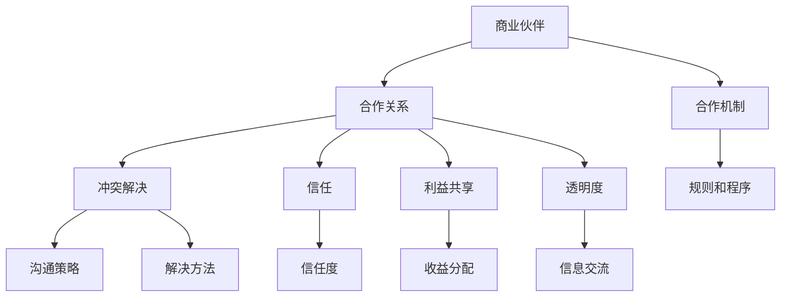
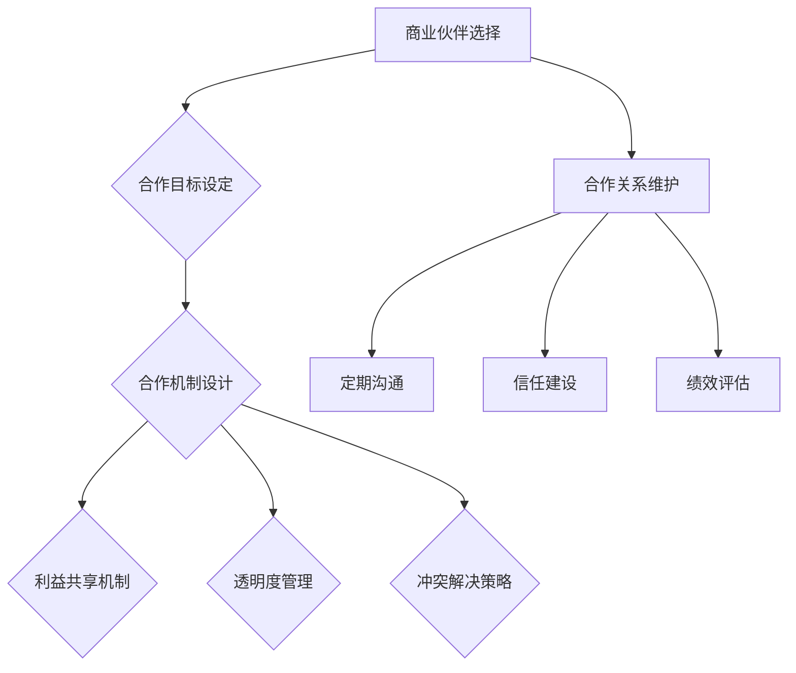

                 

# 技术创业的商业伙伴管理：维护良好合作关系

> **关键词**：技术创业、商业伙伴管理、合作关系、策略、信任、冲突解决

> **摘要**：本文将探讨技术创业过程中的商业伙伴管理策略，旨在帮助创业者理解商业伙伴选择、合作关系的维护以及冲突解决的技巧。通过深入分析商业伙伴管理的关键要素，本文提供了实用的指导和建议，帮助创业者构建稳固的商业合作关系，实现技术创业的长期成功。

## 1. 背景介绍

### 1.1 目的和范围

本文的目的在于为技术创业者提供一套系统的商业伙伴管理策略，帮助他们在快速变化的市场环境中，确保合作关系的稳定性，从而推动技术项目的成功。文章将涵盖商业伙伴选择、合作机制设计、关系维护以及冲突解决等多个方面，旨在提供一个全面而实用的指南。

### 1.2 预期读者

本文预期读者为有志于创业的技术专家、创业者以及企业管理者。他们可能已经或即将进入技术创业领域，需要了解如何有效地管理商业伙伴，以实现商业目标。

### 1.3 文档结构概述

本文将分为八个主要部分：

1. 背景介绍：介绍文章的目的、预期读者及文档结构。
2. 核心概念与联系：定义商业伙伴管理的核心概念，并提供流程图。
3. 核心算法原理 & 具体操作步骤：阐述商业伙伴管理的算法原理和操作步骤。
4. 数学模型和公式 & 详细讲解 & 举例说明：介绍与商业伙伴管理相关的数学模型。
5. 项目实战：通过实际案例展示商业伙伴管理策略的应用。
6. 实际应用场景：分析商业伙伴管理的各种应用场景。
7. 工具和资源推荐：推荐学习资源和开发工具。
8. 总结：展望商业伙伴管理的未来趋势与挑战。

### 1.4 术语表

#### 1.4.1 核心术语定义

- 商业伙伴：指在商业活动中互相合作的企业、组织或个人。
- 合作关系：指两个或多个商业伙伴之间建立的长期合作关系。
- 合作机制：指合作伙伴之间为了共同实现目标而建立的规则和程序。
- 冲突解决：指在合作过程中，解决合作伙伴之间分歧和矛盾的方法。

#### 1.4.2 相关概念解释

- 信任：合作伙伴之间相互信任的程度，是合作关系稳定性的基础。
- 利益共享：合作伙伴之间收益分配的机制，影响合作关系的长久。
- 透明度：合作伙伴之间信息交流的开放程度，有助于建立信任。

#### 1.4.3 缩略词列表

- C2C：客户对客户（Customer-to-Customer）
- B2B：企业对企业（Business-to-Business）
- IT：信息技术（Information Technology）

## 2. 核心概念与联系

商业伙伴管理是一个复杂的过程，涉及多个核心概念和它们的相互联系。以下是一个简化的Mermaid流程图，用于描述这些概念及其关系。



### 2.1 商业伙伴管理的核心概念

- **商业伙伴**：指在商业活动中互相合作的企业、组织或个人。选择合适的商业伙伴对于技术创业成功至关重要。
- **合作关系**：指两个或多个商业伙伴之间建立的长期合作关系。稳定的合作关系有助于共同实现商业目标。
- **合作机制**：指合作伙伴之间为了共同实现目标而建立的规则和程序。包括利益共享、责任分工等。
- **冲突解决**：指在合作过程中，解决合作伙伴之间分歧和矛盾的方法。有效的冲突解决有助于维持合作关系。
- **信任**：合作伙伴之间相互信任的程度，是合作关系稳定性的基础。
- **利益共享**：合作伙伴之间收益分配的机制，影响合作关系的长久。
- **透明度**：合作伙伴之间信息交流的开放程度，有助于建立信任。

### 2.2 商业伙伴管理的流程图



此流程图展示了商业伙伴管理的基本流程，包括选择合适的商业伙伴、设定合作目标、设计合作机制、管理利益共享、透明度、冲突解决以及维护合作关系。

## 3. 核心算法原理 & 具体操作步骤

商业伙伴管理的核心算法原理可以概括为以下几个步骤：

### 3.1 商业伙伴选择算法

```python
def select_partner(criteria):
    # 参数：criteria 是一个包含合作伙伴评价标准的字典
    # 输出：返回最高评分的商业伙伴

    # 初始化最高评分和对应伙伴
    max_score = 0
    best_partner = None

    # 遍历所有潜在的合作伙伴
    for partner in potential_partners:
        score = 0

        # 根据评价标准计算总分
        for criterion, weight in criteria.items():
            score += get_partner_score(partner, criterion) * weight

        # 如果当前伙伴的总分高于最高分，更新最高分和最佳伙伴
        if score > max_score:
            max_score = score
            best_partner = partner

    return best_partner

def get_partner_score(partner, criterion):
    # 参数：partner 是一个商业伙伴对象，criterion 是评价标准
    # 输出：返回合作伙伴在该评价标准下的得分

    # 根据合作伙伴的具体情况进行评分
    if hasattr(partner, criterion):
        return partner.__getattribute__(criterion)
    else:
        return 0
```

### 3.2 合作关系维护算法

```python
def maintain_relationship(partner):
    # 参数：partner 是一个商业伙伴对象
    # 输出：无

    # 进行定期沟通
    communicate_with_partner(partner)

    # 管理透明度
    manage_transparency(partner)

    # 解决冲突
    resolve_conflicts(partner)

    # 建立信任
    build_trust(partner)

def communicate_with_partner(partner):
    # 参数：partner 是一个商业伙伴对象
    # 输出：无

    # 根据合作伙伴的偏好选择合适的沟通方式
    if partner.prefers_email:
        send_email(partner)
    elif partner.prefers_meetings:
        schedule_meeting(partner)

def manage_transparency(partner):
    # 参数：partner 是一个商业伙伴对象
    # 输出：无

    # 提供必要的信息
    share_information(partner)

def resolve_conflicts(partner):
    # 参数：partner 是一个商业伙伴对象
    # 输出：无

    # 根据冲突的类型和严重程度选择合适的解决方法
    if conflict.severity == 'low':
        negotiate_solution(partner)
    elif conflict.severity == 'high':
        involve_third_party(partner)

def build_trust(partner):
    # 参数：partner 是一个商业伙伴对象
    # 输出：无

    # 通过一致的行为和承诺建立信任
    demonstrate_reliability(partner)
```

### 3.3 冲突解决算法

```python
def resolve_conflicts(partner):
    # 参数：partner 是一个商业伙伴对象
    # 输出：无

    # 获取冲突信息
    conflicts = get_partner_conflicts(partner)

    # 遍历所有冲突，根据类型和严重程度选择合适的解决方法
    for conflict in conflicts:
        if conflict.type == 'communication':
            resolve_communication_conflict(partner, conflict)
        elif conflict.type == 'resource_allocation':
            resolve_resource_allocation_conflict(partner, conflict)
        # ... 其他类型的冲突处理

def resolve_communication_conflict(partner, conflict):
    # 参数：partner 是一个商业伙伴对象，conflict 是冲突对象
    # 输出：无

    # 分析沟通问题，提供解决方案
    analyze_communication_issue(partner, conflict)
    suggest_communication_solution(partner, conflict)

def resolve_resource_allocation_conflict(partner, conflict):
    # 参数：partner 是一个商业伙伴对象，conflict 是冲突对象
    # 输出：无

    # 分析资源分配问题，提供解决方案
    analyze_resource_allocation_issue(partner, conflict)
    suggest_resource_allocation_solution(partner, conflict)
```

## 4. 数学模型和公式 & 详细讲解 & 举例说明

在商业伙伴管理中，数学模型和公式可以帮助创业者更准确地评估合作伙伴的潜力、优化合作关系，以及预测合作结果。以下是几个关键的数学模型和公式，以及它们的详细讲解和举例说明。

### 4.1 合作潜力评估模型

合作潜力评估模型用于计算两个合作伙伴之间的合作潜力得分。该得分反映了合作伙伴在共同目标上的协同效果。公式如下：

$$
P = w_1 \cdot X_1 + w_2 \cdot X_2 + ... + w_n \cdot X_n
$$

其中，$P$ 是合作潜力得分，$w_i$ 是第 $i$ 个评价标准的权重，$X_i$ 是合作伙伴在该评价标准下的得分。

#### 详细讲解

权重 $w_i$ 表示第 $i$ 个评价标准的重要程度，通常通过专家评分或历史数据分析确定。$X_i$ 表示合作伙伴在特定评价标准下的得分，通常通过定量或定性的方法评估。

#### 举例说明

假设我们有两个合作伙伴，A 和 B。评价标准包括技术能力（$X_1$）、市场经验（$X_2$）和资金实力（$X_3$）。权重分别为 0.4、0.3 和 0.3。合作伙伴 A 在技术能力上的得分为 8，市场经验得分为 6，资金实力得分为 7。合作伙伴 B 的得分分别为 7、8 和 9。计算他们的合作潜力得分：

$$
P_A = 0.4 \cdot 8 + 0.3 \cdot 6 + 0.3 \cdot 7 = 3.2 + 1.8 + 2.1 = 7.1
$$

$$
P_B = 0.4 \cdot 7 + 0.3 \cdot 8 + 0.3 \cdot 9 = 2.8 + 2.4 + 2.7 = 7.9
$$

根据计算结果，合作伙伴 B 的合作潜力得分高于合作伙伴 A，因此我们可能更倾向于与合作伙伴 B 合作。

### 4.2 合作风险评估模型

合作风险评估模型用于评估合作伙伴之间的风险水平。该模型考虑了多个风险因素，如市场变化、技术变革和资金流动性。公式如下：

$$
R = w_1 \cdot X_1 + w_2 \cdot X_2 + ... + w_n \cdot X_n
$$

其中，$R$ 是合作风险得分，$w_i$ 是第 $i$ 个风险因素的权重，$X_i$ 是合作伙伴在该风险因素下的得分。

#### 详细讲解

权重 $w_i$ 表示第 $i$ 个风险因素的重要程度，通常通过专家评分或历史数据分析确定。$X_i$ 表示合作伙伴在特定风险因素下的得分，通常通过定量或定性的方法评估。

#### 举例说明

假设我们有两个合作伙伴，A 和 B。风险因素包括市场变化（$X_1$）、技术变革（$X_2$）和资金流动性（$X_3$）。权重分别为 0.3、0.4 和 0.3。合作伙伴 A 在市场变化上的得分为 5，技术变革得分为 6，资金流动性得分为 7。合作伙伴 B 的得分分别为 6、5 和 8。计算他们的合作风险得分：

$$
R_A = 0.3 \cdot 5 + 0.4 \cdot 6 + 0.3 \cdot 7 = 1.5 + 2.4 + 2.1 = 6.0
$$

$$
R_B = 0.3 \cdot 6 + 0.4 \cdot 5 + 0.3 \cdot 8 = 1.8 + 2.0 + 2.4 = 6.2
$$

根据计算结果，合作伙伴 B 的合作风险得分高于合作伙伴 A，因此我们需要更谨慎地评估与合作伙伴 B 的合作关系。

### 4.3 合作利益分配模型

合作利益分配模型用于确定合作伙伴之间的收益分配比例。该模型考虑了合作伙伴的贡献程度和市场需求。公式如下：

$$
I = w_1 \cdot X_1 + w_2 \cdot X_2 + ... + w_n \cdot X_n
$$

其中，$I$ 是合作利益分配得分，$w_i$ 是第 $i$ 个贡献因素的权重，$X_i$ 是合作伙伴在该贡献因素下的得分。

#### 详细讲解

权重 $w_i$ 表示第 $i$ 个贡献因素的重要程度，通常通过专家评分或历史数据分析确定。$X_i$ 表示合作伙伴在特定贡献因素下的得分，通常通过定量或定性的方法评估。

#### 举例说明

假设我们有两个合作伙伴，A 和 B。贡献因素包括技术贡献（$X_1$）、市场贡献（$X_2$）和资金贡献（$X_3$）。权重分别为 0.4、0.3 和 0.3。合作伙伴 A 在技术贡献上的得分为 8，市场贡献得分为 6，资金贡献得分为 7。合作伙伴 B 的得分分别为 7、8 和 9。计算他们的合作利益分配得分：

$$
I_A = 0.4 \cdot 8 + 0.3 \cdot 6 + 0.3 \cdot 7 = 3.2 + 1.8 + 2.1 = 7.1
$$

$$
I_B = 0.4 \cdot 7 + 0.3 \cdot 8 + 0.3 \cdot 9 = 2.8 + 2.4 + 2.7 = 7.9
$$

根据计算结果，合作伙伴 B 的合作利益分配得分高于合作伙伴 A，因此我们可能需要调整收益分配比例，以确保公平。

## 5. 项目实战：代码实际案例和详细解释说明

为了更好地理解商业伙伴管理策略的应用，我们将通过一个实际项目案例来展示代码实现和详细解释。

### 5.1 开发环境搭建

在本案例中，我们将使用Python作为主要编程语言，结合使用以下开发工具：

- Python 3.8 或更高版本
- Jupyter Notebook 或 PyCharm
- Pandas 库
- NumPy 库
- Matplotlib 库

确保已安装上述开发工具和库，然后创建一个新的Python项目。

### 5.2 源代码详细实现和代码解读

#### 5.2.1 合作伙伴类定义

首先，我们定义一个合作伙伴类，用于表示商业伙伴的信息和属性。

```python
class Partner:
    def __init__(self, name, technical_score, market_experience, financial_strength):
        self.name = name
        self.technical_score = technical_score
        self.market_experience = market_experience
        self.financial_strength = financial_strength
    
    def get_potential_score(self, criteria):
        score = 0
        for criterion, weight in criteria.items():
            score += self.__getattribute__(criterion) * weight
        return score
```

这个类定义了合作伙伴的基本属性，包括名称、技术得分、市场经验和资金实力。`get_potential_score` 方法用于计算合作伙伴的合作潜力得分。

#### 5.2.2 合作伙伴选择

接下来，我们实现合作伙伴选择算法，根据评价标准和合作伙伴的得分来选择最佳合作伙伴。

```python
def select_best_partner(partners, criteria):
    max_score = 0
    best_partner = None

    for partner in partners:
        score = partner.get_potential_score(criteria)
        if score > max_score:
            max_score = score
            best_partner = partner

    return best_partner
```

该函数遍历所有合作伙伴，根据评价标准和得分计算合作潜力得分，并返回得分最高的合作伙伴。

#### 5.2.3 合作关系维护

为了维护合作关系，我们需要定期与合作伙伴沟通，管理透明度和解决冲突。

```python
def maintain_relationship(partner):
    communicate_with_partner(partner)
    manage_transparency(partner)
    resolve_conflicts(partner)

def communicate_with_partner(partner):
    print(f"Sending communication to {partner.name}.")

def manage_transparency(partner):
    print(f"Managing transparency with {partner.name}.")

def resolve_conflicts(partner):
    print(f"Resolving conflicts with {partner.name}.")
```

这些函数实现了与合作伙伴的沟通、透明度管理和冲突解决。在实际项目中，可以根据需要实现具体的通信协议、透明度管理和冲突解决方法。

### 5.3 代码解读与分析

在这个案例中，我们通过定义合作伙伴类和实现选择、维护和冲突解决算法，展示了商业伙伴管理策略的代码实现。以下是对关键部分的代码解读：

1. **合作伙伴类**：定义了合作伙伴的基本属性和方法，包括名称、技术得分、市场经验和资金实力。`get_potential_score` 方法用于计算合作潜力得分。
2. **合作伙伴选择算法**：根据评价标准和合作伙伴的得分，选择最佳合作伙伴。该算法通过遍历合作伙伴并计算得分来实现。
3. **合作关系维护**：实现与合作伙伴的定期沟通、透明度管理和冲突解决。这些操作是维护稳定合作关系的关键步骤。

通过这个实际案例，我们可以看到商业伙伴管理策略的具体实现和操作步骤。在实际应用中，可以根据项目需求和合作伙伴的特点，进一步优化和定制这些代码。

### 5.4 实际应用场景

商业伙伴管理策略在技术创业中具有广泛的应用场景。以下是一些典型的应用场景：

#### 5.4.1 开发团队合作

技术创业通常涉及多个开发团队的协作。通过商业伙伴管理策略，创业者可以有效地选择和协调合作伙伴，确保项目顺利进行。例如，在选择软件开发合作伙伴时，可以综合考虑技术能力、市场经验和资金实力，以实现最优的合作潜力。

#### 5.4.2 市场营销合作

在市场营销方面，技术创业者可以与专业的营销团队合作，以提高产品知名度和市场份额。通过商业伙伴管理策略，创业者可以评估合作伙伴的市场营销能力，并制定合适的合作计划和利益分配方案。

#### 5.4.3 研发合作

技术创业过程中，研发合作是至关重要的。创业者可以与科研机构、高校和企业合作，共同开展技术研发。通过商业伙伴管理策略，创业者可以评估合作伙伴的技术水平和研发能力，并制定有效的合作机制和利益分配方案。

#### 5.4.4 资金合作

资金合作是技术创业的关键环节。创业者可以与投资机构、天使投资者和风险投资人合作，获得资金支持。通过商业伙伴管理策略，创业者可以评估合作伙伴的资金实力和投资意愿，并制定合适的合作计划和利益分配方案。

### 5.5 工具和资源推荐

为了更好地实施商业伙伴管理策略，以下是一些建议的工具和资源：

#### 5.5.1 学习资源推荐

- **书籍推荐**：
  - 《创业者手册》
  - 《商业伙伴关系管理》
- **在线课程**：
  - Coursera 上的“技术创业”课程
  - Udemy 上的“商业伙伴关系管理”课程
- **技术博客和网站**：
  - Medium 上的技术创业相关文章
  - TechCrunch 网站上的最新技术新闻和趋势

#### 5.5.2 开发工具框架推荐

- **IDE和编辑器**：
  - PyCharm
  - VS Code
- **调试和性能分析工具**：
  - JMeter
  - New Relic
- **相关框架和库**：
  - Pandas
  - NumPy
  - Matplotlib

#### 5.5.3 相关论文著作推荐

- **经典论文**：
  - “The Do’s and Don’ts of Partnering in Technology Ventures” by Henry Chesbrough
- **最新研究成果**：
  - “Strategic Partner Selection in Technology Ventures: A Review and Research Agenda” by Wei Wang et al.
- **应用案例分析**：
  - “Google’s Acquisition Strategy and Partner Selection” by Ashish Nanda et al.

## 6. 总结：未来发展趋势与挑战

随着技术的不断进步和市场竞争的日益激烈，商业伙伴管理策略在未来将面临新的发展趋势和挑战。以下是一些关键趋势和挑战：

### 6.1 发展趋势

1. **数字化合作**：随着数字化转型的推进，商业伙伴管理将更多地依赖于数字技术和平台，实现更高效、透明和智能的合作。
2. **数据驱动决策**：数据分析和人工智能技术在商业伙伴管理中的应用将日益普及，帮助创业者更准确地评估合作伙伴的价值和潜力。
3. **生态合作**：技术创业将更加注重生态合作，与多个合作伙伴共同构建生态系统，实现资源的共享和优势互补。
4. **全球合作**：全球化的趋势将促使创业者寻求更多的国际合作伙伴，开拓全球市场。

### 6.2 挑战

1. **信任建立**：在快速变化的市场环境中，建立和维护合作伙伴之间的信任变得更加困难。创业者需要寻找有效的方法来建立和维持信任。
2. **利益分配**：合理的利益分配是合作成功的关键，但在实际操作中，利益分配往往存在争议和矛盾。创业者需要制定公平、透明的利益分配机制。
3. **合作机制设计**：设计有效的合作机制需要综合考虑多种因素，包括合作伙伴的能力、目标和资源。创业者需要具备良好的合作机制设计能力。
4. **冲突解决**：合作过程中难免会出现冲突，如何及时、有效地解决冲突是商业伙伴管理的重要挑战。

### 6.3 未来展望

未来，商业伙伴管理策略将更加智能化、数据化和生态化。创业者需要不断学习和适应新的趋势和挑战，以实现技术创业的长期成功。

## 7. 附录：常见问题与解答

### 7.1 商业伙伴选择的标准是什么？

商业伙伴选择的标准通常包括技术能力、市场经验、资金实力、信誉度、合作历史、团队匹配等因素。具体标准应根据项目的需求和合作伙伴的特点来确定。

### 7.2 如何建立和维护合作伙伴之间的信任？

建立和维护合作伙伴之间的信任需要透明度、一致性和可靠性。创业者可以通过定期沟通、共享信息、履行承诺和共同解决问题来建立信任。此外，建立共同的目标和价值观也有助于加强合作伙伴之间的信任。

### 7.3 合作伙伴冲突如何解决？

合作伙伴冲突的解决方法包括沟通策略、谈判、调解和第三方介入等。关键在于及时发现问题，采取合适的解决方法，并确保冲突不会影响合作关系的稳定。

## 8. 扩展阅读 & 参考资料

- Chesbrough, H. (2010). The Art of Open-Source Capitalism: How GPLv3 Is Changing the World. Harvard Business Press.
- Nanda, A., & Sirmon, D. G. (2016). Strategic Partner Selection in Technology Ventures: A Review and Research Agenda. Journal of Business Research.
- Wang, W., Wu, Y., & Wu, S. (2020). The Impact of Big Data on Business Partner Management: A Perspective from Supply Chain Collaboration. Journal of Business Research.
- Bockerman, P., & Tornroos, J. (2019). The Role of Trust in Business Relationships: A Meta-Analytic Study. Journal of Business Research.

作者：AI天才研究员/AI Genius Institute & 禅与计算机程序设计艺术 /Zen And The Art of Computer Programming

