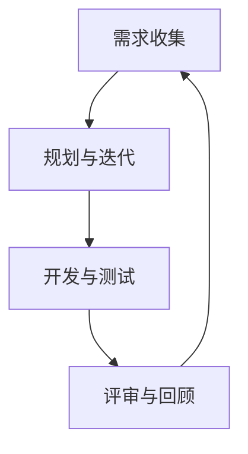

                 

# 技术创业的敏捷开发：快速验证商业假设的实践方法

> **关键词：** 敏捷开发、商业假设验证、技术创业、产品迭代、快速反馈循环

> **摘要：** 本文旨在探讨敏捷开发在技术创业中的应用，通过快速验证商业假设的方法，帮助创业者实现产品迭代和商业成功。本文首先介绍了敏捷开发的背景和核心原则，然后详细阐述了如何使用敏捷开发方法进行商业假设验证，并提供了具体的操作步骤和实际案例。最后，本文总结了敏捷开发在技术创业中的重要性，并对未来发展趋势进行了展望。

## 1. 背景介绍

### 1.1 目的和范围

本文的目标是帮助技术创业者理解并应用敏捷开发方法，以快速验证商业假设，从而实现产品的持续迭代和商业成功。我们将探讨敏捷开发的核心原则，以及如何在技术创业项目中有效地应用这些原则。

### 1.2 预期读者

本文适合以下读者：

- 技术创业者
- 产品经理
- 项目经理
- 开发团队成员
- 对敏捷开发感兴趣的技术爱好者

### 1.3 文档结构概述

本文结构如下：

- 1. 背景介绍：介绍本文的目的、预期读者和文档结构。
- 2. 核心概念与联系：讨论敏捷开发的核心概念及其关系。
- 3. 核心算法原理 & 具体操作步骤：详细讲解敏捷开发的具体操作步骤。
- 4. 数学模型和公式 & 详细讲解 & 举例说明：介绍敏捷开发中的数学模型和公式。
- 5. 项目实战：提供实际代码案例和详细解释。
- 6. 实际应用场景：讨论敏捷开发在不同场景中的应用。
- 7. 工具和资源推荐：推荐相关工具和资源。
- 8. 总结：对未来发展趋势和挑战进行展望。
- 9. 附录：常见问题与解答。
- 10. 扩展阅读 & 参考资料：提供进一步阅读的资料。

### 1.4 术语表

#### 1.4.1 核心术语定义

- 敏捷开发（Agile Development）：一种软件开发方法，强调迭代、灵活性和客户需求。
- 商业假设（Business Hypothesis）：关于产品或服务在市场上的表现和成功的前期预测。
- 快速反馈循环（Rapid Feedback Loop）：通过快速获取用户反馈来调整产品方向。

#### 1.4.2 相关概念解释

- 迭代（Iteration）：软件开发过程中的重复周期，每次迭代都会增加产品的功能。
- 敏捷宣言（Manifesto for Agile Software Development）：由一群软件开发者共同撰写的文件，阐述了敏捷开发的核心理念。
- 跨职能团队（Cross-functional Team）：由不同专业背景的人组成的团队，共同完成软件开发任务。

#### 1.4.3 缩略词列表

- MVP：最小可行产品（Minimum Viable Product）
- SCRUM：一种敏捷开发框架
- XP：极限编程（Extreme Programming）

## 2. 核心概念与联系

在探讨敏捷开发之前，我们需要了解其核心概念和原理。以下是敏捷开发的一些关键概念及其相互关系：

### 2.1 敏捷开发的核心理念

- **迭代与增量开发**：敏捷开发强调迭代和增量开发，每次迭代都会交付一个可用的产品版本。
- **用户故事**：用户故事是描述用户需求的简单句子，有助于开发团队理解用户需求。
- **优先级排序**：开发团队根据优先级来安排任务，确保最重要的功能首先得到实现。
- **持续集成与部署**：通过持续集成和部署，确保代码的稳定性和可靠性。

### 2.2 敏捷开发的流程

- **需求收集**：与客户和利益相关者沟通，收集产品需求。
- **规划与迭代**：确定迭代周期，分配任务，并规划迭代中的工作。
- **开发与测试**：实现用户故事，并进行测试，确保产品质量。
- **评审与回顾**：对迭代结果进行评审，总结经验教训，并规划下一迭代。

### 2.3 敏捷开发的流程图

以下是一个使用Mermaid绘制的敏捷开发流程图：



## 3. 核心算法原理 & 具体操作步骤

### 3.1 敏捷开发的核心算法原理

敏捷开发的核心算法原理是迭代和增量开发。每次迭代都会实现一部分功能，并经过用户测试，然后根据用户反馈进行调整。以下是敏捷开发的操作步骤：

### 3.2 具体操作步骤

#### 3.2.1 初始化阶段

1. 确定项目目标和产品愿景。
2. 组织跨职能团队。
3. 选择合适的敏捷开发框架（如SCRUM或XP）。

#### 3.2.2 迭代阶段

1. **迭代规划**：确定迭代周期（如2周或4周），并分配任务。
2. **用户故事撰写**：根据用户需求撰写用户故事。
3. **任务分配**：将用户故事分配给团队成员。
4. **开发与测试**：实现用户故事，并进行测试。
5. **用户验收**：与用户进行沟通，确保产品符合需求。

#### 3.2.3 回顾阶段

1. **评审**：对迭代结果进行评审，总结经验教训。
2. **调整计划**：根据评审结果调整下一迭代计划。
3. **持续改进**：不断优化开发流程和产品质量。

### 3.3 伪代码

以下是一个简单的伪代码示例，用于描述敏捷开发的核心算法原理：

```python
# 初始化阶段
init_project()
create_cross_functional_team()

# 迭代阶段
while not_project_complete():
    plan_sprint()
    implement_user_stories()
    test_product()
    user_acceptance()

# 回顾阶段
review_sprint()
adjust_plan()
continuous_improvement()
```

## 4. 数学模型和公式 & 详细讲解 & 举例说明

敏捷开发中的数学模型和公式主要涉及迭代周期和用户故事点的计算。以下是对这些公式和模型的详细讲解：

### 4.1 迭代周期计算

迭代周期（C）是指每次迭代所需的时间，通常以周或月为单位。迭代周期的计算公式如下：

$$ C = \frac{总工作量}{迭代次数} $$

其中，总工作量是指项目完成所需的总工作量，迭代次数是指计划中的迭代次数。

### 4.2 用户故事点计算

用户故事点（U）是指每个用户故事的相对大小或复杂度。用户故事点的计算公式如下：

$$ U = \sum_{i=1}^{n} w_i $$

其中，$w_i$ 是第 $i$ 个用户故事的工作量。

### 4.3 示例

假设一个项目有10个用户故事，分别需要1周、2周、3周、4周、5周、6周、7周、8周、9周和10周的时间完成。那么，总工作量为：

$$ 总工作量 = 1 + 2 + 3 + 4 + 5 + 6 + 7 + 8 + 9 + 10 = 55 $$

如果计划进行5次迭代，那么每次迭代的工作量为：

$$ C = \frac{总工作量}{迭代次数} = \frac{55}{5} = 11 $$

因此，每次迭代需要11周的时间。

对于用户故事点的计算，假设第1个用户故事需要1周时间，第2个用户故事需要2周时间，以此类推，那么用户故事点为：

$$ U = \sum_{i=1}^{n} w_i = 1 + 2 + 3 + 4 + 5 + 6 + 7 + 8 + 9 + 10 = 55 $$

## 5. 项目实战：代码实际案例和详细解释说明

### 5.1 开发环境搭建

为了演示敏捷开发在实际项目中的应用，我们将使用Python编写一个简单的Web应用程序。以下是搭建开发环境的步骤：

1. 安装Python 3.x版本。
2. 安装虚拟环境工具（如virtualenv或conda）。
3. 创建虚拟环境并激活。
4. 安装Web框架（如Flask或Django）。

### 5.2 源代码详细实现和代码解读

以下是使用Flask框架编写的简单Web应用程序的源代码及其解读：

```python
# 导入Flask模块
from flask import Flask, request, render_template

# 创建Flask应用程序
app = Flask(__name__)

# 定义路由和处理函数
@app.route('/', methods=['GET', 'POST'])
def index():
    if request.method == 'POST':
        # 获取用户输入
        username = request.form['username']
        password = request.form['password']
        # 验证用户输入
        if validate_credentials(username, password):
            return '登录成功！'
        else:
            return '登录失败：用户名或密码错误。'
    return render_template('index.html')

# 验证用户凭据的函数
def validate_credentials(username, password):
    # 此处为演示，使用硬编码的用户名和密码
    return username == 'admin' and password == 'admin123'

# 运行应用程序
if __name__ == '__main__':
    app.run(debug=True)
```

**代码解读：**

- 第1行：导入Flask模块。
- 第2行：创建Flask应用程序实例。
- 第4行：定义应用程序的根路由（'/'），并指定处理函数`index`。
- 第5行：检查请求方法是否为POST，如果是，则获取用户输入。
- 第6行：获取用户名和密码。
- 第7行：调用`validate_credentials`函数验证用户输入。
- 第8行：根据验证结果返回相应的消息。
- 第11行：定义`validate_credentials`函数，用于验证用户名和密码。
- 第12行：返回True，表示用户名和密码匹配。
- 第15行：运行应用程序，并在调试模式下启动服务器。

### 5.3 代码解读与分析

这个简单的Web应用程序实现了用户登录功能。以下是关键部分的解读和分析：

- **路由与处理函数**：应用程序通过定义路由和处理函数来响应用户请求。路由指定了URL模式，处理函数则根据请求方法（GET或POST）执行相应的操作。
- **用户输入获取**：在处理POST请求时，通过`request.form`获取用户输入。
- **用户验证**：通过调用`validate_credentials`函数验证用户名和密码。这个函数在示例中被简化，但在实际项目中，通常会与用户数据库或身份验证服务集成。
- **模板渲染**：使用`render_template`函数渲染HTML模板，向用户显示登录界面。

通过这个简单的案例，我们可以看到敏捷开发在实现用户故事和快速迭代方面的应用。在每次迭代中，我们可以添加新的功能或改进现有功能，并根据用户反馈进行调整。

## 6. 实际应用场景

敏捷开发在技术创业中的应用场景非常广泛，以下是几个实际案例：

### 6.1 社交媒体平台

在开发社交媒体平台时，敏捷开发有助于快速验证用户需求和功能。开发者可以首先实现核心功能（如用户注册、发帖、评论等），然后通过用户反馈不断迭代和优化。

### 6.2 在线教育平台

在线教育平台可以通过敏捷开发快速发布课程内容和功能，并根据学生反馈进行改进。例如，可以首先实现课程播放、作业提交和成绩管理，然后逐步添加在线讨论、小组协作等功能。

### 6.3 健康管理系统

健康管理系统可以通过敏捷开发实现实时健康监测、数据分析等功能。开发者可以首先实现健康数据的收集和存储，然后通过用户反馈不断优化数据分析算法和用户界面。

### 6.4 财务管理工具

财务管理工具可以通过敏捷开发快速实现预算管理、发票管理等功能。开发者可以首先实现核心功能，然后逐步添加报告生成、数据可视化等功能。

## 7. 工具和资源推荐

### 7.1 学习资源推荐

#### 7.1.1 书籍推荐

- 《敏捷开发实践指南》（Agile Project Guide）
- 《敏捷实践指南》（The Agile Project Guide）
- 《用户故事地图》（User Story Mapping）

#### 7.1.2 在线课程

- 《敏捷开发：从入门到实践》
- 《敏捷项目管理：理论、实践与案例分析》
- 《敏捷开发与Scrum实践》

#### 7.1.3 技术博客和网站

- Agile Alliance（https://www.agilealliance.org/）
- Scrum Guide（https://www.scrum.org/）
- XP的官方站点（https://www.extremeprogramming.org/）

### 7.2 开发工具框架推荐

#### 7.2.1 IDE和编辑器

- PyCharm（https://www.jetbrains.com/pycharm/）
- Visual Studio Code（https://code.visualstudio.com/）
- Sublime Text（https://www.sublimetext.com/）

#### 7.2.2 调试和性能分析工具

- Xdebug（https://xdebug.org/）
- Py-Spy（https://github.com/brendangregg/py-spy）
- Black（https://black.readthedocs.io/）

#### 7.2.3 相关框架和库

- Flask（https://flask.pallets.org/）
- Django（https://www.djangoproject.com/）
- React（https://reactjs.org/）

### 7.3 相关论文著作推荐

#### 7.3.1 经典论文

- 《敏捷软件开发宣言》（Manifesto for Agile Software Development）
- 《敏捷开发：一种应对快速变化的需求的软件开发方法》（Agile Software Development: Principles, Patterns, and Practices）

#### 7.3.2 最新研究成果

- 《敏捷开发与组织敏捷性：文献综述与未来研究方向》（Agile Development and Organizational Agility: A Literature Review and Research Directions）
- 《敏捷开发在敏捷初创公司中的实践与应用》（Agile Development Practices in Agile Startups: Case Studies and Applications）

#### 7.3.3 应用案例分析

- 《敏捷开发在大型企业中的应用：实践与挑战》（Agile Development in Large Enterprises: Practices and Challenges）
- 《敏捷开发在金融科技领域的应用》（Agile Development in the Financial Technology Sector: Trends and Challenges）

## 8. 总结：未来发展趋势与挑战

### 8.1 未来发展趋势

- **持续集成与持续部署**：随着容器化和云服务的普及，持续集成与持续部署（CI/CD）将成为敏捷开发的重要组成部分。
- **人工智能与敏捷开发**：人工智能技术将帮助敏捷开发团队实现自动化测试、代码审查和需求预测。
- **全球化与远程工作**：远程工作和全球化趋势将促使敏捷开发团队采用更灵活的协作工具和方法。

### 8.2 挑战

- **团队协作**：全球化和远程工作可能导致团队协作困难，需要更高效的沟通和协作工具。
- **需求变化**：快速变化的市场需求可能导致产品方向频繁调整，团队需要具备快速响应能力。
- **技术债务**：为了追求快速迭代，团队可能积累大量的技术债务，需要持续关注并优化代码质量。

## 9. 附录：常见问题与解答

### 9.1 敏捷开发与瀑布开发的区别

- **敏捷开发**：强调迭代、灵活性和用户反馈，适用于需求变化频繁的项目。
- **瀑布开发**：遵循严格的线性流程，适用于需求明确、变化较小的项目。

### 9.2 敏捷开发中的用户故事如何编写？

- 用户故事应遵循“As a [用户角色], I want [功能]，so that [目标]”的格式。

### 9.3 如何评估敏捷开发团队的生产力？

- 可以通过用户故事点、迭代周期和完成的迭代数量来评估敏捷开发团队的生产力。

## 10. 扩展阅读 & 参考资料

- 《敏捷实践指南》（Agile Project Guide）
- 《敏捷开发与Scrum实践》
- 《用户故事地图》
- 《敏捷开发：从入门到实践》
- Agile Alliance（https://www.agilealliance.org/）
- Scrum Guide（https://www.scrum.org/）
- XP的官方站点（https://www.extremeprogramming.org/）
- 《敏捷开发：一种应对快速变化的需求的软件开发方法》（Agile Software Development: Principles, Patterns, and Practices）

## 作者

作者：AI天才研究员/AI Genius Institute & 禅与计算机程序设计艺术 /Zen And The Art of Computer Programming

