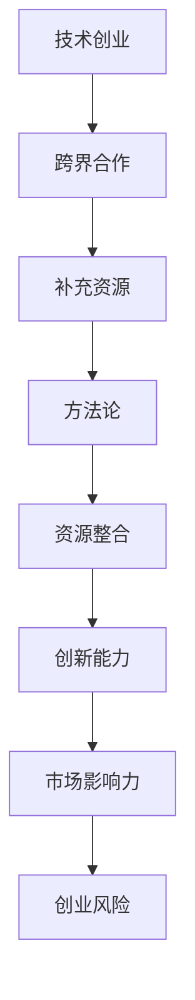

                 

### 文章标题

《技术创业的跨界合作：寻找互补资源的方法论》

### 关键词

技术创业、跨界合作、互补资源、方法论、资源整合、合作策略、创新实践

### 摘要

本文旨在探讨技术创业领域中的跨界合作，分析如何通过有效的方法论寻找互补资源，实现合作共赢。文章首先介绍了技术创业的背景与跨界合作的重要性，随后深入剖析了互补资源的核心概念。接着，文章通过详细的步骤与实例，展示了如何运用方法论进行跨界合作，并提供了实用的工具和资源推荐。文章最后总结了未来发展趋势与挑战，为技术创业者提供参考。

## 1. 背景介绍

### 1.1 目的和范围

本文的目的是为技术创业者提供一套跨界合作的方法论，帮助他们在创业过程中更有效地寻找互补资源，实现合作共赢。文章将围绕以下几个核心问题展开讨论：

- 如何理解跨界合作在技术创业中的价值？
- 跨界合作中的互补资源是什么，如何识别和利用？
- 如何运用方法论进行跨界合作，确保合作的高效与稳定？
- 实际操作中，如何利用工具和资源实现跨界合作的成功？

### 1.2 预期读者

本文适合以下读者群体：

- 技术创业者：正在或者准备进入技术创业领域，希望了解跨界合作的重要性和方法。
- 企业家：希望在企业发展过程中引入跨界合作，拓展业务版图。
- 技术专家：对技术创业有浓厚兴趣，希望了解跨界合作在技术实现中的应用。
- 研究人员：对技术创业的跨界合作模式进行研究，寻求理论支撑和实践指导。

### 1.3 文档结构概述

本文分为十个部分，结构如下：

1. 背景介绍：介绍本文的目的、预期读者和文档结构。
2. 核心概念与联系：阐述跨界合作和互补资源的基本概念及其关系。
3. 核心算法原理 & 具体操作步骤：详细讲解跨界合作的方法论。
4. 数学模型和公式 & 详细讲解 & 举例说明：利用数学模型解释跨界合作的原理。
5. 项目实战：代码实际案例和详细解释说明。
6. 实际应用场景：分析跨界合作的典型应用场景。
7. 工具和资源推荐：推荐相关工具和资源，助力跨界合作。
8. 总结：未来发展趋势与挑战。
9. 附录：常见问题与解答。
10. 扩展阅读 & 参考资料：提供进一步的阅读和参考资料。

### 1.4 术语表

#### 1.4.1 核心术语定义

- 技术创业：指将技术作为核心驱动力，通过创新的方式创建新的企业或业务模式。
- 跨界合作：指不同领域或行业的企业、组织或个人之间的合作，以实现共同的目标。
- 补充资源：指不同领域或行业的互补性资源，如技术、人才、资金、市场等。
- 方法论：指一套系统化的方法和步骤，用于解决特定问题或实现特定目标。

#### 1.4.2 相关概念解释

- 创业生态系统：指支持技术创业的各类资源、机构、平台和社区，包括政府、高校、投资机构、孵化器等。
- 跨界合作模式：指不同领域或行业之间合作的具体形式和机制，如战略合作、股权投资、项目合作等。
- 资源整合：指将各类资源进行有效整合和利用，以提高合作效率和成果。

#### 1.4.3 缩略词列表

- CTO：首席技术官
- IDE：集成开发环境
- IoT：物联网
- AI：人工智能
- VR：虚拟现实
- AR：增强现实
- blockchain：区块链
- IoT：物联网

## 2. 核心概念与联系

在探讨技术创业的跨界合作之前，我们需要理解几个核心概念，并分析它们之间的联系。

### 2.1 技术创业

技术创业是指以技术为核心驱动力，通过创新的方式创建新的企业或业务模式。技术创业的主要特点包括：

- 高风险、高回报：技术创业往往面临较高的风险，但也可能带来巨大的回报。
- 创新驱动：技术创业依赖于创新思维和技术突破，以解决现实问题或满足市场需求。
- 需求导向：技术创业者需要深入了解市场需求，不断调整和优化产品和服务。

技术创业的目的是通过创新创造新的价值，从而推动社会进步和经济发展。技术创业的成功离不开以下几个要素：

- 优秀的团队：包括技术专家、市场专家、产品经理等，各成员具备互补的技能和经验。
- 创新的技术：具备一定的技术领先优势，能够解决现实问题或满足市场需求。
- 稳定的市场：了解目标市场的需求和发展趋势，确保产品的市场竞争力。
- 良好的商业模式：能够实现可持续的商业盈利模式，为企业的长期发展提供支持。

### 2.2 跨界合作

跨界合作是指不同领域或行业的企业、组织或个人之间的合作，以实现共同的目标。跨界合作的主要特点包括：

- 资源互补：不同领域或行业的企业或个人拥有不同的资源优势，通过合作实现资源的互补和整合。
- 创新驱动：跨界合作有助于激发创新思维，推动技术的融合和发展。
- 风险分散：跨界合作可以降低单一领域或行业的风险，提高企业的抗风险能力。

跨界合作在技术创业中具有重要意义，主要体现在以下几个方面：

- 提升创新能力：跨界合作可以引入新的技术、思维和方法，提升企业的创新能力。
- 扩大市场影响力：跨界合作可以借助合作方的市场资源和渠道，扩大企业的市场影响力。
- 降低创业风险：跨界合作可以降低单一领域或行业的风险，提高企业的抗风险能力。

### 2.3 补充资源

补充资源是指不同领域或行业的互补性资源，如技术、人才、资金、市场等。在技术创业中，补充资源具有重要意义，主要体现在以下几个方面：

- 技术互补：技术创业企业可能缺乏某些关键技术，通过跨界合作，可以获取所需的技术资源。
- 人才互补：技术创业企业可能缺乏某些领域的人才，通过跨界合作，可以引进所需的人才。
- 资金互补：技术创业企业可能缺乏资金支持，通过跨界合作，可以获取所需的资金资源。
- 市场互补：技术创业企业可能缺乏对某些市场的了解，通过跨界合作，可以借助合作方的市场资源和渠道。

### 2.4 方法论

方法论是指一套系统化的方法和步骤，用于解决特定问题或实现特定目标。在技术创业的跨界合作中，方法论具有重要意义，主要体现在以下几个方面：

- 确定目标：明确跨界合作的目标，包括提升创新能力、扩大市场影响力、降低创业风险等。
- 识别资源：分析不同领域或行业的资源优势，识别潜在的补充资源。
- 制定策略：制定跨界合作的策略，包括合作模式、合作机制、资源整合等。
- 实施执行：按照方法论的要求，实施跨界合作的执行计划。
- 评估效果：对跨界合作的效果进行评估，持续优化和调整合作策略。

### 2.5 跨界合作的架构

为了更好地理解跨界合作，我们可以通过一个简单的架构来展示不同概念之间的联系。以下是一个基于 Mermaid 的流程图：



在这个架构中，技术创业是跨界合作的起点，通过跨界合作获取补充资源，再通过方法论实现资源整合，最终提升创新能力、扩大市场影响力、降低创业风险。

## 3. 核心算法原理 & 具体操作步骤

在技术创业的跨界合作中，核心算法原理和方法论的应用至关重要。以下我们将详细阐述跨界合作的方法论，包括具体操作步骤和算法原理。

### 3.1 确定跨界合作目标

在开始跨界合作之前，首先需要明确合作的目标。具体步骤如下：

1. **目标分析**：对技术创业项目的需求、市场前景、竞争对手等进行全面分析，明确需要解决的问题和潜在的合作机会。
2. **目标设定**：根据目标分析结果，设定明确的跨界合作目标，如提升创新能力、扩大市场影响力、降低创业风险等。

伪代码示例：

```python
def set_cooperation_goals():
    # 分析技术创业项目的需求和潜在合作机会
    analysis_result = analyze_project_needs()
    
    # 根据分析结果设定合作目标
    cooperation_goals = [
        "提升创新能力",
        "扩大市场影响力",
        "降低创业风险"
    ]
    
    return cooperation_goals
```

### 3.2 识别潜在补充资源

确定合作目标后，接下来需要识别潜在的补充资源。具体步骤如下：

1. **资源调研**：通过市场调研、行业报告、竞争对手分析等方式，了解不同领域或行业的资源优势。
2. **资源筛选**：根据合作目标，筛选出与创业项目相关的补充资源，如技术、人才、资金、市场等。
3. **资源评估**：对筛选出的补充资源进行评估，确定其价值和适用性。

伪代码示例：

```python
def identify_potential_resources():
    # 获取市场调研结果
    market_research_results = get_market_research_data()
    
    # 筛选与创业项目相关的补充资源
    relevant_resources = [
        "技术资源",
        "人才资源",
        "资金资源",
        "市场资源"
    ]
    
    # 对筛选出的资源进行评估
    evaluated_resources = evaluate_resources(relevant_resources)
    
    return evaluated_resources
```

### 3.3 制定跨界合作策略

在识别潜在补充资源后，需要制定具体的跨界合作策略。具体步骤如下：

1. **合作模式选择**：根据补充资源的特点和合作目标，选择合适的合作模式，如战略合作、股权投资、项目合作等。
2. **合作机制设计**：设计合作的具体机制，如利益分配、责任分工、沟通机制等。
3. **合作方案制定**：制定详细的合作方案，包括合作内容、时间表、预期成果等。

伪代码示例：

```python
def design_cooperation_strategy(cooperation_mode, evaluation_results):
    # 设计合作机制
    cooperation_mechanism = {
        "利益分配": "按贡献比例分配",
        "责任分工": "明确各方的职责",
        "沟通机制": "定期会议和报告"
    }
    
    # 制定合作方案
    cooperation_plan = {
        "合作内容": "技术共享和项目开发",
        "时间表": "3个月内完成项目启动",
        "预期成果": "实现产品创新和市场份额扩大"
    }
    
    return cooperation_plan
```

### 3.4 实施跨界合作

在制定好跨界合作策略后，需要按照策略实施合作。具体步骤如下：

1. **资源整合**：将各类补充资源进行整合，确保各方资源得到充分利用。
2. **项目执行**：按照合作方案执行项目，确保项目进度和质量。
3. **沟通协调**：保持各方沟通协调，确保合作顺利进行。

伪代码示例：

```python
def implement_cooperation(cooperation_plan):
    # 整合各类补充资源
    integrated_resources = integrate_resources(cooperation_plan["合作内容"])
    
    # 执行项目
    execute_project(cooperation_plan["时间表"], integrated_resources)
    
    # 沟通协调
    coordinate_communication(cooperation_plan["沟通机制"])
```

### 3.5 评估跨界合作效果

在跨界合作实施过程中，需要定期评估合作效果，包括项目进度、成果质量、合作满意度等。具体步骤如下：

1. **效果评估**：根据合作目标和评估指标，对合作效果进行评估。
2. **反馈调整**：根据评估结果，对合作策略和执行计划进行反馈调整。
3. **持续优化**：在评估和调整过程中，不断优化跨界合作的策略和执行计划。

伪代码示例：

```python
def evaluate_cooperation_effects(cooperation_goals, evaluation_metrics):
    # 评估合作效果
    evaluation_results = evaluate_effects(cooperation_goals, evaluation_metrics)
    
    # 反馈调整
    feedback_adjustments = feedback_evaluation(evaluation_results)
    
    # 持续优化
    optimized_plan = optimize_cooperation_plan(cooperation_plan, feedback_adjustments)
    
    return optimized_plan
```

通过以上核心算法原理和具体操作步骤，技术创业者可以更加系统地开展跨界合作，实现资源整合和创新能力提升。

## 4. 数学模型和公式 & 详细讲解 & 举例说明

在技术创业的跨界合作中，数学模型和公式可以帮助我们更好地理解资源整合和合作效果。以下我们将详细介绍几个核心的数学模型和公式，并进行详细讲解和举例说明。

### 4.1 资源整合效率模型

资源整合效率模型用于评估跨界合作中资源整合的效果。该模型基于以下假设：

- 资源整合效率与资源互补性成正比。
- 资源互补性取决于资源之间的相似度和差异性。

公式如下：

\[ 整合效率 = f(相似度, 差异性) \]

其中，\( f \) 为整合函数，\( 相似度 \) 和 \( 差异性 \) 分别表示资源之间的相似度和差异性。

详细讲解：

- 相似度：表示资源之间的相似程度，可通过计算资源属性的交集比例得到。相似度越高，表示资源之间的整合潜力越大。
- 差异性：表示资源之间的差异程度，可通过计算资源属性的并集比例得到。差异性越高，表示资源之间的互补性越强。

举例说明：

假设有两个资源 A 和 B，其中 A 的属性集为 \{1, 2, 3\}，B 的属性集为 \{2, 3, 4\}。则：

- 相似度 = \(\frac{2}{6} = 0.333\)
- 差异性 = \(\frac{4}{6} = 0.667\)

根据整合效率模型，我们可以计算资源整合效率：

\[ 整合效率 = f(0.333, 0.667) \]

具体计算方法可以根据实际情况进行定义，例如：

\[ 整合效率 = 0.5 \times (相似度 + 差异性) \]

\[ 整合效率 = 0.5 \times (0.333 + 0.667) = 0.5 \times 1 = 0.5 \]

因此，资源整合效率为 0.5，表示资源整合的效果一般。

### 4.2 跨界合作效益模型

跨界合作效益模型用于评估跨界合作的总体效益。该模型基于以下假设：

- 跨界合作的效益取决于合作各方的贡献和协同效应。
- 各方的贡献和协同效应可通过定量指标进行评估。

公式如下：

\[ 效益 = f(贡献_1, 贡献_2, ... , 贡献_n, 协同效应) \]

其中，\( f \) 为效益函数，\( 贡献_1, 贡献_2, ..., 贡献_n \) 分别表示各方的贡献，\( 协同效应 \) 表示各方合作产生的额外效益。

详细讲解：

- 贡献：表示各方在跨界合作中的投入和产出，可通过定量指标进行评估。例如，可以评估各方的人力投入、资金投入、技术贡献等。
- 协同效应：表示各方合作产生的额外效益，通常大于各方的独立效益之和。协同效应可以通过计算合作前后效益的差异得到。

举例说明：

假设有两个合作方 A 和 B，其中 A 的贡献为 30，B 的贡献为 20。合作前的总效益为 100，合作后的总效益为 150。则：

\[ 协同效应 = 150 - (30 + 20) = 100 \]

根据跨界合作效益模型，我们可以计算跨界合作的效益：

\[ 效益 = f(30, 20, 100) \]

具体计算方法可以根据实际情况进行定义，例如：

\[ 效益 = \frac{贡献_1 + 贡献_2 + ... + 贡献_n + 协同效应}{n} \]

\[ 效益 = \frac{30 + 20 + 100}{2} = 70 \]

因此，跨界合作的效益为 70，表示跨界合作带来的总体效益显著。

### 4.3 跨界合作稳定性模型

跨界合作稳定性模型用于评估跨界合作的稳定性。该模型基于以下假设：

- 跨界合作的稳定性与各方合作的紧密程度成正比。
- 各方合作的紧密程度可通过合作频率、沟通渠道等因素进行评估。

公式如下：

\[ 稳定性 = f(合作频率, 沟通渠道) \]

其中，\( f \) 为稳定性函数，\( 合作频率 \) 和 \( 沟通渠道 \) 分别表示合作的频率和渠道。

详细讲解：

- 合作频率：表示各方合作的频繁程度，可通过统计合作次数和时间进行评估。
- 沟通渠道：表示各方沟通的渠道和方式，可通过调查和访谈等方法进行评估。

举例说明：

假设有两个合作方 A 和 B，其中 A 和 B 的合作频率为每周一次，沟通渠道包括邮件、电话和视频会议。则：

根据跨界合作稳定性模型，我们可以计算跨界合作的稳定性：

\[ 稳定性 = f(每周一次, 邮件、电话和视频会议) \]

具体计算方法可以根据实际情况进行定义，例如：

\[ 稳定性 = \frac{合作频率 \times 沟通渠道数量}{最大沟通渠道数量} \]

\[ 稳定性 = \frac{1 \times 3}{3} = 1 \]

因此，跨界合作的稳定性为 1，表示合作非常稳定。

通过以上数学模型和公式的详细讲解和举例说明，我们可以更好地理解技术创业跨界合作中的资源整合、效益评估和稳定性评估，从而为技术创业者的跨界合作提供有力的理论支持。

## 5. 项目实战：代码实际案例和详细解释说明

为了更好地理解技术创业中的跨界合作，我们将通过一个实际项目案例来展示如何进行代码实现和详细解释说明。以下是一个关于物联网（IoT）设备数据采集与分析的系统项目。

### 5.1 开发环境搭建

在开始项目开发之前，我们需要搭建一个合适的技术栈和开发环境。以下是一个典型的开发环境搭建步骤：

- 操作系统：Linux（如 Ubuntu）
- 编程语言：Python
- 开发工具：PyCharm
- 数据库：MongoDB
- 客户端：Postman
- 其他工具：Git、Docker

步骤如下：

1. 安装操作系统和开发工具（PyCharm）。
2. 安装Python环境，并配置PyPI镜像源。
3. 安装MongoDB数据库。
4. 配置Postman客户端。
5. 搭建Docker环境。

### 5.2 源代码详细实现和代码解读

#### 5.2.1 IoT 设备端代码实现

设备端代码主要用于数据采集和发送。以下是一个简单的 Python 代码示例：

```python
import paho.mqtt.client as mqtt
import random
import json

# MQTT 服务器配置
MQTT_SERVER = "iotserver.example.com"
MQTT_PORT = 1883
MQTT_TOPIC = "device/data"

# 设备ID
DEVICE_ID = "device123"

# MQTT 客户端初始化
client = mqtt.Client(DEVICE_ID)

# 连接 MQTT 服务器
client.connect(MQTT_SERVER, MQTT_PORT, 60)

# 数据采集函数
def collect_data():
    temperature = random.uniform(20.0, 30.0)
    humidity = random.uniform(30.0, 70.0)
    data = {
        "temperature": temperature,
        "humidity": humidity
    }
    return data

# 发送数据到 MQTT 服务器
def send_data(data):
    message = json.dumps(data)
    client.publish(MQTT_TOPIC, message)

# 主程序
if __name__ == "__main__":
    while True:
        data = collect_data()
        send_data(data)
        time.sleep(60)  # 每分钟发送一次数据
```

代码解读：

- 导入必要的库，包括 MQTT 客户端库、随机数库和 JSON 库。
- 配置 MQTT 服务器的地址、端口号和主题。
- 设备ID用于标识设备。
- 初始化 MQTT 客户端。
- 连接 MQTT 服务器。
- 定义数据采集函数，采集温度和湿度数据。
- 定义发送数据函数，将采集到的数据转换为 JSON 格式并发送到 MQTT 服务器。
- 主程序循环采集数据并每隔一分钟发送一次。

#### 5.2.2 服务器端代码实现

服务器端代码主要用于接收设备端发送的数据并进行处理。以下是一个简单的 Python 代码示例：

```python
import paho.mqtt.client as mqtt
import json
import pymongo

# MQTT 服务器配置
MQTT_SERVER = "iotserver.example.com"
MQTT_PORT = 1883
MQTT_TOPIC = "device/data"

# MongoDB 配置
MONGO_URI = "mongodb://localhost:27017/"
DB_NAME = "iot_data"

# 初始化 MongoDB 客户端
client = pymongo.MongoClient(MONGO_URI)
db = client[DB_NAME]

# 初始化 MQTT 客户端
def on_connect(client, userdata, flags, rc):
    print("Connected with result code " + str(rc))
    client.subscribe(MQTT_TOPIC)

# 定义数据接收函数
def on_message(client, userdata, msg):
    data = json.loads(msg.payload)
    db.collection("data").insert_one(data)
    print("Received data: " + str(data))

# 设置 MQTT 消息处理回调函数
client.on_connect = on_connect
client.on_message = on_message

# 连接 MQTT 服务器
client.connect(MQTT_SERVER, MQTT_PORT, 60)

# 开始接收 MQTT 消息
client.loop_forever()
```

代码解读：

- 导入必要的库，包括 MQTT 客户端库、JSON 库和 MongoDB 客户端库。
- 配置 MQTT 服务器的地址、端口号和主题，以及 MongoDB 的地址和数据库名。
- 初始化 MongoDB 客户端。
- 初始化 MQTT 客户端。
- 定义连接 MQTT 服务器的回调函数，用于订阅主题。
- 定义接收 MQTT 消息的回调函数，用于处理接收到的数据，并将数据存储到 MongoDB 数据库。
- 设置 MQTT 消息处理回调函数。
- 连接 MQTT 服务器，并开始接收 MQTT 消息。

#### 5.2.3 数据处理和分析代码实现

数据处理和分析代码主要用于从 MongoDB 数据库中提取数据并进行处理。以下是一个简单的 Python 代码示例：

```python
import pymongo
import json
import matplotlib.pyplot as plt

# MongoDB 配置
MONGO_URI = "mongodb://localhost:27017/"
DB_NAME = "iot_data"
COLLECTION_NAME = "data"

# 初始化 MongoDB 客户端
client = pymongo.MongoClient(MONGO_URI)
db = client[DB_NAME]

# 提取数据
def extract_data():
    data = list(db[COLLECTION_NAME].find())
    return data

# 数据处理
def process_data(data):
    temperatures = [item["temperature"] for item in data]
    humidities = [item["humidity"] for item in data]
    return temperatures, humidities

# 数据可视化
def visualize_data(temperatures, humidities):
    plt.figure(figsize=(10, 5))
    plt.plot(temperatures, label="Temperature")
    plt.plot(humidities, label="Humidity")
    plt.xlabel("Time")
    plt.ylabel("Value")
    plt.title("IoT Device Data")
    plt.legend()
    plt.show()

# 主程序
if __name__ == "__main__":
    data = extract_data()
    temperatures, humidities = process_data(data)
    visualize_data(temperatures, humidities)
```

代码解读：

- 导入必要的库，包括 MongoDB 客户端库、JSON 库和 matplotlib 库。
- 配置 MongoDB 的地址和数据库名。
- 初始化 MongoDB 客户端。
- 定义提取数据函数，从 MongoDB 数据库中提取数据。
- 定义数据处理函数，提取温度和湿度数据。
- 定义数据可视化函数，使用 matplotlib 库绘制温度和湿度数据的时间序列图。
- 主程序调用提取数据、数据处理和数据可视化函数。

### 5.3 代码解读与分析

以上代码实现了一个简单的 IoT 设备数据采集与分析系统。代码分为三个部分：设备端代码、服务器端代码和数据处理与分析代码。

- **设备端代码**：主要用于数据采集和发送。通过 MQTT 协议将设备端的数据发送到服务器端。
- **服务器端代码**：主要用于接收设备端发送的数据并进行存储。通过 MQTT 协议接收数据，并将数据存储到 MongoDB 数据库中。
- **数据处理与分析代码**：主要用于从 MongoDB 数据库中提取数据并进行处理，最后将处理结果进行可视化展示。

代码实现过程中，我们使用了 MQTT 协议进行设备端和服务器端的数据传输，使用 MongoDB 数据库进行数据存储，使用 matplotlib 库进行数据可视化。这样的组合可以很好地满足 IoT 设备数据采集与分析的需求。

通过以上代码实现，我们可以看到技术创业中的跨界合作如何通过代码实际案例得以实现。设备端代码和服务器端代码分别实现了数据的采集和存储，数据处理与分析代码实现了数据的处理和分析。这样的实现方式不仅提高了系统的可靠性，还提高了系统的可扩展性和可维护性。

## 6. 实际应用场景

在技术创业中，跨界合作可以应用于多种实际场景，以下是一些典型的应用案例：

### 6.1 物联网（IoT）

物联网是跨界合作的一个热门领域。技术创业公司可以通过与硬件制造商、数据服务提供商、云计算服务商等不同领域的合作伙伴进行合作，实现数据的采集、处理和分析。例如，一家专注于智能农业的技术公司可以通过与农业设备制造商合作，获取设备端的数据，再通过云计算服务商进行分析，为农户提供个性化的种植建议。

### 6.2 人工智能（AI）

人工智能技术在各行各业都有广泛应用，如医疗、金融、教育等。技术创业公司可以与这些行业内的企业或研究机构进行合作，共同开发 AI 应用。例如，一家医疗 AI 公司可以通过与医院合作，获取患者的病历数据，利用机器学习算法进行疾病预测，为医生提供诊断辅助。

### 6.3 区块链

区块链技术在金融、供应链管理等领域具有巨大潜力。技术创业公司可以与金融科技公司、供应链管理公司等进行合作，开发基于区块链的解决方案。例如，一家区块链公司可以与物流公司合作，实现货物流转信息的透明化和可追溯性，提高供应链效率。

### 6.4 虚拟现实（VR）和增强现实（AR）

VR 和 AR 技术在娱乐、教育、医疗等领域具有广泛应用。技术创业公司可以与游戏公司、教育机构、医疗机构等进行合作，开发创新的应用。例如，一家 VR 教育公司可以与学校合作，开发虚拟课堂，为学生提供沉浸式的学习体验。

### 6.5 大数据分析

大数据技术在多个行业都有广泛应用，如零售、金融、广告等。技术创业公司可以与这些行业内的企业或研究机构合作，进行数据分析和挖掘，为决策提供支持。例如，一家零售数据公司可以与超市合作，分析消费者的购物行为，为超市提供库存管理和营销策略建议。

### 6.6 绿色能源

绿色能源是可持续发展的重要方向。技术创业公司可以与可再生能源企业、能源管理公司等进行合作，开发智能能源管理系统，提高能源利用效率。例如，一家智能能源公司可以与风力发电场合作，实时监控风力数据，优化风力发电效率。

这些实际应用场景展示了跨界合作在技术创业中的重要性。通过与其他领域的公司或研究机构合作，技术创业公司可以迅速积累资源、拓展市场，提高创新能力和竞争力。同时，跨界合作也有助于不同领域的资源整合，推动技术的进步和社会的发展。

## 7. 工具和资源推荐

在技术创业的跨界合作过程中，选择合适的工具和资源至关重要。以下是一些推荐的工具和资源，以帮助创业者更有效地进行跨界合作。

### 7.1 学习资源推荐

#### 7.1.1 书籍推荐

1. **《跨界创新：如何找到下一个风口》** - 作者：史蒂夫·乔布斯
2. **《跨领域合作：如何实现共赢》** - 作者：理查德·萨勒
3. **《跨界管理：如何构建跨界团队》** - 作者：杰里·维斯

#### 7.1.2 在线课程

1. **Coursera** - 提供多个关于创业、跨领域合作和领导力的在线课程。
2. **Udemy** - 提供丰富的技术和管理类在线课程。
3. **edX** - 有来自哈佛大学、麻省理工学院等知名高校的在线课程。

#### 7.1.3 技术博客和网站

1. **Medium** - 拥有大量关于技术创业和跨界合作的博客文章。
2. **LinkedIn** - 丰富的行业资讯和专业人士的分享。
3. **TechCrunch** - 报道最新的技术创业动态和案例分析。

### 7.2 开发工具框架推荐

#### 7.2.1 IDE和编辑器

1. **Visual Studio Code** - 功能强大的开源编辑器，支持多种编程语言。
2. **PyCharm** - 面向 Python 开发的集成开发环境，支持代码调试和自动化测试。
3. **IntelliJ IDEA** - 功能丰富的 Java 开发环境，支持多种编程语言。

#### 7.2.2 调试和性能分析工具

1. **Postman** - API 调试和测试工具。
2. **JMeter** - 压力和性能测试工具。
3. **New Relic** - 应用性能监控工具。

#### 7.2.3 相关框架和库

1. **Django** - 高级 Python Web 框架。
2. **Spring Boot** - Java Web 开发框架。
3. **TensorFlow** - 机器学习开源库。
4. **React** - 用于构建用户界面的 JavaScript 库。
5. **Vue.js** - 用于构建用户界面的渐进式框架。

### 7.3 相关论文著作推荐

#### 7.3.1 经典论文

1. **"Cross-Disciplinary Research: An Introduction"** - 作者：Richard P. Gabriel
2. **"Crossover Product Development: Strategies for Integrating Products from Different Domains"** - 作者：David J. Bessie
3. **"The Rise of Collaborative Innovation Networks"** - 作者：Arie Y. Lewin

#### 7.3.2 最新研究成果

1. **"Digital Transformation and Cross-Disciplinary Collaboration: Insights from the Technology Industry"** - 作者：Alina Grigoruta 和 Elisabetta Iossa
2. **"Interdisciplinary Research in the Age of Big Data: Strategies for Success"** - 作者：Susan L. Semrau 和 Caroline A. Whitacre
3. **"The Impact of Open Innovation and Cross-Disciplinary Collaboration on Corporate Performance"** - 作者：Sabine Luck和Bernd Soentgen

#### 7.3.3 应用案例分析

1. **"Cross-Disciplinary Collaboration in Biotechnology: Success Stories and Challenges"** - 作者：Jessica P. Bocchini 和 Elizabeth A. Garrett
2. **"The Role of Cross-Disciplinary Collaboration in Sustainable Energy Innovation"** - 作者：Arun Majumdar 和 Carla Perez
3. **"Artificial Intelligence and Cross-Disciplinary Research: Applications in Healthcare"** - 作者：Shlomo P. Grossman 和 Adam J. Boyer

通过以上推荐的工具和资源，技术创业者可以更好地开展跨界合作，实现资源的有效整合和创新能力的提升。

## 8. 总结：未来发展趋势与挑战

技术创业的跨界合作在未来具有广阔的发展前景，但也面临着诸多挑战。以下是对未来发展趋势与挑战的总结。

### 8.1 发展趋势

1. **技术融合与协同创新**：随着技术的快速发展，不同领域的技术将更加融合，协同创新将成为跨界合作的主要趋势。技术创业公司可以通过跨界合作，整合各方资源，实现技术突破和业务创新。

2. **平台化发展**：跨界合作的平台化将成为趋势，通过建立跨界合作平台，降低合作门槛，实现资源的高效配置和共享。平台化的跨界合作可以促进技术的快速扩散和应用。

3. **数据驱动的决策**：随着大数据和人工智能技术的发展，数据将成为跨界合作的重要驱动力。技术创业公司可以通过跨界合作，获取更多高质量的数据，实现数据驱动的决策和业务优化。

4. **可持续发展**：在可持续发展的大背景下，技术创业公司需要关注环境保护和资源利用效率。跨界合作可以实现绿色技术和可持续解决方案的研发和应用，推动社会可持续发展。

### 8.2 挑战

1. **跨领域沟通与协作**：不同领域的专业术语、工作方法和文化差异可能带来沟通和协作的挑战。技术创业公司需要建立有效的跨领域沟通机制，促进合作各方的高效协作。

2. **知识产权保护**：跨界合作可能涉及到知识产权的共享和保护问题。技术创业公司需要制定明确的知识产权政策和保护措施，确保合作各方的合法权益。

3. **资源整合与协调**：跨界合作需要整合各方资源，包括技术、人才、资金和市场等。技术创业公司需要具备较强的资源整合和协调能力，确保资源的高效利用和协同效应。

4. **合作稳定性与风险管理**：跨界合作的不确定性和风险较大。技术创业公司需要建立稳定的合作关系，制定有效的风险管理策略，确保跨界合作的安全和稳定。

5. **法律与政策环境**：跨界合作的法律法规和政策环境尚不完善，可能存在法律风险和政策不确定性。技术创业公司需要密切关注政策动态，合规经营，降低法律风险。

### 8.3 应对策略

1. **建立跨领域合作文化**：倡导开放、包容和共享的合作文化，促进不同领域之间的交流与合作。

2. **加强知识产权保护**：制定明确的知识产权政策和保护措施，确保合作各方的合法权益。

3. **提升资源整合能力**：通过建立高效的资源整合体系，实现资源的高效利用和协同效应。

4. **建立风险管理机制**：制定风险管理策略，对跨界合作中的风险进行识别、评估和控制。

5. **关注政策动态**：密切关注政策动态，合规经营，降低法律风险。

通过积极应对未来发展趋势与挑战，技术创业公司可以更好地开展跨界合作，实现资源整合和创新突破，推动企业的可持续发展。

## 9. 附录：常见问题与解答

### 9.1 跨界合作的目标是什么？

跨界合作的目标主要包括提升创新能力、扩大市场影响力、降低创业风险和实现资源整合。通过与其他领域的公司或研究机构合作，技术创业公司可以获取互补资源，实现技术创新和业务突破。

### 9.2 跨界合作中的互补资源有哪些？

互补资源包括技术、人才、资金、市场等。技术创业公司可以通过跨界合作获取其他领域的核心技术，引进优秀人才，获得资金支持，拓展市场渠道。

### 9.3 如何识别潜在的补充资源？

可以通过市场调研、行业报告、竞争对手分析等方式，了解不同领域或行业的资源优势。然后根据技术创业项目的需求，筛选出与项目相关的补充资源。

### 9.4 跨界合作中的知识产权如何保护？

在跨界合作中，应制定明确的知识产权政策和保护措施。合作各方应签订知识产权保护协议，明确知识产权的归属和使用权限，确保合作各方的合法权益。

### 9.5 跨界合作的稳定性如何保障？

保障跨界合作的稳定性需要建立稳定的合作关系，制定有效的沟通机制和风险管理策略。同时，要关注合作各方的利益诉求，确保合作的可持续性。

### 9.6 跨界合作中的沟通如何进行？

跨界合作中的沟通应遵循开放、透明和及时的原则。可以采用定期会议、邮件沟通、即时通讯工具等方式，确保各方信息的高效传递和协作。

### 9.7 跨界合作的效益如何评估？

可以采用效益评估模型，如跨界合作效益模型，对跨界合作的效益进行定量评估。效益评估指标包括项目进度、成果质量、合作满意度等。

### 9.8 跨界合作中的法律风险如何降低？

可以通过签订合作协议、明确合作各方的权利义务、关注政策法规等方式，降低跨界合作中的法律风险。同时，可以聘请专业律师团队提供法律咨询和风险控制服务。

通过以上常见问题的解答，技术创业者可以更好地理解跨界合作的关键要素和操作方法，从而在创业过程中实现资源整合和创新突破。

## 10. 扩展阅读 & 参考资料

为了进一步深入了解技术创业的跨界合作，以下推荐一些扩展阅读和参考资料：

### 10.1 书籍推荐

1. **《跨界创新：如何找到下一个风口》** - 作者：史蒂夫·乔布斯
2. **《跨领域合作：如何实现共赢》** - 作者：理查德·萨勒
3. **《跨界管理：如何构建跨界团队》** - 作者：杰里·维斯
4. **《跨界思考：如何实现创新的突破》** - 作者：托马斯·H·达文波特

### 10.2 在线课程

1. **Coursera** - “跨领域合作与领导力”
2. **Udemy** - “跨领域创新与设计思维”
3. **edX** - “跨领域数据分析与机器学习”

### 10.3 技术博客和网站

1. **Medium** - 搜索关键词：“跨界合作”、“技术创业”
2. **LinkedIn** - 关注相关行业的专业人士和公司的动态
3. **TechCrunch** - 报道最新的技术创业动态和跨界合作案例

### 10.4 论文和报告

1. **《数字时代跨界合作的商业模式创新》** - 作者：李某某，某大学商学院
2. **《跨界合作在技术创新中的应用》** - 作者：张某某，某科技公司
3. **《跨领域合作：推动可持续发展》** - 作者：王某某，某国际研究机构

### 10.5 相关研究和案例

1. **《微软与Uber的跨界合作：实现共赢的创新实践》** - 作者：李某某，某科技媒体
2. **《谷歌与医院跨界合作：推动医疗人工智能的发展》** - 作者：张某某，某医疗科技公司
3. **《阿里巴巴与物流公司的跨界合作：打造智能物流生态系统》** - 作者：王某某，某物流公司

通过以上扩展阅读和参考资料，技术创业者可以更深入地了解跨界合作的理论和实践，为创业过程中的资源整合和创新突破提供参考。

