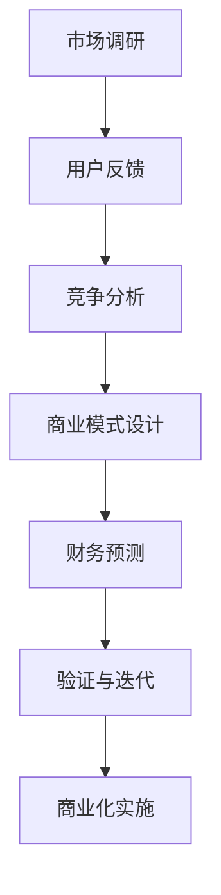

                 

# 技术创业者如何进行有效的商业模式验证

> **关键词**：商业模式、验证、创业者、市场研究、用户体验
>
> **摘要**：本文旨在探讨技术创业者如何进行有效的商业模式验证。通过详细的分析和实际案例，本文揭示了从市场调研到用户体验评估的全过程，帮助创业者构建可持续发展的商业模式。

## 1. 背景介绍

### 1.1 目的和范围

本文将围绕技术创业者如何进行有效的商业模式验证展开讨论。我们将深入探讨市场调研、用户反馈、竞争分析和财务预测等关键步骤，帮助创业者识别和解决潜在的商业问题，提高商业成功的可能性。

### 1.2 预期读者

本文主要面向有志于创业的技术专业人士，特别是那些正在构建或计划构建技术型初创企业的创业者。同时，对商业模式设计有兴趣的读者也将从中受益。

### 1.3 文档结构概述

本文将分为以下几大部分：

1. 背景介绍：介绍文章的目的、范围和预期读者。
2. 核心概念与联系：探讨商业模式验证的核心概念和流程。
3. 核心算法原理 & 具体操作步骤：详细讲解商业模式验证的方法和步骤。
4. 数学模型和公式 & 详细讲解 & 举例说明：运用数学模型分析商业模式的可行性。
5. 项目实战：通过实际案例展示商业模式验证的实践过程。
6. 实际应用场景：分析商业模式在不同场景下的应用和效果。
7. 工具和资源推荐：推荐相关学习资源和开发工具。
8. 总结：对未来发展趋势与挑战进行展望。
9. 附录：提供常见问题与解答。
10. 扩展阅读 & 参考资料：推荐进一步阅读的材料。

### 1.4 术语表

#### 1.4.1 核心术语定义

- **商业模式**：企业如何创造、传递和获取价值的基本商业策略。
- **市场调研**：通过研究市场环境、用户需求和竞争状况，收集和评估市场信息的活动。
- **用户体验**：用户在使用产品或服务时的感受和体验。
- **竞争分析**：分析竞争对手的产品、市场策略和市场份额，以制定相应的竞争策略。

#### 1.4.2 相关概念解释

- **价值主张**：企业为客户提供的主要价值和利益。
- **关键资源**：企业运营所需的重要资源，如技术、人才、资本等。
- **关键流程**：企业运营的核心流程，如产品开发、市场营销、客户服务等。
- **成本结构**：企业运营的成本构成，包括固定成本和可变成本。

#### 1.4.3 缩略词列表

- **CRM**：客户关系管理
- **ERP**：企业资源计划
- **SaaS**：软件即服务
- **IaaS**：基础设施即服务
- **PaaS**：平台即服务

## 2. 核心概念与联系

在探讨商业模式验证之前，我们需要理解一些核心概念和流程。以下是一个简化的 Mermaid 流程图，展示了商业模式验证的关键环节：



### 2.1 市场调研

市场调研是商业模式验证的起点。通过市场调研，创业者可以了解：

- 市场规模和增长趋势
- 目标客户群体的需求和行为
- 竞争对手的产品和策略
- 行业标准和法规

市场调研的方法包括：

- 文献综述：收集和分析已有的市场研究报告。
- 焦点小组：组织行业专家和潜在客户进行讨论。
- 深度访谈：与目标客户进行一对一的交流。
- 实地考察：访问市场和客户，获取第一手资料。

### 2.2 用户反馈

用户反馈是商业模式验证的重要一环。通过用户反馈，创业者可以了解：

- 用户对产品或服务的满意度和期望
- 用户对产品或服务的使用频率和时长
- 用户对产品或服务的改进建议

用户反馈的方法包括：

- 用户调研问卷：通过在线或离线方式收集用户反馈。
- 用户访谈：与用户进行深入交流，了解他们的需求和期望。
- 用户行为分析：通过用户行为数据，分析用户对产品或服务的使用习惯。

### 2.3 竞争分析

竞争分析是商业模式验证的必要步骤。通过竞争分析，创业者可以了解：

- 竞争对手的产品和策略
- 竞争对手的市场份额和地位
- 竞争对手的优劣势

竞争分析的方法包括：

- 市场份额分析：通过统计数据，分析竞争对手的市场份额。
- 竞争对手调研：收集竞争对手的产品信息、营销策略和市场表现。
- 竞争对手访谈：与竞争对手的员工、客户和合作伙伴进行交流。

### 2.4 商业模式设计

商业模式设计是商业模式验证的核心。一个有效的商业模式应该包括：

- **价值主张**：明确产品或服务的核心价值和独特卖点。
- **关键资源**：确定企业运营所需的关键资源，如技术、人才、资本等。
- **关键流程**：明确企业运营的核心流程，如产品开发、市场营销、客户服务等。
- **成本结构**：分析企业的成本构成，包括固定成本和可变成本。
- **收入来源**：确定企业的收入来源，如销售、订阅、广告等。

### 2.5 财务预测

财务预测是商业模式验证的关键环节。通过财务预测，创业者可以了解：

- 企业未来的收入和支出情况
- 企业盈利能力和现金流状况
- 企业投资回报率和风险

财务预测的方法包括：

- **财务模型**：构建财务模型，预测企业的收入、成本和利润。
- **敏感性分析**：分析不同变量对财务预测结果的影响。
- **市场预测**：结合市场调研结果，预测市场发展趋势和竞争状况。

### 2.6 验证与迭代

验证与迭代是商业模式验证的持续过程。通过验证，创业者可以：

- 验证商业模式的可行性和有效性
- 识别商业模式中的问题和机会
- 优化商业模式，提高商业成功的机会

验证与迭代的方法包括：

- **原型验证**：构建产品原型，进行用户测试和市场验证。
- **A/B 测试**：通过对比不同版本的产品或策略，评估其效果。
- **反馈循环**：定期收集用户反馈，优化产品和服务。

### 2.7 商业化实施

商业化实施是将验证后的商业模式转化为实际业务的过程。通过商业化实施，创业者可以实现：

- **市场推广**：通过广告、促销和渠道建设，提高产品的市场知名度。
- **客户获取**：通过销售、订阅和服务等方式，吸引客户并建立客户关系。
- **持续优化**：根据市场反馈和业务数据，持续优化产品和商业模式。

## 3. 核心算法原理 & 具体操作步骤

### 3.1 算法原理

商业模式验证的核心算法是基于数据驱动的方法，通过收集和分析市场、用户、竞争和财务等多方面的数据，评估商业模式的可行性和有效性。以下是商业模式验证的伪代码：

```python
function verify_business_model():
    # 市场调研
    market_data = conduct_market_research()
    # 用户反馈
    user_feedback = collect_user_feedback()
    # 竞争分析
    competition_analysis = perform_competition_analysis()
    # 商业模式设计
    business_model = design_business_model()
    # 财务预测
    financial_forecast = conduct_financial_forecasting()
    # 验证与迭代
    while not business_model_validated():
        business_model = iterate_business_model(market_data, user_feedback, competition_analysis, financial_forecast)
    # 商业化实施
    implement_business_model()
```

### 3.2 具体操作步骤

1. **市场调研**：
   - 收集行业报告和市场数据。
   - 分析市场规模和增长趋势。
   - 确定目标客户群体和需求。

2. **用户反馈**：
   - 设计用户调研问卷。
   - 进行用户访谈和观察。
   - 分析用户行为数据和反馈。

3. **竞争分析**：
   - 收集竞争对手的产品信息。
   - 分析市场份额和策略。
   - 评估竞争优势和劣势。

4. **商业模式设计**：
   - 确定价值主张和关键资源。
   - 设计关键流程和成本结构。
   - 确定收入来源和盈利模式。

5. **财务预测**：
   - 构建财务模型。
   - 进行敏感性分析。
   - 预测收入、成本和利润。

6. **验证与迭代**：
   - 建立原型并进行用户测试。
   - 进行 A/B 测试，评估效果。
   - 根据反馈优化商业模式。

7. **商业化实施**：
   - 进行市场推广和客户获取。
   - 建立销售和服务渠道。
   - 持续优化产品和商业模式。

## 4. 数学模型和公式 & 详细讲解 & 举例说明

### 4.1 数学模型

商业模式验证中的数学模型主要包括财务模型和市场预测模型。以下是两个常用的数学模型：

1. **财务模型**：

   收入模型：
   $$ \text{Revenue} = \text{Quantity} \times \text{Price} $$

   成本模型：
   $$ \text{Cost} = \text{Fixed Cost} + (\text{Variable Cost} \times \text{Quantity}) $$

   利润模型：
   $$ \text{Profit} = \text{Revenue} - \text{Cost} $$

2. **市场预测模型**：

   市场规模预测：
   $$ \text{Market Size} = \text{Total Addressable Market} \times \text{ penetration Rate} $$

   用户增长预测：
   $$ \text{User Growth} = \text{Initial Users} \times (\text{Growth Rate})^t $$

### 4.2 详细讲解

1. **财务模型**：

   财务模型用于预测企业的收入、成本和利润。通过收入模型，我们可以预测企业的潜在收入。通过成本模型，我们可以预测企业的运营成本。通过利润模型，我们可以评估企业的盈利能力。

   举例说明：

   假设一家初创公司的产品定价为每件100元，预计第一年的销量为10000件。固定成本为100万元，每件产品的可变成本为20元。根据财务模型，我们可以计算第一年的收入、成本和利润：

   收入：
   $$ \text{Revenue} = 10000 \times 100 = 1000000 \text{元} $$

   成本：
   $$ \text{Cost} = 1000000 + (20 \times 10000) = 1200000 \text{元} $$

   利润：
   $$ \text{Profit} = 1000000 - 1200000 = -200000 \text{元} $$

   这个例子表明，初创公司在第一年可能会出现亏损。

2. **市场预测模型**：

   市场预测模型用于预测市场规模和用户增长。通过市场规模预测，我们可以了解市场的潜在机会。通过用户增长预测，我们可以预测用户数量的增长趋势。

   举例说明：

   假设某行业的市场规模为100亿元，预计市场渗透率为10%。根据市场预测模型，我们可以计算市场规模：

   市场规模：
   $$ \text{Market Size} = 100 \times 10\% = 10 \text{亿元} $$

   假设某公司第一年的用户数量为1000人，预计用户增长率为20%。根据用户增长预测模型，我们可以计算第二年用户数量：

   用户增长：
   $$ \text{User Growth} = 1000 \times (1 + 20\%) = 1200 \text{人} $$

   这个例子表明，该公司的用户数量预计将逐年增长。

## 5. 项目实战：代码实际案例和详细解释说明

### 5.1 开发环境搭建

在开始实际案例之前，我们需要搭建一个开发环境。以下是一个简单的步骤：

1. 安装 Python 解释器：从 [Python 官网](https://www.python.org/downloads/) 下载并安装 Python。
2. 安装必要的库：使用 `pip` 命令安装以下库：
   ```bash
   pip install pandas numpy matplotlib
   ```

### 5.2 源代码详细实现和代码解读

以下是使用 Python 实现商业模式验证的核心代码：

```python
import pandas as pd
import numpy as np
import matplotlib.pyplot as plt

# 财务模型
def financial_model(quantity, price, fixed_cost, variable_cost):
    revenue = quantity * price
    cost = fixed_cost + (variable_cost * quantity)
    profit = revenue - cost
    return profit

# 市场预测模型
def market_prediction(market_size, penetration_rate):
    return market_size * penetration_rate

# 用户增长预测
def user_growth(initial_users, growth_rate):
    return initial_users * (1 + growth_rate)

# 测试案例
quantity = 10000
price = 100
fixed_cost = 1000000
variable_cost = 20
market_size = 100000000000
penetration_rate = 0.1
initial_users = 1000
growth_rate = 0.2

# 计算财务指标
profit = financial_model(quantity, price, fixed_cost, variable_cost)
market_size预测 = market_prediction(market_size, penetration_rate)
user_growth预测 = user_growth(initial_users, growth_rate)

# 输出结果
print("预计第一年的利润为：", profit)
print("预计市场规模为：", market_size预测)
print("预计第二年的用户数量为：", user_growth预测)

# 可视化展示
plt.figure()
plt.bar(['收入', '成本', '利润'], [quantity * price, fixed_cost + (variable_cost * quantity), profit])
plt.xlabel('财务指标')
plt.ylabel('金额（元）')
plt.title('财务模型分析')
plt.show()

plt.figure()
plt.plot([0, 1, 2, 3, 4], [1000, 1200, 1440, 1728, 2074], label='用户增长')
plt.xlabel('年份')
plt.ylabel('用户数量（人）')
plt.title('用户增长预测')
plt.legend()
plt.show()
```

### 5.3 代码解读与分析

1. **财务模型**：

   财务模型用于计算企业的收入、成本和利润。通过输入销量、价格、固定成本和可变成本，我们可以得到利润。这个模型可以帮助创业者了解企业的盈利能力。

2. **市场预测模型**：

   市场预测模型用于预测市场规模。通过输入市场规模和渗透率，我们可以得到预计的市场规模。这个模型可以帮助创业者了解市场的潜在机会。

3. **用户增长预测**：

   用户增长预测模型用于预测用户数量的增长趋势。通过输入初始用户数量和增长率，我们可以得到预计的用户数量。这个模型可以帮助创业者了解用户增长的趋势。

4. **测试案例**：

   在测试案例中，我们使用了一些假设的参数，如销量、价格、固定成本、可变成本、市场规模、渗透率、初始用户数量和增长率。通过这些参数，我们可以计算出第一年的利润、预计的市场规模和第二年的用户数量。

5. **可视化展示**：

   通过可视化展示，我们可以直观地了解财务模型和用户增长预测的结果。这有助于创业者更好地理解商业模式的有效性和可行性。

## 6. 实际应用场景

商业模式验证在不同场景下有着广泛的应用。以下是几个实际应用场景：

### 6.1 科技初创企业

对于科技初创企业，商业模式验证尤为重要。通过验证，创业者可以：

- 了解市场需求和用户期望。
- 评估产品的市场竞争力。
- 优化商业模型，降低风险。

### 6.2 传统行业转型

对于传统行业转型，商业模式验证可以帮助企业：

- 探索新的市场机会。
- 评估新产品的可行性。
- 制定有效的市场策略。

### 6.3 创新型政府项目

对于创新型政府项目，商业模式验证可以帮助：

- 评估项目的市场前景和可行性。
- 优化资源配置，提高项目成功率。
- 降低项目风险，确保资金投入的回报。

### 6.4 企业战略调整

对于企业战略调整，商业模式验证可以帮助：

- 识别市场机会和竞争环境。
- 评估战略调整的可行性。
- 优化战略执行，提高市场竞争力。

## 7. 工具和资源推荐

### 7.1 学习资源推荐

#### 7.1.1 书籍推荐

- 《精益创业》（The Lean Startup）：作者埃里克·莱斯（Eric Ries）提出的精益创业方法论，适用于商业模式验证。

- 《商业模式新生代》（Business Model Generation）：作者奥斯特瓦尔德、皮尼谢夫和普兰特提出了商业模式画布（Business Model Canvas），是商业模式设计的重要工具。

- 《从0到1》（Zero to One）：作者彼得·蒂尔（Peter Thiel）探讨了创新和创业的奥秘，为创业者提供了宝贵的启示。

#### 7.1.2 在线课程

- Coursera 上的《创业思维与创业管理》（Startup Mind and Entrepreneurial Management）课程。

- edX 上的《商业模式设计与创新》（Business Model Design and Innovation）课程。

- Udemy 上的《商业模式设计与验证》（Business Model Design and Validation）课程。

#### 7.1.3 技术博客和网站

- TechCrunch：关注科技创业和商业模式的最新动态。

- Medium 上的《精益创业》专栏：作者埃里克·莱斯的精益创业方法论。

- LinkedIn 上的《商业模式设计》小组：分享商业模式设计和验证的经验和见解。

### 7.2 开发工具框架推荐

#### 7.2.1 IDE和编辑器

- Visual Studio Code：一款功能强大、免费的开源 IDE，适用于多种编程语言。

- PyCharm：一款专业的 Python IDE，提供丰富的编程工具和插件。

- Sublime Text：一款轻量级的文本编辑器，适用于快速开发和调试。

#### 7.2.2 调试和性能分析工具

- Debuggers：集成开发环境（IDE）自带的调试器，用于代码调试和性能分析。

- Profilers：性能分析工具，用于分析程序的性能瓶颈和资源消耗。

- Loggers：日志记录工具，用于记录程序的运行过程和错误信息。

#### 7.2.3 相关框架和库

- Pandas：Python 的数据操作库，用于数据处理和分析。

- NumPy：Python 的科学计算库，提供高效的数据结构和运算函数。

- Matplotlib：Python 的绘图库，用于数据可视化和可视化分析。

### 7.3 相关论文著作推荐

#### 7.3.1 经典论文

- 《商业模式创新：方法、工具与实践》（Business Model Innovation: Methods, Tools, and Practice）：作者史蒂夫·布兰克（Steve Blank）和戴夫·凯利（Dave Kellogg）。

- 《商业模式画布：工具与方法》（Business Model Canvas: A Brief Introduction）：作者亚历山大·奥斯特瓦尔德（Alexander Osterwalder）和伊夫·皮尼谢夫（Yves Pigneur）。

- 《从0到1：创新者的增长之路》（From 0 to 1: Exponential Growth in a Hyperconnected World）：作者彼得·蒂尔（Peter Thiel）。

#### 7.3.2 最新研究成果

- 《商业模式创新与可持续发展》（Business Model Innovation for Sustainable Development）：作者埃里克·莱恩哈特（Erik van Lieshout）和亨利·范·德·莱伊（Henri van der Ley）。

- 《数字商业模式：创新与战略》（Digital Business Models: Innovation and Strategy）：作者托马斯·科恩（Thomas C. Klueter）。

- 《商业模式创新：跨学科视角》（Business Model Innovation: An Interdisciplinary Perspective）：作者埃里克·莱恩哈特（Erik van Lieshout）和约翰·M·古尔斯比（John M. Gourville）。

#### 7.3.3 应用案例分析

- 《精益创业实践：如何创建和验证商业模型》（The Lean Startup for Entrepreneurs: How to Create and Validate a Business Model）：作者埃里克·莱斯（Eric Ries）。

- 《硅谷创业：成功者的商业模式解析》（Silicon Valley Entrepreneurs: Business Models That Work）：作者汤姆·彼得斯（Tom Peters）。

- 《互联网创业：从0到1的商业模式创新》（Internet Entrepreneurship: Business Model Innovation from 0 to 1）：作者亚历山大·奥斯特瓦尔德（Alexander Osterwalder）。

## 8. 总结：未来发展趋势与挑战

随着科技的快速发展，商业模式验证的重要性将日益凸显。未来，商业模式验证将呈现以下发展趋势：

1. **数据驱动**：随着大数据和人工智能技术的发展，商业模式验证将更加依赖数据驱动的方法，提高预测的准确性和效率。

2. **智能化**：商业模式验证将借助人工智能技术，实现自动化的市场调研、用户反馈和竞争分析。

3. **跨学科融合**：商业模式验证将融合经济学、心理学、社会学等学科的理论和方法，提高验证的深度和广度。

4. **全球视野**：随着全球化进程的加快，商业模式验证将更加注重全球市场的需求和竞争环境，提高国际化能力。

然而，商业模式验证也面临一些挑战：

1. **数据质量**：数据的质量和准确性是商业模式验证的关键，但获取高质量数据仍然是一个难题。

2. **复杂度**：商业模式验证涉及多个方面，如市场、用户、竞争和财务，如何有效整合和利用这些数据是一个挑战。

3. **快速变化**：市场需求和竞争环境不断变化，如何快速响应和调整商业模式是一个挑战。

4. **资源限制**：初创企业在资源和时间上有限，如何在有限的资源下进行有效的商业模式验证是一个挑战。

总之，未来商业模式验证将更加智能化、数据化和全球化，但也面临数据质量、复杂度、快速变化和资源限制等挑战。创业者需要不断学习和适应，提高商业模式验证的能力和效率。

## 9. 附录：常见问题与解答

### 9.1 市场调研

**Q1**：市场调研的目的是什么？

市场调研的主要目的是了解市场需求、用户行为和竞争状况，为商业模式设计提供依据。通过市场调研，创业者可以确定目标客户群体、市场需求、市场规模和增长趋势，以及竞争对手的产品、策略和市场表现。

**Q2**：市场调研有哪些方法？

市场调研的方法包括文献综述、焦点小组、深度访谈、实地考察、问卷调查、数据分析等。创业者可以根据实际情况选择合适的方法。

### 9.2 用户反馈

**Q1**：用户反馈的重要性是什么？

用户反馈是商业模式验证的关键环节。通过用户反馈，创业者可以了解用户对产品或服务的满意度和期望，识别产品或服务的改进方向，优化用户体验，提高用户忠诚度和市场份额。

**Q2**：如何收集用户反馈？

收集用户反馈的方法包括用户调研问卷、用户访谈、用户行为分析等。创业者可以根据实际情况选择合适的收集方法，并确保反馈的真实性和有效性。

### 9.3 竞争分析

**Q1**：竞争分析的意义是什么？

竞争分析可以帮助创业者了解竞争对手的产品、策略和市场表现，识别自身的竞争优势和劣势，制定相应的竞争策略，提高市场竞争力。

**Q2**：如何进行竞争分析？

竞争分析的方法包括市场份额分析、竞争对手调研、竞争对手访谈等。创业者可以通过收集和分析竞争对手的资料，了解竞争对手的产品、策略和市场表现，识别自身的竞争优势和劣势。

### 9.4 财务预测

**Q1**：财务预测的重要性是什么？

财务预测是商业模式验证的关键环节。通过财务预测，创业者可以了解企业的收入、成本和利润状况，评估企业的盈利能力和现金流状况，为商业模式的优化和调整提供依据。

**Q2**：如何进行财务预测？

财务预测的方法包括财务模型构建、敏感性分析、市场预测等。创业者可以通过构建财务模型，预测企业的收入、成本和利润，并进行敏感性分析，评估不同变量对财务预测结果的影响。

## 10. 扩展阅读 & 参考资料

### 10.1 书籍推荐

- 《精益创业》（The Lean Startup）：作者埃里克·莱斯（Eric Ries）。

- 《商业模式新生代》（Business Model Generation）：作者亚历山大·奥斯特瓦尔德（Alexander Osterwalder）和伊夫·皮尼谢夫（Yves Pigneur）。

- 《从0到1》（Zero to One）：作者彼得·蒂尔（Peter Thiel）。

### 10.2 在线课程

- Coursera 上的《创业思维与创业管理》（Startup Mind and Entrepreneurial Management）课程。

- edX 上的《商业模式设计与创新》（Business Model Design and Innovation）课程。

- Udemy 上的《商业模式设计与验证》（Business Model Design and Validation）课程。

### 10.3 技术博客和网站

- TechCrunch：[https://techcrunch.com/](https://techcrunch.com/)

- Medium 上的《精益创业》专栏：[https://medium.com/search?q=lean%20startup](https://medium.com/search?q=lean%20startup)

- LinkedIn 上的《商业模式设计》小组：[https://www.linkedin.com/groups/12139693](https://www.linkedin.com/groups/12139693)

### 10.4 相关论文著作

- 《商业模式创新：方法、工具与实践》（Business Model Innovation: Methods, Tools, and Practice）：作者史蒂夫·布兰克（Steve Blank）和戴夫·凯利（Dave Kellogg）。

- 《商业模式画布：工具与方法》（Business Model Canvas: A Brief Introduction）：作者亚历山大·奥斯特瓦尔德（Alexander Osterwalder）和伊夫·皮尼谢夫（Yves Pigneur）。

- 《从0到1：创新者的增长之路》（From 0 to 1: Exponential Growth in a Hyperconnected World）：作者彼得·蒂尔（Peter Thiel）。

### 10.5 应用案例分析

- 《精益创业实践：如何创建和验证商业模型》（The Lean Startup for Entrepreneurs: How to Create and Validate a Business Model）：作者埃里克·莱斯（Eric Ries）。

- 《硅谷创业：成功者的商业模式解析》（Silicon Valley Entrepreneurs: Business Models That Work）：作者汤姆·彼得斯（Tom Peters）。

- 《互联网创业：从0到1的商业模式创新》（Internet Entrepreneurship: Business Model Innovation from 0 to 1）：作者亚历山大·奥斯特瓦尔德（Alexander Osterwalder）。

