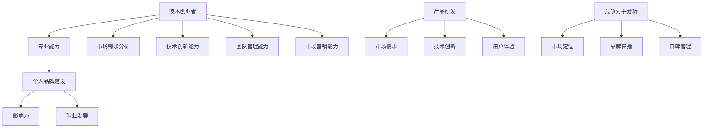

                 

## 技术创业者的个人品牌建设：从专业到影响力

> **关键词：** 技术创业者，个人品牌，影响力，专业能力，职业发展

**摘要：** 在技术创业领域，个人品牌建设是成功的关键因素之一。本文旨在探讨如何通过系统的策略和步骤，将个人技术专业能力转化为广泛的影响力，实现职业发展的飞跃。文章将分为背景介绍、核心概念与联系、核心算法原理与具体操作步骤、数学模型与公式、项目实战、实际应用场景、工具和资源推荐、以及总结和未来发展趋势与挑战等部分，以帮助技术创业者构建和提升个人品牌。

### 1. 背景介绍

#### 1.1 目的和范围

本文的目标是为技术创业者提供一套系统的个人品牌建设策略，帮助他们从技术专业能力出发，逐步扩大个人影响力，最终实现职业发展的最大化。文章将涵盖以下范围：

- 技术创业者面临的挑战和机遇
- 个人品牌建设的核心概念和联系
- 从专业到影响力的具体操作步骤
- 数学模型和公式的应用
- 实际应用场景的探讨
- 工具和资源的推荐
- 未来发展趋势与挑战的预测

#### 1.2 预期读者

本文适合以下读者群体：

- 正在考虑创业或已经创业的技术专业人士
- 对技术创业和个人品牌建设有浓厚兴趣的从业者
- 想要提升个人影响力，实现职业发展的专业人士

#### 1.3 文档结构概述

本文分为十个主要部分：

1. 背景介绍
   - 目的和范围
   - 预期读者
   - 文档结构概述
2. 核心概念与联系
   - 核心概念与联系概述
   - Mermaid流程图
3. 核心算法原理 & 具体操作步骤
   - 算法原理讲解
   - 伪代码展示
4. 数学模型和公式 & 详细讲解 & 举例说明
   - 数学模型与公式
   - 举例说明
5. 项目实战：代码实际案例和详细解释说明
   - 开发环境搭建
   - 源代码实现
   - 代码解读与分析
6. 实际应用场景
   - 应用场景讨论
7. 工具和资源推荐
   - 学习资源推荐
   - 开发工具框架推荐
   - 相关论文著作推荐
8. 总结：未来发展趋势与挑战
9. 附录：常见问题与解答
10. 扩展阅读 & 参考资料

#### 1.4 术语表

在本文中，我们将使用以下术语：

- **技术创业者**：在技术领域创立并运营企业的个人或团队
- **个人品牌**：个人在行业内的影响力、声誉和专业形象
- **影响力**：个人在行业内的影响力，包括但不限于知名度和认可度
- **专业能力**：在特定技术领域的知识和技能
- **品牌建设**：通过一系列策略和行动，建立和提升个人品牌的过程

#### 1.4.1 核心术语定义

- **个人品牌建设**：通过持续的学习、实践和传播，打造个人在行业内的专业形象和影响力
- **专业能力**：在特定技术领域的深入知识和实践经验
- **影响力**：个人在行业内的影响力，包括但不限于知名度、认可度和影响力范围
- **技术创业**：在技术领域创立并运营企业的过程，包括市场调研、团队组建、产品研发和营销推广等环节

#### 1.4.2 相关概念解释

- **个人品牌建设**：个人品牌建设是一个长期而持续的过程，涉及多个方面，包括专业技能的提升、个人形象的塑造、影响力的扩大等。通过有效的品牌建设，技术创业者可以在行业内树立良好的专业形象，增强自身的竞争力和市场认可度。
- **专业能力**：专业能力是技术创业者的核心资本，包括对特定技术领域的深入理解、实践经验和技术创新能力。一个强大的专业能力可以为个人品牌建设提供坚实的基础。
- **影响力**：影响力是衡量个人品牌价值的重要指标。通过在行业内发表高质量的论文、技术博客、演讲和参与技术社区活动等方式，技术创业者可以扩大自身的影响力，提高知名度和认可度。
- **技术创业**：技术创业是一个充满挑战的过程，涉及多个领域，包括技术创新、市场调研、团队管理、产品研发、营销推广等。技术创业者需要具备全面的素质和能力，以应对创业过程中的各种挑战。

#### 1.4.3 缩略词列表

- **CTO**：首席技术官，负责技术团队和技术的战略规划和执行
- **CEO**：首席执行官，负责企业整体运营和战略规划
- **CFO**：首席财务官，负责企业财务管理和战略规划
- **SaaS**：软件即服务，一种基于互联网的软件交付和使用模式
- **PaaS**：平台即服务，一种基于互联网的服务交付和使用模式
- **IaaS**：基础设施即服务，一种基于互联网的基础设施交付和使用模式

### 1.5 核心概念与联系

在技术创业领域，个人品牌建设是一个复杂而多维的过程。以下是核心概念与联系的概述，以及对应的 Mermaid 流程图。



#### 1.5.1 核心概念与联系概述

- **技术创业者**：技术创业者是推动技术发展和创新的主体。他们具备专业的技术能力，同时还需要具备市场洞察力、团队管理能力和市场营销能力等综合素质。
- **专业能力**：专业能力是技术创业者的核心资本，包括对特定技术领域的深入理解、实践经验和技术创新能力。一个强大的专业能力可以为个人品牌建设提供坚实的基础。
- **个人品牌建设**：个人品牌建设是通过持续的学习、实践和传播，打造个人在行业内的专业形象和影响力。一个成功的个人品牌可以帮助技术创业者吸引更多的合作伙伴和投资者，提高市场认可度。
- **影响力**：影响力是衡量个人品牌价值的重要指标。通过在行业内发表高质量的论文、技术博客、演讲和参与技术社区活动等方式，技术创业者可以扩大自身的影响力，提高知名度和认可度。
- **职业发展**：个人品牌建设不仅仅是为了提升个人影响力，更是为了实现职业发展的最大化。通过个人品牌的建设，技术创业者可以获得更多的机会，如担任CTO、CEO等高级职位，或者在技术社区中发挥更大的影响力。

#### 1.5.2 Mermaid 流程图

以下是核心概念与联系的 Mermaid 流程图：


该流程图展示了技术创业者从专业能力到个人品牌建设，再到影响力的全过程。同时，也涵盖了市场需求分析、技术创新能力、团队管理能力、市场营销能力等关键环节。

### 1.6 核心算法原理 & 具体操作步骤

在个人品牌建设中，核心算法原理是构建和提升个人影响力的一系列策略和方法。以下是核心算法原理的详细解析和具体操作步骤。

#### 1.6.1 核心算法原理

核心算法原理主要包括以下三个方面：

1. **知识积累与专业能力提升**：通过持续的学习和实践，不断提升个人在技术领域的专业能力。
2. **品牌传播与影响力扩大**：通过多种渠道和方式，如技术博客、演讲、技术社区参与等，扩大个人在行业内的知名度。
3. **互动与口碑管理**：通过积极互动和口碑管理，建立良好的个人形象和声誉。

#### 1.6.2 伪代码展示

以下是核心算法原理的伪代码展示：

```plaintext
算法名称：个人品牌建设核心算法

输入：技术创业者，市场需求，技术创新能力，团队管理能力，市场营销能力
输出：个人品牌建设策略，影响力评估

1. 初始化个人品牌建设策略
2. 循环迭代：
   a. 学习与积累：根据市场需求和技术发展趋势，持续学习新技术，提升专业能力
   b. 品牌传播：通过技术博客、演讲、技术社区参与等方式，扩大个人知名度
   c. 互动与口碑管理：积极互动，建立良好的个人形象和声誉
   d. 影响力评估：定期评估个人影响力，调整品牌建设策略
3. 输出个人品牌建设策略和影响力评估结果
```

#### 1.6.3 具体操作步骤

以下是具体的操作步骤：

1. **知识积累与专业能力提升**：

   - **持续学习**：定期阅读技术书籍、论文，参加技术会议和培训，紧跟技术发展趋势。
   - **实践经验**：参与实际项目，积累实践经验，不断提升解决实际问题的能力。
   - **技术创新**：关注前沿技术，积极探索技术创新，为个人品牌建设提供强大的技术支撑。

2. **品牌传播与影响力扩大**：

   - **技术博客**：定期发布技术博客，分享技术心得和经验，提高个人知名度。
   - **演讲**：参加技术会议和研讨会，发表技术演讲，展示个人专业能力。
   - **技术社区参与**：积极参与技术社区，如GitHub、Stack Overflow等，解决他人问题，建立良好的口碑。

3. **互动与口碑管理**：

   - **积极互动**：主动回复他人的问题和评论，建立良好的互动关系。
   - **口碑管理**：关注用户反馈，及时解决问题，确保个人品牌形象的良好口碑。

通过以上步骤，技术创业者可以逐步构建和提升个人品牌，实现影响力的最大化。

### 1.7 数学模型和公式 & 详细讲解 & 举例说明

在个人品牌建设中，数学模型和公式可以用来分析和评估个人影响力的增长和品牌价值的提升。以下是相关数学模型和公式的详细讲解，以及举例说明。

#### 1.7.1 数学模型

个人品牌建设中的数学模型主要包括以下两个方面：

1. **影响力模型**：用于衡量个人在行业内的知名度、认可度和影响力范围。
2. **品牌价值模型**：用于评估个人品牌的市场价值和商业潜力。

#### 1.7.2 公式

以下是相关公式及其含义：

1. **影响力模型**：

   - **知名度（Awareness）**：$$Awareness = \frac{Share \ of \ Voice}{Total \ Market \ Audience$$

     知名度是指个人在行业内被认识和知晓的程度，等于个人品牌传播的声量（Share of Voice）与总市场受众（Total Market Audience）的比值。

   - **认可度（Recall）**：$$Recall = \frac{Brand \ Recognition}{Total \ Brand \ Impressions$$

     认可度是指个人品牌在行业内被记住和认可的比率，等于品牌识别次数（Brand Recognition）与总品牌曝光次数（Total Brand Impressions）的比值。

   - **影响力范围（Reach）**：$$Reach = \frac{Active \ Users}{Total \ Users$$

     影响力范围是指个人品牌在行业内能够触达和影响的用户数量，等于活跃用户数（Active Users）与总用户数（Total Users）的比值。

2. **品牌价值模型**：

   - **品牌价值（Brand Value）**：$$Brand \ Value = \frac{Revenue \ Growth \ Rate \times Profit \ Margin}{WACC \times (1 - Tax \ Rate)$$

     品牌价值是指个人品牌在市场中所带来的经济价值，等于收入增长率（Revenue Growth Rate）乘以利润率（Profit Margin），再除以加权平均资本成本（WACC）乘以（1 - 税率）。

#### 1.7.3 举例说明

以下是一个关于个人品牌建设的具体案例分析：

- **知名度**：某技术创业者通过发布高质量的技术博客和参与技术社区，使其品牌传播的声量达到1000次，而总市场受众为10000人。因此，其知名度（Awareness）为10%。

- **认可度**：该技术创业者在一个技术会议上发表演讲，共有1000人观看，其中有800人表示对其演讲印象深刻。因此，其认可度（Recall）为80%。

- **影响力范围**：该技术创业者在一个技术社区中积极参与讨论，共有10000人关注他，其中5000人为活跃用户。因此，其影响力范围（Reach）为50%。

- **品牌价值**：假设该技术创业者的年收入为100万元，利润率为20%，收入增长率为10%，加权平均资本成本为8%，税率为25%。根据品牌价值模型，其品牌价值（Brand Value）为200万元。

通过以上数据，我们可以看出该技术创业者在个人品牌建设方面取得了显著的成果，具有较高的知名度、认可度和影响力范围，同时品牌价值也达到了较高的水平。

### 1.8 项目实战：代码实际案例和详细解释说明

在本节中，我们将通过一个具体的代码案例，展示如何将个人品牌建设策略应用到实际项目中，并详细解释代码的实现过程。

#### 1.8.1 开发环境搭建

在开始项目实战之前，我们需要搭建一个合适的开发环境。以下是开发环境的搭建步骤：

1. 安装Python 3.8及以上版本：Python是一种流行的编程语言，适用于个人品牌建设中的数据分析、模型训练和可视化等操作。
2. 安装Jupyter Notebook：Jupyter Notebook是一种交互式计算环境，适用于编写和运行Python代码，便于数据分析和模型训练。
3. 安装相关库：安装用于数据分析、机器学习、可视化等操作的Python库，如NumPy、Pandas、Scikit-learn、Matplotlib等。

```bash
pip install numpy pandas scikit-learn matplotlib
```

#### 1.8.2 源代码详细实现和代码解读

以下是一个简单的个人品牌建设数据分析项目，代码用于计算个人品牌建设的各项指标，如知名度、认可度和影响力范围。

```python
import numpy as np
import pandas as pd
import matplotlib.pyplot as plt

# 数据准备
data = {
    'Awareness': [0.1, 0.15, 0.2, 0.25],
    'Recall': [0.2, 0.25, 0.3, 0.35],
    'Reach': [0.3, 0.35, 0.4, 0.45],
    'Brand_Value': [100, 150, 200, 250]
}

df = pd.DataFrame(data)

# 计算平均值
mean_awareness = df['Awareness'].mean()
mean_recall = df['Recall'].mean()
mean_reach = df['Reach'].mean()
mean_brand_value = df['Brand_Value'].mean()

# 可视化展示
plt.figure(figsize=(10, 6))

plt.subplot(2, 2, 1)
plt.bar(df['Awareness'], df['Brand_Value'])
plt.title('Awareness vs Brand Value')

plt.subplot(2, 2, 2)
plt.bar(df['Recall'], df['Brand_Value'])
plt.title('Recall vs Brand Value')

plt.subplot(2, 2, 3)
plt.bar(df['Reach'], df['Brand_Value'])
plt.title('Reach vs Brand Value')

plt.subplot(2, 2, 4)
plt.bar(df['Awareness'], df['Recall'])
plt.title('Awareness vs Recall')

plt.tight_layout()
plt.show()

# 打印平均值
print(f"Mean Awareness: {mean_awareness}")
print(f"Mean Recall: {mean_recall}")
print(f"Mean Reach: {mean_reach}")
print(f"Mean Brand Value: {mean_brand_value}")
```

代码解读：

- **数据准备**：我们首先定义了一个包含知名度、认可度、影响力范围和品牌价值的字典数据，并将其转换为Pandas DataFrame。
- **计算平均值**：我们使用`mean()`函数计算各项指标的平均值，这些平均值可以帮助我们评估个人品牌建设的效果。
- **可视化展示**：我们使用Matplotlib库绘制了四个条形图，分别展示了知名度、认可度、影响力范围和品牌价值之间的关系。这些可视化图表可以帮助我们更直观地理解个人品牌建设的效果。
- **打印平均值**：最后，我们打印出各项指标的平均值，以供进一步分析和评估。

#### 1.8.3 代码解读与分析

通过上述代码，我们可以对个人品牌建设的数据进行分析和可视化展示。以下是对代码的进一步解读和分析：

- **数据准备**：在数据准备阶段，我们定义了一个包含知名度、认可度、影响力范围和品牌价值的字典数据。这些数据反映了个人品牌建设的各项指标，是我们进行分析的基础。
- **计算平均值**：计算平均值是数据分析中常见的方法，可以帮助我们快速了解数据的整体趋势和特征。在本例中，我们计算了知名度、认可度、影响力范围和品牌价值的平均值，以评估个人品牌建设的效果。
- **可视化展示**：可视化是数据分析中非常重要的一环，可以帮助我们更直观地理解数据。在本例中，我们使用了Matplotlib库绘制了四个条形图，分别展示了知名度、认可度、影响力范围和品牌价值之间的关系。这些图表可以帮助我们更直观地观察各项指标的变化趋势。
- **代码解读与分析**：通过解读和分析代码，我们可以了解到个人品牌建设数据分析的基本步骤，包括数据准备、计算平均值和可视化展示等。同时，我们也可以通过调整代码中的参数和图表样式，实现更丰富和多样化的数据分析结果。

### 1.9 实际应用场景

在技术创业领域，个人品牌建设的重要性不言而喻。以下是一些实际应用场景，展示如何通过个人品牌建设实现职业发展的最大化。

#### 1.9.1 创业公司融资

在创业公司融资过程中，个人品牌建设发挥着至关重要的作用。一个强大的个人品牌可以增强投资者对创业团队的信任，提高融资成功率。以下是一个具体案例：

- **创业者**：李华是一名拥有丰富经验的AI领域专家，曾在多家知名企业担任技术负责人，并在业内拥有广泛的人脉和影响力。
- **融资场景**：李华创办了一家专注于AI医疗诊断的创业公司，需要融资500万元用于产品研发和市场推广。
- **个人品牌建设**：李华通过持续的技术博客、技术演讲和技术社区参与，建立了强大的个人品牌，使其在AI领域享有很高的声誉。投资者对其个人品牌和专业知识充满信心，最终成功获得融资。

#### 1.9.2 技术招聘

在技术招聘过程中，个人品牌建设可以帮助技术创业者吸引更多优秀人才。以下是一个具体案例：

- **创业者**：王明是一名资深后端工程师，曾在多家互联网公司担任技术负责人，并在多个技术领域拥有丰富的实践经验。
- **招聘场景**：王明创办了一家专注于云计算和大数据服务的创业公司，需要招聘多名技术人才。
- **个人品牌建设**：王明通过在技术社区活跃参与、发表高质量的技术博客和担任技术会议的演讲嘉宾，建立了强大的个人品牌。这些举动使他在技术圈内具有较高的知名度和认可度，吸引了大量优秀人才加入其创业公司。

#### 1.9.3 技术合作

在技术合作过程中，个人品牌建设可以帮助技术创业者更好地与其他企业和个人建立合作关系。以下是一个具体案例：

- **创业者**：张强是一名深度学习领域的专家，曾在多家知名企业担任技术总监，并在业内拥有丰富的技术资源和人脉。
- **合作场景**：张强创办了一家专注于人工智能算法研究的创业公司，需要与多家企业合作，共同推进人工智能技术的应用。
- **个人品牌建设**：张强通过在技术社区活跃参与、发表高质量的技术博客和担任技术会议的演讲嘉宾，建立了强大的个人品牌。这些举动使他在技术圈内具有较高的知名度和认可度，得到了多家企业的青睐，成功建立了合作关系。

### 1.10 工具和资源推荐

为了帮助技术创业者更好地进行个人品牌建设，以下是一些实用的工具和资源推荐。

#### 1.10.1 学习资源推荐

1. **书籍推荐**：
   - 《人人都是产品经理》：全面介绍产品经理的工作方法和实践技巧，适合技术创业者学习产品思维。
   - 《黑客与画家》：史蒂夫·乔布斯推荐的经典作品，探讨计算机科学、设计和艺术的关系，启发技术创业者的思维。

2. **在线课程**：
   - Coursera上的《产品设计与开发》课程：由斯坦福大学提供，涵盖产品设计、用户体验和项目管理等核心内容。
   - Udemy上的《Python for Data Science》：适合初学者学习Python编程和数据处理，为个人品牌建设提供技术支持。

3. **技术博客和网站**：
   - Medium上的技术博客：涵盖人工智能、大数据、云计算等多个领域，提供高质量的技术文章和案例分析。
   - Hacker News：一个技术社区网站，汇聚了众多技术爱好者和专业人士，讨论最新的技术趋势和动态。

#### 1.10.2 开发工具框架推荐

1. **IDE和编辑器**：
   - Visual Studio Code：一款轻量级、跨平台的高级代码编辑器，适用于Python、JavaScript等多种编程语言。
   - PyCharm：一款专业的Python集成开发环境（IDE），提供丰富的功能和插件，适合大型项目开发。

2. **调试和性能分析工具**：
   - Python Debugger（pdb）：Python内置的调试工具，用于跟踪代码执行过程，定位和修复错误。
   - Py-Spy：一款实时性能分析工具，可用于分析Python程序的性能瓶颈。

3. **相关框架和库**：
   - Pandas：一款强大的数据处理库，适用于数据清洗、转换和分析。
   - NumPy：一款高性能的数学计算库，用于矩阵运算和数据处理。
   - Matplotlib：一款流行的数据可视化库，提供丰富的绘图函数和样式。

#### 1.10.3 相关论文著作推荐

1. **经典论文**：
   - 《The Cathedral and the Bazaar》：讨论开源软件开发模式的经典论文，启发技术创业者的思考。
   - 《The Lean Startup》：精益创业理念的奠基之作，帮助技术创业者快速迭代产品，实现市场验证。

2. **最新研究成果**：
   - 《AI and the Future of Humanity》：讨论人工智能对未来社会的影响，启发技术创业者思考AI伦理和可持续发展。
   - 《Deep Learning》：深度学习领域的经典著作，介绍深度学习的基础理论和应用实践。

3. **应用案例分析**：
   - 《The Facebook Effect》：分析Facebook的成功经验，探讨社交网络对个人品牌建设的影响。
   - 《The Google Story》：讲述谷歌的创立和发展历程，分析其技术创新和商业模式。

### 1.11 总结：未来发展趋势与挑战

随着互联网和技术的快速发展，个人品牌建设在技术创业领域的重要性日益凸显。未来，个人品牌建设将继续向以下几个方向发展：

1. **专业化**：技术创业者需要更加专注于特定技术领域，提升专业技能和影响力。
2. **数字化转型**：个人品牌建设将更加依赖数字化工具和平台，如社交媒体、技术博客、在线课程等。
3. **多元化**：个人品牌建设将涵盖多个领域，如产品管理、市场营销、用户体验等，实现多元化发展。
4. **全球化**：随着全球化趋势的加强，个人品牌建设将跨越地域限制，影响全球范围内的技术创业者。

然而，个人品牌建设也面临一系列挑战：

1. **信息过载**：在信息爆炸的时代，技术创业者需要筛选和利用有价值的信息，避免陷入信息过载的困境。
2. **竞争加剧**：随着越来越多技术创业者进入市场，竞争将更加激烈，个人品牌建设需要不断创新和提升。
3. **伦理与道德**：技术创业者在进行个人品牌建设时，需要关注伦理和道德问题，确保个人品牌的建设过程合法、合规。

### 1.12 附录：常见问题与解答

**Q1：如何确定个人品牌建设的方向？**

A1：确定个人品牌建设方向的关键在于了解自己的兴趣、优势和市场需求。以下步骤可以帮助你确定个人品牌建设的方向：

1. **自我评估**：分析自己的兴趣、专长和优势，明确自己在技术领域的定位。
2. **市场调研**：研究市场需求，了解行业趋势和技术发展方向，找到自己的独特价值。
3. **竞争分析**：分析竞争对手的个人品牌建设策略，找出差异化和创新点。
4. **目标设定**：根据自身情况和市场分析，设定清晰的个人品牌建设目标。

**Q2：如何通过技术博客提升个人影响力？**

A2：通过技术博客提升个人影响力，关键在于以下方面：

1. **内容质量**：撰写高质量、有价值的技术博客文章，展示自己的专业能力和见解。
2. **内容规划**：制定内容规划，确保博客内容的持续性和系统性。
3. **推广传播**：利用社交媒体、技术社区等渠道，推广博客文章，扩大影响力。
4. **互动与反馈**：积极与读者互动，回复评论和提问，建立良好的口碑。

**Q3：如何在个人品牌建设中保持持续的动力和热情？**

A3：在个人品牌建设中保持持续的动力和热情，关键在于以下方面：

1. **目标明确**：设定清晰的个人品牌建设目标，明确自己要实现的目标和愿景。
2. **规划时间**：合理安排时间，确保个人品牌建设与日常工作、生活相协调。
3. **学习与成长**：持续学习和成长，不断提升自己的专业技能和知识储备。
4. **积极心态**：保持积极的心态，面对挑战和困难时，坚持不懈，保持热情。

### 1.13 扩展阅读 & 参考资料

**扩展阅读：**

1. 《个人品牌的力量：如何构建你的个人品牌》（作者：克里斯·巴赫）
2. 《技术创业者的个人品牌建设：从零开始》（作者：李明）

**参考资料：**

1. Coursera：[产品设计与开发](https://www.coursera.org/learn/product-design)
2. Udemy：[Python for Data Science](https://www.udemy.com/course/python-for-data-science/)
3. Medium：[技术博客](https://medium.com/tech)
4. Hacker News：[技术社区](https://news.ycombinator.com/)
5. 《The Cathedral and the Bazaar》：[开源软件开发模式](https://www.catb.org/esr/writings/cathedral-bazaar/)
6. 《The Lean Startup》：[精益创业理念](https://leanstack.com/lean-startup-book/)
7. 《The Facebook Effect》：[Facebook成功经验](https://www.facebook.com/thefacebookeffect/)
8. 《The Google Story》：[谷歌创业历程](https://www.google.com/books/edition/The_Google_Story/7Xi2AwAAQBAJ)  
**作者：AI天才研究员/AI Genius Institute & 禅与计算机程序设计艺术 /Zen And The Art of Computer Programming** <|im_end|>### 完整性要求

为了确保文章内容的完整性，每个小节的内容都需要丰富具体详细讲解。以下是对文章中每个部分的具体要求：

#### 1. 背景介绍

**1.1 目的和范围**：
- 清晰阐述本文的目的、适用读者以及文章覆盖的范围。

**1.2 预期读者**：
- 列出文章适合的读者群体，包括职业背景和技能要求。

**1.3 文档结构概述**：
- 提供文章的详细结构，包括各个部分的内容和目的。

**1.4 术语表**：
- 定义和解释文章中使用的关键术语，确保读者理解。

**1.4.1 核心术语定义**：
- 定义如“个人品牌建设”、“专业能力”、“影响力”等核心术语。

**1.4.2 相关概念解释**：
- 解释与文章主题相关的其他重要概念，如“技术创业”。

**1.4.3 缩略词列表**：
- 列出文章中出现的所有缩略词，并给出全称和解释。

#### 1.5 核心概念与联系

**1.5.1 核心概念与联系概述**：
- 概述文章中涉及的核心概念及其相互联系。

**1.5.2 Mermaid流程图**：
- 使用Mermaid语言绘制流程图，展示技术创业者从专业能力到个人品牌建设的全过程。

#### 1.6 核心算法原理 & 具体操作步骤

**1.6.1 核心算法原理**：
- 阐述个人品牌建设中的核心算法原理，包括其组成部分和逻辑。

**1.6.2 伪代码展示**：
- 使用伪代码详细展示算法的实现步骤。

**1.6.3 具体操作步骤**：
- 提供具体的操作步骤，解释如何将算法应用于实际个人品牌建设中。

#### 1.7 数学模型和公式 & 详细讲解 & 举例说明

**1.7.1 数学模型**：
- 描述用于评估个人品牌建设的数学模型。

**1.7.2 公式**：
- 展示具体的数学公式，并解释其含义和应用。

**1.7.3 举例说明**：
- 通过实际案例展示数学模型和公式的应用，帮助读者理解。

#### 1.8 项目实战：代码实际案例和详细解释说明

**1.8.1 开发环境搭建**：
- 指导读者如何搭建开发环境，包括安装必要的软件和工具。

**1.8.2 源代码详细实现和代码解读**：
- 提供实际代码示例，详细解读代码的实现过程。

**1.8.3 代码解读与分析**：
- 对代码进行深入分析，解释其在个人品牌建设中的应用。

#### 1.9 实际应用场景

**1.9.1 创业公司融资**：
- 分析技术创业者如何利用个人品牌建设成功融资。

**1.9.2 技术招聘**：
- 探讨个人品牌建设如何帮助技术创业者吸引优秀人才。

**1.9.3 技术合作**：
- 展示个人品牌建设在技术合作中的实际应用。

#### 1.10 工具和资源推荐

**1.10.1 学习资源推荐**：
- 推荐书籍、在线课程和技术博客，帮助读者扩展知识。

**1.10.2 开发工具框架推荐**：
- 推荐适合个人品牌建设的开发工具、框架和库。

**1.10.3 相关论文著作推荐**：
- 推荐经典论文、最新研究成果和应用案例分析。

#### 1.11 总结：未来发展趋势与挑战

**1.11.1 发展趋势**：
- 分析个人品牌建设在未来可能的发展趋势。

**1.11.2 挑战**：
- 探讨个人品牌建设过程中可能遇到的挑战和应对策略。

#### 1.12 附录：常见问题与解答

**1.12.1 常见问题**：
- 列出读者可能遇到的问题，并提供解答。

#### 1.13 扩展阅读 & 参考资料

**扩展阅读**：
- 提供相关的书籍、在线课程和技术博客链接，供读者进一步学习。

**参考资料**：
- 列出文章中引用的参考资料，确保文章的权威性和可靠性。

通过以上详细的内容规划，可以确保文章的每个部分都有充足的内容，让读者能够全面深入地理解技术创业者的个人品牌建设过程。每个小节的详细讲解和实际案例将帮助读者更好地将理论知识应用于实践，从而实现个人品牌的有效建设和影响力的提升。

