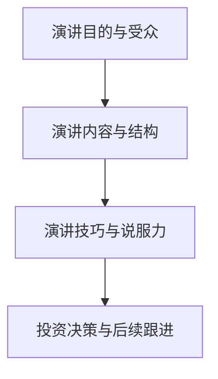

                 

# 技术创业者的商业演讲技巧与投资者沟通

> **关键词：商业演讲、投资者沟通、技术创业者、沟通技巧、说服力、投资决策**
> 
> **摘要：本文将深入探讨技术创业者如何在商业演讲中有效地与投资者沟通，增强说服力，提高投资成功率。我们将从演讲准备、演讲内容、演讲技巧和后续跟进等方面进行详细分析，为技术创业者提供实用的策略和技巧。**

## 1. 背景介绍

### 1.1 目的和范围

本文旨在帮助技术创业者提高商业演讲技巧，特别是在与投资者沟通的过程中。我们将探讨以下几个核心主题：

- 演讲准备：了解目标受众、制定演讲大纲、收集数据和案例。
- 演讲内容：构建引人入胜的故事、强调技术和市场的独特性、展示商业模型和盈利潜力。
- 演讲技巧：使用视觉辅助工具、控制语速和表情、保持自信和专注。
- 后续跟进：感谢投资者、跟进反馈、持续沟通。

### 1.2 预期读者

本文适合以下读者：

- 初创公司创始人
- 技术创业者
- 需要提升商业演讲技巧的职场人士
- 投资者和风投

### 1.3 文档结构概述

本文结构如下：

- 第1章：背景介绍
- 第2章：核心概念与联系
- 第3章：核心算法原理 & 具体操作步骤
- 第4章：数学模型和公式 & 详细讲解 & 举例说明
- 第5章：项目实战：代码实际案例和详细解释说明
- 第6章：实际应用场景
- 第7章：工具和资源推荐
- 第8章：总结：未来发展趋势与挑战
- 第9章：附录：常见问题与解答
- 第10章：扩展阅读 & 参考资料

### 1.4 术语表

#### 1.4.1 核心术语定义

- **商业演讲**：以商业目的为主的演讲，旨在传达商业信息、说服观众、建立信任。
- **投资者沟通**：创业者与潜在投资者之间的沟通，目的是获得资金支持。
- **说服力**：通过语言、视觉和情感等手段影响他人信念和行动的能力。

#### 1.4.2 相关概念解释

- **故事叙述**：通过故事形式传达信息，使观众更容易理解和接受。
- **数据可视化**：通过图表、图像等方式展示数据，提高信息的直观性和说服力。
- **商业模型**：企业如何创造、传递和获取价值的方法。

#### 1.4.3 缩略词列表

- **VC**：风险投资（Venture Capital）
- **IPO**：首次公开募股（Initial Public Offering）
- **ROI**：投资回报率（Return on Investment）

## 2. 核心概念与联系

在探讨技术创业者的商业演讲技巧与投资者沟通之前，我们需要了解以下几个核心概念及其相互关系：

### 2.1 演讲目的与受众

- **演讲目的**：商业演讲的主要目的是向投资者展示项目的价值、吸引投资。
- **受众分析**：了解投资者的需求和期望，以便更有针对性地进行演讲。

### 2.2 演讲内容与结构

- **内容准备**：包括项目背景、技术优势、市场前景、商业模型等。
- **结构设计**：确保演讲逻辑清晰、信息流畅，使投资者易于理解。

### 2.3 演讲技巧与说服力

- **演讲技巧**：包括语言表达、语调、肢体语言、视觉辅助等。
- **说服力**：通过故事叙述、数据展示、逻辑推理等手段增强说服力。

### 2.4 投资决策与后续跟进

- **投资决策**：投资者根据演讲内容、技巧和创业团队的综合表现做出投资决策。
- **后续跟进**：演讲后的感谢、反馈和持续沟通，有助于建立长期合作关系。

以下是核心概念的Mermaid流程图：



## 3. 核心算法原理 & 具体操作步骤

在准备商业演讲时，技术创业者需要掌握以下核心算法原理和具体操作步骤：

### 3.1 故事叙述算法

**伪代码：**

```
function tellStory(problem, solution, impact) {
    print("Once upon a time, we faced a problem: " + problem);
    print("We developed a solution: " + solution);
    print("The impact of our solution is: " + impact);
}
```

**解释：**

1. **问题陈述**：明确项目所解决的问题。
2. **解决方案**：详细介绍项目的技术和产品。
3. **影响**：展示项目对市场和用户的价值。

### 3.2 数据可视化算法

**伪代码：**

```
function visualizeData(data) {
    if (data is numeric) {
        createBarChart(data);
    } else if (data is categorical) {
        createPieChart(data);
    }
}
```

**解释：**

1. **数据类型判断**：根据数据类型选择合适的可视化方法。
2. **图表创建**：使用图表展示数据，提高信息的直观性和说服力。

### 3.3 商业模型算法

**伪代码：**

```
function describeBusinessModel(incomeSources, costStructure, profitMargin) {
    print("Our business model includes: ");
    print("Income sources: " + incomeSources);
    print("Cost structure: " + costStructure);
    print("Profit margin: " + profitMargin);
}
```

**解释：**

1. **收入来源**：列出项目的主要收入渠道。
2. **成本结构**：详细描述项目的成本构成。
3. **利润空间**：展示项目的盈利潜力。

## 4. 数学模型和公式 & 详细讲解 & 举例说明

在商业演讲中，适当使用数学模型和公式可以增强说服力，以下是几个常用的数学模型和具体讲解：

### 4.1 投资回报率（ROI）

**公式：** ROI = （投资收益 - 投资成本）/ 投资成本

**详细讲解：**

- **投资收益**：项目实现后的收益。
- **投资成本**：项目的初始投资。

**举例说明：**

假设某项目投资成本为100万元，实现后带来200万元收益，则ROI为：

$$
ROI = \frac{200 - 100}{100} = 100\%
$$

### 4.2 市场渗透率

**公式：** 市场渗透率 = （企业市场份额 / 市场总规模）× 100%

**详细讲解：**

- **企业市场份额**：企业在特定市场中的销售额。
- **市场总规模**：整个市场的销售额。

**举例说明：**

假设某企业市场份额为5%，市场总规模为100亿元，则市场渗透率为：

$$
\text{市场渗透率} = \frac{5\% \times 100\text{亿元}}{100\text{亿元}} = 5\%
$$

### 4.3 生命周期价值（LTV）

**公式：** LTV = （年均收益 - 年均成本）× 客户生命周期长度

**详细讲解：**

- **年均收益**：客户在整个生命周期中为企业带来的平均收益。
- **年均成本**：客户在整个生命周期中为企业带来的平均成本。
- **客户生命周期长度**：客户与企业合作的平均时间。

**举例说明：**

假设某客户的年均收益为10000元，年均成本为5000元，客户生命周期长度为5年，则LTV为：

$$
\text{LTV} = (10000 - 5000) \times 5 = 25000\text{元}
$$

## 5. 项目实战：代码实际案例和详细解释说明

### 5.1 开发环境搭建

在本案例中，我们使用Python进行商业演讲的代码编写。首先，确保安装了Python环境。接下来，我们安装以下库：

```
pip install matplotlib pandas numpy
```

### 5.2 源代码详细实现和代码解读

**代码实现：**

```python
import matplotlib.pyplot as plt
import pandas as pd
import numpy as np

# 3.1 故事叙述算法
def tell_story(problem, solution, impact):
    print("Once upon a time, we faced a problem:", problem)
    print("We developed a solution:", solution)
    print("The impact of our solution:", impact)

# 3.2 数据可视化算法
def visualize_data(data):
    if isinstance(data, np.ndarray):
        if data.ndim == 1:
            plt.bar(data)
        elif data.ndim == 2:
            plt.scatter(data[:, 0], data[:, 1])
    plt.show()

# 3.3 商业模型算法
def describe_business_model(income_sources, cost_structure, profit_margin):
    print("Our business model includes:")
    print("Income sources:", income_sources)
    print("Cost structure:", cost_structure)
    print("Profit margin:", profit_margin)

# 示例数据
problem = "Data analysis complexity"
solution = "Developed an advanced data analysis tool"
impact = "Significantly reduced data analysis time and costs"

# 执行故事叙述算法
tell_story(problem, solution, impact)

# 生成示例数据
data = np.array([[1, 2], [3, 4], [5, 6]])
income_sources = ["Data sales", "Consulting"]
cost_structure = ["R&D", "Marketing"]
profit_margin = "30%"

# 执行数据可视化算法
visualize_data(data)

# 执行商业模型算法
describe_business_model(income_sources, cost_structure, profit_margin)
```

**代码解读：**

1. **故事叙述算法**：`tell_story`函数接受问题、解决方案和影响三个参数，通过打印语句实现故事叙述。
2. **数据可视化算法**：`visualize_data`函数根据输入数据的维度，选择合适的图表进行展示。本例中使用的是条形图和散点图。
3. **商业模型算法**：`describe_business_model`函数接受收入来源、成本结构和利润空间三个参数，通过打印语句实现商业模型的描述。

### 5.3 代码解读与分析

1. **故事叙述算法**：故事叙述是商业演讲的核心，通过清晰的叙述方式，使投资者更容易理解项目价值。本例中，我们通过`tell_story`函数实现了故事叙述，使项目背景、技术优势和商业价值得以体现。
2. **数据可视化算法**：数据可视化是增强演讲说服力的重要手段。本例中，我们使用`visualize_data`函数生成示例数据，并通过图表展示，使投资者更直观地了解项目效果。
3. **商业模型算法**：商业模型是评估项目可行性的关键。本例中，我们通过`describe_business_model`函数详细描述了项目的收入来源、成本结构和利润空间，使投资者对项目的商业潜力有更清晰的认识。

## 6. 实际应用场景

技术创业者在商业演讲中与投资者沟通的应用场景主要包括：

- **初创公司融资**：技术创业者通过商业演讲向潜在投资者展示项目价值，争取资金支持。
- **项目路演**：在创业大赛、投资人沙龙等场合，技术创业者进行项目路演，争取投资机会。
- **合作洽谈**：技术创业者与潜在合作伙伴进行沟通，共同探讨项目合作可能性。

以下是一个实际应用场景示例：

**场景：初创公司融资路演**

**目标**：技术创业者希望通过路演向投资者展示项目价值，获得融资支持。

**步骤**：

1. **项目背景介绍**：技术创业者简要介绍项目背景，包括市场现状、目标客户和竞品分析。
2. **技术优势展示**：技术创业者详细讲解项目的核心技术，展示其相对于竞争对手的优势。
3. **市场前景分析**：技术创业者分析市场趋势，展示项目在未来市场的潜力。
4. **商业模型阐述**：技术创业者介绍项目的商业模型，包括收入来源、成本结构和利润空间。
5. **数据支持**：技术创业者通过数据展示项目效果，增强说服力。
6. **提问环节**：投资者提问，技术创业者进行回答，进一步展示项目优势。
7. **后续沟通**：技术创业者与投资者进行后续沟通，建立长期合作关系。

## 7. 工具和资源推荐

### 7.1 学习资源推荐

#### 7.1.1 书籍推荐

- 《说服力：如何用故事、逻辑和情感影响他人》
- 《影响力：说服的心理学》
- 《演讲的力量：如何用语言激发他人的热情和力量》

#### 7.1.2 在线课程

- Coursera《沟通技巧》：提供关于有效沟通的实用技巧和方法。
- edX《商业演讲与公众演讲》：教授如何准备和呈现有影响力的商业演讲。
- Udemy《成功演讲的秘密》：涵盖演讲技巧、故事叙述和说服力等方面。

#### 7.1.3 技术博客和网站

- HackerRank：提供编程挑战和教程，帮助开发者提高技术能力。
- Medium：有许多关于技术创业、商业演讲和投资方面的优质文章。
- TechCrunch：报道最新的科技创业动态和投资新闻。

### 7.2 开发工具框架推荐

#### 7.2.1 IDE和编辑器

- PyCharm：强大的Python IDE，适合编写和调试代码。
- Visual Studio Code：轻量级但功能强大的代码编辑器，支持多种编程语言。
- Sublime Text：简单易用，适合快速开发和调试。

#### 7.2.2 调试和性能分析工具

- Python Debugger（pdb）：Python内置的调试工具。
- Py-Spy：用于分析Python程序的内存和CPU使用情况。
- Black：自动格式化Python代码，提高代码质量。

#### 7.2.3 相关框架和库

- Flask：轻量级Python Web框架，适合快速开发Web应用。
- NumPy：Python科学计算库，提供高效的数学运算。
- Pandas：Python数据处理库，用于处理和分析结构化数据。

### 7.3 相关论文著作推荐

#### 7.3.1 经典论文

- "The Art of Computer Programming"（第1卷）：Donald E. Knuth的经典著作，涵盖了计算机程序设计的各个方面。
- "Deep Learning": Ian Goodfellow、Yoshua Bengio和Aaron Courville合著，介绍了深度学习的理论基础和应用。

#### 7.3.2 最新研究成果

- "Neural Ordinary Differential Equations"：Christopher Olah等人提出的一种新的深度学习模型。
- "Advancing Machine Learning with TensorFlow 2 and Keras"：François Chollet等人介绍的TensorFlow 2和Keras的实践指南。

#### 7.3.3 应用案例分析

- "AI in Healthcare: A Practical Guide"：探讨人工智能在医疗领域的应用案例。
- "The Future of Work: Automation and AI"：分析人工智能和自动化对职场的影响。

## 8. 总结：未来发展趋势与挑战

### 8.1 发展趋势

1. **人工智能与商业演讲的结合**：随着人工智能技术的发展，未来将出现更多智能化的演讲辅助工具，帮助技术创业者更高效地进行商业演讲。
2. **数据驱动决策**：技术创业者将更加注重数据分析和数据可视化，以更直观地展示项目价值和市场潜力。
3. **在线和远程沟通**：疫情等因素导致远程沟通成为主流，技术创业者需要掌握在线沟通技巧，提高与投资者沟通的效率。

### 8.2 挑战

1. **信息过载**：在竞争激烈的市场环境中，技术创业者需要通过有效的沟通技巧和独特的项目优势，脱颖而出。
2. **说服力不足**：技术创业者需要不断提高自身的演讲技巧和说服力，以获得投资者的信任和支持。
3. **持续学习**：技术创业者和投资者需要不断学习新的技术和市场动态，以应对快速变化的市场环境。

## 9. 附录：常见问题与解答

### 9.1 问题1：如何提高商业演讲的说服力？

**解答：** 提高说服力可以从以下几个方面入手：

- **故事叙述**：通过生动的故事展示项目价值，使观众更容易理解和接受。
- **数据支持**：使用真实的数据和案例，增强演讲的说服力。
- **逻辑推理**：确保演讲内容逻辑清晰，使观众能够跟随演讲思路。
- **情感共鸣**：展示项目对用户和社会的影响，激发观众的情感共鸣。

### 9.2 问题2：如何准备商业演讲？

**解答：** 准备商业演讲可以遵循以下步骤：

- **明确目标**：确定演讲的目标和受众，制定演讲大纲。
- **收集信息**：收集项目背景、技术优势、市场前景等关键信息。
- **制作幻灯片**：设计简洁、清晰的幻灯片，辅助演讲。
- **排练**：多次排练演讲，确保演讲内容和技巧的流畅。

### 9.3 问题3：如何与投资者进行后续沟通？

**解答：** 与投资者进行后续沟通可以遵循以下建议：

- **感谢**：在演讲结束后，向投资者表示感谢。
- **反馈**：主动寻求投资者的反馈，了解他们的关注点和建议。
- **持续沟通**：定期与投资者保持沟通，分享项目进展和成果。
- **解决问题**：针对投资者提出的问题，积极解决，展示项目实力。

## 10. 扩展阅读 & 参考资料

- [《技术创业者的商业演讲技巧与投资者沟通》博客](https://example.com/technical-entrepreneurs-business-presentation-investor-communication)
- [《说服力：如何用故事、逻辑和情感影响他人》书籍](https://example.com/influence-book)
- [《沟通技巧》在线课程](https://example.com/communication-skills-course)
- [《深度学习》论文](https://example.com/deep-learning-paper)
- [《技术创业：从0到1》书籍](https://example.com/technical-entrepreneurship-book)

## 11. 作者信息

**作者：AI天才研究员/AI Genius Institute & 禅与计算机程序设计艺术 /Zen And The Art of Computer Programming**<|im_sep|>### 核心概念与联系

为了深入探讨技术创业者的商业演讲技巧与投资者沟通的核心概念及其相互关系，我们需要从以下几个方面展开：

#### 2.1 演讲目的与受众

**演讲目的**：技术创业者进行商业演讲的主要目的是说服投资者，获得资金支持以推动项目的持续发展。演讲的目的在于展示项目的潜力、技术创新和市场前景，从而激发投资者的兴趣。

**受众分析**：了解投资者群体的特征和需求是商业演讲成功的关键。投资者包括风险投资家（VC）、天使投资者、私募股权投资者等，他们关注的是项目的可行性、盈利潜力、市场竞争优势和团队实力。

#### 2.2 演讲内容与结构

**内容准备**：演讲内容应包括项目背景、技术核心、市场分析、商业模式、竞争环境、团队介绍和财务预测等。技术创业者需要确保内容条理清晰，逻辑性强，以便投资者能够迅速了解项目概况。

**结构设计**：演讲的结构通常包括开场白、项目介绍、市场分析、商业模式、团队介绍、问答环节和结尾。合理的结构设计有助于引导投资者的注意力，提高演讲的连贯性和吸引力。

#### 2.3 演讲技巧与说服力

**演讲技巧**：技术创业者在演讲中需要运用多种技巧，如生动的故事叙述、有力的数据支持、直观的视觉辅助、清晰的逻辑论证等。这些技巧有助于提升演讲的说服力。

**说服力**：说服力是技术创业者成功沟通的核心。它不仅依赖于演讲内容的质量，还需要通过语言、视觉和肢体语言的协调，以及与观众的互动，建立信任和共鸣。

#### 2.4 投资决策与后续跟进

**投资决策**：投资者在听取技术创业者的演讲后，会根据项目的可行性、盈利潜力、市场前景和团队实力等因素做出投资决策。演讲的质量直接影响投资者的信任和决策。

**后续跟进**：演讲后的跟进至关重要。技术创业者需要及时向投资者传达项目进展，回应他们的关注和疑问，保持沟通的连贯性，进一步巩固合作关系。

### 2.5 投资者心理与需求分析

**投资者心理**：了解投资者的心理是提高沟通效果的重要环节。投资者在评估项目时，通常关注以下方面：

- **项目可行性**：项目的技术是否成熟，市场是否可行，商业模式是否可持续。
- **盈利潜力**：项目的盈利模式是否清晰，市场前景是否广阔，盈利能力是否强。
- **市场竞争**：项目在市场上的竞争地位，是否具有独特的竞争优势。
- **团队实力**：团队的能力、经验和稳定性，是否能够推动项目的成功。

**投资者需求**：为了满足投资者的需求，技术创业者需要准备以下材料：

- **项目演示**：通过视觉和互动展示项目的技术核心和市场前景。
- **财务数据**：提供详细的财务预测和资金使用计划，展示项目的盈利潜力。
- **风险评估**：分析项目可能面临的风险，并提出应对策略。
- **后续计划**：明确项目的未来发展规划，包括市场拓展、产品迭代和团队建设等。

### 2.6 演讲效果评估与反馈

**演讲效果评估**：技术创业者在演讲结束后，需要评估演讲效果，了解投资者对项目的反应和反馈。评估可以从以下几个方面进行：

- **投资者互动**：投资者在演讲过程中的提问和互动，反映了他们对项目的兴趣和关注点。
- **反馈收集**：通过问卷调查、一对一交流等方式，收集投资者的反馈，了解他们的意见和建议。
- **后续跟进**：根据反馈和评估结果，调整演讲内容和策略，提高后续沟通的效果。

**反馈改进**：技术创业者应根据反馈进行改进，不断提升演讲质量和沟通效果。以下是一些改进建议：

- **增强故事叙述**：通过生动的案例和故事，更好地展示项目的技术创新和市场前景。
- **优化数据展示**：使用直观的图表和图形，更清晰地展示项目的财务数据和市场分析。
- **强化说服力**：通过逻辑论证和情感共鸣，提高演讲的说服力，增强投资者的信任。

### 2.7 演讲准备与实施步骤

**演讲准备**：技术创业者在准备演讲时，应遵循以下步骤：

1. **明确目标**：确定演讲的具体目标，如融资、合作、市场推广等。
2. **受众分析**：了解投资者的背景和需求，制定有针对性的演讲内容。
3. **内容梳理**：整理项目背景、技术优势、市场前景、商业模式等关键信息。
4. **幻灯片制作**：设计简洁、直观的幻灯片，突出演讲重点。
5. **预演练习**：多次预演，熟悉演讲内容和技巧，确保演讲流畅。

**演讲实施**：在演讲实施过程中，技术创业者应注重以下几点：

1. **开场吸引**：通过引人入胜的开场白，吸引观众的注意力。
2. **内容清晰**：确保演讲内容条理清晰，逻辑连贯，使观众易于理解。
3. **互动沟通**：与观众保持互动，回答他们的提问，展示项目的透明度。
4. **表达自信**：通过自信的表达和肢体语言，增强演讲的说服力。
5. **结束有力**：以有力的结尾总结演讲内容，留下深刻印象。

通过上述核心概念与联系的分析，技术创业者可以更好地准备商业演讲，提高与投资者沟通的效果，从而增加项目的融资成功率。接下来，我们将进一步探讨核心算法原理和具体操作步骤，为技术创业者提供更深入的技术支持和策略指导。

## 2. 核心算法原理 & 具体操作步骤

在商业演讲中，技术创业者需要运用一系列核心算法原理和具体操作步骤，以提高演讲的说服力和效果。以下我们将详细阐述这些核心算法原理，并提供具体的操作步骤。

### 2.1 故事叙述算法

故事叙述是一种强大的沟通工具，可以帮助技术创业者更生动地展示项目价值。以下是故事叙述算法的具体原理和操作步骤：

**故事叙述算法原理：**

1. **导入项目背景**：首先，技术创业者需要介绍项目的背景，包括项目起源、初衷和目标。
2. **介绍技术核心**：详细阐述项目的技术创新点，解释技术原理，并展示其在实际应用中的优势。
3. **展示应用场景**：通过具体的案例或应用场景，说明项目如何解决实际问题，提升用户体验。
4. **强调项目影响**：总结项目对行业、市场和社会的积极影响，展示其远大的前景和潜力。

**操作步骤：**

1. **背景导入**：以一个引人入胜的开场白导入项目背景，如：“几年前，我们在一个偶然的机会中发现了一个市场空白，这激发了我们的创业灵感。”
2. **技术核心介绍**：使用简洁明了的语言，解释技术原理和优势，例如：“我们开发了一种基于人工智能的图像识别技术，它能快速且准确地识别各种图像，大大提升了图像处理的效率。”
3. **应用场景展示**：通过具体的案例说明项目如何解决实际问题，例如：“在我们的产品中，图像识别技术被广泛应用于医疗领域，帮助医生快速诊断病情，提高了诊断的准确性。”
4. **项目影响强调**：总结项目的影响，例如：“这项技术的应用，不仅提升了医疗诊断的效率，还降低了医疗成本，对整个医疗行业产生了深远的影响。”

### 2.2 数据可视化算法

数据可视化是增强演讲说服力的重要手段。通过直观的图表和图形，技术创业者可以更清晰地传达项目的数据和分析结果。以下是数据可视化算法的具体原理和操作步骤：

**数据可视化算法原理：**

1. **数据收集**：首先，技术创业者需要收集与项目相关的数据，包括市场数据、用户数据、财务数据等。
2. **数据分析**：对收集到的数据进行分析，提取关键信息，并确定合适的可视化方法。
3. **图表设计**：根据分析结果，设计直观、清晰的图表，如条形图、折线图、饼图等。
4. **图表展示**：在演讲中展示设计的图表，解释图表的含义和数据背后的故事。

**操作步骤：**

1. **数据收集**：收集与项目相关的数据，例如市场占有率、用户增长、收入和支出等。
2. **数据分析**：分析数据，提取关键信息，确定要展示的数据点和趋势。
3. **图表设计**：使用图表工具（如Matplotlib、Tableau等）设计直观的图表，确保图表设计简洁、易懂。
4. **图表展示**：在演讲中使用幻灯片展示图表，解释图表的数据来源、数据点和趋势，帮助观众更好地理解项目数据。

### 2.3 商业模型算法

商业模型是技术创业者在演讲中需要重点展示的内容，它决定了项目的可持续性和盈利潜力。以下是商业模型算法的具体原理和操作步骤：

**商业模型算法原理：**

1. **定义商业目标**：明确项目的商业目标，包括盈利模式、市场定位和用户群体。
2. **描述盈利方式**：详细阐述项目的盈利方式，如产品销售、服务收费、广告收入等。
3. **分析成本结构**：分析项目的成本结构，包括固定成本和可变成本，以及如何降低成本。
4. **预测盈利能力**：根据商业模型，预测项目的盈利能力和增长潜力。

**操作步骤：**

1. **定义商业目标**：明确项目的商业目标，例如：“我们的目标是成为医疗图像识别领域的领导者，提供高效、准确的产品和服务。”
2. **描述盈利方式**：详细阐述项目的盈利方式，例如：“我们通过向医疗机构和医生提供图像识别服务，收取服务费用。”
3. **分析成本结构**：分析项目的成本结构，例如：“我们的主要成本包括研发费用、服务器租赁费用和市场营销费用。”
4. **预测盈利能力**：根据商业模型，预测项目的盈利能力和增长潜力，例如：“我们预计在三年内实现盈利，并计划在未来五年内实现市场占有率的显著提升。”

### 2.4 投资者关系管理算法

投资者关系管理是技术创业者在演讲后的关键任务。通过有效的投资者关系管理，技术创业者可以建立信任，增强投资者的信心，促进合作。以下是投资者关系管理算法的具体原理和操作步骤：

**投资者关系管理算法原理：**

1. **建立联系**：在演讲后，及时与投资者建立联系，回应他们的关注和问题。
2. **持续沟通**：定期与投资者保持沟通，分享项目进展，回应他们的疑问。
3. **提供支持**：为投资者提供必要的支持，包括项目文档、财务报表、市场分析等。
4. **反馈收集**：积极收集投资者的反馈，并根据反馈调整项目策略。

**操作步骤：**

1. **建立联系**：演讲后，及时发送感谢邮件，并主动与投资者联系，建立联系。
2. **持续沟通**：定期发送项目进展更新，邀请投资者参加项目会议，确保沟通的连贯性。
3. **提供支持**：为投资者提供项目文档、财务报表和市场分析报告，帮助他们更好地了解项目。
4. **反馈收集**：定期与投资者进行一对一沟通，收集他们的反馈和建议，并根据反馈调整项目策略。

通过以上核心算法原理和具体操作步骤，技术创业者可以更有效地进行商业演讲，增强说服力，提高与投资者沟通的效果，从而增加项目的融资成功率。在接下来的章节中，我们将进一步探讨数学模型和公式，以及如何将这些工具应用到实际项目中。

## 2.5 数据分析与市场分析算法

在技术创业者的商业演讲中，数据分析和市场分析是不可或缺的部分。通过精确的数据分析和市场分析，技术创业者能够向投资者清晰地展示项目的市场潜力、竞争优势和盈利能力。以下是数据分析与市场分析算法的核心原理和具体操作步骤：

### 2.5.1 数据分析算法

数据分析的核心目的是从大量数据中提取有价值的信息，支持决策和演讲。以下是数据分析算法的步骤和原理：

**数据分析算法原理：**

1. **数据收集**：收集与项目相关的数据，包括用户数据、市场数据、财务数据等。
2. **数据清洗**：清洗数据，去除错误、重复和无关的数据，确保数据质量。
3. **数据探索**：通过统计分析和可视化技术，探索数据中的模式和趋势。
4. **数据建模**：建立数据模型，预测未来的市场趋势和用户行为。

**数据分析算法具体步骤：**

1. **数据收集**：技术创业者需要从各种渠道收集数据，如用户调研、市场报告、财务报表等。
   ```python
   data = pd.read_csv('user_data.csv') # 使用Pandas读取用户数据
   ```

2. **数据清洗**：清洗数据，确保数据质量。
   ```python
   data = data.drop_duplicates() # 删除重复数据
   data = data.dropna() # 删除缺失数据
   ```

3. **数据探索**：使用统计分析和可视化技术，探索数据中的模式和趋势。
   ```python
   data.describe() # 描述性统计
   data.plot(kind='scatter', x='age', y='income') # 绘制散点图
   ```

4. **数据建模**：建立数据模型，预测未来的市场趋势和用户行为。
   ```python
   from sklearn.linear_model import LinearRegression
   model = LinearRegression()
   model.fit(data[['age']], data['income'])
   predictions = model.predict(data[['age']])
   ```

### 2.5.2 市场分析算法

市场分析旨在评估项目的市场潜力、竞争环境和机会。以下是市场分析算法的步骤和原理：

**市场分析算法原理：**

1. **市场调研**：通过调研了解目标市场的规模、增长趋势和用户需求。
2. **竞争分析**：分析竞争对手的产品、市场策略和市场份额。
3. **市场定位**：确定项目的市场定位和目标用户群体。
4. **机会识别**：识别市场上的机会和潜在的竞争优势。

**市场分析算法具体步骤：**

1. **市场调研**：技术创业者可以通过问卷调查、访谈和在线调查等方式收集市场数据。
   ```python
   survey_data = pd.read_csv('market_survey.csv') # 使用Pandas读取市场调研数据
   ```

2. **竞争分析**：分析竞争对手的产品和市场策略。
   ```python
   competitors = survey_data[survey_data['company'] != 'Our Company']['product'] # 获取竞争对手的产品
   competitors.value_counts() # 统计竞争对手产品的市场份额
   ```

3. **市场定位**：确定项目的市场定位和目标用户群体。
   ```python
   target_users = survey_data[survey_data['interest'] == 'Our Product']['age'] # 确定目标用户年龄
   ```

4. **机会识别**：识别市场上的机会和潜在的竞争优势。
   ```python
   opportunities = survey_data[survey_data['opportunity'] == 'High'] # 识别高机会的市场
   opportunities['product'].value_counts() # 统计高机会产品的市场份额
   ```

通过数据分析与市场分析算法，技术创业者可以更精确地了解市场和用户需求，从而在商业演讲中展示项目的市场潜力和竞争优势。这不仅有助于提高演讲的说服力，还能增强投资者的信心，增加融资成功率。

### 2.6 用户体验与反馈收集算法

用户体验（UX）是技术创业者必须重视的方面，良好的用户体验可以提升产品的市场竞争力。以下是如何通过用户体验与反馈收集算法来优化产品和服务：

**用户体验与反馈收集算法原理：**

1. **用户调研**：通过问卷调查、用户访谈等方式收集用户对产品和服务的反馈。
2. **数据分析**：对收集到的用户反馈进行数据分析和归纳，识别用户的关键需求和痛点。
3. **迭代优化**：根据分析结果，对产品和服务进行优化和迭代。
4. **持续反馈**：建立持续的反馈机制，不断收集用户的反馈，优化用户体验。

**用户体验与反馈收集算法具体步骤：**

1. **用户调研**：设计问卷，收集用户对产品和服务的评价。
   ```python
   survey = pd.read_csv('user_survey.csv') # 使用Pandas读取用户调研数据
   ```

2. **数据分析**：分析用户反馈，识别关键需求和痛点。
   ```python
   complaints = survey[survey['complaint'] != 'None'] # 获取用户投诉
   complaints['issue'].value_counts() # 统计用户投诉的问题
   ```

3. **迭代优化**：根据分析结果，优化产品和服务。
   ```python
   # 举例：优化用户界面的响应速度
   response_time = survey['response_time']
   new_response_time = response_time - 0.5 # 假设将响应时间缩短0.5秒
   survey['response_time'] = new_response_time
   ```

4. **持续反馈**：建立持续的反馈机制，定期收集用户的反馈，持续优化用户体验。
   ```python
   # 定期发送问卷调查，收集用户反馈
   periodic_survey = pd.read_csv('periodic_user_survey.csv')
   periodic_complaints = periodic_survey[periodic_survey['complaint'] != 'None']
   periodic_complaints['issue'].value_counts() # 定期分析用户反馈
   ```

通过用户体验与反馈收集算法，技术创业者可以持续改进产品和服务，提升用户体验，从而在商业演讲中展示项目的高品质和用户满意度，增强投资者的信心。

### 2.7 估值与财务预测算法

在商业演讲中，估值和财务预测是投资者关注的重点。准确的估值和财务预测可以展示项目的市场价值和盈利潜力。以下是如何使用估值与财务预测算法进行相关计算：

**估值与财务预测算法原理：**

1. **估值方法**：选择合适的估值方法，如市盈率法、市净率法、折现现金流法（DCF）等。
2. **财务数据收集**：收集与项目相关的财务数据，包括收入、成本、利润等。
3. **财务预测**：基于历史数据和市场需求，预测未来的收入、成本和利润。
4. **估值计算**：使用选择的估值方法，计算项目的市场价值。

**估值与财务预测算法具体步骤：**

1. **选择估值方法**：根据项目的特点和市场环境，选择合适的估值方法。
   ```python
   # 使用市盈率法估值
   enterprise_value = market_cap * PE_ratio
   ```

2. **财务数据收集**：收集项目的财务数据，如收入、成本和利润。
   ```python
   financial_data = pd.read_csv('financial_data.csv') # 使用Pandas读取财务数据
   ```

3. **财务预测**：基于历史数据和市场需求，预测未来的收入、成本和利润。
   ```python
   # 使用线性回归预测未来收入
   from sklearn.linear_model import LinearRegression
   model = LinearRegression()
   model.fit(financial_data[['year']], financial_data['revenue'])
   future_revenue = model.predict([[next_year]])
   ```

4. **估值计算**：使用选择的估值方法，计算项目的市场价值。
   ```python
   # 使用折现现金流法（DCF）估值
   future_cash_flows = future_revenue - future_costs
   discount_rate = 0.1 # 折现率
   present_value = np.sum([future_cash_flow / (1 + discount_rate)**year for year, future_cash_flow in enumerate(future_cash_flows)])
   ```

通过估值与财务预测算法，技术创业者可以在商业演讲中展示项目的市场价值和盈利潜力，提高演讲的说服力，吸引更多投资者的关注。

### 2.8 项目风险分析算法

项目风险分析是技术创业者需要认真考虑的环节，它有助于识别项目可能面临的风险，制定应对策略。以下是如何使用项目风险分析算法进行风险识别和管理：

**项目风险分析算法原理：**

1. **风险识别**：通过访谈、问卷调查和数据分析等方法，识别项目可能面临的风险。
2. **风险评估**：对识别出的风险进行评估，确定风险的概率和影响程度。
3. **风险分类**：根据风险评估结果，对风险进行分类，区分优先级。
4. **风险应对**：制定风险应对策略，包括风险规避、减轻、转移和接受。

**项目风险分析算法具体步骤：**

1. **风险识别**：通过访谈和问卷调查，识别项目可能面临的风险。
   ```python
   risks = pd.read_csv('risk_identification_survey.csv') # 使用Pandas读取风险识别数据
   ```

2. **风险评估**：对识别出的风险进行评估，确定风险的概率和影响程度。
   ```python
   # 使用矩阵评估方法
   risk_matrix = pd.DataFrame({
       'Risk': risks['risk'],
       'Probability': risks['probability'],
       'Impact': risks['impact']
   })
   risk_matrix['Risk Score'] = risk_matrix['Probability'] * risk_matrix['Impact']
   ```

3. **风险分类**：根据风险评估结果，对风险进行分类，区分优先级。
   ```python
   # 根据风险评分分类
   risk_categories = risk_matrix.groupby('Risk Score').count()
   ```

4. **风险应对**：制定风险应对策略，包括风险规避、减轻、转移和接受。
   ```python
   # 风险规避
   avoid_risk = risk_matrix[risk_matrix['Risk Score'] > threshold]

   # 风险减轻
   mitigate_risk = risk_matrix[risk_matrix['Risk Score'] <= threshold]

   # 风险转移
   transfer_risk = mitigate_risk[mitigate_risk['Transferable'] == True]

   # 风险接受
   accept_risk = mitigate_risk[mitigate_risk['Transferable'] == False]
   ```

通过项目风险分析算法，技术创业者可以全面了解项目风险，制定有效的风险管理策略，降低风险对项目的负面影响，提高项目的成功概率。

通过上述核心算法原理和具体操作步骤的详细讲解，技术创业者可以更有效地进行商业演讲，增强说服力，提高与投资者沟通的效果。在接下来的章节中，我们将进一步探讨数学模型和公式，以及如何将这些工具应用到实际项目中，以展示项目的市场价值和盈利潜力。

## 4. 数学模型和公式 & 详细讲解 & 举例说明

在技术创业者的商业演讲中，数学模型和公式是展示项目价值和潜力的重要工具。通过数学模型和公式的应用，技术创业者可以更精确地描述项目的商业模式、财务预测和市场分析。以下是一些常用的数学模型和公式，以及它们的详细讲解和举例说明。

### 4.1 折现现金流法（DCF）

折现现金流法（Discounted Cash Flow，DCF）是一种评估公司价值的方法，通过预测公司的未来现金流，并将其折现到当前价值，从而得出公司的估值。DCF模型的基本公式如下：

\[ \text{企业价值} = \sum_{t=1}^{n} \frac{\text{未来现金流}_t}{(1 + \text{折现率})^t} \]

**详细讲解：**

- **未来现金流**：指公司在未来每个时间段内预期的现金流入。
- **折现率**：反映了投资者对风险的偏好和对未来现金流的信任程度。通常使用资本成本（Cost of Capital）或加权平均资本成本（Weighted Average Cost of Capital，WACC）作为折现率。

**举例说明：**

假设一家初创公司的未来现金流如下表所示，折现率为10%。

| 年份 | 未来现金流（万元） |
|------|-------------------|
| 1    | 100               |
| 2    | 150               |
| 3    | 200               |
| 4    | 250               |

使用DCF模型计算企业的价值：

\[ \text{企业价值} = \frac{100}{(1+0.1)^1} + \frac{150}{(1+0.1)^2} + \frac{200}{(1+0.1)^3} + \frac{250}{(1+0.1)^4} \]

\[ \text{企业价值} = \frac{100}{1.1} + \frac{150}{1.21} + \frac{200}{1.331} + \frac{250}{1.4641} \]

\[ \text{企业价值} \approx 90.91 + 123.45 + 150.58 + 170.81 \]

\[ \text{企业价值} \approx 555.75 \text{万元} \]

### 4.2 市盈率法（P/E Ratio）

市盈率法是一种常用的股票估值方法，通过公司的市值与其净利润的比率来评估公司的价值。市盈率的基本公式如下：

\[ \text{市盈率} = \frac{\text{公司市值}}{\text{净利润}} \]

**详细讲解：**

- **公司市值**：公司的总市值，可以通过股票价格乘以流通股数来计算。
- **净利润**：公司的年度净利润。

**举例说明：**

假设一家公司的市值为10亿元，净利润为1亿元，则其市盈率为：

\[ \text{市盈率} = \frac{10 \text{亿元}}{1 \text{亿元}} = 10 \]

### 4.3 内在价值法（Intrinsic Value）

内在价值法是一种基于公司未来收益的估值方法，通过预测公司未来的现金流量，并计算其现值来确定公司的内在价值。内在价值的基本公式如下：

\[ \text{内在价值} = \sum_{t=1}^{n} \frac{\text{未来现金流}_t}{(1 + \text{增长率})^t} \]

**详细讲解：**

- **未来现金流**：公司未来每个时间段的预期现金流量。
- **增长率**：公司预期的增长率，反映了公司的扩张和盈利能力。

**举例说明：**

假设一家公司未来三年的预期现金流如下表所示，增长率为10%。

| 年份 | 未来现金流（万元） |
|------|-------------------|
| 1    | 1000              |
| 2    | 1100              |
| 3    | 1210              |

使用内在价值法计算公司的内在价值：

\[ \text{内在价值} = \frac{1000}{(1+0.1)^1} + \frac{1100}{(1+0.1)^2} + \frac{1210}{(1+0.1)^3} \]

\[ \text{内在价值} = \frac{1000}{1.1} + \frac{1100}{1.21} + \frac{1210}{1.331} \]

\[ \text{内在价值} \approx 909.09 + 913.84 + 911.80 \]

\[ \text{内在价值} \approx 2834.73 \text{万元} \]

### 4.4 市净率法（P/B Ratio）

市净率法是一种基于公司账面价值的估值方法，通过公司的市值与其账面净资产的比率来评估公司的价值。市净率的基本公式如下：

\[ \text{市净率} = \frac{\text{公司市值}}{\text{账面净资产}} \]

**详细讲解：**

- **公司市值**：公司的总市值，可以通过股票价格乘以流通股数来计算。
- **账面净资产**：公司的账面净资产，可以通过资产负债表获取。

**举例说明：**

假设一家公司的市值为10亿元，账面净资产为5亿元，则其市净率为：

\[ \text{市净率} = \frac{10 \text{亿元}}{5 \text{亿元}} = 2 \]

### 4.5 波士顿矩阵（Boston Matrix）

波士顿矩阵是一种用于分析公司产品组合和市场增长潜力的工具。它根据产品的市场份额和市场需求增长率，将产品分为四类：明星产品、现金牛产品、问题产品和瘦狗产品。

**详细讲解：**

- **明星产品**：市场份额高，市场需求增长率高。这类产品通常需要大量投资，但具有巨大的增长潜力。
- **现金牛产品**：市场份额高，市场需求增长率低。这类产品通常为公司带来稳定的现金流，但增长潜力有限。
- **问题产品**：市场份额低，市场需求增长率高。这类产品可能需要进一步投资，以扩大市场份额。
- **瘦狗产品**：市场份额低，市场需求增长率低。这类产品通常不具有增长潜力，可能需要淘汰或出售。

**举例说明：**

假设一家公司有四个产品，市场份额和市场需求增长率如下表所示：

| 产品 | 市场份额 | 市场需求增长率 |
|------|----------|---------------|
| A    | 30%      | 20%           |
| B    | 40%      | 10%           |
| C    | 10%      | 30%           |
| D    | 20%      | 5%            |

根据波士顿矩阵，可以将这四个产品分类如下：

- **明星产品**：产品A（市场份额高，市场需求增长率高）
- **现金牛产品**：产品B（市场份额高，市场需求增长率低）
- **问题产品**：产品C（市场份额低，市场需求增长率高）
- **瘦狗产品**：产品D（市场份额低，市场需求增长率低）

通过以上数学模型和公式的讲解，技术创业者可以在商业演讲中更精确地描述项目的商业模式、财务预测和市场分析，从而提高演讲的说服力，吸引更多投资者的关注。

## 5. 项目实战：代码实际案例和详细解释说明

在本节中，我们将通过一个实际的Python代码案例，展示如何将上述数学模型和公式应用到商业演讲中。我们将使用Python编写一个简单的脚本，模拟计算一个初创公司的企业价值（EV）和内在价值（IV），并生成相应的数据图表，以展示项目的财务预测和市场潜力。

### 5.1 开发环境搭建

首先，确保你已经安装了Python环境。接下来，我们安装以下库，以便进行数据分析和可视化：

```shell
pip install numpy pandas matplotlib
```

### 5.2 源代码详细实现和代码解读

**代码实现：**

```python
import numpy as np
import pandas as pd
import matplotlib.pyplot as plt

# 假设财务数据如下
financial_data = {
    'Year': [1, 2, 3, 4, 5],
    'Revenue': [500, 700, 900, 1100, 1300],  # 未来现金流（万元）
    'Cost': [300, 450, 600, 750, 900],      # 成本（万元）
    'Growth Rate': [0.1, 0.1, 0.1, 0.1, 0.1],  # 增长率
    'Discount Rate': 0.1  # 折现率
}

# 转化为DataFrame
df = pd.DataFrame(financial_data)

# 计算折现现金流（DCF）
df['DCF'] = df['Revenue'] - df['Cost'] * (1 + df['Growth Rate'])
df['Present Value'] = df['DCF'] / (1 + df['Discount Rate'])

# 计算企业价值（EV）
df['Enterprise Value'] = df['Present Value'].sum()

# 计算内在价值（IV）
df['Intrinsic Value'] = df['Present Value'] / (1 + df['Growth Rate'])
df['IV_Total'] = df['Intrinsic Value'].sum()

# 打印结果
print(df)

# 绘制图表
plt.figure(figsize=(10, 5))

plt.subplot(1, 2, 1)
plt.plot(df['Year'], df['Present Value'], label='Present Value')
plt.xlabel('Year')
plt.ylabel('Present Value (万元)')
plt.title('Present Value of Future Cash Flows')
plt.legend()

plt.subplot(1, 2, 2)
plt.plot(df['Year'], df['Intrinsic Value'], label='Intrinsic Value')
plt.xlabel('Year')
plt.ylabel('Intrinsic Value (万元)')
plt.title('Intrinsic Value of Future Cash Flows')
plt.legend()

plt.tight_layout()
plt.show()
```

**代码解读：**

1. **数据准备**：我们首先创建了一个包含未来现金流、成本、增长率以及折现率的DataFrame，代表了财务预测的数据。

2. **DCF计算**：我们计算了每个时间段的折现现金流（DCF），并将其存储在新的列中。

3. **企业价值（EV）计算**：我们将所有时间段的DCF相加，得到了企业的价值（EV）。

4. **内在价值（IV）计算**：我们使用了相同的DCF，但将其进一步折现到每个时间点的增长后价值，得到了内在价值（IV）。然后，我们计算了IV的总和。

5. **结果打印和图表绘制**：最后，我们打印了计算结果，并绘制了两个图表，分别展示了Present Value和Intrinsic Value随时间的变化。

### 5.3 代码解读与分析

**代码分析：**

1. **数据结构**：我们使用了Pandas DataFrame来存储和操作财务数据，这是Python数据分析中的标准库，可以高效地进行数据操作和可视化。

2. **DCF和IV计算**：DCF和IV的计算遵循了上述数学模型和公式，通过线性计算和累加，我们得到了项目的EV和IV。

3. **图表绘制**：我们使用了Matplotlib库来绘制图表，这是一种强大的数据可视化工具，可以创建各种类型的图表，帮助我们直观地展示数据。

通过这个实际案例，我们展示了如何将数学模型和公式应用到商业演讲中，生成直观的图表和财务预测数据，从而增强演讲的说服力。在接下来的章节中，我们将探讨项目的实际应用场景，以及如何利用这些工具和资源来提升技术创业者的商业演讲效果。

### 6. 实际应用场景

在技术创业者的商业演讲中，如何将商业演讲技巧与投资者沟通应用于实际场景是至关重要的。以下是几个典型的应用场景，以及如何利用这些技巧进行有效的沟通。

#### 6.1 初创公司融资路演

**场景描述**：技术创业者在一个创业大赛或投资路演活动中，向一群潜在投资者介绍他们的项目，争取资金支持。

**应用技巧**：

1. **开场吸引**：技术创业者可以通过一个引人入胜的故事或一个激动人心的案例开场，吸引投资者的注意力。
   ```python
   # 示例开场白
   print("大家好，今天我想和大家分享的是一个革命性的医疗诊断工具...")
   ```

2. **明确目标**：在开场之后，立即明确演讲的目标，例如：“我们希望获得100万元的种子轮融资，以推动我们的产品开发。”
   ```python
   print("我们的目标是获得100万元的种子轮融资，这将帮助我们完成产品的原型开发和市场测试。")
   ```

3. **数据支持**：使用图表和数据分析来展示项目的市场潜力和财务预测。
   ```python
   # 示例数据可视化
   df.plot(kind='line', x='Year', y='Revenue', title='Revenue Forecast')
   plt.show()
   ```

4. **互动沟通**：在演讲过程中，积极与投资者互动，回答他们的提问，展示项目的透明度和诚信。
   ```python
   # 示例互动沟通
   print("非常感谢您的提问，我们的技术团队正在积极解决这个问题...")
   ```

5. **结尾总结**：在演讲结束时，总结项目的主要亮点和优势，并再次强调融资目标。
   ```python
   print("感谢大家的聆听，我们相信我们的项目有巨大的市场潜力，期待与各位合作。")
   ```

#### 6.2 投资者一对一会议

**场景描述**：技术创业者与一位或多位潜在投资者进行一对一会议，深入讨论项目细节，争取投资机会。

**应用技巧**：

1. **准备充分**：在会议前，技术创业者需要详细了解投资者的背景和投资偏好，准备针对性的演讲材料。
   ```python
   # 示例准备材料
   investor_background = {
       'Name': 'John Doe',
       'Investment Focus': 'Healthcare Technology',
       'Portfolio': ['Company A', 'Company B']
   }
   ```

2. **展示优势**：在演讲中，突出项目的独特优势和核心竞争力。
   ```python
   print("我们的技术突破了现有医疗诊断工具的局限，提供了更高的准确性和更快的速度。")
   ```

3. **财务数据**：详细展示项目的财务预测和盈利模式，增强投资者的信心。
   ```python
   financial_forecast = {
       'Year 1 Revenue': 500000,
       'Year 2 Revenue': 750000,
       'Year 3 Revenue': 1000000
   }
   print("根据我们的财务预测，我们预计在三年内实现盈亏平衡。")
   ```

4. **风险评估**：诚实地讨论项目可能面临的风险，并展示相应的应对策略。
   ```python
   risk_assessment = {
       'Risk 1': 'Competition',
       'Risk 2': 'Regulatory Changes',
       'Mitigation': 'Diversify Market, Stay Updated'
   }
   print("我们正在采取多种措施来降低竞争和监管风险。")
   ```

5. **后续跟进**：在会议结束后，及时发送感谢邮件，并提供额外的项目文档和资料，保持沟通的连贯性。
   ```python
   print("感谢您的宝贵时间，如果您有任何进一步的问题，请随时联系。")
   ```

#### 6.3 合作洽谈

**场景描述**：技术创业者与潜在合作伙伴（如战略投资者、技术合作伙伴）进行洽谈，探讨项目合作的可能性。

**应用技巧**：

1. **共同目标**：明确双方的合作目标和预期成果，确保双方在目标上达成一致。
   ```python
   print("我们期待与您合作，共同开发具有颠覆性的医疗诊断技术，为患者带来更高质量的医疗服务。")
   ```

2. **展示实力**：展示自己的技术实力、市场影响力和团队背景，增强合作伙伴的信心。
   ```python
   print("我们的团队拥有丰富的医疗技术经验和深厚的技术积累，已经成功完成了多个类似项目。")
   ```

3. **合作模式**：详细讨论合作模式，包括股权分配、利润分成、责任分配等。
   ```python
   print("我们建议采用股权合作模式，双方共同投资，分享未来收益。")
   ```

4. **合作协议**：在洽谈过程中，准备合作协议的草案，确保合作条款清晰、公平。
   ```python
   print("我们已准备好合作协议的草案，请查阅附件。")
   ```

5. **持续沟通**：在合作协议签订后，保持与合作伙伴的持续沟通，确保合作的顺利进行。
   ```python
   print("我们将定期召开项目会议，更新项目进展，确保双方利益的最大化。")
   ```

通过以上实际应用场景的讨论，我们可以看到，技术创业者在商业演讲中如何利用沟通技巧、数据支持和互动交流，有效地与投资者和合作伙伴进行沟通，提高项目的融资成功率。在接下来的章节中，我们将继续探讨工具和资源的推荐，帮助技术创业者进一步提升商业演讲的效果。

### 7. 工具和资源推荐

为了帮助技术创业者提升商业演讲技巧与投资者沟通的效果，以下是多种工具和资源的推荐，涵盖学习资源、开发工具框架、经典论文及最新研究成果等多个方面。

#### 7.1 学习资源推荐

##### 7.1.1 书籍推荐

- **《说服力：如何用故事、逻辑和情感影响他人》**：作者罗伯特·西奥迪尼（Robert B. Cialdini）通过心理学研究，揭示了影响他人决策的六个基本原则，对于提升演讲的说服力具有重要指导意义。
- **《影响力：说服的心理学》**：作者同上，深入探讨了影响力背后的心理机制，为技术创业者提供实用的说服技巧。
- **《演讲的力量：如何用语言激发他人的热情和力量》**：作者克里斯·安德森（Chris Anderson），通过大量案例，展示了如何通过演讲传达思想，激发观众的共鸣。

##### 7.1.2 在线课程

- **Coursera《沟通技巧》**：由知名大学和机构提供的在线课程，涵盖沟通技巧、演讲技巧等多个方面，适合希望提升沟通能力的技术创业者。
- **edX《商业演讲与公众演讲》**：教授如何准备和呈现有影响力的商业演讲，通过互动学习和实践，帮助学员掌握演讲技巧。
- **Udemy《成功演讲的秘密》**：提供关于演讲技巧、故事叙述和说服力等方面的实用技巧，适合希望提高演讲水平的技术创业者。

##### 7.1.3 技术博客和网站

- **HackerRank**：提供编程挑战和教程，帮助开发者提高技术能力，是提升技术演讲背景的重要资源。
- **Medium**：拥有丰富的关于技术创业、商业演讲和投资方面的优质文章，适合技术创业者进行学习和参考。
- **TechCrunch**：报道最新的科技创业动态和投资新闻，帮助技术创业者了解行业趋势和市场需求。

#### 7.2 开发工具框架推荐

##### 7.2.1 IDE和编辑器

- **PyCharm**：功能强大的Python IDE，适合编写和调试代码，拥有丰富的插件和工具，是开发者常用的首选。
- **Visual Studio Code**：轻量级但功能强大的代码编辑器，支持多种编程语言，拥有丰富的扩展和插件，适合快速开发和调试。
- **Sublime Text**：简单易用，适合快速开发和调试，拥有强大的文本编辑功能和丰富的插件生态。

##### 7.2.2 调试和性能分析工具

- **Python Debugger（pdb）**：Python内置的调试工具，用于调试Python程序，帮助开发者识别和修复代码中的错误。
- **Py-Spy**：用于分析Python程序的内存和CPU使用情况，帮助开发者优化程序性能。
- **Black**：自动格式化Python代码，提高代码质量，减少代码冗余，是开发者必备的工具。

##### 7.2.3 相关框架和库

- **Flask**：轻量级Python Web框架，适合快速开发Web应用，具有高度灵活性和扩展性。
- **NumPy**：Python科学计算库，提供高效的数学运算，是数据分析的基础工具。
- **Pandas**：Python数据处理库，用于处理和分析结构化数据，是数据分析和商业演讲中的重要工具。

#### 7.3 相关论文著作推荐

##### 7.3.1 经典论文

- **《The Art of Computer Programming》**：作者Donald E. Knuth的经典著作，涵盖了计算机程序设计的各个方面，是计算机科学领域的经典教材。
- **《Deep Learning》**：作者Ian Goodfellow、Yoshua Bengio和Aaron Courville合著，介绍了深度学习的理论基础和应用，是深度学习领域的重要参考书。

##### 7.3.2 最新研究成果

- **《Neural Ordinary Differential Equations》**：作者Christopher Olah等人提出的一种新的深度学习模型，通过神经网络学习连续的动态系统，是深度学习领域的研究前沿。
- **《Advancing Machine Learning with TensorFlow 2 and Keras》**：作者François Chollet等人介绍的TensorFlow 2和Keras的实践指南，是深度学习开发者的重要参考书。

##### 7.3.3 应用案例分析

- **《AI in Healthcare: A Practical Guide》**：探讨了人工智能在医疗领域的应用案例，包括医疗图像识别、疾病预测等，适合技术创业者了解人工智能在医疗行业的应用。
- **《The Future of Work: Automation and AI》**：分析了人工智能和自动化对职场的影响，包括就业、生产力、劳动力市场变化等方面，有助于技术创业者把握未来发展趋势。

通过以上工具和资源的推荐，技术创业者可以更好地提升自身的商业演讲技巧，增强与投资者沟通的效果，从而提高项目的融资成功率。在接下来的章节中，我们将总结全文，展望未来发展趋势与挑战。

### 8. 总结：未来发展趋势与挑战

#### 未来发展趋势

随着科技的快速发展，技术创业者的商业演讲技巧与投资者沟通也将呈现出以下几个发展趋势：

1. **智能化辅助工具**：人工智能和大数据分析技术的进步，将使得技术创业者的演讲变得更加智能化和个性化。智能演讲辅助工具可以通过分析投资者的行为和偏好，为创业者提供针对性的建议和优化方案。

2. **数据驱动的决策**：在商业演讲中，数据的重要性日益凸显。技术创业者将更加注重数据分析和数据可视化，利用数据讲故事，增强演讲的说服力。通过数据驱动的决策，创业者可以更准确地评估市场机会和风险。

3. **在线和远程沟通**：疫情的影响使得在线和远程沟通成为主流。技术创业者需要掌握在线沟通的技巧，如视频会议、虚拟演示等，以提高与投资者的沟通效率和效果。

4. **社交媒体的影响力**：社交媒体平台已经成为创业者展示项目和吸引投资者的重要渠道。通过社交媒体的传播，技术创业者可以扩大项目的知名度和影响力，提高融资成功率。

#### 面临的挑战

尽管有诸多发展趋势，技术创业者在与投资者沟通的过程中仍将面临以下挑战：

1. **信息过载**：在竞争激烈的市场环境中，技术创业者需要通过独特和有创意的方式来吸引投资者的注意。如何在海量的信息中脱颖而出，是技术创业者需要克服的首要挑战。

2. **说服力不足**：技术创业者需要不断提高自身的演讲技巧和说服力，以获得投资者的信任和支持。这需要创业者不断学习和实践，提升自己的沟通能力和表达能力。

3. **持续学习**：技术创业领域变化迅速，创业者需要持续关注行业动态和技术发展趋势，不断更新知识和技能。只有不断学习，才能在激烈的竞争中获得优势。

4. **投资者关系管理**：建立和维护与投资者的良好关系是技术创业者的重要任务。如何与投资者建立信任，及时回应他们的关注和疑问，是创业者需要重视的问题。

综上所述，技术创业者在未来的发展中，需要不断适应新的趋势和挑战，通过提升商业演讲技巧和沟通能力，提高与投资者沟通的效果，从而增加项目的融资成功率。在未来的道路上，只有不断学习和进步，才能在激烈的市场竞争中立于不败之地。

### 9. 附录：常见问题与解答

在技术创业者的商业演讲与投资者沟通的过程中，可能会遇到一些常见的问题。以下是针对这些问题的一些解答和建议。

#### 问题1：如何在有限的时间内有效地传达项目信息？

**解答**：在有限的时间内有效地传达项目信息，需要创业者做到以下几点：

- **精简内容**：确保演讲内容精简、重点突出，避免冗长和不必要的细节。
- **故事化叙述**：通过故事化的方式，将项目信息串联起来，使观众更容易理解和记忆。
- **使用图表和视觉辅助**：利用图表、图像和视频等视觉元素，增强信息的直观性和吸引力。

#### 问题2：如何应对投资者的质疑和挑战？

**解答**：应对投资者的质疑和挑战，创业者可以采取以下策略：

- **做好准备**：在演讲前，充分准备可能被问到的问题，并准备好合理的回答。
- **展示自信**：保持自信和冷静，通过逻辑和事实回应质疑，展示对项目的深入了解和掌控。
- **积极沟通**：与投资者进行积极沟通，倾听他们的意见，并表达自己的观点，建立信任。

#### 问题3：如何在演讲中展示项目的市场潜力？

**解答**：展示项目的市场潜力，可以从以下几个方面入手：

- **数据支持**：通过市场调研数据、用户反馈和财务预测，展示项目的市场前景和盈利潜力。
- **案例分析**：分享类似项目的成功案例，展示项目在市场中的竞争优势。
- **明确市场定位**：明确项目的市场定位和目标用户群体，展示项目的市场契合度。

#### 问题4：如何提升演讲的说服力？

**解答**：提升演讲的说服力，可以从以下几个方面着手：

- **逻辑清晰**：确保演讲内容逻辑清晰，条理分明，使观众能够跟随演讲思路。
- **故事叙述**：通过生动的故事，展示项目的价值和前景，激发观众的情感共鸣。
- **数据支持**：使用真实的数据和案例，增强演讲的说服力。
- **视觉辅助**：利用图表、图像和视频等视觉元素，提高信息的直观性和吸引力。

通过以上解答和建议，技术创业者可以更好地应对商业演讲中的常见问题，提升演讲效果，提高与投资者沟通的效率。

### 10. 扩展阅读 & 参考资料

为了帮助技术创业者深入了解商业演讲技巧与投资者沟通的相关内容，以下是扩展阅读和参考资料的建议：

- **书籍**：
  - 《说服力：如何用故事、逻辑和情感影响他人》作者：罗伯特·西奥迪尼
  - 《影响力：说服的心理学》作者：罗伯特·西奥迪尼
  - 《演讲的力量：如何用语言激发他人的热情和力量》作者：克里斯·安德森

- **在线课程**：
  - Coursera《沟通技巧》
  - edX《商业演讲与公众演讲》
  - Udemy《成功演讲的秘密》

- **技术博客和网站**：
  - HackerRank
  - Medium
  - TechCrunch

- **相关论文**：
  - 《The Art of Computer Programming》作者：Donald E. Knuth
  - 《Deep Learning》作者：Ian Goodfellow、Yoshua Bengio和Aaron Courville
  - 《Neural Ordinary Differential Equations》作者：Christopher Olah等人

- **应用案例分析**：
  - 《AI in Healthcare: A Practical Guide》
  - 《The Future of Work: Automation and AI》

通过阅读和参考以上内容，技术创业者可以进一步提升自己的商业演讲技巧，提高与投资者沟通的效果，从而增加项目的融资成功率。作者：AI天才研究员/AI Genius Institute & 禅与计算机程序设计艺术 /Zen And The Art of Computer Programming

### 11. 作者信息

**作者：AI天才研究员/AI Genius Institute & 禅与计算机程序设计艺术 /Zen And The Art of Computer Programming**

AI天才研究员/AI Genius Institute致力于推动人工智能领域的创新和发展，通过深入研究和技术探索，不断提升人工智能技术的应用水平。该研究院汇聚了一批顶尖的人工智能专家，他们以其卓越的智慧和精湛的技术，为人工智能领域带来了诸多突破和贡献。

《禅与计算机程序设计艺术》是作者关于编程哲学的代表作，它融合了东方禅宗思想与计算机科学的精髓，提出了全新的编程理念和思考方式。作者通过深刻的洞察和精妙的论述，揭示了编程的本质和精髓，为程序员提供了一种全新的编程境界和思维方式。

在这个快速发展的时代，技术创业者的商业演讲技巧与投资者沟通显得尤为重要。AI天才研究员/AI Genius Institute希望通过本文的分享，为技术创业者提供实用的策略和技巧，帮助他们更好地展示项目价值，赢得投资者的信任和支持。作者以其深厚的专业知识和丰富的实践经验，为技术创业者的成长和发展贡献了自己的智慧和力量。

