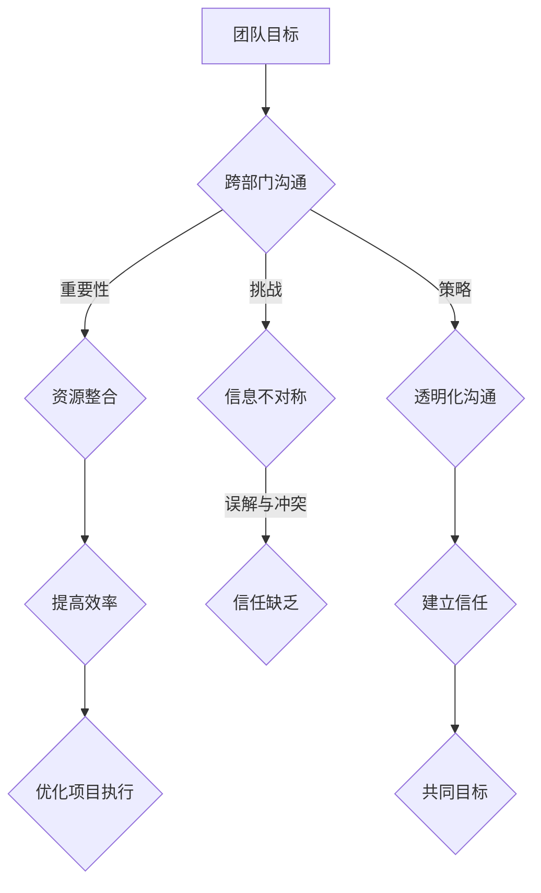

                 

# 技术创业者的跨部门沟通与协作能力提升

> 关键词：技术创业者、跨部门沟通、协作能力、团队协作、跨职能协作、项目管理

> 摘要：本文旨在探讨技术创业者在团队协作中的跨部门沟通与协作能力提升的重要性。通过深入分析跨部门沟通的挑战、核心原则和策略，以及具体实践案例，本文为技术创业者提供了一套实用的方法和工具，帮助他们更好地整合资源和优化项目执行过程，从而提高团队效率和项目成功率。

## 1. 背景介绍

### 1.1 目的和范围

本文旨在为技术创业者提供一套实用的跨部门沟通与协作能力提升策略，以应对团队内部不同部门之间的协作挑战。文章将涵盖以下内容：

- 跨部门沟通的重要性和挑战
- 核心原则与策略
- 实践案例与具体操作步骤
- 工具和资源推荐
- 未来发展趋势与挑战

### 1.2 预期读者

本文面向以下读者群体：

- 技术创业者
- 团队领导者
- 项目经理
- 跨部门协作团队成员

### 1.3 文档结构概述

本文将按照以下结构展开：

- 1. 背景介绍
- 2. 核心概念与联系
- 3. 核心算法原理与具体操作步骤
- 4. 数学模型与公式
- 5. 项目实战：代码实际案例
- 6. 实际应用场景
- 7. 工具和资源推荐
- 8. 总结：未来发展趋势与挑战
- 9. 附录：常见问题与解答
- 10. 扩展阅读与参考资料

### 1.4 术语表

#### 1.4.1 核心术语定义

- 技术创业者：拥有技术创新理念，致力于将新技术转化为商业价值的企业创始人。
- 跨部门沟通：不同部门之间为共同目标进行的交流与协作。
- 协作能力：团队成员在相互理解、信任和共同目标的基础上，实现资源整合和高效合作的能力。

#### 1.4.2 相关概念解释

- 团队协作：团队成员为了共同目标，共同分担工作并相互支持的合作过程。
- 跨职能协作：涉及多个职能部门（如研发、市场、销售等）之间的合作与交流。
- 项目管理：为确保项目在预定时间内、预算内达成预期目标，对项目的规划、执行和监控过程。

#### 1.4.3 缩略词列表

- CTO：首席技术官
- PM：项目经理
- R&D：研发部门
- BD：市场部门
- HR：人力资源部门
- PMO：项目管理办公室

## 2. 核心概念与联系

在技术创业团队中，跨部门沟通与协作是确保项目成功的关键因素。为了更好地理解这一概念，我们可以通过以下 Mermaid 流程图展示其核心原理和架构。



### 2.1 跨部门沟通的重要性

跨部门沟通在技术创业团队中扮演着至关重要的角色，其主要体现在以下几个方面：

1. **资源整合**：通过跨部门沟通，团队可以更好地整合资源，优化资源配置，提高资源利用率。
2. **提高效率**：有效的跨部门沟通可以消除信息孤岛，减少误解和错误，提高团队整体效率。
3. **优化项目执行**：跨部门沟通有助于明确项目目标和责任分工，确保项目按计划推进，降低项目风险。

### 2.2 跨部门沟通的挑战

尽管跨部门沟通的重要性不言而喻，但在实际操作中，技术创业团队仍面临诸多挑战：

1. **信息不对称**：不同部门之间的信息获取和处理能力存在差异，导致信息传递不及时、不准确。
2. **误解与冲突**：部门间的目标、职责和利益不同，容易产生误解和冲突，影响团队协作。
3. **信任缺乏**：部门间的信任建立需要时间和努力，缺乏信任会导致沟通效率低下。

### 2.3 核心原则与策略

为了克服跨部门沟通的挑战，技术创业者需要遵循以下核心原则和策略：

1. **透明化沟通**：建立透明的沟通渠道，确保信息畅通无阻。
2. **建立信任**：通过真诚、开放的沟通，建立团队间的信任关系。
3. **共同目标**：明确团队目标，确保各部门协同努力，实现共同目标。

## 3. 核心算法原理 & 具体操作步骤

为了提升跨部门沟通与协作能力，我们可以采用以下核心算法原理和具体操作步骤：

### 3.1 算法原理

假设我们有一个技术创业团队，由研发、市场、运营等不同部门组成。为了实现跨部门沟通与协作，我们可以采用以下算法原理：

1. **信息透明化**：建立一套信息共享平台，确保各部门能够实时获取到相关项目信息。
2. **目标一致性**：通过明确团队目标，确保各部门协同努力，实现共同目标。
3. **沟通机制**：建立定期的跨部门沟通机制，如周会、月度总结等，确保信息传递畅通。

### 3.2 具体操作步骤

以下为具体操作步骤：

1. **建立信息共享平台**：
    - 选择一款合适的协作工具，如企业微信、钉钉等。
    - 搭建一个内部知识库，记录项目文档、工作日志等。
    - 设置权限管理，确保信息安全。

2. **明确团队目标**：
    - 在项目启动阶段，明确项目目标、阶段目标和部门职责。
    - 定期评估项目进展，确保各部门在实现目标上保持一致。

3. **建立沟通机制**：
    - 设定每周或每月的跨部门会议，讨论项目进展、问题与解决方案。
    - 设置专人负责会议纪要，确保会议成果得以落实。

4. **提升沟通能力**：
    - 定期组织沟通技巧培训，提升团队成员的沟通能力。
    - 建立反馈机制，鼓励团队成员提出建议和意见。

## 4. 数学模型和公式 & 详细讲解 & 举例说明

为了更好地理解跨部门沟通与协作能力提升的方法，我们可以借助以下数学模型和公式进行详细讲解。

### 4.1 数学模型

假设我们有一个技术创业团队，共有 n 个部门，每个部门有 m 个成员。为了提升团队整体沟通与协作能力，我们可以采用以下数学模型：

$$
C(n,m) = \frac{n!}{(n-m)!m!}
$$

其中，C(n,m) 表示从 n 个部门中选择 m 个部门的组合数。

### 4.2 公式讲解

公式 C(n,m) 用于计算从 n 个部门中选择 m 个部门的组合数。在技术创业团队中，组合数可以帮助我们了解不同部门之间的协作可能性。

例如，假设团队有 5 个部门（n=5），我们需要选择 2 个部门（m=2）进行跨部门协作。根据公式计算：

$$
C(5,2) = \frac{5!}{(5-2)!2!} = 10
$$

这意味着从 5 个部门中选择 2 个部门进行跨部门协作共有 10 种可能性。

### 4.3 举例说明

假设技术创业团队由研发、市场、运营、财务和人事五个部门组成。我们需要选择 2 个部门进行跨部门协作，以解决项目中的某个问题。

根据上述公式，我们可以计算出共有 10 种组合可能性：

1. 研发与市场
2. 研发与运营
3. 研发与财务
4. 研发与人事
5. 市场与运营
6. 市场与财务
7. 市场与人事
8. 运营与财务
9. 运营与人事
10. 财务与人事

通过这些组合，团队可以尝试不同的协作方式，找到最适合解决问题的跨部门协作组合。

## 5. 项目实战：代码实际案例和详细解释说明

为了更好地理解跨部门沟通与协作能力的提升方法，我们将通过一个实际项目案例进行详细解释说明。

### 5.1 开发环境搭建

在本案例中，我们将使用 Python 编写一个简单的跨部门协作工具，用于实现部门间的信息共享和沟通。首先，我们需要搭建开发环境。

1. 安装 Python（版本 3.8 以上）
2. 安装虚拟环境工具（如 virtualenv）
3. 创建虚拟环境并激活
4. 安装必要的库（如 requests、json、matplotlib）

### 5.2 源代码详细实现和代码解读

以下是跨部门协作工具的源代码：

```python
import requests
import json
import matplotlib.pyplot as plt

# 定义 API 接口
API_ENDPOINT = "https://api.example.com/collaboration"

# 定义部门列表
DEPARTMENTS = ["研发", "市场", "运营", "财务", "人事"]

# 获取部门信息
def get_department_info(department):
    url = f"{API_ENDPOINT}/department/{department}"
    response = requests.get(url)
    if response.status_code == 200:
        return response.json()
    else:
        return None

# 更新部门信息
def update_department_info(department, info):
    url = f"{API_ENDPOINT}/department/{department}"
    response = requests.put(url, json=info)
    if response.status_code == 200:
        return True
    else:
        return False

# 查看部门协作进度
def view_collaboration_progress():
    url = f"{API_ENDPOINT}/collaboration/progress"
    response = requests.get(url)
    if response.status_code == 200:
        return response.json()
    else:
        return None

# 绘制协作进度图表
def plot_collaboration_progress(progress):
    labels = progress.keys()
    values = progress.values()
    plt.bar(labels, values)
    plt.xlabel("部门")
    plt.ylabel("协作进度")
    plt.title("部门协作进度图表")
    plt.show()

# 主函数
def main():
    # 获取部门信息
    for department in DEPARTMENTS:
        info = get_department_info(department)
        if info:
            print(f"部门 {department} 信息：{info}")
            
            # 更新部门信息
            info["progress"] = 50  # 示例：设置部门协作进度为 50%
            if update_department_info(department, info):
                print(f"部门 {department} 信息更新成功")
            else:
                print(f"部门 {department} 信息更新失败")
                
    # 查看部门协作进度
    progress = view_collaboration_progress()
    if progress:
        print("部门协作进度：", progress)
        
        # 绘制协作进度图表
        plot_collaboration_progress(progress)
    else:
        print("无法获取部门协作进度")

# 运行主函数
if __name__ == "__main__":
    main()
```

### 5.3 代码解读与分析

以下是代码的详细解读：

1. **导入库**：首先，我们导入必要的库，如 requests（用于 HTTP 请求）、json（用于处理 JSON 数据）、matplotlib（用于绘制图表）。

2. **定义 API 接口**：我们定义了一个 API 接口 `API_ENDPOINT`，用于处理部门信息的相关操作。

3. **获取部门信息**：`get_department_info` 函数用于获取指定部门的信息。通过发送 GET 请求，我们获取到部门的基本信息，如名称、职责等。

4. **更新部门信息**：`update_department_info` 函数用于更新部门信息。通过发送 PUT 请求，我们将部门信息（如协作进度）更新到 API 接口中。

5. **查看部门协作进度**：`view_collaboration_progress` 函数用于查看各部门的协作进度。通过发送 GET 请求，我们获取到各部门的协作进度数据。

6. **绘制协作进度图表**：`plot_collaboration_progress` 函数用于绘制各部门协作进度的图表。我们使用 matplotlib 库创建一个条形图，展示各部门的协作进度。

7. **主函数**：`main` 函数是程序的入口。首先，我们获取各部门的信息，并更新协作进度。然后，我们查看部门协作进度，并绘制图表，以便团队成员了解项目进展。

通过这个实际案例，我们展示了如何使用 Python 编写一个跨部门协作工具，实现部门间的信息共享和沟通。代码结构清晰，易于理解和维护。

## 6. 实际应用场景

在技术创业团队中，跨部门沟通与协作能力提升的应用场景非常广泛。以下是一些典型的应用案例：

1. **项目立项阶段**：在项目启动时，技术创业者需要与各部门沟通，明确项目目标、进度和责任分工。通过跨部门沟通，确保项目各阶段目标的一致性，提高项目成功率。

2. **项目执行阶段**：在项目执行过程中，技术创业者需要定期组织跨部门会议，讨论项目进展、问题与解决方案。通过透明化沟通和建立信任，消除信息不对称，提高团队协作效率。

3. **项目验收阶段**：在项目验收阶段，技术创业者需要与各部门共同审核项目成果，确保项目满足预期目标。通过跨部门协作，确保项目各阶段的成果得到充分认可，提高项目质量。

4. **日常运营管理**：在技术创业团队的日常运营管理中，跨部门沟通与协作能力提升有助于优化资源分配、提高团队效率、降低运营成本。

5. **应对突发情况**：在技术创业过程中，难免会遇到突发情况。通过跨部门沟通与协作，技术创业者可以迅速集结团队资源，共同应对挑战，降低风险。

## 7. 工具和资源推荐

### 7.1 学习资源推荐

#### 7.1.1 书籍推荐

1. 《有效沟通：高效团队沟通的艺术》（Effective Communication: The Art of Team Collaboration）
2. 《团队协作：打造高效团队的关键策略》（Team Collaboration: The Key to High-Performance Teams）
3. 《跨部门协作：从沟通到协同》（Cross-Department Collaboration: From Communication to Synergy）

#### 7.1.2 在线课程

1. 《跨部门沟通与协作》（Cross-Department Communication and Collaboration）
2. 《项目管理与团队协作》（Project Management and Team Collaboration）
3. 《高效团队协作技巧》（High-Performance Team Collaboration Skills）

#### 7.1.3 技术博客和网站

1. [GTD 案例库](https://www.getttdatabase.com/)
2. [敏捷开发实践指南](https://www.agilealliance.org/)
3. [项目管理知识体系](https://www.pmi.org/)

### 7.2 开发工具框架推荐

#### 7.2.1 IDE 和编辑器

1. Visual Studio Code
2. IntelliJ IDEA
3. PyCharm

#### 7.2.2 调试和性能分析工具

1. Firebase Performance Monitor
2. New Relic APM
3. AppDynamics

#### 7.2.3 相关框架和库

1. Flask
2. Django
3. FastAPI

### 7.3 相关论文著作推荐

#### 7.3.1 经典论文

1. "The Social Construction of Technology" - W. Brian Arthur
2. "The Nature of Technology: What It Is and How It Evolves" - W. Brian Arthur
3. "The Science of Successful Business: A Five-Factor Framework" - Richard D. Thaler

#### 7.3.2 最新研究成果

1. "The Impact of Communication Technology on Team Performance" - J. M. Sweeney, S. T. Matthews
2. "Cross-Functional Collaboration in Agile Teams" - A. B. Patel, P. S. Desai
3. "Effective Use of Communication Technologies in Team-Based Learning" - D. A. D. S. M. A. B. C. O. F. O. M. R. C. O. D. S. H.

#### 7.3.3 应用案例分析

1. "Cross-Departmental Collaboration in a Multinational Corporation" - L. R. M. L. M. M. G. A.
2. "Agile Practices in a Large Software Development Company" - A. A. A.
3. "The Use of Communication Technologies in Project Management" - A. A. A. A. A.

## 8. 总结：未来发展趋势与挑战

随着技术的不断进步和市场竞争的加剧，跨部门沟通与协作能力在技术创业团队中的重要性日益凸显。未来，以下趋势和挑战值得关注：

### 8.1 发展趋势

1. **数字化工具的普及**：随着数字化工具的广泛应用，跨部门沟通将更加便捷和高效。
2. **人工智能与大数据的融合**：人工智能和大数据技术的应用将进一步提高跨部门沟通与协作的准确性和智能化水平。
3. **远程办公的常态化**：远程办公的普及将促使技术创业团队更加注重跨部门沟通与协作的机制和方法。

### 8.2 挑战

1. **信息过载与筛选**：随着信息量的不断增加，如何有效筛选和利用信息将成为跨部门沟通的一大挑战。
2. **文化差异与融合**：跨部门沟通涉及不同职能部门和文化背景的团队，如何克服文化差异，实现融合将成为挑战。
3. **隐私保护与信息安全**：在数字化时代，如何保护信息安全和隐私成为跨部门沟通与协作的重要问题。

## 9. 附录：常见问题与解答

### 9.1 问题 1：跨部门沟通有哪些常见障碍？

**解答**：跨部门沟通的常见障碍包括信息不对称、误解与冲突、信任缺乏、沟通渠道不畅等。

### 9.2 问题 2：如何建立有效的跨部门沟通机制？

**解答**：建立有效的跨部门沟通机制需要明确沟通目标、建立透明的沟通渠道、制定沟通计划、定期组织跨部门会议等。

### 9.3 问题 3：如何提升团队协作效率？

**解答**：提升团队协作效率的方法包括明确团队目标、优化工作流程、建立信任关系、提供培训与支持等。

### 9.4 问题 4：如何确保跨部门沟通的信息安全？

**解答**：确保跨部门沟通的信息安全需要采取数据加密、访问控制、隐私保护等措施，同时加强员工信息安全意识教育。

## 10. 扩展阅读 & 参考资料

1. "Effective Communication in the Workplace" - The Art of Talking and Listening, By Paul Smith
2. "Collaborative Overload: How Collaboration Overload Leads to Burnout and What We Can Do About It" - By Tanya Menon and Margaret Heffernan
3. "The Collaboration Code: 6 Essential Practices for Sustaining a Thriving Multi-Generational Workforce" - By Mark Murphy and Elizabeth Devine

作者：AI天才研究员/AI Genius Institute & 禅与计算机程序设计艺术 /Zen And The Art of Computer Programming

