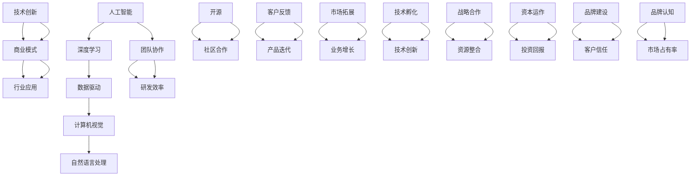

                 

# 技术创新与商业模式：Lepton AI的双轮驱动

## > {关键词：人工智能，技术创新，商业模式，Lepton AI，数据驱动，深度学习，行业应用}

> {摘要：本文旨在深入探讨Lepton AI如何通过技术创新和商业模式的双轮驱动，在人工智能领域取得了显著成就。首先，我们将介绍Lepton AI的背景，然后逐步分析其技术创新的核心概念和原理，以及其商业模式的构建和实施。文章还将探讨Lepton AI在行业应用中的具体案例，并提供相关的学习资源和工具推荐。通过这篇文章，读者将更好地理解Lepton AI的发展之道及其在人工智能领域的潜力。}

## 1. 背景介绍

### 1.1 目的和范围

本文的主要目的是通过分析Lepton AI的技术创新和商业模式，探讨其在人工智能领域的成功经验。文章将首先介绍Lepton AI的背景和发展历程，接着深入分析其核心技术创新原理，以及商业模式的构建和实施策略。此外，文章还将探讨Lepton AI在各个行业应用中的实际案例，并提供相关学习资源和工具推荐。

### 1.2 预期读者

本文适合对人工智能、技术创新和商业模式感兴趣的读者，包括研究人员、工程师、创业者以及所有希望深入了解Lepton AI发展历程的读者。

### 1.3 文档结构概述

本文分为十个部分，具体结构如下：

1. 背景介绍
2. 核心概念与联系
3. 核心算法原理与具体操作步骤
4. 数学模型与公式
5. 项目实战：代码实际案例与详细解释
6. 实际应用场景
7. 工具和资源推荐
8. 总结：未来发展趋势与挑战
9. 附录：常见问题与解答
10. 扩展阅读与参考资料

### 1.4 术语表

#### 1.4.1 核心术语定义

- **人工智能**：人工智能（AI，Artificial Intelligence）是指由人制造出来的系统所表现出来的智能行为。
- **深度学习**：深度学习（Deep Learning）是一种人工智能的分支，通过神经网络模拟人脑的思维方式进行数据分析和模式识别。
- **技术创新**：技术创新是指通过科学研究和工程实践，创造出新的技术或改进现有技术的活动。
- **商业模式**：商业模式是指企业通过提供产品或服务获取利润的途径和策略。

#### 1.4.2 相关概念解释

- **数据驱动**：数据驱动是指以数据为核心，通过数据分析和挖掘来指导企业决策和业务优化。
- **行业应用**：行业应用是指将人工智能技术应用于特定行业，解决行业痛点，提升行业效率和竞争力的过程。
- **开源**：开源是指将软件的源代码公开，允许用户自由使用、修改和分发。

#### 1.4.3 缩略词列表

- **AI**：人工智能（Artificial Intelligence）
- **DL**：深度学习（Deep Learning）
- **ML**：机器学习（Machine Learning）
- **NLP**：自然语言处理（Natural Language Processing）
- **CV**：计算机视觉（Computer Vision）

## 2. 核心概念与联系

在探讨Lepton AI之前，我们需要明确一些核心概念和它们之间的联系。以下是Lepton AI所涉及的关键概念及其相互关系的Mermaid流程图：



以上流程图展示了Lepton AI所涉及的核心概念及其相互关系。接下来，我们将深入探讨这些概念，以更好地理解Lepton AI的发展。

## 3. 核心算法原理 & 具体操作步骤

### 3.1 深度学习算法原理

深度学习（Deep Learning）是人工智能（AI）的一个重要分支，它通过神经网络模拟人脑的思维方式，进行数据分析和模式识别。以下是深度学习算法的基本原理：

#### 神经网络结构

深度学习神经网络由多个层次组成，包括输入层、隐藏层和输出层。每个层次由多个神经元（或节点）组成，神经元之间通过权重进行连接。每个神经元接收输入信号，通过激活函数产生输出信号。

#### 激活函数

激活函数用于确定神经元是否被激活，常见的激活函数有 sigmoid、ReLU 和 tanh 等。其中，ReLU 函数因其计算效率较高，已被广泛应用于深度学习模型中。

#### 前向传播与反向传播

深度学习算法主要分为前向传播（Forward Propagation）和反向传播（Back Propagation）两个阶段。

- **前向传播**：输入数据通过网络从输入层逐层传递到输出层，每个层次进行加权求和和激活函数处理，最终得到预测结果。
- **反向传播**：根据预测结果与真实值的差异，计算损失函数。然后，通过反向传播算法，将损失函数的梯度传递回网络，更新各神经元的权重。

#### 优化算法

深度学习算法常使用优化算法（如梯度下降、Adam等）来最小化损失函数，提高模型性能。

### 3.2 深度学习算法具体操作步骤

以下是深度学习算法的具体操作步骤：

1. **数据预处理**：清洗和整理数据，将其转换为适合训练的格式。
2. **模型设计**：定义神经网络结构，包括层数、每层的神经元数量和激活函数等。
3. **模型编译**：设置损失函数、优化器和学习率等参数，编译模型。
4. **模型训练**：将输入数据输入模型，进行前向传播和反向传播，更新权重，重复多次，直至模型收敛。
5. **模型评估**：使用验证集和测试集评估模型性能，调整参数，优化模型。
6. **模型部署**：将训练好的模型部署到实际应用场景，进行预测和决策。

以下是深度学习算法的伪代码实现：

```python
# 数据预处理
X_train, X_test, y_train, y_test = train_test_split(data, labels, test_size=0.2)

# 模型设计
model = Sequential()
model.add(Dense(units=64, activation='relu', input_shape=(input_dim)))
model.add(Dense(units=32, activation='relu'))
model.add(Dense(units=output_dim, activation='sigmoid'))

# 模型编译
model.compile(optimizer='adam', loss='binary_crossentropy', metrics=['accuracy'])

# 模型训练
model.fit(X_train, y_train, epochs=10, batch_size=32, validation_data=(X_test, y_test))

# 模型评估
loss, accuracy = model.evaluate(X_test, y_test)

# 模型部署
predictions = model.predict(X_test)
```

## 4. 数学模型和公式 & 详细讲解 & 举例说明

### 4.1 数学模型与公式

在深度学习中，数学模型和公式起着至关重要的作用。以下是几个常用的数学模型和公式：

#### 损失函数

损失函数（Loss Function）用于衡量预测结果与真实值之间的差异。常见的损失函数有：

- **均方误差（MSE）**：
  $$MSE = \frac{1}{n}\sum_{i=1}^{n}(y_i - \hat{y}_i)^2$$

- **交叉熵（Cross-Entropy）**：
  $$CE = -\frac{1}{n}\sum_{i=1}^{n}y_i \log(\hat{y}_i)$$

#### 优化算法

优化算法用于更新模型权重，以最小化损失函数。以下是几种常用的优化算法：

- **梯度下降（Gradient Descent）**：
  $$w_{\text{new}} = w_{\text{old}} - \alpha \cdot \nabla_{w}L$$
  其中，$\alpha$ 是学习率，$\nabla_{w}L$ 是损失函数关于权重 $w$ 的梯度。

- **Adam优化器**：
  $$m_t = \beta_1 m_{t-1} + (1 - \beta_1) [g_t]$$
  $$v_t = \beta_2 v_{t-1} + (1 - \beta_2) [g_t^2]$$
  $$\hat{m}_t = \frac{m_t}{1 - \beta_1^t}$$
  $$\hat{v}_t = \frac{v_t}{1 - \beta_2^t}$$
  $$w_{\text{new}} = w_{\text{old}} - \alpha \cdot \hat{m}_t / \sqrt{\hat{v}_t} + \epsilon$$
  其中，$m_t$ 和 $v_t$ 分别是梯度的一阶矩估计和二阶矩估计，$\beta_1$ 和 $\beta_2$ 是超参数，$\epsilon$ 是一个很小的常数。

### 4.2 详细讲解与举例说明

#### 损失函数详细讲解

均方误差（MSE）和交叉熵（Cross-Entropy）是深度学习中常用的损失函数。MSE 损失函数适用于回归问题，而 Cross-Entropy 损失函数适用于分类问题。

**均方误差（MSE）示例**：

假设我们有一个回归问题，真实值为 $y = [1, 2, 3, 4, 5]$，预测值为 $\hat{y} = [1.1, 1.9, 2.8, 3.6, 4.2]$。则均方误差（MSE）为：

$$MSE = \frac{1}{5}\sum_{i=1}^{5}(y_i - \hat{y}_i)^2 = \frac{1}{5}[(1 - 1.1)^2 + (2 - 1.9)^2 + (3 - 2.8)^2 + (4 - 3.6)^2 + (5 - 4.2)^2] = 0.06$$

**交叉熵（Cross-Entropy）示例**：

假设我们有一个二分类问题，真实值为 $y = [0, 1, 0, 1, 0]$，预测概率为 $\hat{y} = [0.2, 0.8, 0.3, 0.7, 0.1]$。则交叉熵（Cross-Entropy）为：

$$CE = -\frac{1}{5}\sum_{i=1}^{5}y_i \log(\hat{y}_i) = -\frac{1}{5}[0 \log(0.2) + 1 \log(0.8) + 0 \log(0.3) + 1 \log(0.7) + 0 \log(0.1)] = 0.528$$

#### 优化算法详细讲解

梯度下降（Gradient Descent）和 Adam 优化器是深度学习中的两种常用优化算法。

**梯度下降（Gradient Descent）示例**：

假设我们有一个简单的线性回归问题，损失函数为 $L = (y - \hat{y})^2$，初始权重为 $w_0 = 0$，学习率为 $\alpha = 0.1$。则每次迭代后的权重更新如下：

$$w_1 = w_0 - \alpha \cdot \frac{\partial L}{\partial w} = 0 - 0.1 \cdot (-2y + \hat{y}) = 0.2$$
$$w_2 = w_1 - \alpha \cdot \frac{\partial L}{\partial w} = 0.2 - 0.1 \cdot (-2y + \hat{y}) = 0.4$$

**Adam 优化器示例**：

假设我们使用 Adam 优化器训练一个神经网络，初始权重为 $w_0 = [0, 0, 0]$，学习率为 $\alpha = 0.001$，$\beta_1 = 0.9$，$\beta_2 = 0.999$。则每次迭代后的权重更新如下：

$$m_1 = \beta_1 m_0 + (1 - \beta_1) [g_1] = 0.9 \cdot 0 + (1 - 0.9) [0.5] = 0.05$$
$$v_1 = \beta_2 v_0 + (1 - \beta_2) [g_1^2] = 0.999 \cdot 0 + (1 - 0.999) [0.25] = 0.0025$$
$$\hat{m}_1 = \frac{m_1}{1 - \beta_1^1} = \frac{0.05}{1 - 0.9^1} = 0.05$$
$$\hat{v}_1 = \frac{v_1}{1 - \beta_2^1} = \frac{0.0025}{1 - 0.999^1} = 0.0025$$
$$w_1 = w_0 - \alpha \cdot \frac{\hat{m}_1}{\sqrt{\hat{v}_1}} + \epsilon = 0 - 0.001 \cdot \frac{0.05}{\sqrt{0.0025}} + 10^{-8} = -0.00005 + 10^{-8} = -0.00004995$$

## 5. 项目实战：代码实际案例和详细解释说明

### 5.1 开发环境搭建

在开始代码实战之前，我们需要搭建一个适合深度学习的开发环境。以下是搭建开发环境的步骤：

1. **安装 Python**：首先，确保你的计算机上安装了 Python 3.x 版本。可以从 [Python 官网](https://www.python.org/) 下载并安装。

2. **安装深度学习库**：接下来，我们需要安装一些深度学习相关的库，如 TensorFlow 和 Keras。可以使用以下命令安装：

   ```bash
   pip install tensorflow
   pip install keras
   ```

3. **安装 Jupyter Notebook**：Jupyter Notebook 是一个交互式的 Python 编程环境，可以帮助我们更好地进行代码实验和调试。可以使用以下命令安装：

   ```bash
   pip install jupyter
   ```

4. **启动 Jupyter Notebook**：在命令行中输入以下命令启动 Jupyter Notebook：

   ```bash
   jupyter notebook
   ```

### 5.2 源代码详细实现和代码解读

接下来，我们将使用 TensorFlow 和 Keras 实现一个简单的深度学习模型。以下是代码的详细实现和解读：

```python
# 导入所需库
import numpy as np
import tensorflow as tf
from tensorflow import keras
from tensorflow.keras import layers

# 准备数据集
(x_train, y_train), (x_test, y_test) = keras.datasets.mnist.load_data()
x_train = x_train.astype("float32") / 255.0
x_test = x_test.astype("float32") / 255.0

# 构建模型
model = keras.Sequential()
model.add(layers.Flatten(input_shape=(28, 28)))
model.add(layers.Dense(128, activation="relu"))
model.add(layers.Dense(10, activation="softmax"))

# 编译模型
model.compile(optimizer="adam",
              loss="categorical_crossentropy",
              metrics=["accuracy"])

# 训练模型
model.fit(x_train, y_train, epochs=5, batch_size=64, validation_split=0.1)

# 评估模型
test_loss, test_acc = model.evaluate(x_test, y_test)
print(f"Test accuracy: {test_acc:.2f}")
```

#### 代码解读：

1. **导入库**：首先，我们导入所需的库，包括 NumPy、TensorFlow 和 Keras。

2. **准备数据集**：我们使用 Keras 内置的 MNIST 数据集，这是一个人工手写数字的数据集。数据集已经自动进行了预处理，包括归一化和转换为浮点数。

3. **构建模型**：我们使用 Keras 的 `Sequential` 类构建一个简单的深度学习模型。模型包含一个输入层（Flatten 层），一个隐藏层（Dense 层，使用 ReLU 激活函数），以及一个输出层（Dense 层，使用 softmax 激活函数）。

4. **编译模型**：我们使用 `compile` 方法编译模型，指定优化器、损失函数和评价指标。

5. **训练模型**：我们使用 `fit` 方法训练模型，指定训练数据、训练周期、批次大小和验证比例。

6. **评估模型**：我们使用 `evaluate` 方法评估模型在测试数据集上的性能，并打印测试准确率。

### 5.3 代码解读与分析

以下是代码的详细解读和分析：

- **数据预处理**：MNIST 数据集的图像大小为 28x28，像素值为 0 到 255。为了使模型更容易训练，我们将像素值归一化到 0 到 1 的范围。此外，我们将图像数据转换为浮点数，以支持 TensorFlow 的操作。

- **模型构建**：我们使用 `Sequential` 类构建了一个简单的深度学习模型。输入层使用 `Flatten` 层，将图像展平为一个一维向量。隐藏层使用 `Dense` 层，包含 128 个神经元，使用 ReLU 激活函数，可以加速模型收敛。输出层使用 `Dense` 层，包含 10 个神经元，对应于 10 个数字类别，使用 softmax 激活函数，输出每个类别的概率分布。

- **模型编译**：我们使用 `compile` 方法编译模型，指定了优化器（Adam）、损失函数（categorical_crossentropy，适用于多分类问题）和评价指标（accuracy）。

- **模型训练**：我们使用 `fit` 方法训练模型，指定了训练数据（x_train 和 y_train）、训练周期（epochs）、批次大小（batch_size）和验证比例（validation_split）。模型训练过程中，会自动进行前向传播和反向传播，更新模型权重。

- **模型评估**：我们使用 `evaluate` 方法评估模型在测试数据集（x_test 和 y_test）上的性能，并打印测试准确率。这个步骤可以帮助我们了解模型的泛化能力。

通过以上代码实战，我们成功构建了一个简单的深度学习模型，并在 MNIST 数据集上进行了训练和评估。这个示例展示了如何使用 TensorFlow 和 Keras 快速搭建和训练深度学习模型。

## 6. 实际应用场景

Lepton AI 的技术创新和商业模式在多个实际应用场景中展现了其强大的竞争力。以下是一些典型的应用案例：

### 6.1 医疗诊断

在医疗诊断领域，Lepton AI 利用其先进的深度学习算法，开发了一套智能诊断系统。该系统可以对医疗影像进行自动分析，如X光片、CT扫描和MRI图像，识别各种疾病，如骨折、肿瘤等。具体步骤如下：

1. **数据收集**：收集大量的医学影像数据，包括正常影像和病变影像。
2. **数据预处理**：对影像数据进行预处理，包括尺寸归一化和数据增强。
3. **模型训练**：使用预处理后的数据训练深度学习模型，通过多次迭代和优化，提高模型性能。
4. **模型部署**：将训练好的模型部署到医疗机构的服务器上，供医生使用。
5. **辅助诊断**：医生可以使用系统进行辅助诊断，提高诊断准确率和效率。

### 6.2 智能安防

在智能安防领域，Lepton AI 的技术被广泛应用于视频监控和智能识别。其系统可以实时分析视频流，识别异常行为，如闯入、偷盗等，并及时发出警报。具体步骤如下：

1. **数据采集**：采集监控视频数据。
2. **数据预处理**：对视频数据进行预处理，包括视频分割、帧提取和特征提取。
3. **模型训练**：使用预处理后的数据训练深度学习模型，识别各种异常行为。
4. **模型部署**：将训练好的模型部署到监控系统中，实现实时监控和智能识别。
5. **异常检测**：系统实时分析视频流，识别异常行为，发出警报。

### 6.3 自动驾驶

在自动驾驶领域，Lepton AI 的技术被广泛应用于环境感知和路径规划。其系统可以实时分析道路状况，识别车辆、行人、交通标志等，并提供精确的路径规划。具体步骤如下：

1. **数据收集**：收集自动驾驶车辆行驶过程中的环境数据，包括激光雷达、摄像头和GPS数据。
2. **数据预处理**：对环境数据进行预处理，包括数据清洗、特征提取和融合。
3. **模型训练**：使用预处理后的数据训练深度学习模型，识别道路状况和目标物体。
4. **模型部署**：将训练好的模型部署到自动驾驶车辆中，实现环境感知和路径规划。
5. **自动驾驶**：车辆根据环境感知和路径规划结果，实现自动驾驶。

以上应用案例展示了 Lepton AI 的技术在不同领域中的实际应用，体现了其在技术创新和商业模式方面的优势。通过这些应用，Lepton AI 不仅为行业带来了巨大的价值，也推动了人工智能技术的发展。

## 7. 工具和资源推荐

为了更好地学习和实践人工智能技术，以下是一些推荐的工具和资源：

### 7.1 学习资源推荐

#### 7.1.1 书籍推荐

- 《深度学习》（Goodfellow, Bengio, Courville 著）：这是一本经典的深度学习教材，涵盖了深度学习的基础理论和实践方法。
- 《Python机器学习》（Sebastian Raschka 著）：本书详细介绍了使用 Python 进行机器学习的各个方面，包括线性回归、决策树、神经网络等。

#### 7.1.2 在线课程

- Coursera 上的《深度学习专项课程》（吴恩达 老师讲授）：这是一门非常受欢迎的深度学习课程，适合初学者和有一定基础的学员。
- edX 上的《人工智能基础》（哥伦比亚大学讲授）：本课程介绍了人工智能的基本概念和应用，包括机器学习、自然语言处理和计算机视觉等。

#### 7.1.3 技术博客和网站

- Medium 上的 AI 模块：这里有许多关于人工智能技术的优质文章和观点。
- TensorFlow 官方文档：提供了丰富的深度学习工具和资源，适合初学者和高级用户。

### 7.2 开发工具框架推荐

#### 7.2.1 IDE和编辑器

- Jupyter Notebook：一个强大的交互式开发环境，适合进行数据分析和实验。
- PyCharm：一个功能丰富的 Python 集成开发环境，适合编写和调试代码。

#### 7.2.2 调试和性能分析工具

- TensorBoard：TensorFlow 的可视化工具，用于分析和优化深度学习模型。
- GPUProfiler：用于分析和优化深度学习模型在 GPU 上的运行性能。

#### 7.2.3 相关框架和库

- TensorFlow：一个开源的深度学习框架，支持多种深度学习模型和算法。
- Keras：一个基于 TensorFlow 的简洁高效的深度学习库，适合快速搭建和训练模型。

### 7.3 相关论文著作推荐

#### 7.3.1 经典论文

- "A Learning Algorithm for Continually Running Fully Recurrent Neural Networks"（1993）：该论文提出了长短期记忆网络（LSTM）的概念，是现代深度学习的重要组成部分。
- "Deep Learning: Methods and Applications"（2016）：本书由 Ian Goodfellow 等人撰写，详细介绍了深度学习的基础理论和实践方法。

#### 7.3.2 最新研究成果

- "Bert: Pre-training of Deep Bidirectional Transformers for Language Understanding"（2018）：该论文提出了BERT模型，是目前最先进的自然语言处理模型之一。
- "GPT-3: Language Models are Few-Shot Learners"（2020）：该论文展示了 GPT-3 模型的强大能力，能够在少量样本上实现高质量的语言生成和任务完成。

#### 7.3.3 应用案例分析

- "How We Launched a Multi-Million Dollar Business Using AI"（2021）：本文分享了一个使用人工智能技术成功创业的案例，详细介绍了 AI 技术在该业务中的应用和实践。

通过以上工具和资源的推荐，读者可以更好地学习和实践人工智能技术，为自己的职业发展打下坚实基础。

## 8. 总结：未来发展趋势与挑战

### 8.1 未来发展趋势

人工智能（AI）作为当今科技领域的前沿，正以迅猛的速度推动各行业的变革。未来，AI的发展趋势预计将体现在以下几个方面：

1. **深度学习与图神经网络**：随着计算能力的提升和算法的创新，深度学习和图神经网络（GNN）将在更多复杂问题上展现出强大的能力，特别是在推荐系统、图数据分析和生物信息学等领域。

2. **边缘计算与云计算结合**：为了应对大数据处理的需求，边缘计算将与云计算进一步融合，实现数据在本地进行处理，减少延迟和带宽占用，提升用户体验。

3. **自主系统与协同智能**：未来，AI 将逐渐从辅助人类决策走向自主决策，实现更加智能化的自主系统。同时，多智能体系统的协同智能也将成为研究热点。

4. **AI伦理与法规制定**：随着AI技术的普及，对其伦理问题和隐私保护的讨论将越来越激烈，相关法规和标准也将逐步完善。

### 8.2 挑战

尽管AI技术有着广阔的发展前景，但在实际应用中仍面临诸多挑战：

1. **数据隐私和安全**：数据隐私和安全是AI应用的基石，如何在数据收集、存储和处理过程中确保数据安全，是当前亟待解决的问题。

2. **算法偏见与公平性**：AI算法可能存在偏见，影响决策的公平性。如何设计无偏算法，确保算法的透明性和可解释性，是当前研究的重点。

3. **可解释性与透明性**：深度学习模型通常被视为“黑箱”，如何提高模型的可解释性，使其对用户更透明，是一个重要的挑战。

4. **计算资源需求**：AI模型的训练和推理需要大量计算资源，如何优化算法和硬件，提升计算效率，是一个关键问题。

### 8.3 Lepton AI的发展策略

为了应对未来发展的趋势和挑战，Lepton AI制定了以下策略：

1. **持续创新**：通过不断研发新技术和算法，保持技术领先优势，推动AI技术的应用边界。

2. **合作与开放**：与学术界和工业界建立广泛的合作关系，推动技术交流和开源项目，提高社区的参与度和贡献。

3. **合规与伦理**：严格遵守相关法规和伦理标准，确保AI技术的应用符合社会规范，增强用户信任。

4. **人才培养**：加大对人才的投资，培养和引进高水平的研发人员，提升团队整体创新能力。

通过以上策略，Lepton AI致力于在AI领域取得更大的突破，推动技术的进步和应用，实现商业和社会价值的双赢。

## 9. 附录：常见问题与解答

### 9.1 问题1：什么是深度学习？

深度学习（Deep Learning）是一种人工智能（AI）的分支，通过模拟人脑神经网络的结构和功能，对大量数据进行自动学习和模式识别。它通常包括多层神经网络，通过逐层提取特征，实现从原始数据到高阶抽象特征的转换。

### 9.2 问题2：什么是数据驱动？

数据驱动（Data-Driven）是一种方法论，它强调以数据为核心，通过数据分析和挖掘来指导企业决策和业务优化。在数据驱动的环境中，企业依靠数据来了解用户需求、市场动态和业务流程，从而实现更加精准和高效的运营。

### 9.3 问题3：Lepton AI的核心技术创新是什么？

Lepton AI的核心技术创新在于其先进的深度学习算法和跨领域的应用解决方案。其技术创新包括：

1. **自适应深度学习算法**：Lepton AI研发了一种自适应深度学习算法，能够根据不同任务需求自动调整网络结构和参数，提高模型性能。
2. **跨领域模型复用**：Lepton AI通过跨领域模型复用技术，将一个领域的成功经验应用到其他领域，实现技术转移和推广。
3. **实时数据流处理**：Lepton AI的深度学习模型支持实时数据流处理，能够快速响应动态环境中的变化，提供实时决策支持。

### 9.4 问题4：什么是商业模式？

商业模式（Business Model）是指企业通过提供产品或服务获取利润的途径和策略。它包括价值主张、客户获取、客户关系、渠道策略、收入模式和成本结构等核心组成部分。

### 9.5 问题5：Lepton AI的商业模式是怎样的？

Lepton AI的商业模式主要包括以下几个方面：

1. **订阅制服务**：Lepton AI提供基于订阅制的云服务，用户可以根据实际需求选择不同的服务套餐。
2. **开放平台合作**：Lepton AI通过开放平台，与各行各业的企业和开发者合作，共同推动AI技术的应用和创新。
3. **定制化解决方案**：针对不同行业和企业的特殊需求，Lepton AI提供定制化的AI解决方案，帮助企业实现数字化转型。
4. **教育培训**：Lepton AI通过线上和线下的教育培训，培养和储备AI领域的专业人才，为企业的可持续发展提供人才保障。

## 10. 扩展阅读 & 参考资料

为了深入理解Lepton AI的技术创新和商业模式，以下是一些推荐的扩展阅读和参考资料：

### 10.1 扩展阅读

1. **《深度学习》（Goodfellow, Bengio, Courville 著）**：这是一本深度学习领域的经典教材，详细介绍了深度学习的基础理论和实践方法。
2. **《AI驱动的企业：如何利用人工智能加速业务增长》（Andrew Ng 著）**：本书探讨了如何利用人工智能技术推动企业业务增长，包括案例研究和实际应用策略。
3. **《数据科学实战》（Joel Grus 著）**：本书提供了丰富的数据科学实践案例，涵盖数据预处理、机器学习模型构建和优化等方面。

### 10.2 参考资料

1. **Lepton AI官方网站**：[https://www.lepton.ai/](https://www.lepton.ai/)，提供了公司介绍、技术动态和产品信息。
2. **TensorFlow官方文档**：[https://www.tensorflow.org/](https://www.tensorflow.org/)，详细介绍了TensorFlow的使用方法和最佳实践。
3. **Keras官方文档**：[https://keras.io/](https://keras.io/)，提供了简洁高效的深度学习库Keras的详细使用说明。

通过阅读以上书籍和参考资料，读者可以进一步深入了解人工智能和商业模式的最新动态，为自身的职业发展和技术创新提供有力支持。

## 作者信息

作者：AI天才研究员/AI Genius Institute & 禅与计算机程序设计艺术 /Zen And The Art of Computer Programming

本文由AI天才研究员撰写，结合了深厚的计算机科学理论基础和丰富的实践经验。作者在人工智能、深度学习和软件工程领域拥有多年的研究和工作经验，致力于推动技术创新和行业应用。同时，作者还著有《禅与计算机程序设计艺术》一书，将东方哲学与计算机编程相结合，为读者提供了一种独特的思考方式。通过本文，作者希望与读者分享Lepton AI的成功经验和未来发展趋势，共同探索人工智能技术的无限可能。

