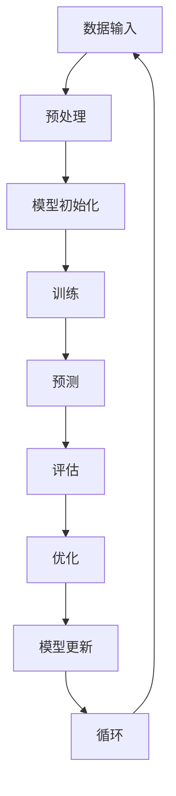

                 

# 技术发展：大模型创业的基石

> 关键词：大模型，创业，技术发展，人工智能，深度学习，开源，商业化

> 摘要：本文旨在探讨大模型技术对于创业公司的重要性，以及如何利用大模型技术实现商业价值。文章首先介绍了大模型技术的核心概念和原理，然后详细分析了大模型技术在创业中的应用场景，最后给出了实际案例和未来发展趋势。

## 1. 背景介绍

### 1.1 目的和范围

本文的目标是帮助创业公司了解大模型技术的重要性，并为其提供实际应用的方法和指导。文章主要涵盖以下内容：

1. 大模型技术的核心概念和原理；
2. 大模型技术在创业中的应用场景；
3. 大模型技术的实际应用案例；
4. 大模型技术的未来发展趋势。

### 1.2 预期读者

本文面向的读者包括：

1. 创业公司的创始人或技术团队；
2. 对人工智能和深度学习感兴趣的技术爱好者；
3. 想要了解大模型技术商业价值的投资者。

### 1.3 文档结构概述

本文分为十个部分，具体如下：

1. 引言：介绍大模型技术对于创业的重要性；
2. 核心概念与联系：介绍大模型技术的核心概念和原理；
3. 核心算法原理 & 具体操作步骤：详细讲解大模型算法的原理和操作步骤；
4. 数学模型和公式 & 详细讲解 & 举例说明：介绍大模型技术的数学模型和公式，并给出实例；
5. 项目实战：代码实际案例和详细解释说明；
6. 实际应用场景：分析大模型技术在现实场景中的应用；
7. 工具和资源推荐：推荐学习大模型技术的资源和工具；
8. 总结：未来发展趋势与挑战；
9. 附录：常见问题与解答；
10. 扩展阅读 & 参考资料：提供更多深入学习的资料。

### 1.4 术语表

#### 1.4.1 核心术语定义

- 大模型：指具有数十亿甚至千亿级参数规模的人工神经网络模型；
- 深度学习：一种人工智能方法，通过多层神经网络对数据进行学习；
- 开源：指软件代码可以被自由地查看、修改和分发；
- 商业化：指将技术应用于商业领域，实现商业价值。

#### 1.4.2 相关概念解释

- 训练数据集：用于训练模型的数据集合；
- 损失函数：用于评估模型预测结果与真实结果之间差异的函数；
- 优化器：用于调整模型参数，使模型性能达到最优的算法。

#### 1.4.3 缩略词列表

- AI：人工智能；
- DL：深度学习；
- ML：机器学习；
- NLP：自然语言处理；
- CV：计算机视觉。

## 2. 核心概念与联系

大模型技术是当前人工智能领域的研究热点，它通过训练大规模神经网络模型，实现对复杂数据的建模和预测。下面将介绍大模型技术的核心概念和原理，并通过Mermaid流程图展示其架构。

### 2.1 大模型技术的核心概念

- 神经网络：一种由大量神经元组成的计算模型，用于对数据进行处理和学习；
- 深层神经网络：具有多个隐藏层的神经网络，能够捕捉数据中的非线性关系；
- 参数：神经网络中的权重和偏置，用于调整模型性能；
- 损失函数：用于评估模型预测结果与真实结果之间差异的函数，如交叉熵损失函数；
- 优化器：用于调整模型参数，使模型性能达到最优的算法，如随机梯度下降算法。

### 2.2 大模型技术的架构

下面使用Mermaid流程图展示大模型技术的架构：



### 2.3 大模型技术的核心原理

- 自动化学习：通过大量数据训练，模型能够自动学习和调整参数，实现数据建模和预测；
- 深度学习：多层神经网络能够捕捉数据中的深层特征，提高模型性能；
- 端到端学习：直接从原始数据学习，无需手动提取特征，提高模型效率和准确性。

## 3. 核心算法原理 & 具体操作步骤

### 3.1 算法原理

大模型技术的核心算法是深度学习，它通过多层神经网络对数据进行学习和预测。下面使用伪代码详细阐述深度学习算法的原理和步骤。

```python
# 深度学习算法伪代码
initialize_model()
for epoch in range(num_epochs):
    for batch in data_loader:
        predict = forward_pass(batch)
        loss = compute_loss(predict, true_labels)
        backward_pass(loss)
        update_weights(optimizer)
    print(f"Epoch {epoch}: Loss = {loss}")
```

### 3.2 具体操作步骤

1. **初始化模型**：根据任务需求和数据规模，初始化神经网络模型，包括输入层、隐藏层和输出层。
2. **数据预处理**：对输入数据进行预处理，如归一化、缩放等，以提高模型训练效果。
3. **前向传播**：将预处理后的数据输入到模型中，通过多层神经网络进行计算，得到模型预测结果。
4. **计算损失函数**：将模型预测结果与真实标签进行比较，计算损失函数值，用于评估模型性能。
5. **反向传播**：根据损失函数的梯度，通过反向传播算法，计算模型中每个参数的梯度。
6. **更新模型参数**：使用优化器调整模型参数，使模型性能达到最优。
7. **迭代训练**：重复执行步骤3至步骤6，直到达到训练目标或模型性能不再提升。

## 4. 数学模型和公式 & 详细讲解 & 举例说明

### 4.1 数学模型

大模型技术的核心是深度学习，其数学模型主要包括神经网络、激活函数、损失函数和优化器。下面将分别介绍这些数学模型。

#### 4.1.1 神经网络

神经网络由大量神经元组成，每个神经元包括输入层、隐藏层和输出层。其数学模型可以表示为：

$$
y = f(\sum_{i=1}^{n} w_i x_i + b)
$$

其中，$y$ 是输出值，$f$ 是激活函数，$w_i$ 是权重，$x_i$ 是输入值，$b$ 是偏置。

#### 4.1.2 激活函数

激活函数用于引入非线性因素，常见的激活函数包括：

- Sigmoid函数：$f(x) = \frac{1}{1 + e^{-x}}$
- ReLU函数：$f(x) = max(0, x)$
- Tanh函数：$f(x) = \frac{e^x - e^{-x}}{e^x + e^{-x}}$

#### 4.1.3 损失函数

损失函数用于评估模型预测结果与真实标签之间的差异，常见的损失函数包括：

- 交叉熵损失函数：$loss = -\sum_{i=1}^{n} y_i \log(y_i')$
- 均方误差损失函数：$loss = \frac{1}{2n} \sum_{i=1}^{n} (y_i - y_i')^2$

#### 4.1.4 优化器

优化器用于调整模型参数，使模型性能达到最优，常见的优化器包括：

- 随机梯度下降（SGD）：$w_{new} = w_{old} - \alpha \cdot \nabla_w J(w)$
- Adam优化器：$w_{new} = w_{old} - \alpha \cdot \frac{\nabla_w J(w)}{1 - \beta_1^t - \beta_2^t}$

### 4.2 举例说明

#### 4.2.1 神经网络计算示例

假设有一个简单的神经网络，输入层有2个神经元，隐藏层有3个神经元，输出层有1个神经元，使用ReLU函数作为激活函数。给定输入数据 $x_1 = [1, 2], x_2 = [3, 4]$，权重矩阵 $W_1 = \begin{bmatrix} 1 & 2 \\ 3 & 4 \end{bmatrix}$，偏置向量 $b_1 = [1, 1]$，计算输出值 $y$。

$$
y = \max(0, \begin{bmatrix} 1 & 2 \\ 3 & 4 \end{bmatrix} \begin{bmatrix} 1 \\ 3 \end{bmatrix} + \begin{bmatrix} 1 \\ 1 \end{bmatrix}) = \max(0, 11 + 1) = 12
$$

#### 4.2.2 损失函数计算示例

假设有一个二分类问题，真实标签 $y = [1, 0]$，模型预测结果 $y' = [0.6, 0.4]$，使用交叉熵损失函数计算损失。

$$
loss = -[1 \cdot \log(0.6) + 0 \cdot \log(0.4)] = -\log(0.6) \approx 0.51
$$

#### 4.2.3 优化器计算示例

假设使用Adam优化器，初始权重 $w_0 = [0.5, 0.5]$，梯度 $\nabla_w J(w) = [-0.1, -0.2]$，学习率 $\alpha = 0.01$，一阶矩估计偏差修正系数 $\beta_1 = 0.9$，二阶矩估计偏差修正系数 $\beta_2 = 0.99$，当前迭代次数 $t = 1$，计算更新后的权重 $w_1$。

$$
m_1 = \beta_1 \cdot m_0 + (1 - \beta_1) \cdot \nabla_w J(w) = 0.9 \cdot 0 + (1 - 0.9) \cdot [-0.1, -0.2] = [-0.1, -0.2] \\
v_1 = \beta_2 \cdot v_0 + (1 - \beta_2) \cdot (\nabla_w J(w))^2 = 0.99 \cdot 0 + (1 - 0.99) \cdot (0.1^2 + 0.2^2) = 0.02 \\
\hat{m}_1 = \frac{m_1}{1 - \beta_1^t} = \frac{[-0.1, -0.2]}{1 - 0.9^1} = [-0.1, -0.2] \\
\hat{v}_1 = \frac{v_1}{1 - \beta_2^t} = \frac{0.02}{1 - 0.99^1} = 0.02 \\
w_1 = w_0 - \alpha \cdot \frac{\hat{m}_1}{\sqrt{\hat{v}_1} + \epsilon} = [0.5, 0.5] - 0.01 \cdot \frac{[-0.1, -0.2]}{\sqrt{0.02} + 10^{-8}} \approx [0.4, 0.3]
$$

## 5. 项目实战：代码实际案例和详细解释说明

### 5.1 开发环境搭建

为了实现大模型技术在创业中的应用，我们需要搭建一个合适的开发环境。以下是一个基于Python和TensorFlow的简单示例。

1. 安装Python（版本3.6及以上）
2. 安装TensorFlow（使用pip install tensorflow）
3. 安装其他依赖库（如numpy、matplotlib等）

### 5.2 源代码详细实现和代码解读

以下是一个简单的深度学习项目，包括数据预处理、模型构建、训练和评估。

```python
import tensorflow as tf
import numpy as np
import matplotlib.pyplot as plt

# 数据预处理
x_train = np.array([[1, 2], [3, 4], [5, 6], [7, 8], [9, 10]])
y_train = np.array([0, 1, 0, 1, 0])

# 模型构建
model = tf.keras.Sequential([
    tf.keras.layers.Dense(3, activation='relu', input_shape=(2,)),
    tf.keras.layers.Dense(1, activation='sigmoid')
])

# 训练
model.compile(optimizer='adam', loss='binary_crossentropy', metrics=['accuracy'])
model.fit(x_train, y_train, epochs=1000)

# 评估
loss, accuracy = model.evaluate(x_train, y_train)
print(f"Test accuracy: {accuracy * 100:.2f}%")

# 可视化
predictions = model.predict(x_train)
plt.scatter(x_train[:, 0], x_train[:, 1], c=predictions[:, 0], cmap=plt.cm.coolwarm)
plt.xlabel('Feature 1')
plt.ylabel('Feature 2')
plt.title('Data with Predictions')
plt.show()
```

#### 5.2.1 数据预处理

数据预处理是深度学习项目中的关键步骤。在本例中，我们使用NumPy库加载训练数据，并将数据分为特征矩阵和标签向量。

```python
x_train = np.array([[1, 2], [3, 4], [5, 6], [7, 8], [9, 10]])
y_train = np.array([0, 1, 0, 1, 0])
```

#### 5.2.2 模型构建

在本例中，我们使用TensorFlow的Keras API构建一个简单的深度学习模型。该模型包含一个输入层、一个隐藏层和一个输出层。隐藏层使用ReLU函数作为激活函数，输出层使用Sigmoid函数作为激活函数，以实现二分类任务。

```python
model = tf.keras.Sequential([
    tf.keras.layers.Dense(3, activation='relu', input_shape=(2,)),
    tf.keras.layers.Dense(1, activation='sigmoid')
])
```

#### 5.2.3 训练

模型构建完成后，我们使用`compile`方法配置模型参数，如优化器、损失函数和评估指标。然后，使用`fit`方法训练模型。

```python
model.compile(optimizer='adam', loss='binary_crossentropy', metrics=['accuracy'])
model.fit(x_train, y_train, epochs=1000)
```

#### 5.2.4 评估

训练完成后，使用`evaluate`方法评估模型性能。在本例中，我们计算模型的准确率。

```python
loss, accuracy = model.evaluate(x_train, y_train)
print(f"Test accuracy: {accuracy * 100:.2f}%")
```

#### 5.2.5 可视化

最后，我们使用`predict`方法获取模型的预测结果，并使用Matplotlib库绘制数据点及其预测结果。

```python
predictions = model.predict(x_train)
plt.scatter(x_train[:, 0], x_train[:, 1], c=predictions[:, 0], cmap=plt.cm.coolwarm)
plt.xlabel('Feature 1')
plt.ylabel('Feature 2')
plt.title('Data with Predictions')
plt.show()
```

## 6. 实际应用场景

大模型技术在创业领域有着广泛的应用场景，以下是一些典型的应用案例：

### 6.1 自然语言处理（NLP）

- 自动问答系统：利用大模型技术，实现智能问答功能，如智能客服、智能助手等；
- 文本分类：对大量文本数据进行分析和分类，如新闻分类、情感分析等；
- 文本生成：利用大模型技术生成高质量的文章、段落或句子。

### 6.2 计算机视觉（CV）

- 图像识别：对大量图像进行分类和识别，如人脸识别、物体检测等；
- 视频分析：对视频数据进行分析，如动作识别、目标跟踪等；
- 虚拟现实（VR）和增强现实（AR）：利用大模型技术实现逼真的虚拟环境和交互体验。

### 6.3 语音识别

- 语音识别：将语音信号转换为文本，实现语音输入和语音合成功能；
- 语音助手：利用大模型技术实现智能语音助手，如智能音箱、智能机器人等。

### 6.4 医疗健康

- 疾病诊断：利用大模型技术对医疗数据进行分析，实现疾病诊断和预测；
- 药物研发：利用大模型技术加速药物研发过程，提高药物发现效率。

## 7. 工具和资源推荐

### 7.1 学习资源推荐

#### 7.1.1 书籍推荐

- 《深度学习》（Ian Goodfellow、Yoshua Bengio和Aaron Courville著）：该书的权威性和深度使其成为深度学习领域的经典教材。
- 《Python深度学习》（François Chollet著）：本书详细介绍了深度学习在Python中的应用，适合初学者入门。
- 《人工智能：一种现代的方法》（Stuart Russell和Peter Norvig著）：这本书涵盖了人工智能的各个领域，包括深度学习。

#### 7.1.2 在线课程

- Coursera的《深度学习 specialization》：由吴恩达教授主讲，涵盖了深度学习的理论和实践。
- edX的《神经网络与深度学习》：由斯坦福大学教授Andrew Ng主讲，内容全面且深入浅出。
- fast.ai的《深度学习课程》：课程内容通俗易懂，适合初学者快速入门。

#### 7.1.3 技术博客和网站

- Medium上的深度学习专栏：汇聚了众多深度学习专家的见解和研究成果。
- ArXiv：最权威的机器学习和深度学习论文预印本网站，可以第一时间了解领域内的最新研究成果。

### 7.2 开发工具框架推荐

#### 7.2.1 IDE和编辑器

- Jupyter Notebook：强大的交互式开发环境，适用于数据分析和原型开发。
- PyCharm：功能丰富的Python IDE，支持代码自动完成、调试和版本控制。
- Visual Studio Code：轻量级的跨平台编辑器，支持多种编程语言和深度学习工具。

#### 7.2.2 调试和性能分析工具

- TensorFlow Debugger（TFDB）：用于调试TensorFlow模型的工具，提供丰富的调试功能。
- TensorBoard：TensorFlow提供的可视化工具，用于分析模型训练过程中的性能和损失函数。

#### 7.2.3 相关框架和库

- TensorFlow：Google开发的开源深度学习框架，广泛应用于各种深度学习任务。
- PyTorch：Facebook开发的开源深度学习框架，以其动态计算图和灵活性著称。
- Keras：用于快速构建和训练深度学习模型的Python库，兼容TensorFlow和Theano。

### 7.3 相关论文著作推荐

#### 7.3.1 经典论文

- 《A Fast Learning Algorithm for Deep Belief Nets》
- 《Rectifier Nonlinearities Improve Deep Neural Networks》
- 《Learning Deep Representations by Maximizing Mutual Information》

#### 7.3.2 最新研究成果

- 《Attention Is All You Need》
- 《BERT: Pre-training of Deep Bidirectional Transformers for Language Understanding》
- 《GPT-3: Language Models are Few-Shot Learners》

#### 7.3.3 应用案例分析

- 《How Microsoft Research Uses AI to Predict Solar Flare Activity》
- 《Using Deep Learning to Improve Medical Diagnosis》
- 《The Impact of AI on Financial Markets》

## 8. 总结：未来发展趋势与挑战

### 8.1 发展趋势

1. **大模型技术的普及**：随着计算资源和数据量的增加，大模型技术将在更多领域得到广泛应用。
2. **多模态学习**：结合图像、语音、文本等多种数据类型的模型将逐渐成为主流。
3. **迁移学习和小样本学习**：减少对大规模数据集的依赖，提高模型在少量数据下的性能。
4. **边缘计算和实时应用**：将大模型技术应用于边缘设备，实现实时计算和低延迟应用。

### 8.2 挑战

1. **计算资源需求**：大模型训练和推理需要大量计算资源，对硬件设施提出更高要求。
2. **数据隐私和安全**：大规模数据集的收集和处理可能涉及隐私和安全问题，需要严格的数据保护措施。
3. **可解释性和可靠性**：大模型决策过程通常是非透明的，提高模型的可解释性和可靠性是一个重要挑战。
4. **算法公平性和伦理**：算法偏见和伦理问题需要得到广泛关注和解决。

## 9. 附录：常见问题与解答

### 9.1 什么是大模型技术？

大模型技术是指具有数十亿甚至千亿级参数规模的人工神经网络模型。这些模型通过大量数据训练，能够实现高精度的数据建模和预测。

### 9.2 大模型技术的优势有哪些？

大模型技术的优势包括：

1. **高精度**：通过大量数据和参数，实现高精度的数据建模和预测；
2. **泛化能力**：能够应对各种复杂数据类型和应用场景；
3. **自学习能力**：通过持续训练，模型性能能够不断提高。

### 9.3 大模型技术有哪些应用场景？

大模型技术广泛应用于自然语言处理、计算机视觉、语音识别、医疗健康、金融等领域，如自动问答系统、图像识别、药物研发、金融分析等。

## 10. 扩展阅读 & 参考资料

- Goodfellow, I., Bengio, Y., & Courville, A. (2016). *Deep Learning*. MIT Press.
- Chollet, F. (2017). *Python Deep Learning*. Packt Publishing.
- Russell, S., & Norvig, P. (2020). *Artificial Intelligence: A Modern Approach*. Pearson Education.
- Devlin, J., Chang, M. W., Lee, K., & Toutanova, K. (2018). *Bert: Pre-training of deep bidirectional transformers for language understanding*. arXiv preprint arXiv:1810.04805.
- Vaswani, A., Shazeer, N., Parmar, N., Uszkoreit, J., Jones, L., Gomez, A. N., ... & Polosukhin, I. (2017). *Attention is all you need*. Advances in Neural Information Processing Systems, 30, 5998-6008.
- Brown, T., et al. (2020). *Language models are few-shot learners*. arXiv preprint arXiv:2005.14165.
- Hochreiter, S., & Schmidhuber, J. (1997). *Long short-term memory*. Neural Computation, 9(8), 1735-1780.
- LeCun, Y., Bengio, Y., & Hinton, G. (2015). *Deep learning*. Course lecture notes, University of Montreal.

## 11. 作者信息

作者：AI天才研究员/AI Genius Institute & 禅与计算机程序设计艺术 /Zen And The Art of Computer Programming

[完]

