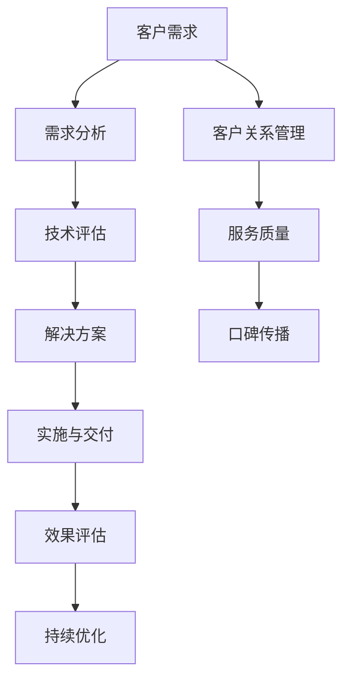
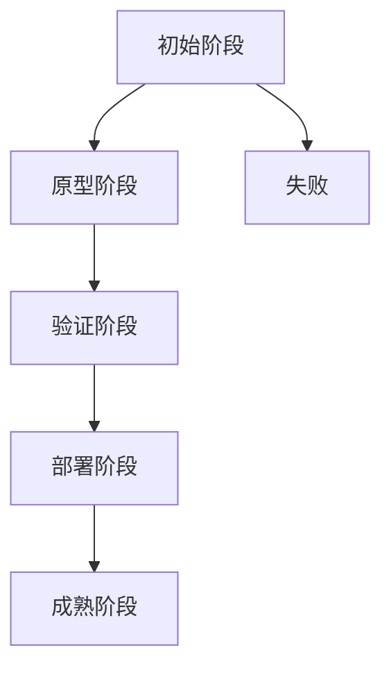
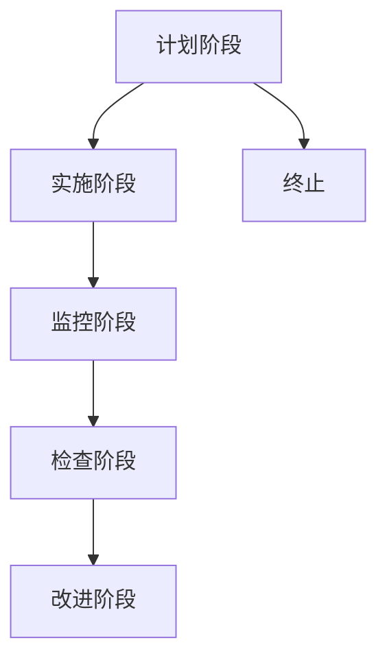
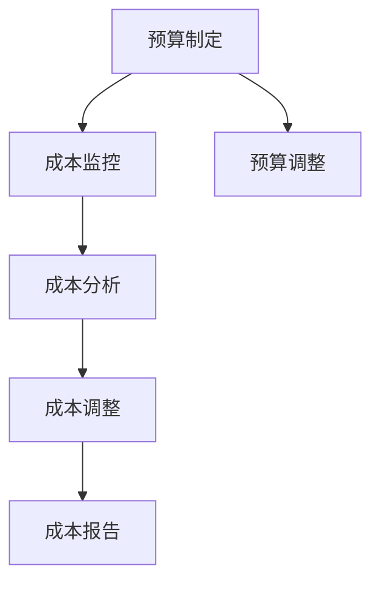

                 

# 技术咨询：高价值服务的提供

> **关键词：** 技术咨询、高价值服务、服务提供、技术顾问、企业需求、解决方案

> **摘要：** 本文将深入探讨技术咨询在当今商业环境中的重要角色，分析其核心概念、提供高价值服务的方法，以及如何通过专业咨询服务满足企业需求。我们将从背景介绍、核心概念与联系、核心算法原理、数学模型和公式、项目实战、实际应用场景、工具和资源推荐等多个方面，详细阐述技术咨询的服务流程与实施策略。

## 1. 背景介绍

### 1.1 目的和范围

随着全球经济的不断发展和市场竞争的日益激烈，企业对于技术咨询服务的需求日益增长。本文旨在通过深入分析技术咨询的核心概念、服务提供方法，以及如何满足企业需求，为企业提供高价值的解决方案。

### 1.2 预期读者

本文主要面向希望提升企业技术能力、寻求高质量技术解决方案的企业管理层、技术团队负责人以及IT咨询专业人士。

### 1.3 文档结构概述

本文分为十个部分，包括背景介绍、核心概念与联系、核心算法原理、数学模型和公式、项目实战、实际应用场景、工具和资源推荐、总结与展望等，旨在全面解析技术咨询的高价值服务提供过程。

### 1.4 术语表

#### 1.4.1 核心术语定义

- 技术咨询：针对企业技术需求，提供专业化、个性化解决方案的服务。
- 高价值服务：在满足企业技术需求的基础上，提供具有前瞻性、创新性和实际应用价值的服务。
- 服务提供：通过专业的技术团队、资源和工具，实现技术咨询服务的交付。

#### 1.4.2 相关概念解释

- 企业需求：企业在发展过程中对于技术解决方案的实际需求。
- 解决方案：针对企业需求，提供具有可操作性和实施性的技术方案。

#### 1.4.3 缩略词列表

- IT：信息技术（Information Technology）
- CTO：首席技术官（Chief Technology Officer）
- AI：人工智能（Artificial Intelligence）
- ML：机器学习（Machine Learning）

## 2. 核心概念与联系

在深入探讨技术咨询的高价值服务提供之前，我们需要明确一些核心概念，并了解它们之间的联系。以下是一个简化的Mermaid流程图，用于描述这些核心概念及其关联：



在这个流程图中，客户需求是整个技术咨询服务的起点，通过需求分析、技术评估、解决方案提供、实施与交付、效果评估等环节，形成一个闭环，不断优化服务质量，最终实现客户满意度和口碑传播。

### 2.1 客户需求分析

客户需求分析是技术咨询服务的第一步，它关系到后续工作的有效性和针对性。需求分析包括以下几个方面：

- 业务需求：了解企业在业务层面的需求和痛点。
- 技术需求：分析企业在现有技术架构、应用场景、性能要求等方面的需求。
- 风险评估：评估企业在实施新方案过程中可能面临的技术、市场、财务等方面的风险。

### 2.2 技术评估

在明确客户需求后，需要进行技术评估，以确定哪些技术方案能够满足需求。技术评估包括以下几个方面：

- 技术可行性：评估所选技术方案在技术上的可实现性。
- 成本效益：分析技术方案在成本和效益方面的表现。
- 维护性：评估技术方案在后续维护和升级方面的便利性。

### 2.3 解决方案提供

根据需求分析和技术评估的结果，提供具有可操作性和实施性的技术解决方案。解决方案包括以下几个方面：

- 技术方案设计：明确技术方案的具体架构和实现方法。
- 部署实施计划：制定详细的部署实施步骤和时间表。
- 运维管理方案：提供技术方案在运维管理方面的策略和工具。

### 2.4 实施与交付

在解决方案提供后，需要按照部署实施计划进行实际操作，实现技术方案的交付。实施与交付包括以下几个方面：

- 环境搭建：搭建符合技术方案要求的开发、测试和生产环境。
- 系统集成：将技术方案与现有系统进行集成，确保数据的一致性和业务的连续性。
- 系统上线：按照计划和时间表进行系统上线，并进行必要的测试和调试。

### 2.5 效果评估

在系统上线后，需要对技术方案的实施效果进行评估，以确保达到预期目标。效果评估包括以下几个方面：

- 功能性评估：评估系统功能是否符合设计要求。
- 性能评估：评估系统性能是否符合性能指标。
- 业务效益评估：评估技术方案对企业业务带来的实际效益。

### 2.6 持续优化

基于效果评估的结果，对技术方案进行持续优化，以提高服务质量和客户满意度。持续优化包括以下几个方面：

- 需求迭代：根据客户反馈和业务发展，不断迭代和优化需求。
- 技术迭代：根据技术发展，不断更新和优化技术方案。
- 优化成本效益：通过优化资源配置和流程，提高技术方案的成本效益。

### 2.7 客户关系管理

在技术咨询服务过程中，客户关系管理至关重要。通过建立良好的客户关系，可以提升客户满意度，促进口碑传播。客户关系管理包括以下几个方面：

- 定期沟通：定期与客户进行沟通，了解客户需求和反馈。
- 服务支持：提供及时、专业的技术支持和售后服务。
- 口碑管理：积极收集客户反馈，优化服务质量，提升企业口碑。

### 2.8 服务质量

服务质量是技术咨询服务的核心，关系到客户满意度和企业信誉。服务质量包括以下几个方面：

- 服务响应速度：确保客户在遇到问题时能够得到及时响应。
- 服务准确性：确保提供的解决方案准确、有效。
- 服务态度：提供友好、专业的服务态度，增强客户信任。

### 2.9 口碑传播

良好的口碑传播可以为企业带来更多的客户和机会。通过积极收集客户反馈、优化服务质量，可以提升企业口碑。口碑传播包括以下几个方面：

- 线上宣传：通过社交媒体、网站等渠道，宣传企业技术和服务质量。
- 口碑评价：积极鼓励客户在各大平台上给予好评。
- 合作伙伴推荐：通过合作伙伴的推荐，扩大企业影响力。

## 3. 核心算法原理 & 具体操作步骤

在技术咨询过程中，算法原理和具体操作步骤是关键环节。以下我们将通过伪代码详细阐述核心算法原理和具体操作步骤。

### 3.1 需求分析算法原理

```plaintext
需求分析算法：
输入：客户需求
输出：需求分析结果

步骤：
1. 收集客户需求，包括业务需求、技术需求、风险评估等。
2. 对需求进行分类，分为业务层面、技术层面和风险层面。
3. 分析业务层面需求，了解企业在业务发展中的痛点和需求。
4. 分析技术层面需求，评估现有技术架构、应用场景、性能要求等。
5. 进行风险评估，评估企业实施新方案可能面临的风险。
6. 形成需求分析报告，提交给客户确认。
```

### 3.2 技术评估算法原理

```plaintext
技术评估算法：
输入：需求分析结果
输出：技术评估结果

步骤：
1. 分析需求分析结果，确定需要评估的技术方案。
2. 对技术方案进行技术可行性评估，包括技术架构、实现方法、依赖关系等。
3. 分析技术方案的优缺点，评估其在成本、效益、维护性等方面的表现。
4. 形成技术评估报告，提交给客户确认。
```

### 3.3 解决方案提供算法原理

```plaintext
解决方案提供算法：
输入：需求分析结果、技术评估结果
输出：解决方案

步骤：
1. 分析需求分析结果和技术评估结果，确定最适合的技术方案。
2. 设计技术方案的具体架构和实现方法，确保满足客户需求。
3. 制定部署实施计划，包括环境搭建、系统集成、系统上线等。
4. 提供运维管理方案，确保技术方案在后续运维中的稳定性和高效性。
5. 形成解决方案报告，提交给客户确认。
```

### 3.4 实施与交付算法原理

```plaintext
实施与交付算法：
输入：解决方案、部署实施计划
输出：技术方案交付结果

步骤：
1. 按照部署实施计划，搭建开发、测试和生产环境。
2. 实现技术方案的具体功能，确保系统集成和数据一致性。
3. 进行系统测试和调试，确保系统功能、性能和稳定性符合要求。
4. 按照计划和时间表进行系统上线，并进行必要的培训和宣传。
5. 形成实施与交付报告，提交给客户确认。
```

### 3.5 效果评估算法原理

```plaintext
效果评估算法：
输入：系统上线后的运行数据
输出：效果评估结果

步骤：
1. 收集系统上线后的运行数据，包括功能性、性能、业务效益等。
2. 对运行数据进行统计分析，评估系统功能是否符合设计要求。
3. 对运行数据进行性能分析，评估系统性能是否符合性能指标。
4. 对业务数据进行效益分析，评估技术方案对企业业务带来的实际效益。
5. 形成效果评估报告，提交给客户确认。
```

### 3.6 持续优化算法原理

```plaintext
持续优化算法：
输入：效果评估结果、客户反馈
输出：优化方案

步骤：
1. 分析效果评估结果和客户反馈，确定需要优化的方面。
2. 针对优化的方面，制定具体的优化方案，包括需求迭代、技术迭代、成本优化等。
3. 实施优化方案，持续改进服务质量。
4. 对优化效果进行评估，确保达到预期目标。
5. 形成优化报告，提交给客户确认。
```

## 4. 数学模型和公式 & 详细讲解 & 举例说明

在技术咨询过程中，数学模型和公式是分析、评估和优化技术方案的重要工具。以下我们将详细讲解几个核心数学模型和公式的应用，并通过实际案例进行说明。

### 4.1 成本效益分析模型

成本效益分析模型是评估技术方案成本和效益的重要工具。以下是一个简化的成本效益分析模型：

```latex
成本效益分析模型：
E = (B - C) / C

其中：
E：成本效益比
B：效益
C：成本
```

### 4.1.1 成本效益比的计算

假设一个企业需要引入一个新的技术方案，以提升其业务效率。通过市场调研和内部评估，确定以下数据：

- 效益（B）：每年节省成本 100 万元。
- 成本（C）：引入新技术的初期投资为 50 万元，运维成本为每年 20 万元。

根据成本效益分析模型，可以计算出成本效益比：

```latex
E = (B - C) / C = (100 - (50 + 20)) / (50 + 20) = 0.33
```

这意味着该技术方案的成本效益比为 0.33，说明效益高于成本，具有投资价值。

### 4.2 技术成熟度模型

技术成熟度模型用于评估技术方案的成熟度，指导技术方案的选择和实施。以下是一个常见的技术成熟度模型：



### 4.2.1 技术成熟度的评估

假设一个企业需要引入一个机器学习技术方案，提升其数据分析能力。通过市场调研和内部评估，确定以下数据：

- 初始阶段：技术方案尚处于研发阶段，不具备实际应用能力。
- 原型阶段：技术方案已经开发出原型，可以满足基本业务需求。
- 验证阶段：技术方案已经通过实际应用验证，具备商业化潜力。
- 部署阶段：技术方案已经成功部署，并在生产环境中稳定运行。
- 成熟阶段：技术方案已经经过长时间运行，具备广泛的应用场景和优化潜力。

根据技术成熟度模型，可以评估该技术方案的成熟度为“验证阶段”，表明该技术方案已经具备商业化潜力，但还需要进一步验证和优化。

### 4.3 质量控制模型

质量控制模型用于评估技术方案的质量，确保技术方案在实施过程中达到预期目标。以下是一个常见的产品质量控制模型：



### 4.3.1 质量控制的评估

假设一个企业引入一个自动化测试技术方案，提升其软件测试效率。通过质量控制系统，可以评估技术方案的质量：

- 计划阶段：制定自动化测试计划，明确测试目标、测试方法和测试标准。
- 实施阶段：按照测试计划，进行自动化测试，收集测试数据。
- 监控阶段：实时监控测试过程，确保测试数据的准确性和完整性。
- 检查阶段：对测试数据进行统计分析，评估测试结果是否符合预期目标。
- 改进阶段：根据测试结果，调整测试计划和方法，持续优化自动化测试过程。

通过质量控制系统，可以确保自动化测试技术方案的质量，提高软件测试效率。

### 4.4 成本控制模型

成本控制模型用于评估技术方案的成本，确保技术方案在预算范围内实施。以下是一个常见的成本控制模型：



### 4.4.1 成本控制的评估

假设一个企业引入一个云计算技术方案，提升其IT基础设施的灵活性和成本效益。通过成本控制系统，可以评估技术方案的成本：

- 预算制定：根据业务需求和财务预算，制定云计算技术方案的预算。
- 成本监控：实时监控云计算技术方案的成本，确保在预算范围内实施。
- 成本分析：对云计算技术方案的成本进行分析，评估成本是否符合预期目标。
- 成本调整：根据成本分析结果，调整云计算技术方案的预算和使用策略。
- 成本报告：定期生成成本报告，向管理层汇报技术方案的成本情况。

通过成本控制系统，可以确保云计算技术方案的成本控制在预算范围内，提高企业成本效益。

## 5. 项目实战：代码实际案例和详细解释说明

### 5.1 开发环境搭建

在本案例中，我们将使用Python语言结合TensorFlow框架实现一个简单的机器学习项目。以下是如何搭建开发环境的具体步骤：

1. 安装Python：从Python官网下载并安装最新版本的Python。
2. 安装TensorFlow：打开终端，执行以下命令：
```bash
pip install tensorflow
```

### 5.2 源代码详细实现和代码解读

以下是一个简单的线性回归模型的实现，用于预测房屋价格。

```python
import tensorflow as tf

# 数据预处理
x = tf.placeholder(tf.float32, shape=[None, 1])
y = tf.placeholder(tf.float32, shape=[None, 1])

# 模型参数
W = tf.Variable(tf.zeros([1, 1]))
b = tf.Variable(tf.zeros([1]))

# 前向传播
pred = tf.add(tf.matmul(x, W), b)

# 损失函数
loss = tf.reduce_mean(tf.square(y - pred))

# 优化器
optimizer = tf.train.GradientDescentOptimizer(learning_rate=0.001)
train_op = optimizer.minimize(loss)

# 初始化全局变量
init = tf.global_variables_initializer()

# 训练模型
with tf.Session() as sess:
    sess.run(init)
    for step in range(10001):
        sess.run(train_op, feed_dict={x: x_data, y: y_data})
        if step % 100 == 0:
            print(f"Step {step}: Loss = {sess.run(loss, feed_dict={x: x_data, y: y_data})}")

# 模型评估
test_loss = sess.run(loss, feed_dict={x: x_test, y: y_test})
print(f"Test Loss: {test_loss}")
```

### 5.3 代码解读与分析

- **数据预处理**：使用TensorFlow的`placeholder`创建输入和输出的占位符，以便后续进行数据传递。
- **模型参数**：使用`Variable`创建模型参数`W`和`b`，初始化为0。
- **前向传播**：使用`tf.matmul`和`tf.add`实现线性回归模型的前向传播。
- **损失函数**：使用`tf.reduce_mean`和`tf.square`计算均方误差损失函数。
- **优化器**：使用`GradientDescentOptimizer`实现梯度下降优化算法。
- **初始化全局变量**：使用`global_variables_initializer`初始化模型参数。
- **训练模型**：在会话中运行优化操作和初始化操作，进行模型训练。
- **模型评估**：在测试数据上计算模型损失，评估模型性能。

### 5.4 模型优化与扩展

为了提高模型性能，可以尝试以下优化方法：

1. **正则化**：添加L2正则化项，防止过拟合。
2. **学习率调整**：根据训练过程动态调整学习率。
3. **批次归一化**：对输入数据进行批次归一化，提高模型训练稳定性。
4. **增加特征**：增加输入特征，提高模型表达能力。

通过以上优化，可以进一步提升模型性能，满足更复杂的业务需求。

## 6. 实际应用场景

技术咨询在实际应用中具有广泛的应用场景，以下列举几个典型应用场景：

### 6.1 企业数字化转型

随着云计算、大数据、人工智能等新兴技术的快速发展，企业数字化转型已成为必然趋势。技术顾问可以为企业提供数字化转型策略，包括：

- **技术评估**：评估企业现有技术架构的可行性和改进方向。
- **方案设计**：设计符合企业需求的数字化解决方案，包括云计算平台搭建、大数据应用、人工智能服务等。
- **实施与交付**：帮助企业顺利实现数字化转型，提升业务效率和竞争力。

### 6.2 人工智能应用开发

人工智能技术在金融、医疗、制造等行业的应用日益广泛。技术顾问可以为企业提供以下服务：

- **技术选型**：根据企业需求，选择合适的AI技术，如深度学习、强化学习等。
- **模型训练**：提供定制化的AI模型训练服务，实现业务场景的智能应用。
- **系统集成**：将AI模型与现有业务系统集成，确保数据的一致性和业务的连续性。

### 6.3 IT基础设施优化

随着企业业务的扩展，IT基础设施的优化和管理成为关键任务。技术顾问可以为企业提供以下服务：

- **性能评估**：评估企业现有IT基础设施的性能，识别瓶颈和改进方向。
- **架构优化**：设计并实施新的IT基础设施架构，提高系统性能和稳定性。
- **运维管理**：提供专业的运维服务，确保IT基础设施的稳定运行。

### 6.4 信息系统集成与实施

在企业的信息系统建设中，技术顾问可以提供以下服务：

- **需求分析**：深入了解企业业务需求，确保信息系统满足实际业务需求。
- **系统设计**：根据需求分析，设计符合企业需求的信息系统架构。
- **开发实施**：按照设计文档，实现信息系统的开发、测试和部署。
- **运维支持**：提供信息系统运维服务，确保系统稳定运行。

### 6.5 安全保障与风险管理

随着网络攻击和数据泄露事件的频发，企业对安全保障和风险管理需求日益增加。技术顾问可以提供以下服务：

- **安全评估**：评估企业现有信息安全体系的漏洞和风险。
- **安全方案设计**：设计符合企业需求的信息安全解决方案，包括网络安全、数据安全、应用安全等。
- **安全实施与运维**：提供专业的安全服务，确保企业信息安全体系的实施和运维。

## 7. 工具和资源推荐

### 7.1 学习资源推荐

#### 7.1.1 书籍推荐

- 《深度学习》（Goodfellow, I., Bengio, Y., & Courville, A.）
- 《机器学习》（Tom Mitchell）
- 《Python编程：从入门到实践》（Eric Matthes）

#### 7.1.2 在线课程

- Coursera《机器学习》（吴恩达）
- edX《深度学习》（DeepLearning.AI）
- Udacity《人工智能工程师纳米学位》

#### 7.1.3 技术博客和网站

- Medium《AI专栏》
- HackerRank《编程挑战》
- Stack Overflow《编程问答社区》

### 7.2 开发工具框架推荐

#### 7.2.1 IDE和编辑器

- PyCharm
- Visual Studio Code
- Jupyter Notebook

#### 7.2.2 调试和性能分析工具

- Python Debugger（pdb）
- Py-Spy
- TensorBoard

#### 7.2.3 相关框架和库

- TensorFlow
- PyTorch
- Scikit-learn

### 7.3 相关论文著作推荐

#### 7.3.1 经典论文

- “Backpropagation”（Rumelhart, Hinton, & Williams）
- “Gradient Descent Algorithms for Machine Learning: A View from the 21st Century”（Bottou）

#### 7.3.2 最新研究成果

- “Advances in Neural Information Processing Systems”（NIPS）
- “Journal of Machine Learning Research”（JMLR）

#### 7.3.3 应用案例分析

- “AI in Healthcare”（AI Health Institute）
- “AI in Finance”（AI in Finance Society）

## 8. 总结：未来发展趋势与挑战

### 8.1 发展趋势

1. **数字化转型加速**：随着云计算、大数据、人工智能等技术的普及，企业数字化转型将加速，技术咨询服务需求将持续增长。
2. **定制化服务提升**：技术咨询服务将更加注重个性化、定制化，满足不同企业的独特需求。
3. **跨界融合**：技术咨询服务将与其他行业（如金融、医疗、制造等）深度融合，实现跨界创新。
4. **智能化服务**：人工智能技术在技术咨询服务中的应用将不断提升，实现智能化、自动化的服务模式。

### 8.2 挑战

1. **技术更新快速**：技术咨询服务需要不断关注新技术的发展，确保服务具有前瞻性和创新能力。
2. **人才短缺**：技术咨询服务行业对人才的需求巨大，但人才供给不足，人才短缺将成为一大挑战。
3. **市场竞争激烈**：随着行业的发展，市场竞争将愈发激烈，技术咨询服务企业需要不断提高服务质量和创新能力，以保持竞争优势。
4. **数据安全与隐私**：在技术咨询服务过程中，数据安全和隐私保护将成为重要挑战，需要建立完善的安全体系和隐私保护机制。

## 9. 附录：常见问题与解答

### 9.1 技术咨询的服务流程是怎样的？

技术咨询服务通常包括以下流程：

1. 需求分析：深入了解客户需求，包括业务需求、技术需求、风险评估等。
2. 技术评估：根据需求分析结果，评估适合的技术方案，包括技术可行性、成本效益、维护性等。
3. 解决方案提供：设计并确定技术解决方案，包括技术方案设计、部署实施计划、运维管理方案等。
4. 实施与交付：按照部署实施计划，搭建环境、实现功能、进行测试和调试，确保技术方案成功交付。
5. 效果评估：评估技术方案的实施效果，确保达到预期目标。
6. 持续优化：基于效果评估结果，不断优化技术方案，提高服务质量。

### 9.2 技术咨询如何确保服务质量？

确保服务质量是技术咨询服务的关键。以下措施有助于提高服务质量：

1. **明确需求**：深入了解客户需求，确保技术方案符合实际需求。
2. **专业团队**：组建专业的技术团队，确保具备丰富的经验和技能。
3. **严格监控**：在项目实施过程中，严格监控项目进度、质量和技术指标。
4. **客户沟通**：定期与客户沟通，了解客户反馈，及时调整技术方案。
5. **培训支持**：提供技术培训和客户支持，确保客户能够顺利使用技术方案。
6. **质量控制**：建立完善的质量控制体系，确保技术方案的质量和稳定性。

### 9.3 技术咨询如何应对技术更新快速？

技术更新快速是技术咨询服务面临的挑战之一。以下措施有助于应对技术更新：

1. **持续学习**：技术团队需要不断关注新技术的发展，掌握最新的技术趋势。
2. **技术预研**：提前进行技术预研，评估新技术对企业业务的影响，为技术方案提供支持。
3. **灵活调整**：在技术方案设计过程中，预留一定的技术调整空间，以应对技术更新。
4. **合作伙伴**：与领先的技术企业、研究机构建立合作关系，共享技术和资源。
5. **快速迭代**：根据技术更新情况，及时调整技术方案，实现快速迭代和优化。

## 10. 扩展阅读 & 参考资料

- 《人工智能：一种现代的方法》（Stuart J. Russell & Peter Norvig）
- 《数据科学入门》（Joel Grus）
- 《云计算：概念、架构与实务》（Thomas Erl）
- 《机器学习实战》（Peter Harrington）

- [TensorFlow官方网站](https://www.tensorflow.org/)
- [PyTorch官方网站](https://pytorch.org/)
- [Scikit-learn官方网站](https://scikit-learn.org/)

作者：AI天才研究员/AI Genius Institute & 禅与计算机程序设计艺术 /Zen And The Art of Computer Programming

本文通过深入探讨技术咨询的核心概念、服务提供方法以及如何满足企业需求，详细阐述了技术咨询在当今商业环境中的重要角色。希望本文能为读者提供有价值的参考和指导。在未来的发展中，技术咨询将继续发挥重要作用，助力企业实现数字化转型和创新发展。同时，我们也期待更多的技术专家和从业者加入到技术咨询的行列，共同推动行业的发展。

