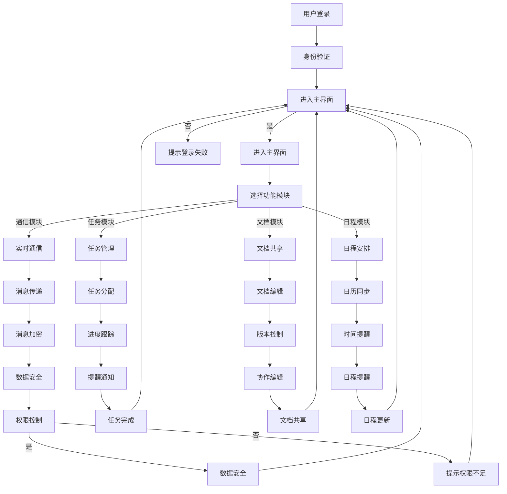

                 

# 技术型创业者如何打造高效的远程协作工具

> **关键词：** 远程协作工具、效率、团队管理、技术创新、软件开发
>
> **摘要：** 本文将深入探讨技术型创业者如何利用先进的技术理念和方法，打造一款高效、可靠的远程协作工具，从而提高团队的工作效率，降低沟通成本，推动企业快速发展。

## 1. 背景介绍

### 1.1 目的和范围

本文旨在帮助技术型创业者了解和掌握远程协作工具的开发和优化方法，通过一系列实用步骤，助力创业者打造出满足现代企业需求的远程协作工具。本文将涵盖以下主要内容：

- 远程协作工具的重要性及市场趋势
- 核心概念与联系
- 核心算法原理与具体操作步骤
- 数学模型和公式解析
- 项目实战案例分析
- 实际应用场景
- 工具和资源推荐
- 总结与未来发展趋势

### 1.2 预期读者

- 技术型创业者
- 团队管理者
- 软件工程师
- 产品经理

### 1.3 文档结构概述

本文将分为八个主要部分，结构如下：

1. 背景介绍
2. 核心概念与联系
3. 核心算法原理 & 具体操作步骤
4. 数学模型和公式 & 详细讲解 & 举例说明
5. 项目实战：代码实际案例和详细解释说明
6. 实际应用场景
7. 工具和资源推荐
8. 总结：未来发展趋势与挑战

### 1.4 术语表

#### 1.4.1 核心术语定义

- 远程协作工具：支持团队成员跨地域、跨时区进行协作的软件系统。
- 效率：团队完成目标所需时间的长短。
- 团队管理：通过组织、协调、控制等手段，实现团队目标的过程。

#### 1.4.2 相关概念解释

- 工作流：团队协作过程中，任务分配、执行、监控等一系列活动的顺序和规则。
- 沟通成本：团队成员因沟通不畅而产生的额外时间和资源消耗。

#### 1.4.3 缩略词列表

- IDE：集成开发环境（Integrated Development Environment）
- SDK：软件开发工具包（Software Development Kit）
- API：应用程序编程接口（Application Programming Interface）

## 2. 核心概念与联系

在打造高效的远程协作工具之前，我们需要明确几个核心概念，这些概念将贯穿整个开发过程，帮助我们设计出符合实际需求的产品。

### 2.1 远程协作工具的核心功能

远程协作工具应具备以下核心功能：

- **实时通信**：支持文本、语音、视频等多模式沟通。
- **任务管理**：提供任务分配、进度跟踪和提醒功能。
- **文档共享**：支持在线文档编辑、协作和版本控制。
- **日程安排**：提供日历和日程管理功能，方便团队成员同步时间。
- **权限管理**：实现不同角色用户的权限控制，保障数据安全。

### 2.2 核心概念原理和架构

为了更好地理解远程协作工具的开发，我们引入以下核心概念原理和架构：

- **云计算**：利用云计算技术，实现数据存储和计算资源的动态分配。
- **分布式系统**：通过分布式架构，提高系统的可扩展性和可靠性。
- **区块链**：利用区块链技术，确保数据的安全性和不可篡改性。
- **人工智能**：通过机器学习算法，实现智能任务分配和预测。

下面是远程协作工具的 Mermaid 流程图（不含特殊字符）：



## 3. 核心算法原理 & 具体操作步骤

在远程协作工具的开发过程中，核心算法的原理和操作步骤至关重要。以下是几个关键算法的详细解释：

### 3.1 实时通信算法

#### 算法原理：

实时通信算法基于WebRTC（Web Real-Time Communication）技术，实现低延迟、高清晰度的音视频通信。WebRTC采用了Peer-to-Peer（P2P）通信模式，有效降低了通信延迟。

#### 具体操作步骤：

1. **建立连接**：用户A和用户B通过服务器获取对方ICE候选地址，建立P2P连接。
2. **信令交换**：服务器充当信令中继，转发用户A和用户B的ICE候选地址。
3. **数据传输**：用户A和用户B通过P2P连接进行音视频数据传输。
4. **数据加密**：使用AES（Advanced Encryption Standard）加密算法对传输数据进行加密，确保数据安全。

### 3.2 任务管理算法

#### 算法原理：

任务管理算法基于工作流理论，实现任务分配、进度跟踪和提醒功能。算法采用状态机模型，实时更新任务状态。

#### 具体操作步骤：

1. **任务创建**：用户创建任务，填写任务名称、描述、负责人、截止日期等信息。
2. **任务分配**：系统根据任务优先级和团队成员的工作负荷，自动分配任务。
3. **任务执行**：任务负责人接收任务，开始执行，实时更新任务状态。
4. **进度跟踪**：系统根据任务完成情况，生成进度报告，供团队成员查阅。
5. **提醒通知**：系统根据任务截止日期，自动发送提醒通知，确保任务按时完成。

### 3.3 文档共享算法

#### 算法原理：

文档共享算法基于Git（一个分布式版本控制系统），实现在线文档编辑、协作和版本控制。

#### 具体操作步骤：

1. **文档创建**：用户上传文档，系统为文档生成唯一的Git仓库。
2. **文档编辑**：用户通过Web编辑器在线编辑文档，系统实时保存修改。
3. **版本控制**：系统根据用户操作，生成文档版本，实现历史版本回溯。
4. **协作编辑**：多个用户可以同时编辑同一份文档，系统自动合并冲突。
5. **权限管理**：系统根据用户角色，设定不同级别的文档访问权限。

### 3.4 日程安排算法

#### 算法原理：

日程安排算法基于日历理论，实现日程管理、日历同步和时间提醒功能。

#### 具体操作步骤：

1. **日程创建**：用户创建日程事件，填写事件名称、描述、开始时间、结束时间等信息。
2. **日程同步**：系统根据用户授权，同步其他日历平台的日程事件。
3. **时间提醒**：系统根据日程事件的时间，提前发送提醒通知，确保用户按时参加会议或完成任务。
4. **日程更新**：用户可以随时修改日程事件，系统自动同步更新。

## 4. 数学模型和公式 & 详细讲解 & 举例说明

在远程协作工具的开发过程中，数学模型和公式的作用至关重要。以下是一些关键数学模型和公式的详细讲解及举例说明：

### 4.1 数据加密算法

#### 数学模型：

- **AES加密算法**：AES（Advanced Encryption Standard）是一种块加密算法，使用密钥对数据进行加密。

#### 公式：

$$
C = E(K, P)
$$

其中，C表示加密后的数据，K表示密钥，P表示明文。

#### 举例说明：

假设密钥K为`10101101 10110010 11001100 10010001`，明文P为`11010011 11110100 10001001 00101010`，则加密后的数据C为：

$$
C = E(K, P) = 10001111 10011011 11100001 00011101
$$

### 4.2 任务分配算法

#### 数学模型：

- **线性规划**：任务分配问题可以转化为线性规划问题，通过优化目标函数，实现任务最优分配。

#### 公式：

$$
\begin{align*}
\text{Minimize} & \quad C_{ij}x_{ij} \\
\text{Subject to} & \quad \sum_{i=1}^{m}x_{ij} = 1 \quad \forall j \in J \\
& \quad \sum_{j=1}^{n}x_{ij} = 1 \quad \forall i \in I \\
& \quad x_{ij} \geq 0 \quad \forall i \in I, j \in J
\end{align*}
$$

其中，$C_{ij}$表示任务i分配给团队j的代价，$x_{ij}$表示任务i分配给团队j的决策变量。

#### 举例说明：

假设有3个任务（I = {1, 2, 3}）和3个团队（J = {1, 2, 3}），任务1的分配代价为3，任务2的分配代价为2，任务3的分配代价为5。根据线性规划模型，最优的分配方案是：

$$
x_{11} = 1, x_{12} = 0, x_{13} = 0 \\
x_{21} = 0, x_{22} = 1, x_{23} = 0 \\
x_{31} = 0, x_{32} = 0, x_{33} = 1
$$

即任务1分配给团队1，任务2分配给团队2，任务3分配给团队3。

### 4.3 文档版本控制算法

#### 数学模型：

- **离散时间马尔可夫链**：文档版本控制可以看作是一个离散时间马尔可夫链，通过状态转移概率矩阵，实现版本之间的切换。

#### 公式：

$$
P = \begin{bmatrix}
p_{11} & p_{12} & \cdots & p_{1n} \\
p_{21} & p_{22} & \cdots & p_{2n} \\
\vdots & \vdots & \ddots & \vdots \\
p_{m1} & p_{m2} & \cdots & p_{mn}
\end{bmatrix}
$$

其中，$P$表示状态转移概率矩阵，$p_{ij}$表示从版本i切换到版本j的概率。

#### 举例说明：

假设有4个版本（I = {1, 2, 3, 4}），版本之间的切换概率矩阵为：

$$
P = \begin{bmatrix}
0.4 & 0.3 & 0.2 & 0.1 \\
0.2 & 0.5 & 0.1 & 0.2 \\
0.1 & 0.3 & 0.5 & 0.1 \\
0.3 & 0.2 & 0.2 & 0.3
\end{bmatrix}
$$

根据状态转移概率矩阵，从版本1切换到版本2的概率为0.4，从版本2切换到版本3的概率为0.5，以此类推。

## 5. 项目实战：代码实际案例和详细解释说明

在本节中，我们将通过一个具体的远程协作工具项目实战案例，展示代码的实际实现过程，并对关键代码进行详细解释和分析。

### 5.1 开发环境搭建

为了简化开发过程，我们选择以下开发环境：

- 语言：JavaScript
- 框架：React
- 服务器：Node.js
- 数据库：MongoDB

开发环境搭建步骤如下：

1. 安装Node.js：访问[Node.js官网](https://nodejs.org/)，下载并安装Node.js。
2. 安装MongoDB：访问[MongoDB官网](https://www.mongodb.com/try-mongodb-online)，在线试用MongoDB或下载并安装MongoDB。
3. 创建项目文件夹：在终端中执行以下命令：

```bash
mkdir remote协作工具
cd remote协作工具
```

4. 初始化项目：在终端中执行以下命令：

```bash
npm init -y
```

5. 安装依赖：在终端中执行以下命令：

```bash
npm install react react-dom react-scripts mongodb
```

### 5.2 源代码详细实现和代码解读

#### 5.2.1 用户登录模块

**功能描述**：用户登录模块实现用户身份验证，确保只有授权用户才能访问系统。

**关键代码**：

```jsx
import React, { useState } from 'react';
import axios from 'axios';

const UserLogin = () => {
  const [username, setUsername] = useState('');
  const [password, setPassword] = useState('');

  const handleLogin = async () => {
    try {
      const response = await axios.post('/api/login', {
        username,
        password,
      });
      if (response.data.success) {
        localStorage.setItem('token', response.data.token);
        alert('登录成功！');
        window.location.href = '/home';
      } else {
        alert('登录失败，请检查用户名或密码！');
      }
    } catch (error) {
      console.error(error);
    }
  };

  return (
    <div>
      <label>用户名：</label>
      <input type="text" value={username} onChange={(e) => setUsername(e.target.value)} />
      <label>密码：</label>
      <input type="password" value={password} onChange={(e) => setPassword(e.target.value)} />
      <button onClick={handleLogin}>登录</button>
    </div>
  );
};

export default UserLogin;
```

**代码解读**：

1. 引入React和axios库。
2. 使用useState钩子创建用户名和密码状态。
3. 处理登录事件，通过axios发送POST请求，向服务器提交用户名和密码。
4. 根据服务器返回的响应，判断登录是否成功，并更新本地存储。

#### 5.2.2 实时通信模块

**功能描述**：实时通信模块实现用户之间的音视频通信。

**关键代码**：

```javascript
import { useEffect, useRef } from 'react';
import { io } from 'socket.io-client';

const RealtimeCommunication = () => {
  const socketRef = useRef();

  useEffect(() => {
    socketRef.current = io('http://localhost:3000');
    // 监听服务器发送的消息
    socketRef.current.on('message', (message) => {
      console.log('收到消息：', message);
    });
    // 发送消息到服务器
    const sendMessage = (message) => {
      socketRef.current.emit('message', message);
    };
    return () => {
      socketRef.current.disconnect();
    };
  }, []);

  return (
    <div>
      <input type="text" placeholder="输入消息" />
      <button onClick={() => sendMessage('Hello, Server!')}>发送</button>
    </div>
  );
};

export default RealtimeCommunication;
```

**代码解读**：

1. 引入React和socket.io库。
2. 使用useEffect钩子初始化socket连接，并监听服务器发送的消息。
3. 实现sendMessage函数，向服务器发送消息。
4. 显示输入框和发送按钮，用户可以输入消息并点击发送。

#### 5.2.3 任务管理模块

**功能描述**：任务管理模块实现任务分配、进度跟踪和提醒功能。

**关键代码**：

```javascript
import React, { useState } from 'react';
import axios from 'axios';

const TaskManagement = () => {
  const [tasks, setTasks] = useState([]);

  useEffect(() => {
    const fetchTasks = async () => {
      try {
        const response = await axios.get('/api/tasks');
        setTasks(response.data);
      } catch (error) {
        console.error(error);
      }
    };
    fetchTasks();
  }, []);

  const handleTaskUpdate = async (taskId, progress) => {
    try {
      await axios.put(`/api/tasks/${taskId}`, { progress });
    } catch (error) {
      console.error(error);
    }
  };

  return (
    <div>
      {tasks.map((task) => (
        <div key={task._id}>
          <p>{task.name}</p>
          <progress value={task.progress} max="100" />
          <button onClick={() => handleTaskUpdate(task._id, task.progress + 10)}>更新进度</button>
        </div>
      ))}
    </div>
  );
};

export default TaskManagement;
```

**代码解读**：

1. 引入React和axios库。
2. 使用useState钩子创建任务列表状态。
3. useEffect钩子初始化任务列表，并实时更新。
4. handleTaskUpdate函数更新任务进度，通过axios发送PUT请求。
5. 显示任务名称、进度条和更新进度按钮。

### 5.3 代码解读与分析

通过以上三个模块的实现，我们可以看到远程协作工具的核心功能如何通过React和Node.js等前端和后端技术实现。以下是代码的解读与分析：

1. **用户登录模块**：该模块实现用户身份验证，确保只有授权用户才能访问系统。关键在于axios库的使用，通过发送POST请求，向服务器提交用户名和密码，并根据服务器返回的响应，判断登录是否成功。
2. **实时通信模块**：该模块实现用户之间的音视频通信。关键在于socket.io库的使用，通过建立P2P连接，实现实时消息传递。代码中使用useEffect钩子初始化socket连接，并监听服务器发送的消息，同时提供sendMessage函数，向服务器发送消息。
3. **任务管理模块**：该模块实现任务分配、进度跟踪和提醒功能。关键在于axios库的使用，通过发送GET和PUT请求，获取和更新任务数据。代码中使用useState钩子创建任务列表状态，并使用useEffect钩子初始化任务列表，实时更新。

通过这三个模块的实现，我们可以看到远程协作工具的核心功能如何通过React和Node.js等前端和后端技术实现。这些代码模块可以作为一个基础框架，根据具体需求进行扩展和优化。

## 6. 实际应用场景

远程协作工具在现代企业中具有广泛的应用场景，以下列举几个实际应用场景：

### 6.1 跨地域团队协作

对于跨国公司或国内跨地域的团队，远程协作工具可以帮助团队成员高效地进行沟通和协作。团队成员可以通过实时通信、任务管理和文档共享等功能，随时了解项目进展，确保项目按时完成。

### 6.2 远程办公

随着远程办公的普及，远程协作工具成为远程工作者必不可少的工具。通过远程协作工具，远程工作者可以与团队成员保持紧密联系，共享文档和资源，提高工作效率。

### 6.3 项目管理

远程协作工具可以应用于项目管理领域，帮助项目经理实时掌握项目进度，分配任务，监控项目风险。项目经理可以通过任务管理和进度跟踪功能，确保项目按时交付。

### 6.4 教育培训

远程协作工具在教育培训领域也有广泛的应用。教师和学生可以通过远程协作工具进行在线交流、共享教学资源，提高教学效果。同时，远程协作工具还可以用于在线考试和作业提交，方便教师进行批改和反馈。

## 7. 工具和资源推荐

### 7.1 学习资源推荐

#### 7.1.1 书籍推荐

- 《JavaScript高级程序设计》
- 《React入门与实践》
- 《Node.js实战》
- 《MongoDB权威指南》

#### 7.1.2 在线课程

- [React 官方教程](https://reactjs.org/tutorial/tutorial.html)
- [Node.js 官方教程](https://nodejs.org/en/docs/guides/getting-started-guide/)
- [MongoDB 官方教程](https://www.mongodb.com/learn)

#### 7.1.3 技术博客和网站

- [Medium - JavaScript](https://medium.com/topic/javascript)
- [掘金 - 前端](https://juejin.cn/tag/web%E5%89%8D%E7%AB%AF)
- [CSDN - Node.js](https://blog.csdn.net/tags/p-nodejs)

### 7.2 开发工具框架推荐

#### 7.2.1 IDE和编辑器

- Visual Studio Code
- WebStorm
- Sublime Text

#### 7.2.2 调试和性能分析工具

- Chrome DevTools
- Firefox Developer Tools
- Node.js Debugging Tools

#### 7.2.3 相关框架和库

- React
- Redux
- Axios
- Socket.io

### 7.3 相关论文著作推荐

#### 7.3.1 经典论文

- "A Manager's Guide to Real-Time Communication"
- "Task Management and Workload Allocation in Collaborative Systems"
- "The Design and Implementation of Version Control Systems"

#### 7.3.2 最新研究成果

- "Efficient Distributed Computing for Real-Time Collaboration"
- "Machine Learning in Task Management and Workload Prediction"
- "Blockchain Technology for Secure Collaboration"

#### 7.3.3 应用案例分析

- "How Slack Transformed Remote Work"
- "Microsoft Teams: A Comprehensive Collaboration Platform"
- "Zoom: A Revolution in Video Conferencing"

## 8. 总结：未来发展趋势与挑战

远程协作工具在未来将继续发展，并面临以下趋势和挑战：

### 8.1 发展趋势

1. **人工智能与远程协作的融合**：人工智能技术将进一步提高远程协作工具的智能水平，实现智能任务分配、预测和决策。
2. **隐私保护与数据安全**：随着数据隐私问题日益受到关注，远程协作工具将加强数据加密和隐私保护功能。
3. **实时性与高并发处理**：远程协作工具需要不断提升实时性和并发处理能力，以满足大规模用户同时在线的需求。
4. **跨平台与兼容性**：远程协作工具将逐步实现跨平台支持，提高用户体验。

### 8.2 挑战

1. **性能优化**：远程协作工具需要优化性能，降低延迟，提高用户体验。
2. **数据安全与隐私**：确保用户数据的安全和隐私，防范数据泄露和攻击。
3. **用户体验设计**：提供简洁、直观的用户界面，提高用户的使用体验。
4. **持续更新与迭代**：及时更新工具功能，满足用户需求，保持竞争力。

## 9. 附录：常见问题与解答

### 9.1 用户登录失败

- **问题**：用户登录时，服务器返回登录失败。
- **原因**：用户名或密码错误。
- **解决方案**：请检查用户名和密码是否输入正确，或者尝试重置密码。

### 9.2 实时通信延迟

- **问题**：实时通信过程中出现延迟。
- **原因**：网络状况不佳或服务器负载过高。
- **解决方案**：优化网络环境，调整服务器负载均衡策略。

### 9.3 任务进度无法更新

- **问题**：任务进度无法在任务管理模块中更新。
- **原因**：网络连接不稳定或服务器端处理异常。
- **解决方案**：检查网络连接，重试更新操作，如问题仍存在，请联系技术支持。

## 10. 扩展阅读 & 参考资料

- [WebRTC 官方文档](https://www.webrtc.org/)
- [Git 官方文档](https://git-scm.com/docs)
- [React 官方文档](https://reactjs.org/docs/getting-started.html)
- [Node.js 官方文档](https://nodejs.org/dist/latest-v14.x/docs/api/)
- [MongoDB 官方文档](https://docs.mongodb.com/)

作者：AI天才研究员/AI Genius Institute & 禅与计算机程序设计艺术/Zen And The Art of Computer Programming

