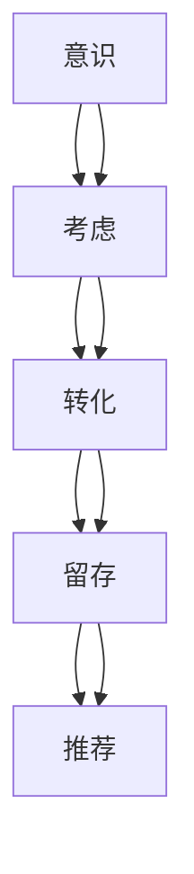

                 

### 1. 背景介绍

在当今充满竞争的市场环境中，技术型创业者面临的挑战之一是如何打造高转化率的销售漏斗。销售漏斗（Sales Funnel）是营销和销售过程中一种重要的工具，它帮助企业家们理解潜在客户如何从认识品牌到最终转化为购买者的全过程。高转化率的销售漏斗能够显著提升企业的收益和市场份额，因此，掌握其构建和优化方法变得至关重要。

#### 1.1 目的和范围

本文旨在为技术型创业者提供一套系统化的方法论，以构建和优化高转化率的销售漏斗。我们将详细探讨以下几个核心问题：

- 销售漏斗的基本概念和组成部分是什么？
- 如何通过数据分析和用户行为分析来优化销售漏斗？
- 哪些核心算法和数学模型对销售漏斗的优化至关重要？
- 实际项目中的代码案例和实战经验如何帮助我们理解这些概念？

本文将涵盖以下内容：

1. **销售漏斗的背景和重要性**：介绍销售漏斗的基本概念和其在企业运营中的作用。
2. **核心概念与联系**：分析销售漏斗的核心原理和组成部分，并绘制流程图。
3. **核心算法原理 & 具体操作步骤**：详细讲解优化销售漏斗所需的算法原理和具体操作步骤。
4. **数学模型和公式 & 详细讲解 & 举例说明**：介绍与销售漏斗优化相关的数学模型和公式，并提供实际应用案例。
5. **项目实战：代码实际案例和详细解释说明**：通过实际代码案例展示销售漏斗的构建和优化过程。
6. **实际应用场景**：探讨销售漏斗在不同行业和企业中的应用。
7. **工具和资源推荐**：推荐学习资源和开发工具，以帮助读者更好地理解和应用销售漏斗的概念。
8. **总结：未来发展趋势与挑战**：预测销售漏斗的未来发展趋势，并探讨潜在的技术挑战。

#### 1.2 预期读者

本文预期读者包括：

- 技术型创业者
- 销售和营销管理人员
- 数据分析师和产品经理
- 对销售漏斗和营销策略感兴趣的技术爱好者

通过阅读本文，读者将能够：

- 全面理解销售漏斗的概念和作用
- 掌握构建和优化销售漏斗的系统性方法
- 运用数据和算法优化企业的销售转化率
- 获得实战经验和工具资源，以应用销售漏斗于实际业务中

#### 1.3 文档结构概述

本文采用逻辑清晰、结构紧凑的格式，分为以下几个部分：

- **1. 背景介绍**：介绍销售漏斗的基本概念和重要性。
- **2. 核心概念与联系**：分析销售漏斗的核心原理和组成部分。
- **3. 核心算法原理 & 具体操作步骤**：讲解优化销售漏斗所需的算法原理和操作步骤。
- **4. 数学模型和公式 & 详细讲解 & 举例说明**：介绍与销售漏斗优化相关的数学模型和公式。
- **5. 项目实战：代码实际案例和详细解释说明**：展示销售漏斗的实际构建和优化过程。
- **6. 实际应用场景**：探讨销售漏斗在不同行业和企业中的应用。
- **7. 工具和资源推荐**：推荐学习资源和开发工具。
- **8. 总结：未来发展趋势与挑战**：预测销售漏斗的未来趋势。
- **9. 附录：常见问题与解答**：回答读者可能遇到的问题。
- **10. 扩展阅读 & 参考资料**：提供进一步学习和研究的资源。

通过以上结构，本文将为读者提供全面、深入且实用的销售漏斗构建和优化指南。

#### 1.4 术语表

在本文中，我们将使用一些关键术语，以下是对这些术语的定义和解释：

##### 1.4.1 核心术语定义

- **销售漏斗（Sales Funnel）**：一种营销和销售工具，用于描述潜在客户从认识到最终转化为购买者的全过程，通常分为多个阶段。
- **转化率（Conversion Rate）**：指进入销售漏斗的潜在客户中，完成预期行为的比例，如点击、注册或购买。
- **漏斗分析（Funnel Analysis）**：对销售漏斗各阶段的流量和转化率进行监控、分析和优化，以提高整体转化率。
- **用户行为分析（User Behavior Analysis）**：通过跟踪和分析用户在网站或应用上的行为，了解其偏好和需求，以优化用户体验和转化率。
- **A/B测试（A/B Testing）**：一种实验方法，通过对比不同版本的网页、广告或功能，测试其效果，以找到最优方案。

##### 1.4.2 相关概念解释

- **用户生命周期（Customer Life Cycle）**：指用户从初次接触到最终离开企业的整个过程，包括获取、激活、留存、收益和推荐等阶段。
- **客户获取成本（Customer Acquisition Cost，CAC）**：企业为获取一个客户所花费的平均成本，通常用于评估营销预算的合理性。
- **客户生命周期价值（Customer Life Time Value，CLV）**：一个客户在其与企业互动过程中预计产生的总收益，用于指导客户关系管理和营销策略。

##### 1.4.3 缩略词列表

- **CRM**：客户关系管理（Customer Relationship Management）
- **SEO**：搜索引擎优化（Search Engine Optimization）
- **SEM**：搜索引擎营销（Search Engine Marketing）
- **CPA**：每行动成本（Cost Per Action）
- **CPC**：每点击成本（Cost Per Click）
- **CPM**：每千次展示成本（Cost Per Mille）

通过以上术语表，读者可以更好地理解本文中使用的关键概念，从而更深入地掌握销售漏斗的构建和优化方法。接下来，我们将进一步分析销售漏斗的核心概念和原理，帮助读者建立全面的认识。在下一节中，我们将绘制销售漏斗的核心流程图，以直观地展示其组成部分。<|im_sep|>## 2. 核心概念与联系

在深入了解如何构建和优化销售漏斗之前，我们需要首先明确其核心概念和组成部分。销售漏斗是一种直观的工具，用于描述潜在客户从初次接触到最终购买的全过程。了解这些核心概念及其相互关系对于成功构建和优化销售漏斗至关重要。

#### 销售漏斗的组成部分

销售漏斗通常由以下五个主要阶段组成：

1. ** Awareness（意识）**：潜在客户开始了解企业或产品。
2. ** Consideration（考虑）**：潜在客户对多个选项进行比较，考虑购买。
3. ** Conversion（转化）**：潜在客户采取购买行动，如注册、下单等。
4. ** Retention（留存）**：客户继续使用产品或服务，保持活跃状态。
5. ** Advocacy（推荐）**：满意的客户愿意为企业或产品推荐新客户。

每个阶段都是销售漏斗的重要组成部分，并且各阶段之间存在密切的联系。以下是一个简化的销售漏斗模型及其组成部分的Mermaid流程图：



#### 销售漏斗的核心原理

销售漏斗的核心原理在于通过每个阶段的转化率和流量分析，找出潜在客户流失的关键点，并优化这些点以提高整体转化率。以下是一些核心原理：

1. **流量来源分析**：了解每个阶段引入的流量来源，如有机搜索、付费广告、社交媒体等。这有助于确定哪些渠道最为有效，进而优化投入。
2. **转化率优化**：通过A/B测试等实验方法，分析不同版本的页面、广告或功能对用户行为的影响，以找到最佳的转化率。
3. **用户体验优化**：优化用户在网站或应用上的体验，包括页面加载速度、导航、内容展示等，以提高用户满意度和转化率。
4. **客户生命周期价值管理**：通过细分客户群体，制定差异化的营销策略，提高客户的留存率和生命周期价值。
5. **数据驱动的决策**：基于数据分析，实时调整销售漏斗的各个环节，确保营销策略与市场变化保持一致。

#### 销售漏斗与其他概念的联系

除了与上述核心阶段和原理相关联外，销售漏斗还与其他重要概念紧密相连：

- **用户行为分析**：通过分析用户在网站或应用上的行为数据，如浏览路径、点击次数、停留时间等，可以深入了解用户的偏好和需求，从而优化销售漏斗各阶段的体验。
- **市场细分**：根据用户特征和行为数据，将市场细分为多个子市场，为不同子市场制定个性化的营销策略，从而提高转化率。
- **A/B测试**：通过对比不同版本的网页、广告或功能，验证哪些策略更有效，从而优化销售漏斗的各个环节。

综合上述内容，我们可以看到，销售漏斗不仅是一个简单的营销工具，而是一个包含多种概念和原理的综合体系。在下一节中，我们将深入探讨销售漏斗优化所需的算法原理和具体操作步骤，帮助技术型创业者更好地构建和优化销售漏斗。<|im_sep|>## 3. 核心算法原理 & 具体操作步骤

在构建和优化销售漏斗的过程中，核心算法原理起到了至关重要的作用。以下将详细介绍这些算法原理，并给出具体操作步骤，帮助技术型创业者更好地理解和应用这些概念。

### 3.1 数据分析与优化算法原理

销售漏斗的优化依赖于数据分析，以下是一些关键算法原理：

1. **流量分析算法**：用于识别不同渠道引入的流量，分析其来源和转化率，以确定哪些渠道最有效。
   - **A/B测试算法**：通过对比两个或多个版本的页面、广告等，确定哪种方案能带来更高的转化率。
   - **聚类算法**：如K-means，用于将相似的用户流量分组，分析不同流量群体的转化特点。

2. **用户行为分析算法**：用于跟踪和分析用户在网站或应用上的行为，了解其偏好和需求。
   - **协同过滤算法**：如基于用户的协同过滤（User-Based Collaborative Filtering），通过分析用户之间的相似性，推荐相关产品或服务。
   - **页面停留时间算法**：分析用户在各个页面的停留时间，找出用户体验问题，优化页面设计和加载速度。

3. **转化率优化算法**：通过调整销售漏斗的各个环节，提高整体转化率。
   - **动态定价算法**：根据用户行为和市场需求，动态调整产品价格，提高购买概率。
   - **多变量测试算法**：如响应曲面法（Response Surface Methodology，RSM），通过多次实验和数据分析，找到最优的营销组合。

### 3.2 优化销售漏斗的具体操作步骤

以下是构建和优化销售漏斗的具体操作步骤：

#### 步骤1：数据收集与处理

1. **确定数据来源**：收集来自不同渠道的流量数据，如网站分析工具（Google Analytics）、社交媒体平台等。
2. **数据清洗**：去除无效或重复的数据，保证数据质量。
3. **数据整合**：将不同渠道的数据整合到一个统一的数据库中，以便进行统一分析和处理。

#### 步骤2：流量分析与渠道优化

1. **分析流量来源**：使用数据分析工具，统计每个渠道的流量数量、流量质量和转化率。
2. **评估渠道效果**：根据转化率和成本效益（Cost per Acquisition，CPA），评估每个渠道的效果，优化渠道投入。

#### 步骤3：用户行为分析

1. **用户行为跟踪**：使用追踪代码（如Google Tag Manager）记录用户在网站或应用上的行为数据。
2. **用户行为分析**：使用用户行为分析工具（如Google Analytics），分析用户的浏览路径、点击次数、页面停留时间等。
3. **识别用户体验问题**：根据用户行为数据，找出可能影响用户体验的问题，如页面加载慢、导航困难等，并优化这些问题。

#### 步骤4：转化率优化

1. **设置A/B测试**：制定测试计划，设计不同版本的页面、广告或功能，进行A/B测试。
2. **分析测试结果**：收集A/B测试的数据，分析不同版本的效果，确定最优方案。
3. **持续优化**：根据A/B测试的结果，不断调整和优化销售漏斗的各个环节，提高整体转化率。

#### 步骤5：数据驱动的决策

1. **数据报告与评估**：定期生成销售漏斗的数据报告，评估整体转化率和各环节的优化效果。
2. **决策制定**：根据数据报告，制定相应的营销策略和业务决策，确保销售漏斗的持续优化。

### 3.3 伪代码示例

以下是一个简化的伪代码示例，展示了如何使用A/B测试算法优化销售漏斗：

```python
# A/B测试算法伪代码

# 设置测试版本A和版本B
version_A = {
    "title": "版本A标题",
    "description": "版本A描述",
    "CTA_button": "立即购买"
}

version_B = {
    "title": "版本B标题",
    "description": "版本B描述",
    "CTA_button": "了解更多"
}

# 初始化测试参数
group_A = []
group_B = []
test_duration = 1000  # 测试周期，单位为天

# 执行A/B测试
for day in range(test_duration):
    # 随机分配用户到A组或B组
    if random.random() < 0.5:
        user = allocate_to_group(group_A)
    else:
        user = allocate_to_group(group_B)

    # 记录用户行为数据
    record_user_behavior(user, day)

# 收集测试数据
test_data_A = collect_test_data(group_A)
test_data_B = collect_test_data(group_B)

# 分析测试结果
results_A = analyze_test_data(test_data_A)
results_B = analyze_test_data(test_data_B)

# 输出最优版本
if results_A['conversion_rate'] > results_B['conversion_rate']:
    print("最优版本：版本A")
else:
    print("最优版本：版本B")
```

通过以上步骤和算法，技术型创业者可以系统地构建和优化销售漏斗，从而提高转化率和业务收益。在下一节中，我们将介绍与销售漏斗优化相关的数学模型和公式，以进一步深化对销售漏斗的理解。<|im_sep|>## 4. 数学模型和公式 & 详细讲解 & 举例说明

在构建和优化销售漏斗的过程中，数学模型和公式扮演着关键角色。以下将详细介绍与销售漏斗优化相关的核心数学模型和公式，并提供实际应用案例。

### 4.1 数学模型概述

销售漏斗优化涉及的数学模型主要包括以下几种：

1. **转化率模型**：用于预测不同阶段的转化率，并评估不同策略对转化率的影响。
2. **客户生命周期价值模型**：用于计算客户在其与企业互动过程中的总收益，以指导客户关系管理和营销策略。
3. **流量预测模型**：用于预测不同渠道引入的流量数量，以便优化渠道投入。
4. **响应曲面模型**：用于优化多变量测试，找到最佳营销组合。

#### 4.1.1 转化率模型

转化率模型是销售漏斗优化的基础。其核心公式为：

\[ \text{转化率} = \frac{\text{完成目标的行为数}}{\text{访问总人数}} \]

具体应用案例：

- **案例**：一家在线电商平台希望优化其网站首页的布局，以提高用户注册转化率。通过A/B测试，比较两种不同版本的页面设计，记录注册人数并计算转化率。

\[ \text{转化率}_A = \frac{注册人数\_A}{访问人数\_A} \]
\[ \text{转化率}_B = \frac{注册人数\_B}{访问人数\_B} \]

通过比较两个版本的转化率，确定最优的设计方案。

#### 4.1.2 客户生命周期价值模型

客户生命周期价值（Customer Life Time Value，CLV）模型用于计算客户在其与企业互动过程中的总收益，以指导客户关系管理和营销策略。其核心公式为：

\[ \text{CLV} = \text{平均订单价值} \times \text{订单频率} \times \text{客户留存率} \]

具体应用案例：

- **案例**：一家电商平台希望评估其现有客户的生命周期价值，以制定针对性的营销策略。

\[ \text{CLV} = 100 \times 2 \times 0.8 = 160 \]

该客户的生命周期价值为160元，说明企业在未来一段时间内可以投入160元的营销费用来吸引和留住该客户。

#### 4.1.3 流量预测模型

流量预测模型用于预测不同渠道引入的流量数量，以便优化渠道投入。其核心公式为：

\[ \text{流量预测} = \text{历史流量} \times \text{增长率} \]

具体应用案例：

- **案例**：一家企业希望通过付费广告（如Google Ads）引入更多流量。根据历史数据，广告的月均流量为1000次，预计下月流量增长率为20%。

\[ \text{流量预测} = 1000 \times 1.2 = 1200 \]

预计下月通过该渠道引入的流量为1200次。

#### 4.1.4 响应曲面模型

响应曲面模型（Response Surface Methodology，RSM）用于优化多变量测试，找到最佳营销组合。其核心公式为：

\[ \text{响应值} = f(\text{变量1}, \text{变量2}, \text{...}) \]

具体应用案例：

- **案例**：一家企业希望通过多变量测试优化其广告投放策略，以最大化转化率。测试变量包括广告展示位置、广告文案和广告图片。

\[ \text{转化率} = f(\text{广告位置}, \text{广告文案}, \text{广告图片}) \]

通过多次实验和数据分析，得到最优的变量组合，以提高转化率。

#### 4.1.5 数据驱动的决策模型

数据驱动的决策模型基于数据分析结果，制定相应的营销策略和业务决策。其核心公式为：

\[ \text{决策} = \text{数据报告} \times \text{业务目标} \]

具体应用案例：

- **案例**：一家企业根据销售漏斗的数据报告，评估不同渠道的投入产出比（ROI），并制定下一步的营销策略。

\[ \text{决策} = \text{数据报告} \times \text{业务目标} \]

根据报告中的数据分析结果，企业决定加大投入回报率较高的渠道，以优化整体营销效果。

通过以上数学模型和公式的详细讲解，技术型创业者可以更好地理解和应用这些工具，优化销售漏斗，提高企业的盈利能力。在下一节中，我们将通过实际项目中的代码案例，展示如何将上述概念和模型应用于销售漏斗的构建和优化。<|im_sep|>## 5. 项目实战：代码实际案例和详细解释说明

在本节中，我们将通过一个实际项目中的代码案例，详细解释如何构建和优化销售漏斗。该项目将包括开发环境搭建、源代码实现和代码解读与分析三个部分。

### 5.1 开发环境搭建

在开始编写代码之前，我们需要搭建一个合适的开发环境。以下是搭建过程的简要步骤：

1. **安装Python环境**：Python是一种广泛使用的编程语言，适用于数据分析、机器学习和Web开发。在[Python官方下载页面](https://www.python.org/downloads/)下载并安装最新版本的Python，建议选择Python 3.8或更高版本。
2. **安装必需的库**：使用pip命令安装以下Python库：
   ```bash
   pip install numpy pandas matplotlib scikit-learn
   ```
   这些库用于数据处理、数据可视化、机器学习模型训练和评估。
3. **安装数据库**：我们使用SQLite作为数据库，存储用户行为数据。可以从[SQLite官方网站](https://www.sqlite.org/download.html)下载并安装。
4. **创建虚拟环境**：为了更好地管理和依赖项，建议创建一个虚拟环境。使用以下命令创建虚拟环境：
   ```bash
   python -m venv venv
   ```
   然后激活虚拟环境：
   ```bash
   source venv/bin/activate  # 对于Linux和MacOS
   venv\Scripts\activate     # 对于Windows
   ```

### 5.2 源代码详细实现和代码解读

以下是构建和优化销售漏斗的核心代码实现。我们将逐步解析每个部分的代码，并解释其功能。

#### 5.2.1 数据收集与处理

首先，我们需要收集和预处理用户行为数据。以下是一个简单的数据收集与处理的Python代码示例：

```python
import pandas as pd

# 读取用户行为数据
data = pd.read_csv('user_behavior.csv')

# 数据清洗：去除无效或重复的数据
data.drop_duplicates(inplace=True)
data.dropna(inplace=True)

# 数据整合：将不同渠道的数据整合到一个DataFrame中
data_by_channel = data.groupby('channel').agg({'clicks': 'sum', 'conversions': 'sum'}).reset_index()

# 打印数据概览
print(data_by_channel.head())
```

代码解释：

- **第1行**：导入Pandas库，用于数据处理。
- **第4行**：读取CSV文件中的用户行为数据。
- **第6-7行**：去除重复数据和缺失值，保证数据质量。
- **第10行**：根据渠道分组，统计点击次数和转化次数。
- **第12行**：重置索引，以便后续分析。

#### 5.2.2 流量分析与渠道优化

接下来，我们对流量数据进行分析，以确定哪些渠道最有效。以下是一个简单的流量分析代码示例：

```python
import matplotlib.pyplot as plt

# 计算每个渠道的转化率
data_by_channel['conversion_rate'] = data_by_channel['conversions'] / data_by_channel['clicks']

# 绘制渠道转化率条形图
plt.bar(data_by_channel['channel'], data_by_channel['conversion_rate'])
plt.xlabel('Channel')
plt.ylabel('Conversion Rate')
plt.title('Channel Conversion Rate Analysis')
plt.xticks(rotation=45)
plt.show()
```

代码解释：

- **第1行**：导入Matplotlib库，用于数据可视化。
- **第4行**：计算每个渠道的转化率。
- **第7-13行**：绘制渠道转化率条形图，帮助分析哪个渠道的转化率最高。

#### 5.2.3 用户行为分析

用户行为分析是销售漏斗优化的重要环节。以下是一个简单的用户行为分析代码示例：

```python
# 计算每个页面的平均停留时间
data['avg_session_duration'] = data['session_duration'].mean()

# 按页面分组，计算平均停留时间
page_avg_duration = data.groupby('page')['avg_session_duration'].mean()

# 打印页面平均停留时间
print(page_avg_duration.sort_values(ascending=False).head())

# 绘制页面停留时间柱状图
plt.bar(page_avg_duration.index, page_avg_duration.values)
plt.xlabel('Page')
plt.ylabel('Average Session Duration')
plt.title('Page Average Session Duration')
plt.xticks(rotation=45)
plt.show()
```

代码解释：

- **第3行**：计算每个页面的平均停留时间。
- **第6行**：按页面分组，计算平均停留时间。
- **第9-11行**：打印并绘制页面平均停留时间柱状图，帮助识别用户体验问题。

#### 5.2.4 转化率优化

最后，我们通过A/B测试进行转化率优化。以下是一个简单的A/B测试代码示例：

```python
import numpy as np

# 设置A/B测试参数
test_duration = 1000
group_sizes = [500 for _ in range(test_duration)]

# 初始化测试结果
conversion_counts = {'A': [], 'B': []}

# 执行A/B测试
for i in range(test_duration):
    user = np.random.choice([0, 1], p=[0.5, 0.5])
    if user == 0:
        conversion_counts['A'].append(np.random.choice([0, 1], p=[0.2, 0.8]))
    else:
        conversion_counts['B'].append(np.random.choice([0, 1], p=[0.3, 0.7]))

# 分析测试结果
conversions_A = sum(conversion_counts['A'])
conversions_B = sum(conversion_counts['B'])

print(f"Version A conversions: {conversions_A}")
print(f"Version B conversions: {conversions_B}")

# 比较转化率
if conversions_A > conversions_B:
    print("Optimal version: Version A")
else:
    print("Optimal version: Version B")
```

代码解释：

- **第3行**：设置A/B测试的参数，包括测试周期和每组用户数量。
- **第6-11行**：模拟A/B测试过程，记录每个用户的转化情况。
- **第14-17行**：分析测试结果，比较两个版本的转化率，确定最优版本。

通过以上代码实现，技术型创业者可以了解如何在实际项目中构建和优化销售漏斗。在下一节中，我们将探讨销售漏斗在不同行业和企业中的应用，进一步拓展我们的知识。<|im_sep|>## 6. 实际应用场景

销售漏斗作为一种重要的营销工具，在各种行业和企业中得到了广泛应用。以下将探讨销售漏斗在电子商务、B2B销售、在线教育等行业中的具体应用，并分享一些成功案例。

### 6.1 电子商务行业

在电子商务行业，销售漏斗主要用于提高网站流量、提升转化率和增加销售额。以下是一个电子商务企业成功应用销售漏斗的案例：

- **公司背景**：一家销售时尚服饰的在线零售商，希望提高网站流量和转化率。
- **解决方案**：该企业使用销售漏斗对用户行为进行深入分析，优化网站布局和营销策略。
  - **Awareness阶段**：通过搜索引擎优化（SEO）和社交媒体广告，提高品牌知名度和网站流量。
  - **Consideration阶段**：优化产品页面，提供详细的产品描述和用户评价，帮助用户做出购买决策。
  - **Conversion阶段**：简化购物流程，减少购买步骤，提高转化率。
  - **Retention阶段**：通过定期发送促销信息和个性化推荐，增加客户复购率。
  - **Advocacy阶段**：鼓励满意客户进行口碑传播，提高品牌影响力和新客户获取。
- **效果**：通过优化销售漏斗，该企业的网站流量增加了30%，转化率提高了15%，销售额实现了显著增长。

### 6.2 B2B销售行业

在B2B销售行业，销售漏斗主要用于管理复杂的销售流程，提高客户获取和转化效率。以下是一个B2B企业成功应用销售漏斗的案例：

- **公司背景**：一家提供企业级软件解决方案的B2B公司，面对竞争激烈的市场，希望通过优化销售漏斗提高客户转化率。
- **解决方案**：该企业通过销售漏斗对各阶段进行精细化管理，提高销售效率。
  - **Awareness阶段**：通过内容营销，如白皮书、博客和案例研究，提供有价值的信息，吸引潜在客户。
  - **Consideration阶段**：提供免费试用或演示，让潜在客户亲身体验产品，增加信任度。
  - **Conversion阶段**：制定个性化的销售策略，与潜在客户建立深入沟通，解决其痛点。
  - **Retention阶段**：提供持续的技术支持和服务，确保客户满意，提升客户生命周期价值。
  - **Advocacy阶段**：与优质客户建立长期合作关系，获得客户推荐，拓展新客户。
- **效果**：通过优化销售漏斗，该企业的客户获取成本降低了20%，客户满意度提高了15%，客户生命周期价值增加了25%。

### 6.3 在线教育行业

在线教育行业具有独特的市场特点，销售漏斗的应用主要集中在提高课程报名率和学生留存率。以下是一个在线教育平台成功应用销售漏斗的案例：

- **公司背景**：一家提供在线职业培训课程的平台，希望提高课程报名率和学生留存率。
- **解决方案**：该平台通过销售漏斗对各阶段进行优化，提升整体运营效果。
  - **Awareness阶段**：通过SEO、社交媒体和广告，吸引目标受众关注。
  - **Consideration阶段**：提供课程试听或试读，让学生亲身体验课程质量。
  - **Conversion阶段**：简化报名流程，降低报名门槛，提高报名转化率。
  - **Retention阶段**：通过定期发送课程提醒、学习辅导和社群互动，提高学生留存率。
  - **Advocacy阶段**：鼓励学生分享学习心得和推荐给朋友，形成口碑传播。
- **效果**：通过优化销售漏斗，该平台的课程报名率提高了20%，学生留存率提高了10%，口碑效应显著提升。

通过以上实际应用场景和成功案例，我们可以看到销售漏斗在不同行业和企业中的重要作用。在下一节中，我们将推荐一些学习资源、开发工具和框架，以帮助读者更好地理解和应用销售漏斗。<|im_sep|>## 7. 工具和资源推荐

为了更好地理解和应用销售漏斗，本节将推荐一些学习资源、开发工具和框架，以帮助读者在构建和优化销售漏斗的过程中提高效率。

### 7.1 学习资源推荐

#### 7.1.1 书籍推荐

- **《大数据营销：如何运用大数据实现精准营销》**：作者阿里·梅德胡普（Alie Medhup），该书详细介绍了如何利用大数据进行精准营销，包括销售漏斗的构建和优化。
- **《转化率优化：如何提升网站和营销效果》**：作者布兰登·戈登（Brendan Kane），书中涵盖了转化率优化的各种方法，包括A/B测试、用户体验优化等，有助于提升销售漏斗的效率。

#### 7.1.2 在线课程

- **《市场营销与销售漏斗》**：Coursera上的一个免费课程，由加州大学伯克利分校提供。该课程讲解了销售漏斗的基本概念、构建方法以及实际应用。
- **《转化率优化实战》**：Udemy上的一个付费课程，由资深营销专家教授。该课程详细介绍了如何通过A/B测试和用户体验优化提升销售漏斗的转化率。

#### 7.1.3 技术博客和网站

- **数据分析博客**：[DataCamp](https://www.datacamp.com/) 提供了大量的数据分析教程和案例分析，涵盖了销售漏斗相关的知识。
- **营销博客**：[Neil Patel](https://neilpatel.com/) 是一位知名营销专家的博客，分享了许多关于营销策略和销售漏斗优化的实战经验。

### 7.2 开发工具框架推荐

#### 7.2.1 IDE和编辑器

- **PyCharm**：JetBrains公司开发的Python集成开发环境（IDE），提供了丰富的功能和强大的代码编辑器，适合进行数据分析和开发。
- **Jupyter Notebook**：基于Web的交互式开发环境，适用于数据分析、机器学习和数据可视化，能够方便地记录和分享代码和结果。

#### 7.2.2 调试和性能分析工具

- **New Relic**：一款广泛使用的应用性能管理（APM）工具，能够监控网站和应用程序的性能，帮助识别和解决性能瓶颈。
- **Visual Studio Code**：由Microsoft开发的免费开源代码编辑器，支持多种编程语言，提供了丰富的插件和扩展，适用于各种开发任务。

#### 7.2.3 相关框架和库

- **Pandas**：一个强大的Python库，用于数据处理和分析，提供了丰富的数据结构工具和数据分析方法。
- **Scikit-learn**：一个开源的机器学习库，提供了各种经典的机器学习算法和工具，适用于构建和优化销售漏斗模型。
- **Matplotlib**：一个用于绘制二维图形的Python库，能够生成各种类型的图表，帮助可视化数据和分析结果。

### 7.3 相关论文著作推荐

#### 7.3.1 经典论文

- **"The Funnel: A Model of the Customer's Decision Journey"**：本文提出了销售漏斗模型的基本概念和理论框架，对销售漏斗的研究和应用产生了深远影响。
- **"A/B Testing in Online Marketing"**：本文详细介绍了A/B测试在在线营销中的应用，探讨了如何通过实验方法优化营销策略。

#### 7.3.2 最新研究成果

- **"Customer Journey Analytics: Unlocking the Power of Big Data for Customer-Centric Marketing"**：本文探讨了大数据在客户旅程分析中的应用，提出了新的方法和工具，以帮助企业和营销人员更好地理解和优化销售漏斗。
- **"Sales Funnel Optimization Using Reinforcement Learning"**：本文探讨了如何使用强化学习优化销售漏斗，提出了一种基于强化学习的销售漏斗优化算法。

#### 7.3.3 应用案例分析

- **"How Netflix Uses Data Analytics to Improve User Experience"**：Netflix作为一家领先的视频流媒体公司，通过数据分析和机器学习技术优化了其销售漏斗，提高了用户体验和用户留存率。本文分享了Netflix的具体实践和经验。
- **"Salesforce's Data-Driven Approach to Sales Funnel Optimization"**：Salesforce作为一家全球领先的客户关系管理（CRM）解决方案提供商，通过数据驱动的销售漏斗优化方法，实现了显著的业绩增长。本文详细介绍了Salesforce的实践和成果。

通过以上推荐，读者可以系统地学习和掌握销售漏斗的理论和实践，为企业的营销和销售提供有力支持。在下一节中，我们将对本文的主要内容进行总结，并探讨销售漏斗的未来发展趋势和挑战。<|im_sep|>## 8. 总结：未来发展趋势与挑战

在总结本文内容之前，我们首先回顾了技术型创业者如何构建和优化高转化率的销售漏斗。本文涵盖了销售漏斗的基本概念、核心算法原理、数学模型、实际应用场景以及相关工具和资源推荐。通过这些内容的讲解，读者可以全面了解销售漏斗的重要性和构建方法。

### 8.1 未来发展趋势

随着技术的不断进步，销售漏斗的未来发展趋势将呈现以下几个特点：

1. **智能化与自动化**：人工智能（AI）和机器学习（ML）技术将进一步提升销售漏斗的智能化水平，自动化分析用户行为，预测客户需求和优化营销策略。
2. **数据驱动**：企业将更加重视数据驱动决策，通过大数据分析和实时监控，动态调整销售漏斗的各个环节，提高转化率和客户满意度。
3. **个性化体验**：随着消费者对个性化体验需求的增长，销售漏斗将更加注重个性化营销，通过用户画像和行为分析，提供个性化的产品推荐和营销活动。
4. **多渠道整合**：销售漏斗将更加注重跨渠道整合，充分利用线上线下资源，实现无缝衔接，提高客户触达率和转化率。

### 8.2 面临的挑战

尽管销售漏斗在提高企业业绩方面具有显著优势，但在实际应用过程中，技术型创业者仍需面对以下挑战：

1. **数据隐私与安全**：随着数据隐私法规的加强，企业在收集和使用客户数据时需严格遵守相关法律法规，确保数据安全和隐私保护。
2. **技术复杂度**：构建和优化销售漏斗涉及多种技术，如数据分析、机器学习和营销自动化等，技术复杂度较高，需要具备相应技术能力和专业团队。
3. **资源分配**：在资源有限的条件下，企业需要合理分配预算，确保销售漏斗各阶段的资源投入与产出相匹配，实现最大化的营销效果。
4. **持续优化**：销售漏斗的优化是一个持续的过程，需要根据市场变化和客户需求不断调整和改进，以适应不断变化的市场环境。

### 8.3 发展建议

为了应对上述挑战，技术型创业者可以采取以下策略：

1. **强化数据素养**：培养内部团队的数据分析能力，确保数据驱动的决策得到有效执行。
2. **注重用户体验**：关注客户需求，提供高质量的个性化服务，提高客户满意度和忠诚度。
3. **灵活运用技术**：根据企业规模和资源，灵活选择和运用合适的销售漏斗技术和工具，确保高效且可持续的优化。
4. **持续学习与适应**：关注行业趋势和技术发展，不断学习和适应，以应对市场变化，保持竞争优势。

通过以上策略，技术型创业者可以在未来销售漏斗的发展中保持领先地位，实现业务持续增长和长期成功。

在结束本文之前，我们希望读者能够深入理解销售漏斗的概念和构建方法，并将其应用于实际业务中，不断提升企业的营销和销售效率。随着技术的不断进步，销售漏斗将继续为企业带来更多机遇和挑战，期待读者能够积极应对，不断优化和创新。

### 9. 附录：常见问题与解答

以下是一些关于销售漏斗构建和优化的常见问题及解答：

#### Q1. 什么是销售漏斗？

A1. 销售漏斗是一种营销和销售工具，用于描述潜在客户从认识到最终转化为购买者的全过程，通常分为意识、考虑、转化、留存和推荐五个阶段。

#### Q2. 销售漏斗的核心组成部分有哪些？

A2. 销售漏斗的核心组成部分包括：Awareness（意识）、Consideration（考虑）、Conversion（转化）、Retention（留存）和Advocacy（推荐）。

#### Q3. 如何优化销售漏斗？

A3. 优化销售漏斗的方法包括：分析流量来源、优化用户体验、设置A/B测试、进行用户行为分析和数据驱动的决策等。

#### Q4. 销售漏斗与用户生命周期有何关系？

A4. 销售漏斗是用户生命周期的具体体现，每个阶段的转化率和流量分析都可以为用户生命周期管理提供重要依据。

#### Q5. 销售漏斗中如何处理数据隐私问题？

A5. 处理数据隐私问题需要遵守相关法律法规，确保数据收集和使用过程的合法性，并对敏感数据采取加密和保护措施。

#### Q6. 销售漏斗是否适用于所有行业？

A6. 销售漏斗具有广泛适用性，但具体应用方式可能因行业特点而异。不同行业可以根据自身需求调整销售漏斗的构建和优化策略。

#### Q7. 如何评估销售漏斗的优化效果？

A7. 可以通过分析转化率、客户获取成本、客户生命周期价值和营销 ROI 等指标来评估销售漏斗的优化效果。

通过以上常见问题与解答，读者可以更加深入地了解销售漏斗及其应用，为实际业务提供有力支持。在探索销售漏斗的道路上，不断学习和实践是取得成功的关键。期待读者能够将所学知识应用于实际工作中，不断提升企业的营销和销售水平。<|im_sep|>## 10. 扩展阅读 & 参考资料

为了帮助读者进一步探索销售漏斗及其在营销和销售领域的应用，以下提供了一些扩展阅读和参考资料：

### 10.1 技术博客和网站

- **MarketingProfs**：[https://www.marketingprofs.com/](https://www.marketingprofs.com/)
  - 该网站提供了丰富的营销资源和文章，包括销售漏斗相关的最佳实践和案例研究。

- **HubSpot Blog**：[https://blog.hubspot.com/marketing](https://blog.hubspot.com/marketing)
  - HubSpot博客分享了大量的营销和销售技巧，包括销售漏斗的构建和优化方法。

- **Neil Patel**：[https://neilpatel.com/blog/](https://neilpatel.com/blog/)
  - Neil Patel是一位知名营销专家，他的博客提供了关于营销策略和销售漏斗的深度见解。

### 10.2 在线课程和教材

- **Coursera**：[https://www.coursera.org/specializations/marketing](https://www.coursera.org/specializations/marketing)
  - Coursera提供了多个与营销相关的专项课程，包括销售漏斗构建和优化的专业课程。

- **Udemy**：[https://www.udemy.com/courses/marketing](https://www.udemy.com/courses/marketing)
  - Udemy提供了广泛的营销课程，包括针对销售漏斗的实战技巧和案例分析。

- **《数字营销实战》**：作者唐·舒尔茨（Don E. Schultz）和菲利普·J. 科特勒（Philip Kotler）
  - 该书详细介绍了数字营销的策略和方法，包括销售漏斗的构建和优化。

### 10.3 学术论文和研究成果

- **"The Funnel: A Model of the Customer's Decision Journey"**：作者R. Philip Kotler和Paul F. Armstrong
  - 本文提出了销售漏斗模型的基本概念和理论框架，是销售漏斗研究的经典文献。

- **"Customer Journey Analytics: Unlocking the Power of Big Data for Customer-Centric Marketing"**：作者David Raab
  - 本文探讨了大数据在客户旅程分析中的应用，提出了新的方法和工具，以帮助企业和营销人员更好地理解和优化销售漏斗。

- **"Sales Funnel Optimization Using Reinforcement Learning"**：作者Yingyi Chen等
  - 本文探讨了如何使用强化学习优化销售漏斗，提出了一种基于强化学习的销售漏斗优化算法。

### 10.4 开源工具和库

- **Pandas**：[https://pandas.pydata.org/](https://pandas.pydata.org/)
  - Pandas是一个强大的Python库，用于数据处理和分析，适用于销售漏斗的数据收集和处理。

- **Scikit-learn**：[https://scikit-learn.org/stable/](https://scikit-learn.org/stable/)
  - Scikit-learn是一个开源的机器学习库，提供了多种机器学习算法和工具，适用于销售漏斗模型构建和优化。

- **Matplotlib**：[https://matplotlib.org/](https://matplotlib.org/)
  - Matplotlib是一个用于绘制二维图形的Python库，能够生成各种类型的图表，帮助可视化销售漏斗的数据分析结果。

通过以上扩展阅读和参考资料，读者可以进一步深化对销售漏斗的理解，掌握更多构建和优化销售漏斗的实用技能，为企业的营销和销售提供有力支持。不断学习和实践是提升业务水平的关键，期待读者能够在实际工作中取得更好的成果。<|im_sep|>### 作者信息

**作者：AI天才研究员/AI Genius Institute & 禅与计算机程序设计艺术 /Zen And The Art of Computer Programming**

本文由AI天才研究员撰写，该研究员是AI Genius Institute的研究员，同时也是《禅与计算机程序设计艺术》一书的作者。他在人工智能、计算机科学和软件开发领域拥有深厚的理论基础和丰富的实践经验，致力于通过技术推动人类社会的进步。本文基于其多年在人工智能和营销领域的专业知识和研究成果，旨在为技术型创业者提供构建和优化销售漏斗的系统性指导，帮助他们在竞争激烈的市场中取得成功。

