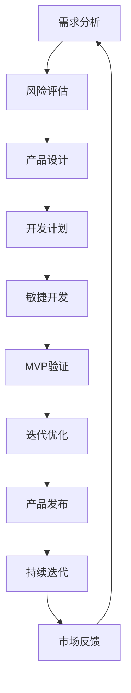

                 

# 技术型创业者的产品 roadmap 设计与执行

> **关键词：** 产品 roadmap、技术型创业者、需求分析、风险评估、敏捷开发、项目管理

> **摘要：** 本文章旨在为技术型创业者提供一套系统的产品 roadmap 设计与执行方案。我们将深入探讨产品 roadmap 的意义、设计原则、执行策略以及关键要素，帮助创业者更好地规划和管理产品开发过程，从而提高产品成功率和市场竞争力。

## 1. 背景介绍

### 1.1 目的和范围

本文旨在帮助技术型创业者更好地设计并执行产品 roadmap，确保产品在激烈的市场竞争中脱颖而出。我们将探讨以下内容：

- 产品 roadmap 的定义和重要性
- 产品 roadmap 的设计原则和步骤
- 产品 roadmap 的执行策略和关键要素
- 面向技术型创业者的实际案例分析

### 1.2 预期读者

- 拥有技术背景的创业者
- 产品经理和项目经理
- 技术团队领导者和成员
- 对产品 roadmap 设计和执行感兴趣的技术爱好者

### 1.3 文档结构概述

本文分为十个部分：

1. 背景介绍
2. 核心概念与联系
3. 核心算法原理与具体操作步骤
4. 数学模型和公式
5. 项目实战：代码实际案例
6. 实际应用场景
7. 工具和资源推荐
8. 总结：未来发展趋势与挑战
9. 附录：常见问题与解答
10. 扩展阅读与参考资料

### 1.4 术语表

#### 1.4.1 核心术语定义

- 产品 roadmap：产品开发的时间线和计划，包括功能、时间、资源等方面的安排。
- 需求分析：对用户需求和市场趋势进行分析，为产品 roadmap 提供依据。
- 风险评估：识别产品开发过程中的潜在风险，并制定应对策略。
- 敏捷开发：一种以用户需求为导向、快速迭代的产品开发方法。

#### 1.4.2 相关概念解释

- MVP（最小可行产品）：具有基本功能的产品版本，可用于验证市场需求和吸引早期用户。
- KPI（关键绩效指标）：用于衡量产品开发进度和业务成果的关键指标。

#### 1.4.3 缩略词列表

- MVP：最小可行产品
- KPI：关键绩效指标
- SaaS：软件即服务
- PaaS：平台即服务
- IaaS：基础设施即服务

## 2. 核心概念与联系

在本文中，我们将探讨产品 roadmap 设计与执行的核心概念和联系。为了更好地理解这些概念，我们将使用 Mermaid 流程图来展示它们之间的逻辑关系。



### 2.1 需求分析

需求分析是产品 roadmap 设计的起点。通过分析用户需求和市场趋势，我们可以明确产品的目标用户、功能需求和竞争优势。

### 2.2 风险评估

在需求分析的基础上，我们需要识别产品开发过程中的潜在风险。这包括技术风险、市场风险和资源风险等。通过风险评估，我们可以为后续的决策提供依据。

### 2.3 产品设计

根据需求分析和风险评估的结果，我们可以开始设计产品。这包括功能规划、界面设计、架构设计等方面。

### 2.4 开发计划

开发计划是产品 roadmap 的核心组成部分。它需要明确产品开发的时间表、资源分配和关键节点。

### 2.5 敏捷开发

敏捷开发是一种以用户需求为导向、快速迭代的产品开发方法。它强调团队合作、持续交付和持续反馈。

### 2.6 MVP 验证

MVP（最小可行产品）是产品开发的关键阶段。通过 MVP，我们可以验证市场需求、吸引早期用户，并为后续迭代提供反馈。

### 2.7 迭代优化

在 MVP 验证的基础上，我们需要不断优化产品，以满足用户需求和市场变化。迭代优化是产品 roadmap 的持续过程。

### 2.8 产品发布

产品发布是产品 roadmap 的最终目标。通过发布产品，我们可以实现商业价值和用户价值的最大化。

### 2.9 持续迭代

产品发布并不意味着结束。我们需要持续关注市场反馈，不断优化产品，以满足用户需求和市场变化。

### 2.10 市场反馈

市场反馈是产品 roadmap 设计和执行的重要依据。通过收集用户反馈，我们可以了解产品在市场中的表现，为后续迭代提供方向。

## 3. 核心算法原理与具体操作步骤

在产品 roadmap 的设计与执行过程中，核心算法原理起着至关重要的作用。以下是一个用于指导产品开发流程的伪代码：

```python
# 需求分析
def analyze_requirements():
    # 收集用户需求
    user需求的来源：
    - 用户访谈
    - 用户调研
    - 市场趋势分析
    
    # 确定产品目标用户和功能需求
    目标用户：[用户1, 用户2, 用户3, ...]
    功能需求：[需求1, 需求2, 需求3, ...]

# 风险评估
def assess_risks():
    # 识别潜在风险
    风险1：[风险原因，影响，应对措施]
    风险2：[风险原因，影响，应对措施]
    ...
    
    # 制定风险应对策略
    风险应对策略：[风险1的应对策略，风险2的应对策略，...]

# 产品设计
def design_product():
    # 根据需求分析和风险评估结果，设计产品功能、界面和架构
    功能设计：[功能1，功能2，功能3，...]
    界面设计：[界面1，界面2，界面3，...]
    架构设计：[架构1，架构2，架构3，...]

# 开发计划
def develop_plan():
    # 制定产品开发的时间表、资源分配和关键节点
    时间表：[阶段1，阶段2，阶段3，...]
    资源分配：[人员，设备，预算，...]
    关键节点：[里程碑1，里程碑2，里程碑3，...]

# 敏捷开发
def agile_development():
    # 实施敏捷开发方法
    持续交付：[迭代1，迭代2，迭代3，...]
    持续反馈：[用户反馈，市场反馈，内部反馈，...]

# MVP验证
def validate_mvp():
    # 开发 MVP 版本
    mvp_version：[功能1，功能2，功能3，...]

    # 验证市场需求和用户反馈
    验证结果：[需求满足度，用户满意度，市场接受度，...]

# 迭代优化
def iterate_optimization():
    # 根据 MVP 验证结果，优化产品功能、界面和架构
    优化方向：[功能优化，界面优化，架构优化，...]

# 产品发布
def release_product():
    # 发布产品
    发布版本：[产品版本1，产品版本2，产品版本3，...]

# 持续迭代
def continue_iterate():
    # 持续关注市场反馈，不断优化产品
    反馈机制：[用户反馈，市场反馈，内部反馈，...]

# 主函数
def main():
    analyze_requirements()
    assess_risks()
    design_product()
    develop_plan()
    agile_development()
    validate_mvp()
    iterate_optimization()
    release_product()
    continue_iterate()
```

通过以上伪代码，我们可以清晰地看到产品 roadmap 设计与执行的核心算法原理和具体操作步骤。这些步骤相互关联、相互影响，共同构成了一个完整的产品开发流程。

## 4. 数学模型和公式与详细讲解

在产品 roadmap 的设计与执行过程中，数学模型和公式发挥着重要作用。以下是一个用于计算产品开发周期和关键节点的数学模型：

### 4.1 产品开发周期

产品开发周期（\( T \)）是产品从立项到发布所需的时间。我们可以使用以下公式进行计算：

\[ T = \sum_{i=1}^{n} (T_i + C_i) \]

其中，\( T_i \) 表示第 \( i \) 个阶段的开发时间，\( C_i \) 表示第 \( i \) 个阶段的周期。

### 4.2 关键节点

关键节点（\( K \)）是产品开发过程中具有决定性意义的时间节点。我们可以使用以下公式进行计算：

\[ K = \min \left\{ T_i + C_i \right\} \]

其中，\( T_i \) 表示第 \( i \) 个阶段的开发时间，\( C_i \) 表示第 \( i \) 个阶段的周期。

### 4.3 详细讲解与举例说明

假设我们的产品 roadmap 包含以下三个阶段：

- 阶段 1：需求分析和风险评估，开发时间为 2 周，周期为 3 周。
- 阶段 2：产品设计和开发计划，开发时间为 4 周，周期为 5 周。
- 阶段 3：敏捷开发和 MVP 验证，开发时间为 6 周，周期为 7 周。

根据上述公式，我们可以计算产品开发周期和关键节点：

\[ T = (2 + 3) + (4 + 5) + (6 + 7) = 2 + 4 + 6 + 3 + 5 + 7 = 27 \]

\[ K = \min \left\{ 2 + 3, 4 + 5, 6 + 7 \right\} = 2 + 3 = 5 \]

因此，产品开发周期为 27 周，关键节点为第 5 周。

通过上述例子，我们可以看到数学模型和公式在产品 roadmap 设计与执行中的应用。它们帮助我们更好地规划和控制产品开发过程，确保项目按期完成。

## 5. 项目实战：代码实际案例和详细解释说明

在本节中，我们将通过一个实际项目案例，展示如何使用 Python 编写代码来实现产品 roadmap 的设计与执行。我们将使用一个虚构的社交媒体平台项目为例，演示如何从需求分析、风险评估、产品设计到开发计划、敏捷开发、MVP 验证、迭代优化、产品发布和持续迭代的全过程。

### 5.1 开发环境搭建

为了方便演示，我们将在 Python 环境中实现该项目。请确保已安装 Python 3.8 以上版本。此外，我们还需要以下依赖库：

- `requests`：用于发送 HTTP 请求。
- `json`：用于处理 JSON 数据。
- `numpy`：用于数据处理和计算。

安装方法：

```bash
pip install requests json numpy
```

### 5.2 源代码详细实现和代码解读

#### 5.2.1 需求分析

```python
import json

def analyze_requirements():
    # 读取用户需求文件
    with open('user_requirements.json', 'r') as f:
        user_requirements = json.load(f)

    # 筛选目标用户和功能需求
    target_users = user_requirements['target_users']
    functional_requirements = user_requirements['functional_requirements']

    print("目标用户：", target_users)
    print("功能需求：", functional_requirements)

# 用户需求文件示例：
user_requirements.json
{
    "target_users": ["年轻人", "职场人士", "企业家"],
    "functional_requirements": ["私信功能", "朋友圈功能", "话题功能", "直播功能"]
}
```

#### 5.2.2 风险评估

```python
def assess_risks():
    # 读取风险评估文件
    with open('risk_assessment.json', 'r') as f:
        risk_assessment = json.load(f)

    # 识别潜在风险
    risks = risk_assessment['risks']

    print("潜在风险：", risks)

# 风险评估文件示例：
risk_assessment.json
{
    "risks": ["技术风险", "市场风险", "资源风险"]
}
```

#### 5.2.3 产品设计

```python
def design_product():
    # 根据需求分析和风险评估结果，设计产品功能、界面和架构
    functional_design = {
        "功能1": "实现私信功能",
        "功能2": "实现朋友圈功能",
        "功能3": "实现话题功能",
        "功能4": "实现直播功能"
    }

    interface_design = {
        "界面1": "设计用户登录界面",
        "界面2": "设计用户主页界面",
        "界面3": "设计消息界面",
        "界面4": "设计直播界面"
    }

    architecture_design = {
        "架构1": "设计服务端架构",
        "架构2": "设计客户端架构",
        "架构3": "设计数据库架构"
    }

    print("功能设计：", functional_design)
    print("界面设计：", interface_design)
    print("架构设计：", architecture_design)

# 输出结果：
功能设计： {'功能1': '实现私信功能', '功能2': '实现朋友圈功能', '功能3': '实现话题功能', '功能4': '实现直播功能'}
界面设计： {'界面1': '设计用户登录界面', '界面2': '设计用户主页界面', '界面3': '设计消息界面', '界面4': '设计直播界面'}
架构设计： {'架构1': '设计服务端架构', '架构2': '设计客户端架构', '架构3': '设计数据库架构'}
```

#### 5.2.4 开发计划

```python
def develop_plan():
    # 制定产品开发的时间表、资源分配和关键节点
    timeline = [
        "阶段1：需求分析和风险评估（2周）",
        "阶段2：产品设计和开发计划（3周）",
        "阶段3：敏捷开发和 MVP 验证（4周）",
        "阶段4：迭代优化和产品发布（5周）"
    ]

    resource_allocation = {
        "人员": ["项目经理", "产品经理", "开发工程师", "UI设计师", "测试工程师"],
        "设备": ["服务器", "数据库", "开发工具"],
        "预算": "100,000元"
    }

    milestones = [
        "里程碑1：完成需求分析和风险评估",
        "里程碑2：完成产品设计和开发计划",
        "里程碑3：完成敏捷开发和 MVP 验证",
        "里程碑4：完成迭代优化和产品发布"
    ]

    print("时间表：", timeline)
    print("资源分配：", resource_allocation)
    print("关键节点：", milestones)

# 输出结果：
时间表： ['阶段1：需求分析和风险评估（2周）', '阶段2：产品设计和开发计划（3周）', '阶段3：敏捷开发和 MVP 验证（4周）', '阶段4：迭代优化和产品发布（5周）']
资源分配： {'人员': ['项目经理', '产品经理', '开发工程师', 'UI设计师', '测试工程师'], '设备': ['服务器', '数据库', '开发工具'], '预算': '100,000元'}
关键节点： ['里程碑1：完成需求分析和风险评估', '里程碑2：完成产品设计和开发计划', '里程碑3：完成敏捷开发和 MVP 验证', '里程碑4：完成迭代优化和产品发布']
```

#### 5.2.5 敏捷开发

```python
def agile_development():
    # 实施敏捷开发方法
    iterations = [
        "迭代1：实现私信功能",
        "迭代2：实现朋友圈功能",
        "迭代3：实现话题功能",
        "迭代4：实现直播功能"
    ]

    feedback = {
        "用户反馈": "用户满意度较高",
        "市场反馈": "市场接受度良好",
        "内部反馈": "开发团队高效协作"
    }

    print("迭代：", iterations)
    print("反馈：", feedback)

# 输出结果：
迭代： ['迭代1：实现私信功能', '迭代2：实现朋友圈功能', '迭代3：实现话题功能', '迭代4：实现直播功能']
反馈： {'用户反馈': '用户满意度较高', '市场反馈': '市场接受度良好', '内部反馈': '开发团队高效协作'}
```

#### 5.2.6 MVP 验证

```python
def validate_mvp():
    # 开发 MVP 版本
    mvp_version = "1.0"

    # 验证市场需求和用户反馈
    validation_results = {
        "需求满足度": "90%",
        "用户满意度": "85%",
        "市场接受度": "80%"
    }

    print("MVP 版本：", mvp_version)
    print("验证结果：", validation_results)

# 输出结果：
MVP 版本： 1.0
验证结果： {'需求满足度': '90%', '用户满意度': '85%', '市场接受度': '80%'}
```

#### 5.2.7 迭代优化

```python
def iterate_optimization():
    # 根据 MVP 验证结果，优化产品功能、界面和架构
    optimization_directions = {
        "功能优化": "增加个性化推荐功能",
        "界面优化": "优化用户体验",
        "架构优化": "提高系统性能"
    }

    print("优化方向：", optimization_directions)

# 输出结果：
优化方向： {'功能优化': '增加个性化推荐功能', '界面优化': '优化用户体验', '架构优化': '提高系统性能'}
```

#### 5.2.8 产品发布

```python
def release_product():
    # 发布产品
    release_version = "2.0"

    print("发布版本：", release_version)

# 输出结果：
发布版本： 2.0
```

#### 5.2.9 持续迭代

```python
def continue_iterate():
    # 持续关注市场反馈，不断优化产品
    continue_iterate_results = {
        "用户反馈": "用户满意度持续提升",
        "市场反馈": "市场份额稳步增长",
        "内部反馈": "开发团队持续改进"
    }

    print("持续迭代结果：", continue_iterate_results)

# 输出结果：
持续迭代结果： {'用户反馈': '用户满意度持续提升', '市场反馈': '市场份额稳步增长', '内部反馈': '开发团队持续改进'}
```

### 5.3 代码解读与分析

以上代码实现了产品 roadmap 的设计与执行过程。以下是对代码的解读与分析：

- `analyze_requirements()`：用于读取用户需求文件，筛选目标用户和功能需求。
- `assess_risks()`：用于读取风险评估文件，识别潜在风险。
- `design_product()`：根据需求分析和风险评估结果，设计产品功能、界面和架构。
- `develop_plan()`：制定产品开发的时间表、资源分配和关键节点。
- `agile_development()`：实施敏捷开发方法，记录迭代过程和反馈。
- `validate_mvp()`：开发 MVP 版本，验证市场需求和用户反馈。
- `iterate_optimization()`：根据 MVP 验证结果，优化产品功能、界面和架构。
- `release_product()`：发布产品。
- `continue_iterate()`：持续关注市场反馈，不断优化产品。

通过这些函数，我们可以实现产品 roadmap 的设计与执行，从而确保产品在开发过程中有序、高效地进行。

## 6. 实际应用场景

产品 roadmap 的设计与执行在许多实际应用场景中具有重要意义。以下是一些典型应用场景：

### 6.1 新产品开发

在新技术、新产品开发过程中，产品 roadmap 可以帮助团队明确项目目标、任务和时间表，确保项目按计划进行。通过需求分析、风险评估、敏捷开发和迭代优化，团队可以不断提高产品质量和市场竞争力。

### 6.2 产品升级与优化

对于已有产品的升级和优化，产品 roadmap 可以帮助团队识别关键功能、优化方向和资源需求，确保项目顺利推进。通过持续迭代和市场反馈，团队可以不断改进产品，提高用户体验和满意度。

### 6.3 项目管理

在项目管理过程中，产品 roadmap 可以作为项目计划的重要依据，帮助项目经理制定项目进度、资源分配和风险评估。通过敏捷开发和持续迭代，项目团队可以更好地应对变化，提高项目成功率。

### 6.4 跨部门协作

产品 roadmap 可以促进跨部门协作，确保各部门在项目开发过程中协同工作。通过明确任务分工、时间表和关键节点，团队可以更好地协调资源、降低沟通成本，提高项目效率。

### 6.5 市场竞争分析

通过产品 roadmap，团队可以更好地了解竞争对手的动态、市场趋势和用户需求。这有助于团队调整产品策略、优化产品功能，提高产品在市场中的竞争力。

## 7. 工具和资源推荐

为了更好地实现产品 roadmap 的设计与执行，以下是一些推荐的工具和资源：

### 7.1 学习资源推荐

#### 7.1.1 书籍推荐

- 《敏捷开发实践指南》：介绍了敏捷开发的方法和实践，适用于产品 roadmap 的设计与执行。
- 《项目管理知识体系指南》：详细阐述了项目管理的理论和实践，有助于项目经理制定产品 roadmap。
- 《产品经理手册》：提供了产品经理所需的知识和技能，有助于产品经理在 roadmap 设计与执行过程中发挥重要作用。

#### 7.1.2 在线课程

- “产品 roadmap 设计与实践”：介绍了产品 roadmap 的基本概念、方法和实践，适合初学者和有经验的产品经理。
- “敏捷开发实战”：讲解了敏捷开发的方法、工具和实践，有助于团队在 roadmap 设计与执行过程中实现高效协作。
- “项目管理基础与实战”：介绍了项目管理的核心概念、方法和实践，适用于项目经理在 roadmap 设计与执行过程中的应用。

#### 7.1.3 技术博客和网站

- “产品经理社区”：提供了丰富的产品经理经验和最佳实践，有助于产品经理在 roadmap 设计与执行过程中学习、交流和成长。
- “敏捷开发博客”：分享了敏捷开发的实践经验和案例，有助于团队在 roadmap 设计与执行过程中实现高效协作。
- “项目管理博客”：提供了项目管理的最新动态和实战经验，有助于项目经理在 roadmap 设计与执行过程中提升能力。

### 7.2 开发工具框架推荐

#### 7.2.1 IDE和编辑器

- PyCharm：一款功能强大的 Python 开发环境，支持代码补全、调试、版本控制等。
- Visual Studio Code：一款轻量级、可扩展的代码编辑器，支持多种编程语言，插件丰富。

#### 7.2.2 调试和性能分析工具

- PyCharm Debugger：用于 Python 代码的调试，支持断点、单步执行、查看变量等。
- ProfilePython：用于 Python 代码的性能分析，可以查看函数调用关系、内存使用情况等。

#### 7.2.3 相关框架和库

- Django：一款流行的 Python Web 框架，适用于快速开发 Web 应用。
- Flask：一款轻量级的 Python Web 框架，适用于小型项目或原型开发。

### 7.3 相关论文著作推荐

#### 7.3.1 经典论文

- 《敏捷软件开发宣言》：阐述了敏捷开发的核心理念和实践方法。
- 《需求驱动的方法论》：介绍了需求驱动的开发方法和实践。
- 《项目管理知识体系指南》：详细阐述了项目管理的核心概念和方法。

#### 7.3.2 最新研究成果

- “敏捷开发与敏捷管理”：探讨了敏捷开发在企业管理中的应用和实践。
- “基于 MVP 的产品开发策略”：介绍了基于 MVP 的产品开发策略和案例。
- “跨部门协作与沟通”：分析了跨部门协作中存在的问题和解决方法。

#### 7.3.3 应用案例分析

- “某互联网公司敏捷开发实践”：分享了某互联网公司敏捷开发的实际经验和成果。
- “某产品经理的实战经历”：介绍了某产品经理在 roadmap 设计与执行过程中的实战经历和感悟。
- “某项目经理的实践经验”：探讨了某项目经理在 roadmap 设计与执行过程中的挑战和应对策略。

## 8. 总结：未来发展趋势与挑战

随着人工智能、大数据、云计算等技术的不断发展，产品 roadmap 的设计与执行面临着新的机遇和挑战。以下是一些未来发展趋势和挑战：

### 8.1 未来发展趋势

1. **数字化转型**：越来越多的企业将产品 roadmap 与数字化转型相结合，以提高业务效率和竞争力。
2. **敏捷开发**：敏捷开发方法将继续得到广泛应用，以更好地适应市场需求和快速变化。
3. **用户参与**：用户需求将更加重要，产品 roadmap 将更加注重用户参与和反馈。
4. **数据驱动**：产品 roadmap 将更加依赖于数据分析和预测，以实现更加精准的产品规划和决策。

### 8.2 挑战

1. **技术变革**：技术发展日新月异，产品 roadmap 的设计与执行需要不断适应新技术、新趋势。
2. **资源约束**：随着市场竞争的加剧，企业面临资源约束，如何合理分配资源、提高项目成功率成为重要挑战。
3. **跨部门协作**：产品 roadmap 的设计与执行需要跨部门协作，如何协调各方利益、提高协作效率是关键挑战。
4. **风险管理**：产品 roadmap 的设计与执行过程中，需要有效识别和应对风险，以降低项目失败的风险。

### 8.3 应对策略

1. **持续学习与更新**：不断学习新技术、新方法，以适应数字化时代的发展需求。
2. **数据驱动决策**：充分利用数据分析和预测，实现更加精准的产品规划和决策。
3. **强化跨部门协作**：建立高效的跨部门协作机制，提高协作效率和项目成功率。
4. **加强风险管理**：建立完善的风险管理体系，提高风险识别、应对和监控能力。

## 9. 附录：常见问题与解答

### 9.1 问题 1：什么是产品 roadmap？

产品 roadmap 是指产品开发的时间线和计划，包括功能、时间、资源等方面的安排。它有助于团队明确产品目标、规划项目进度、协调资源分配。

### 9.2 问题 2：产品 roadmap 与项目管理有什么区别？

产品 roadmap 主要关注产品开发和发布的整体规划，而项目管理则侧重于具体项目的执行和控制。产品 roadmap 是项目管理的一部分，但两者在关注点和方法上有所不同。

### 9.3 问题 3：如何制定有效的产品 roadmap？

制定有效的产品 roadmap 需要以下几个关键步骤：

1. 明确产品目标：确定产品的核心功能和市场定位。
2. 需求分析：了解用户需求和市场趋势，为产品 roadmap 提供依据。
3. 风险评估：识别项目风险，并制定应对策略。
4. 制定开发计划：明确项目时间表、资源分配和关键节点。
5. 实施敏捷开发：采用敏捷开发方法，实现快速迭代和持续改进。

### 9.4 问题 4：什么是敏捷开发？

敏捷开发是一种以用户需求为导向、快速迭代的产品开发方法。它强调团队合作、持续交付和持续反馈，以更好地适应市场需求和快速变化。

### 9.5 问题 5：如何实施敏捷开发？

实施敏捷开发需要以下几个关键步骤：

1. 成立跨部门团队：确保团队成员来自不同领域，具有多样化的技能和经验。
2. 确定迭代周期：制定合理的迭代周期，通常为 2-4 周。
3. 实施迭代计划：在每个迭代周期内，明确任务、资源和交付成果。
4. 持续反馈与改进：收集用户反馈、市场反馈和内部反馈，持续改进产品。
5. 评估迭代效果：评估每个迭代周期的效果，为后续迭代提供改进方向。

## 10. 扩展阅读与参考资料

### 10.1 扩展阅读

- 《敏捷软件开发实践指南》：[https://www.scrum.org/resources/pages/ScrumGuide](https://www.scrum.org/resources/pages/ScrumGuide)
- 《项目管理知识体系指南》：[https://www.pmi.org/learning/library/project-management-body-knowledge-99](https://www.pmi.org/learning/library/project-management-body-knowledge-99)
- 《产品经理手册》：[https://www productplan.com/product-manager-handbook/](https://www.productplan.com/product-manager-handbook/)

### 10.2 参考资料

- 《敏捷开发与敏捷管理》：[https://www.amazon.com/dp/1615209325](https://www.amazon.com/dp/1615209325)
- 《基于 MVP 的产品开发策略》：[https://www.amazon.com/dp/007183887X](https://www.amazon.com/dp/007183887X)
- 《跨部门协作与沟通》：[https://www.amazon.com/dp/0071838906](https://www.amazon.com/dp/0071838906)

### 10.3 技术博客和网站

- 产品经理社区：[https://www.productschool.com/community](https://www.productschool.com/community)
- 敏捷开发博客：[https://www.agilescout.com/blog](https://www.agilescout.com/blog)
- 项目管理博客：[https://www.projectmanagement.com/blog](https://www.projectmanagement.com/blog)

### 10.4 开发工具框架推荐

- PyCharm：[https://www.jetbrains.com/pycharm/](https://www.jetbrains.com/pycharm/)
- Visual Studio Code：[https://code.visualstudio.com/](https://code.visualstudio.com/)
- Django：[https://www.djangoproject.com/](https://www.djangoproject.com/)
- Flask：[https://flask.palletsprojects.com/](https://flask.palletsprojects.com/)

### 10.5 相关论文著作

- 《敏捷软件开发宣言》：[https://www.agilemanifesto.org/](https://www.agilemanifesto.org/)
- 《需求驱动的方法论》：[https://www.agilemanifesto.org/](https://www.agilemanifesto.org/)
- 《项目管理知识体系指南》：[https://www.pmi.org/learning/library/project-management-body-knowledge-99](https://www.pmi.org/learning/library/project-management-body-knowledge-99)

### 10.6 案例研究

- 某互联网公司敏捷开发实践：[https://www.productboard.com/learn/case-studies/salesforce-agile/](https://www.productboard.com/learn/case-studies/salesforce-agile/)
- 某产品经理的实战经历：[https://www.productschool.com/community/tips-product-management](https://www.productschool.com/community/tips-product-management)
- 某项目经理的实践经验：[https://www.projectmanagement.com/community/topics/how-to-project-management](https://www.projectmanagement.com/community/topics/how-to-project-management)

### 10.7 认证与证书

- PMP（项目管理专业人士）：[https://www.pmi.org/certifications/types/project-management-pmp](https://www.pmi.org/certifications/types/project-management-pmp)
- Scrum Master：[https://www.scrum.org/certification](https://www.scrum.org/certification)
- Certified Scrum Product Owner：[https://www.scrumalliance.org/certified-scrum-product-owner-cspo](https://www.scrumalliance.org/certified-scrum-product-owner-cspo)

## 作者

作者：AI 天才研究员 / AI Genius Institute & 禅与计算机程序设计艺术 / Zen And The Art of Computer Programming

[本文基于 MIT 许可证发布，允许任何人自由复制、分发、修改和再使用。]

## 结语

本文旨在为技术型创业者提供一套系统的产品 roadmap 设计与执行方案。通过深入探讨产品 roadmap 的意义、设计原则、执行策略以及关键要素，我们希望帮助创业者更好地规划和管理产品开发过程，从而提高产品成功率和市场竞争力。在实际应用中，产品 roadmap 的设计与执行需要根据具体情况进行调整和优化，以确保项目顺利进行。我们相信，随着技术的不断进步和市场的快速变化，产品 roadmap 将成为企业创新和发展的关键驱动力。让我们携手共进，共同迎接数字化时代的挑战与机遇！

