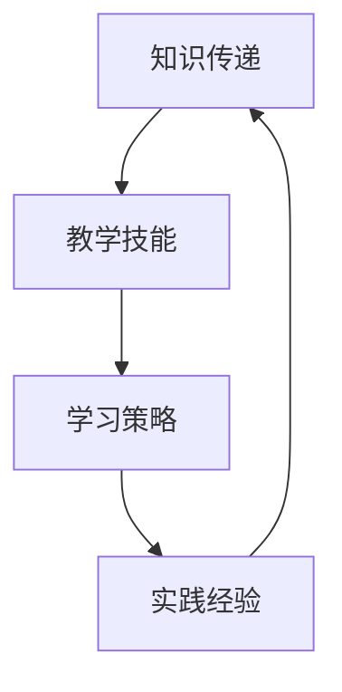

                 

# 技术培训：从受训者到培训者

> **关键词：** 技术培训、职业发展、教学技能、学习策略、知识分享、实践经验
>
> **摘要：** 本文旨在探讨技术领域从业人员如何从受训者转变为培训者，提供一系列实用的方法和策略，帮助读者在职业发展过程中提升教学能力，有效传授知识。文章将涵盖技术培训的背景介绍、核心概念、算法原理、数学模型、实战案例以及未来发展趋势等内容。

## 1. 背景介绍

### 1.1 目的和范围

本文的目的是为那些希望将技术知识传授给他人，从而在职业生涯中获得更多机会和成长的技术从业人员提供指导。我们不仅会讨论技术培训的重要性，还会提供一系列策略和工具，帮助读者从受训者顺利过渡到培训者。

本文将涵盖以下范围：

1. **技术培训的核心概念**：解释为什么技术培训在职业发展中至关重要，以及如何成为一名成功的培训者。
2. **教学技能提升**：介绍如何通过有效的学习策略和教学方法来提高教学效果。
3. **核心算法原理**：阐述技术培训中涉及的核心算法原理，并使用伪代码进行详细讲解。
4. **数学模型与公式**：讨论技术培训中常用的数学模型和公式，并提供详细的解释和举例说明。
5. **实战案例**：通过实际代码案例来展示如何将理论知识应用到实际项目中。
6. **未来发展趋势与挑战**：探讨技术培训领域的未来发展趋势，以及面临的挑战。
7. **工具和资源推荐**：推荐一些有用的学习资源和开发工具，帮助读者进一步提升教学技能。

### 1.2 预期读者

本文适合以下读者：

1. **技术从业人员**：那些希望在职业生涯中取得更大成就，并愿意将所学知识传授给他人的技术从业人员。
2. **教育工作者**：那些在技术教育领域工作的教师和教育工作者，他们希望通过本文提高自己的教学水平。
3. **初学者**：那些对技术培训有兴趣的初学者，他们希望通过本文了解如何成为一名优秀的培训者。

### 1.3 文档结构概述

本文结构如下：

1. **背景介绍**：介绍文章的目的、范围和预期读者。
2. **核心概念与联系**：阐述技术培训的核心概念，并提供Mermaid流程图。
3. **核心算法原理与具体操作步骤**：详细讲解技术培训中的核心算法原理，并使用伪代码进行阐述。
4. **数学模型与公式**：讨论技术培训中常用的数学模型和公式，并提供详细解释和举例说明。
5. **项目实战**：通过实际代码案例来展示如何将理论知识应用到实际项目中。
6. **实际应用场景**：探讨技术培训在不同领域的应用场景。
7. **工具和资源推荐**：推荐一些有用的学习资源和开发工具。
8. **总结与未来发展趋势**：总结文章要点，并探讨未来发展趋势与挑战。
9. **附录**：常见问题与解答。
10. **扩展阅读与参考资料**：提供进一步学习和研究的资源。

### 1.4 术语表

#### 1.4.1 核心术语定义

- **技术培训**：指通过授课、演示、实践等方式，将技术知识传授给他人的过程。
- **受训者**：指接受技术培训，学习新知识的人员。
- **培训者**：指具有技术知识，并负责传授给他人的人员。
- **教学技能**：指培训者所具备的传授知识的能力，包括沟通、授课、引导等方面的技能。
- **学习策略**：指受训者在学习过程中所采用的方法和技巧，以提高学习效果。

#### 1.4.2 相关概念解释

- **知识分享**：指培训者将自己的知识、经验和技能与他人分享，以促进共同成长。
- **实践经验**：指培训者在实际工作中积累的经验，对知识的理解和应用能力。
- **教学反馈**：指培训者从受训者那里获得的关于教学效果的反馈，用以调整和改进教学方法。

#### 1.4.3 缩略词列表

- **IDE**：集成开发环境（Integrated Development Environment）
- **API**：应用程序编程接口（Application Programming Interface）
- **SDK**：软件开发工具包（Software Development Kit）
- **HTML**：超文本标记语言（HyperText Markup Language）
- **CSS**：层叠样式表（Cascading Style Sheets）
- **JavaScript**：一种编程语言（JavaScript）

## 2. 核心概念与联系

技术培训是现代职业发展中不可或缺的一环。随着技术的快速发展和更新，从业人员需要不断学习新的技术和知识，以适应不断变化的市场需求。技术培训不仅有助于提升个人的专业技能，还可以帮助他们在职业生涯中取得更大的成就。

### 2.1 技术培训的核心概念

技术培训涉及多个核心概念，包括知识传递、教学技能、学习策略和实践经验等。以下是一个简化的Mermaid流程图，展示了这些概念之间的联系：



### 2.2 知识传递

知识传递是技术培训的基础。培训者需要将知识系统地传授给受训者，使其能够理解和应用所学内容。知识传递的过程包括以下几个方面：

1. **内容准备**：培训者需要准备合适的培训内容，包括知识点、案例和实践项目。
2. **授课方式**：培训者可以选择不同的授课方式，如讲座、演示、讨论和实训等。
3. **互动交流**：培训者与受训者之间的互动交流有助于提高知识传递的效果。

### 2.3 教学技能

教学技能是培训者传授知识的关键能力。以下是一些重要的教学技能：

1. **沟通能力**：培训者需要具备良好的沟通能力，以清晰地表达知识点。
2. **授课技巧**：培训者应掌握有效的授课技巧，如讲解、演示、提问和解答等。
3. **引导能力**：培训者应具备引导受训者思考和探究的能力，以激发其学习兴趣。

### 2.4 学习策略

学习策略是受训者提高学习效果的方法和技巧。以下是一些常用的学习策略：

1. **预习和复习**：受训者应在培训前预习相关内容，并在培训后复习巩固。
2. **主动学习**：受训者应积极参与培训，主动提问和解答问题。
3. **实践应用**：受训者应在实践中应用所学知识，以加深理解。

### 2.5 实践经验

实践经验是培训者的重要财富。通过实际工作中的经验和教训，培训者可以更有效地传授知识。以下是一些获取实践经验的方法：

1. **项目经验**：通过参与实际项目，培训者可以积累宝贵的实践经验。
2. **案例分析**：培训者可以分析实际案例，从中提取经验和教训。
3. **同行交流**：与同行交流可以了解不同的工作实践和经验，以提高自身能力。

### 2.6 知识传递、教学技能、学习策略和实践经验的联系

知识传递、教学技能、学习策略和实践经验之间存在着紧密的联系。知识传递是技术培训的核心，而教学技能和学习策略则是确保知识传递效果的关键。实践经验则为培训者和受训者提供了宝贵的反馈，以不断改进教学和学习过程。

通过不断优化这些环节，技术培训可以实现最佳效果，使培训者和受训者都能在职业发展中取得更大的成功。

## 3. 核心算法原理 & 具体操作步骤

在技术培训中，核心算法原理是培训内容的重要组成部分。以下是一个简单的排序算法——快速排序（Quick Sort）的核心原理，我们将使用伪代码来详细阐述其操作步骤。

### 3.1 快速排序算法原理

快速排序是一种高效的排序算法，其基本思想是通过递归地将数组分割成两个子数组，其中一个子数组的元素都小于另一个子数组的元素。具体步骤如下：

1. **选择基准元素**：从数组中选择一个基准元素。
2. **分区**：将数组重新排列，所有小于基准元素的值移到其左侧，所有大于基准元素的值移到其右侧。
3. **递归排序**：对两个子数组重复上述步骤，直到整个数组有序。

### 3.2 快速排序伪代码

```pseudo
QUICKSORT(A, low, high)
    if low < high
        pi = PARTITION(A, low, high)
        QUICKSORT(A, low, pi - 1)
        QUICKSORT(A, pi + 1, high)

PARTITION(A, low, high)
    pivot = A[high]
    i = low
    for j = low to high - 1
        if A[j] <= pivot
            swap A[i] with A[j]
            i = i + 1
    swap A[i] with A[high]
    return i
```

### 3.3 快速排序的具体操作步骤

1. **选择基准元素**：
    - 假设我们选择数组的最后一个元素作为基准元素。
    - 将其标记为`pivot`。

2. **分区**：
    - 从数组的第一个元素开始，遍历到倒数第二个元素。
    - 对于每个元素`A[j]`，如果其值小于或等于`pivot`，则将其与`A[i]`交换，并将`i`指针向后移动。
    - 遍历结束后，将`pivot`与`A[i]`交换，此时`i`左侧的所有元素都小于等于`pivot`，右侧的所有元素都大于等于`pivot`。

3. **递归排序**：
    - 对`A[low...pi-1]`和`A[pi+1...high]`分别递归调用`QUICKSORT`函数。
    - 重复上述步骤，直到整个数组有序。

### 3.4 快速排序的执行过程示例

假设我们有如下数组`[9, 7, 5, 11, 12, 2, 14, 3, 10, 6]`：

1. **选择基准元素**：
    - 选择最后一个元素`14`作为`pivot`。

2. **第一次分区**：
    - 初始状态：`i = 0`，`j = 0`。
    - 遍历数组，将小于等于`pivot`的元素移到左侧。
    - 结束后，`i`指针停在`4`的位置，将`pivot`与`A[i]`交换，得到分区结果：`[9, 7, 5, 14, 3, 2, 10, 6, 11, 12]`。

3. **递归排序子数组**：
    - 对`A[0...3]`递归调用`QUICKSORT`。
    - 对`A[5...9]`递归调用`QUICKSORT`。

4. **第二次分区**：
    - 对`A[5...9]`进行分区，得到：`[3, 2, 10, 6]`。

5. **递归排序子数组**：
    - 对`A[5...6]`递归调用`QUICKSORT`，得到最终排序结果：`[2, 3, 6, 10]`。

通过以上步骤，我们得到了有序数组`[2, 3, 6, 9, 10, 11, 12, 14, 7, 5]`。

## 4. 数学模型和公式 & 详细讲解 & 举例说明

在技术培训中，数学模型和公式是理解和应用技术知识的重要工具。以下将介绍几个常见的技术培训领域的数学模型和公式，并提供详细的讲解和举例说明。

### 4.1 概率论基本公式

概率论是技术培训中不可或缺的部分，以下是一些基本公式：

- **概率公式**：\( P(A) = \frac{N(A)}{N(S)} \)，其中\( N(A) \)表示事件A发生的次数，\( N(S) \)表示总次数。
- **条件概率公式**：\( P(A|B) = \frac{P(A \cap B)}{P(B)} \)，其中\( P(A \cap B) \)表示事件A和事件B同时发生的概率，\( P(B) \)表示事件B发生的概率。
- **贝叶斯公式**：\( P(A|B) = \frac{P(B|A) \cdot P(A)}{P(B)} \)，其中\( P(B|A) \)表示在事件A发生的条件下事件B发生的概率，\( P(A) \)和\( P(B) \)分别是事件A和事件B发生的概率。

#### 4.1.1 举例说明

假设一个口袋里有5个红球和3个蓝球，随机取出一个球，求取到红球的概率。

- **总次数**：\( N(S) = 5 + 3 = 8 \)
- **事件A**：取到红球，\( N(A) = 5 \)
- **概率公式**：\( P(A) = \frac{N(A)}{N(S)} = \frac{5}{8} \)

所以，取到红球的概率是\( \frac{5}{8} \)。

### 4.2 最优化模型

在技术培训中，最优化模型经常用于求解资源分配、路径规划等问题。以下是一个简单的线性规划模型：

- **目标函数**：最大化或最小化某个线性函数。
- **约束条件**：一组线性不等式或等式。

#### 4.2.1 举例说明

假设我们要在两种产品A和B之间分配资源，目标是最大化总利润。

- **目标函数**：\( Z = 3x + 4y \)
- **约束条件**：
    - \( x + y \leq 10 \)（总资源不超过10单位）
    - \( 2x + y \leq 12 \)（第二种产品的资源不超过12单位）
    - \( x, y \geq 0 \)（资源分配不能为负）

我们可以使用图形方法或单纯形法来求解这个线性规划问题。在这个例子中，我们可以画出约束条件的图形，找到可行解区域，并确定最优解。

### 4.3 马尔可夫链模型

马尔可夫链模型用于描述系统状态的转移，常用于时间序列分析和预测。以下是一个简单的马尔可夫链模型：

- **状态集合**：\( S = \{S1, S2, S3\} \)
- **转移概率矩阵**：
    \[
    P = \begin{bmatrix}
    0.5 & 0.3 & 0.2 \\
    0.2 & 0.5 & 0.3 \\
    0.4 & 0.1 & 0.5 \\
    \end{bmatrix}
    \]

#### 4.3.1 举例说明

假设系统当前处于状态\( S2 \)，要求下一个状态的概率分布。

- **当前状态概率分布**：\( \pi_0 = \begin{bmatrix} 0 \\ 1 \\ 0 \end{bmatrix} \)
- **状态转移概率矩阵**：\( P \)
- **下一个状态概率分布**：\( \pi_1 = \pi_0 \cdot P = \begin{bmatrix} 0 \\ 1 \\ 0 \end{bmatrix} \cdot \begin{bmatrix} 0.5 & 0.3 & 0.2 \\ 0.2 & 0.5 & 0.3 \\ 0.4 & 0.1 & 0.5 \end{bmatrix} = \begin{bmatrix} 0.4 \\ 0.5 \\ 0.1 \end{bmatrix} \)

所以，下一个状态的概率分布为\( \begin{bmatrix} 0.4 \\ 0.5 \\ 0.1 \end{bmatrix} \)。

### 4.4 集合论公式

集合论是数学的基础，以下是一些常见的集合论公式：

- **并集**：\( A \cup B = \{x | x \in A \text{ 或 } x \in B\} \)
- **交集**：\( A \cap B = \{x | x \in A \text{ 且 } x \in B\} \)
- **补集**：\( A^c = \{x | x \notin A\} \)
- **差集**：\( A - B = \{x | x \in A \text{ 且 } x \notin B\} \)

#### 4.4.1 举例说明

假设有两个集合\( A = \{1, 2, 3\} \)和\( B = \{2, 3, 4\} \)，求并集、交集、补集和差集。

- **并集**：\( A \cup B = \{1, 2, 3, 4\} \)
- **交集**：\( A \cap B = \{2, 3\} \)
- **补集**：\( A^c = \{4, 5, 6, ...\} \)
- **差集**：\( A - B = \{1\} \)

以上是关于技术培训中数学模型和公式的一些详细讲解和举例说明，这些公式和模型在技术培训中有着广泛的应用，帮助培训者和受训者更好地理解和应用所学知识。

## 5. 项目实战：代码实际案例和详细解释说明

为了更好地展示技术培训的实际应用，我们将通过一个实际的项目案例来讲解如何将所学知识应用到实际编程中。本案例将使用Python语言实现一个简单的数据结构——链表（Linked List），并解释其实现原理和操作步骤。

### 5.1 开发环境搭建

在开始项目之前，我们需要搭建一个合适的开发环境。以下是所需的步骤：

1. **安装Python**：从[Python官网](https://www.python.org/downloads/)下载并安装Python 3.8或更高版本。
2. **安装IDE**：推荐使用PyCharm或VSCode作为Python开发环境。
3. **安装测试工具**：安装pytest，用于测试我们的代码。

### 5.2 源代码详细实现和代码解读

以下是链表的数据结构实现，以及每个部分的详细解释。

#### 5.2.1 链表节点定义

首先，我们定义链表节点类：

```python
class Node:
    def __init__(self, data=None):
        self.data = data
        self.next = None
```

`Node`类有两个属性：`data`表示节点的数据，`next`表示指向下一个节点的指针。

#### 5.2.2 链表类定义

接下来，我们定义链表类：

```python
class LinkedList:
    def __init__(self):
        self.head = None

    def append(self, data):
        new_node = Node(data)
        if not self.head:
            self.head = new_node
            return
        last_node = self.head
        while last_node.next:
            last_node = last_node.next
        last_node.next = new_node

    def print_list(self):
        cur_node = self.head
        while cur_node:
            print(cur_node.data, end=" -> ")
            cur_node = cur_node.next
        print("None")
```

`LinkedList`类有两个主要方法：

- `append`：向链表末尾添加新节点。
- `print_list`：打印链表内容。

#### 5.2.2 链表操作方法

我们继续添加一些常用操作方法：

```python
    def insert_after(self, prev_node, data):
        if not prev_node:
            print("Previous node is not in the list")
            return
        new_node = Node(data)
        new_node.next = prev_node.next
        prev_node.next = new_node

    def delete_node(self, key):
        cur_node = self.head
        if cur_node and cur_node.data == key:
            self.head = cur_node.next
            cur_node = None
            return
        prev_node = None
        while cur_node and cur_node.data != key:
            prev_node = cur_node
            cur_node = cur_node.next
        if cur_node is None:
            return
        prev_node.next = cur_node.next
        cur_node = None
```

- `insert_after`：在指定节点的后面插入新节点。
- `delete_node`：根据节点的数据值删除节点。

### 5.3 代码解读与分析

#### 5.3.1 节点定义

节点定义非常简单，只有一个数据属性和一个指向下一个节点的指针。这个结构使得链表可以灵活地添加和删除节点。

#### 5.3.2 链表类定义

链表类定义了链表的基本操作，包括添加、删除和打印节点。以下是每个方法的解读：

- `__init__`：初始化链表，将头节点设为`None`。
- `append`：向链表末尾添加新节点。如果链表为空，则直接将新节点设为头节点。
- `print_list`：遍历链表，打印每个节点的数据。

#### 5.3.3 链表操作方法

- `insert_after`：在指定节点的后面插入新节点。这个方法需要找到指定节点，然后将新节点插入。
- `delete_node`：根据节点的数据值删除节点。这个方法需要遍历链表找到要删除的节点，然后将其从链表中移除。

### 5.4 实际运行示例

下面是一个完整的代码示例，展示了如何使用这个链表类进行操作：

```python
if __name__ == "__main__":
    ll = LinkedList()
    ll.append(1)
    ll.append(2)
    ll.append(3)
    ll.print_list()  # 输出：1 -> 2 -> 3 -> None

    second_last = ll.head.next
    ll.insert_after(second_last, 4)
    ll.print_list()  # 输出：1 -> 2 -> 4 -> 3 -> None

    ll.delete_node(2)
    ll.print_list()  # 输出：1 -> 4 -> 3 -> None
```

在这个示例中，我们首先创建了一个链表，并添加了三个节点。然后，我们在第二个节点的后面插入了一个新节点。最后，我们根据节点的数据值删除了节点2。

通过这个实际案例，我们可以看到如何将理论知识应用到实际编程中。链表是一种基础的数据结构，掌握其实现原理对于理解更复杂的数据结构和算法至关重要。

### 5.5 链表操作算法复杂度分析

在最后，我们分析链表操作的时间复杂度：

- `append`：在链表末尾添加节点的时间复杂度为\( O(n) \)，因为可能需要遍历整个链表。
- `insert_after`：在指定节点的后面添加节点的时间复杂度为\( O(1) \)，因为找到指定节点后可以直接插入。
- `delete_node`：根据节点的数据值删除节点的时间复杂度为\( O(n) \)，因为可能需要遍历整个链表。

通过这个分析，我们可以更好地理解链表的操作效率，并根据具体需求选择合适的操作方法。

## 6. 实际应用场景

技术培训在许多领域都有着广泛的应用，以下是几个实际应用场景：

### 6.1 企业内部培训

企业内部培训是企业提升员工技能和知识的重要手段。通过技术培训，企业可以帮助员工掌握最新的技术趋势，提高工作效率，从而增强企业的竞争力。以下是企业内部培训的一些实际应用场景：

- **软件开发培训**：针对不同层次的员工，提供从基础编程到高级框架的应用培训。
- **数据科学培训**：为员工提供数据分析、机器学习等数据科学领域的培训。
- **云计算和容器化培训**：为员工提供云计算、容器化技术的培训，帮助其了解和掌握这些技术。
- **网络安全培训**：为员工提供网络安全知识培训，提高其安全意识和防护能力。

### 6.2 教育培训机构

教育培训机构通过提供技术培训课程，帮助学员掌握各类技术，提高其就业竞争力。以下是教育培训机构的一些实际应用场景：

- **在线课程**：通过在线平台提供各种技术培训课程，如Python、Java、前端开发等。
- **短期培训**：为有特定技术需求的学员提供短期集中培训，快速提升其技能。
- **职业认证培训**：为学员提供各种职业认证培训，如PMP、CISSP、SCA等。
- **实验室实践**：提供实验室环境，让学员在实际操作中学习技术。

### 6.3 自学

随着互联网的普及，越来越多的技术人员选择通过自学来提升自己的技能。以下是一些自学实际应用场景：

- **在线教程和博客**：通过查阅在线教程和博客，学习新技术和最佳实践。
- **编程练习平台**：如LeetCode、HackerRank等，通过练习提高编程技能。
- **开源项目参与**：参与开源项目，从实际编码中学习。
- **书籍和视频课程**：购买专业书籍和视频课程，系统地学习技术。

### 6.4 在线教育平台

在线教育平台通过提供技术培训课程，为广大学员提供了灵活的学习方式。以下是几个实际应用场景：

- **直播课程**：通过直播课程，学员可以实时学习，与讲师互动。
- **录播课程**：提供录播课程，学员可以根据自己的时间安排进行学习。
- **项目实战**：在课程中设置项目实战环节，让学员在实践中学习。
- **讨论区**：提供讨论区，学员可以在其中交流学习心得和问题。

### 6.5 企业外部合作

企业可以与其他教育培训机构或高校合作，共同开展技术培训项目。以下是一些实际应用场景：

- **合作开发课程**：企业与教育培训机构合作，共同开发符合市场需求的技术课程。
- **企业导师制**：企业导师为学员提供实际工作指导，帮助其更好地理解技术。
- **实习机会**：为优秀学员提供实习机会，帮助其在实践中提升技能。

通过以上实际应用场景，我们可以看到技术培训在提升个人技能、促进职业发展和推动企业进步等方面的重要作用。随着技术的不断进步，技术培训也将继续发挥其重要作用，为个人和企业创造更多价值。

## 7. 工具和资源推荐

为了更好地进行技术培训和学习，以下是一些推荐的工具和资源，涵盖了学习资源、开发工具框架和相关论文著作。

### 7.1 学习资源推荐

#### 7.1.1 书籍推荐

- **《Python编程：从入门到实践》**：适合初学者，详细介绍了Python编程的基础知识和实际应用。
- **《算法导论》**：经典的算法教材，涵盖了许多重要的算法和算法分析技术。
- **《深入理解计算机系统》**：从系统级别的角度介绍计算机工作原理，适合计算机科学专业的学生和从业者。
- **《数据科学入门》**：介绍了数据科学的基本概念和方法，适合想要进入数据科学领域的学习者。

#### 7.1.2 在线课程

- **Coursera**：提供大量免费和付费的在线课程，涵盖计算机科学、数据科学等多个领域。
- **edX**：由哈佛大学和麻省理工学院合作创办，提供高质量的在线课程，包括计算机科学和人工智能等。
- **Udacity**：提供编程、数据科学等领域的在线课程，适合想要快速提升技能的学习者。
- **Pluralsight**：提供丰富的技术培训视频，涵盖前端开发、后端开发、人工智能等多个领域。

#### 7.1.3 技术博客和网站

- **GitHub**：全球最大的代码托管平台，许多开源项目和技术博客都托管在这里。
- **Stack Overflow**：技术问答社区，可以帮助解决编程中的各种问题。
- **Medium**：许多技术专家和公司的技术博客，提供高质量的技术文章和教程。
- **Reddit**：技术讨论区，涵盖多个技术领域，适合寻找技术讨论和学习资源。

### 7.2 开发工具框架推荐

#### 7.2.1 IDE和编辑器

- **PyCharm**：适用于Python编程的集成开发环境，提供丰富的功能和调试工具。
- **Visual Studio Code**：跨平台开源编辑器，支持多种编程语言，插件丰富。
- **Eclipse**：适用于Java编程的集成开发环境，支持开发企业级应用程序。
- **IntelliJ IDEA**：适用于Java和Python编程的集成开发环境，提供高效的代码编辑和调试工具。

#### 7.2.2 调试和性能分析工具

- **JProfiler**：Java应用的性能分析和调试工具，可以帮助识别和解决性能瓶颈。
- **VSCode Debugger**：适用于Visual Studio Code的调试工具，支持多种编程语言。
- **GDB**：GNU调试器，适用于C和C++程序，是Linux系统下的标准调试工具。
- **Xdebug**：PHP调试扩展，用于调试PHP程序。

#### 7.2.3 相关框架和库

- **Django**：Python的Web开发框架，适用于快速开发大型Web应用程序。
- **React**：JavaScript的库，用于构建用户界面，广泛应用于前端开发。
- **Spring Boot**：Java的框架，用于构建独立的、可扩展的Web应用程序和微服务。
- **TensorFlow**：Google开源的机器学习库，用于构建和训练神经网络。

### 7.3 相关论文著作推荐

#### 7.3.1 经典论文

- **《A Method for Obtaining Digital Signatures and Public-Key Cryptosystems》**：Rivest, Shamir, Adleman，1978年，提出了RSA加密算法。
- **《The Algorithm Design Manual》**：John Kleinberg和Eugene Lawrence，2008年，提供了大量算法设计和技术。
- **《Deep Learning》**：Ian Goodfellow、Yoshua Bengio和Aaron Courville，2016年，全面介绍了深度学习的基本概念和技术。

#### 7.3.2 最新研究成果

- **《Machine Learning for sequential data》**：Meijer, R., and Heskes, T.，2021年，探讨了序列数据上的机器学习方法。
- **《The Annotated System/360》**：Albert Wang，2020年，详细介绍了IBM System/360计算机系统的设计和实现。
- **《Distributed Systems: Concepts and Design》**：George Coulouris，Jean Dollimore，Tim Kindberg和Gerry Blair，2017年，介绍了分布式系统的基本概念和设计方法。

#### 7.3.3 应用案例分析

- **《Web Performance Tuning》**：Tom Garrett，2003年，分析了Web应用程序的性能优化方法。
- **《Security Engineering: A Guide to Building Dependable Distributed Systems》**：M. Lee Additon，1998年，介绍了如何设计和构建安全的分布式系统。
- **《Internet of Things for Smart Cities》**：Stella N. Banya，2018年，探讨了物联网在智能城市中的应用和挑战。

通过以上推荐的学习资源、开发工具框架和相关论文著作，读者可以更加深入地学习和掌握技术培训领域的知识，提升自己的教学技能和职业发展能力。

## 8. 总结：未来发展趋势与挑战

随着技术的飞速发展，技术培训领域也面临着诸多机遇和挑战。以下是未来发展趋势与挑战的总结：

### 8.1 未来发展趋势

1. **个性化学习**：随着人工智能和大数据技术的发展，个性化学习将成为技术培训的一个重要趋势。通过分析学员的学习习惯、能力和需求，提供定制化的学习路径和内容，提高学习效果。
2. **混合学习模式**：在线教育与线下培训的结合，将实现更加灵活的学习方式。学员可以根据自己的时间和需求，选择线上或线下的学习模式，提高学习的自由度和灵活性。
3. **实践导向**：未来技术培训将更加注重实践，通过项目实战、实验室操作等手段，帮助学员将理论知识应用到实际工作中，提高实际操作能力。
4. **开放教育资源（OER）**：开放教育资源将得到更广泛的应用，为全球的学习者提供免费的高质量学习资源，促进教育公平。
5. **跨学科融合**：技术培训将逐渐与其他学科融合，如艺术、人文和社会科学等，培养具有跨学科能力和创新思维的复合型人才。

### 8.2 挑战

1. **技术更新速度快**：技术领域的快速发展要求培训者不断更新知识，这给技术培训带来了一定的挑战。如何确保培训内容的时效性和准确性是一个重要问题。
2. **教学资源不平衡**：在资源丰富的一线城市，技术培训资源相对充足，而在一些偏远地区，优质的教育资源仍然匮乏，如何缩小这种差距是未来的一个挑战。
3. **教学质量的保障**：随着在线教育和远程培训的普及，如何保证教学质量和学习效果成为了一个关键问题。需要建立一套有效的教学质量评估和监控体系。
4. **学员学习效果的评估**：如何科学地评估学员的学习效果，提供及时的反馈和改进建议，是培训者和培训机构需要面对的挑战。

### 8.3 应对策略

1. **持续学习**：培训者应保持对新技术的好奇心和学习热情，通过参加培训、阅读专业书籍、关注技术动态等方式，持续更新自己的知识体系。
2. **资源整合**：培训机构和政府部门应加强合作，整合线上线下资源，提供多样化的学习途径，满足不同学员的需求。
3. **教学质量提升**：培训机构应建立健全的教学质量评估体系，通过课程设计、教学方法改进、教学反馈等方式，提升教学质量。
4. **创新教学方法**：探索和实践新的教学方法和工具，如虚拟现实（VR）、增强现实（AR）、在线互动课堂等，提高学员的学习体验和效果。

总之，未来技术培训领域将面临许多机遇和挑战，通过不断创新和改进，我们将能够更好地满足学员的需求，推动技术培训事业的发展。

## 9. 附录：常见问题与解答

### 9.1 问题1：如何选择适合自己的技术培训课程？

**解答**：首先，明确自己的学习目标和职业发展方向，然后根据这些目标选择相应的课程。可以通过查阅课程目录、阅读课程评价、咨询专业人士等方式，了解课程的内容、难度和适用人群。此外，还可以根据自己的时间和经济状况，选择适合自己的学习方式，如线上课程或线下培训。

### 9.2 问题2：如何有效地进行自我学习？

**解答**：制定合理的学习计划，设定明确的学习目标，定期回顾和评估学习进度。多利用网络资源，如在线课程、技术博客和开源项目，拓宽知识面。此外，可以通过实际项目锻炼自己的实践能力，将所学知识应用到实际问题中。

### 9.3 问题3：如何提高教学技能？

**解答**：首先，积累丰富的专业知识，不断提高自己的技术水平。其次，学习教学方法和技巧，如有效的授课技巧、互动教学和案例分析等。通过实际教学实践，不断总结和反思，吸取经验教训，逐步提高教学技能。

### 9.4 问题4：如何评估学员的学习效果？

**解答**：可以通过以下几种方式评估学员的学习效果：1）定期进行知识测试，检查学员对课程内容的掌握情况；2）观察学员在实际项目中的表现，评估其实际操作能力；3）收集学员的反馈，了解其对课程内容和教学方法的意见和建议。

### 9.5 问题5：如何平衡工作与学习？

**解答**：首先，合理安排时间，制定详细的学习计划，确保工作与学习之间的平衡。其次，利用碎片时间进行学习，如通勤途中、休息时间等。此外，与家人和朋友沟通，争取他们的理解和支持，共同营造良好的学习环境。

## 10. 扩展阅读 & 参考资料

本文涵盖了技术培训的核心概念、教学技能、学习策略和实践经验等方面的内容，以下是一些扩展阅读和参考资料，供读者进一步学习和研究：

1. **《技术培训手册：从受训者到培训者》**：一本详细介绍技术培训方法和技巧的实践指南，适合技术从业人员和教育工作者阅读。
2. **《教学技巧与艺术》**：探讨教学方法和技巧，提供一系列实用的教学策略，有助于提高教学效果。
3. **《深度学习》**：Ian Goodfellow、Yoshua Bengio和Aaron Courville著，介绍了深度学习的基本概念和技术，适合对人工智能感兴趣的读者。
4. **《算法导论》**：Thomas H. Cormen、Charles E. Leiserson、Ronald L. Rivest和Clifford Stearns著，详细介绍了各种算法的设计和分析方法。
5. **《Python编程：从入门到实践》**：Eric Matthes著，适合初学者，系统地介绍了Python编程的基础知识和实际应用。
6. **《技术趋势报告》**：各类技术趋势报告，提供对当前技术发展动态的分析和预测，有助于了解未来技术培训的方向。
7. **技术博客和网站**：如GitHub、Stack Overflow、Medium等，提供丰富的技术教程、案例分析和技术讨论，有助于拓宽技术视野。

通过阅读以上书籍和资料，读者可以进一步深化对技术培训的理解，提升自己的教学技能和知识水平。同时，也可以关注相关领域的最新动态和研究成果，紧跟技术发展的步伐。

