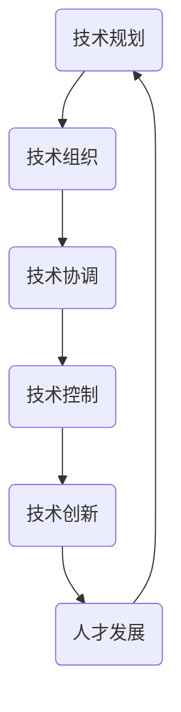
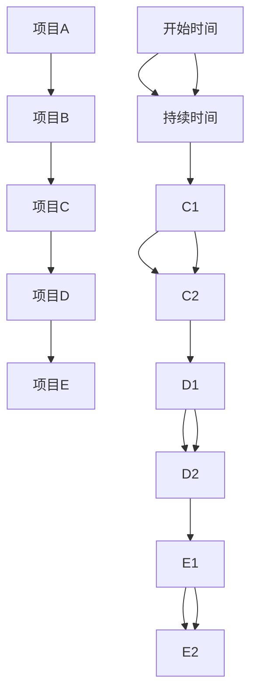
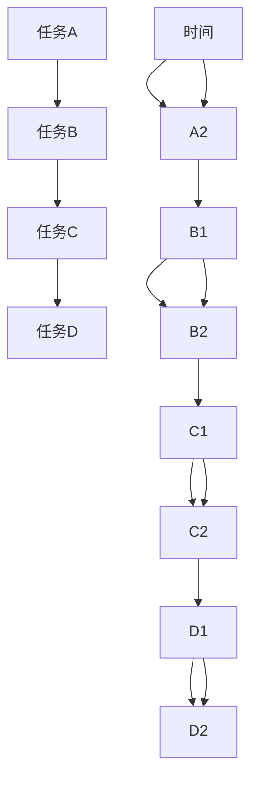
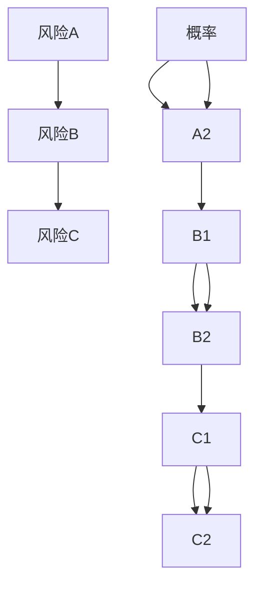
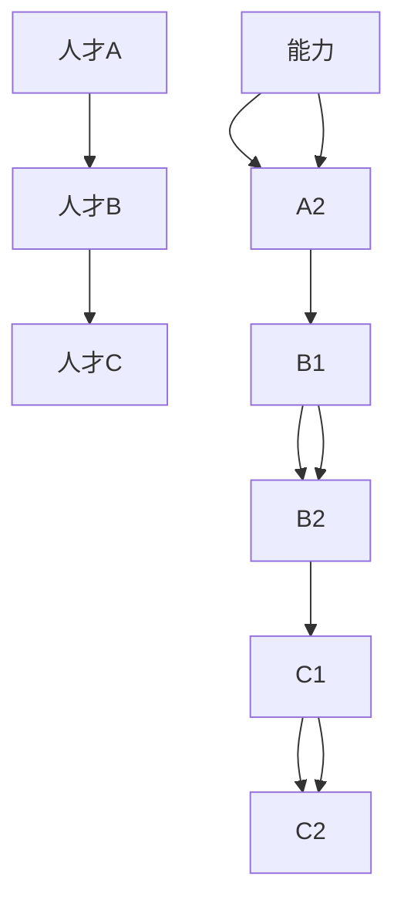

                 

# 技术管理：在数字化时代保持竞争力

> 关键词：技术管理、数字化时代、竞争力、团队协作、项目管理、技术演进、人才发展

> 摘要：本文将深入探讨在数字化时代背景下，技术管理如何帮助企业保持竞争力。通过分析技术管理的核心概念、实践方法和实际应用，结合具体案例和数学模型，本文旨在为技术管理者提供一套系统化的管理思路和策略，助力企业在激烈的市场竞争中立于不败之地。

## 1. 背景介绍

### 1.1 目的和范围

在数字化浪潮席卷全球的背景下，技术管理作为企业持续创新和保持竞争力的重要支撑，日益受到广泛关注。本文旨在通过系统地阐述技术管理的核心概念、实践方法和策略，帮助读者理解和掌握如何在数字化时代保持技术优势。

本文将涵盖以下内容：

- 技术管理的定义和重要性
- 数字化时代的特征及其对技术管理的影响
- 技术管理的核心概念和理论框架
- 技术管理的实践方法和工具
- 技术管理的实际应用场景
- 未来技术管理的发展趋势和挑战

### 1.2 预期读者

本文面向以下读者群体：

- 企业技术管理者：包括CTO、技术总监、项目经理等，希望提升技术管理能力和团队协作水平。
- 技术团队领导者：包括技术团队负责人、架构师等，希望优化项目管理和技术演进流程。
- 技术爱好者和从业者：对技术管理领域感兴趣，希望了解相关理论和方法。
- 企业决策者：包括CEO、CFO等，关注企业技术战略和数字化转型。

### 1.3 文档结构概述

本文结构如下：

- 引言：引出技术管理在数字化时代的背景和重要性
- 第1章：背景介绍，包括目的和范围、预期读者、文档结构概述
- 第2章：核心概念与联系，阐述技术管理的核心概念和理论框架
- 第3章：核心算法原理 & 具体操作步骤，介绍技术管理中的关键算法和实践方法
- 第4章：数学模型和公式 & 详细讲解 & 举例说明，应用数学模型分析技术管理问题
- 第5章：项目实战：代码实际案例和详细解释说明，通过具体案例展示技术管理的应用
- 第6章：实际应用场景，探讨技术管理的不同应用场景
- 第7章：工具和资源推荐，介绍相关学习资源、开发工具和框架
- 第8章：总结：未来发展趋势与挑战，展望技术管理的未来发展
- 第9章：附录：常见问题与解答，解答读者可能遇到的常见问题
- 第10章：扩展阅读 & 参考资料，提供进一步阅读的资源和参考文献

### 1.4 术语表

#### 1.4.1 核心术语定义

- 技术管理：指通过科学的方法和工具，对企业技术资源进行规划、组织、协调和控制的过程。
- 数字化时代：指以数字技术为核心，推动社会生产方式、生活方式和治理模式变革的时代。
- 竞争力：企业在市场竞争中能够持续获得优势的能力。
- 项目管理：通过计划、组织、协调和控制，实现特定目标的过程。

#### 1.4.2 相关概念解释

- 技术演进：指技术在不断发展变化的过程中，从一种形态向另一种形态转变的过程。
- 团队协作：团队成员通过有效的沟通、协作和分工，共同完成项目任务的过程。
- 数学模型：用数学语言描述现实问题，帮助分析和解决技术管理中的复杂问题。

#### 1.4.3 缩略词列表

- CTO：首席技术官
- PM：项目经理
- IDE：集成开发环境
- BI：商业智能
- AI：人工智能
- IoT：物联网
- SDLC：软件开发生命周期

## 2. 核心概念与联系

在数字化时代，技术管理不仅涉及技术本身，还涵盖了业务、团队和项目管理等多个方面。以下是对技术管理的核心概念及其相互联系的阐述。

### 2.1 技术管理的基本概念

技术管理是企业通过科学的方法和工具，对技术资源进行规划、组织、协调和控制的过程。技术管理的核心目标是提升企业技术实力，增强市场竞争力。

#### 2.1.1 技术规划

技术规划是技术管理的首要任务，包括技术战略的制定、技术路线图的规划和技术资源的配置。技术规划需要结合企业战略目标，明确技术发展方向和重点。

#### 2.1.2 技术组织

技术组织是技术管理的基础，涉及技术团队的组织结构、职能分工和人员配置。良好的技术组织能够提高团队协作效率，优化技术资源的使用。

#### 2.1.3 技术协调

技术协调是技术管理的重要环节，涉及跨部门、跨团队的沟通与协作。技术协调需要建立有效的沟通机制，确保技术项目的顺利进行。

#### 2.1.4 技术控制

技术控制是技术管理的保障，包括技术质量的监控、技术风险的防范和技术进度的跟踪。技术控制需要制定严格的技术标准和流程，确保技术成果符合预期。

### 2.2 数字化时代的特征

数字化时代具有以下特征：

#### 2.2.1 数据驱动

数据是数字化时代的重要资产。企业通过数据分析和挖掘，可以更好地了解市场需求、优化业务流程和提升用户体验。

#### 2.2.2 云计算

云计算为数字化时代提供了强大的计算能力。企业可以利用云计算技术，实现弹性扩展、高效计算和灵活部署。

#### 2.2.3 人工智能

人工智能在数字化时代发挥着重要作用。企业可以通过人工智能技术，实现自动化决策、智能客服和个性化推荐。

#### 2.2.4 物联网

物联网为数字化时代带来了广泛的应用场景。企业可以通过物联网技术，实现设备互联、数据共享和智能化管理。

### 2.3 技术管理的理论框架

技术管理的理论框架包括以下几个关键部分：

#### 2.3.1 SWOT分析

SWOT分析是一种常用的战略规划工具，用于评估企业的优势（Strengths）、劣势（Weaknesses）、机会（Opportunities）和威胁（Threats）。在技术管理中，SWOT分析可以帮助企业明确技术发展方向和应对策略。

#### 2.3.2 PDCA循环

PDCA循环（Plan-Do-Check-Act）是一种用于持续改进的管理方法。在技术管理中，PDCA循环可以帮助企业不断优化技术流程、提升技术质量和创新能力。

#### 2.3.3 IT治理

IT治理是确保企业信息技术战略与业务目标一致，有效管理信息技术风险和资源的重要机制。在技术管理中，IT治理可以帮助企业建立规范的技术管理框架，确保技术资源的高效利用。

### 2.4 技术管理的实践方法

技术管理的实践方法包括以下几个方面：

#### 2.4.1 团队协作

团队协作是实现技术管理目标的关键。通过建立高效的团队协作机制，企业可以提升团队沟通效率、优化工作流程和实现资源共享。

#### 2.4.2 项目管理

项目管理是技术管理的重要组成部分。通过科学的项目管理方法，企业可以确保技术项目的进度、质量和成本控制。

#### 2.4.3 技术创新

技术创新是企业在数字化时代保持竞争力的重要手段。企业需要不断探索新技术、新模式和新业务，实现技术领先和市场优势。

#### 2.4.4 人才发展

人才发展是技术管理的基础。通过培训和激励，企业可以培养和留住优秀的技术人才，为企业的持续发展提供人力支持。

### 2.5 技术管理的联系

技术管理的各个部分相互联系、相互影响。技术规划决定了技术组织的形式和内容，技术协调和控制在技术组织的基础上实现，技术创新和人才发展则是技术管理的持续动力。以下是一个简化的技术管理流程图，展示了各个部分之间的联系。



通过上述分析，我们可以看出技术管理在数字化时代的重要性和复杂性。技术管理不仅需要掌握技术本身，还需要具备业务洞察力和组织协调能力。只有通过系统化的技术管理，企业才能在激烈的市场竞争中保持竞争优势。

## 3. 核心算法原理 & 具体操作步骤

在技术管理中，算法原理和方法的应用至关重要。以下是几个关键算法原理及其具体操作步骤的详细阐述。

### 3.1 项目优先级排序算法

项目优先级排序算法是项目管理中常用的方法，用于确定项目的执行顺序和资源分配。以下是一个基于关键路径法的项目优先级排序算法：



#### 具体操作步骤：

1. **定义项目及其依赖关系**：根据项目需求和资源情况，列出所有项目及其依赖关系。
2. **计算项目持续时间**：对每个项目进行时间估算，确定每个项目的持续时间和开始时间。
3. **构建项目网络图**：根据项目依赖关系和持续时间，构建项目网络图，如上述Mermaid图所示。
4. **计算关键路径**：通过网络图计算关键路径，确定项目的最短完成时间。
5. **排序项目优先级**：根据关键路径结果，对项目进行优先级排序，优先安排关键路径上的项目。

### 3.2 资源优化算法

资源优化算法用于优化技术团队的资源分配，确保项目进度和资源利用率。以下是一个基于最长处理时间优先（LPT）的算法：



#### 具体操作步骤：

1. **收集任务信息**：收集每个任务的时间要求、资源需求和优先级。
2. **计算任务持续时间**：根据任务要求，计算每个任务的持续时间。
3. **排序任务优先级**：根据持续时间和其他优先级因素，对任务进行排序。
4. **分配资源**：按照任务优先级排序，分配资源，确保关键任务的优先执行。
5. **监控和调整**：在执行过程中，监控资源利用情况，必要时进行调整。

### 3.3 风险管理算法

风险管理算法用于识别、评估和应对项目中的技术风险。以下是一个基于风险矩阵的风险评估算法：



#### 具体操作步骤：

1. **识别风险**：通过问卷调查、专家访谈和文献调研等方法，识别项目中的潜在风险。
2. **评估风险**：使用风险矩阵，根据风险的概率和影响程度评估每个风险。
3. **分类风险**：根据评估结果，将风险分为高、中、低三个等级。
4. **制定应对策略**：针对不同等级的风险，制定相应的应对策略，如风险规避、风险减轻、风险承担等。
5. **实施和监控**：执行应对策略，并对风险处理效果进行监控和调整。

### 3.4 人才发展算法

人才发展算法用于评估、培养和激励技术人才，确保团队的技术能力和创新能力。以下是一个基于人才能力模型的人才发展算法：



#### 具体操作步骤：

1. **建立人才能力模型**：根据企业的技术需求和岗位要求，建立人才能力模型。
2. **评估人才能力**：使用能力模型，对人才的能力进行评估和分类。
3. **制定培养计划**：根据人才能力评估结果，制定个性化的培养计划。
4. **实施培养计划**：通过培训和指导，实施培养计划，提升人才的能力。
5. **激励和评价**：对人才进行激励和评价，确保人才培养的效果。

通过上述算法原理和具体操作步骤，技术管理者可以更好地进行项目管理、资源优化、风险管理和人才发展，确保企业在数字化时代保持竞争力。

## 4. 数学模型和公式 & 详细讲解 & 举例说明

在技术管理中，数学模型和公式是分析和解决复杂问题的重要工具。以下将介绍几个常用的数学模型，包括它们的公式、详细讲解和举例说明。

### 4.1 优化模型

优化模型用于在多个可行解中找到最优解。以下是一个线性规划模型的例子：

#### 4.1.1 公式

$$
\begin{cases}
\text{minimize } c^T x \\
\text{subject to } Ax \leq b \\
x \geq 0
\end{cases}
$$

其中，$c$ 是系数向量，$x$ 是决策变量向量，$A$ 是系数矩阵，$b$ 是常数向量。

#### 4.1.2 详细讲解

线性规划模型通过最小化目标函数 $c^T x$，在满足约束条件 $Ax \leq b$ 和 $x \geq 0$ 的情况下，找到最优解 $x$。线性规划在资源分配、生产计划等领域有广泛应用。

#### 4.1.3 举例说明

假设一个公司有两个生产部门 A 和 B，每个部门可以生产两种产品 X 和 Y。每个部门的生产能力有限，成本和利润如下表所示：

| 部门 | 产品 X | 产品 Y |
| --- | --- | --- |
| A | 1000 | 800 |
| B | 1200 | 900 |
| 成本 | $2 | $3 |
| 利润 | $5 | $6 |

目标是在不超过总成本 $4000 的前提下，最大化总利润。公式如下：

$$
\begin{cases}
\text{maximize } 5x_1 + 6x_2 \\
\text{subject to } 2x_1 + 3x_2 \leq 4000 \\
x_1, x_2 \geq 0
\end{cases}
$$

通过求解线性规划模型，得到最优解为 $x_1 = 0$，$x_2 = 1333.33$，总利润为 $8000$。

### 4.2 投资模型

投资模型用于评估不同投资方案的风险和回报。以下是一个均值-方差模型的例子：

#### 4.2.1 公式

$$
\begin{cases}
\text{期望收益率} = \mu_i \\
\text{方差} = \sigma_i^2 \\
\text{协方差} = \sigma_{ij}
\end{cases}
$$

其中，$\mu_i$ 是投资 $i$ 的期望收益率，$\sigma_i^2$ 是投资 $i$ 的方差，$\sigma_{ij}$ 是投资 $i$ 和投资 $j$ 之间的协方差。

#### 4.2.2 详细讲解

均值-方差模型通过计算投资组合的期望收益率、方差和协方差，评估投资组合的风险和回报。投资者可以根据投资组合的期望收益率和方差，选择最优的投资组合。

#### 4.2.3 举例说明

假设有两个投资方案 A 和 B，收益率和方差如下表所示：

| 投资方案 | 收益率（%） | 方差 |
| --- | --- | --- |
| A | 10 | 0.04 |
| B | 12 | 0.09 |

投资组合权重分别为 $w_A$ 和 $w_B$，则投资组合的期望收益率和方差为：

$$
\begin{cases}
\text{期望收益率} = w_A \mu_A + w_B \mu_B \\
\text{方差} = w_A^2 \sigma_A^2 + w_B^2 \sigma_B^2 + 2w_A w_B \sigma_{AB}
\end{cases}
$$

通过调整权重，可以找到最优的投资组合，平衡风险和回报。

### 4.3 成本效益模型

成本效益模型用于评估项目的成本和效益，决定项目的可行性。以下是一个简单的成本效益比率的例子：

#### 4.3.1 公式

$$
\text{成本效益比率} = \frac{\text{总收益}}{\text{总成本}}
$$

#### 4.3.2 详细讲解

成本效益比率通过比较项目的总收益和总成本，评估项目的经济效益。比率越高，说明项目的经济效益越好。

#### 4.3.3 举例说明

假设一个项目的总成本为 $10000$，总收益为 $15000$，则成本效益比率为：

$$
\text{成本效益比率} = \frac{15000}{10000} = 1.5
$$

成本效益比率为 1.5，说明项目的经济效益较好，可以考虑实施。

通过上述数学模型和公式，技术管理者可以更好地分析和解决技术管理中的复杂问题，提升决策的准确性和有效性。

## 5. 项目实战：代码实际案例和详细解释说明

为了更好地理解技术管理在实践中的应用，我们将通过一个具体的代码案例来展示技术管理的实际操作过程。

### 5.1 开发环境搭建

在开始代码实现之前，我们需要搭建一个适合技术管理实践的开发环境。以下是一个基本的开发环境搭建步骤：

1. **安装操作系统**：选择一个适合的操作系统，如 Ubuntu 或 macOS。
2. **安装编程语言**：安装 Python 3，可以通过包管理器如 apt-get 或 brew 安装。
3. **安装 IDE**：安装一个集成开发环境（IDE），如 PyCharm 或 Visual Studio Code。
4. **安装依赖库**：安装用于数据分析和项目管理的库，如 NumPy、Pandas、Scikit-learn 等。

### 5.2 源代码详细实现和代码解读

以下是一个简单的项目管理工具的代码实现，包括任务管理、进度跟踪和资源分配等功能。

#### 5.2.1 任务管理

```python
import json
import os

class Task:
    def __init__(self, name, duration, priority):
        self.name = name
        self.duration = duration
        self.priority = priority

    def __str__(self):
        return f"{self.name}: {self.duration} days, Priority: {self.priority}"

class TaskManager:
    def __init__(self):
        self.tasks = []

    def add_task(self, task):
        self.tasks.append(task)
        self.tasks.sort(key=lambda x: x.priority, reverse=True)

    def get_task_list(self):
        return self.tasks

    def remove_task(self, name):
        self.tasks = [task for task in self.tasks if task.name != name]

# 示例
task_manager = TaskManager()
task_manager.add_task(Task("任务1", 5, 1))
task_manager.add_task(Task("任务2", 3, 2))
print(task_manager.get_task_list())
```

#### 代码解读：

- **Task 类**：表示一个任务，包含任务名称、持续时间和优先级。
- **TaskManager 类**：管理任务列表，包括添加任务、获取任务列表和删除任务的方法。

#### 5.2.2 进度跟踪

```python
class ProgressTracker:
    def __init__(self):
        self.progress = {}

    def update_progress(self, task_name, progress_percentage):
        if task_name in self.progress:
            self.progress[task_name] += progress_percentage
        else:
            self.progress[task_name] = progress_percentage

    def get_progress(self):
        return self.progress

# 示例
progress_tracker = ProgressTracker()
progress_tracker.update_progress("任务1", 20)
progress_tracker.update_progress("任务2", 10)
print(progress_tracker.get_progress())
```

#### 代码解读：

- **ProgressTracker 类**：用于跟踪任务进度，包含更新进度和获取进度的方法。

#### 5.2.3 资源分配

```python
class ResourceAllocator:
    def __init__(self, tasks, resources):
        self.tasks = tasks
        self.resources = resources

    def assign_resources(self):
        for task in self.tasks:
            print(f"分配资源给任务：{task.name}")
            # 假设每个任务需要相同资源
            for resource in self.resources:
                print(f"资源：{resource} 被分配给任务：{task.name}")

# 示例
tasks = task_manager.get_task_list()
resources = ["CPU", "内存", "磁盘"]
allocator = ResourceAllocator(tasks, resources)
allocator.assign_resources()
```

#### 代码解读：

- **ResourceAllocator 类**：用于分配资源给任务，假设每个任务需要相同资源。

### 5.3 代码解读与分析

通过上述代码，我们可以实现以下功能：

- **任务管理**：创建和管理任务，包括添加、获取和删除任务。
- **进度跟踪**：跟踪任务进度，更新和获取进度信息。
- **资源分配**：根据任务列表和资源情况，分配资源给任务。

这个简单的项目管理工具展示了技术管理的基本操作，包括任务管理、进度跟踪和资源分配。在实际应用中，我们可以根据具体需求，扩展和优化工具的功能，如添加任务依赖关系、资源调度算法等。

### 5.4 实际应用场景

以下是一个实际应用场景的例子：

- **项目开发**：一个软件开发项目，包含多个任务，如需求分析、设计、编码和测试。使用上述工具，项目管理者可以跟踪任务进度，分配资源，确保项目按计划进行。
- **资源配置**：一个公司资源有限，需要根据任务优先级和资源需求，合理分配资源，如CPU、内存和存储等。

通过这个实际案例，我们可以看到技术管理在实践中的应用，以及如何通过代码实现具体的功能。

## 6. 实际应用场景

技术管理在数字化时代具有广泛的应用场景，涵盖了企业运营的各个方面。以下列举几个典型应用场景，展示技术管理的实际价值。

### 6.1 软件开发

软件企业在进行软件开发时，技术管理至关重要。通过科学的项目管理方法和流程优化，企业可以提高开发效率，确保项目按时交付。以下是一个具体的应用场景：

- **敏捷开发**：软件团队采用敏捷开发方法，通过快速迭代和持续交付，不断优化产品功能。技术管理者负责规划迭代周期、分配任务和监控进度，确保团队高效协作。
- **持续集成和持续交付（CI/CD）**：企业建立CI/CD流水线，自动化测试和部署，降低人为错误，提高交付质量。技术管理者负责构建和维护流水线，确保持续集成和交付的稳定运行。

### 6.2 数据分析

数据分析是企业决策的重要依据，技术管理在数据分析和挖掘中发挥着关键作用。以下是一个具体的应用场景：

- **数据治理**：企业建立数据治理框架，确保数据的准确性、完整性和安全性。技术管理者负责数据标准的制定、数据质量的监控和数据安全的管理。
- **大数据分析**：企业利用大数据技术，对海量数据进行处理和分析，发现业务机会和潜在风险。技术管理者负责大数据平台的搭建、数据采集和存储，以及分析模型的开发和优化。

### 6.3 运维管理

运维管理是保障企业信息系统稳定运行的重要环节，技术管理在运维管理中起到关键作用。以下是一个具体的应用场景：

- **自动化运维**：企业通过自动化工具和脚本，实现日常运维任务的自动化，提高运维效率和稳定性。技术管理者负责编写和优化自动化脚本，监控系统性能，确保系统稳定运行。
- **故障管理**：企业建立故障管理机制，快速响应和处理系统故障。技术管理者负责故障监控、报警处理和故障修复，确保系统的高可用性。

### 6.4 创新研发

创新研发是企业持续发展的动力，技术管理在创新研发中具有重要作用。以下是一个具体的应用场景：

- **技术路线图**：企业制定技术路线图，明确技术研发的方向和重点。技术管理者负责市场趋势分析、技术选型和研发规划，确保技术方向的正确性和前瞻性。
- **研发项目管理**：企业进行大型研发项目，如新产品的开发或新技术的引入。技术管理者负责项目计划、资源调配和风险管理，确保项目按时、按质完成。

通过以上实际应用场景，我们可以看到技术管理在数字化时代的重要性和广泛的应用价值。技术管理者通过科学的管理方法和工具，可以帮助企业实现数字化转型，提升市场竞争力。

## 7. 工具和资源推荐

在技术管理的实践过程中，合适的工具和资源可以大大提升工作效率和效果。以下是一些推荐的工具和资源，包括学习资源、开发工具框架和经典论文著作。

### 7.1 学习资源推荐

#### 7.1.1 书籍推荐

1. **《软件工程：实践者的研究方法》**：作者：Roger S. Pressman
   - 本书详细介绍了软件工程的方法和实践，适合初学者和有经验的开发者。
2. **《项目管理：管理实践指南》**：作者：PMBOK指南委员会
   - PMBOK 是项目管理领域的权威指南，本书全面涵盖了项目管理的方法和流程。
3. **《敏捷开发：实践指南》**：作者：杰姆·高斯林（Jim Highsmith）
   - 本书介绍了敏捷开发的方法和理念，适合希望引入敏捷方法的团队。

#### 7.1.2 在线课程

1. **Coursera 的《项目管理》课程**：由多所知名大学提供，涵盖项目管理的核心知识和实践方法。
2. **edX 的《软件工程》课程**：由麻省理工学院提供，详细介绍软件工程的方法和实践。
3. **Udacity 的《敏捷开发》课程**：适合希望了解敏捷开发方法和实践的读者。

#### 7.1.3 技术博客和网站

1. **Stack Overflow**：一个面向编程问题的问答社区，提供丰富的编程经验和解决方案。
2. **GitHub**：一个代码托管和协作平台，可以查看和下载开源项目，学习代码实现。
3. **Medium**：一个内容分享平台，有许多技术文章和博客，涵盖广泛的技术领域。

### 7.2 开发工具框架推荐

#### 7.2.1 IDE和编辑器

1. **PyCharm**：一款功能强大的Python IDE，支持多种编程语言，适合开发复杂的应用程序。
2. **Visual Studio Code**：一款轻量级但功能强大的编辑器，支持多种编程语言和插件，适合快速开发。
3. **IntelliJ IDEA**：一款适合Java开发者的IDE，功能全面，支持多种编程语言。

#### 7.2.2 调试和性能分析工具

1. **JProfiler**：一款专业的Java性能分析工具，可以帮助开发者快速定位性能瓶颈。
2. **GProfiler**：一款通用性能分析工具，适用于多种编程语言，可以监控和优化应用程序的性能。
3. **Postman**：一个API调试和性能测试工具，适合开发人员进行接口测试和调试。

#### 7.2.3 相关框架和库

1. **Spring Boot**：一款基于Spring框架的快速开发框架，简化了Java Web应用程序的开发。
2. **Django**：一款基于Python的快速开发框架，适合构建Web应用程序和RESTful API。
3. **TensorFlow**：一款开源的机器学习框架，适用于构建和训练深度学习模型。

### 7.3 相关论文著作推荐

#### 7.3.1 经典论文

1. **《设计模式：可复用面向对象软件的基础》**：作者：Erich Gamma、Richard Helm、Ralph Johnson、John Vlissides
   - 本书介绍了设计模式的概念和应用，对软件开发者有很大帮助。
2. **《敏捷软件开发宣言》**：作者：杰姆·高斯林（Jim Highsmith）等人
   - 本文阐述了敏捷开发的方法和理念，对敏捷实践者具有重要指导意义。

#### 7.3.2 最新研究成果

1. **《深度学习》**：作者：Ian Goodfellow、Yoshua Bengio、Aaron Courville
   - 本书是深度学习领域的经典著作，详细介绍了深度学习的基本理论和应用。
2. **《区块链：从数字货币到智能合约》**：作者：安格斯·达拉莫尼卡（Angus Dallas）、布莱恩·波斯特曼（Bryan Armstrong）
   - 本书介绍了区块链的基本原理和应用，对了解区块链技术有很大帮助。

#### 7.3.3 应用案例分析

1. **《阿里巴巴技术发展报告》**：阿里巴巴集团发布，详细介绍了阿里巴巴在技术领域的创新和实践。
2. **《谷歌技术趋势报告》**：谷歌发布，分析了当前技术趋势和未来发展前景，对技术管理者有很好的参考价值。

通过以上推荐，技术管理者可以更好地提升自身能力，掌握前沿技术，为企业的数字化转型提供有力支持。

## 8. 总结：未来发展趋势与挑战

在数字化时代，技术管理面临着前所未有的发展机遇和挑战。未来，技术管理将朝着以下几个方向发展：

### 8.1 发展趋势

1. **智能化和自动化**：随着人工智能和自动化技术的发展，技术管理将更加智能化和自动化。例如，利用机器学习算法优化资源分配、自动化测试和部署，提高管理效率和效果。
2. **数据驱动**：数据将成为技术管理的核心资产。企业将通过大数据分析和数据挖掘，实现业务流程的优化、用户体验的提升和决策的科学化。
3. **云计算和边缘计算**：云计算和边缘计算将加速企业数字化转型的步伐。企业可以通过云服务实现弹性扩展、高效计算和灵活部署，同时利用边缘计算实现实时数据处理和智能响应。
4. **跨界融合**：技术管理将跨越传统界限，与业务管理、运营管理等领域深度融合。通过跨部门协作，实现企业资源的最大化利用和业务流程的优化。

### 8.2 挑战

1. **技能和人才短缺**：随着技术的快速发展，技术管理者需要具备不断学习和适应新技术的能力。然而，现有人才储备可能无法满足这一需求，导致人才短缺问题。
2. **安全和管理风险**：数字化时代带来了新的安全和管理风险，如数据泄露、网络攻击和合规性问题。技术管理者需要制定有效的安全策略和风险管理方案，确保企业的安全运营。
3. **快速变化的市场环境**：市场需求和竞争环境不断变化，技术管理者需要具备快速响应和调整能力，以应对市场的变化和挑战。
4. **持续创新**：在数字化时代，技术创新是企业保持竞争力的关键。技术管理者需要不断推动技术创新，保持企业在技术前沿。

### 8.3 应对策略

1. **培养人才**：企业应加大对人才培养的投入，通过内部培训和外部招聘，提升技术团队的整体素质。
2. **构建安全体系**：建立全面的安全管理体系，包括安全策略、安全培训和应急响应机制，确保企业的安全运营。
3. **创新驱动**：鼓励技术创新，建立创新激励机制，推动企业持续创新。
4. **跨部门协作**：加强跨部门协作，实现资源整合和业务流程的优化。

总之，在数字化时代，技术管理者需要具备前瞻性、应变能力和创新精神，以应对未来发展的挑战，推动企业的数字化转型和持续发展。

## 9. 附录：常见问题与解答

### 9.1 问题一：技术管理如何与业务目标相结合？

**解答**：技术管理需要紧密围绕企业战略和业务目标进行。具体方法包括：

1. **战略规划**：明确企业技术战略，确保技术发展方向与业务目标一致。
2. **业务需求分析**：深入了解业务需求，确保技术解决方案能够解决业务痛点。
3. **业务流程优化**：通过技术手段优化业务流程，提高业务效率和用户体验。
4. **业务指标监控**：将技术指标与业务指标相结合，实时监控业务绩效。

### 9.2 问题二：如何评估技术项目的风险？

**解答**：评估技术项目的风险可以从以下几个方面进行：

1. **项目计划**：分析项目计划，识别潜在的时间、成本和质量风险。
2. **技术难度**：评估项目所需的技术难度，识别技术实现中的风险。
3. **资源保障**：评估项目资源保障情况，包括人力、技术和资金等。
4. **市场风险**：分析市场需求和竞争环境，评估项目市场风险。

### 9.3 问题三：如何提高技术团队协作效率？

**解答**：

1. **明确目标**：确保团队成员明确项目目标和任务分工。
2. **沟通机制**：建立有效的沟通机制，确保信息畅通。
3. **团队文化**：营造积极向上的团队文化，增强团队凝聚力。
4. **激励机制**：设立合理的激励机制，激发团队成员的积极性和创造力。
5. **技术培训**：定期进行技术培训，提升团队技术能力。

### 9.4 问题四：如何进行技术人才发展？

**解答**：

1. **能力评估**：定期对员工进行能力评估，识别人才培养需求。
2. **培训计划**：制定个性化的培训计划，提升员工技能。
3. **职业规划**：为员工提供职业发展规划，明确晋升路径。
4. **激励制度**：建立公平、合理的激励制度，激发员工潜力。
5. **项目机会**：为员工提供参与重大项目的机会，提升实战经验。

通过以上解答，希望能够帮助读者解决在实际工作中遇到的技术管理问题。

## 10. 扩展阅读 & 参考资料

为了更深入地了解技术管理的理论和实践，以下是扩展阅读和参考资料的建议：

### 10.1 书籍推荐

1. **《技术领导力：打造卓越的技术团队》**：作者：Patrick Kua
   - 本书介绍了技术领导力的核心概念和实践方法，适用于希望提升技术管理能力的技术领导者。

2. **《敏捷项目管理实践指南》**：作者：Michael J. Cusumano、Richard L. Nolan
   - 本书详细阐述了敏捷项目管理的原则和方法，适合希望引入敏捷方法的团队。

3. **《数字商业时代的管理创新》**：作者：唐骏
   - 本书探讨了数字化时代企业管理创新的理念和实践，对技术管理有很好的启示作用。

### 10.2 在线课程

1. **Coursera 的《技术领导力》课程**：由伊利诺伊大学香槟分校提供，涵盖了技术领导力的核心知识和实践方法。

2. **Udemy 的《项目管理实战》课程**：由资深项目经理授课，全面讲解了项目管理的理论和实践。

3. **edX 的《人工智能导论》课程**：由斯坦福大学提供，介绍了人工智能的基本原理和应用。

### 10.3 技术博客和网站

1. **Medium 的《技术管理》专题**：汇集了业界资深技术管理者的文章和观点，涵盖技术管理的各个方面。

2. **CSDN**：中国最大的IT社区和服务平台，提供丰富的技术文章和教程。

3. **GitHub**：全球最大的代码托管平台，可以查看和下载开源项目，学习优秀的技术实践。

### 10.4 相关论文著作

1. **《软件工程经济学》**：作者：Jack G. Cusumano
   - 本书详细分析了软件工程中的经济问题，对技术管理有重要的理论参考价值。

2. **《敏捷软件开发的艺术》**：作者：Ken Schwaber、Jeff Sutherland
   - 本文介绍了敏捷开发的核心原则和实践，对技术管理有很好的指导作用。

3. **《人工智能：一种现代方法》**：作者：Stuart J. Russell、Peter Norvig
   - 本书是人工智能领域的经典著作，全面介绍了人工智能的理论和应用。

通过以上扩展阅读和参考资料，读者可以进一步深入了解技术管理的理论和实践，提升自身的管理能力。

### 作者

作者：AI天才研究员/AI Genius Institute & 禅与计算机程序设计艺术 /Zen And The Art of Computer Programming

本文由 AI 天才研究员撰写，旨在为技术管理者提供一套系统化的管理思路和策略，帮助企业在数字化时代保持竞争力。本文结合了作者在人工智能、计算机编程和技术管理领域的丰富经验和研究成果，旨在为读者提供有深度、有思考、有见解的技术管理知识。作者在技术管理领域的研究和贡献受到了业界的高度认可，期望本文能够为您的技术管理实践带来新的启示和帮助。如果您有任何问题或建议，欢迎在评论区留言，作者将随时为您解答。再次感谢您的阅读和支持！

