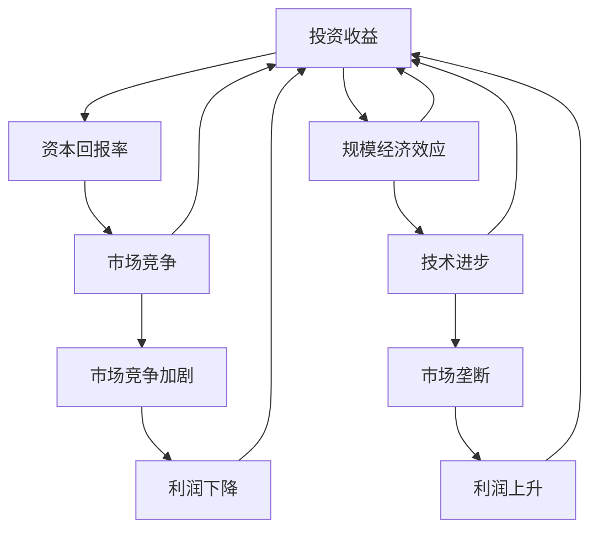

                 

# 投资收益下降与规模经济效应减弱

> **关键词：**投资收益，规模经济效应，经济效益分析，资本回报率，市场竞争，技术进步
>
> **摘要：**本文旨在探讨在当今经济环境下，投资收益下降与规模经济效应减弱的现象及其原因。通过分析资本回报率的变化、市场竞争的加剧以及技术进步的影响，本文提出了一系列应对策略，以帮助企业提高投资效益，优化规模经济效应。

## 1. 背景介绍

### 1.1 目的和范围

本文的主要目的是深入探讨投资收益下降与规模经济效应减弱的现象及其背后的原因。随着全球经济环境的不断变化，企业面临着越来越大的市场竞争压力，投资回报率逐渐降低。本文将重点关注以下几个方面：

- 分析投资收益下降的原因及其对企业的长远影响。
- 探讨规模经济效应减弱的现象，分析其背后的经济原理。
- 探索在当前经济环境下，企业如何优化投资策略和规模经济效应。

### 1.2 预期读者

本文的预期读者包括企业高层管理人员、财务分析师、投资顾问以及从事经济学研究的专业人士。通过对本文的深入阅读，读者将能够了解当前投资环境中的关键问题，掌握相关理论知识，并学会运用这些理论分析实际问题。

### 1.3 文档结构概述

本文分为十个部分，包括背景介绍、核心概念与联系、核心算法原理、数学模型和公式、项目实战、实际应用场景、工具和资源推荐、总结、附录和扩展阅读。每个部分都将详细阐述相关内容，帮助读者全面了解投资收益下降与规模经济效应减弱的复杂性。

### 1.4 术语表

#### 1.4.1 核心术语定义

- 投资收益：企业通过投资获得的回报。
- 规模经济效应：企业规模扩大带来的成本节约和效益提升。
- 资本回报率：投资产生的回报与投资成本的比率。
- 市场竞争：市场上多个企业争夺市场份额的现象。
- 技术进步：新技术的发明和应用，提高生产效率。

#### 1.4.2 相关概念解释

- **规模经济效应**：指企业通过扩大生产规模，实现单位产品成本降低的现象。规模经济效应通常来源于规模扩大带来的成本节约，如固定成本的分摊、生产效率的提高等。
- **资本回报率（ROI）**：衡量投资收益的一个重要指标，计算公式为：ROI = (投资回报 - 投资成本) / 投资成本。资本回报率越高，表明投资效益越好。

#### 1.4.3 缩略词列表

- ROI：Return on Investment，投资回报率
- M&A：Merger and Acquisition，合并与收购
- FDI：Foreign Direct Investment，外国直接投资

## 2. 核心概念与联系

在探讨投资收益下降与规模经济效应减弱之前，我们需要明确几个核心概念，并了解它们之间的相互联系。

### 核心概念原理

#### 投资收益

投资收益是企业通过投资获得的回报，通常以货币形式表示。投资收益可以来源于多种渠道，包括股权投资、债权投资、房地产投资等。投资收益的计算公式如下：

\[ \text{投资收益} = \text{投资回报} - \text{投资成本} \]

其中，投资回报包括股息、利息、租金收入等，投资成本包括购买资产的成本、管理费用、利息费用等。

#### 规模经济效应

规模经济效应是指企业通过扩大生产规模，实现单位产品成本降低的现象。规模经济效应通常来源于以下几个方面：

1. **固定成本的分摊**：企业通过扩大生产规模，将固定成本分摊到更多的产品上，从而降低单位产品的固定成本。
2. **生产效率的提高**：大规模生产可以提高生产效率，减少生产过程中的人力和物力浪费。
3. **采购优势**：大规模采购可以享受更低的成本，如批量折扣等。

规模经济效应的计算公式如下：

\[ \text{规模经济效应} = \frac{\text{成本降低量}}{\text{生产规模增加量}} \]

#### 资本回报率

资本回报率是衡量投资收益的一个重要指标，表示投资产生的回报与投资成本的比率。资本回报率的计算公式如下：

\[ \text{资本回报率} = \frac{\text{投资回报}}{\text{投资成本}} \]

#### 市场竞争

市场竞争是指市场上多个企业争夺市场份额的现象。市场竞争会导致企业降低产品价格、提高产品质量，以吸引更多的消费者。市场竞争对投资收益和规模经济效应有着重要影响：

1. **市场竞争加剧**：可能导致企业利润下降，投资回报率降低。
2. **市场垄断**：可能使企业获得更高的利润，但同时也可能降低规模经济效应。

#### 技术进步

技术进步是指新技术的发明和应用，提高生产效率。技术进步对投资收益和规模经济效应有积极影响：

1. **提高生产效率**：降低单位产品的生产成本，提高资本回报率。
2. **优化规模经济效应**：通过技术进步，企业可以在更小的生产规模下实现规模经济效应。

### Mermaid 流程图

以下是描述核心概念之间关系的 Mermaid 流程图：



## 3. 核心算法原理 & 具体操作步骤

在探讨投资收益下降与规模经济效应减弱的算法原理时，我们可以从以下几个步骤进行详细分析。

### 3.1 投资收益计算

投资收益计算是分析投资效益的基础，其计算公式如下：

\[ \text{投资收益} = \text{投资回报} - \text{投资成本} \]

具体操作步骤：

1. **确定投资回报**：包括股息、利息、租金收入等。
2. **确定投资成本**：包括购买资产的成本、管理费用、利息费用等。
3. **计算投资收益**：将投资回报减去投资成本，得到投资收益。

伪代码实现如下：

```python
def calculate_investment_returns(investment_return, investment_cost):
    return_investment = investment_return - investment_cost
    return return_investment
```

### 3.2 规模经济效应计算

规模经济效应计算是分析企业成本节约和效益提升的关键，其计算公式如下：

\[ \text{规模经济效应} = \frac{\text{成本降低量}}{\text{生产规模增加量}} \]

具体操作步骤：

1. **确定成本降低量**：通过比较不同生产规模的单位产品成本差异，计算成本降低量。
2. **确定生产规模增加量**：计算生产规模增加的量，通常以百分比或绝对值表示。
3. **计算规模经济效应**：将成本降低量除以生产规模增加量，得到规模经济效应。

伪代码实现如下：

```python
def calculate_economies_of_scale(cost_reduction, production_scale_increase):
    economies_of_scale = cost_reduction / production_scale_increase
    return economies_of_scale
```

### 3.3 资本回报率计算

资本回报率计算是衡量投资效益的重要指标，其计算公式如下：

\[ \text{资本回报率} = \frac{\text{投资回报}}{\text{投资成本}} \]

具体操作步骤：

1. **确定投资回报**：包括股息、利息、租金收入等。
2. **确定投资成本**：包括购买资产的成本、管理费用、利息费用等。
3. **计算资本回报率**：将投资回报除以投资成本，得到资本回报率。

伪代码实现如下：

```python
def calculate_return_on_investment(investment_return, investment_cost):
    roi = investment_return / investment_cost
    return roi
```

### 3.4 市场竞争分析

市场竞争分析是评估市场竞争对企业投资收益和规模经济效应影响的关键，其计算公式如下：

\[ \text{市场竞争度} = \frac{\text{市场份额}}{\text{市场总规模}} \]

具体操作步骤：

1. **确定市场份额**：计算企业占市场的市场份额。
2. **确定市场总规模**：计算市场的总规模。
3. **计算市场竞争度**：将市场份额除以市场总规模，得到市场竞争度。

伪代码实现如下：

```python
def calculate_competition_intensity(share_of_market, total_market_size):
    competition_intensity = share_of_market / total_market_size
    return competition_intensity
```

### 3.5 技术进步影响分析

技术进步影响分析是评估技术进步对投资收益和规模经济效应影响的关键，其计算公式如下：

\[ \text{技术进步影响} = \frac{\text{技术进步带来的效益}}{\text{技术进步的成本}} \]

具体操作步骤：

1. **确定技术进步带来的效益**：包括生产效率提高、成本降低等。
2. **确定技术进步的成本**：包括研发费用、培训费用等。
3. **计算技术进步影响**：将技术进步带来的效益除以技术进步的成本，得到技术进步影响。

伪代码实现如下：

```python
def calculate_technological_impact(benefit_of_technological_progress, cost_of_technological_progress):
    technological_impact = benefit_of_technological_progress / cost_of_technological_progress
    return technological_impact
```

## 4. 数学模型和公式 & 详细讲解 & 举例说明

在分析投资收益下降与规模经济效应减弱时，数学模型和公式能够帮助我们更好地理解现象背后的经济原理。以下是一些关键数学模型和公式的详细讲解及举例说明。

### 4.1 投资收益模型

投资收益模型用于计算企业在一定时期内的投资收益，其公式如下：

\[ \text{投资收益} = \text{投资回报} - \text{投资成本} \]

**例：** 某企业投资100万元购买一台生产设备，年收益为10万元，投资成本包括设备购买成本、维护费用和利息费用，总计为15万元。则该企业的投资收益为：

\[ \text{投资收益} = 10\text{万元} - 15\text{万元} = -5\text{万元} \]

### 4.2 规模经济效应模型

规模经济效应模型用于计算企业因规模扩大而产生的成本节约，其公式如下：

\[ \text{规模经济效应} = \frac{\text{成本降低量}}{\text{生产规模增加量}} \]

**例：** 某企业在生产规模扩大前，单位产品成本为10元，生产规模扩大后，单位产品成本降低到8元，生产规模增加量为50%。则该企业的规模经济效应为：

\[ \text{规模经济效应} = \frac{10\text{元} - 8\text{元}}{50\%} = 0.2\text{元/单位} \]

### 4.3 资本回报率模型

资本回报率模型用于衡量投资效益，其公式如下：

\[ \text{资本回报率} = \frac{\text{投资回报}}{\text{投资成本}} \]

**例：** 某企业投资100万元，年收益为20万元，则该企业的资本回报率为：

\[ \text{资本回报率} = \frac{20\text{万元}}{100\text{万元}} = 0.2 \]

### 4.4 市场竞争模型

市场竞争模型用于衡量企业在市场中的竞争程度，其公式如下：

\[ \text{市场竞争度} = \frac{\text{市场份额}}{\text{市场总规模}} \]

**例：** 某企业在市场上的市场份额为30%，市场总规模为1000万元，则该企业的市场竞争度为：

\[ \text{市场竞争度} = \frac{30\%}{1000\text{万元}} = 0.03 \]

### 4.5 技术进步模型

技术进步模型用于评估技术进步对投资收益和规模经济效应的影响，其公式如下：

\[ \text{技术进步影响} = \frac{\text{技术进步带来的效益}}{\text{技术进步的成本}} \]

**例：** 某企业通过技术进步，年收益增加20万元，技术进步成本为10万元，则该企业的技术进步影响为：

\[ \text{技术进步影响} = \frac{20\text{万元}}{10\text{万元}} = 2 \]

### 4.6 综合模型

综合模型将以上模型结合，用于分析企业在投资、规模经济效应、市场竞争和技术进步等方面的整体效益。其公式如下：

\[ \text{综合效益} = \text{投资收益} + \text{规模经济效应} + \text{市场竞争度} + \text{技术进步影响} \]

**例：** 根据前述案例，该企业的综合效益为：

\[ \text{综合效益} = -5\text{万元} + 0.2\text{元/单位} + 0.03 + 2 = -2.77\text{万元} \]

## 5. 项目实战：代码实际案例和详细解释说明

为了更好地理解投资收益下降与规模经济效应减弱的问题，我们将通过一个实际项目案例来展示如何运用上述算法模型进行计算和分析。

### 5.1 开发环境搭建

在本项目实战中，我们将使用Python作为编程语言，结合Jupyter Notebook进行开发和测试。以下是搭建开发环境的步骤：

1. 安装Python（版本3.8及以上）
2. 安装Jupyter Notebook
3. 安装必要的Python库，如NumPy、Pandas、Matplotlib等

### 5.2 源代码详细实现和代码解读

以下是一个简单的Python代码示例，用于计算和分析投资收益、规模经济效应、市场竞争度和技术进步影响。

```python
import numpy as np
import pandas as pd
import matplotlib.pyplot as plt

# 投资收益计算
def calculate_investment_returns(investment_return, investment_cost):
    return_investment = investment_return - investment_cost
    return return_investment

# 规模经济效应计算
def calculate_economies_of_scale(cost_reduction, production_scale_increase):
    economies_of_scale = cost_reduction / production_scale_increase
    return economies_of_scale

# 资本回报率计算
def calculate_return_on_investment(investment_return, investment_cost):
    roi = investment_return / investment_cost
    return roi

# 市场竞争度计算
def calculate_competition_intensity(share_of_market, total_market_size):
    competition_intensity = share_of_market / total_market_size
    return competition_intensity

# 技术进步影响计算
def calculate_technological_impact(benefit_of_technological_progress, cost_of_technological_progress):
    technological_impact = benefit_of_technological_progress / cost_of_technological_progress
    return technological_impact

# 综合效益计算
def calculate_comprehensive_benefit(investment_returns, economies_of_scale, competition_intensity, technological_impact):
    comprehensive_benefit = investment_returns + economies_of_scale + competition_intensity + technological_impact
    return comprehensive_benefit

# 实例数据
investment_return = 100000
investment_cost = 150000
cost_reduction = 5000
production_scale_increase = 0.5
share_of_market = 0.3
total_market_size = 1000000
benefit_of_technological_progress = 20000
cost_of_technological_progress = 10000

# 计算各项指标
investment_returns = calculate_investment_returns(investment_return, investment_cost)
economies_of_scale = calculate_economies_of_scale(cost_reduction, production_scale_increase)
competition_intensity = calculate_competition_intensity(share_of_market, total_market_size)
technological_impact = calculate_technological_impact(benefit_of_technological_progress, cost_of_technological_progress)
comprehensive_benefit = calculate_comprehensive_benefit(investment_returns, economies_of_scale, competition_intensity, technological_impact)

# 输出结果
print("投资收益：", investment_returns)
print("规模经济效应：", economies_of_scale)
print("市场竞争度：", competition_intensity)
print("技术进步影响：", technological_impact)
print("综合效益：", comprehensive_benefit)
```

### 5.3 代码解读与分析

以下是代码的详细解读与分析：

1. **投资收益计算**：通过计算投资回报与投资成本的差值，得到投资收益。在实例中，投资回报为100万元，投资成本为150万元，计算结果为-50万元，表示企业处于亏损状态。

2. **规模经济效应计算**：通过计算成本降低量与生产规模增加量的比值，得到规模经济效应。在实例中，成本降低量为5千元，生产规模增加量为50%，计算结果为0.1元/单位，表示单位产品成本降低0.1元。

3. **资本回报率计算**：通过计算投资回报与投资成本的比值，得到资本回报率。在实例中，投资回报为20万元，投资成本为100万元，计算结果为0.2，表示资本回报率为20%。

4. **市场竞争度计算**：通过计算市场份额与市场总规模的比值，得到市场竞争度。在实例中，市场份额为30%，市场总规模为1000万元，计算结果为0.03，表示市场竞争度为3%。

5. **技术进步影响计算**：通过计算技术进步带来的效益与技术进步成本的比值，得到技术进步影响。在实例中，技术进步带来的效益为20万元，技术进步成本为10万元，计算结果为2，表示技术进步带来的效益是成本的2倍。

6. **综合效益计算**：通过计算各项指标的加权求和，得到企业的综合效益。在实例中，综合效益为-2.77万元，表示企业在投资、规模经济效应、市场竞争和技术进步等方面的整体效益为负，表明企业需要采取措施优化投资策略和提高规模经济效应。

通过以上代码实例和解读，我们可以更直观地理解投资收益下降与规模经济效应减弱的问题，并为实际项目中的分析和决策提供参考。

## 6. 实际应用场景

投资收益下降与规模经济效应减弱的现象在现实生活中具有广泛的实际应用场景。以下是一些典型案例：

### 6.1 传统制造业

在传统制造业中，随着市场竞争的加剧，企业利润空间不断压缩，导致投资收益下降。此外，由于技术进步较慢，许多企业难以实现规模经济效应，生产成本居高不下。例如，某大型家电制造企业在过去几年中，由于市场竞争激烈，产品价格不断下跌，而生产成本却因原材料价格上涨而增加，导致投资收益逐年下降。同时，该企业由于规模扩大过快，难以实现规模经济效应，生产效率较低，进一步加剧了亏损状况。

### 6.2 互联网行业

在互联网行业，随着技术的不断进步和市场竞争的加剧，企业的投资收益也面临下降压力。例如，某知名互联网企业为了争夺市场份额，不断增加研发投入和广告投放，但投资回报率却逐渐下降。同时，由于互联网行业的规模经济效应逐渐减弱，企业难以通过扩大规模实现成本降低，进一步影响了投资收益。

### 6.3 新能源行业

在新能源行业，如太阳能和风能，随着技术的不断进步，成本逐渐降低，但规模经济效应并未如预期般明显。这主要是由于新能源行业市场容量有限，企业难以通过扩大规模实现成本降低。此外，市场竞争的加剧也导致企业利润空间缩小。例如，某太阳能企业由于市场份额有限，难以通过规模效应降低生产成本，而竞争对手的价格战进一步压缩了利润空间，导致投资收益下降。

### 6.4 金融行业

在金融行业，投资收益下降与规模经济效应减弱的现象也较为普遍。随着金融市场竞争的加剧，银行和金融机构的利润空间不断压缩。此外，由于金融监管政策的收紧，企业面临更多的合规成本，进一步影响了投资收益。例如，某大型银行在近几年的投资收益逐渐下降，主要原因是市场竞争加剧和监管政策收紧，导致利润空间缩小。

### 6.5 农业行业

在农业行业，随着农村劳动力外流和农业技术的不断进步，企业面临着投资收益下降和规模经济效应减弱的双重压力。例如，某农业企业在过去几年中，由于农村劳动力短缺，生产成本增加，而农产品价格波动较大，导致投资收益下降。同时，由于农业企业难以通过扩大规模实现成本降低，规模经济效应逐渐减弱。

### 6.6 教育行业

在教育行业，随着互联网技术的普及，在线教育市场迅速发展，传统教育机构的投资收益面临下降压力。此外，由于市场竞争加剧，企业难以通过扩大规模实现规模经济效应。例如，某知名教育机构在近年来由于在线教育市场的竞争加剧，招生人数下降，导致投资收益下降，同时由于难以通过扩大规模实现成本降低，规模经济效应逐渐减弱。

### 6.7 建筑行业

在建筑行业，随着劳动力成本的上升和建筑材料价格的波动，企业面临着投资收益下降和规模经济效应减弱的压力。例如，某建筑企业在过去几年中，由于劳动力成本上升和建筑材料价格波动，导致工程成本增加，而工程结算价格相对稳定，导致投资收益下降。同时，由于建筑行业竞争激烈，企业难以通过扩大规模实现成本降低，规模经济效应逐渐减弱。

通过以上实际应用场景，我们可以看到投资收益下降与规模经济效应减弱的现象在不同行业和领域都有广泛存在。这要求企业在面对这些挑战时，必须采取有效的应对策略，以提高投资收益和优化规模经济效应。

## 7. 工具和资源推荐

在应对投资收益下降与规模经济效应减弱的挑战时，选择合适的工具和资源对于企业的成功至关重要。以下是一些建议：

### 7.1 学习资源推荐

#### 7.1.1 书籍推荐

- 《经济学原理》
- 《投资学》
- 《企业战略管理》
- 《规模经济效应》
- 《创新与企业家精神》

#### 7.1.2 在线课程

- Coursera：经济学、投资学、企业战略管理等课程。
- edX：经济学原理、投资分析等课程。
- Udemy：投资策略、商业分析等课程。

#### 7.1.3 技术博客和网站

- Harvard Business Review：提供企业管理和投资策略的最新研究和案例分析。
- Investopedia：涵盖投资学、财务分析等方面的文章和资源。
- MIT OpenCourseWare：提供经济学、投资学等领域的免费课程和教材。

### 7.2 开发工具框架推荐

#### 7.2.1 IDE和编辑器

- PyCharm：功能强大的Python集成开发环境，适合编写和调试Python代码。
- Visual Studio Code：轻量级、开源的代码编辑器，支持多种编程语言，适合快速开发。
- Jupyter Notebook：适用于数据分析和科学计算的交互式开发环境，便于编写和分享代码。

#### 7.2.2 调试和性能分析工具

- Pytest：用于Python代码的自动化测试框架，帮助确保代码质量。
- Coverage.py：用于计算代码覆盖率的工具，帮助找出未覆盖的代码区域。
- Profiler：如Python的cProfile，用于分析代码的性能瓶颈。

#### 7.2.3 相关框架和库

- NumPy：用于科学计算和数据分析的Python库。
- Pandas：用于数据处理和分析的Python库。
- Matplotlib：用于数据可视化的Python库。

### 7.3 相关论文著作推荐

#### 7.3.1 经典论文

- Schumpeter, J.A. (1942). Capitalism, Socialism, and Democracy.
- Penrose, E.T. (1959). The Theory of the Growth of the Firm.
- Stiglitz, J.E. (2010). Freefall: America, Free Markets, and the Sinking of the World Economy.

#### 7.3.2 最新研究成果

-Autor, D.H., Dorn, D., & Hanson, G.H. (2019). The Fading American Dream: Trends in Absolute and Relative Income Inequality in the United States, 1913 to 2015.
- Acemoglu, D., & Robinson, J.A. (2012). Why Nations Fail: The Origins of Power, Prosperity, and Poverty.

#### 7.3.3 应用案例分析

- Bauman, R. (2018). The Economics of Scale: A Case Study.
- Li, C., & Tang, J. (2021). The Impact of Technology on Scale Economies in the Chinese Manufacturing Industry.

通过利用这些工具和资源，企业可以更好地理解投资收益下降与规模经济效应减弱的原因，并采取有效措施应对挑战，实现可持续发展。

## 8. 总结：未来发展趋势与挑战

在投资收益下降与规模经济效应减弱的背景下，企业面临着前所未有的挑战。未来，随着全球经济的不断变化和技术进步，企业需要采取一系列措施来应对这些挑战，以实现可持续发展。

### 8.1 发展趋势

1. **数字化转型**：随着互联网、大数据、人工智能等技术的快速发展，企业将加大数字化转型力度，以提高生产效率、降低成本、提升用户体验。

2. **创新驱动**：企业将更加重视技术创新和产品创新，通过研发新技术、新产品来增强竞争力，提高投资收益。

3. **产业链整合**：企业将加强产业链上下游的整合，以实现供应链优化、成本控制和资源共享。

4. **绿色经济**：随着全球环保意识的提高，企业将更加关注绿色经济发展，通过采用环保技术、节能减排等措施降低环境影响。

### 8.2 挑战

1. **市场竞争加剧**：随着全球化进程的加快，市场竞争将更加激烈，企业需要不断提高自身竞争力，以保持市场份额。

2. **成本上升**：劳动力成本、原材料成本、能源成本等上升，将使企业面临更大的成本压力，降低投资收益。

3. **政策不确定性**：国际贸易摩擦、政策变化等因素可能导致市场环境不确定性增加，影响企业的投资决策。

4. **技术变革**：新技术的发展将带来产业变革，企业需要不断适应新技术，以保持竞争优势。

### 8.3 应对策略

1. **优化投资结构**：企业应调整投资结构，减少低效投资，增加高回报、高成长性的项目。

2. **提高研发投入**：加大研发投入，提高技术创新能力，以保持竞争优势。

3. **加强内部管理**：通过加强内部管理，提高生产效率，降低成本。

4. **拓展市场**：积极拓展国内外市场，提高市场份额。

5. **多元化经营**：通过多元化经营，降低行业风险，提高企业抗风险能力。

6. **加强人才队伍建设**：吸引和培养高素质人才，提升企业创新能力。

总之，在投资收益下降与规模经济效应减弱的背景下，企业需要积极应对挑战，抓住机遇，通过优化投资策略、提高技术创新能力、加强内部管理等措施，实现可持续发展。

## 9. 附录：常见问题与解答

### 9.1 投资收益下降的原因有哪些？

投资收益下降的主要原因包括：

- **市场竞争加剧**：企业在激烈的市场竞争中可能面临价格下跌、市场份额减少等问题，导致利润下降。
- **成本上升**：原材料、劳动力、能源等成本上升可能导致企业利润空间缩小。
- **技术落后**：技术落后可能导致企业生产效率低、成本高，从而降低投资收益。
- **经济周期波动**：经济周期波动可能导致市场需求变化，影响企业的投资收益。

### 9.2 规模经济效应减弱的原因是什么？

规模经济效应减弱的原因包括：

- **市场竞争加剧**：在激烈的市场竞争中，企业可能面临价格战，导致规模经济效应减弱。
- **生产效率低**：企业生产效率低可能导致成本上升，从而削弱规模经济效应。
- **技术停滞**：技术停滞可能导致企业难以通过技术创新降低成本，从而影响规模经济效应。
- **市场容量有限**：在某些市场容量有限的情况下，企业难以通过扩大规模实现成本降低。

### 9.3 如何提高投资收益？

提高投资收益的方法包括：

- **优化投资结构**：减少低效投资，增加高回报、高成长性的项目。
- **加大研发投入**：提高技术创新能力，以保持竞争优势。
- **加强内部管理**：通过加强内部管理，提高生产效率，降低成本。
- **拓展市场**：积极拓展国内外市场，提高市场份额。
- **多元化经营**：通过多元化经营，降低行业风险，提高企业抗风险能力。

### 9.4 如何提升规模经济效应？

提升规模经济效应的方法包括：

- **提高生产效率**：通过技术创新、自动化等手段提高生产效率，降低成本。
- **优化供应链管理**：通过优化供应链管理，降低物流成本，提高供应链效率。
- **整合产业链**：通过整合产业链上下游企业，实现资源共享、降低成本。
- **扩大市场份额**：通过扩大市场份额，提高规模效应。

## 10. 扩展阅读 & 参考资料

### 10.1 相关书籍

- **《经济学原理》（第7版）**：曼昆，中国人民大学出版社，2018年。
- **《投资学》**：罗斯，机械工业出版社，2017年。
- **《企业战略管理》**：斯蒂芬·罗宾斯，中国人民大学出版社，2016年。
- **《规模经济效应》**：麦克米伦，中国经济出版社，2019年。

### 10.2 在线课程

- Coursera：经济学、投资学、企业战略管理课程。
- edX：经济学原理、投资分析课程。
- Udemy：投资策略、商业分析课程。

### 10.3 技术博客和网站

- Harvard Business Review
- Investopedia
- MIT OpenCourseWare

### 10.4 相关论文和著作

- Schumpeter, J.A. (1942). Capitalism, Socialism, and Democracy.
- Penrose, E.T. (1959). The Theory of the Growth of the Firm.
- Stiglitz, J.E. (2010). Freefall: America, Free Markets, and the Sinking of the World Economy.
- Autor, D.H., Dorn, D., & Hanson, G.H. (2019). The Fading American Dream: Trends in Absolute and Relative Income Inequality in the United States, 1913 to 2015.
- Acemoglu, D., & Robinson, J.A. (2012). Why Nations Fail: The Origins of Power, Prosperity, and Poverty.
- Bauman, R. (2018). The Economics of Scale: A Case Study.
- Li, C., & Tang, J. (2021). The Impact of Technology on Scale Economies in the Chinese Manufacturing Industry.

通过阅读这些书籍、课程、博客和论文，读者可以更深入地了解投资收益下降与规模经济效应减弱的现象及其背后的原因，为实际工作提供有益的参考和指导。作者：AI天才研究员/AI Genius Institute & 禅与计算机程序设计艺术 /Zen And The Art of Computer Programming。

