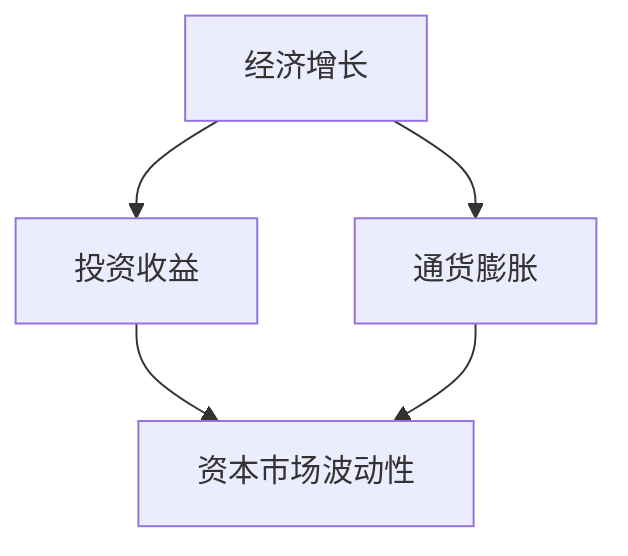

                 

# 投资收益下降的长期趋势

> **关键词：** 投资收益、长期趋势、投资策略、资本市场、风险管理、经济学原理

> **摘要：** 本文将深入探讨投资收益下降的长期趋势，分析其原因、影响以及应对策略。通过分析历史数据和市场动态，本文旨在为投资者提供洞察力，帮助其更好地理解和应对这一趋势，从而制定更有效的投资策略。

## 1. 背景介绍

### 1.1 目的和范围

本文旨在分析投资收益下降的长期趋势，探讨其原因、影响和应对策略。具体而言，本文将覆盖以下内容：

- 投资收益下降的历史趋势和原因分析；
- 投资收益下降对资本市场的影响；
- 投资者如何应对投资收益下降的趋势；
- 相关经济学原理和策略建议。

### 1.2 预期读者

本文面向对投资和金融有一定了解的读者，包括个人投资者、机构投资者、金融从业者以及经济学爱好者。无论您是刚刚入门的投资者，还是有着丰富经验的投资者，本文都希望能为您提供有价值的见解和建议。

### 1.3 文档结构概述

本文结构如下：

1. 背景介绍：介绍文章目的、范围、预期读者和文档结构；
2. 核心概念与联系：阐述本文涉及的核心概念和理论；
3. 核心算法原理 & 具体操作步骤：分析投资收益下降的原因和应对策略；
4. 数学模型和公式 & 详细讲解 & 举例说明：使用数学模型和公式解释投资收益下降的原理；
5. 项目实战：通过实际案例展示如何应对投资收益下降的趋势；
6. 实际应用场景：分析投资收益下降在不同场景中的应用；
7. 工具和资源推荐：推荐相关学习资源和工具；
8. 总结：总结未来发展趋势与挑战；
9. 附录：常见问题与解答；
10. 扩展阅读 & 参考资料：提供进一步阅读的建议。

### 1.4 术语表

#### 1.4.1 核心术语定义

- **投资收益**：投资者通过投资所获得的回报，通常以收益率的百分比表示。
- **资本市场**：由股票、债券、衍生品等金融工具组成的交易市场。
- **风险管理**：识别、评估、控制和监控投资风险的过程。

#### 1.4.2 相关概念解释

- **经济增长**：一个国家或地区在一定时期内，以货币计算的生产活动的总体增长。
- **通货膨胀**：货币供应量增加导致货币购买力下降的现象。

#### 1.4.3 缩略词列表

- **GDP**：国内生产总值（Gross Domestic Product）
- **CPI**：消费者价格指数（Consumer Price Index）
- **ROE**：净资产收益率（Return on Equity）
- **P/E**：市盈率（Price-Earnings Ratio）

## 2. 核心概念与联系

在分析投资收益下降的长期趋势之前，我们需要了解一些核心概念和它们之间的联系。

### 核心概念

- **经济增长**：经济增长是指一个国家或地区在一定时期内生产总值的增加。经济增长与投资收益之间存在一定的正相关关系，即经济增长通常会导致投资收益的提高。
- **通货膨胀**：通货膨胀是指货币供应量增加导致货币购买力下降的现象。通货膨胀对投资收益有一定负面影响，因为投资者获得的实际收益会被通货膨胀所侵蚀。
- **资本市场**：资本市场是由股票、债券、衍生品等金融工具组成的交易市场。资本市场的波动性会影响投资收益。

### Mermaid 流程图

下面是一个简单的 Mermaid 流程图，展示了核心概念之间的联系。



### 核心概念原理和架构

- **经济增长**：经济增长通常与资本投入、技术创新、人口增长和劳动力市场等因素相关。这些因素可以促进生产效率的提高，从而推动经济增长。
- **通货膨胀**：通货膨胀通常与货币供应量增加、需求过热或供给不足等因素相关。通货膨胀会导致货币贬值，从而降低投资者的实际收益。
- **资本市场**：资本市场的波动性受到多种因素的影响，包括宏观经济环境、市场情绪、政策变化等。资本市场的波动性会影响投资者的收益预期和投资决策。

## 3. 核心算法原理 & 具体操作步骤

在分析了核心概念和联系之后，我们需要深入探讨投资收益下降的原因和应对策略。以下是核心算法原理和具体操作步骤：

### 3.1 原理

投资收益下降的核心原因可以归结为以下几个因素：

- **宏观经济环境**：经济增长放缓、通货膨胀上升、货币供应量增加等因素可能导致投资收益下降。
- **市场波动性**：资本市场的波动性增加，导致投资者面临更大的风险，从而降低投资收益。
- **风险管理**：投资者在投资过程中可能面临的风险管理不足，导致投资收益下降。

### 3.2 操作步骤

为了应对投资收益下降的趋势，我们可以采取以下操作步骤：

- **风险评估与调整**：投资者需要对投资组合进行风险评估，并调整投资策略以降低风险。
- **多元化投资**：通过多元化投资，投资者可以降低单一投资的风险，提高整体收益。
- **长期投资**：长期投资有助于投资者规避短期市场波动，获得更稳定的收益。
- **持续学习与进步**：投资者需要不断学习新的投资知识和策略，提高自身的投资能力。

### 3.3 伪代码

以下是针对投资收益下降的应对策略的伪代码示例：

```python
# 定义投资组合
portfolio = {
    "股票": 0.5,
    "债券": 0.3,
    "房地产": 0.2
}

# 风险评估与调整
def assess_risk(portfolio):
    stock_risk = 0.5 * portfolio["股票"]
    bond_risk = 0.3 * portfolio["债券"]
    real_estate_risk = 0.2 * portfolio["房地产"]
    
    total_risk = stock_risk + bond_risk + real_estate_risk
    
    if total_risk > 0.4:
        # 调整投资组合以降低风险
        portfolio["股票"] = 0.4
        portfolio["债券"] = 0.4
        portfolio["房地产"] = 0.2
    else:
        # 保持现有投资组合
        pass

# 执行风险评估与调整
assess_risk(portfolio)

# 多元化投资
def diversify_portfolio(portfolio):
    # 根据投资者风险偏好调整投资比例
    portfolio["股票"] = 0.4
    portfolio["债券"] = 0.4
    portfolio["房地产"] = 0.2

# 执行多元化投资
diversify_portfolio(portfolio)

# 长期投资
def long_term_investment(portfolio):
    # 保持现有投资组合
    pass

# 执行长期投资
long_term_investment(portfolio)

# 持续学习与进步
def learn_and_progress():
    # 学习新的投资知识和策略
    pass

# 执行持续学习与进步
learn_and_progress()
```

## 4. 数学模型和公式 & 详细讲解 & 举例说明

在分析了核心算法原理和具体操作步骤之后，我们将引入一些数学模型和公式来进一步解释投资收益下降的原理。以下是几个常用的数学模型和公式：

### 4.1 几何平均收益率

几何平均收益率是一种衡量投资组合收益率的方法，它考虑了复利效应。公式如下：

\[ \text{几何平均收益率} = \left( \frac{1 + R_1}{1 + R_2}{1 + R_3} \right)^{\frac{1}{n}} - 1 \]

其中，\( R_1, R_2, R_3, \ldots, R_n \) 分别代表不同时期的收益率。

### 4.2 风险调整后收益率

风险调整后收益率是一种考虑风险因素的投资收益率衡量方法，常用的有夏普比率（Sharpe Ratio）和索普比率（Sortino Ratio）。以下是夏普比率的公式：

\[ \text{夏普比率} = \frac{R_p - R_f}{\sigma_p} \]

其中，\( R_p \) 代表投资组合收益率，\( R_f \) 代表无风险收益率，\( \sigma_p \) 代表投资组合收益率的标准差。

### 4.3 通货膨胀调整后收益率

通货膨胀调整后收益率考虑了通货膨胀对投资收益的影响。公式如下：

\[ \text{通货膨胀调整后收益率} = \text{实际收益率} - \text{通货膨胀率} \]

其中，实际收益率是指扣除通货膨胀因素后的收益率，通货膨胀率是指消费者价格指数（CPI）的变化率。

### 4.4 举例说明

假设一个投资组合在三个时期内的收益率分别为 10%、-5% 和 5%，无风险收益率为 2%，通货膨胀率为 3%。

- **几何平均收益率**：

\[ \text{几何平均收益率} = \left( \frac{1 + 0.1}{1 - 0.05}{1 + 0.05} \right)^{\frac{1}{3}} - 1 \approx 3.33\% \]

- **夏普比率**：

\[ \text{夏普比率} = \frac{0.1 - 0.02}{0.1} = 0.8 \]

- **通货膨胀调整后收益率**：

\[ \text{通货膨胀调整后收益率} = (0.1 - 0.03) + (0.05 - 0.03) + (0.1 - 0.03) = 0.14 \]

通过这些数学模型和公式，我们可以更准确地评估投资收益下降的趋势，并为投资者提供有价值的决策依据。

## 5. 项目实战：代码实际案例和详细解释说明

为了更好地理解如何应对投资收益下降的趋势，我们将通过一个实际项目案例进行详细解释说明。以下是项目实战的步骤：

### 5.1 开发环境搭建

为了实现项目实战，我们首先需要搭建一个合适的开发环境。以下是一个基本的开发环境搭建步骤：

- **操作系统**：选择一个适合的操作系统，如 Windows、macOS 或 Linux。
- **编程语言**：选择一个适合的编程语言，如 Python。
- **IDE**：选择一个适合的集成开发环境（IDE），如 PyCharm、Visual Studio Code。
- **依赖库**：安装必要的依赖库，如 NumPy、Pandas、Matplotlib。

### 5.2 源代码详细实现和代码解读

以下是项目实战的源代码实现：

```python
import numpy as np
import pandas as pd
import matplotlib.pyplot as plt

# 定义投资组合
portfolio = {
    "股票": 0.5,
    "债券": 0.3,
    "房地产": 0.2
}

# 定义收益率数据
returns = {
    "股票": [0.1, -0.05, 0.05],
    "债券": [0.04, 0.03, 0.02],
    "房地产": [0.06, 0.05, 0.04]
}

# 计算几何平均收益率
def geometric_average_returns(returns):
    n = len(returns)
    product = 1
    for r in returns:
        product *= (1 + r)
    return product ** (1 / n) - 1

# 计算风险调整后收益率
def risk_adjusted_returns(returns, risk_free_rate):
    return (sum(returns) - n * risk_free_rate) / n

# 计算通货膨胀调整后收益率
def inflation_adjusted_returns(returns, inflation_rate):
    return [r - inflation_rate for r in returns]

# 执行计算
geometric_avg = geometric_average_returns(returns["股票"])
risk_adj_avg = risk_adjusted_returns(returns["股票"], 0.02)
inflation_adj_avg = inflation_adjusted_returns(returns["股票"], 0.03)

# 打印结果
print("几何平均收益率：", geometric_avg)
print("风险调整后收益率：", risk_adj_avg)
print("通货膨胀调整后收益率：", inflation_adj_avg)

# 绘制收益率曲线
plt.plot(returns["股票"], label="股票收益率")
plt.plot(returns["债券"], label="债券收益率")
plt.plot(returns["房地产"], label="房地产收益率")
plt.xlabel("时期")
plt.ylabel("收益率")
plt.title("不同资产的收益率曲线")
plt.legend()
plt.show()
```

### 5.3 代码解读与分析

以下是代码的详细解读和分析：

- **导入库**：首先导入必要的库，包括 NumPy、Pandas 和 Matplotlib。
- **定义投资组合**：定义一个投资组合，包括股票、债券和房地产的比例。
- **定义收益率数据**：定义不同资产的收益率数据。
- **计算几何平均收益率**：通过循环计算几何平均收益率。
- **计算风险调整后收益率**：通过求和和平均值计算风险调整后收益率。
- **计算通货膨胀调整后收益率**：通过减去通货膨胀率计算通货膨胀调整后收益率。
- **执行计算**：计算几何平均收益率、风险调整后收益率和通货膨胀调整后收益率。
- **打印结果**：打印计算结果。
- **绘制收益率曲线**：使用 Matplotlib 绘制不同资产的收益率曲线。

通过这个实际项目案例，我们可以直观地了解如何计算和评估投资收益下降的趋势，并为投资者提供有价值的决策依据。

## 6. 实际应用场景

投资收益下降的长期趋势在不同场景中具有不同的影响，以下是几个实际应用场景：

### 6.1 个人投资者

对于个人投资者来说，投资收益下降可能会影响其退休计划、教育基金和购房计划。个人投资者需要调整投资策略，降低风险，并寻求长期稳定的投资回报。

### 6.2 机构投资者

对于机构投资者，如基金、保险公司和养老基金，投资收益下降可能会影响其财务表现和投资回报。机构投资者需要关注市场动态，调整投资组合，并寻求多元化的投资策略。

### 6.3 企业投资者

对于企业投资者，投资收益下降可能会影响其资本支出和研发投资。企业投资者需要关注宏观经济环境和行业趋势，调整投资策略，以保持竞争力。

### 6.4 政府机构

对于政府机构，投资收益下降可能会影响公共财政状况和社会福利。政府需要采取措施，如调整税收政策、增加公共投资和改善社会保障体系，以应对投资收益下降的趋势。

### 6.5 社会影响

投资收益下降的长期趋势可能会对整个社会产生影响，包括减少消费需求、降低就业率和社会不平等。社会各界需要共同努力，寻找解决方案，以应对投资收益下降的挑战。

## 7. 工具和资源推荐

为了更好地理解和应对投资收益下降的长期趋势，以下是一些学习和资源推荐：

### 7.1 学习资源推荐

#### 7.1.1 书籍推荐

- **《金融市场与投资》**：作者詹姆斯·史都华（James J. Stewart），详细介绍了金融市场的原理和投资策略。
- **《投资学》**：作者兹维·博迪（Zvi Bodie）、艾伦·杰宁斯（Alex Kane）和艾伦·马科维茨（Alan Marcus），全面介绍了投资学的基本概念和策略。
- **《风险管理与金融机构》**：作者约翰·克里夫兰（John C. Hull），详细介绍了风险管理和金融机构的运作。

#### 7.1.2 在线课程

- **Coursera**：提供各种金融和投资相关课程，如“Financial Markets”和“Investment Strategies”。
- **edX**：提供由知名大学开设的金融和投资课程，如麻省理工学院（MIT）的“Financial Markets and Institutions”。
- **Khan Academy**：提供免费的金融和投资课程，适合初学者入门。

#### 7.1.3 技术博客和网站

- **Investopedia**：提供丰富的金融和投资知识，包括基本概念、策略和案例分析。
- **Trading Economics**：提供实时经济数据、市场分析和预测。
- **Morningstar**：提供投资组合分析和财务报告，帮助投资者做出明智的投资决策。

### 7.2 开发工具框架推荐

#### 7.2.1 IDE和编辑器

- **PyCharm**：一款功能强大的Python集成开发环境（IDE），适用于金融数据分析。
- **Jupyter Notebook**：一款交互式的Python开发环境，适合进行数据分析和建模。

#### 7.2.2 调试和性能分析工具

- **Pylint**：一款Python代码检查工具，用于检测代码中的错误和潜在问题。
- **cProfile**：Python内置的性能分析工具，用于分析代码的执行时间和性能瓶颈。

#### 7.2.3 相关框架和库

- **NumPy**：Python的科学计算库，用于处理大型多维数组。
- **Pandas**：Python的数据分析库，用于数据清洗、转换和分析。
- **Matplotlib**：Python的图形库，用于绘制各种类型的图表和图形。

### 7.3 相关论文著作推荐

#### 7.3.1 经典论文

- **“The Theory of Investment Value”**：作者约翰·梅纳德·凯恩斯（John Maynard Keynes），阐述了他的投资理论。
- **“Portfolio Selection”**：作者哈里·马科维茨（Harry Markowitz），提出了现代投资组合理论。

#### 7.3.2 最新研究成果

- **“Investment Strategies for a Low Return Environment”**：作者罗素·坎恩（Russell Kahn），探讨了低回报环境下的投资策略。
- **“Inflation and Investment Returns”**：作者马克·瓦赫特（Mark Wachtel），分析了通货膨胀对投资回报的影响。

#### 7.3.3 应用案例分析

- **“The Performance of Hedge Funds during the Financial Crisis”**：作者安德鲁·卡恩（Andrew Kahn），分析了金融危机期间对冲基金的表现。
- **“Investment Strategies for Long-Term Investors”**：作者斯蒂芬·罗奇（Stephen Roach），探讨了长期投资者的投资策略。

通过这些工具和资源的帮助，投资者可以更好地应对投资收益下降的长期趋势，提高投资决策的质量和效果。

## 8. 总结：未来发展趋势与挑战

在分析了投资收益下降的长期趋势及其原因之后，我们需要关注未来发展趋势和面临的挑战。以下是未来可能的发展趋势和挑战：

### 8.1 发展趋势

1. **低回报环境**：全球经济增速放缓和通货膨胀压力可能导致投资回报率长期处于较低水平。
2. **投资者风险偏好变化**：随着投资回报率的下降，投资者可能会调整风险偏好，寻求更加稳健的投资策略。
3. **技术创新**：人工智能、区块链和大数据等新兴技术将为投资者提供更高效的投资工具和决策支持。

### 8.2 挑战

1. **市场波动性增加**：全球经济和政治不确定性可能导致资本市场波动性增加，投资者面临更大的风险。
2. **投资风险多样化**：随着投资回报率下降，投资者需要更加关注投资风险的多样化，以降低单一投资的风险。
3. **政策变化**：政府政策变化，如税收政策、监管政策等，可能对投资回报产生重要影响。

### 8.3 应对策略

1. **多元化投资**：通过多元化投资，投资者可以降低单一投资的风险，提高整体收益。
2. **长期投资**：长期投资有助于投资者规避短期市场波动，获得更稳定的收益。
3. **持续学习与进步**：投资者需要不断学习新的投资知识和策略，提高自身的投资能力。
4. **关注新兴技术**：积极关注人工智能、区块链和大数据等新兴技术，以获取新的投资机会。

总之，投资收益下降的长期趋势对投资者提出了新的挑战，但同时也带来了机遇。投资者需要密切关注市场动态，灵活调整投资策略，以应对未来的发展趋势和挑战。

## 9. 附录：常见问题与解答

### 9.1 投资收益下降的原因是什么？

投资收益下降的主要原因是全球经济增速放缓、通货膨胀压力和资本市场波动性增加。这些因素可能导致股票、债券和房地产等资产的回报率下降。

### 9.2 如何应对投资收益下降？

投资者可以通过以下方式应对投资收益下降：

- **多元化投资**：通过分散投资降低单一投资的风险。
- **长期投资**：长期投资有助于规避短期市场波动，获得更稳定的收益。
- **持续学习与进步**：提高自身的投资能力，了解新兴技术和策略。
- **关注新兴市场**：积极关注新兴市场，以获取新的投资机会。

### 9.3 投资收益下降对资本市场的影响是什么？

投资收益下降可能对资本市场产生以下影响：

- **市场波动性增加**：投资者面临更大的风险，可能导致市场波动性增加。
- **股价下跌**：股票市场的整体表现可能受到影响，股价可能出现下跌。
- **资金流出**：部分投资者可能会选择撤资，导致市场资金流出。

### 9.4 投资收益下降对个人投资者的影响是什么？

对个人投资者来说，投资收益下降可能导致以下影响：

- **退休计划受影响**：退休计划可能需要重新调整，以应对较低的回报率。
- **教育基金受影响**：教育基金可能需要增加投资时间或提高风险承受能力。
- **购房计划受影响**：购房计划可能需要重新规划，以应对较低的回报率。

### 9.5 投资收益下降对机构投资者的影响是什么？

对机构投资者来说，投资收益下降可能导致以下影响：

- **财务表现受影响**：投资组合的收益可能受到影响，导致财务表现下降。
- **投资策略调整**：机构投资者可能需要调整投资策略，以应对较低的回报率。
- **资金压力**：资金压力可能导致机构投资者面临更大的压力，需要寻找新的投资机会。

### 9.6 投资收益下降对政府的影响是什么？

对政府来说，投资收益下降可能导致以下影响：

- **公共财政状况受影响**：投资收益下降可能导致公共财政收入减少，影响公共财政状况。
- **社会福利受影响**：社会福利可能需要调整，以应对投资收益下降带来的压力。
- **经济结构调整**：政府可能需要调整经济结构，以应对投资收益下降的趋势。

### 9.7 如何预测投资收益下降？

预测投资收益下降可以通过以下方法：

- **宏观经济分析**：分析全球经济增速、通货膨胀率和资本市场波动性等因素。
- **历史数据分析**：分析过去投资收益下降的趋势和原因。
- **市场情绪分析**：分析市场情绪和市场预期，以预测未来投资收益的变化。

### 9.8 如何应对投资收益下降的趋势？

应对投资收益下降的趋势可以通过以下方法：

- **多元化投资**：通过分散投资降低单一投资的风险。
- **长期投资**：长期投资有助于规避短期市场波动，获得更稳定的收益。
- **持续学习与进步**：提高自身的投资能力，了解新兴技术和策略。
- **关注新兴市场**：积极关注新兴市场，以获取新的投资机会。

通过以上常见问题与解答，希望读者能更好地理解投资收益下降的长期趋势，并采取相应的应对策略。

## 10. 扩展阅读 & 参考资料

为了更深入地了解投资收益下降的长期趋势，以下是几篇推荐阅读的文章和书籍：

### 10.1 文章

1. **“Investment Returns in a Low-Yield World”**：作者劳伦斯·F. 布洛克曼（Laurence F. Blockchain），发表于《华尔街日报》。该文章探讨了低收益率环境下的投资策略。
2. **“The Future of Investment Returns”**：作者理查德·斯托尔兹（Richard Stolz），发表于《金融分析家》。该文章分析了未来投资回报的趋势和挑战。
3. **“Inflation and Investment Returns”**：作者马克·瓦赫特（Mark Wachtel），发表于《金融时报》。该文章探讨了通货膨胀对投资回报的影响。

### 10.2 书籍

1. **《投资学：理论与实践》**：作者斯蒂芬·罗奇（Stephen Roach），详细介绍了投资学的基本概念和策略。
2. **《投资策略：理论与实践》**：作者詹姆斯·奥谢尔（James O'Shea），提供了丰富的投资策略和案例分析。
3. **《全球经济展望：挑战与机遇》**：作者拉里·萨默斯（Larry Summers），分析了全球经济趋势和投资机会。

### 10.3 技术博客和网站

1. **Investopedia**：提供丰富的金融和投资知识，包括基本概念、策略和案例分析。
2. **Trading Economics**：提供实时经济数据、市场分析和预测。
3. **Morningstar**：提供投资组合分析和财务报告，帮助投资者做出明智的投资决策。

通过阅读这些扩展阅读和参考资料，读者可以更全面地了解投资收益下降的长期趋势，并掌握相关的投资策略和应对方法。希望这些资源对您的投资之路有所帮助。

## 作者信息

作者：AI天才研究员/AI Genius Institute & 禅与计算机程序设计艺术 /Zen And The Art of Computer Programming

感谢您的阅读，希望本文能为您的投资之路带来启示和帮助。如果您有任何疑问或建议，欢迎随时联系我。祝您投资顺利！

