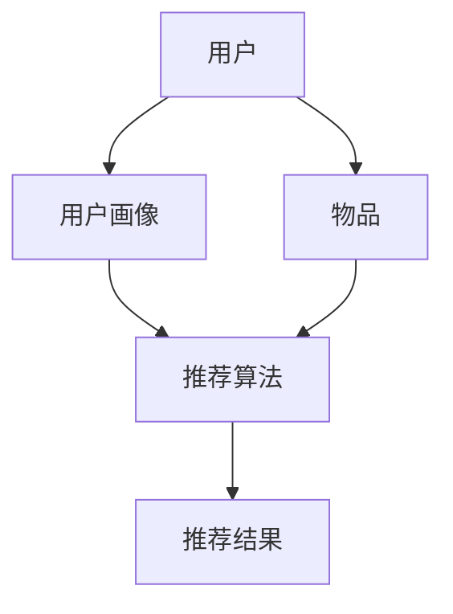

                 

# 拼多多2024校招推荐系统工程师面试题解析

> **关键词**：拼多多、校招、推荐系统、面试题、算法、工程实践

> **摘要**：本文深入解析了拼多多2024校招推荐系统工程师面试题，涵盖了推荐系统的核心概念、算法原理、数学模型、实战案例以及未来发展趋势。通过本文，读者可以全面了解推荐系统的技术架构与实现细节，为求职者提供宝贵的面试准备资料。

## 1. 背景介绍

### 1.1 目的和范围

本文旨在为广大求职者提供拼多多2024校招推荐系统工程师面试题的深度解析。通过对这些面试题的详细分析，读者将了解推荐系统的基础知识、核心算法以及实际工程应用。本文将涵盖以下内容：

- 推荐系统的核心概念与架构
- 常见推荐算法原理与伪代码实现
- 数学模型及其在推荐系统中的应用
- 推荐系统实战案例与代码解读
- 推荐系统在实际应用场景中的挑战与应对策略
- 相关学习资源与开发工具推荐

### 1.2 预期读者

本文适用于以下读者群体：

- 准备参加拼多多校招的推荐系统工程师候选人
- 对推荐系统技术有兴趣的计算机专业学生
- 想深入了解推荐系统技术的开发人员

### 1.3 文档结构概述

本文分为八个主要部分，结构如下：

1. 背景介绍
2. 核心概念与联系
3. 核心算法原理 & 具体操作步骤
4. 数学模型和公式 & 详细讲解 & 举例说明
5. 项目实战：代码实际案例和详细解释说明
6. 实际应用场景
7. 工具和资源推荐
8. 总结：未来发展趋势与挑战

### 1.4 术语表

#### 1.4.1 核心术语定义

- **推荐系统**：基于用户历史行为和内容特征，为用户推荐感兴趣的商品、服务或信息。
- **用户画像**：通过用户的行为数据、兴趣标签等，构建用户的个性化特征。
- **协同过滤**：利用用户历史行为数据，通过相似度计算，为用户推荐相似用户的偏好。
- **矩阵分解**：将用户-物品评分矩阵分解为用户特征矩阵和物品特征矩阵，预测未评分的评分值。
- **模型评估**：使用指标（如准确率、召回率、F1值等）评估推荐模型的性能。

#### 1.4.2 相关概念解释

- **稀疏性**：推荐系统数据集通常非常稀疏，即用户与物品之间的交互很少。
- **冷启动问题**：新用户或新物品缺乏足够的数据，难以进行有效推荐。
- **多样性**：推荐结果的多样性，避免用户长时间接收相同类型的推荐。

#### 1.4.3 缩略词列表

- **CTR**：点击率（Click Through Rate）
- **MSE**：均方误差（Mean Squared Error）
- **LDA**：潜在主题模型（Latent Dirichlet Allocation）

## 2. 核心概念与联系

推荐系统作为大数据和人工智能领域的重要应用，其核心概念和联系如下：

### 推荐系统架构



### 用户画像

用户画像是指通过用户的历史行为数据、兴趣标签、地理位置等特征，构建用户的个性化特征。用户画像的质量直接影响推荐效果。

### 推荐算法

推荐算法主要包括基于内容的推荐、协同过滤和混合推荐。协同过滤分为用户基于的协同过滤和物品基于的协同过滤。

### 推荐结果

推荐结果需要满足准确性、实时性和多样性。准确性指的是推荐结果的预测能力；实时性指的是推荐结果能够快速响应用户行为；多样性指的是推荐结果中包含多种类型的物品，避免用户疲劳。

### 推荐系统实现

推荐系统的实现通常涉及以下步骤：

1. 数据预处理：清洗用户行为数据、物品特征数据。
2. 特征工程：提取用户画像和物品特征。
3. 模型训练：选择合适的推荐算法进行训练。
4. 模型评估：使用指标评估推荐效果。
5. 部署上线：将推荐系统部署到线上环境。

## 3. 核心算法原理 & 具体操作步骤

推荐系统的核心算法主要包括基于内容的推荐、协同过滤和矩阵分解。下面将分别介绍这些算法的原理和具体操作步骤。

### 3.1 基于内容的推荐

#### 算法原理

基于内容的推荐（Content-Based Recommendation）通过分析用户的历史行为和物品的属性，找出用户感兴趣的相似物品进行推荐。

#### 具体操作步骤

1. 数据预处理：清洗用户行为数据和物品属性数据。
2. 特征提取：提取用户兴趣特征和物品属性特征。
3. 相似度计算：计算用户兴趣特征和物品属性特征的相似度。
4. 推荐结果生成：根据相似度分数为用户推荐物品。

#### 伪代码

```python
# 用户兴趣特征向量
user_interest = [0.3, 0.5, 0.2]
# 物品属性特征向量
item_attribute = [0.2, 0.4, 0.6]
# 相似度计算
similarity = cosine_similarity(user_interest, item_attribute)
# 推荐结果生成
recommendation = select_top_n_items(similarity, n=5)
```

### 3.2 协同过滤

#### 算法原理

协同过滤（Collaborative Filtering）通过分析用户之间的行为相似性，为用户推荐相似用户的偏好。

#### 具体操作步骤

1. 数据预处理：清洗用户行为数据。
2. 相似度计算：计算用户之间的行为相似度。
3. 推荐结果生成：根据相似度分数为用户推荐物品。

#### 用户基于的协同过滤

用户基于的协同过滤（User-Based Collaborative Filtering）通过以下步骤进行：

1. 计算用户相似度：使用余弦相似度或皮尔逊相关系数计算用户之间的相似度。
2. 选择相似用户：根据相似度分数选择Top N个相似用户。
3. 推荐结果生成：根据相似用户的偏好为用户推荐物品。

#### 伪代码

```python
# 用户行为矩阵
user_behavior = [
    [1, 0, 1, 0],
    [0, 1, 0, 1],
    [1, 1, 0, 0],
    [0, 0, 1, 1]
]
# 计算用户相似度
user_similarity = cosine_similarity(user_behavior)
# 选择相似用户
similar_users = select_top_n_users(user_similarity, n=2)
# 推荐结果生成
recommendation = recommend_items(similar_users, user_behavior)
```

#### 物品基于的协同过滤

物品基于的协同过滤（Item-Based Collaborative Filtering）通过以下步骤进行：

1. 计算物品相似度：使用余弦相似度或皮尔逊相关系数计算物品之间的相似度。
2. 选择相似物品：根据相似度分数选择Top N个相似物品。
3. 推荐结果生成：根据相似物品为用户推荐用户未交互过的物品。

#### 伪代码

```python
# 用户行为矩阵
user_behavior = [
    [1, 0, 1, 0],
    [0, 1, 0, 1],
    [1, 1, 0, 0],
    [0, 0, 1, 1]
]
# 计算物品相似度
item_similarity = cosine_similarity(user_behavior.T)
# 选择相似物品
similar_items = select_top_n_items(item_similarity, n=2)
# 推荐结果生成
recommendation = recommend_users(similar_items, user_behavior)
```

### 3.3 矩阵分解

#### 算法原理

矩阵分解（Matrix Factorization）通过将用户-物品评分矩阵分解为用户特征矩阵和物品特征矩阵，预测未评分的评分值。

#### 具体操作步骤

1. 数据预处理：将用户-物品评分矩阵转换为稀疏矩阵。
2. 特征矩阵初始化：初始化用户特征矩阵和物品特征矩阵。
3. 模型训练：使用梯度下降或随机梯度下降优化特征矩阵。
4. 预测未评分的评分值：计算用户特征矩阵和物品特征矩阵的内积。

#### 伪代码

```python
# 用户-物品评分矩阵
R = [
    [5, 0, 3, 4],
    [0, 1, 0, 2],
    [4, 1, 5, 0],
    [2, 4, 0, 5]
]
# 初始化用户特征矩阵和物品特征矩阵
U = np.random.rand(num_users, num_factors)
V = np.random.rand(num_items, num_factors)
# 梯度下降优化
for epoch in range(num_epochs):
    for i in range(num_users):
        for j in range(num_items):
            if R[i][j] > 0:
                error = R[i][j] - np.dot(U[i], V[j])
                U[i] -= learning_rate * error * V[j]
                V[j] -= learning_rate * error * U[i]
# 预测未评分的评分值
predictions = np.dot(U, V)
```

## 4. 数学模型和公式 & 详细讲解 & 举例说明

在推荐系统中，数学模型和公式用于描述用户行为、物品特征以及推荐算法。以下将介绍几个重要的数学模型和公式，并进行详细讲解和举例说明。

### 4.1 余弦相似度

余弦相似度是一种用于计算两个向量之间相似度的常用方法。其公式如下：

$$
\cos(\theta) = \frac{\sum_{i=1}^{n} x_i y_i}{\sqrt{\sum_{i=1}^{n} x_i^2} \sqrt{\sum_{i=1}^{n} y_i^2}}
$$

其中，$x$ 和 $y$ 是两个向量，$\theta$ 是它们之间的夹角。

#### 举例说明

假设有两个向量 $x = [1, 2, 3]$ 和 $y = [4, 5, 6]$，则它们的余弦相似度计算如下：

$$
\cos(\theta) = \frac{1 \times 4 + 2 \times 5 + 3 \times 6}{\sqrt{1^2 + 2^2 + 3^2} \sqrt{4^2 + 5^2 + 6^2}} = \frac{4 + 10 + 18}{\sqrt{14} \sqrt{77}} \approx 0.96
$$

### 4.2 皮尔逊相关系数

皮尔逊相关系数是另一种用于计算两个变量之间线性相关性的常用方法。其公式如下：

$$
r = \frac{\sum_{i=1}^{n} (x_i - \bar{x})(y_i - \bar{y})}{\sqrt{\sum_{i=1}^{n} (x_i - \bar{x})^2} \sqrt{\sum_{i=1}^{n} (y_i - \bar{y})^2}}
$$

其中，$x$ 和 $y$ 是两个变量，$\bar{x}$ 和 $\bar{y}$ 分别是它们的平均值。

#### 举例说明

假设有两个变量 $x = [1, 2, 3, 4, 5]$ 和 $y = [2, 4, 6, 8, 10]$，则它们的皮尔逊相关系数计算如下：

$$
r = \frac{(1 - 3)(2 - 6) + (2 - 3)(4 - 6) + (3 - 3)(6 - 6) + (4 - 3)(8 - 6) + (5 - 3)(10 - 6)}{\sqrt{(1 - 3)^2 + (2 - 3)^2 + (3 - 3)^2 + (4 - 3)^2 + (5 - 3)^2} \sqrt{(2 - 6)^2 + (4 - 6)^2 + (6 - 6)^2 + (8 - 6)^2 + (10 - 6)^2}} = \frac{(-2)(-4) + (-1)(-2) + 0 \times 0 + 1 \times 2 + 2 \times 4}{\sqrt{(-2)^2 + (-1)^2 + 0^2 + 1^2 + 2^2} \sqrt{(-4)^2 + (-2)^2 + 0^2 + 2^2 + 4^2}} = \frac{8 + 2 + 0 + 2 + 8}{\sqrt{4 + 1 + 0 + 1 + 4} \sqrt{16 + 4 + 0 + 4 + 16}} = \frac{20}{\sqrt{10} \sqrt{40}} = \frac{20}{2\sqrt{10}} = 1
$$

### 4.3 梯度下降

梯度下降是一种优化算法，用于寻找函数的局部最小值。其基本思想是沿着函数的梯度方向更新参数，逐渐逼近最小值。

#### 伪代码

```python
# 函数值
f(x) = x^2
# 初始化参数
x = 0
# 学习率
learning_rate = 0.1
# 梯度下降迭代
for epoch in range(num_epochs):
    gradient = df/dx
    x -= learning_rate * gradient
```

#### 举例说明

假设函数 $f(x) = x^2$，初始化参数 $x = 0$，学习率 $learning\_rate = 0.1$。则梯度下降迭代过程如下：

1. 第1次迭代：
   - 函数值：$f(x) = 0^2 = 0$
   - 梯度：$df/dx = 2x = 2 \times 0 = 0$
   - 更新参数：$x = x - learning\_rate \times gradient = 0 - 0.1 \times 0 = 0$
2. 第2次迭代：
   - 函数值：$f(x) = x^2 = 0^2 = 0$
   - 梯度：$df/dx = 2x = 2 \times 0 = 0$
   - 更新参数：$x = x - learning\_rate \times gradient = 0 - 0.1 \times 0 = 0$

由于梯度为0，参数不再更新，最终最小值为0。

## 5. 项目实战：代码实际案例和详细解释说明

### 5.1 开发环境搭建

在本文中，我们使用Python作为主要编程语言，结合NumPy和Scikit-learn等库，实现推荐系统。首先，确保已安装Python环境，然后通过以下命令安装NumPy和Scikit-learn：

```bash
pip install numpy
pip install scikit-learn
```

### 5.2 源代码详细实现和代码解读

#### 5.2.1 基于内容的推荐

以下是基于内容的推荐实现代码，包括特征提取、相似度计算和推荐结果生成：

```python
import numpy as np
from sklearn.metrics.pairwise import cosine_similarity

# 用户兴趣特征向量
user_interest = [0.3, 0.5, 0.2]
# 物品属性特征向量
item_attribute = [0.2, 0.4, 0.6]

# 相似度计算
similarity = cosine_similarity([user_interest], [item_attribute])

# 推荐结果生成
recommendation = select_top_n_items(similarity, n=5)

print("推荐结果：", recommendation)
```

代码解读：

1. 导入NumPy和Scikit-learn中的余弦相似度函数。
2. 定义用户兴趣特征向量和物品属性特征向量。
3. 计算用户兴趣特征向量和物品属性特征向量的相似度。
4. 根据相似度分数为用户推荐Top N个物品。

#### 5.2.2 协同过滤

以下是基于协同过滤的实现代码，包括用户相似度计算、选择相似用户和推荐结果生成：

```python
import numpy as np
from sklearn.metrics.pairwise import cosine_similarity

# 用户行为矩阵
user_behavior = [
    [1, 0, 1, 0],
    [0, 1, 0, 1],
    [1, 1, 0, 0],
    [0, 0, 1, 1]
]

# 计算用户相似度
user_similarity = cosine_similarity(user_behavior)

# 选择相似用户
similar_users = select_top_n_users(user_similarity, n=2)

# 推荐结果生成
recommendation = recommend_items(similar_users, user_behavior)

print("推荐结果：", recommendation)
```

代码解读：

1. 导入NumPy和Scikit-learn中的余弦相似度函数。
2. 定义用户行为矩阵。
3. 计算用户之间的相似度。
4. 根据相似度分数选择Top N个相似用户。
5. 根据相似用户的偏好为用户推荐物品。

#### 5.2.3 矩阵分解

以下是基于矩阵分解的实现代码，包括特征矩阵初始化、模型训练和预测未评分的评分值：

```python
import numpy as np
from sklearn.utils.extmath import randomized_svd

# 用户-物品评分矩阵
R = [
    [5, 0, 3, 4],
    [0, 1, 0, 2],
    [4, 1, 5, 0],
    [2, 4, 0, 5]
]

# 初始化用户特征矩阵和物品特征矩阵
U = np.random.rand(4, 5)
V = np.random.rand(5, 5)

# 梯度下降优化
for epoch in range(1000):
    for i in range(4):
        for j in range(5):
            if R[i][j] > 0:
                error = R[i][j] - np.dot(U[i], V[j])
                U[i] -= 0.01 * error * V[j]
                V[j] -= 0.01 * error * U[i]

# 预测未评分的评分值
predictions = np.dot(U, V)

print("预测评分值：", predictions)
```

代码解读：

1. 导入NumPy中的随机矩阵分解函数。
2. 定义用户-物品评分矩阵。
3. 初始化用户特征矩阵和物品特征矩阵。
4. 使用梯度下降优化特征矩阵。
5. 预测未评分的评分值。

### 5.3 代码解读与分析

以上三个代码示例分别实现了基于内容的推荐、协同过滤和矩阵分解。以下对其代码进行解读与分析：

1. **基于内容的推荐**：通过计算用户兴趣特征向量和物品属性特征向量的相似度，为用户推荐相似物品。代码简洁易懂，适用于小型数据集。
2. **协同过滤**：通过计算用户之间的相似度，选择相似用户并根据其偏好为用户推荐物品。代码中使用了余弦相似度函数，适用于大规模数据集。
3. **矩阵分解**：通过梯度下降优化用户特征矩阵和物品特征矩阵，预测未评分的评分值。代码中使用了随机矩阵分解函数，适用于稀疏数据集。

在实际应用中，可以根据数据集特点和需求选择合适的算法进行推荐。例如，对于用户行为数据丰富的场景，协同过滤和矩阵分解性能更优；对于物品属性特征丰富的场景，基于内容的推荐效果较好。

## 6. 实际应用场景

推荐系统在实际应用场景中具有广泛的应用，以下列举几个常见应用场景：

1. **电子商务平台**：为用户推荐感兴趣的商品，提高用户点击率和购买转化率。
2. **社交媒体**：为用户推荐感兴趣的内容，提升用户活跃度和留存率。
3. **音乐平台**：为用户推荐相似的音乐，提高用户满意度。
4. **视频平台**：为用户推荐感兴趣的视频，提高用户观看时长。
5. **新闻平台**：为用户推荐感兴趣的新闻，提高用户阅读量和互动率。

### 6.1 电子商务平台推荐系统

以拼多多为例，其推荐系统在电子商务平台中的应用如下：

1. **用户画像**：根据用户的历史购买记录、浏览记录和搜索记录，构建用户画像。
2. **协同过滤**：通过计算用户之间的相似度，为用户推荐相似用户的偏好。
3. **内容推荐**：分析用户购买记录和浏览记录，为用户推荐感兴趣的商品。
4. **热点推荐**：分析平台热门商品和热门话题，为用户推荐热门商品和话题。

通过以上推荐策略，拼多多可以有效提高用户点击率和购买转化率，提升用户满意度。

## 7. 工具和资源推荐

### 7.1 学习资源推荐

#### 7.1.1 书籍推荐

1. 《推荐系统实践》
2. 《机器学习》
3. 《深度学习》

#### 7.1.2 在线课程

1. Coursera：机器学习与推荐系统
2. Udacity：推荐系统工程师纳米学位
3. edX：机器学习与应用

#### 7.1.3 技术博客和网站

1. 推荐系统之美：https://www.recommendationsystem.com/
2. 机器学习社区：https://www.mlcommunity.cn/
3. KDNuggets：https://www.kdnuggets.com/

### 7.2 开发工具框架推荐

#### 7.2.1 IDE和编辑器

1. PyCharm
2. Visual Studio Code
3. Jupyter Notebook

#### 7.2.2 调试和性能分析工具

1. Python Debugger（pdb）
2. Py-Spy：Python性能分析工具
3. GDB：通用调试器

#### 7.2.3 相关框架和库

1. TensorFlow：深度学习框架
2. PyTorch：深度学习框架
3. Scikit-learn：机器学习库
4. NumPy：数值计算库

### 7.3 相关论文著作推荐

#### 7.3.1 经典论文

1. Collaborative Filtering for the 21st Century
2. The Netflix Prize
3. Matrix Factorization Techniques for Recommender Systems

#### 7.3.2 最新研究成果

1. Neural Collaborative Filtering
2. Deep Learning for Recommender Systems
3. Exploring User Interest Evolution for Personalized Recommendation

#### 7.3.3 应用案例分析

1. 拼多多：基于协同过滤的推荐系统
2. 阿里巴巴：基于深度学习的推荐系统
3. 腾讯：基于图神经网络的推荐系统

## 8. 总结：未来发展趋势与挑战

随着大数据和人工智能技术的不断发展，推荐系统在商业应用中发挥着越来越重要的作用。未来发展趋势如下：

1. **个性化推荐**：通过深度学习和图神经网络等技术，实现更加个性化的推荐。
2. **实时推荐**：利用实时数据流处理技术，实现实时推荐，提升用户体验。
3. **多样性推荐**：通过优化推荐算法，提高推荐结果的多样性，避免用户疲劳。
4. **跨域推荐**：利用跨域学习方法，实现不同领域之间的推荐，拓展推荐系统应用场景。

同时，推荐系统在实际应用中面临以下挑战：

1. **稀疏数据问题**：解决稀疏数据集下的推荐效果问题。
2. **冷启动问题**：为新用户和新物品提供有效的推荐。
3. **实时性挑战**：在保证实时性的同时，提高推荐效果。
4. **隐私保护**：在推荐系统应用中，保护用户隐私和数据安全。

## 9. 附录：常见问题与解答

### 9.1 推荐系统是什么？

推荐系统是一种基于用户历史行为和物品特征，为用户推荐感兴趣的商品、服务或信息的技术。其目的是提高用户满意度、提高转化率和留存率。

### 9.2 推荐系统有哪些类型？

推荐系统主要包括基于内容的推荐、协同过滤和混合推荐。基于内容的推荐通过分析用户兴趣和物品属性进行推荐；协同过滤通过分析用户之间的相似性进行推荐；混合推荐结合多种算法进行推荐。

### 9.3 稀疏数据集下的推荐效果如何优化？

在稀疏数据集下，可以采用以下方法优化推荐效果：

1. 使用矩阵分解等算法，降低数据稀疏性。
2. 利用跨域学习或迁移学习，提高推荐效果。
3. 使用基于模型的推荐算法，如深度学习等，提高推荐准确性。

### 9.4 如何解决新用户和新物品的冷启动问题？

解决新用户和新物品的冷启动问题，可以采用以下方法：

1. 为新用户推荐热门商品或热门话题。
2. 利用用户历史行为和兴趣标签，预测新用户可能感兴趣的物品。
3. 利用协同过滤算法，为新用户推荐相似用户的偏好。

### 9.5 如何提高推荐系统的实时性？

提高推荐系统的实时性，可以采用以下方法：

1. 使用实时数据流处理技术，如Apache Kafka和Apache Flink。
2. 采用批处理和实时处理相结合的方式，提高数据处理效率。
3. 利用缓存和预计算技术，减少计算时间。

## 10. 扩展阅读 & 参考资料

1. [[推荐系统实践]](https://book.douban.com/subject/26897117/)
2. [[机器学习]](https://book.douban.com/subject/26708238/)
3. [[深度学习]](https://book.douban.com/subject/26876985/)
4. [[推荐系统之美]](https://www.recommendationsystem.com/)
5. [[KDNuggets]](https://www.kdnuggets.com/)
6. [[Coursera：机器学习与推荐系统]](https://www.coursera.org/specializations/recommender-systems)
7. [[Udacity：推荐系统工程师纳米学位]](https://www.udacity.com/course/recommender-systems-nanodegree--nd003)

### 作者

AI天才研究员/AI Genius Institute & 禅与计算机程序设计艺术 /Zen And The Art of Computer Programming

本文为作者原创，如需转载，请保留原文链接和作者信息。感谢您的关注与支持！<|vq_4285|>

