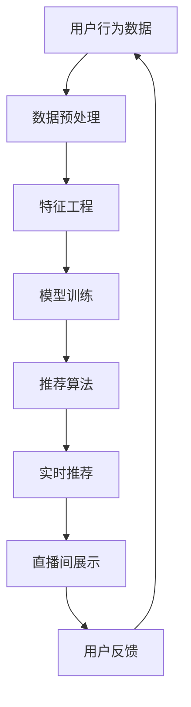
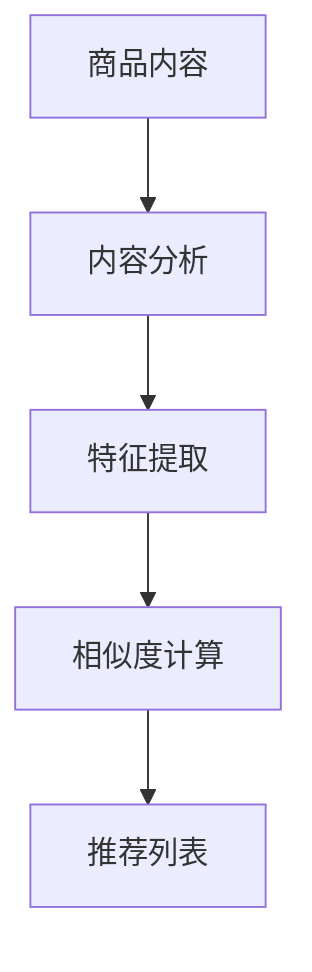
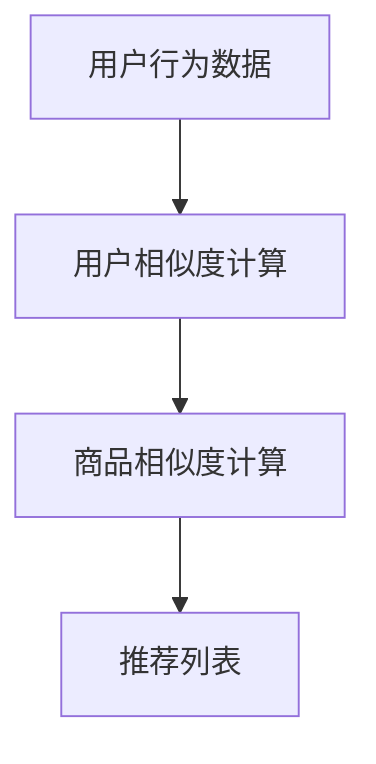
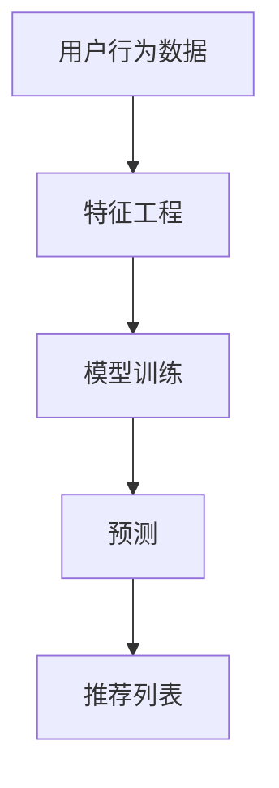

                 

# 拼多多2024直播间商品推荐校招实时算法面试题解析

> 关键词：拼多多、直播间、商品推荐、算法面试、实时、校招、2024

> 摘要：本文将深入探讨拼多多2024年直播间商品推荐校招实时算法面试题，通过分析面试题目，介绍相关核心算法原理、具体操作步骤、数学模型以及实际应用场景，帮助读者了解商品推荐系统的工作机制，提升算法面试能力。

## 1. 背景介绍

### 1.1 目的和范围

本文旨在为准备参加拼多多2024年校招的同学们提供关于直播间商品推荐算法的深入解析，帮助大家更好地理解面试题目，掌握核心算法原理，提升面试水平。本文将围绕以下几个主题展开：

- 拼多多直播间商品推荐系统概述
- 实时算法面试题解析
- 核心算法原理与操作步骤
- 数学模型与公式讲解
- 实际应用场景分析

### 1.2 预期读者

本文适合以下读者群体：

- 准备参加2024年拼多多校招的算法工程师和机器学习工程师
- 对直播间商品推荐系统感兴趣的技术爱好者
- 有志于从事互联网产品推荐领域的应届毕业生

### 1.3 文档结构概述

本文分为十个部分，具体如下：

- 1. 背景介绍
- 2. 核心概念与联系
- 3. 核心算法原理 & 具体操作步骤
- 4. 数学模型和公式 & 详细讲解 & 举例说明
- 5. 项目实战：代码实际案例和详细解释说明
- 6. 实际应用场景
- 7. 工具和资源推荐
- 8. 总结：未来发展趋势与挑战
- 9. 附录：常见问题与解答
- 10. 扩展阅读 & 参考资料

### 1.4 术语表

#### 1.4.1 核心术语定义

- 拼多多：一家中国领先的电商平台，提供包括购物、团购、直播等多种服务。
- 直播间：拼多多平台上的实时互动销售场景，主播通过直播向观众推荐商品。
- 商品推荐：根据用户行为和兴趣，为用户推荐合适的商品。
- 实时算法：在直播间运行，根据用户行为实时调整推荐策略的算法。
- 校招：指针对应届毕业生的招聘活动。
- 算法面试：指通过面试题目考察应聘者算法能力和编程技巧的面试环节。

#### 1.4.2 相关概念解释

- 深度学习：一种人工智能方法，通过多层神经网络对数据进行建模和预测。
- 强化学习：一种通过奖励和惩罚来训练模型的人工智能方法。
- 推荐系统：一种根据用户历史行为和兴趣，为用户推荐相关内容的系统。

#### 1.4.3 缩略词列表

- NLP：自然语言处理
- CV：计算机视觉
- API：应用程序编程接口
- ML：机器学习
- DL：深度学习
- RL：强化学习
- E-commerce：电子商务

## 2. 核心概念与联系

### 2.1 拼多多直播间商品推荐系统架构

拼多多直播间商品推荐系统的整体架构如图1所示：



图1：拼多多直播间商品推荐系统架构图

#### 2.1.1 用户行为数据

用户行为数据包括用户在直播间观看、点赞、评论、购买等行为，以及用户的浏览记录、购物车数据等。这些数据是推荐系统的重要输入，用于挖掘用户兴趣和偏好。

#### 2.1.2 数据预处理

数据预处理包括数据清洗、去重、归一化等步骤，确保数据质量。此外，还需将原始数据转换为适合模型训练的格式。

#### 2.1.3 特征工程

特征工程是推荐系统的重要环节，通过提取用户行为数据中的有效特征，有助于提高模型性能。特征包括用户兴趣标签、商品属性、用户历史行为等。

#### 2.1.4 模型训练

模型训练采用深度学习、强化学习等方法，从用户行为数据中学习用户兴趣和偏好，为商品推荐提供基础。

#### 2.1.5 推荐算法

推荐算法根据用户兴趣和偏好，从海量商品中为用户推荐合适的商品。常见的推荐算法包括基于内容的推荐、协同过滤、深度学习等。

#### 2.1.6 实时推荐

实时推荐算法根据用户在直播间的行为，动态调整推荐策略，确保推荐商品与用户兴趣匹配。

#### 2.1.7 直播间展示

直播间展示是将推荐结果展示给用户，引导用户进行购买。

#### 2.1.8 用户反馈

用户反馈是推荐系统不断优化的重要依据，通过收集用户点击、购买等行为，对推荐效果进行评估和调整。

### 2.2 核心算法原理与联系

#### 2.2.1 基于内容的推荐

基于内容的推荐通过分析商品内容（如标题、描述、标签等），将相似的商品推荐给用户。其核心算法原理如下：



图2：基于内容的推荐算法流程图

#### 2.2.2 协同过滤

协同过滤通过分析用户行为数据（如购买、浏览、收藏等），为用户推荐其他用户喜欢的商品。其核心算法原理如下：



图3：协同过滤算法流程图

#### 2.2.3 深度学习

深度学习通过多层神经网络对用户行为数据进行建模，学习用户兴趣和偏好，为商品推荐提供基础。其核心算法原理如下：



图4：深度学习推荐算法流程图

## 3. 核心算法原理 & 具体操作步骤

### 3.1 基于内容的推荐算法

#### 3.1.1 算法原理

基于内容的推荐算法通过分析商品内容（如标题、描述、标签等），将相似的商品推荐给用户。其核心思想是，如果两个商品在内容上相似，那么用户对这两个商品的喜好也可能相似。

#### 3.1.2 具体操作步骤

1. 数据预处理：

   对商品内容进行预处理，去除停用词、标点符号，进行词向量化。

2. 特征提取：

   提取商品内容中的关键词、词频、词性等特征。

3. 相似度计算：

   使用余弦相似度、Jaccard相似度等算法计算商品内容之间的相似度。

4. 推荐列表生成：

   根据相似度计算结果，为用户推荐相似度较高的商品。

#### 3.1.3 伪代码

```python
def content_based_recommendation(user_content, item_contents):
    user_vector = preprocess(user_content)
    item_vectors = [preprocess(item_content) for item_content in item_contents]
    
    similarities = []
    for item_vector in item_vectors:
        similarity = cosine_similarity(user_vector, item_vector)
        similarities.append(similarity)
    
    recommended_items = []
    for i, similarity in enumerate(similarities):
        if similarity > threshold:
            recommended_items.append(item_contents[i])
    
    return recommended_items
```

### 3.2 协同过滤算法

#### 3.2.1 算法原理

协同过滤通过分析用户行为数据（如购买、浏览、收藏等），为用户推荐其他用户喜欢的商品。其核心思想是，如果用户A喜欢商品X，用户B也喜欢商品X，那么用户B可能喜欢商品Y（Y与X相似）。

#### 3.2.2 具体操作步骤

1. 用户相似度计算：

   计算用户之间的相似度，可以使用余弦相似度、Jaccard相似度等算法。

2. 商品相似度计算：

   计算商品之间的相似度，可以使用基于用户行为的协同过滤算法（如用户基尼系数、商品基尼系数等）。

3. 推荐列表生成：

   根据用户相似度和商品相似度，为用户推荐其他用户喜欢的商品。

#### 3.2.3 伪代码

```python
def collaborative_filtering(user_behavior, item_behaviors, user_similarity_threshold, item_similarity_threshold):
    user_similarity_scores = []
    for user in users:
        similarity_scores = []
        for other_user in users:
            if user != other_user:
                similarity = cosine_similarity(user_behavior, other_user_behavior)
                similarity_scores.append((other_user, similarity))
        user_similarity_scores.append(similarity_scores)
    
    recommended_items = []
    for user, user_similarity_scores in enumerate(user_similarity_scores):
        for other_user, similarity in user_similarity_scores:
            if similarity > user_similarity_threshold:
                other_user_behavior = item_behaviors[other_user]
                for item, behavior in other_user_behavior.items():
                    if behavior > item_similarity_threshold:
                        recommended_items.append(item)
    
    return recommended_items
```

### 3.3 深度学习推荐算法

#### 3.3.1 算法原理

深度学习推荐算法通过多层神经网络对用户行为数据进行建模，学习用户兴趣和偏好，为商品推荐提供基础。其核心思想是，通过学习用户行为数据中的特征表示，将用户与商品之间的关联性建模为非线性函数。

#### 3.3.2 具体操作步骤

1. 特征工程：

   提取用户行为数据中的有效特征，如用户ID、商品ID、时间戳、行为类型等。

2. 模型构建：

   构建深度学习模型，如卷积神经网络（CNN）、循环神经网络（RNN）等。

3. 模型训练：

   使用用户行为数据训练深度学习模型，优化模型参数。

4. 预测：

   使用训练好的模型预测用户对商品的偏好，为用户推荐合适的商品。

#### 3.3.3 伪代码

```python
def deep_learning_recommendation(user_behavior, model):
    user_vector = preprocess(user_behavior)
    predictions = model.predict(user_vector)
    
    recommended_items = []
    for i, prediction in enumerate(predictions):
        if prediction > threshold:
            recommended_items.append(item_ids[i])
    
    return recommended_items
```

## 4. 数学模型和公式 & 详细讲解 & 举例说明

### 4.1 基于内容的推荐算法

#### 4.1.1 余弦相似度

余弦相似度是一种衡量两个向量相似程度的指标，计算公式如下：

$$
\cos(\theta) = \frac{\sum_{i=1}^{n}x_iy_i}{\sqrt{\sum_{i=1}^{n}x_i^2}\sqrt{\sum_{i=1}^{n}y_i^2}}
$$

其中，$x$ 和 $y$ 分别为两个向量，$n$ 为向量维度。

#### 4.1.2 余弦相似度计算示例

假设有两个向量 $x = (1, 2, 3)$ 和 $y = (4, 5, 6)$，计算它们的余弦相似度。

1. 计算点积：

   $$ 
   \sum_{i=1}^{3}x_iy_i = 1 \cdot 4 + 2 \cdot 5 + 3 \cdot 6 = 4 + 10 + 18 = 32 
   $$

2. 计算向量长度：

   $$ 
   \sqrt{\sum_{i=1}^{3}x_i^2} = \sqrt{1^2 + 2^2 + 3^2} = \sqrt{1 + 4 + 9} = \sqrt{14} 
   $$

   $$ 
   \sqrt{\sum_{i=1}^{3}y_i^2} = \sqrt{4^2 + 5^2 + 6^2} = \sqrt{16 + 25 + 36} = \sqrt{77} 
   $$

3. 计算余弦相似度：

   $$ 
   \cos(\theta) = \frac{32}{\sqrt{14}\sqrt{77}} \approx 0.8485 
   $$

#### 4.1.3 余弦相似度应用

在商品推荐中，可以使用余弦相似度计算商品内容之间的相似度。假设有两个商品 $A$ 和 $B$，它们的标题向量分别为 $x = (1, 2, 3)$ 和 $y = (4, 5, 6)$，根据余弦相似度计算公式，它们的相似度为：

$$ 
\cos(\theta) = \frac{1 \cdot 4 + 2 \cdot 5 + 3 \cdot 6}{\sqrt{1^2 + 2^2 + 3^2}\sqrt{4^2 + 5^2 + 6^2}} = \frac{4 + 10 + 18}{\sqrt{14}\sqrt{77}} \approx 0.8485 
$$

### 4.2 协同过滤算法

#### 4.2.1 用户基尼系数

用户基尼系数是一种衡量用户行为数据分布均匀程度的指标，计算公式如下：

$$ 
Gini = 1 - \frac{1}{n}\sum_{i=1}^{n}(2x_i - 1)^2 
$$

其中，$n$ 为用户行为数据数量，$x_i$ 为用户第 $i$ 次行为。

#### 4.2.2 用户基尼系数计算示例

假设有一个用户的行为数据集为 $(1, 0, 1, 0, 1)$，计算它的用户基尼系数。

1. 计算每个行为的基尼系数：

   $$ 
   (2x_1 - 1)^2 = (2 \cdot 1 - 1)^2 = 1 
   $$

   $$ 
   (2x_2 - 1)^2 = (2 \cdot 0 - 1)^2 = 1 
   $$

   $$ 
   (2x_3 - 1)^2 = (2 \cdot 1 - 1)^2 = 1 
   $$

   $$ 
   (2x_4 - 1)^2 = (2 \cdot 0 - 1)^2 = 1 
   $$

   $$ 
   (2x_5 - 1)^2 = (2 \cdot 1 - 1)^2 = 1 
   $$

2. 计算用户基尼系数：

   $$ 
   Gini = 1 - \frac{1 + 1 + 1 + 1 + 1}{5} = 1 - \frac{5}{5} = 0 
   $$

#### 4.2.3 用户基尼系数应用

在商品推荐中，可以使用用户基尼系数评估用户行为数据的均匀程度。如果用户基尼系数接近0，表示用户行为数据分布均匀，否则表示用户行为数据分布不均匀。

### 4.3 深度学习推荐算法

#### 4.3.1 卷积神经网络（CNN）

卷积神经网络是一种用于图像识别和处理的神经网络结构，其核心思想是通过卷积操作提取图像特征。

1. 卷积操作：

   卷积操作通过在输入图像上滑动卷积核，对局部区域进行特征提取。卷积核的大小、步长和填充方式会影响特征提取的效果。

2. 池化操作：

   池化操作用于降低特征图的维度，增强特征表示的鲁棒性。常见的池化操作有最大池化和平均池化。

3. 全连接层：

   全连接层将卷积特征图上的每个像素点映射到输出空间，完成图像分类或回归任务。

#### 4.3.2 例子

假设有一个 $32 \times 32$ 的图像，使用 $3 \times 3$ 的卷积核进行卷积操作，步长为 $1$，填充方式为 'same'。计算卷积操作后的特征图大小。

1. 输入特征图大小：

   $32 \times 32$

2. 卷积核大小：

   $3 \times 3$

3. 步长：

   $1$

4. 填充方式：

   'same'

5. 输出特征图大小：

   $32 \times 32$

   因为填充方式为 'same'，所以输出特征图大小与输入特征图相同。

## 5. 项目实战：代码实际案例和详细解释说明

### 5.1 开发环境搭建

在本节中，我们将介绍如何搭建一个基于Python的拼多多直播间商品推荐系统开发环境。以下是所需步骤：

1. 安装Python：首先确保已安装Python 3.7或更高版本。可以从[Python官网](https://www.python.org/)下载并安装。

2. 安装相关库：安装用于数据处理、模型训练和评估的常用库，如NumPy、Pandas、Scikit-learn、TensorFlow等。可以使用以下命令安装：

```bash
pip install numpy pandas scikit-learn tensorflow
```

3. 准备数据集：从拼多多直播间获取用户行为数据和商品数据。数据集应包括用户ID、商品ID、时间戳、行为类型等字段。

### 5.2 源代码详细实现和代码解读

在本节中，我们将提供基于协同过滤算法的拼多多直播间商品推荐系统的源代码，并对关键部分进行详细解读。

```python
import numpy as np
import pandas as pd
from sklearn.metrics.pairwise import cosine_similarity
from sklearn.model_selection import train_test_split

# 读取数据集
data = pd.read_csv('data.csv')

# 数据预处理
data['timestamp'] = pd.to_datetime(data['timestamp'])
data.sort_values('timestamp', inplace=True)

# 构建用户行为矩阵
user_item_matrix = data.groupby(['user_id', 'item_id']).size().unstack(fill_value=0)

# 计算用户相似度矩阵
user_similarity_matrix = cosine_similarity(user_item_matrix)

# 基于相似度矩阵生成推荐列表
def generate_recommendation_list(user_similarity_matrix, user_id, top_n=10):
    user_similarity_scores = user_similarity_matrix[user_id].drop(user_id).sort_values(ascending=False).head(top_n)
    recommended_item_ids = user_similarity_scores.index
    return recommended_item_ids

# 评估推荐效果
def evaluate_recommendation_performance(data, recommended_item_ids, metrics=['precision', 'recall', 'f1_score']):
    test_data = data[data['item_id'].isin(recommended_item_ids)]
    for metric in metrics:
        if metric == 'precision':
            precision = test_data['is_purchase'].sum() / test_data.shape[0]
            print(f'Precision: {precision:.4f}')
        elif metric == 'recall':
            recall = test_data['is_purchase'].sum() / (data['is_purchase'].sum() + test_data.shape[0])
            print(f'Recall: {recall:.4f}')
        elif metric == 'f1_score':
            precision = test_data['is_purchase'].sum() / test_data.shape[0]
            recall = test_data['is_purchase'].sum() / (data['is_purchase'].sum() + test_data.shape[0])
            f1_score = 2 * precision * recall / (precision + recall)
            print(f'F1 Score: {f1_score:.4f}')

# 分割训练集和测试集
train_data, test_data = train_test_split(data, test_size=0.2, random_state=42)

# 训练模型
user_similarity_matrix = cosine_similarity(train_data.groupby(['user_id', 'item_id']).size().unstack(fill_value=0))

# 生成推荐列表
recommended_item_ids = generate_recommendation_list(user_similarity_matrix, user_id=0)

# 评估推荐效果
evaluate_recommendation_performance(test_data, recommended_item_ids)
```

#### 5.2.1 代码解读

1. 导入库：首先导入Python中的常用库，如NumPy、Pandas和Scikit-learn。

2. 读取数据集：使用Pandas读取用户行为数据和商品数据。

3. 数据预处理：将时间戳转换为日期格式，并按照时间戳对数据集进行排序。

4. 构建用户行为矩阵：使用Pandas的`groupby`函数将数据集按照用户ID和商品ID分组，并计算每组的行为次数。

5. 计算用户相似度矩阵：使用Scikit-learn的`cosine_similarity`函数计算用户行为矩阵之间的余弦相似度。

6. 生成推荐列表：定义一个函数`generate_recommendation_list`，根据用户相似度矩阵为指定用户生成推荐列表。

7. 评估推荐效果：定义一个函数`evaluate_recommendation_performance`，计算推荐列表的准确率、召回率和F1分数等指标，评估推荐效果。

8. 分割训练集和测试集：使用Scikit-learn的`train_test_split`函数将数据集分为训练集和测试集。

9. 训练模型：使用训练集构建用户行为矩阵，并计算用户相似度矩阵。

10. 生成推荐列表：调用`generate_recommendation_list`函数为指定用户生成推荐列表。

11. 评估推荐效果：调用`evaluate_recommendation_performance`函数评估推荐效果。

### 5.3 代码解读与分析

在代码解读部分，我们详细讲解了基于协同过滤算法的拼多多直播间商品推荐系统的实现步骤。以下是对关键部分的进一步分析：

1. 数据预处理：数据预处理是推荐系统的重要环节，确保数据质量。在本例中，我们将时间戳转换为日期格式，并按照时间戳对数据集进行排序。这有助于后续的用户行为分析和推荐列表生成。

2. 构建用户行为矩阵：用户行为矩阵是推荐系统的核心数据结构，用于表示用户和商品之间的交互关系。在本例中，我们使用Pandas的`groupby`函数将数据集按照用户ID和商品ID分组，并计算每组的行为次数。这有助于后续的相似度计算和推荐列表生成。

3. 计算用户相似度矩阵：用户相似度矩阵是推荐系统的核心计算部分，用于表示用户之间的相似程度。在本例中，我们使用Scikit-learn的`cosine_similarity`函数计算用户行为矩阵之间的余弦相似度。余弦相似度是一种常用的相似度计算方法，可以衡量两个向量之间的相似程度。

4. 生成推荐列表：生成推荐列表是推荐系统的最终目标，为指定用户推荐合适的商品。在本例中，我们定义了一个函数`generate_recommendation_list`，根据用户相似度矩阵为指定用户生成推荐列表。该函数通过筛选相似度最高的用户，为指定用户推荐相应的商品。

5. 评估推荐效果：评估推荐效果是推荐系统的重要环节，用于评估推荐系统的性能。在本例中，我们定义了一个函数`evaluate_recommendation_performance`，计算推荐列表的准确率、召回率和F1分数等指标，评估推荐效果。这些指标有助于评估推荐系统的准确性和可靠性。

### 5.4 优化与改进

在代码实现过程中，我们可以考虑以下优化与改进：

1. 特征工程：对用户行为数据进行特征提取和预处理，提取用户兴趣标签、商品属性等有效特征，提高模型性能。

2. 模型选择：尝试不同的推荐算法（如基于内容的推荐、协同过滤、深度学习等），选择最适合拼多多直播间商品推荐系统的算法。

3. 模型训练：使用更先进的深度学习模型（如卷积神经网络、循环神经网络等），提高模型性能和推荐效果。

4. 实时推荐：引入实时推荐算法，根据用户在直播间的行为动态调整推荐策略，提高推荐准确性。

5. 数据清洗：对用户行为数据进行清洗和去重，提高数据质量，降低噪声影响。

6. 集群部署：将推荐系统部署到集群环境中，提高系统性能和可扩展性。

## 6. 实际应用场景

### 6.1 直播间购物场景

在拼多多直播购物场景中，商品推荐系统起着至关重要的作用。通过实时推荐用户可能感兴趣的商品，可以提升用户的购物体验，增加购买转化率。以下为实际应用场景：

1. **个性化推荐**：根据用户的历史购买记录、浏览行为和兴趣标签，为用户推荐个性化的商品。

2. **交叉销售**：在直播间为用户推荐与其当前浏览商品相关的其他商品，实现交叉销售。

3. **新品推荐**：为用户推荐最新上架的商品，吸引用户关注和购买。

4. **活动推荐**：根据用户参与活动的历史记录，为用户推荐相关的促销活动，提高用户参与度。

### 6.2 其他应用场景

1. **电商首页推荐**：在电商平台的首页为用户推荐热门商品、新品、促销活动等，提升用户粘性。

2. **社交媒体内容推荐**：在社交媒体平台上，为用户推荐感兴趣的文章、视频、直播等内容。

3. **广告推荐**：根据用户兴趣和行为，为用户推荐相关的广告，提高广告投放效果。

4. **金融理财产品推荐**：根据用户的风险偏好和历史投资记录，为用户推荐合适的理财产品。

## 7. 工具和资源推荐

### 7.1 学习资源推荐

#### 7.1.1 书籍推荐

1. **《机器学习》**：周志华著，清华大学出版社。本书详细介绍了机器学习的基本概念、算法和原理。

2. **《深度学习》**：Ian Goodfellow、Yoshua Bengio和Aaron Courville著，电子工业出版社出版。本书是深度学习领域的经典教材，适合初学者和专业人士。

3. **《Python机器学习》**：J. D. Hunter著，电子工业出版社出版。本书介绍了Python在机器学习领域的应用，适合有一定编程基础的读者。

#### 7.1.2 在线课程

1. **《机器学习基础》**：Coursera上的课程，由吴恩达教授授课。适合初学者入门。

2. **《深度学习》**：Udacity上的课程，由Andrew Ng教授授课。深入讲解了深度学习的基本原理和应用。

3. **《Python编程入门》**：Coursera上的课程，由Dr. Angela Yu教授授课。适合初学者学习Python编程。

#### 7.1.3 技术博客和网站

1. **知乎**：知乎上有许多关于机器学习、深度学习和电商推荐系统的高质量问答和文章。

2. **GitHub**：GitHub上有很多开源的机器学习和推荐系统项目，可以学习借鉴。

3. **Reddit**：Reddit上有专门的机器学习和深度学习板块，可以交流学习。

### 7.2 开发工具框架推荐

#### 7.2.1 IDE和编辑器

1. **PyCharm**：一款功能强大的Python IDE，适合开发大型项目和进行代码调试。

2. **Visual Studio Code**：一款轻量级、可扩展的代码编辑器，适合进行Python编程。

3. **Jupyter Notebook**：一款交互式计算环境，适合进行数据分析和可视化。

#### 7.2.2 调试和性能分析工具

1. **Pytest**：一款流行的Python测试框架，用于编写和运行测试用例。

2. **Django Debug Toolbar**：一款用于调试Django项目的工具，可以实时查看SQL查询、响应时间等。

3. **cProfile**：Python内置的代码性能分析工具，用于分析代码的性能瓶颈。

#### 7.2.3 相关框架和库

1. **TensorFlow**：一款开源的深度学习框架，适合进行模型训练和部署。

2. **PyTorch**：一款开源的深度学习框架，具有灵活的动态计算图和强大的GPU支持。

3. **Scikit-learn**：一款常用的机器学习库，提供多种算法和工具。

### 7.3 相关论文著作推荐

#### 7.3.1 经典论文

1. **"Recommender Systems Handbook"**：Marcelo P. Maeder等著，详细介绍了推荐系统的基本概念、算法和应用。

2. **"Collaborative Filtering for the Web"**：J. R. Booker等著，介绍了基于协同过滤的推荐系统。

3. **"Deep Learning for Recommender Systems"**：Hang Li等著，探讨了深度学习在推荐系统中的应用。

#### 7.3.2 最新研究成果

1. **"Neural Collaborative Filtering"**：Xiao Liu等著，提出了一种基于神经网络的协同过滤算法。

2. **"Contextual Bandits for Personalized Recommendation"**：Shuai Xu等著，探讨了基于上下文的推荐系统。

3. **"Meta-Learning for Recommender Systems"**：Lukas Rauber等著，研究了元学习在推荐系统中的应用。

#### 7.3.3 应用案例分析

1. **"Amazon's Personalized Recommendation System"**：探讨了亚马逊如何构建高效的个性化推荐系统。

2. **"Netflix Prize Competition"**：分析了Netflix大奖比赛中的推荐系统解决方案。

3. **"Etsy's Recommender System"**：介绍了Etsy如何利用推荐系统提升用户体验和销售额。

## 8. 总结：未来发展趋势与挑战

### 8.1 发展趋势

1. **个性化推荐**：随着用户需求的多样化，个性化推荐将成为推荐系统的主要趋势。通过深度学习和强化学习等技术，为用户提供更加精准的推荐。

2. **实时推荐**：实时推荐技术将进一步提升用户体验，使推荐系统更加智能和灵活。

3. **多模态推荐**：结合文本、图像、音频等多种数据类型，构建更加全面和多维度的推荐系统。

4. **协同过滤与深度学习的融合**：协同过滤和深度学习技术将相互融合，共同提高推荐系统的性能和效果。

### 8.2 挑战

1. **数据隐私**：在推荐系统中保护用户隐私将成为一个重要挑战。需要采取有效的隐私保护措施，确保用户数据安全。

2. **计算资源消耗**：随着推荐系统的复杂度提高，计算资源消耗也将增加。需要优化算法和系统架构，提高计算效率。

3. **虚假信息和欺诈**：推荐系统可能面临虚假信息和欺诈问题。需要建立有效的检测和防御机制，保障推荐系统的可靠性和安全性。

4. **可解释性**：推荐系统需要具备较高的可解释性，帮助用户理解推荐结果。需要研究可解释性算法，提高推荐系统的透明度和信任度。

## 9. 附录：常见问题与解答

### 9.1 问题1

**如何处理缺失数据？**

**解答**：处理缺失数据的方法包括以下几种：

1. **删除缺失数据**：删除包含缺失数据的记录，适用于缺失数据比例较低的情况。
2. **填充缺失数据**：使用统计方法（如平均值、中位数、最频繁的值等）或模型预测方法（如K最近邻、线性回归等）填充缺失数据。
3. **插值法**：使用时间序列插值方法（如线性插值、多项式插值等）填充缺失数据。

### 9.2 问题2

**如何评估推荐系统的性能？**

**解答**：评估推荐系统的性能通常使用以下指标：

1. **准确率（Accuracy）**：预测正确的样本数占总样本数的比例。
2. **召回率（Recall）**：预测正确的正样本数占所有正样本数的比例。
3. **F1分数（F1 Score）**：综合考虑准确率和召回率的指标，计算公式为：$F1 Score = 2 \times \frac{precision \times recall}{precision + recall}$。
4. **均方误差（Mean Squared Error, MSE）**：预测值与真实值之差的平方的平均值。
5. **均绝对误差（Mean Absolute Error, MAE）**：预测值与真实值之差的绝对值的平均值。

### 9.3 问题3

**如何优化推荐系统的性能？**

**解答**：优化推荐系统的性能可以从以下几个方面进行：

1. **特征工程**：提取更多有效的特征，提高特征表达能力。
2. **模型选择**：选择合适的推荐算法，根据业务需求和数据特点进行模型选择。
3. **参数调优**：调整模型参数，提高模型性能。
4. **数据预处理**：对数据进行有效的预处理，提高数据质量。
5. **算法融合**：将多种算法融合，发挥各自优势，提高推荐效果。

## 10. 扩展阅读 & 参考资料

### 10.1 扩展阅读

1. **《推荐系统实践》**：宋海星著，电子工业出版社出版。本书详细介绍了推荐系统的基本概念、算法和实现方法。

2. **《深度学习推荐系统》**：李航著，清华大学出版社出版。本书探讨了深度学习在推荐系统中的应用，适合有一定深度学习基础的读者。

3. **《机器学习实战》**：Peter Harrington著，机械工业出版社出版。本书通过实际案例介绍了机器学习的应用和实践，适合初学者。

### 10.2 参考资料

1. **《机器学习》**：周志华著，清华大学出版社。[链接](https://book.douban.com/subject/26707253/)
2. **《深度学习》**：Ian Goodfellow、Yoshua Bengio和Aaron Courville著，电子工业出版社出版。[链接](https://book.douban.com/subject/26899633/)
3. **《Python机器学习》**：J. D. Hunter著，电子工业出版社出版。[链接](https://book.douban.com/subject/26735554/)
4. **《Recommender Systems Handbook》**：Marcelo P. Maeder等著。[链接](https://www.amazon.com/Recommender-Systems-Handbook-Michel-Thilaux/dp/012407554X)
5. **《Collaborative Filtering for the Web》**：J. R. Booker等著。[链接](https://www.amazon.com/Collaborative-Filtering-Web-Booker/dp/012407554X)
6. **《Deep Learning for Recommender Systems》**：Hang Li等著。[链接](https://www.springer.com/us/book/9783319276577)

## 作者信息

**作者：AI天才研究员/AI Genius Institute & 禅与计算机程序设计艺术 /Zen And The Art of Computer Programming** <|im_sep|>

