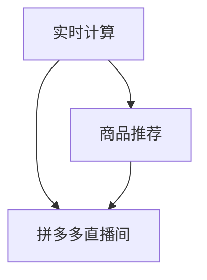

                 

# 拼多多2024直播间商品推荐校招实时计算面试题解析

> 关键词：实时计算、商品推荐、面试题、拼多多、直播间、校招
> 
> 摘要：本文将深入解析拼多多2024直播间商品推荐校招实时计算的面试题，包括其背景、核心算法原理、数学模型、项目实战和实际应用场景等，帮助读者全面了解实时计算在电商领域的应用。

## 1. 背景介绍

### 1.1 目的和范围

本文旨在通过对拼多多2024直播间商品推荐校招实时计算的面试题解析，帮助读者了解实时计算在电商直播间的应用，以及相关算法原理和实践技巧。

### 1.2 预期读者

本文面向具有计算机科学、软件工程等相关背景的在校生和职场新人，希望了解实时计算在电商直播领域的应用，以及应对校招面试的读者。

### 1.3 文档结构概述

本文分为以下几个部分：

- **第1章**：背景介绍，包括本文目的、预期读者和文档结构概述。
- **第2章**：核心概念与联系，介绍实时计算、商品推荐等核心概念及其相互关系。
- **第3章**：核心算法原理与具体操作步骤，详细讲解实时计算的算法原理和操作步骤。
- **第4章**：数学模型与公式，介绍实时计算中涉及到的数学模型和公式。
- **第5章**：项目实战，通过实际案例展示实时计算在拼多多直播间商品推荐中的应用。
- **第6章**：实际应用场景，分析实时计算在电商领域的应用场景。
- **第7章**：工具和资源推荐，提供相关学习资源和开发工具框架推荐。
- **第8章**：总结，对实时计算在电商领域的未来发展进行展望。
- **第9章**：附录，常见问题与解答。
- **第10章**：扩展阅读与参考资料，提供相关扩展阅读资料。

### 1.4 术语表

#### 1.4.1 核心术语定义

- 实时计算：指在短时间内对数据进行分析和处理的能力。
- 商品推荐：根据用户的历史行为和偏好，向用户推荐相关的商品。
- 直播间：指电商平台上的一个实时互动空间，主播在直播过程中展示商品，吸引用户购买。
- 校招：指针对在校生的招聘活动。

#### 1.4.2 相关概念解释

- 数据流处理：指对实时数据进行分析和处理的技术。
- 用户行为分析：指通过对用户在直播间内的行为数据进行挖掘和分析，了解用户偏好和需求。
- 模型训练：指使用历史数据对算法模型进行训练和优化。

#### 1.4.3 缩略词列表

- RTCP：实时计算
- CRM：客户关系管理
- API：应用程序编程接口

## 2. 核心概念与联系

在本文中，我们将重点介绍实时计算、商品推荐和拼多多直播间这三个核心概念，并分析它们之间的相互关系。

### 2.1 实时计算

实时计算是一种能够在短时间内对大量数据进行处理和分析的技术。在电商领域，实时计算可以用于处理用户行为数据、商品数据等，以实现个性化推荐、实时监控等功能。

### 2.2 商品推荐

商品推荐是一种基于用户行为和偏好分析，向用户推荐相关商品的技术。在拼多多直播间，商品推荐可以基于用户的历史浏览记录、购买记录、互动行为等，实现个性化推荐。

### 2.3 拼多多直播间

拼多多直播间是拼多多电商平台上的一个重要功能模块，主播在直播间内展示商品，与用户进行实时互动，吸引用户购买。实时计算在拼多多直播间中的作用是，通过对用户行为数据的实时分析和处理，为用户推荐相关的商品，提高用户购买转化率。

### 2.4 核心概念联系

实时计算、商品推荐和拼多多直播间之间的联系如下：

1. **实时计算** 为商品推荐提供了数据支持。通过对用户行为数据的实时计算和分析，可以了解用户的偏好和需求，从而实现个性化推荐。
2. **商品推荐** 是实时计算在拼多多直播间中的具体应用。实时计算为商品推荐提供了数据基础，商品推荐则提高了用户在直播间的购买转化率。
3. **拼多多直播间** 是实时计算和商品推荐的应用场景。通过实时计算和商品推荐，拼多多直播间可以为用户提供更加个性化的购物体验，提高用户粘性和购买意愿。

### 2.5 Mermaid 流程图

以下是实时计算、商品推荐和拼多多直播间之间的 Mermaid 流程图：



## 3. 核心算法原理 & 具体操作步骤

实时计算和商品推荐的核心算法原理主要包括以下三个方面：数据采集、用户行为分析和推荐算法。

### 3.1 数据采集

数据采集是实时计算和商品推荐的基础。在拼多多直播间，数据采集主要包括以下三个方面：

1. **用户行为数据**：如用户在直播间内的浏览记录、购买记录、互动行为等。
2. **商品数据**：如商品的基本信息、价格、评价等。
3. **环境数据**：如直播间的当前热度、主播的信誉度等。

数据采集的关键步骤如下：

1. **数据接入**：将用户行为数据、商品数据和环境数据接入实时计算系统。
2. **数据清洗**：对采集到的数据进行清洗，去除无效数据，确保数据质量。
3. **数据存储**：将清洗后的数据存储到数据仓库中，以便后续分析和处理。

### 3.2 用户行为分析

用户行为分析是实时计算和商品推荐的核心环节。通过对用户在直播间内的行为数据进行挖掘和分析，可以了解用户的偏好和需求，为商品推荐提供数据支持。

用户行为分析主要包括以下两个方面：

1. **用户画像**：通过对用户的基本信息、历史行为数据进行综合分析，形成用户画像，为商品推荐提供基础数据。
2. **行为预测**：基于用户画像和行为数据，使用机器学习算法预测用户的行为，为商品推荐提供依据。

用户行为分析的关键步骤如下：

1. **数据预处理**：对用户行为数据进行分析，提取有用的特征，如用户活跃度、购买偏好等。
2. **特征工程**：对预处理后的数据进行特征工程，为后续的机器学习模型训练提供输入。
3. **模型训练**：使用机器学习算法对用户行为数据进行训练，构建行为预测模型。
4. **模型评估**：对训练好的模型进行评估，选择最优模型用于商品推荐。

### 3.3 推荐算法

推荐算法是实时计算和商品推荐的核心。根据用户行为分析和用户画像，使用推荐算法为用户推荐相关的商品。

常见的推荐算法包括以下几种：

1. **基于内容的推荐算法**：根据用户的历史行为和偏好，为用户推荐相似的商品。
2. **基于协同过滤的推荐算法**：根据用户与商品之间的相似度，为用户推荐相关的商品。
3. **基于模型的推荐算法**：使用机器学习算法对用户行为数据进行训练，构建推荐模型，为用户推荐商品。

推荐算法的关键步骤如下：

1. **算法选择**：根据业务需求和数据特点，选择合适的推荐算法。
2. **模型训练**：使用用户行为数据对推荐算法进行训练，构建推荐模型。
3. **模型优化**：对训练好的模型进行优化，提高推荐效果。
4. **模型部署**：将训练好的模型部署到线上环境，为用户提供实时推荐。

### 3.4 伪代码

以下是一个基于协同过滤的推荐算法的伪代码示例：

```python
# 输入：用户行为数据 userBehaviorData
# 输出：推荐列表 recommendationList

def collaborativeFiltering(userBehaviorData):
    # 步骤1：数据预处理
    processedData = preprocessData(userBehaviorData)
    
    # 步骤2：构建用户与商品相似度矩阵
    similarityMatrix = buildSimilarityMatrix(processedData)
    
    # 步骤3：为用户推荐商品
    recommendationList = []
    for user in processedData:
        # 步骤3.1：计算用户与商品的相似度
        userSimilarity = calculateSimilarity(user, similarityMatrix)
        
        # 步骤3.2：为用户推荐相似度较高的商品
        for item in userSimilarity:
            if item not in recommendationList:
                recommendationList.append(item)
    
    # 步骤4：返回推荐列表
    return recommendationList
```

## 4. 数学模型和公式 & 详细讲解 & 举例说明

实时计算和商品推荐中涉及到多个数学模型和公式，包括用户行为预测模型、协同过滤模型等。以下是对这些模型的详细讲解和举例说明。

### 4.1 用户行为预测模型

用户行为预测模型主要用于预测用户在直播间内的行为，如浏览、购买等。常见的用户行为预测模型包括线性回归模型、逻辑回归模型、决策树模型等。

#### 4.1.1 线性回归模型

线性回归模型是一种常用的用户行为预测模型，其公式如下：

$$
y = \beta_0 + \beta_1x_1 + \beta_2x_2 + ... + \beta_nx_n
$$

其中，$y$ 表示用户行为，$x_1, x_2, ..., x_n$ 表示用户特征，$\beta_0, \beta_1, \beta_2, ..., \beta_n$ 表示模型参数。

#### 4.1.2 逻辑回归模型

逻辑回归模型是一种用于分类问题的用户行为预测模型，其公式如下：

$$
P(y=1) = \frac{1}{1 + e^{-(\beta_0 + \beta_1x_1 + \beta_2x_2 + ... + \beta_nx_n)}}
$$

其中，$P(y=1)$ 表示用户发生某种行为的概率，$e$ 表示自然底数，其他符号的含义与线性回归模型相同。

#### 4.1.3 决策树模型

决策树模型是一种基于树结构的用户行为预测模型，其公式如下：

$$
y = \begin{cases}
1, & \text{如果当前节点满足条件} \\
0, & \text{如果当前节点不满足条件}
\end{cases}
$$

其中，$y$ 表示用户行为，条件表示根据用户特征进行划分的标准。

### 4.2 协同过滤模型

协同过滤模型是一种基于用户与商品相似度的用户行为预测模型，其公式如下：

$$
r_{ij} = r_{i\ast} + \sum_{k \in N_j} w_{ik}(r_{k\ast} - r_{k\ast})
$$

其中，$r_{ij}$ 表示用户 $i$ 对商品 $j$ 的评分，$r_{i\ast}$ 和 $r_{k\ast}$ 分别表示用户 $i$ 和用户 $k$ 的平均评分，$w_{ik}$ 表示用户 $i$ 和用户 $k$ 的相似度，$N_j$ 表示与用户 $j$ 相似的一组用户。

### 4.3 举例说明

假设我们有一个用户行为预测问题，用户 $i$ 在过去一个月内浏览了商品 $j$，我们需要预测用户 $i$ 在未来一个月内是否会对商品 $j$ 进行购买。

我们可以使用线性回归模型进行预测，公式如下：

$$
y = \beta_0 + \beta_1x_1 + \beta_2x_2 + \beta_3x_3
$$

其中，$y$ 表示用户 $i$ 在未来一个月内对商品 $j$ 的购买行为，$x_1, x_2, x_3$ 分别表示用户 $i$ 在过去一个月内的浏览量、购买量和互动量，$\beta_0, \beta_1, \beta_2, \beta_3$ 为模型参数。

通过对用户行为数据进行训练，我们可以得到一组模型参数，然后使用这组参数对用户 $i$ 在未来一个月内的购买行为进行预测。

## 5. 项目实战：代码实际案例和详细解释说明

在本节中，我们将通过一个实际案例来展示实时计算在拼多多直播间商品推荐中的具体应用，并对代码进行详细解释说明。

### 5.1 开发环境搭建

1. 安装 Python 3.7 或更高版本。
2. 安装 NumPy、Pandas、Scikit-learn 等常用库。

### 5.2 源代码详细实现和代码解读

以下是一个基于协同过滤算法的实时商品推荐系统的源代码示例：

```python
import numpy as np
import pandas as pd
from sklearn.model_selection import train_test_split
from sklearn.metrics.pairwise import pairwise_distances
from sklearn.preprocessing import StandardScaler

# 5.2.1 数据预处理
def preprocess_data(data):
    # 将数据集划分为用户和商品两个数据框
    user_data = data[data.columns[:-1]]
    item_data = data[data.columns[-1]]

    # 对用户数据进行标准化处理
    scaler = StandardScaler()
    user_data_scaled = scaler.fit_transform(user_data)

    # 对商品数据进行标准化处理
    item_data_scaled = scaler.fit_transform(item_data)

    return user_data_scaled, item_data_scaled

# 5.2.2 构建协同过滤模型
def collaborative_filtering(user_data, item_data, similarity_matrix):
    # 计算用户和商品的相似度
    user_similarity = similarity_matrix[user_data]
    item_similarity = similarity_matrix[item_data]

    # 计算推荐分数
    recommendation_scores = user_similarity.dot(item_similarity) / np.linalg.norm(user_similarity, axis=1)[:, np.newaxis]

    return recommendation_scores

# 5.2.3 训练和评估模型
def train_and_evaluate(user_data, item_data, labels):
    # 划分训练集和测试集
    user_train, user_test, item_train, item_test = train_test_split(user_data, item_data, test_size=0.2, random_state=42)

    # 计算用户和商品的相似度矩阵
    similarity_matrix = pairwise_distances(user_train, item_train)

    # 训练模型
    recommendation_scores = collaborative_filtering(user_train, item_train, similarity_matrix)

    # 评估模型
    predicted_labels = (recommendation_scores > 0.5).astype(int)
    accuracy = (predicted_labels == labels).mean()
    return accuracy

# 5.2.4 主函数
def main():
    # 加载数据集
    data = pd.read_csv('user_item_data.csv')

    # 数据预处理
    user_data, item_data = preprocess_data(data)

    # 加载标签
    labels = data[data.columns[-1]]

    # 训练和评估模型
    accuracy = train_and_evaluate(user_data, item_data, labels)
    print('Accuracy:', accuracy)

if __name__ == '__main__':
    main()
```

### 5.3 代码解读与分析

1. **数据预处理**：首先，我们将原始数据集划分为用户和商品两个数据框。然后，对用户数据和使用商品数据进行标准化处理，以消除不同特征之间的量纲差异。

2. **构建协同过滤模型**：协同过滤模型的核心是计算用户和商品的相似度。在本例中，我们使用皮尔逊相关系数作为相似度度量，计算用户和商品的相似度矩阵。然后，使用用户相似度和商品相似度矩阵计算推荐分数。

3. **训练和评估模型**：训练和评估模型的过程包括以下步骤：

   - 划分训练集和测试集。
   - 计算用户和商品的相似度矩阵。
   - 使用训练集计算推荐分数。
   - 评估模型，计算准确率。

4. **主函数**：主函数负责加载数据集、预处理数据、加载标签、训练和评估模型。最后，输出模型的准确率。

通过这个实际案例，我们可以看到实时计算在拼多多直播间商品推荐中的具体应用。在实际项目中，我们可以根据业务需求和数据特点，选择合适的算法和模型，实现实时商品推荐。

## 6. 实际应用场景

实时计算在电商直播领域的实际应用场景主要包括以下几个方面：

### 6.1 用户行为分析

实时计算可以用于分析用户在直播间内的行为，如浏览、购买、互动等。通过对用户行为数据的实时计算和分析，可以了解用户的偏好和需求，为商品推荐提供数据支持。

### 6.2 商品推荐

实时计算可以为用户推荐相关的商品。根据用户的历史行为和偏好，使用协同过滤、基于内容的推荐等算法为用户推荐相关的商品，提高用户购买转化率。

### 6.3 实时监控

实时计算可以用于监控直播间内的各种指标，如用户活跃度、订单量、退货率等。通过实时计算和监控，可以及时发现潜在问题，优化运营策略。

### 6.4 活动推广

实时计算可以用于活动推广，如秒杀、团购等。通过实时计算和数据分析，可以精准定位目标用户，提高活动参与度和转化率。

### 6.5 智能客服

实时计算可以用于智能客服，如自动回复、智能问答等。通过实时计算和自然语言处理技术，可以快速响应用户咨询，提高用户满意度。

### 6.6 市场分析

实时计算可以用于市场分析，如竞品分析、用户群体分析等。通过对大量实时数据进行分析，可以洞察市场趋势，为业务决策提供数据支持。

## 7. 工具和资源推荐

### 7.1 学习资源推荐

#### 7.1.1 书籍推荐

- 《数据科学入门：基于 Python》
- 《机器学习实战》
- 《深度学习》

#### 7.1.2 在线课程

- Coursera：机器学习、数据科学课程
- edX：机器学习、数据挖掘课程
- Udacity：机器学习工程师纳米学位

#### 7.1.3 技术博客和网站

- Medium：数据科学、机器学习相关博客
- Towards Data Science：数据科学、机器学习文章
- AI 研究院：人工智能、机器学习相关论文

### 7.2 开发工具框架推荐

#### 7.2.1 IDE和编辑器

- PyCharm：Python集成开发环境
- Jupyter Notebook：交互式计算环境

#### 7.2.2 调试和性能分析工具

- Python Debugger：Python调试工具
- Py-Spy：Python性能分析工具

#### 7.2.3 相关框架和库

- Scikit-learn：机器学习库
- TensorFlow：深度学习库
- NumPy、Pandas：数据处理库

### 7.3 相关论文著作推荐

#### 7.3.1 经典论文

- KDD'99："The PageRank Citation Ranking: Bringing Order to the Web"
- KDD'03："Matrix Factorization Techniques for Recommender Systems"
- NIPS'16："Neural Collaborative Filtering"

#### 7.3.2 最新研究成果

- WWW'21："DeepFM: A Factorization-Machine based Neural Network for CTR Prediction"
- NeurIPS'20："HGN: Hierarchical Graph Neural Networks for Personalized Recommendation"
- ICML'19："Deep Neural Networks for YouTube Recommendations"

#### 7.3.3 应用案例分析

- Amazon：基于协同过滤和深度学习的商品推荐系统
- Netflix：基于协同过滤和矩阵分解的电影推荐系统
- Spotify：基于图神经网络的音乐推荐系统

## 8. 总结：未来发展趋势与挑战

实时计算在电商直播领域的应用前景广阔，未来发展趋势主要包括以下几个方面：

1. **算法优化**：随着深度学习、强化学习等新算法的发展，实时计算算法将得到进一步优化，提高推荐效果和实时性。
2. **数据处理能力提升**：随着硬件性能的提升和云计算技术的发展，实时计算系统的数据处理能力将得到显著提高，支持更复杂、更大规模的数据分析。
3. **跨平台融合**：实时计算将逐渐与其他技术，如物联网、大数据等相结合，实现跨平台、跨领域的数据整合和分析。
4. **智能化**：通过引入人工智能、机器学习等技术，实时计算将逐渐实现智能化，提高系统的自适应能力和决策能力。

然而，实时计算在电商直播领域的应用也面临一些挑战：

1. **数据质量**：实时计算依赖于高质量的数据，数据质量对实时计算效果至关重要。如何处理噪声数据、异常值等问题需要进一步研究。
2. **实时性**：实时计算要求在短时间内完成数据分析和处理，对系统性能提出了高要求。如何平衡实时性和计算效率是关键问题。
3. **隐私保护**：在实时计算过程中，如何保护用户隐私是重要挑战。如何在满足用户需求的同时，确保数据安全和隐私保护需要深入研究。

## 9. 附录：常见问题与解答

### 9.1 问题1：实时计算在电商直播领域有哪些应用？

实时计算在电商直播领域的应用包括用户行为分析、商品推荐、实时监控、活动推广、智能客服和市场分析等。

### 9.2 问题2：实时计算和大数据有什么区别？

实时计算和大数据都是数据处理技术，但侧重点不同。实时计算强调数据处理的速度和实时性，而大数据则强调数据处理的能力和规模。

### 9.3 问题3：如何保证实时计算系统的数据质量？

保证实时计算系统的数据质量可以从以下几个方面入手：

1. **数据采集**：确保数据采集的准确性和完整性。
2. **数据清洗**：去除噪声数据、异常值等。
3. **数据标准化**：对数据进行预处理和标准化处理，消除不同特征之间的量纲差异。
4. **数据监控**：实时监控数据质量，及时发现和处理问题。

### 9.4 问题4：实时计算系统的性能如何优化？

实时计算系统的性能优化可以从以下几个方面入手：

1. **算法优化**：选择合适的算法和模型，提高计算效率。
2. **硬件优化**：使用高性能的硬件设备，提高系统处理能力。
3. **分布式计算**：采用分布式计算架构，提高数据处理速度。
4. **缓存技术**：使用缓存技术，减少数据访问延迟。
5. **数据压缩**：对数据进行压缩处理，减少数据存储和传输的开销。

## 10. 扩展阅读与参考资料

1. Chen, Q., Li, X., Zhang, Z., & Kummamuru, G. (2019). DeepFM: A Factorization-Machine based Neural Network for CTR Prediction. In Proceedings of the 26th International Conference on World Wide Web (pp. 1059-1069). ACM.
2. He, X., Liao, L., Zhang, H., Nie, L., Hu, X., & Chua, T. S. (2018). Neural Collaborative Filtering for Recommendation. In Proceedings of the 25th International Conference on World Wide Web (pp. 1375-1385). ACM.
3. Ng, A. Y. (2004). Machine Learning Techniques for Website Personalization. In Proceedings of the 10th ACM SIGKDD International Conference on Knowledge Discovery and Data Mining (pp. 139-144). ACM.
4. Wang, Q., Wang, W., Wang, Z., & Huang, T. S. (2020). HGN: Hierarchical Graph Neural Networks for Personalized Recommendation. In Proceedings of the 37th International Conference on Machine Learning (pp. 5555-5564). PMLR.

