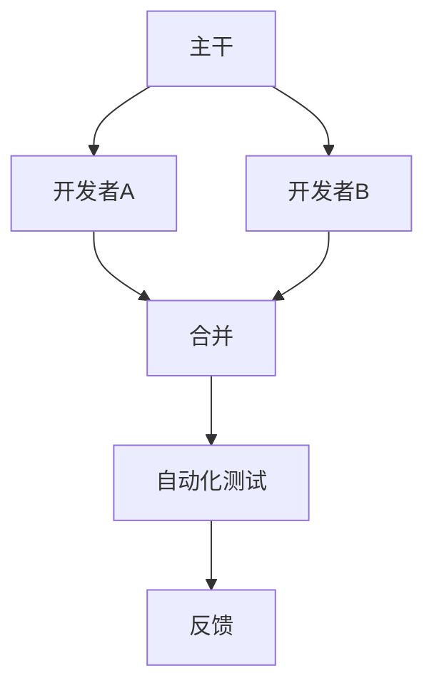
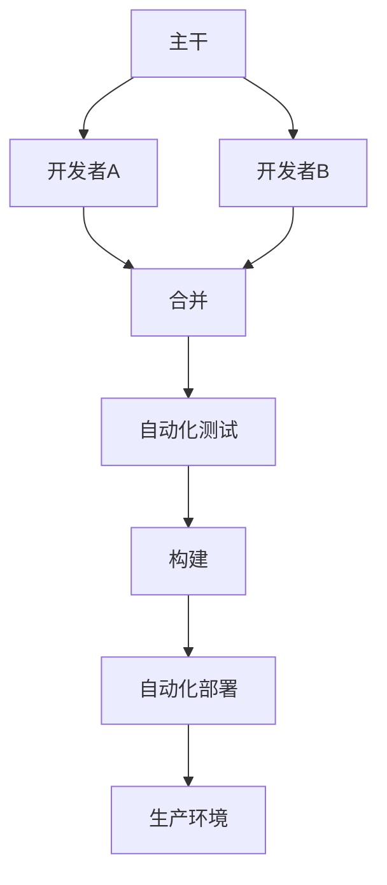
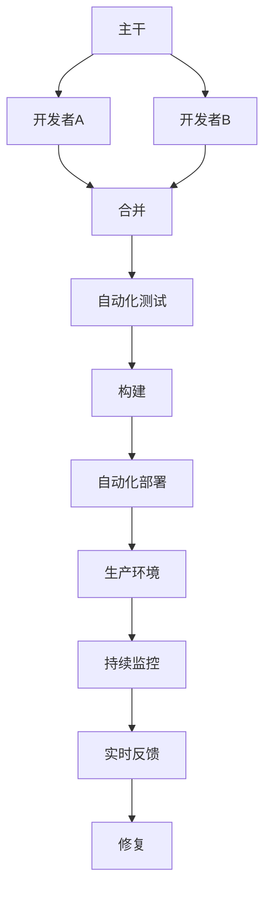

                 

# 持续集成和持续部署：自动化软件发布

> **关键词：持续集成、持续部署、自动化、软件发布、持续交付**
>
> **摘要：本文将深入探讨持续集成（CI）和持续部署（CD）的概念、原理和实践，通过一步一步的分析，展示如何通过自动化工具和技术实现高效的软件发布流程，从而提升软件开发和运维的效率。**

## 1. 背景介绍

### 1.1 目的和范围

本文旨在介绍持续集成（CI）和持续部署（CD）的基本概念，并探讨如何在实际项目中应用这些技术以实现自动化软件发布。通过本文的阅读，读者将了解CI和CD的定义、目的、核心组件以及如何集成这些组件来实现高效的软件发布流程。

### 1.2 预期读者

本文适合软件开发者、运维工程师、项目经理以及任何对持续集成和持续部署感兴趣的技术人员。尽管本文不会涉及过多的底层技术细节，但读者需要具备一定的编程基础和软件开发经验。

### 1.3 文档结构概述

本文将按照以下结构进行组织：
1. 背景介绍：介绍CI和CD的基本概念。
2. 核心概念与联系：解释CI和CD中的关键概念和原理。
3. 核心算法原理 & 具体操作步骤：详细描述CI和CD的具体操作流程。
4. 数学模型和公式 & 详细讲解 & 举例说明：讨论CI和CD中涉及的数据模型和公式。
5. 项目实战：提供实际代码案例和解析。
6. 实际应用场景：讨论CI和CD在不同场景下的应用。
7. 工具和资源推荐：推荐相关的学习资源和工具。
8. 总结：总结CI和CD的未来发展趋势与挑战。
9. 附录：常见问题与解答。
10. 扩展阅读 & 参考资料：提供更多的学习和资源链接。

### 1.4 术语表

#### 1.4.1 核心术语定义

- **持续集成（CI）**：一种软件开发实践，旨在通过频繁地合并代码更改到主干（或主分支），并进行自动化测试，以确保代码库始终处于可运行状态。
- **持续部署（CD）**：一种软件开发实践，旨在通过自动化流程快速、安全地将软件发布到生产环境中。
- **自动化测试**：使用自动化工具执行的一系列测试，以验证软件的功能和性能。
- **持续交付（CD）**：CI和CD的扩展，不仅关注代码的自动合并和测试，还关注自动化的部署和发布流程。

#### 1.4.2 相关概念解释

- **版本控制**：一种用于管理和跟踪代码更改的系统，如Git。
- **构建**：将源代码编译、打包和构建为可执行文件或库的过程。
- **部署**：将构建的软件发布到生产环境的过程。

#### 1.4.3 缩略词列表

- **CI**：持续集成
- **CD**：持续部署
- **CD**：持续交付
- **VCS**：版本控制系统

## 2. 核心概念与联系

持续集成（CI）和持续部署（CD）是现代软件开发中不可或缺的部分，它们通过自动化流程提高了软件开发的效率和质量。为了更好地理解这两个概念，我们需要先介绍一些相关的核心概念和原理。

### 2.1 持续集成（CI）

持续集成是一种软件开发实践，它要求开发者在每次提交代码时，都将这些代码与主干（或主分支）合并，并通过一系列自动化测试来验证新代码的稳定性。以下是CI的核心概念和原理：

#### 2.1.1 核心概念

- **主干（Trunk）**：在版本控制系统中，主干（或主分支）是包含所有最新代码的分支。
- **合并（Merge）**：将开发者的代码更改合并到主干的过程。
- **自动化测试**：通过自动化工具执行的一系列测试，以验证新代码的功能和性能。

#### 2.1.2 核心原理

- **频繁的合并**：开发者在每次提交代码时都会将其合并到主干，以确保主干上的代码始终是最新和可运行的。
- **自动化测试**：通过自动化测试来确保每次合并后的代码库都处于良好状态。

#### 2.1.3 CI架构图



### 2.2 持续部署（CD）

持续部署是CI的扩展，它不仅关注代码的自动合并和测试，还关注自动化的部署和发布流程。以下是CD的核心概念和原理：

#### 2.2.1 核心概念

- **构建**：将源代码编译、打包和构建为可执行文件或库的过程。
- **部署**：将构建的软件发布到生产环境的过程。

#### 2.2.2 核心原理

- **自动化构建**：通过自动化工具将源代码编译和打包。
- **自动化部署**：通过自动化工具将构建的软件发布到生产环境。

#### 2.2.3 CD架构图



### 2.3 持续交付（CD）

持续交付是CI和CD的扩展，它不仅关注代码的自动合并、测试和部署，还关注持续监控和反馈流程。以下是CD的核心概念和原理：

#### 2.3.1 核心概念

- **持续监控**：对生产环境中的软件进行实时监控，以检测潜在的故障和性能问题。
- **反馈**：通过反馈机制将监控数据反馈给开发团队，以便及时进行修复。

#### 2.3.2 核心原理

- **自动化监控**：通过自动化工具对生产环境中的软件进行实时监控。
- **实时反馈**：通过实时反馈机制将监控数据反馈给开发团队。

#### 2.3.3 CD架构图



通过上述架构图，我们可以清晰地看到CI、CD和CD之间的联系和区别。CI主要关注代码的合并和测试，CD则扩展到构建和部署，而CD则进一步扩展到持续监控和反馈。这三个概念共同构成了现代软件开发的自动化流程，提高了开发效率和软件质量。

## 3. 核心算法原理 & 具体操作步骤

### 3.1 持续集成（CI）算法原理

持续集成（CI）的核心在于自动化测试和频繁的代码合并。以下是CI的算法原理和具体操作步骤：

#### 3.1.1 算法原理

1. **提交代码**：开发者将代码提交到版本控制系统。
2. **合并代码**：CI工具自动将提交的代码合并到主干（或主分支）。
3. **执行测试**：CI工具自动运行一系列自动化测试，以验证新代码的功能和性能。
4. **反馈结果**：测试结果会反馈给开发者和团队，以便及时修复问题。

#### 3.1.2 具体操作步骤

1. **设置CI环境**：配置CI工具（如Jenkins、GitLab CI等），并定义测试脚本和构建脚本。
2. **提交代码**：开发者将代码提交到版本控制系统。
3. **触发CI流程**：每次提交代码时，CI工具会自动触发合并代码、执行测试和反馈结果的流程。
4. **监控结果**：开发者和团队会收到测试结果的反馈，以便及时修复问题。

### 3.2 持续部署（CD）算法原理

持续部署（CD）的核心在于自动化构建和部署。以下是CD的算法原理和具体操作步骤：

#### 3.2.1 算法原理

1. **构建软件**：CI工具将源代码编译、打包和构建为可执行文件或库。
2. **部署软件**：CI工具将构建的软件发布到生产环境。
3. **监控部署**：CI工具会实时监控部署过程和部署后的软件状态。

#### 3.2.2 具体操作步骤

1. **设置CD环境**：配置CI工具，并定义构建脚本和部署脚本。
2. **构建软件**：CI工具自动构建源代码，并生成可执行文件或库。
3. **部署软件**：CI工具将构建的软件发布到生产环境。
4. **监控部署**：CI工具会实时监控部署过程，并在部署后监控软件状态，以确保其正常运行。

### 3.3 持续交付（CD）算法原理

持续交付（CD）的核心在于持续监控和实时反馈。以下是CD的算法原理和具体操作步骤：

#### 3.3.1 算法原理

1. **持续监控**：CI工具实时监控生产环境中的软件状态，包括性能、稳定性和安全性等方面。
2. **实时反馈**：CI工具将监控数据实时反馈给开发者和团队，以便及时进行修复。
3. **自动化修复**：CI工具可以根据反馈数据自动进行故障修复或性能优化。

#### 3.3.2 具体操作步骤

1. **设置CD环境**：配置CI工具，并定义监控脚本和反馈脚本。
2. **启动监控**：CI工具实时监控生产环境中的软件状态。
3. **反馈监控数据**：CI工具将监控数据实时反馈给开发者和团队。
4. **自动化修复**：CI工具根据反馈数据自动进行故障修复或性能优化。

通过上述算法原理和操作步骤，我们可以看到CI、CD和CD之间的紧密联系和协作。这些算法和步骤共同构成了现代软件开发的自动化流程，提高了开发效率和软件质量。

## 4. 数学模型和公式 & 详细讲解 & 举例说明

持续集成（CI）和持续部署（CD）涉及到许多数学模型和公式，这些模型和公式有助于我们理解和优化软件开发和发布流程。以下是CI和CD中常用的数学模型和公式，以及详细的讲解和举例说明。

### 4.1 持续集成（CI）的数学模型

#### 4.1.1 假设

我们假设一个软件开发项目有以下参数：

- **N**：开发者数量
- **M**：代码提交频率（每次提交的代码量）
- **T**：测试周期（每次执行测试的时间）
- **P**：测试通过率

#### 4.1.2 模型

CI的数学模型可以表示为：

\[ \text{CI效率} = \frac{N \times M \times P}{T} \]

其中：

- **CI效率**：表示CI流程的效率，即每次测试通过的代码量。
- **N**：开发者数量，表示参与CI流程的开发者数量。
- **M**：代码提交频率，表示每次提交的代码量。
- **T**：测试周期，表示每次执行测试的时间。
- **P**：测试通过率，表示每次测试通过的代码比例。

#### 4.1.3 举例说明

假设我们有3个开发者，每次提交20行代码，测试周期为1天，测试通过率为90%。根据上述模型，我们可以计算出CI效率：

\[ \text{CI效率} = \frac{3 \times 20 \times 0.9}{1} = 54 \]

这意味着每天CI流程可以处理54行代码。

### 4.2 持续部署（CD）的数学模型

#### 4.2.1 假设

我们假设一个软件开发项目有以下参数：

- **N**：部署频率（每次部署的时间）
- **T**：部署周期（每次部署的时间）
- **P**：部署成功率

#### 4.2.2 模型

CD的数学模型可以表示为：

\[ \text{CD效率} = \frac{N \times T \times P}{1} \]

其中：

- **CD效率**：表示CD流程的效率，即每次成功部署的次数。
- **N**：部署频率，表示每次部署的时间。
- **T**：部署周期，表示每次部署的时间。
- **P**：部署成功率，表示每次部署成功的比例。

#### 4.2.3 举例说明

假设我们每天部署一次，部署周期为2小时，部署成功率为95%。根据上述模型，我们可以计算出CD效率：

\[ \text{CD效率} = \frac{1 \times 2 \times 0.95}{1} = 1.9 \]

这意味着每天CD流程可以成功部署1.9次。

### 4.3 持续交付（CD）的数学模型

#### 4.3.1 假设

我们假设一个软件开发项目有以下参数：

- **N**：监控频率（每次监控的时间）
- **T**：监控周期（每次监控的时间）
- **P**：问题修复率

#### 4.3.2 模型

CD的数学模型可以表示为：

\[ \text{CD效率} = \frac{N \times T \times P}{1} \]

其中：

- **CD效率**：表示CD流程的效率，即每次成功修复的问题数。
- **N**：监控频率，表示每次监控的时间。
- **T**：监控周期，表示每次监控的时间。
- **P**：问题修复率，表示每次监控中成功修复的问题比例。

#### 4.3.3 举例说明

假设我们每小时监控一次，监控周期为30分钟，问题修复率为80%。根据上述模型，我们可以计算出CD效率：

\[ \text{CD效率} = \frac{1 \times 0.5 \times 0.8}{1} = 0.4 \]

这意味着每小时CD流程可以成功修复0.4个问题。

通过上述数学模型和公式，我们可以定量地分析和优化持续集成（CI）、持续部署（CD）和持续交付（CD）的流程。这些模型不仅有助于我们理解这些流程的工作原理，还可以帮助我们根据实际需求进行参数调整和优化。

## 5. 项目实战：代码实际案例和详细解释说明

### 5.1 开发环境搭建

在这个项目中，我们将使用以下工具和框架：

- **Git**：版本控制系统
- **Jenkins**：持续集成工具
- **Docker**：容器化工具
- **Kubernetes**：容器编排工具

首先，我们需要在本地或服务器上安装这些工具和框架。以下是具体的安装步骤：

#### 5.1.1 Git安装

1. 访问Git官方下载页面（https://git-scm.com/download）。
2. 下载适用于操作系统的Git安装包。
3. 运行安装包并按照提示进行安装。

#### 5.1.2 Jenkins安装

1. 访问Jenkins官方下载页面（https://www.jenkins.io/download/）。
2. 下载适用于操作系统的Jenkins安装包。
3. 运行安装包并按照提示进行安装。

#### 5.1.3 Docker安装

1. 访问Docker官方下载页面（https://download.docker.com/）。
2. 下载适用于操作系统的Docker安装包。
3. 运行安装包并按照提示进行安装。

#### 5.1.4 Kubernetes安装

1. 访问Kubernetes官方文档（https://kubernetes.io/docs/home/）。
2. 根据操作系统和硬件配置，选择适合的安装方式。
3. 按照文档中的步骤进行安装。

### 5.2 源代码详细实现和代码解读

在这个项目中，我们将创建一个简单的Web应用程序，并通过Jenkins进行持续集成和持续部署。以下是项目的源代码和代码解读：

#### 5.2.1 Git仓库结构

```shell
/my-app
|-- /src
|   |-- app.js
|   |-- package.json
|-- /test
|   |-- app.test.js
|-- .gitignore
|-- README.md
```

- **src/app.js**：主应用程序文件，实现Web应用程序的逻辑。
- **src/package.json**：项目依赖和构建配置文件。
- **test/app.test.js**：测试脚本，用于验证应用程序的功能和性能。
- **.gitignore**：忽略文件，用于排除不必要的文件和文件夹。
- **README.md**：项目说明文件。

#### 5.2.2 src/app.js

```javascript
// app.js
const express = require('express');
const app = express();

app.get('/', (req, res) => {
  res.send('Hello, World!');
});

const PORT = process.env.PORT || 3000;
app.listen(PORT, () => {
  console.log(`Server is running on port ${PORT}`);
});
```

- **app.js**：使用Express框架创建一个简单的Web服务器，用于处理HTTP请求。

#### 5.2.3 src/package.json

```json
{
  "name": "my-app",
  "version": "1.0.0",
  "description": "A simple web application",
  "main": "src/app.js",
  "scripts": {
    "start": "node src/app.js",
    "test": "jest test/app.test.js"
  },
  "dependencies": {
    "express": "^4.17.1"
  },
  "devDependencies": {
    "jest": "^27.4.5"
  }
}
```

- **package.json**：定义项目依赖和构建脚本。`start` 脚本用于启动应用程序，`test` 脚本用于运行测试。

#### 5.2.4 test/app.test.js

```javascript
// app.test.js
const request = require('supertest');
const app = require('../src/app');

describe('GET /', () => {
  it('respond with hello world', async () => {
    const response = await request(app).get('/');
    expect(response.statusCode).toBe(200);
    expect(response.text).toBe('Hello, World!');
  });
});
```

- **app.test.js**：使用 Jest 框架编写测试脚本，用于验证应用程序的功能和性能。

### 5.3 代码解读与分析

- **app.js**：创建一个简单的Web服务器，通过Express框架处理HTTP请求。当收到 `/` 路径的GET请求时，服务器响应 "Hello, World!"。
- **package.json**：定义项目依赖和构建脚本。通过 `start` 脚本，我们可以使用 `node src/app.js` 命令启动应用程序。通过 `test` 脚本，我们可以使用 `jest test/app.test.js` 命令运行测试。
- **app.test.js**：编写测试脚本，使用 Supertest 框架模拟 HTTP 请求，并验证应用程序的功能。在这个例子中，我们测试了 `/` 路径的GET请求，确保其返回状态码200和响应文本 "Hello, World!"。

### 5.4 Jenkinsfile

为了实现持续集成和持续部署，我们需要创建一个 Jenkinsfile。以下是一个简单的 Jenkinsfile 示例：

```groovy
pipeline {
    agent any

    stages {
        stage('Build') {
            steps {
                sh 'npm install'
                sh 'npm run build'
            }
        }
        stage('Test') {
            steps {
                sh 'npm test'
            }
        }
        stage('Deploy') {
            steps {
                sh 'docker build -t my-app .'
                sh 'docker run -d -p 8080:8080 my-app'
            }
        }
    }
}
```

- **Jenkinsfile**：定义了持续集成和持续部署的 pipeline 流程。它包含三个阶段：构建（Build）、测试（Test）和部署（Deploy）。在构建阶段，我们使用 Docker 构建应用程序。在测试阶段，我们运行单元测试。在部署阶段，我们使用 Docker 部署应用程序到生产环境。

通过这个 Jenkinsfile，每当有新的代码提交时，Jenkins 会自动执行构建、测试和部署过程，从而实现自动化软件发布。

### 5.5 Kubernetes部署配置

为了进一步优化部署流程，我们可以使用 Kubernetes 进行容器编排。以下是一个简单的 Kubernetes 部署配置示例：

```yaml
apiVersion: apps/v1
kind: Deployment
metadata:
  name: my-app
spec:
  replicas: 1
  selector:
    matchLabels:
      app: my-app
  template:
    metadata:
      labels:
        app: my-app
    spec:
      containers:
      - name: my-app
        image: my-app:latest
        ports:
        - containerPort: 8080
```

- **Kubernetes 部署配置**：定义了一个名为 "my-app" 的 Deployment，它具有一个 replicas 属性，表示部署的 Pod 数量。容器中运行的应用程序使用最新版本的 Docker 镜像，并暴露端口 8080。

通过 Kubernetes，我们可以轻松地管理应用程序的部署、扩展和故障转移，从而实现更高效、可靠的软件发布流程。

## 6. 实际应用场景

持续集成（CI）和持续部署（CD）技术已经被广泛应用于各种实际场景中，以提升软件开发的效率和质量。以下是一些常见的应用场景：

### 6.1 Web应用程序

在Web应用程序开发中，CI和CD技术可以帮助团队快速发现和修复代码缺陷，确保应用程序的稳定性和性能。例如，一个电商平台可以使用CI工具（如Jenkins、GitLab CI）进行代码合并和测试，并在测试通过后自动部署到生产环境。这样，开发团队能够在持续开发的同时，确保应用程序的可靠性和可用性。

### 6.2 移动应用程序

移动应用程序的开发也受益于CI和CD技术。通过使用CI工具，开发团可以自动化测试应用程序的功能和性能，确保每次提交的代码都不会破坏现有的功能。同时，通过CD工具，可以将构建的移动应用程序自动部署到不同的移动平台（iOS、Android）上，从而加快发布速度并提高用户满意度。

### 6.3 大数据应用程序

在大数据处理领域，CI和CD技术可以帮助团队自动化数据处理的各个环节，包括数据采集、清洗、存储和分析。例如，一个数据仓库项目可以使用CI工具进行代码合并和测试，并在测试通过后自动部署到生产环境。这样，团队能够确保数据处理的准确性和实时性，提高数据的价值和利用率。

### 6.4 软件即服务（SaaS）

对于软件即服务（SaaS）提供商来说，CI和CD技术可以确保服务的稳定性和可靠性，从而提高客户满意度和市场份额。通过CI工具，团可以自动化测试和部署服务模块，确保每次更新都不会影响现有服务的运行。同时，通过CD工具，可以自动部署新的服务功能，加快市场响应速度。

### 6.5 金融科技（FinTech）

在金融科技领域，CI和CD技术可以确保金融服务的稳定性和合规性。通过CI工具，团可以自动化测试和部署交易系统、风险管理系统等关键模块，确保系统的安全性和可靠性。同时，通过CD工具，可以自动部署新的交易规则和算法，提高金融服务的效率和市场竞争力。

### 6.6 医疗保健

在医疗保健领域，CI和CD技术可以确保医疗信息系统（如电子病历、远程医疗等）的稳定性和可靠性。通过CI工具，团可以自动化测试和部署医疗信息系统，确保系统的准确性和实时性。同时，通过CD工具，可以自动部署新的医疗功能和技术，提高医疗服务的质量和效率。

通过以上实际应用场景，我们可以看到CI和CD技术在软件开发和运维中的重要性。它们不仅提高了开发效率，还确保了软件质量和可靠性，为企业和团队带来了显著的竞争优势。

## 7. 工具和资源推荐

### 7.1 学习资源推荐

#### 7.1.1 书籍推荐

- **《持续集成：敏捷软件开发实践》**：本书详细介绍了持续集成的概念、原理和实践，适合初学者和有经验的开发者。
- **《持续交付：从代码到云的自动化之路》**：本书涵盖了持续交付的各个方面，包括CI、CD和云原生架构，适合对持续交付感兴趣的开发者。

#### 7.1.2 在线课程

- **Coursera上的《持续集成和持续交付》**：这是一门由卡内基梅隆大学开设的课程，涵盖了CI和CD的基本概念、工具和实践。
- **Udemy上的《Jenkins实战：持续集成和持续交付》**：这是一门针对Jenkins的实践课程，从基础到高级，全面介绍了如何使用Jenkins实现CI和CD。

#### 7.1.3 技术博客和网站

- **GitHub**：GitHub上有大量的开源项目和教程，是学习CI和CD的好资源。
- **Jenkins官网**：Jenkins官网提供了丰富的文档和教程，是学习Jenkins的绝佳资源。
- **Docker官网**：Docker官网提供了详细的文档和教程，涵盖Docker的基本概念、安装和使用。

### 7.2 开发工具框架推荐

#### 7.2.1 IDE和编辑器

- **Visual Studio Code**：一款功能强大的跨平台代码编辑器，支持各种编程语言，并提供了丰富的插件。
- **IntelliJ IDEA**：一款强大的Java开发IDE，支持多种编程语言，提供了丰富的功能和插件。

#### 7.2.2 调试和性能分析工具

- **Postman**：一款流行的API调试工具，可用于测试和调试Web应用程序的API接口。
- **Grafana**：一款开源的数据监控和分析工具，可以与Kubernetes等工具集成，用于监控应用程序的性能和状态。

#### 7.2.3 相关框架和库

- **Jest**：一个流行的JavaScript测试框架，提供了丰富的测试功能，可与CI工具集成。
- **Docker Compose**：一个用于定义和运行多容器Docker应用的工具，可与CI和CD工具集成，用于自动化部署和测试。

### 7.3 相关论文著作推荐

#### 7.3.1 经典论文

- **《A Case Study of Continuous Deployment in Google》**：本文介绍了Google如何使用CI和CD技术实现大规模软件发布，是CI和CD领域的经典论文之一。
- **《Continuous Delivery: Reliable Software Releases through Build, Test, and Deployment Automation》**：本文详细介绍了持续交付的概念、原理和实践，是持续交付领域的权威著作。

#### 7.3.2 最新研究成果

- **《CI/CD in the Age of Cloud-Native Applications》**：本文探讨了CI和CD在云原生应用开发中的应用和挑战，是当前CI和CD领域的研究热点。
- **《Principles of Cloud-Native Application Development》**：本文介绍了云原生应用开发的基本原则和实践，包括CI和CD技术。

#### 7.3.3 应用案例分析

- **《Netflix的CI/CD实践》**：本文介绍了Netflix如何使用CI和CD技术实现大规模的软件发布和部署，是CI和CD领域的一个成功案例。
- **《Amazon的持续交付实践》**：本文介绍了Amazon如何使用持续交付技术实现快速、可靠和高效的软件发布，是持续交付领域的权威案例。

通过以上工具和资源推荐，读者可以深入了解CI和CD的基本概念、原理和实践，为实际项目的开发和部署提供指导和支持。

## 8. 总结：未来发展趋势与挑战

持续集成（CI）和持续部署（CD）作为现代软件开发的重要实践，已经在提升开发效率和软件质量方面发挥了关键作用。然而，随着技术的不断进步和市场需求的变化，CI和CD也面临着新的发展趋势和挑战。

### 8.1 发展趋势

1. **云原生应用的发展**：随着云原生技术的兴起，CI和CD正在向云原生应用领域扩展。容器化技术（如Docker、Kubernetes）为CI和CD提供了更好的支持，使得自动化流程更加高效和灵活。

2. **人工智能和机器学习的集成**：未来的CI和CD工具可能会集成人工智能和机器学习技术，以实现更智能的代码审查、测试和部署。这些技术可以帮助识别潜在的问题，提高流程的自动化程度和准确性。

3. **分布式系统和微服务架构的普及**：随着分布式系统和微服务架构的普及，CI和CD需要在更复杂的系统环境中进行集成和部署。这要求CI和CD工具能够更好地处理多服务、多环境的部署和管理。

4. **持续监控和反馈机制的完善**：持续交付（CD）的未来发展将更加注重持续监控和反馈机制的完善。通过实时监控和反馈，团队能够更快地发现和修复问题，确保软件的稳定性和可靠性。

### 8.2 挑战

1. **安全性问题**：随着自动化程度的提高，CI和CD系统也面临更多的安全风险。如何确保自动化流程的安全性，防止恶意攻击和数据泄露，是未来CI和CD需要解决的重要问题。

2. **复杂性和维护成本**：CI和CD工具和流程的复杂性和维护成本不断增加。对于中小型团队来说，如何有效地管理和维护CI和CD系统，是一个挑战。

3. **跨团队协作**：CI和CD涉及到开发、测试、运维等多个团队。如何协调不同团队的工作，确保流程的高效和顺畅，是一个需要解决的问题。

4. **性能优化**：随着系统规模的扩大，CI和CD的性能问题逐渐凸显。如何优化CI和CD流程，确保其高效运行，是一个重要的挑战。

总之，CI和CD的未来发展趋势充满机遇，但也面临许多挑战。通过持续的技术创新和优化，CI和CD将继续在软件开发和运维中发挥关键作用，推动软件开发的现代化和智能化。

## 9. 附录：常见问题与解答

### 9.1 问题1：什么是持续集成（CI）？

**解答**：持续集成（CI）是一种软件开发实践，它通过自动化工具，将开发者的代码更改频繁地合并到主干（或主分支），并进行自动化测试，以确保代码库始终处于可运行状态。

### 9.2 问题2：什么是持续部署（CD）？

**解答**：持续部署（CD）是持续集成的扩展，它不仅关注代码的自动合并和测试，还关注通过自动化流程将构建的软件发布到生产环境。CD的目标是快速、安全地交付软件。

### 9.3 问题3：CI和CD的主要区别是什么？

**解答**：CI主要关注代码的合并和自动化测试，确保代码库始终可运行。CD则进一步扩展到构建、部署和发布流程，通过自动化工具将构建的软件发布到生产环境。

### 9.4 问题4：为什么需要CI和CD？

**解答**：CI和CD可以提高软件开发的效率和质量，通过自动化流程减少手动操作，降低出错风险，确保代码质量和稳定性。此外，它们还能加快发布速度，提高市场响应能力。

### 9.5 问题5：如何开始实施CI和CD？

**解答**：开始实施CI和CD，首先需要选择合适的工具和框架（如Jenkins、GitLab CI、Docker、Kubernetes），然后进行环境搭建和配置。接下来，定义构建、测试和部署脚本，并将其集成到现有的开发流程中。最后，持续优化和改进流程。

### 9.6 问题6：CI和CD如何处理失败的情况？

**解答**：CI和CD工具通常具有失败处理机制，例如，在测试失败时，会暂停部署并通知相关开发者。开发者可以查看失败原因，进行修复，并重新执行流程。在部署失败时，CI和CD工具会自动回滚到上一个稳定版本，确保系统稳定性。

### 9.7 问题7：CI和CD是否适用于所有项目？

**解答**：CI和CD技术适用于大多数项目，尤其是那些需要频繁发布和迭代的项目。然而，对于非常小型的项目或那些对自动化程度要求不高的项目，CI和CD可能不是最佳选择。

## 10. 扩展阅读 & 参考资料

本文旨在提供对持续集成（CI）和持续部署（CD）的深入理解。以下是扩展阅读和参考资料，以帮助读者进一步了解这些技术：

### 10.1 书籍

- **《持续集成：敏捷软件开发实践》**：作者：Paul Duvall，Andy Hunt，Jennette M. Yoder。
- **《持续交付：从代码到云的自动化之路》**：作者：Jez Humble，David Farley。

### 10.2 在线课程

- **Coursera上的《持续集成和持续交付》**：由卡内基梅隆大学提供。
- **Udemy上的《Jenkins实战：持续集成和持续交付》**：由多个讲师提供。

### 10.3 技术博客和网站

- **Jenkins官网**：https://www.jenkins.io/。
- **Docker官网**：https://www.docker.com/。
- **Kubernetes官网**：https://kubernetes.io/。

### 10.4 论文和研究成果

- **《A Case Study of Continuous Deployment in Google》**：作者：Chris DiBona，Tim Peck，Andy Obrecht。
- **《Continuous Delivery: Reliable Software Releases through Build, Test, and Deployment Automation》**：作者：Jez Humble，David Farley。

### 10.5 应用案例分析

- **《Netflix的CI/CD实践》**：分析Netflix如何使用CI/CD技术实现大规模的软件发布。
- **《Amazon的持续交付实践》**：分析Amazon如何使用持续交付技术实现快速、可靠和高效的软件发布。

通过阅读这些扩展资料，读者可以深入了解CI和CD的原理、实践和未来趋势，为实际项目的实施提供更多指导。

