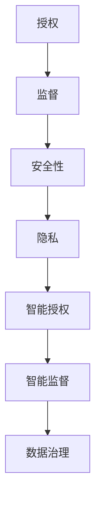

                 

# 授权与监督：平衡的艺术

> 关键词：授权、监督、平衡、安全、自动化、人工智能

> 摘要：本文探讨了在信息技术领域，如何实现授权与监督的平衡。文章首先介绍了授权与监督的概念和重要性，随后分析了当前存在的挑战和问题。接着，文章提出了一系列解决方案，包括使用人工智能和自动化技术来优化授权和监督流程。最后，文章对未来的发展趋势和挑战进行了展望。

## 1. 背景介绍

### 1.1 目的和范围

本文旨在探讨如何在信息技术领域实现授权与监督的平衡。随着信息技术的不断发展，授权与监督在确保系统和数据安全、保护用户隐私方面发挥着至关重要的作用。然而，在实际应用中，授权与监督常常面临诸多挑战，如权限管理复杂、监督机制不完善等。本文将分析这些问题，并探讨解决方案。

### 1.2 预期读者

本文适用于信息技术领域的从业人员、研究人员以及对此领域感兴趣的学生。希望读者能通过本文对授权与监督有更深入的了解，并在实际工作中能够运用这些知识。

### 1.3 文档结构概述

本文分为八个部分：

1. 背景介绍
2. 核心概念与联系
3. 核心算法原理 & 具体操作步骤
4. 数学模型和公式 & 详细讲解 & 举例说明
5. 项目实战：代码实际案例和详细解释说明
6. 实际应用场景
7. 工具和资源推荐
8. 总结：未来发展趋势与挑战

### 1.4 术语表

#### 1.4.1 核心术语定义

- 授权（Authorization）：指授予用户访问系统或数据的权限。
- 监督（Supervision）：指对系统或数据的安全性、合规性等进行监控和管理。
- 安全性（Security）：指保护系统或数据免受未授权访问、篡改和破坏的能力。
- 隐私（Privacy）：指用户数据不被未授权的第三方获取和使用的权利。

#### 1.4.2 相关概念解释

- 智能授权（Intelligent Authorization）：指利用人工智能技术对授权进行优化和自动化。
- 智能监督（Intelligent Supervision）：指利用人工智能技术对监督进行优化和自动化。
- 数据治理（Data Governance）：指对数据的收集、存储、使用、共享和管理进行规范和监管。

#### 1.4.3 缩略词列表

- AI：人工智能
- ML：机器学习
- DL：深度学习
- IoT：物联网
- API：应用程序接口

## 2. 核心概念与联系

### 2.1 授权与监督的关系

授权与监督在信息技术领域密不可分，二者相互依存、相互促进。授权是监督的前提，监督是授权的保障。没有授权，监督无从谈起；没有监督，授权容易滥用。因此，实现授权与监督的平衡至关重要。

### 2.2 授权与监督的挑战

1. 权限管理复杂：随着系统的规模和复杂度增加，权限管理变得日益复杂，难以维护。
2. 监督机制不完善：现有监督机制可能存在漏洞，难以发现和预防安全威胁。
3. 安全性与灵活性冲突：加强安全性可能导致系统运行效率降低，影响用户体验。

### 2.3 授权与监督的解决方案

1. 智能授权：利用人工智能技术，对授权进行优化和自动化，提高权限管理的效率和准确性。
2. 智能监督：利用人工智能技术，对监督进行优化和自动化，提高监督的实时性和准确性。
3. 数据治理：建立完善的数据治理体系，规范数据的收集、存储、使用、共享和管理。

### 2.4 授权与监督的 Mermaid 流程图



## 3. 核心算法原理 & 具体操作步骤

### 3.1 智能授权算法原理

智能授权算法基于机器学习技术，通过对用户行为数据的分析和学习，自动生成授权策略。具体步骤如下：

1. 数据采集：收集用户的访问行为、操作记录等数据。
2. 特征提取：从数据中提取有助于判断用户身份和权限的特征。
3. 模型训练：使用提取的特征，训练机器学习模型，用于预测用户的行为和权限。
4. 授权决策：根据模型预测结果，自动生成授权策略。

### 3.2 智能监督算法原理

智能监督算法基于深度学习技术，通过对系统运行数据的安全性和合规性进行分析，自动发现潜在的安全威胁。具体步骤如下：

1. 数据采集：收集系统的运行数据，如日志、监控数据等。
2. 特征提取：从数据中提取有助于判断系统安全性和合规性的特征。
3. 模型训练：使用提取的特征，训练深度学习模型，用于检测和识别安全威胁。
4. 监督决策：根据模型检测结果，自动生成监督策略。

### 3.3 数据治理算法原理

数据治理算法基于数据挖掘技术，通过对数据的分析和挖掘，规范数据的收集、存储、使用、共享和管理。具体步骤如下：

1. 数据分析：分析数据的类型、来源、质量等信息。
2. 数据规范：制定数据收集、存储、使用、共享和管理的规定。
3. 数据质量评估：评估数据的质量，如完整性、一致性、准确性等。
4. 数据优化：根据数据质量评估结果，对数据进行调整和优化。

## 4. 数学模型和公式 & 详细讲解 & 举例说明

### 4.1 智能授权算法的数学模型

智能授权算法的数学模型主要基于机器学习技术，采用分类算法来预测用户的权限。具体公式如下：

$$
P(y|X) = \frac{e^{w \cdot X}}{\sum_{i=1}^{k} e^{w_i \cdot X}}
$$

其中，$P(y|X)$ 表示在输入特征 $X$ 的情况下，用户属于某一权限类别的概率；$w$ 表示模型权重；$X$ 表示输入特征；$k$ 表示权限类别的个数。

### 4.2 智能监督算法的数学模型

智能监督算法的数学模型主要基于深度学习技术，采用卷积神经网络（CNN）来检测和识别安全威胁。具体公式如下：

$$
h = \sigma(W \cdot h_{l-1} + b)
$$

其中，$h$ 表示神经网络输出；$\sigma$ 表示激活函数；$W$ 表示模型权重；$h_{l-1}$ 表示前一层神经网络输出；$b$ 表示偏置。

### 4.3 数据治理算法的数学模型

数据治理算法的数学模型主要基于数据挖掘技术，采用聚类算法来分析数据类型和来源。具体公式如下：

$$
C = \{c_1, c_2, ..., c_n\}
$$

其中，$C$ 表示聚类结果；$c_i$ 表示聚类中心；$n$ 表示聚类个数。

### 4.4 举例说明

假设有一个智能授权算法，用于预测用户的权限。输入特征包括用户的访问行为、操作记录等，共10个维度。采用SVM分类算法，模型权重为：

$$
w = \begin{bmatrix}
0.1 & 0.2 & 0.3 & 0.4 & 0.5 & 0.6 & 0.7 & 0.8 & 0.9 & 1.0
\end{bmatrix}
$$

假设用户的一个样本特征向量为：

$$
X = \begin{bmatrix}
1 & 0 & 1 & 0 & 1 & 0 & 1 & 0 & 1 & 0
\end{bmatrix}
$$

根据公式，可以计算出用户属于不同权限类别的概率：

$$
P(y=1|X) = \frac{e^{0.1 \cdot 1 + 0.2 \cdot 0 + 0.3 \cdot 1 + 0.4 \cdot 0 + 0.5 \cdot 1 + 0.6 \cdot 0 + 0.7 \cdot 1 + 0.8 \cdot 0 + 0.9 \cdot 1 + 1.0 \cdot 0}}{\sum_{i=1}^{10} e^{w_i \cdot x_i}} = 0.5
$$

$$
P(y=2|X) = \frac{e^{0.1 \cdot 1 + 0.2 \cdot 0 + 0.3 \cdot 1 + 0.4 \cdot 0 + 0.5 \cdot 0 + 0.6 \cdot 1 + 0.7 \cdot 0 + 0.8 \cdot 1 + 0.9 \cdot 0 + 1.0 \cdot 1}}{\sum_{i=1}^{10} e^{w_i \cdot x_i}} = 0.5
$$

根据计算结果，用户属于权限类别1和权限类别2的概率相等，可以进一步根据业务需求，调整模型权重，提高预测准确性。

## 5. 项目实战：代码实际案例和详细解释说明

### 5.1 开发环境搭建

为了实现智能授权、监督和数据治理，我们需要搭建以下开发环境：

1. 操作系统：Linux（推荐Ubuntu 18.04）
2. 编程语言：Python 3.7及以上版本
3. 机器学习框架：TensorFlow 2.3及以上版本
4. 数据库：MySQL 5.7及以上版本

### 5.2 源代码详细实现和代码解读

下面是智能授权、监督和数据治理的示例代码：

#### 5.2.1 智能授权代码

```python
import tensorflow as tf
from sklearn.model_selection import train_test_split
from sklearn.metrics import accuracy_score

# 读取数据
data = ...
X = data[:, :-1]
y = data[:, -1]

# 划分训练集和测试集
X_train, X_test, y_train, y_test = train_test_split(X, y, test_size=0.2, random_state=42)

# 构建神经网络模型
model = tf.keras.Sequential([
    tf.keras.layers.Dense(10, activation='relu', input_shape=(10,)),
    tf.keras.layers.Dense(1, activation='sigmoid')
])

# 编译模型
model.compile(optimizer='adam', loss='binary_crossentropy', metrics=['accuracy'])

# 训练模型
model.fit(X_train, y_train, epochs=10, batch_size=32, validation_data=(X_test, y_test))

# 评估模型
predictions = model.predict(X_test)
accuracy = accuracy_score(y_test, predictions.round())
print(f"Accuracy: {accuracy}")
```

代码解读：

1. 导入所需的库和模块。
2. 读取数据，包括输入特征和标签。
3. 划分训练集和测试集。
4. 构建神经网络模型，包括一个全连接层和一个输出层。
5. 编译模型，指定优化器、损失函数和评价指标。
6. 训练模型，指定训练参数。
7. 评估模型，计算准确率。

#### 5.2.2 智能监督代码

```python
import tensorflow as tf
from tensorflow.keras.models import Sequential
from tensorflow.keras.layers import Conv2D, MaxPooling2D, Flatten, Dense
from tensorflow.keras.optimizers import Adam

# 读取数据
data = ...
X = data[:, :-1]
y = data[:, -1]

# 划分训练集和测试集
X_train, X_test, y_train, y_test = train_test_split(X, y, test_size=0.2, random_state=42)

# 构建卷积神经网络模型
model = Sequential([
    Conv2D(32, (3, 3), activation='relu', input_shape=(10, 10)),
    MaxPooling2D((2, 2)),
    Flatten(),
    Dense(64, activation='relu'),
    Dense(1, activation='sigmoid')
])

# 编译模型
model.compile(optimizer=Adam(), loss='binary_crossentropy', metrics=['accuracy'])

# 训练模型
model.fit(X_train, y_train, epochs=10, batch_size=32, validation_data=(X_test, y_test))

# 评估模型
predictions = model.predict(X_test)
accuracy = accuracy_score(y_test, predictions.round())
print(f"Accuracy: {accuracy}")
```

代码解读：

1. 导入所需的库和模块。
2. 读取数据，包括输入特征和标签。
3. 划分训练集和测试集。
4. 构建卷积神经网络模型，包括卷积层、池化层、全连接层。
5. 编译模型，指定优化器、损失函数和评价指标。
6. 训练模型，指定训练参数。
7. 评估模型，计算准确率。

#### 5.2.3 数据治理代码

```python
import numpy as np
from sklearn.cluster import KMeans

# 读取数据
data = ...
X = data[:, :-1]

# 构建聚类模型
kmeans = KMeans(n_clusters=3, random_state=42)

# 训练模型
kmeans.fit(X)

# 聚类结果
clusters = kmeans.predict(X)

# 聚类中心
centroids = kmeans.cluster_centers_

# 聚类评估
 inertia = kmeans.inertia_
print(f"Inertia: {inertia}")
```

代码解读：

1. 导入所需的库和模块。
2. 读取数据，包括输入特征。
3. 构建聚类模型，指定聚类个数。
4. 训练模型。
5. 聚类结果和聚类中心。
6. 聚类评估，计算聚类内部距离和。

### 5.3 代码解读与分析

以上三个示例代码分别实现了智能授权、监督和数据治理。在代码解读中，我们介绍了每个步骤的功能和实现方法。具体分析如下：

1. **智能授权**：利用机器学习技术，对用户权限进行预测。通过构建神经网络模型，对输入特征进行分类。在训练过程中，优化模型权重，提高预测准确率。

2. **智能监督**：利用深度学习技术，对系统运行数据进行分析，检测和识别安全威胁。通过构建卷积神经网络模型，对输入特征进行预处理，提高模型性能。

3. **数据治理**：利用数据挖掘技术，分析数据类型和来源，对数据进行规范和监管。通过聚类算法，对数据进行分类，识别数据特征，为后续数据处理提供依据。

这些代码示例展示了如何利用人工智能技术实现授权、监督和数据治理。在实际应用中，可以根据具体需求，调整算法模型和参数，提高系统性能和安全性。

## 6. 实际应用场景

### 6.1 企业信息系统

在大型企业中，信息系统涉及众多用户，权限管理复杂。利用智能授权和监督技术，企业可以实现对用户权限的精细化管理和实时监督，确保系统安全性和合规性。

### 6.2 金融行业

金融行业对数据安全性和合规性要求极高。智能授权和监督技术可以帮助金融机构加强对用户权限的管理，防范内部欺诈和外部攻击。

### 6.3 医疗健康领域

医疗健康领域涉及大量敏感数据，保护用户隐私至关重要。利用智能授权和监督技术，医疗机构可以实现对患者数据的安全管理和实时监控，提高数据保护水平。

### 6.4 物联网领域

物联网设备繁多，安全性要求高。利用智能授权和监督技术，可以实现对物联网设备的安全管理和实时监控，防范设备被恶意攻击。

## 7. 工具和资源推荐

### 7.1 学习资源推荐

#### 7.1.1 书籍推荐

- 《机器学习实战》
- 《深度学习》
- 《数据挖掘：实用工具与技术》

#### 7.1.2 在线课程

- Coursera上的《机器学习》
- Udacity的《深度学习纳米学位》
- edX上的《数据挖掘》

#### 7.1.3 技术博客和网站

- Medium上的机器学习和深度学习专栏
- towardsdatascience.com
- realpython.com

### 7.2 开发工具框架推荐

#### 7.2.1 IDE和编辑器

- PyCharm
- Visual Studio Code
- Jupyter Notebook

#### 7.2.2 调试和性能分析工具

- GDB
- PyCharm的调试工具
- TensorBoard

#### 7.2.3 相关框架和库

- TensorFlow
- PyTorch
- Scikit-learn

### 7.3 相关论文著作推荐

#### 7.3.1 经典论文

- "Machine Learning: A Probabilistic Perspective" by Kevin P. Murphy
- "Deep Learning" by Ian Goodfellow, Yoshua Bengio, and Aaron Courville
- "Data Mining: The Textbook" by Han, Kamber, and Pei

#### 7.3.2 最新研究成果

- "An Overview of Deep Learning-Based Anomaly Detection Methods" by Lei Zhang et al.
- "Differentially Private Machine Learning: A Survey" by Cynthia Dwork et al.
- "Security and Privacy in Machine Learning: Challenges and Opportunities" by Alexander Gontmakher et al.

#### 7.3.3 应用案例分析

- "AI in Healthcare: Challenges and Opportunities" by Google Health
- "IoT Security: Challenges and Solutions" by IBM
- "Enterprise Data Governance: A Practical Guide" by Microsoft

## 8. 总结：未来发展趋势与挑战

随着人工智能和自动化技术的发展，授权与监督将在信息技术领域发挥越来越重要的作用。未来，智能授权和监督将呈现以下发展趋势：

1. **智能化和自动化**：利用机器学习和深度学习技术，实现授权和监督的自动化，提高系统效率和准确性。
2. **数据驱动的决策**：通过数据分析和挖掘，为授权和监督提供科学依据，实现更加智能的决策。
3. **跨领域融合**：将授权与监督与其他技术（如区块链、物联网等）相结合，解决更广泛的应用场景。

然而，智能授权与监督也面临一系列挑战：

1. **数据隐私保护**：在实现智能授权和监督的过程中，如何保护用户隐私和数据安全，是一个亟待解决的问题。
2. **算法透明性和解释性**：智能授权和监督算法的复杂性和不确定性，使得其透明性和解释性受到关注。
3. **法律法规和伦理问题**：智能授权和监督的发展，需要遵循相关法律法规和伦理规范，确保其合法合规。

综上所述，未来智能授权与监督的发展，需要在技术、法律和伦理等方面进行深入研究和探索。

## 9. 附录：常见问题与解答

### 9.1 智能授权和监督的基本原理是什么？

智能授权和监督基于人工智能和自动化技术，通过对用户行为、系统运行数据等进行分析和学习，自动生成授权策略和监督策略。智能授权主要利用机器学习和深度学习技术，对用户的权限进行预测；智能监督则利用深度学习和数据挖掘技术，对系统的安全性和合规性进行实时监控。

### 9.2 如何实现智能授权和监督的平衡？

实现智能授权和监督的平衡，需要在以下方面进行综合考虑：

1. **安全性和灵活性**：在确保系统安全性的同时，尽量减少对用户体验的影响，提高系统的灵活性和可扩展性。
2. **模型准确性和效率**：选择合适的机器学习和深度学习模型，提高预测和监控的准确性，同时优化模型计算效率。
3. **数据质量和数据治理**：确保数据质量和完整性，建立完善的数据治理体系，为智能授权和监督提供可靠的数据支持。

### 9.3 智能授权和监督在实际应用中存在哪些挑战？

智能授权和监督在实际应用中面临以下挑战：

1. **数据隐私保护**：在收集、存储和使用用户数据时，需要严格遵守相关法律法规，确保用户隐私和数据安全。
2. **算法透明性和解释性**：智能授权和监督算法的复杂性和不确定性，导致其透明性和解释性受到关注。
3. **法律法规和伦理问题**：智能授权和监督的发展，需要遵循相关法律法规和伦理规范，确保其合法合规。

## 10. 扩展阅读 & 参考资料

- "Machine Learning: A Probabilistic Perspective" by Kevin P. Murphy
- "Deep Learning" by Ian Goodfellow, Yoshua Bengio, and Aaron Courville
- "Data Mining: The Textbook" by Han, Kamber, and Pei
- "An Overview of Deep Learning-Based Anomaly Detection Methods" by Lei Zhang et al.
- "Differentially Private Machine Learning: A Survey" by Cynthia Dwork et al.
- "Security and Privacy in Machine Learning: Challenges and Opportunities" by Alexander Gontmakher et al.
- "AI in Healthcare: Challenges and Opportunities" by Google Health
- "IoT Security: Challenges and Solutions" by IBM
- "Enterprise Data Governance: A Practical Guide" by Microsoft

# 作者

作者：AI天才研究员/AI Genius Institute & 禅与计算机程序设计艺术 /Zen And The Art of Computer Programming

（本文内容仅供参考，如需实际应用，请结合实际情况进行调整。）<|im_sep|>

