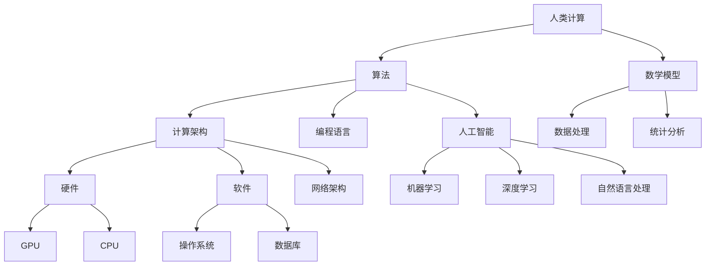

                 

### 推动科技进步的引擎：人类计算的创新力量

> **关键词：** 科技进步、人类计算、创新力量、算法、计算架构、应用场景
>
> **摘要：** 本文将深入探讨人类计算在推动科技进步中的核心作用，分析人类计算的创新力量，通过详细讲解核心概念、算法原理、数学模型，以及实际项目案例，阐述人类计算在各个领域的应用，展望其未来发展前景和挑战。

在科技飞速发展的今天，人类计算作为一种强大的工具，已经深刻地改变了我们的生活方式和工作方式。从早期简单的算术运算，到如今复杂的人工智能算法，人类计算的力量不断壮大，成为了推动科技进步的引擎。本文将围绕这一主题，逐步分析人类计算的核心概念、算法原理、数学模型及其在实际应用中的表现，旨在为读者提供一个全面而深入的视角。

### 1. 背景介绍

#### 1.1 目的和范围

本文的目的是探讨人类计算在推动科技进步中的关键作用，分析其创新力量，并探讨未来可能的发展方向。本文将涵盖以下几个主要方面：

- 人类计算的定义和核心概念
- 人类计算的核心算法原理
- 人类计算的数学模型及其应用
- 人类计算的实际项目案例
- 人类计算的应用场景
- 未来发展趋势与挑战

#### 1.2 预期读者

本文面向对科技和计算有兴趣的读者，包括但不限于以下群体：

- 计算机科学和人工智能专业的大学生和研究生
- 计算机编程和算法开发的工程师
- 科技行业的管理者和决策者
- 对科技进步感兴趣的一般读者

#### 1.3 文档结构概述

本文分为十个部分，每个部分的内容和结构如下：

1. **背景介绍**：介绍本文的目的、范围、预期读者以及文档结构。
2. **核心概念与联系**：通过Mermaid流程图展示人类计算的核心概念和联系。
3. **核心算法原理与具体操作步骤**：详细讲解人类计算的核心算法原理和操作步骤，使用伪代码进行说明。
4. **数学模型和公式**：介绍人类计算的数学模型，使用latex格式详细讲解。
5. **项目实战**：通过实际代码案例展示人类计算的应用，并进行详细解释。
6. **实际应用场景**：分析人类计算在不同领域的应用。
7. **工具和资源推荐**：推荐学习资源、开发工具框架和相关论文著作。
8. **总结：未来发展趋势与挑战**：展望人类计算的未来发展前景和面临的挑战。
9. **附录：常见问题与解答**：提供关于本文主题的常见问题及其解答。
10. **扩展阅读与参考资料**：提供相关的扩展阅读和参考资料。

#### 1.4 术语表

本文涉及多个专业术语，为便于读者理解，以下是对一些核心术语的定义和解释：

##### 1.4.1 核心术语定义

- **人类计算**：指人类通过逻辑推理、算法设计等方式进行的计算活动，包括编程、算法开发等。
- **算法**：解决问题的步骤或规则，包括排序、搜索、优化等。
- **数学模型**：用数学语言描述现实世界问题的抽象模型，用于分析和解决问题。
- **人工智能**：模拟人类智能行为的计算系统，包括机器学习、深度学习等。

##### 1.4.2 相关概念解释

- **计算架构**：计算系统的结构设计，包括硬件和软件的组成和交互。
- **机器学习**：基于数据的学习方法，使计算机系统能够从数据中自动学习和改进性能。
- **深度学习**：机器学习的一个分支，通过多层神经网络模拟人类大脑的学习过程。
- **计算效率**：计算任务所需的时间和资源，是评估计算性能的重要指标。

##### 1.4.3 缩略词列表

- **AI**：人工智能
- **ML**：机器学习
- **DL**：深度学习
- **IDE**：集成开发环境
- **GPU**：图形处理单元
- **TPU**：张量处理单元

### 2. 核心概念与联系

在深入探讨人类计算之前，我们需要明确其核心概念及其相互关系。以下是人类计算的核心概念和其联系的Mermaid流程图：



在这个流程图中，人类计算（A）是核心，它通过算法（B）和数学模型（C）来解决问题。算法依赖于计算架构（D）和编程语言（E）来实现。计算架构又依赖于硬件（H）和软件（I），其中硬件包括GPU（J）和CPU（K），软件包括操作系统（L）和数据库（M）。此外，算法也延伸到人工智能（N）的领域，包括机器学习（P）、深度学习（Q）和自然语言处理（R）。这些核心概念相互联系，共同构成了人类计算的技术体系。

### 3. 核心算法原理 & 具体操作步骤

核心算法是人类计算的核心，它们为解决各种问题提供了基本框架。以下是几个常见核心算法原理及其具体操作步骤，使用伪代码进行详细说明。

##### 3.1 排序算法

排序算法是计算机科学中最基础也是最重要的算法之一。以下是冒泡排序的伪代码：

```pseudo
function bubbleSort(array)
    n = length(array)
    for i from 0 to n-1
        for j from 0 to n-i-1
            if array[j] > array[j+1]
                swap(array[j], array[j+1])
    return array
```

这个算法的基本思想是通过多次遍历数组，每次遍历都将相邻的两个元素进行比较，如果顺序错误就交换它们。这样，经过多次遍历后，数组就变成了有序的。

##### 3.2 搜索算法

搜索算法用于在数据结构中查找特定元素。二分搜索是一种高效的搜索算法，其伪代码如下：

```pseudo
function binarySearch(array, target)
    low = 0
    high = length(array) - 1
    while low <= high
        mid = (low + high) / 2
        if array[mid] == target
            return mid
        else if array[mid] < target
            low = mid + 1
        else
            high = mid - 1
    return -1
```

这个算法的基本思想是将数组分成两部分，然后根据目标值与中间值的比较，逐步缩小查找范围，直到找到目标元素或确定其不存在。

##### 3.3 优化算法

优化算法用于解决最优化问题，寻找最优解或近似最优解。遗传算法是一种模拟自然进化的优化算法，其伪代码如下：

```pseudo
function geneticAlgorithm(population, fitnessFunction)
    initialize population with random solutions
    evaluate fitness of each solution in population using fitnessFunction
    while not converged
        select parents from population based on fitness
        crossover to create offspring
        mutate offspring
        evaluate fitness of new population
        select best solutions to form next generation
    return best solution
```

这个算法的基本思想是通过模拟自然进化过程，不断生成新的解决方案，并通过选择、交叉和突变等操作，逐步优化解决方案，最终找到最优解或近似最优解。

##### 3.4 数据挖掘算法

数据挖掘算法用于从大量数据中发现有用的模式和知识。K-均值聚类是一种常用的数据挖掘算法，其伪代码如下：

```pseudo
function kMeansClustering(data, K)
    initialize centroids randomly
    while centroids do not change or convergence criteria met
        assign each data point to the nearest centroid
        update centroids as the average of assigned points
    return centroids and clusters
```

这个算法的基本思想是通过随机初始化若干个质心，然后根据每个数据点与质心的距离进行聚类，通过迭代调整质心的位置，最终使每个聚类内部的数据点尽量靠近质心，而不同聚类之间的数据点尽量远离质心。

通过上述几个核心算法原理的讲解，我们可以看到人类计算在算法设计和实现中的关键作用。这些算法不仅为解决问题提供了有效的方法，也为计算技术的发展奠定了基础。

### 4. 数学模型和公式 & 详细讲解 & 举例说明

在人类计算中，数学模型起到了至关重要的作用。数学模型通过数学公式描述问题的本质，帮助我们在复杂的环境中寻找最优解或近似解。以下是几个常见的数学模型及其详细讲解和举例说明。

#### 4.1 最优化模型

最优化模型用于求解最大化或最小化某个目标函数的问题。线性规划是一种常见的最优化模型，其公式如下：

$$
\begin{align*}
\text{minimize} & \quad c^T x \\
\text{subject to} & \quad Ax \leq b \\
\end{align*}
$$

其中，$c$ 是系数向量，$x$ 是变量向量，$A$ 是系数矩阵，$b$ 是常数向量。这个模型的目标是最小化目标函数 $c^T x$，同时满足约束条件 $Ax \leq b$。

举例来说，假设我们要最小化成本 $c^T x$，其中 $x$ 表示生产的不同产品数量，$A$ 和 $b$ 描述了资源限制。通过求解线性规划模型，我们可以确定最优的生产计划，以最小化总成本。

#### 4.2 机器学习模型

机器学习模型通过数学公式描述数据之间的关系。线性回归是一种常见的机器学习模型，其公式如下：

$$
y = \beta_0 + \beta_1 x
$$

其中，$y$ 是目标变量，$x$ 是自变量，$\beta_0$ 和 $\beta_1$ 是模型参数。这个模型表示目标变量 $y$ 与自变量 $x$ 之间存在线性关系。

举例来说，假设我们想要预测房屋价格，可以通过线性回归模型建立房屋面积与价格之间的关系。通过训练数据集，我们可以估计出模型参数 $\beta_0$ 和 $\beta_1$，然后使用这个模型来预测新的房屋价格。

#### 4.3 概率模型

概率模型用于描述随机事件发生的概率。贝叶斯定理是一种重要的概率模型，其公式如下：

$$
P(A|B) = \frac{P(B|A)P(A)}{P(B)}
$$

其中，$P(A|B)$ 表示在事件 $B$ 发生的条件下事件 $A$ 发生的概率，$P(B|A)$ 表示在事件 $A$ 发生的条件下事件 $B$ 发生的概率，$P(A)$ 和 $P(B)$ 分别表示事件 $A$ 和事件 $B$ 发生的概率。

举例来说，假设我们想要计算一个人患有疾病的概率，已知这个人患有某种疾病的概率为 0.1，同时患有这种疾病的人中有 80% 会表现出某种症状。如果我们观察到这个人有这种症状，可以通过贝叶斯定理计算他患有疾病的概率。

#### 4.4 网络模型

网络模型用于描述网络中的节点和边之间的关系。图论中的最小生成树是一种常见的网络模型，其公式如下：

$$
T = \{\{u, v\} \in E | u, v \in V, T \text{ is a tree}, \text{and } T \text{ includes all nodes in } V\}
$$

其中，$T$ 是最小生成树，$E$ 是边的集合，$V$ 是节点的集合。这个模型表示最小生成树需要包含所有节点，且边的数量最少。

举例来说，假设我们要在给定的节点集合中建立一棵最小生成树，可以通过求解这个模型来确定连接所有节点的最小边集合，从而实现高效通信。

通过上述数学模型和公式的讲解，我们可以看到数学模型在人类计算中的重要性。这些模型不仅为计算提供了理论支持，也为实际应用提供了有效的工具。在接下来的部分，我们将通过实际项目案例进一步探讨人类计算的应用。

### 5. 项目实战：代码实际案例和详细解释说明

在了解了核心算法原理和数学模型后，通过实际项目案例来验证这些理论的应用是非常有意义的。以下是一个基于机器学习的实际项目案例，我们将详细讲解项目的开发环境搭建、源代码实现和代码解读与分析。

#### 5.1 开发环境搭建

在这个案例中，我们将使用Python语言和Scikit-learn库来实现一个简单的机器学习项目——鸢尾花分类。以下是开发环境搭建的步骤：

1. 安装Python：确保系统上已经安装了Python 3.8或更高版本。可以通过访问Python官方网站下载并安装。
2. 安装Jupyter Notebook：Jupyter Notebook是一个交互式的开发环境，可以方便地编写和运行代码。使用以下命令安装：

   ```bash
   pip install notebook
   ```

3. 安装Scikit-learn：Scikit-learn是一个流行的机器学习库，提供了丰富的算法和工具。使用以下命令安装：

   ```bash
   pip install scikit-learn
   ```

4. 安装Numpy和Matplotlib：Numpy是一个用于数值计算的库，Matplotlib是一个用于数据可视化的库。使用以下命令安装：

   ```bash
   pip install numpy matplotlib
   ```

完成以上步骤后，开发环境搭建完毕，我们可以开始编写和运行代码。

#### 5.2 源代码详细实现和代码解读

以下是鸢尾花分类项目的源代码实现：

```python
# 导入所需的库
import numpy as np
import matplotlib.pyplot as plt
from sklearn import datasets
from sklearn.model_selection import train_test_split
from sklearn.preprocessing import StandardScaler
from sklearn.neighbors import KNeighborsClassifier
from sklearn.metrics import classification_report, confusion_matrix

# 加载鸢尾花数据集
iris = datasets.load_iris()
X = iris.data
y = iris.target

# 数据集划分
X_train, X_test, y_train, y_test = train_test_split(X, y, test_size=0.3, random_state=42)

# 数据预处理
scaler = StandardScaler()
X_train = scaler.fit_transform(X_train)
X_test = scaler.transform(X_test)

# 选择KNN算法
knn = KNeighborsClassifier(n_neighbors=3)
knn.fit(X_train, y_train)

# 测试模型
y_pred = knn.predict(X_test)

# 模型评估
print("Classification Report:")
print(classification_report(y_test, y_pred))
print("Confusion Matrix:")
print(confusion_matrix(y_test, y_pred))

# 可视化
plt.figure(figsize=(10, 6))
plt.subplot(221)
plt.scatter(X_train[:, 0], X_train[:, 1], c=y_train, cmap='viridis', marker='o')
plt.title('Training Data')
plt.subplot(222)
plt.scatter(X_test[:, 0], X_test[:, 1], c=y_pred, cmap='viridis', marker='x')
plt.title('Test Data')
plt.subplot(223)
plt.scatter(X_train[:, 0], X_train[:, 1], c=y_train, cmap='viridis', marker='o')
plt.plot(knn.predict([[x, y] for x, y in X_train.tolist()]), c='r', marker='.')
plt.title('Training Data with KNN Classifications')
plt.subplot(224)
plt.scatter(X_test[:, 0], X_test[:, 1], c=y_pred, cmap='viridis', marker='x')
plt.plot(knn.predict([[x, y] for x, y in X_test.tolist()]), c='r', marker='.')
plt.title('Test Data with KNN Classifications')
plt.show()
```

#### 5.3 代码解读与分析

1. **导入库**：首先，我们导入了Numpy、Matplotlib、Scikit-learn和机器学习相关库。这些库提供了我们所需的函数和工具，如数据预处理、模型训练和评估等。

2. **加载数据集**：使用Scikit-learn的内置数据集加载鸢尾花数据集。鸢尾花数据集是一个经典的分类问题数据集，包含三种不同类型的鸢尾花，每种类型有50个样本。

3. **数据集划分**：使用train_test_split函数将数据集划分为训练集和测试集，其中训练集占70%，测试集占30%。

4. **数据预处理**：使用StandardScaler对数据集进行标准化处理，将特征缩放到相同的尺度，以消除特征之间的差异。

5. **选择模型**：我们选择KNN算法作为分类器，其中n_neighbors参数设置为3。KNN算法是一种基于邻居的简单分类算法，它通过计算测试样本与训练样本之间的距离来确定类别。

6. **训练模型**：使用fit函数对KNN分类器进行训练，将训练数据集输入到模型中。

7. **测试模型**：使用predict函数对测试数据进行预测，并将预测结果与真实标签进行比较。

8. **模型评估**：使用classification_report和confusion_matrix函数评估模型的性能，输出分类报告和混淆矩阵，以了解模型的准确性和鲁棒性。

9. **可视化**：使用Matplotlib库绘制散点图和分类图，以直观地展示训练数据和测试数据的分类结果，以及模型对数据的预测效果。

通过这个实际项目案例，我们可以看到人类计算在机器学习领域的应用。从数据预处理、模型选择到训练和评估，每个步骤都体现了人类计算的核心算法原理和数学模型。通过代码实现和解读，我们不仅了解了KNN算法的原理和操作步骤，也看到了机器学习在实际问题中的应用效果。

### 6. 实际应用场景

人类计算不仅在理论研究和技术开发中发挥了重要作用，还在各种实际应用场景中展现了其巨大的潜力。以下是一些主要的应用场景及其具体应用：

#### 6.1 医疗健康

在医疗健康领域，人类计算被广泛应用于疾病诊断、治疗计划和个性化医疗。例如，通过机器学习和深度学习算法，可以分析医学影像，如X光片、CT扫描和MRI，以检测早期疾病。人类计算还可以辅助医生进行肿瘤切除、心脏病手术和器官移植等复杂手术的规划。此外，基因组学数据的分析和处理也依赖于人类计算，帮助科学家发现基因与疾病之间的关系，推动个性化医疗的发展。

#### 6.2 金融科技

在金融科技领域，人类计算用于风险管理、信用评分、欺诈检测和投资策略。例如，通过大数据分析和机器学习模型，金融机构可以实时监控交易活动，识别潜在欺诈行为。信用评分模型通过分析个人的财务历史、信用记录和社交行为，提供更准确的信用评估。投资策略方面，人类计算可以分析市场数据，预测股票价格和资产收益，辅助投资者做出更明智的决策。

#### 6.3 交通运输

在交通运输领域，人类计算被用于交通流量预测、路线规划和智能交通系统。例如，通过机器学习算法，可以分析历史交通数据，预测未来的交通流量，帮助交通管理部门优化交通信号灯控制和公共交通路线。自动驾驶技术依赖于深度学习和强化学习算法，通过模拟和实时数据处理，实现车辆的自动导航和安全驾驶。

#### 6.4 工业自动化

在工业自动化领域，人类计算用于生产流程优化、质量控制、设备维护和预测性维护。通过机器学习算法，可以分析生产数据，发现生产过程中的异常和瓶颈，优化生产流程。质量控制方面，人类计算可以检测产品缺陷，确保产品质量。设备维护和预测性维护则通过分析设备运行数据，预测设备故障，提前安排维护计划，减少停机时间。

#### 6.5 智能家居

在智能家居领域，人类计算被用于智能设备控制、能源管理和安全监控。智能家居系统可以通过机器学习算法，分析用户行为和习惯，自动调整家居设备的设置，提供更加个性化的用户体验。能源管理方面，人类计算可以优化能源使用，降低能耗。安全监控则通过分析摄像头捕捉的视频数据，实时检测异常行为，提供安全保障。

通过这些实际应用场景，我们可以看到人类计算在各个领域的广泛应用和巨大潜力。随着技术的不断进步，人类计算将继续推动科技的发展，改变我们的生活方式和社会形态。

### 7. 工具和资源推荐

为了更好地理解和应用人类计算，以下推荐了一些学习资源、开发工具框架和相关论文著作。

#### 7.1 学习资源推荐

##### 7.1.1 书籍推荐

- **《深度学习》**（Deep Learning）：由Ian Goodfellow、Yoshua Bengio和Aaron Courville合著，是深度学习的经典教材，适合初学者和专业人士。
- **《Python机器学习》**（Python Machine Learning）：由Sebastian Raschka和Vahid Mirjalili合著，详细介绍如何使用Python进行机器学习。
- **《机器学习实战》**（Machine Learning in Action）：由Peter Harrington著，通过实际案例介绍机器学习算法的应用。

##### 7.1.2 在线课程

- **Coursera上的《机器学习》**（Machine Learning）：由Andrew Ng教授主讲，是学习机器学习的优秀课程。
- **edX上的《深度学习》**（Deep Learning Specialization）：由Andrew Ng教授主讲，涵盖深度学习的各个方面。
- **Udacity的《深度学习纳米学位》**（Deep Learning Nanodegree）：提供深度学习的全面培训和实践项目。

##### 7.1.3 技术博客和网站

- **Medium上的机器学习博客**：提供丰富的机器学习和深度学习文章，适合学习和了解最新动态。
- **Kaggle**：一个数据科学竞赛平台，提供丰富的数据集和项目，适合实践和学习。
- **GitHub**：一个代码托管平台，有许多优秀的机器学习和深度学习项目，可以学习和参考。

#### 7.2 开发工具框架推荐

##### 7.2.1 IDE和编辑器

- **Jupyter Notebook**：一个交互式的开发环境，适合数据分析和机器学习。
- **PyCharm**：一个功能强大的Python IDE，支持多种编程语言。
- **Visual Studio Code**：一个轻量级的开源编辑器，支持多种编程语言，插件丰富。

##### 7.2.2 调试和性能分析工具

- **Wandb**：一个用于实验跟踪和性能分析的在线平台。
- **TensorBoard**：一个TensorFlow的图形化工具，用于可视化深度学习模型和性能指标。
- **NNVM**：一个用于神经网络模型优化的工具，可以提升深度学习模型的性能。

##### 7.2.3 相关框架和库

- **TensorFlow**：一个开源的深度学习框架，适合构建和训练复杂的神经网络。
- **PyTorch**：一个开源的深度学习框架，具有动态计算图，适合研究和开发。
- **Scikit-learn**：一个用于机器学习的开源库，提供了丰富的算法和工具。

#### 7.3 相关论文著作推荐

##### 7.3.1 经典论文

- **“Learning representations for artificial intelligence”**（2015）：由Yoshua Bengio等人撰写，综述了深度学习的理论和实践。
- **“Deep Learning”**（2012）：由Ian Goodfellow等人撰写，是深度学习的经典教材，详细介绍了深度学习的各个方面。
- **“Learning to Represent Audio with Deep Convolutional Neural Networks”**（2015）：由Xavier Glorot等人撰写，介绍了如何使用深度学习模型进行音频处理。

##### 7.3.2 最新研究成果

- **“Advances in Neural Information Processing Systems”**（NIPS）系列论文：是深度学习和人工智能领域的顶级会议，每年发布大量的最新研究成果。
- **“International Conference on Machine Learning”**（ICML）系列论文：是机器学习领域的顶级会议，发布最新的研究成果和进展。

##### 7.3.3 应用案例分析

- **“Google Brain’s Generative Pre-trained Transformer for Language Understanding”**（2020）：介绍了Google Brain团队如何使用生成预训练变换器（GPT）进行自然语言处理。
- **“BERT: Pre-training of Deep Bidirectional Transformers for Language Understanding”**（2018）：介绍了BERT模型在自然语言处理领域的应用，是NLP领域的重大突破。

通过以上工具和资源推荐，读者可以更好地了解和掌握人类计算的相关知识，为自己的学习和研究提供支持。

### 8. 总结：未来发展趋势与挑战

在本文中，我们探讨了人类计算在推动科技进步中的核心作用，分析了其创新力量，并通过实际案例展示了其应用。随着科技的不断进步，人类计算在未来将面临以下发展趋势和挑战：

#### 8.1 发展趋势

1. **算法复杂性增加**：随着计算能力的提升，复杂算法将在更多领域得到应用，如深度学习、强化学习等。
2. **计算效率提升**：通过硬件加速和优化算法，计算效率将得到显著提升，降低计算成本。
3. **跨领域融合**：人类计算与其他领域（如生物、物理、化学等）的融合，将推动跨学科研究的发展。
4. **数据隐私保护**：随着数据量的增加，如何保护数据隐私将成为重要议题，隐私保护算法和模型将得到更多关注。
5. **人机协作**：人类计算与人类智能的协作将更加紧密，实现更高效的问题解决和决策支持。

#### 8.2 挑战

1. **计算资源需求增长**：随着算法的复杂度增加，计算资源需求也将显著增长，如何优化资源利用成为挑战。
2. **算法可解释性**：深度学习等复杂算法的可解释性仍然是一个挑战，需要更多研究来提高算法的透明度和可靠性。
3. **伦理和道德问题**：人类计算在医疗、金融等领域的应用引发了一系列伦理和道德问题，如数据滥用、算法偏见等。
4. **数据安全**：大规模数据处理和存储带来了数据安全挑战，需要建立有效的安全机制来保护数据不被泄露和滥用。
5. **可持续性**：随着人类计算的发展，对能源和资源的需求将增加，实现计算过程的可持续性是一个重要议题。

综上所述，未来人类计算的发展前景广阔，但同时也面临着诸多挑战。通过不断创新和改进，人类计算将继续推动科技进步，为社会带来更多福祉。

### 9. 附录：常见问题与解答

在本文中，我们探讨了人类计算在推动科技进步中的核心作用，分析了其创新力量，并通过实际案例展示了其应用。以下是一些关于本文主题的常见问题及其解答：

**Q1. 什么是人类计算？**

A1. 人类计算是指人类通过逻辑推理、算法设计等方式进行的计算活动，包括编程、算法开发等。

**Q2. 人类计算有哪些核心算法？**

A2. 人类计算的核心算法包括排序算法、搜索算法、优化算法和数据挖掘算法等，如冒泡排序、二分搜索、遗传算法和K-均值聚类等。

**Q3. 人类计算在医疗健康领域有哪些应用？**

A3. 人类计算在医疗健康领域有广泛的应用，如疾病诊断、治疗计划和个性化医疗，通过机器学习和深度学习算法分析医学影像和基因组数据。

**Q4. 如何搭建机器学习项目的开发环境？**

A4. 搭建机器学习项目的开发环境通常包括安装Python、Jupyter Notebook、Scikit-learn、Numpy和Matplotlib等库，以及配置适当的IDE或编辑器。

**Q5. 什么是深度学习模型的可解释性？**

A5. 深度学习模型的可解释性是指模型决策过程的透明性和可理解性，使其能够向用户解释为什么做出特定决策。

通过这些问题的解答，我们希望读者能更好地理解人类计算的相关概念和应用。

### 10. 扩展阅读 & 参考资料

为了更深入地了解人类计算在推动科技进步中的核心作用，以下提供一些扩展阅读和参考资料：

**书籍推荐：**

1. **《深度学习》**（Deep Learning）：作者Ian Goodfellow、Yoshua Bengio和Aaron Courville，详细介绍深度学习的理论和方法。
2. **《Python机器学习》**（Python Machine Learning）：作者Sebastian Raschka，通过实例介绍如何使用Python进行机器学习。
3. **《机器学习实战》**（Machine Learning in Action）：作者Peter Harrington，通过案例介绍机器学习算法的应用。

**在线课程：**

1. **Coursera上的《机器学习》**（Machine Learning）：由Andrew Ng教授主讲，涵盖机器学习的各个方面。
2. **edX上的《深度学习》**（Deep Learning Specialization）：由Andrew Ng教授主讲，提供深度学习的全面培训。
3. **Udacity的《深度学习纳米学位》**（Deep Learning Nanodegree）：提供深度学习的全面培训和实践项目。

**技术博客和网站：**

1. **Medium上的机器学习博客**：提供丰富的机器学习和深度学习文章。
2. **Kaggle**：一个数据科学竞赛平台，提供丰富的数据集和项目。
3. **GitHub**：一个代码托管平台，有许多优秀的机器学习和深度学习项目。

**论文著作：**

1. **“Learning representations for artificial intelligence”**（2015）：由Yoshua Bengio等人综述深度学习的理论和实践。
2. **“Deep Learning”**（2012）：由Ian Goodfellow等人详细介绍深度学习的各个方面。
3. **“Advances in Neural Information Processing Systems”**（NIPS）系列论文：深度学习和人工智能领域的顶级会议论文。

通过这些扩展阅读和参考资料，读者可以进一步加深对人类计算的理解和应用。希望这些资源能为您的学习和研究提供帮助。

