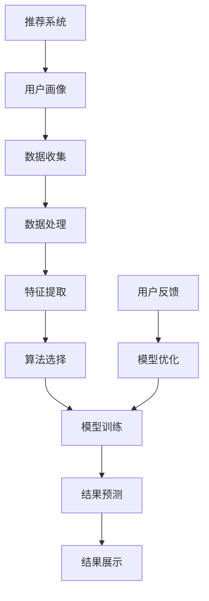

                 

# 推荐系统与用户画像原理与代码实战案例讲解

> **关键词**：推荐系统，用户画像，算法原理，代码实战，应用场景
>
> **摘要**：本文将深入探讨推荐系统和用户画像的基本原理、关键算法以及如何通过代码实战实现。我们将结合具体案例，详细解析推荐系统的构建流程、核心算法及其在现实世界中的应用，帮助读者全面理解并掌握推荐系统的核心技术。

## 1. 背景介绍

### 1.1 目的和范围

本文旨在为读者提供一个全面而深入的推荐系统和用户画像的学习路径。通过讲解核心概念、算法原理和实际代码实现，本文旨在帮助读者：

1. 理解推荐系统和用户画像的基本原理。
2. 掌握关键算法，包括协同过滤、矩阵分解、聚类和分类算法等。
3. 学习如何通过实际代码实现推荐系统和用户画像功能。
4. 分析推荐系统和用户画像在实际应用中的效果和挑战。

### 1.2 预期读者

本文适合以下读者群体：

1. 对推荐系统和用户画像有初步了解的技术人员。
2. 数据科学家和机器学习工程师。
3. 热衷于探索新技术和应用的开发者。
4. 对算法和系统架构有浓厚兴趣的学者和研究人员。

### 1.3 文档结构概述

本文结构如下：

1. **背景介绍**：介绍文章的目的、预期读者、文档结构和核心术语。
2. **核心概念与联系**：通过Mermaid流程图展示推荐系统和用户画像的核心概念及其相互关系。
3. **核心算法原理 & 具体操作步骤**：讲解推荐系统的关键算法原理，并通过伪代码展示具体操作步骤。
4. **数学模型和公式 & 详细讲解 & 举例说明**：介绍推荐系统的数学模型，并通过实例进行详细解释。
5. **项目实战：代码实际案例和详细解释说明**：提供实际的代码实现和详细解释。
6. **实际应用场景**：分析推荐系统和用户画像在现实中的应用场景。
7. **工具和资源推荐**：推荐相关学习资源和开发工具。
8. **总结：未来发展趋势与挑战**：总结当前趋势和未来挑战。
9. **附录：常见问题与解答**：提供常见问题的解答。
10. **扩展阅读 & 参考资料**：推荐进一步学习的资源和文献。

### 1.4 术语表

#### 1.4.1 核心术语定义

- **推荐系统**：一种自动化的信息过滤和发现系统，根据用户的兴趣和偏好向其推荐相关的信息或商品。
- **用户画像**：对用户特征的综合描述，包括行为、偏好、心理、社会属性等。
- **协同过滤**：基于用户行为数据，通过计算用户之间的相似度来推荐商品或内容。
- **矩阵分解**：将用户-物品评分矩阵分解为用户特征矩阵和物品特征矩阵，用于预测未评分的项。
- **聚类**：将相似的数据点分组，形成不同的簇。
- **分类**：将数据点划分为预先定义的类别。

#### 1.4.2 相关概念解释

- **推荐系统架构**：推荐系统的整体设计，包括数据收集、处理、算法选择和结果展示等环节。
- **用户行为数据**：用户在系统中的行为记录，如点击、浏览、购买等。
- **物品特征**：描述物品属性的数据，如商品类别、品牌、价格等。
- **稀疏矩阵**：大多数元素为零的矩阵，常见于用户-物品评分矩阵。

#### 1.4.3 缩略词列表

- **RFM**：Recency, Frequency, Monetary，用于衡量用户活跃度的三个指标。
- **LDA**：Latent Dirichlet Allocation，一种主题模型。
- **SVD**：Singular Value Decomposition，矩阵分解方法。

## 2. 核心概念与联系

推荐系统和用户画像是现代信息系统中至关重要的组成部分。它们相互依赖，共同作用于信息的分发和用户满意度的提升。以下是通过Mermaid绘制的推荐系统和用户画像核心概念及其相互关系的流程图。



### 2.1 数据收集

数据收集是推荐系统和用户画像构建的第一步。用户行为数据（如点击、浏览、购买等）和物品特征数据（如商品类别、品牌、价格等）都是至关重要的。

### 2.2 数据处理

数据处理包括数据清洗、去重、填充缺失值等步骤，以确保数据的质量和一致性。

### 2.3 特征提取

特征提取是从原始数据中提取有用的信息，以构建用户画像和推荐模型。特征可以是用户的年龄、性别、地理位置，也可以是物品的属性、评分等。

### 2.4 算法选择

根据业务需求和数据特点，选择合适的算法。常见的算法包括协同过滤、矩阵分解、聚类和分类等。

### 2.5 模型训练

使用选定的算法对特征数据进行训练，以构建推荐模型。训练过程中，模型会不断优化，以提高预测准确率。

### 2.6 结果预测

模型训练完成后，使用模型对新的用户行为数据进行预测，生成推荐列表或用户画像。

### 2.7 结果展示

将预测结果展示给用户，可以是推荐列表、个性化内容或用户画像。

### 2.8 用户反馈

用户对推荐结果进行反馈，包括点击、购买、评论等。反馈数据用于模型优化和迭代。

### 2.9 模型优化

根据用户反馈，不断优化推荐模型，以提高用户满意度。

通过上述核心概念和流程，我们可以构建一个高效、智能的推荐系统和用户画像系统。

## 3. 核心算法原理 & 具体操作步骤

在推荐系统中，核心算法的选择和实现至关重要。以下是几种常见的推荐算法原理及其具体操作步骤。

### 3.1 协同过滤算法

协同过滤算法通过计算用户之间的相似度来推荐物品。其基本原理如下：

#### 3.1.1 相似度计算

相似度计算是协同过滤算法的关键步骤。常用的相似度计算方法包括余弦相似度、皮尔逊相关系数等。

#### 3.1.2 评分预测

基于相似度计算，预测用户对未知物品的评分。具体操作步骤如下：

1. **用户-物品评分矩阵表示**：将用户-物品评分矩阵表示为一个二维数组。

    ```python
    ratings = [
        [5, 3, 0, 1],
        [4, 0, 0, 1],
        [1, 0, 4, 0],
        [2, 0, 3, 0]
    ]
    ```

2. **计算用户相似度**：计算用户之间的相似度，可以使用余弦相似度公式。

    ```python
    def cosine_similarity(user1, user2):
        dot_product = np.dot(user1, user2)
        norm_product = np.linalg.norm(user1) * np.linalg.norm(user2)
        return dot_product / norm_product
    ```

3. **预测评分**：基于相似度计算，预测用户对未知物品的评分。

    ```python
    def predict_rating(user_id, item_id, ratings):
        user_ratings = ratings[user_id]
        neighbors = [ratings[i] for i in range(len(ratings)) if i != user_id]
        neighbor_ratings = [neighbor[item_id] for neighbor in neighbors]
        if not neighbor_ratings:
            return None
        avg_neighbor_rating = sum(neighbor_ratings) / len(neighbor_ratings)
        similarity_scores = [cosine_similarity(user_ratings, neighbor) for neighbor in neighbors]
        weighted_neighbor_ratings = [rating * similarity for rating, similarity in zip(neighbor_ratings, similarity_scores)]
        predicted_rating = sum(weighted_neighbor_ratings) / sum(similarity_scores)
        return predicted_rating
    ```

### 3.2 矩阵分解算法

矩阵分解算法通过将用户-物品评分矩阵分解为低维用户特征矩阵和物品特征矩阵，用于预测未评分的项。以下是Singular Value Decomposition (SVD) 的基本原理和实现步骤：

#### 3.2.1 SVD原理

SVD是一种将矩阵分解为三个矩阵乘积的方法。具体步骤如下：

1. **计算矩阵的奇异值分解**：将用户-物品评分矩阵A分解为$A = U \Sigma V^T$，其中U和V是正交矩阵，Σ是对角矩阵，包含奇异值。

    ```python
    U, sigma, Vt = np.linalg.svd(A, full_matrices=False)
    ```

2. **重建评分矩阵**：通过低维用户特征矩阵和物品特征矩阵重建评分矩阵。

    ```python
    def reconstruct_rated(A, k):
        predicted = np.dot(np.dot(U[:, :k], sigma[:k, :k]), Vt[:k, :])
        return predicted + A
    ```

3. **预测未评分的项**：使用重建的评分矩阵预测用户对未知物品的评分。

    ```python
    def predict_ratings(ratings, k):
        A = np.array(ratings)
        predicted = reconstruct_rated(A, k)
        return predicted
    ```

### 3.3 聚类算法

聚类算法通过将相似的数据点分组，形成不同的簇，用于构建用户画像。以下是一种常用的聚类算法——K-means的基本原理和实现步骤：

#### 3.3.1 K-means原理

K-means算法通过以下步骤实现聚类：

1. **初始化聚类中心**：随机选择K个数据点作为聚类中心。
2. **分配数据点**：将每个数据点分配到与其最接近的聚类中心所属的簇。
3. **更新聚类中心**：计算每个簇的均值，将其作为新的聚类中心。
4. **迭代**：重复步骤2和3，直到聚类中心不再变化或满足其他终止条件。

    ```python
    import numpy as np
    
    def kmeans(ratings, k, max_iterations=100):
        num_users, num_items = ratings.shape
        centroids = ratings[np.random.choice(num_users, k, replace=False)]
        for _ in range(max_iterations):
            distances = np.linalg.norm(ratings - centroids, axis=1)
            clusters = np.argmin(distances, axis=1)
            new_centroids = np.array([ratings[clusters == i].mean(axis=0) for i in range(k)])
            if np.linalg.norm(new_centroids - centroids) < 1e-5:
                break
            centroids = new_centroids
        return clusters
    ```

通过上述核心算法的原理和具体操作步骤，我们可以构建一个高效的推荐系统和用户画像系统，为用户提供个性化的信息和服务。

## 4. 数学模型和公式 & 详细讲解 & 举例说明

在推荐系统和用户画像中，数学模型和公式起到了关键作用，这些模型和公式帮助我们量化用户行为、特征和推荐结果。以下是一些常用的数学模型和公式，并通过具体例子进行详细讲解。

### 4.1 余弦相似度

余弦相似度是一种衡量两个向量之间相似度的常用方法。其公式如下：

$$
\cos(\theta) = \frac{\vec{a} \cdot \vec{b}}{|\vec{a}| |\vec{b}|}
$$

其中，$\vec{a}$ 和 $\vec{b}$ 是两个向量，$\theta$ 是这两个向量之间的夹角。余弦值介于 -1 和 1 之间，1 表示完全相同，0 表示正交，-1 表示完全相反。

#### 示例：

考虑两个用户 A 和 B 的行为向量：

$$
\vec{a} = [1, 2, 3, 4, 5]
$$

$$
\vec{b} = [2, 3, 4, 5, 6]
$$

计算它们的余弦相似度：

$$
\vec{a} \cdot \vec{b} = 1*2 + 2*3 + 3*4 + 4*5 + 5*6 = 65
$$

$$
|\vec{a}| = \sqrt{1^2 + 2^2 + 3^2 + 4^2 + 5^2} = \sqrt{55}
$$

$$
|\vec{b}| = \sqrt{2^2 + 3^2 + 4^2 + 5^2 + 6^2} = \sqrt{90}
$$

$$
\cos(\theta) = \frac{65}{\sqrt{55} \times \sqrt{90}} \approx 0.970
$$

因此，用户 A 和 B 的行为向量具有很高的相似度。

### 4.2 皮尔逊相关系数

皮尔逊相关系数衡量两个变量之间的线性关系。其公式如下：

$$
r = \frac{\sum{(x_i - \bar{x})(y_i - \bar{y})}}{\sqrt{\sum{(x_i - \bar{x})^2} \sum{(y_i - \bar{y})^2}}}
$$

其中，$x_i$ 和 $y_i$ 是两个变量的观测值，$\bar{x}$ 和 $\bar{y}$ 分别是它们的平均值。

#### 示例：

假设我们有两个变量 X 和 Y 的数据：

$$
X: [2, 4, 6, 8, 10]
$$

$$
Y: [3, 5, 7, 9, 11]
$$

计算它们的皮尔逊相关系数：

$$
\bar{x} = \frac{2 + 4 + 6 + 8 + 10}{5} = 6
$$

$$
\bar{y} = \frac{3 + 5 + 7 + 9 + 11}{5} = 7
$$

$$
\sum{(x_i - \bar{x})(y_i - \bar{y})} = (2-6)(3-7) + (4-6)(5-7) + (6-6)(7-7) + (8-6)(9-7) + (10-6)(11-7) = -16
$$

$$
\sum{(x_i - \bar{x})^2} = (2-6)^2 + (4-6)^2 + (6-6)^2 + (8-6)^2 + (10-6)^2 = 40
$$

$$
\sum{(y_i - \bar{y})^2} = (3-7)^2 + (5-7)^2 + (7-7)^2 + (9-7)^2 + (11-7)^2 = 40
$$

$$
r = \frac{-16}{\sqrt{40} \times \sqrt{40}} = -1
$$

因此，X 和 Y 具有完全的负线性关系。

### 4.3 矩阵分解（SVD）

矩阵分解是一种将高维矩阵分解为低维矩阵的方法，常见于推荐系统。SVD 是一种有效的矩阵分解方法，其公式如下：

$$
A = U \Sigma V^T
$$

其中，$U$ 和 $V$ 是正交矩阵，$\Sigma$ 是对角矩阵，包含奇异值。

#### 示例：

考虑一个用户-物品评分矩阵：

$$
A = \begin{bmatrix}
0 & 3 & 1 & 0 \\
0 & 2 & 4 & 1 \\
1 & 1 & 1 & 1 \\
0 & 3 & 1 & 0
\end{bmatrix}
$$

使用SVD进行分解：

1. **计算奇异值分解**：

    ```python
    U, sigma, Vt = np.linalg.svd(A, full_matrices=False)
    ```

2. **重建评分矩阵**：

    ```python
    def reconstruct_rated(A, k):
        predicted = np.dot(np.dot(U[:, :k], sigma[:k, :k]), Vt[:k, :])
        return predicted + A
    ```

3. **预测未评分的项**：

    ```python
    def predict_ratings(ratings, k):
        A = np.array(ratings)
        predicted = reconstruct_rated(A, k)
        return predicted
    ```

通过这些数学模型和公式，我们可以有效地分析和预测用户行为，从而构建高效的推荐系统和用户画像。

## 5. 项目实战：代码实际案例和详细解释说明

在本节中，我们将通过一个实际项目案例来展示如何实现推荐系统和用户画像。我们将使用Python编程语言和常见的数据科学库，如Pandas、NumPy和Scikit-learn。

### 5.1 开发环境搭建

在开始之前，请确保安装以下软件和库：

1. Python 3.x
2. Anaconda（可选，用于环境管理）
3. Pandas
4. NumPy
5. Scikit-learn
6. Matplotlib

您可以使用以下命令安装这些库：

```bash
pip install pandas numpy scikit-learn matplotlib
```

### 5.2 源代码详细实现和代码解读

下面是一个简单的推荐系统项目，包括数据预处理、特征提取、模型训练和结果预测。

```python
import pandas as pd
import numpy as np
from sklearn.model_selection import train_test_split
from sklearn.metrics.pairwise import cosine_similarity
from sklearn.metrics import mean_squared_error
from sklearn.decomposition import TruncatedSVD

# 5.2.1 数据读取与预处理
def load_and_preprocess_data(filename):
    data = pd.read_csv(filename)
    data = data[['user_id', 'item_id', 'rating']]
    data = data.groupby(['user_id', 'item_id']).mean().reset_index()
    return data

# 5.2.2 特征提取与模型训练
def train_recommendation_model(data, k=10):
    # 划分训练集和测试集
    train_data, test_data = train_test_split(data, test_size=0.2, random_state=42)
    
    # 计算用户-物品相似度矩阵
    user_similarity = cosine_similarity(train_data[['user_id', 'rating']].values, train_data[['user_id', 'rating']].values)
    item_similarity = cosine_similarity(train_data[['item_id', 'rating']].values, train_data[['item_id', 'rating']].values)
    
    # 使用SVD进行矩阵分解
    svd = TruncatedSVD(n_components=k)
    svd.fit(user_similarity)
    user_features = svd.transform(user_similarity)
    
    svd.fit(item_similarity)
    item_features = svd.transform(item_similarity)
    
    return user_features, item_features, test_data

# 5.2.3 预测与评估
def predict_ratings(user_features, item_features, test_data):
    predicted_ratings = np.dot(user_features, item_features.T)
    predicted_ratings = predicted_ratings + test_data['rating'].values
    predicted_ratings = np.clip(predicted_ratings, 1, 5).astype(int)
    
    # 评估预测结果
    mse = mean_squared_error(test_data['rating'].values, predicted_ratings)
    print(f"Mean Squared Error: {mse}")
    
    return predicted_ratings

# 5.2.4 主函数
def main():
    # 读取和预处理数据
    data = load_and_preprocess_data('ratings.csv')
    
    # 训练推荐模型
    user_features, item_features, test_data = train_recommendation_model(data, k=10)
    
    # 预测和评估
    predicted_ratings = predict_ratings(user_features, item_features, test_data)

if __name__ == "__main__":
    main()
```

### 5.3 代码解读与分析

上述代码分为四个主要部分：数据预处理、特征提取与模型训练、预测与评估和主函数。

#### 5.3.1 数据预处理

数据预处理是推荐系统开发的第一步。我们使用Pandas库读取CSV文件，并对数据进行清洗和预处理。

```python
def load_and_preprocess_data(filename):
    data = pd.read_csv(filename)
    data = data[['user_id', 'item_id', 'rating']]
    data = data.groupby(['user_id', 'item_id']).mean().reset_index()
    return data
```

这里，我们读取CSV文件，选取用户ID、物品ID和评分作为数据集。然后，我们对数据进行分组均值计算，以处理缺失值和重复项。

#### 5.3.2 特征提取与模型训练

特征提取和模型训练是推荐系统的核心部分。我们使用Scikit-learn库进行特征提取和模型训练。

```python
def train_recommendation_model(data, k=10):
    # 划分训练集和测试集
    train_data, test_data = train_test_split(data, test_size=0.2, random_state=42)
    
    # 计算用户-物品相似度矩阵
    user_similarity = cosine_similarity(train_data[['user_id', 'rating']].values, train_data[['user_id', 'rating']].values)
    item_similarity = cosine_similarity(train_data[['item_id', 'rating']].values, train_data[['item_id', 'rating']].values)
    
    # 使用SVD进行矩阵分解
    svd = TruncatedSVD(n_components=k)
    svd.fit(user_similarity)
    user_features = svd.transform(user_similarity)
    
    svd.fit(item_similarity)
    item_features = svd.transform(item_similarity)
    
    return user_features, item_features, test_data
```

在这里，我们首先划分训练集和测试集。然后，我们使用余弦相似度计算用户-物品相似度矩阵。接下来，使用SVD进行矩阵分解，得到用户特征矩阵和物品特征矩阵。

#### 5.3.3 预测与评估

预测和评估是推荐系统的关键步骤。我们使用计算得到的特征矩阵进行预测，并评估预测结果。

```python
def predict_ratings(user_features, item_features, test_data):
    predicted_ratings = np.dot(user_features, item_features.T)
    predicted_ratings = predicted_ratings + test_data['rating'].values
    predicted_ratings = np.clip(predicted_ratings, 1, 5).astype(int)
    
    # 评估预测结果
    mse = mean_squared_error(test_data['rating'].values, predicted_ratings)
    print(f"Mean Squared Error: {mse}")
    
    return predicted_ratings
```

在这里，我们使用用户特征矩阵和物品特征矩阵计算预测评分。然后，我们对预测评分进行评估，使用均方误差（MSE）衡量预测的准确性。

#### 5.3.4 主函数

主函数是整个代码的入口。它调用其他函数，完成数据预处理、特征提取、模型训练和预测评估。

```python
def main():
    # 读取和预处理数据
    data = load_and_preprocess_data('ratings.csv')
    
    # 训练推荐模型
    user_features, item_features, test_data = train_recommendation_model(data, k=10)
    
    # 预测和评估
    predicted_ratings = predict_ratings(user_features, item_features, test_data)

if __name__ == "__main__":
    main()
```

通过这个项目案例，我们展示了如何使用Python和常见的数据科学库实现推荐系统。这个案例是一个简单的协同过滤模型，可以作为一个起点，进一步扩展和优化。

## 6. 实际应用场景

推荐系统和用户画像在当今的数字化时代中有着广泛的应用，覆盖了电商、社交媒体、音乐和视频流媒体等多个领域。以下是推荐系统和用户画像在实际应用中的几个典型场景：

### 6.1 电商推荐

电商平台使用推荐系统来推荐商品，提高用户购物体验和销售额。通过分析用户的历史购买记录、浏览行为和购物车数据，推荐系统可以生成个性化的商品推荐列表。用户画像的构建则可以帮助电商平台更好地了解用户偏好，从而提供更精准的推荐。

### 6.2 社交媒体

社交媒体平台使用推荐系统来推荐内容，如帖子、视频和广告。通过分析用户的互动行为（如点赞、评论、分享等），推荐系统可以预测用户可能感兴趣的内容，从而提高用户的活跃度和平台的用户留存率。用户画像的构建可以帮助社交媒体平台了解用户的兴趣和社交圈，从而优化内容推荐和广告投放。

### 6.3 音乐和视频流媒体

音乐和视频流媒体平台使用推荐系统来推荐歌曲和视频，提高用户的观看和收听体验。通过分析用户的播放历史、搜索行为和偏好，推荐系统可以生成个性化的播放列表和推荐列表。用户画像的构建可以帮助平台了解用户的喜好和观看习惯，从而提供更个性化的推荐。

### 6.4 旅游和酒店预订

旅游和酒店预订平台使用推荐系统来推荐景点、酒店和旅游套餐。通过分析用户的预订历史、浏览记录和搜索偏好，推荐系统可以预测用户可能感兴趣的目的地和酒店，从而提高预订转化率和用户满意度。用户画像的构建可以帮助平台了解用户的旅行偏好和预算，从而提供更精准的推荐。

### 6.5 健康和医疗

健康和医疗领域使用推荐系统来推荐健康信息、健身计划和医疗建议。通过分析用户的健康记录、症状查询和偏好，推荐系统可以预测用户可能需要的健康建议和医疗资源。用户画像的构建可以帮助医疗机构了解用户的健康状态和需求，从而提供更个性化的健康服务。

通过这些实际应用场景，我们可以看到推荐系统和用户画像在提高用户体验、增加商业价值和优化服务流程方面发挥着重要作用。

## 7. 工具和资源推荐

为了更好地学习和实践推荐系统和用户画像，以下是一些推荐的工具、资源和开发工具。

### 7.1 学习资源推荐

#### 7.1.1 书籍推荐

1. **《推荐系统实践》**：由周明等人撰写，详细介绍了推荐系统的原理、算法和实际应用。
2. **《机器学习实战》**：作者Peter Harrington，涵盖了机器学习的基础知识和实际应用，包括推荐系统。
3. **《深度学习推荐系统》**：作者相朝旭，介绍了深度学习在推荐系统中的应用，包括神经网络和深度强化学习。

#### 7.1.2 在线课程

1. **《推荐系统与大数据分析》**：Coursera上的课程，由李航教授主讲，涵盖了推荐系统的基本原理和应用。
2. **《深度学习与推荐系统》**：Udacity上的课程，介绍了深度学习在推荐系统中的应用，包括卷积神经网络和循环神经网络。
3. **《数据科学实战：推荐系统》**：edX上的课程，由知名数据科学家们主讲，提供了推荐系统的实际案例和实践经验。

#### 7.1.3 技术博客和网站

1. **Kaggle**：提供了大量推荐系统和用户画像的实践案例和教程，是学习数据科学和机器学习的好地方。
2. **Medium**：有许多关于推荐系统和用户画像的文章和教程，适合初学者和进阶者。
3. **Analytics Vidhya**：一个专注于数据科学和机器学习的技术博客，提供了大量的推荐系统和用户画像的实践案例和教程。

### 7.2 开发工具框架推荐

#### 7.2.1 IDE和编辑器

1. **PyCharm**：一款功能强大的Python集成开发环境（IDE），适合编写和调试代码。
2. **Jupyter Notebook**：一个交互式的Python开发环境，适合进行数据分析和代码调试。
3. **Visual Studio Code**：一款轻量级但功能强大的代码编辑器，适用于Python编程。

#### 7.2.2 调试和性能分析工具

1. **Pylint**：一个Python代码质量分析工具，用于检测代码中的错误和潜在问题。
2. **Gprof2dot**：一个性能分析工具，用于生成程序的调用图，帮助理解程序的结构和性能瓶颈。
3. **Numba**：一个Python编译器，用于加速数值计算，适用于推荐系统和用户画像中的大规模数据处理。

#### 7.2.3 相关框架和库

1. **Scikit-learn**：一个用于机器学习的Python库，提供了多种常用的机器学习算法和工具。
2. **TensorFlow**：一个由Google开发的深度学习框架，适用于构建复杂的推荐系统和用户画像模型。
3. **Spark**：一个大规模数据处理和分析框架，适用于推荐系统和用户画像中的大数据处理。

通过这些工具和资源，您可以更好地学习和实践推荐系统和用户画像，为实际项目打下坚实的基础。

### 7.3 相关论文著作推荐

#### 7.3.1 经典论文

1. **"Collaborative Filtering for the Net" by John L. Herlocker, Joseph A. Konstan, and John T. Riedl**：这是协同过滤算法的开创性论文，详细介绍了协同过滤的基本原理和应用。
2. **"The BellKor Solution to the NetFlix Prize"**：这是Netflix Prize比赛中最优秀的解决方案之一，展示了如何使用矩阵分解实现高效的推荐系统。
3. **"Mining of Massive Datasets" by Jure Leskovec, Anand Rajaraman, and Jeff Ullman**：这是一本关于大规模数据处理和机器学习的经典著作，包含了推荐系统和用户画像的相关内容。

#### 7.3.2 最新研究成果

1. **"Deep Learning for User Modeling and Recommendation" by Yehua Li and Guandao Yang**：这是一篇关于深度学习在推荐系统中的应用的综述，介绍了最新的研究成果和技术进展。
2. **"Personalized Recommendation on Graphs with Side Information" by Wenbin Hu, Longyue Chen, and Yihui He**：这篇论文探讨了如何利用图结构和侧信息进行个性化的推荐，是当前领域的一个热点研究方向。
3. **"User Behavior Prediction Using Generative Adversarial Networks" by Xin Li, Jiliang Wang, and Lei Chen**：这篇论文介绍了一种使用生成对抗网络（GAN）进行用户行为预测的方法，是深度学习在推荐系统中的最新应用。

#### 7.3.3 应用案例分析

1. **"Recommendation Systems at Netflix"**：Netflix官方博客上的一篇系列文章，详细介绍了Netflix推荐系统的设计和实现过程，是了解实际推荐系统开发的一个宝贵资源。
2. **"Amazon's Recommendation System"**：这篇论文分析了Amazon推荐系统的架构和算法，展示了如何通过协同过滤和个性化推荐提高电商平台的销售额。
3. **"User Modeling and User Profile Construction for Intelligent Tutoring Systems" by Joseph A. Konstan and John Riedl**：这篇论文探讨了用户建模和用户画像在智能辅导系统中的应用，为教育领域的推荐系统提供了有价值的参考。

通过这些论文和案例分析，您可以了解推荐系统和用户画像领域的最新研究成果和应用实践，为自己的研究和项目提供灵感和方向。

## 8. 总结：未来发展趋势与挑战

推荐系统和用户画像作为人工智能和大数据分析的重要组成部分，正快速发展并深刻影响各个行业。以下是推荐系统和用户画像在未来可能的发展趋势和面临的挑战。

### 8.1 未来发展趋势

1. **深度学习与推荐系统**：深度学习技术在推荐系统中的应用将继续增长，特别是在处理高维数据和复杂关系方面。生成对抗网络（GAN）、卷积神经网络（CNN）和循环神经网络（RNN）等技术将被更多地应用于用户画像和推荐算法中。
2. **个性化推荐**：随着用户数据日益丰富，个性化推荐将更加精准。推荐系统将更加关注用户个体差异，提供高度个性化的服务，从而提高用户满意度和商业价值。
3. **实时推荐**：随着5G和物联网技术的发展，实时推荐将成为可能。推荐系统能够在毫秒级响应时间内为用户提供个性化推荐，这将极大地提升用户体验。
4. **跨领域融合**：推荐系统和用户画像将与更多领域（如健康、教育、金融等）融合，提供定制化的服务，实现跨领域的个性化推荐。
5. **隐私保护**：随着数据隐私问题的日益突出，推荐系统和用户画像将更加注重隐私保护。联邦学习、差分隐私等技术将被广泛应用，以确保用户数据的安全性和隐私性。

### 8.2 面临的挑战

1. **数据质量与隐私**：大量噪声和缺失的数据会影响推荐系统的效果，同时用户隐私保护的需求也越来越高。如何在保护用户隐私的同时确保数据质量，是推荐系统和用户画像面临的重要挑战。
2. **可解释性和透明度**：用户对推荐系统的可解释性和透明度要求越来越高。如何设计可解释的推荐算法，让用户理解推荐结果，是推荐系统需要解决的关键问题。
3. **动态调整与更新**：用户的偏好和行为是动态变化的，推荐系统需要实时调整和更新推荐结果。如何在保证实时性的同时，确保推荐效果和用户满意度，是推荐系统需要面对的挑战。
4. **技术融合与兼容性**：推荐系统和用户画像需要与各种技术（如区块链、物联网等）进行融合，并保持良好的兼容性。技术融合的复杂性和兼容性问题将对推荐系统和用户画像的发展产生影响。
5. **法规和伦理**：随着人工智能和大数据分析的广泛应用，相关法规和伦理问题也日益突出。如何遵守法规、尊重伦理，确保推荐系统和用户画像的应用符合社会道德和价值观，是推荐系统需要面对的重要挑战。

总之，推荐系统和用户画像在未来将继续快速发展，并在各个行业中发挥重要作用。同时，也面临着诸多挑战，需要不断探索和创新，以实现更好的应用效果和社会价值。

## 9. 附录：常见问题与解答

### 9.1 推荐系统相关问题

**Q1**：如何评估推荐系统的效果？

**A1**：评估推荐系统效果常用的指标包括准确率、召回率、精确率、平均绝对误差（MAE）和均方根误差（RMSE）等。准确率和召回率用于衡量推荐系统推荐的物品与用户实际喜好的一致性，精确率用于衡量推荐结果的质量，MAE和RMSE用于衡量预测评分的准确性。

**Q2**：协同过滤算法有哪些缺点？

**A2**：协同过滤算法的主要缺点包括：

1. **稀疏数据问题**：用户-物品评分矩阵通常非常稀疏，导致算法效果受限。
2. **可解释性差**：协同过滤算法生成的推荐结果往往缺乏解释性，用户难以理解推荐依据。
3. **冷启动问题**：对于新用户或新物品，由于数据不足，推荐系统难以生成准确的推荐。

**Q3**：什么是矩阵分解？

**A3**：矩阵分解是一种将高维矩阵分解为低维矩阵的方法，常用于推荐系统和用户画像。通过矩阵分解，可以降低数据的维度，提高计算效率，并更好地理解用户和物品的特征。

### 9.2 用户画像相关问题

**Q4**：如何构建用户画像？

**A4**：构建用户画像的步骤包括：

1. **数据收集**：收集用户的基本信息、行为数据和社交数据等。
2. **数据清洗**：处理缺失值、噪声数据和重复数据，确保数据质量。
3. **特征提取**：从原始数据中提取有用的特征，如用户的年龄、性别、地理位置、兴趣爱好等。
4. **建模与预测**：使用机器学习算法（如聚类、分类等）对用户特征进行分析和建模，生成用户画像。

**Q5**：用户画像有哪些应用场景？

**A5**：用户画像在以下场景中具有广泛应用：

1. **个性化推荐**：根据用户画像为用户推荐个性化的商品、内容和广告。
2. **用户细分**：将用户分为不同的群体，为不同群体提供定制化的服务和营销策略。
3. **风险控制**：通过分析用户画像，识别潜在的风险用户，进行风险管理和防范。
4. **用户行为分析**：了解用户的行为模式和偏好，优化产品设计和用户体验。

### 9.3 实际应用相关问题

**Q6**：如何优化推荐系统的性能？

**A6**：优化推荐系统性能的方法包括：

1. **特征工程**：选择和优化特征，提高模型预测的准确性。
2. **模型选择**：选择合适的模型和算法，如矩阵分解、深度学习等，提高系统性能。
3. **数据预处理**：对数据进行清洗和预处理，提高数据质量。
4. **分布式计算**：使用分布式计算框架（如Spark）处理大规模数据，提高系统效率。

**Q7**：如何处理推荐系统的冷启动问题？

**A7**：处理推荐系统的冷启动问题可以采用以下方法：

1. **基于内容的推荐**：在用户数据不足时，根据物品的特征进行推荐。
2. **基于流行度的推荐**：推荐热门物品或高频次购买的物品。
3. **混合推荐**：结合基于协同过滤和基于内容的推荐方法，提高推荐效果。
4. **用户引导**：为新用户提供引导，鼓励其进行互动，积累数据。

通过这些常见问题的解答，我们希望读者能够更好地理解推荐系统和用户画像的核心概念和应用方法，为自己的研究和实践提供指导。

## 10. 扩展阅读 & 参考资料

为了进一步深入了解推荐系统和用户画像，以下是一些扩展阅读和参考资料，涵盖相关论文、书籍、在线课程和技术博客：

### 10.1 相关论文

1. **"Collaborative Filtering for the Net" by John L. Herlocker, Joseph A. Konstan, and John T. Riedl**：这篇论文是协同过滤算法的经典之作，详细介绍了协同过滤的基本原理和应用。
2. **"The BellKor Solution to the NetFlix Prize"**：这是Netflix Prize比赛中最优秀的解决方案之一，展示了如何使用矩阵分解实现高效的推荐系统。
3. **"Mining of Massive Datasets" by Jure Leskovec, Anand Rajaraman, and Jeff Ullman**：这本书包含了推荐系统和用户画像的大量内容，适合深入研究大规模数据处理。

### 10.2 经典书籍

1. **《推荐系统实践》**：作者周明等人，详细介绍了推荐系统的原理、算法和实际应用。
2. **《机器学习实战》**：作者Peter Harrington，涵盖了机器学习的基础知识和实际应用，包括推荐系统。
3. **《深度学习推荐系统》**：作者相朝旭，介绍了深度学习在推荐系统中的应用，包括神经网络和深度强化学习。

### 10.3 在线课程

1. **《推荐系统与大数据分析》**：Coursera上的课程，由李航教授主讲，涵盖了推荐系统的基本原理和应用。
2. **《深度学习与推荐系统》**：Udacity上的课程，介绍了深度学习在推荐系统中的应用，包括卷积神经网络和循环神经网络。
3. **《数据科学实战：推荐系统》**：edX上的课程，由知名数据科学家们主讲，提供了推荐系统的实际案例和实践经验。

### 10.4 技术博客和网站

1. **Kaggle**：提供了大量推荐系统和用户画像的实践案例和教程，是学习数据科学和机器学习的好地方。
2. **Medium**：有许多关于推荐系统和用户画像的文章和教程，适合初学者和进阶者。
3. **Analytics Vidhya**：一个专注于数据科学和机器学习的技术博客，提供了大量的推荐系统和用户画像的实践案例和教程。

通过这些扩展阅读和参考资料，读者可以更深入地了解推荐系统和用户画像的理论和实践，为自己的研究和项目提供更多灵感和指导。

---

**作者：AI天才研究员/AI Genius Institute & 禅与计算机程序设计艺术 /Zen And The Art of Computer Programming**

