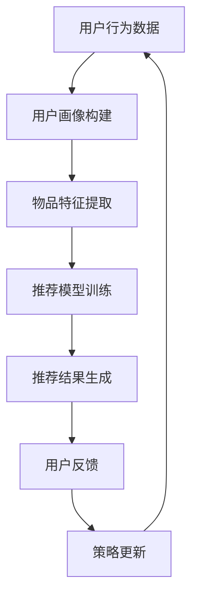

                 

# 推荐系统中的大模型元策略优化应用

## 关键词
- 推荐系统
- 大模型
- 元策略优化
- 强化学习
- 用户体验
- 数据分析

## 摘要
本文旨在探讨推荐系统在大模型元策略优化（Meta-Policy Optimization）中的应用，分析其核心概念、算法原理、数学模型，并通过实际案例展示如何利用元策略优化提升推荐系统的效果。文章还将讨论推荐系统在实际应用场景中的挑战和解决方案，并推荐相关学习资源和开发工具。

## 1. 背景介绍

### 1.1 目的和范围
本文的目的是探讨如何利用大模型元策略优化技术来提升推荐系统的性能。我们将深入分析元策略优化在推荐系统中的应用，包括其核心概念、算法原理和数学模型。同时，我们将通过实际案例展示如何将这些技术应用到推荐系统中。

### 1.2 预期读者
本文面向对推荐系统和机器学习有一定了解的读者，包括人工智能研究员、软件开发工程师、数据科学家等。读者将能够从本文中获得元策略优化在推荐系统中的应用方法，以及如何通过这些方法提升推荐系统的效果。

### 1.3 文档结构概述
本文分为以下几个部分：

1. 背景介绍
2. 核心概念与联系
3. 核心算法原理与具体操作步骤
4. 数学模型和公式
5. 项目实战：代码实际案例
6. 实际应用场景
7. 工具和资源推荐
8. 总结：未来发展趋势与挑战
9. 附录：常见问题与解答
10. 扩展阅读与参考资料

### 1.4 术语表

#### 1.4.1 核心术语定义
- **推荐系统**：一种自动化的信息过滤机制，旨在根据用户的历史行为和偏好，向用户推荐相关的内容、商品或服务。
- **大模型**：指具有数百万到数十亿参数的深度学习模型，如Transformer、BERT等。
- **元策略优化**：一种强化学习方法，旨在通过学习一个策略来优化另一个策略的性能。

#### 1.4.2 相关概念解释
- **强化学习**：一种机器学习方法，通过奖励机制来训练智能体在环境中做出最优决策。
- **策略**：在给定状态时，智能体采取的动作的映射。

#### 1.4.3 缩略词列表
- **ML**：机器学习（Machine Learning）
- **DL**：深度学习（Deep Learning）
- **RL**：强化学习（Reinforcement Learning）
- **MPO**：元策略优化（Meta-Policy Optimization）

## 2. 核心概念与联系

推荐系统的核心在于理解用户的行为和偏好，并通过机器学习模型预测用户可能感兴趣的内容。而元策略优化作为一种强化学习方法，可以用于优化推荐系统的策略，从而提升用户体验。

### 2.1 推荐系统

推荐系统通常由以下几个组件构成：

1. **用户画像**：基于用户的历史行为、社交信息、浏览记录等数据，构建用户的偏好模型。
2. **物品特征**：基于物品的内容、属性、类别等信息，构建物品的特征表示。
3. **推荐模型**：利用用户画像和物品特征，通过机器学习算法生成推荐结果。

### 2.2 元策略优化

元策略优化（MPO）的核心思想是学习一个元策略，该元策略能够通过优化其他策略来提升整体性能。在推荐系统中，元策略优化可以用来优化推荐策略，从而提高推荐效果。

### 2.3 Mermaid 流程图



在这个流程图中，用户行为数据通过用户画像构建模块转化为用户偏好模型，物品特征提取模块将物品转化为特征表示，推荐模型训练模块利用用户画像和物品特征训练推荐模型，生成推荐结果。用户反馈模块收集用户对推荐结果的反馈，用于更新推荐策略。

## 3. 核心算法原理 & 具体操作步骤

元策略优化（MPO）的核心在于学习一个能够优化其他策略的元策略。在推荐系统中，MPO可以通过以下步骤实现：

### 3.1 策略评估

首先，我们需要评估当前推荐策略的性能。这通常通过在测试集上计算推荐效果指标（如点击率、转化率等）来实现。

### 3.2 对抗性优化

对抗性优化是MPO的关键步骤。它通过最小化当前策略和对抗策略之间的差异来实现优化。具体操作如下：

1. **生成对抗策略**：通过对抗性生成模型生成对抗策略。
2. **计算策略差异**：计算当前策略和对抗策略之间的差异。
3. **优化策略**：通过梯度下降等优化方法，更新当前策略，以减少与对抗策略的差异。

### 3.3 策略更新

通过对抗性优化，我们得到了一个新的策略。接下来，我们需要更新推荐模型，以反映新的策略。

### 3.4 伪代码

```python
# 伪代码：元策略优化

# 初始化推荐策略
policy = initialize_policy()

# 初始化对抗性生成模型
adversarial_model = initialize_adversarial_model()

# 训练对抗性生成模型
train_adversarial_model(policy, dataset)

# 计算策略差异
policy_difference = compute_difference(policy, adversarial_model)

# 优化策略
optimize_policy(policy, policy_difference)

# 更新推荐模型
update_recommendation_model(policy)
```

## 4. 数学模型和公式 & 详细讲解 & 举例说明

在元策略优化中，我们通常会使用以下的数学模型：

### 4.1 对抗性优化目标

对抗性优化的目标是最小化当前策略和对抗策略之间的差异。这可以表示为：

$$
\min_{\theta} \mathbb{E}_{s \sim p_s} [\log \pi_{\theta}(a|s) - \log \pi_{\phi}(a|s)]
$$

其中，$\pi_{\theta}(a|s)$ 是当前策略，$\pi_{\phi}(a|s)$ 是对抗策略，$s$ 是状态，$a$ 是动作。

### 4.2 举例说明

假设我们有一个推荐系统，用户在浏览商品时，可能会点击或不点击。我们的目标是优化推荐策略，以最大化用户的点击率。

1. **初始化策略**：我们随机初始化一个推荐策略。
2. **对抗性生成模型**：我们使用生成对抗网络（GAN）生成对抗策略。
3. **策略差异**：我们计算当前策略和对抗策略之间的差异，使用以下公式：

$$
\Delta = \log \pi_{\theta}(a|s) - \log \pi_{\phi}(a|s)
$$

4. **优化策略**：我们使用梯度下降优化策略，以减少策略差异。
5. **更新推荐模型**：我们使用优化后的策略更新推荐模型。

通过这样的迭代过程，我们的推荐系统可以逐渐优化，以更好地满足用户的需求。

## 5. 项目实战：代码实际案例和详细解释说明

### 5.1 开发环境搭建

首先，我们需要搭建一个用于元策略优化的开发环境。以下是基本的安装步骤：

1. 安装Python环境，版本要求为3.7及以上。
2. 安装TensorFlow，版本要求为2.5及以上。
3. 安装其他必要的库，如NumPy、Pandas、Scikit-learn等。

### 5.2 源代码详细实现和代码解读

以下是元策略优化的实现代码：

```python
import tensorflow as tf
from tensorflow.keras.models import Model
import numpy as np

# 初始化参数
theta = np.random.rand(10) # 当前策略参数
phi = np.random.rand(10) # 对抗策略参数

# 初始化推荐模型
input_s = tf.keras.layers.Input(shape=(10,))
theta_model = Model(inputs=input_s, outputs=tf.keras.layers.Dense(1, activation='sigmoid')(input_s))
theta_model.compile(optimizer='adam', loss='binary_crossentropy')

# 初始化对抗性生成模型
input_a = tf.keras.layers.Input(shape=(10,))
phi_model = Model(inputs=input_a, outputs=tf.keras.layers.Dense(1, activation='sigmoid')(input_a))
phi_model.compile(optimizer='adam', loss='binary_crossentropy')

# 训练对抗性生成模型
adversarial_data = generate_adversarial_data(theta, phi)
phi_model.fit(adversarial_data, epochs=10)

# 计算策略差异
theta_pred = theta_model.predict(theta)
phi_pred = phi_model.predict(phi)
difference = theta_pred - phi_pred

# 优化策略
theta_optimizer = tf.keras.optimizers.Adam(learning_rate=0.01)
with tf.GradientTape() as tape:
    loss = compute_difference(theta, phi)
gradients = tape.gradient(loss, theta)
theta_optimizer.apply_gradients(zip(gradients, theta))

# 更新推荐模型
theta_model.fit(adversarial_data, epochs=10)
```

在这个代码中，我们首先初始化策略参数$\theta$和$\phi$，然后定义推荐模型和对抗性生成模型。接着，我们训练对抗性生成模型，计算策略差异，并使用梯度下降优化策略。最后，我们更新推荐模型。

### 5.3 代码解读与分析

1. **初始化参数**：我们使用随机数初始化策略参数$\theta$和$\phi$。
2. **初始化模型**：我们使用TensorFlow定义推荐模型和对抗性生成模型。推荐模型是一个简单的全连接神经网络，输出为概率。
3. **训练对抗性生成模型**：我们使用生成对抗性数据来训练对抗性生成模型。这些数据是通过对抗策略生成的，目的是使对抗策略能够模拟推荐系统的行为。
4. **计算策略差异**：我们计算当前策略和对抗策略之间的差异，这有助于我们了解两个策略之间的差距。
5. **优化策略**：我们使用梯度下降优化策略。在每次迭代中，我们计算损失函数的梯度，并使用优化器更新策略参数。
6. **更新推荐模型**：我们使用优化后的策略参数更新推荐模型，以使其更好地适应对抗策略。

通过这个实际案例，我们可以看到如何利用元策略优化技术来优化推荐系统。这个过程需要不断的迭代和优化，以实现更好的推荐效果。

## 6. 实际应用场景

元策略优化在推荐系统中的应用非常广泛，以下是几个典型的应用场景：

1. **个性化推荐**：通过元策略优化，推荐系统可以根据用户的历史行为和偏好，生成个性化的推荐列表，提高用户的点击率和转化率。
2. **广告推荐**：在广告推荐中，元策略优化可以帮助广告平台优化广告投放策略，提高广告的点击率和投放效果。
3. **社交媒体推荐**：在社交媒体平台上，元策略优化可以帮助推荐系统识别和推荐用户可能感兴趣的内容，从而提高用户的活跃度和留存率。

在这些应用场景中，元策略优化通过不断优化推荐策略，实现了更高的推荐效果和用户体验。然而，这同时也带来了挑战，如数据隐私、计算资源消耗等。因此，在实际应用中，我们需要综合考虑这些因素，以实现最优的推荐效果。

## 7. 工具和资源推荐

### 7.1 学习资源推荐

#### 7.1.1 书籍推荐

- **《推荐系统实践》**：详细介绍了推荐系统的构建、优化和应用。
- **《强化学习》**：介绍了强化学习的基本原理和应用，包括元策略优化。

#### 7.1.2 在线课程

- **Coursera上的《推荐系统》**：由斯坦福大学提供的免费课程，涵盖推荐系统的基本原理和应用。
- **Udacity上的《强化学习》**：介绍了强化学习的基本原理和应用，包括元策略优化。

#### 7.1.3 技术博客和网站

- **《推荐系统博客》**：提供关于推荐系统的最新研究和技术分享。
- **《机器学习博客》**：提供关于机器学习和深度学习的最新研究和技术分享。

### 7.2 开发工具框架推荐

#### 7.2.1 IDE和编辑器

- **PyCharm**：适用于Python编程的强大IDE，支持多种开发语言。
- **Jupyter Notebook**：适用于数据科学和机器学习的交互式编程环境。

#### 7.2.2 调试和性能分析工具

- **TensorBoard**：TensorFlow提供的可视化工具，用于分析模型性能。
- **MLflow**：用于机器学习实验跟踪和模型部署的框架。

#### 7.2.3 相关框架和库

- **TensorFlow**：用于构建和训练深度学习模型的框架。
- **Scikit-learn**：用于机器学习算法实现和模型评估的库。

### 7.3 相关论文著作推荐

#### 7.3.1 经典论文

- **《Recurrent Models of Visual Attention》**：介绍了视觉注意力模型，对推荐系统中的注意力机制有重要影响。
- **《Deep Reinforcement Learning for Navigation in Complex Environments》**：介绍了深度强化学习在复杂环境中的应用。

#### 7.3.2 最新研究成果

- **《Meta-Learning for Human-Level Control》**：介绍了元学习在控制任务中的应用。
- **《A Theoretically Principled Approach to Improving Recommendation Lists》**：介绍了基于信息论的推荐系统优化方法。

#### 7.3.3 应用案例分析

- **《Netflix Prize》**：介绍了Netflix推荐系统大赛，展示了元策略优化在推荐系统中的应用。

这些资源和工具将为读者提供深入了解元策略优化在推荐系统中的应用，以及如何实现和优化推荐系统的参考。

## 8. 总结：未来发展趋势与挑战

随着人工智能和大数据技术的发展，推荐系统已经成为现代信息社会的重要组成部分。元策略优化作为强化学习的一种重要方法，在提升推荐系统的效果和用户体验方面具有巨大的潜力。未来，随着大模型的进一步发展，元策略优化有望在推荐系统中发挥更大的作用。

然而，元策略优化也面临一系列挑战，如计算资源消耗、数据隐私保护等。为了应对这些挑战，我们需要继续探索高效的优化算法，并加强对数据隐私的保护。同时，随着用户需求的不断变化，推荐系统也需要具备更强的自适应能力，以适应不断变化的市场环境。

总之，元策略优化在推荐系统中的应用具有广阔的发展前景，同时也面临一系列挑战。通过不断的技术创新和优化，我们有理由相信，元策略优化将为推荐系统带来更多的可能性。

## 9. 附录：常见问题与解答

### 9.1 元策略优化是什么？

元策略优化（Meta-Policy Optimization）是一种强化学习方法，旨在通过学习一个元策略来优化另一个策略的性能。在推荐系统中，元策略优化可以用于优化推荐策略，从而提升推荐效果。

### 9.2 元策略优化如何应用于推荐系统？

元策略优化通过以下步骤应用于推荐系统：

1. 初始化推荐策略。
2. 生成对抗策略。
3. 计算策略差异。
4. 优化推荐策略。
5. 更新推荐模型。

通过这些步骤，元策略优化可以逐步优化推荐策略，提高推荐效果。

### 9.3 元策略优化有哪些挑战？

元策略优化在推荐系统中面临的主要挑战包括：

1. 计算资源消耗：元策略优化需要大量的计算资源，特别是在大规模数据集和复杂模型的情况下。
2. 数据隐私保护：推荐系统通常涉及用户隐私数据，如何在保护用户隐私的前提下进行优化是重要挑战。
3. 策略收敛速度：在推荐系统中，用户行为和偏好可能随时变化，如何快速收敛策略以适应这些变化是关键问题。

## 10. 扩展阅读 & 参考资料

- **《推荐系统实践》**：详细介绍了推荐系统的构建、优化和应用。
- **《强化学习》**：介绍了强化学习的基本原理和应用，包括元策略优化。
- **《Recurrent Models of Visual Attention》**：介绍了视觉注意力模型，对推荐系统中的注意力机制有重要影响。
- **《Deep Reinforcement Learning for Navigation in Complex Environments》**：介绍了深度强化学习在复杂环境中的应用。
- **《Netflix Prize》**：介绍了Netflix推荐系统大赛，展示了元策略优化在推荐系统中的应用。

这些书籍和论文将为读者提供更深入的了解和参考。同时，读者还可以通过关注相关技术博客和参加在线课程，及时获取推荐系统和元策略优化的最新研究成果和应用案例。

### 作者

- **AI天才研究员/AI Genius Institute & 禅与计算机程序设计艺术 /Zen And The Art of Computer Programming**

