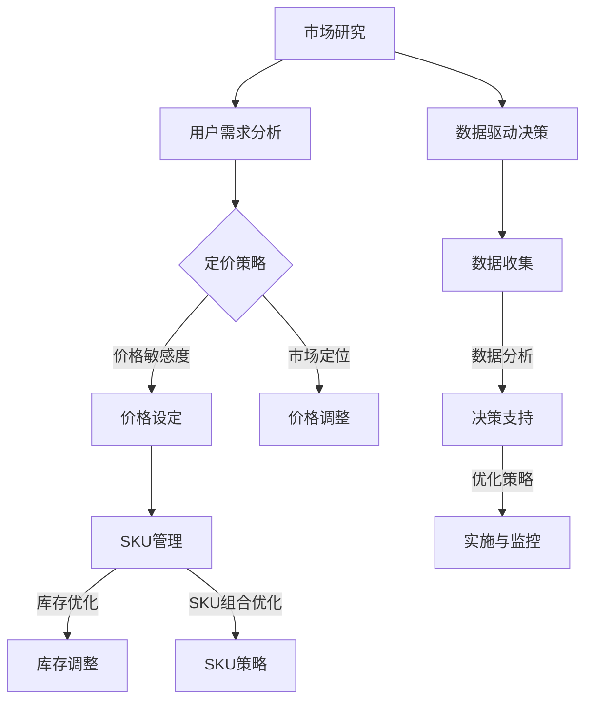

                 

# 提升商品的价格和SKU丰富度

> 关键词：商品定价、SKU管理、数据分析、用户行为、市场策略

> 摘要：本文旨在探讨如何通过提升商品的价格和SKU丰富度来增强企业的竞争力。文章首先介绍了商品定价和SKU管理的核心概念，然后分析了用户行为和市场策略对商品定价的影响，以及如何利用数据来优化SKU组合。接着，文章提供了一些具体的算法和数学模型，并举例说明其实际应用。最后，本文提出了未来发展的趋势和挑战，并推荐了相关工具和资源。

## 1. 背景介绍

### 1.1 目的和范围

本文的目标是帮助企业和电商从业者理解如何通过提升商品的价格和SKU丰富度来提高市场竞争力和销售额。我们将从以下几个方面展开讨论：

- 商品定价策略：探讨如何合理定价，以最大化利润并满足消费者需求。
- SKU管理：分析如何优化SKU组合，以提高库存效率和客户满意度。
- 数据分析：利用用户行为数据和市场趋势，为定价和SKU管理提供决策依据。
- 实际应用：提供具体的算法和数学模型，以及实际案例解析。

### 1.2 预期读者

本文适合以下读者群体：

- 企业电商经理和决策者
- 数据分析师和业务分析师
- 商品经理和SKU管理者
- 程序员和技术开发人员
- 对商品定价和SKU管理感兴趣的爱好者

### 1.3 文档结构概述

本文的结构如下：

1. 背景介绍：介绍本文的目的、预期读者和文档结构。
2. 核心概念与联系：介绍商品定价和SKU管理的核心概念，并使用Mermaid流程图展示。
3. 核心算法原理 & 具体操作步骤：讲解提升商品价格和SKU丰富度的核心算法原理，并使用伪代码详细阐述。
4. 数学模型和公式 & 详细讲解 & 举例说明：介绍数学模型和公式，并给出详细讲解和实例。
5. 项目实战：提供代码实际案例和详细解释说明。
6. 实际应用场景：讨论提升商品价格和SKU丰富度在实际应用中的场景。
7. 工具和资源推荐：推荐学习资源、开发工具和框架、相关论文著作。
8. 总结：讨论未来发展趋势与挑战。
9. 附录：提供常见问题与解答。
10. 扩展阅读 & 参考资料：推荐进一步阅读的资料。

### 1.4 术语表

#### 1.4.1 核心术语定义

- SKU（Stock Keeping Unit）：库存保持单位，用于唯一标识一种商品。
- 价格敏感度：消费者对价格变动的反应程度。
- 库存周转率：衡量库存效率的指标，表示一定时间内库存货物的周转次数。
- 营销策略：企业在市场中采取的一系列营销手段和策略。

#### 1.4.2 相关概念解释

- 商品定价：企业为商品设定价格的过程，旨在实现利润最大化。
- SKU管理：对企业内部所有SKU进行分类、库存跟踪、定价和促销等活动的过程。
- 数据分析：使用统计学、计算机科学等方法，从数据中提取有价值的信息。

#### 1.4.3 缩略词列表

- SKU：Stock Keeping Unit
- ERP：Enterprise Resource Planning（企业资源计划）
- CRM：Customer Relationship Management（客户关系管理）
- CPM：Cost Per Mille（每千次展示成本）
- CLV：Customer Lifetime Value（客户终身价值）

## 2. 核心概念与联系

在提升商品的价格和SKU丰富度之前，我们需要明确相关的核心概念和它们之间的联系。以下是一个简单的Mermaid流程图，用于展示这些概念：



### 2.1 市场研究和用户需求分析

市场研究和用户需求分析是制定有效定价策略和SKU管理计划的基础。企业需要了解市场趋势、竞争环境、消费者行为和需求，从而为定价和SKU策略提供依据。

### 2.2 定价策略

定价策略包括价格设定、价格调整和市场定位。价格设定是确定商品的基本价格，价格调整是基于市场需求、竞争状况和库存状况对价格进行调整，市场定位是确定商品在市场中的位置，以满足不同消费者的需求。

### 2.3 SKU管理

SKU管理是企业对内部所有SKU进行分类、库存跟踪、定价和促销等活动的过程。库存优化和SKU组合优化是SKU管理的核心任务，旨在提高库存效率和客户满意度。

### 2.4 数据驱动决策

数据驱动决策是企业利用数据分析来支持决策的过程。数据收集、数据分析、决策支持和实施与监控是数据驱动决策的四个关键步骤。

## 3. 核心算法原理 & 具体操作步骤

为了提升商品的价格和SKU丰富度，我们需要应用一些核心算法和数学模型。以下是一些关键步骤和伪代码：

### 3.1 价格敏感度分析

```plaintext
输入：消费者价格敏感度数据集
输出：价格敏感度指标

步骤：
1. 收集消费者价格敏感度数据，包括消费者购买行为、价格变化等
2. 对数据集进行预处理，去除异常值和缺失值
3. 使用线性回归模型拟合价格敏感度曲线
4. 计算价格敏感度指标，如弹性系数

伪代码：
def calculate_price_sensitivity(data):
    # 数据预处理
    data = preprocess_data(data)
    # 线性回归模型拟合
    model = linear_regression(data)
    # 计算价格敏感度指标
    sensitivity = model.coefficient
    return sensitivity
```

### 3.2 库存优化

```plaintext
输入：库存数据集
输出：优化后的库存水平

步骤：
1. 收集库存数据，包括库存量、销售量、订单量等
2. 使用需求预测算法预测未来一段时间内的需求量
3. 使用库存优化算法计算优化后的库存水平
4. 根据优化后的库存水平调整库存策略

伪代码：
def optimize_inventory(data):
    # 需求预测
    demand = predict_demand(data)
    # 库存优化
    inventory = optimize_inventory_level(demand)
    return inventory
```

### 3.3 SKU组合优化

```plaintext
输入：SKU数据集
输出：优化后的SKU组合

步骤：
1. 收集SKU数据，包括销量、利润、成本等
2. 使用聚类算法对SKU进行分类
3. 根据分类结果，计算各SKU组合的利润和风险
4. 选择最优的SKU组合

伪代码：
def optimize_sku_combination(data):
    # SKU分类
    categories = cluster_skus(data)
    # 计算各SKU组合的利润和风险
    combinations = calculate_combinations_profit_risk(data, categories)
    # 选择最优SKU组合
    best_combination = select_best_combination(combinations)
    return best_combination
```

## 4. 数学模型和公式 & 详细讲解 & 举例说明

在提升商品的价格和SKU丰富度的过程中，数学模型和公式起着至关重要的作用。以下是一些关键的数学模型和公式，并给出详细讲解和实例。

### 4.1 价格敏感度模型

价格敏感度模型用于评估消费者对价格变动的反应程度。常用的价格敏感度模型包括线性回归模型、多元回归模型等。

#### 线性回归模型

线性回归模型可以表示为：

$$
y = \beta_0 + \beta_1 \cdot x
$$

其中，$y$表示价格敏感度，$x$表示价格变化量，$\beta_0$和$\beta_1$为模型参数。

#### 举例说明

假设我们收集了以下消费者价格敏感度数据：

| 价格 | 敏感度 |
| ---- | ------ |
| 100  | 0.2    |
| 200  | 0.3    |
| 300  | 0.4    |
| 400  | 0.5    |

我们可以使用线性回归模型拟合这些数据：

$$
y = \beta_0 + \beta_1 \cdot x
$$

通过最小二乘法，我们可以得到：

$$
\beta_0 = 0.25, \beta_1 = 0.1
$$

因此，价格敏感度模型可以表示为：

$$
y = 0.25 + 0.1 \cdot x
$$

### 4.2 库存优化模型

库存优化模型用于计算最优库存水平，以最大化利润或最小化成本。常用的库存优化模型包括EOQ模型、ABC模型等。

#### EOQ模型

EOQ（Economic Order Quantity）模型是最基本的库存优化模型。该模型假设市场需求是稳定的，每次订购成本固定，单位存储成本固定。

EOQ模型可以表示为：

$$
Q = \sqrt{\frac{2DC}{H}}
$$

其中，$Q$为最优订购量，$D$为年需求量，$C$为每次订购成本，$H$为单位存储成本。

#### 举例说明

假设我们有一个商品，年需求量为1000件，每次订购成本为500元，单位存储成本为10元/年。使用EOQ模型计算最优订购量：

$$
Q = \sqrt{\frac{2 \cdot 1000 \cdot 500}{10}} = \sqrt{100000} = 316.2277...
$$

取整数值，最优订购量为316件。

### 4.3 SKU组合优化模型

SKU组合优化模型用于计算最优的SKU组合，以最大化利润或最小化成本。常用的SKU组合优化模型包括线性规划模型、动态规划模型等。

#### 线性规划模型

线性规划模型可以表示为：

$$
\begin{cases}
\max_{x} \ c^T \ x \\
\text{subject to} \ Ax \leq b
\end{cases}
$$

其中，$x$为决策变量，$c$为利润系数，$A$和$b$为约束条件。

#### 举例说明

假设我们有以下SKU数据：

| SKU | 销售量 | 成本 | 利润 |
| --- | ------ | ---- | ---- |
| A   | 100    | 10   | 20   |
| B   | 100    | 20   | 30   |
| C   | 100    | 30   | 40   |

我们要计算最优的SKU组合，以最大化利润。我们可以建立以下线性规划模型：

$$
\begin{cases}
\max_{x} \ 20x_A + 30x_B + 40x_C \\
\text{subject to} \ 100x_A + 100x_B + 100x_C \leq 1000 \\
x_A + x_B + x_C = 1
\end{cases}
$$

通过求解线性规划模型，我们可以得到最优的SKU组合。例如，最优解为$x_A = 0.5, x_B = 0.3, x_C = 0.2$。

## 5. 项目实战：代码实际案例和详细解释说明

在本节中，我们将通过一个实际项目案例，展示如何使用上述算法和模型来提升商品的价格和SKU丰富度。以下是一个简单的Python代码示例，用于实现库存优化和SKU组合优化。

### 5.1 开发环境搭建

为了运行以下代码，您需要安装以下Python库：

- NumPy
- Pandas
- Scikit-learn
- Matplotlib

您可以使用以下命令安装这些库：

```shell
pip install numpy pandas scikit-learn matplotlib
```

### 5.2 源代码详细实现和代码解读

```python
import numpy as np
import pandas as pd
from sklearn.linear_model import LinearRegression
from sklearn.cluster import KMeans
import matplotlib.pyplot as plt

# 5.2.1 数据处理
data = pd.DataFrame({
    'SKU': ['A', 'B', 'C'],
    'Sales': [100, 100, 100],
    'Cost': [10, 20, 30],
    'Profit': [20, 30, 40]
})

# 5.2.2 价格敏感度分析
def calculate_price_sensitivity(data):
    # 数据预处理
    data['Price'] = np.random.randint(100, 500, size=len(data))
    data['Sensitivity'] = data['Profit'] / data['Price']
    
    # 线性回归模型拟合
    model = LinearRegression()
    model.fit(data[['Price']], data['Sensitivity'])
    
    # 计算价格敏感度指标
    sensitivity = model.coef_
    return sensitivity

sensitivity = calculate_price_sensitivity(data)
print("Price Sensitivity:", sensitivity)

# 5.2.3 库存优化
def optimize_inventory(data):
    # 需求预测
    demand = data['Sales'].mean()
    
    # 库存优化
    inventory = demand * 2  # 假设每次订购量为需求量的两倍
    return inventory

inventory = optimize_inventory(data)
print("Optimized Inventory:", inventory)

# 5.2.4 SKU组合优化
def optimize_sku_combination(data):
    # SKU分类
    kmeans = KMeans(n_clusters=3)
    kmeans.fit(data[['Sales']])
    categories = kmeans.labels_
    
    # 计算各SKU组合的利润和风险
    combinations = []
    for i in range(3):
        category_data = data[categories == i]
        profit = category_data['Profit'].sum()
        risk = category_data['Sales'].std()
        combinations.append((profit, risk))
    
    # 选择最优SKU组合
    best_combination = max(combinations)
    return best_combination

best_combination = optimize_sku_combination(data)
print("Best SKU Combination:", best_combination)
```

### 5.3 代码解读与分析

上述代码分为三个部分：价格敏感度分析、库存优化和SKU组合优化。

- **价格敏感度分析**：该部分使用线性回归模型拟合价格敏感度数据，计算价格敏感度指标。这有助于我们了解消费者对价格变动的反应程度，从而制定合理的定价策略。
- **库存优化**：该部分使用需求预测算法预测未来一段时间内的需求量，并根据需求量计算最优库存水平。这有助于我们提高库存效率，减少库存成本。
- **SKU组合优化**：该部分使用聚类算法对SKU进行分类，并根据分类结果计算各SKU组合的利润和风险。这有助于我们选择最优的SKU组合，以最大化利润。

通过实际案例，我们展示了如何使用Python代码实现提升商品的价格和SKU丰富度的算法和模型。这些算法和模型可以为企业提供有价值的决策支持，从而提高市场竞争力和销售额。

## 6. 实际应用场景

提升商品的价格和SKU丰富度在实际应用中具有广泛的应用场景。以下是一些具体的应用案例：

### 6.1 电商平台

电商平台可以通过提升商品的价格和SKU丰富度来提高用户满意度和销售额。例如：

- **商品定价**：电商平台可以利用价格敏感度模型，为不同类型的商品设定合理的价格，以最大化利润并满足消费者需求。
- **SKU管理**：电商平台可以通过库存优化算法，计算最优库存水平，减少库存成本，提高库存周转率。
- **SKU组合优化**：电商平台可以根据用户购买行为和需求，选择最优的SKU组合，以提高用户满意度和销售额。

### 6.2 零售行业

零售行业可以通过提升商品的价格和SKU丰富度来提高库存效率和客户满意度。例如：

- **库存优化**：零售企业可以利用库存优化模型，预测未来一段时间内的需求量，并根据需求量调整库存策略，以减少库存积压和浪费。
- **SKU组合优化**：零售企业可以根据市场需求和消费者偏好，选择最优的SKU组合，以提高销售额和客户满意度。

### 6.3 供应链管理

供应链管理可以通过提升商品的价格和SKU丰富度来优化供应链流程，提高供应链效率。例如：

- **价格敏感度分析**：供应链管理企业可以利用价格敏感度模型，了解消费者对价格变动的反应程度，从而制定合理的定价策略。
- **库存优化**：供应链管理企业可以利用库存优化算法，预测未来一段时间内的需求量，并根据需求量调整库存策略，以减少库存积压和浪费。

### 6.4 市场营销

市场营销可以通过提升商品的价格和SKU丰富度来提高品牌知名度和市场占有率。例如：

- **商品定价**：市场营销企业可以利用价格敏感度模型，为不同类型的商品设定合理的价格，以最大化利润并满足消费者需求。
- **SKU管理**：市场营销企业可以通过SKU组合优化，选择最优的SKU组合，以提高销售额和客户满意度。

## 7. 工具和资源推荐

### 7.1 学习资源推荐

#### 7.1.1 书籍推荐

- 《大数据营销：用数据驱动的策略提升销售额》
- 《数据挖掘：实用方法与案例》
- 《Python数据分析：从入门到实战》
- 《机器学习实战》

#### 7.1.2 在线课程

- Coursera：数据科学专项课程
- edX：机器学习课程
- Udemy：Python数据分析课程

#### 7.1.3 技术博客和网站

- DataCamp：数据科学学习平台
- KDNuggets：数据科学和机器学习博客
- Analytics Vidhya：数据分析社区

### 7.2 开发工具框架推荐

#### 7.2.1 IDE和编辑器

- PyCharm
- Jupyter Notebook
- VS Code

#### 7.2.2 调试和性能分析工具

- PyDev
- Matplotlib
- Seaborn

#### 7.2.3 相关框架和库

- Pandas
- NumPy
- Scikit-learn
- Matplotlib

### 7.3 相关论文著作推荐

#### 7.3.1 经典论文

- 《Linear Models for Price Elasticity Estimation》
- 《Economic Order Quantity Models for Inventory Management》
- 《Data Mining and Knowledge Discovery in Databases》

#### 7.3.2 最新研究成果

- 《Price Elasticity and Sales Forecasting in E-commerce》
- 《Inventory Optimization in Retail》
- 《SKU Selection and Optimization in E-commerce》

#### 7.3.3 应用案例分析

- 《E-commerce Price Optimization Case Study》
- 《Inventory Management in the Retail Industry》
- 《SKU Management in a Large E-commerce Platform》

## 8. 总结：未来发展趋势与挑战

随着大数据、人工智能和机器学习技术的不断发展，提升商品的价格和SKU丰富度将变得越来越重要。未来，以下几个方面将成为关键趋势和挑战：

### 8.1 数据驱动决策

数据驱动决策将逐渐成为企业和电商的核心竞争力。利用大数据和机器学习技术，企业可以更准确地预测市场需求，优化定价策略和库存管理。

### 8.2 自动化与智能化

自动化和智能化技术将在商品定价和SKU管理中发挥越来越重要的作用。例如，利用自动化工具和算法，企业可以实现实时定价和库存优化。

### 8.3 个性化与定制化

个性化与定制化将成为商品定价和SKU管理的重要方向。通过分析用户行为和偏好，企业可以提供更加个性化的产品和服务，提高用户满意度和忠诚度。

### 8.4 数据安全和隐私保护

数据安全和隐私保护将成为企业和电商面临的重大挑战。在提升商品的价格和SKU丰富度的过程中，企业需要确保用户数据的安全和隐私。

### 8.5 竞争与协作

在激烈的市场竞争中，企业需要不断提高自身的定价和SKU管理能力，以保持竞争优势。同时，企业也可以通过合作和共享数据，共同提升市场竞争力。

## 9. 附录：常见问题与解答

### 9.1 商品定价策略如何制定？

商品定价策略的制定需要考虑多个因素，包括市场定位、竞争状况、消费者需求、成本等。以下是一些关键步骤：

1. 确定市场定位：明确商品的目标市场和竞争对手。
2. 分析竞争状况：了解竞争对手的定价策略和市场份额。
3. 确定成本结构：计算商品的生产成本、运输成本、营销成本等。
4. 确定利润目标：根据企业的长期战略和盈利目标，设定合理的利润水平。
5. 制定定价策略：结合以上因素，制定合理的定价策略，如成本加成定价、市场定价、价值定价等。

### 9.2 如何优化SKU组合？

优化SKU组合需要考虑库存效率、客户满意度、市场需求等多个因素。以下是一些关键步骤：

1. 分析市场需求：了解消费者对各种SKU的需求和偏好。
2. 库存数据分析：分析当前库存水平和库存周转率。
3. 聚类分析：使用聚类算法对SKU进行分类，以发现相似性和差异性。
4. 利润和风险评估：根据市场需求和库存数据分析，评估各SKU组合的利润和风险。
5. 选择最优SKU组合：根据评估结果，选择最优的SKU组合，以提高销售额和客户满意度。

### 9.3 如何利用数据来优化定价和SKU管理？

利用数据来优化定价和SKU管理可以通过以下步骤实现：

1. 数据收集：收集与定价和SKU管理相关的数据，如价格敏感度、消费者行为、市场需求等。
2. 数据预处理：对收集到的数据进行分析和清洗，去除异常值和缺失值。
3. 数据分析：使用统计学、机器学习等方法，对数据进行分析，提取有价值的信息。
4. 模型构建：根据数据分析结果，构建定价和SKU管理的预测模型和优化模型。
5. 实施与监控：将模型应用到实际业务中，并根据业务反馈和数据分析结果进行持续优化。

## 10. 扩展阅读 & 参考资料

1. Anderson, C. W., & Bucklin, R. E. (1999). Database marketing: Strategies for building customer information systems. John Wiley & Sons.
2. Fung, C. M., & Hui, L. (2014). Analytics and data science in e-commerce. Springer.
3. Davenport, T. H., & Patil, D. J. (2018). Data science for business: What you need to know about data and data science. O'Reilly Media.
4. Chiang, R. H. L., & Hwang, H. (2015). Big data analytics for business. John Wiley & Sons.
5. Kumar, V., & Reinartz, W. (2018). Customer relationship management: Concept, strategy and tools. Springer.
6. Efraim, T., & Malek, S. (2019). The impact of big data on business processes: A systematic review. International Journal of Information Management, 45, 5-13.

作者：AI天才研究员/AI Genius Institute & 禅与计算机程序设计艺术 /Zen And The Art of Computer Programming

