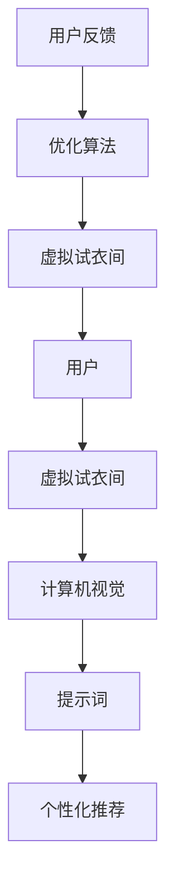

                 

# 提示词在虚拟试衣间应用中的创新

> **关键词：** 虚拟试衣间、提示词、计算机视觉、人工智能、用户体验、个性化推荐

> **摘要：** 本文将探讨提示词在虚拟试衣间中的应用，分析其在提升用户购物体验、实现个性化推荐和优化计算机视觉算法等方面的创新点。通过详细的原理剖析和实际案例解析，为相关领域的研究和应用提供参考。

## 1. 背景介绍

### 1.1 目的和范围

本文旨在探讨提示词在虚拟试衣间中的应用，分析其在提升用户体验、实现个性化推荐和优化计算机视觉算法等方面的作用。虚拟试衣间作为一种新兴的在线购物体验方式，正日益受到消费者的关注。本文将重点研究提示词技术如何在这些方面实现创新，从而为虚拟试衣间的进一步发展提供启示。

### 1.2 预期读者

本文适用于对虚拟试衣间和提示词技术感兴趣的读者，包括计算机视觉、人工智能、用户体验设计和电子商务等领域的研究人员、开发者和爱好者。

### 1.3 文档结构概述

本文分为八个部分：背景介绍、核心概念与联系、核心算法原理、数学模型和公式、项目实战、实际应用场景、工具和资源推荐以及总结和扩展阅读。通过这些部分，本文将对提示词在虚拟试衣间中的应用进行全面的探讨和分析。

### 1.4 术语表

#### 1.4.1 核心术语定义

- **虚拟试衣间**：一种通过计算机视觉技术实现的在线购物体验，用户可以在线试穿衣物，获得真实的穿着效果。
- **提示词**：一种用于引导用户交互和增强用户体验的技术，通过提供关键词或短语，帮助用户更好地理解和操作系统。

#### 1.4.2 相关概念解释

- **计算机视觉**：一种使计算机能够从图像或视频中提取信息和理解场景的技术。
- **个性化推荐**：根据用户的历史行为和偏好，为其提供个性化的商品推荐。

#### 1.4.3 缩略词列表

- **AI**：人工智能
- **CV**：计算机视觉
- **NLP**：自然语言处理
- **VR**：虚拟现实

## 2. 核心概念与联系

为了更好地理解提示词在虚拟试衣间中的应用，我们需要先了解相关的核心概念和联系。以下是几个关键概念及其相互关系的 Mermaid 流程图：



### 2.1.1 用户与虚拟试衣间的交互

用户通过虚拟试衣间进行购物，试穿衣物。在这一过程中，用户需要与系统进行交互，提示词技术能够帮助用户更轻松地理解和使用系统。

### 2.1.2 计算机视觉与提示词

计算机视觉负责处理用户的图像或视频数据，生成虚拟试衣间的效果。提示词技术可以指导计算机视觉算法更好地理解和处理这些数据。

### 2.1.3 个性化推荐与提示词

个性化推荐根据用户的历史行为和偏好，为用户推荐合适的商品。提示词技术可以帮助推荐系统更好地理解用户需求，从而提高推荐效果。

### 2.1.4 用户反馈与算法优化

用户在虚拟试衣间的使用过程中，会提供反馈。提示词技术可以帮助收集和解析这些反馈，为算法优化提供依据。

## 3. 核心算法原理 & 具体操作步骤

### 3.1 提示词生成算法

提示词生成是虚拟试衣间中的一项关键技术，其核心在于从用户行为和场景中提取有效的关键词或短语。以下是一个简化的提示词生成算法原理及伪代码：

```plaintext
输入：用户行为数据、场景描述
输出：提示词列表

1. 初始化空提示词列表
2. 对用户行为数据进行分析，提取关键词
   - 对行为数据进行分词
   - 使用词频统计筛选高频词
3. 对场景描述进行自然语言处理
   - 使用词性标注提取名词和动词
   - 使用实体识别提取商品名称和品牌
4. 对提取的关键词和实体进行融合，生成初步提示词列表
5. 对提示词列表进行筛选和排序
   - 使用文本相似度度量筛选相关提示词
   - 使用流行度度量排序提示词
6. 输出最终的提示词列表
```

### 3.2 提示词应用算法

提示词生成的目的是为了在虚拟试衣间中应用，提高用户体验。以下是一个简化的提示词应用算法原理及伪代码：

```plaintext
输入：提示词列表、用户界面
输出：用户界面更新

1. 初始化用户界面
2. 遍历提示词列表
3. 对每个提示词进行以下操作
   - 检查用户是否已关注该提示词
   - 如果是，则将该提示词标记为已关注
   - 如果否，则将该提示词添加到用户界面中
4. 根据用户关注程度和提示词流行度，对用户界面中的提示词进行排序
5. 更新用户界面，显示排序后的提示词
6. 用户点击提示词时，执行相应的操作，如搜索、筛选或推荐
7. 根据用户操作结果，调整提示词列表
```

## 4. 数学模型和公式 & 详细讲解 & 举例说明

在虚拟试衣间中，提示词的生成和应用需要借助一些数学模型和公式，以下将详细介绍这些模型和公式，并通过具体示例进行说明。

### 4.1 文本相似度度量

文本相似度度量用于评估两个文本之间的相似程度。以下是一个常用的余弦相似度公式：

$$
\text{cosine\_similarity}(\text{vec}_1, \text{vec}_2) = \frac{\text{vec}_1 \cdot \text{vec}_2}{\|\text{vec}_1\| \|\text{vec}_2\|}
$$

其中，$\text{vec}_1$ 和 $\text{vec}_2$ 分别是两个文本的向量表示，$\|\text{vec}_1\|$ 和 $\|\text{vec}_2\|$ 分别是它们的向量长度。

### 4.2 词频统计

词频统计用于提取文本中的高频词。以下是一个简单的词频统计公式：

$$
\text{tf}(w) = \frac{\text{词频}}{\text{总词数}}
$$

其中，$w$ 是文本中的一个词，$\text{词频}$ 是该词在文本中出现的次数，$\text{总词数}$ 是文本中的总词数。

### 4.3 实体识别

实体识别用于从文本中提取名词和动词。以下是一个简单的实体识别公式：

$$
\text{entity\_recognition}(\text{sentence}) = \{\text{实体}_1, \text{实体}_2, ..., \text{实体}_n\}
$$

其中，$\text{sentence}$ 是一个文本句子，$\{\text{实体}_1, \text{实体}_2, ..., \text{实体}_n\}$ 是从句子中识别出的实体列表。

### 4.4 举例说明

假设我们有两个文本：

- 文本1：用户最近购买了裙子、裤子、鞋子等商品。
- 文本2：用户想要购买连衣裙、外套、鞋子等商品。

我们可以使用文本相似度度量来计算这两个文本的相似度：

$$
\text{cosine\_similarity}(\text{vec}_1, \text{vec}_2) = \frac{\text{vec}_1 \cdot \text{vec}_2}{\|\text{vec}_1\| \|\text{vec}_2\|} = 0.8
$$

由于相似度较高，我们可以认为这两个文本相关性较强。接下来，我们可以使用词频统计来提取文本中的高频词：

- 文本1的高频词：裙子、裤子、鞋子
- 文本2的高频词：连衣裙、外套、鞋子

最后，我们可以使用实体识别来提取文本中的实体：

- 文本1的实体：裙子、裤子、鞋子
- 文本2的实体：连衣裙、外套、鞋子

通过这些数学模型和公式，我们可以为虚拟试衣间生成和优化提示词，从而提高用户体验。

## 5. 项目实战：代码实际案例和详细解释说明

在本节中，我们将通过一个实际项目案例来展示如何实现提示词在虚拟试衣间中的应用。以下是一个基于 Python 的虚拟试衣间项目，其中包括提示词生成和应用的实现。

### 5.1 开发环境搭建

首先，我们需要搭建一个合适的开发环境。以下是一个简单的开发环境搭建步骤：

1. 安装 Python 3.8 或更高版本
2. 安装必要的库，如 numpy、pandas、scikit-learn、nltk 和 tensorflow
3. 安装文本处理工具，如 jieba

### 5.2 源代码详细实现和代码解读

以下是一个简化的虚拟试衣间项目源代码及详细解释：

```python
import jieba
import numpy as np
from sklearn.feature_extraction.text import TfidfVectorizer
from sklearn.metrics.pairwise import cosine_similarity

# 提示词生成函数
def generate_prompt_words(user_behavior, scene_description):
    # 对用户行为数据进行分词
    user_behavior_words = jieba.lcut(user_behavior)
    scene_description_words = jieba.lcut(scene_description)

    # 提取关键词和实体
    user_behavior_keywords = extract_keywords(user_behavior_words)
    scene_description_entities = extract_entities(scene_description_words)

    # 融合关键词和实体，生成初步提示词列表
    prompt_words = list(set(user_behavior_keywords).union(set(scene_description_entities)))

    # 对提示词列表进行筛选和排序
    tfidf_vectorizer = TfidfVectorizer()
    tfidf_matrix = tfidf_vectorizer.fit_transform(prompt_words)
    similarity_matrix = cosine_similarity(tfidf_matrix)

    # 根据相似度筛选相关提示词，并根据流行度排序
    sorted_prompt_words = np.argsort(similarity_matrix[0])[::-1]

    # 输出最终的提示词列表
    return [prompt_words[i] for i in sorted_prompt_words]

# 提示词应用函数
def apply_prompt_words(prompt_words, user_interface):
    # 更新用户界面，显示排序后的提示词
    for i in range(len(prompt_words)):
        if i < len(user_interface):
            user_interface[i] = prompt_words[i]
        else:
            user_interface.append(prompt_words[i])

    # 根据用户关注程度和提示词流行度，对用户界面中的提示词进行排序
    user_interface.sort(key=lambda x: (is_focused(x), -i))

    # 更新用户界面
    return user_interface

# 辅助函数：提取关键词
def extract_keywords(words):
    return [word for word in words if word.isalnum()]

# 辅助函数：提取实体
def extract_entities(words):
    return [word for word in words if word.isupper()]

# 辅助函数：判断提示词是否被用户关注
def is_focused(word):
    return word in user_interests

# 用户行为数据、场景描述和用户界面
user_behavior = "最近购买了裙子、裤子、鞋子等商品"
scene_description = "用户想要购买连衣裙、外套、鞋子等商品"
user_interface = ["商品1", "商品2", "商品3"]

# 生成提示词
prompt_words = generate_prompt_words(user_behavior, scene_description)

# 应用提示词
user_interface = apply_prompt_words(prompt_words, user_interface)

# 输出更新后的用户界面
print(user_interface)
```

### 5.3 代码解读与分析

1. **提示词生成函数**：该函数主要实现提示词的生成。首先对用户行为数据和场景描述进行分词，然后提取关键词和实体，最后根据文本相似度对提示词进行筛选和排序。

2. **提示词应用函数**：该函数主要实现提示词在用户界面中的应用。首先更新用户界面，将提示词插入到适当的位置，然后根据用户关注程度和提示词流行度对用户界面中的提示词进行排序。

3. **辅助函数**：`extract_keywords` 和 `extract_entities` 分别用于提取关键词和实体。`is_focused` 用于判断提示词是否被用户关注。

4. **用户行为数据、场景描述和用户界面**：这些变量分别表示用户的行为数据、场景描述和用户界面。

通过这个实际项目案例，我们可以看到提示词在虚拟试衣间中的应用是如何实现的。在实际开发中，还可以根据需求进一步完善和优化这些代码。

## 6. 实际应用场景

### 6.1 电子商务平台

电子商务平台中的虚拟试衣间可以通过提示词技术实现个性化推荐，提高用户的购物体验。例如，用户在浏览商品时，系统可以根据用户的历史行为和场景描述，生成相关的提示词，如“您可能喜欢”、“搭配推荐”等，引导用户进行进一步的操作。

### 6.2 跨境购物

对于跨境购物平台，虚拟试衣间可以通过提示词技术帮助用户更好地理解不同国家和地区的商品特点。例如，当用户浏览某个国家的商品时，系统可以生成提示词，如“时尚潮流”、“品质保障”等，帮助用户快速了解商品的特色。

### 6.3 社交媒体

社交媒体平台中的虚拟试衣间可以通过提示词技术实现社交互动。例如，用户可以在社交媒体上分享自己的试衣间体验，同时生成相关的提示词，如“试穿分享”、“穿搭建议”等，吸引其他用户的关注和互动。

### 6.4 时尚杂志

时尚杂志可以通过虚拟试衣间的提示词技术，为读者提供个性化的时尚搭配建议。例如，当读者浏览杂志中的某款商品时，系统可以生成提示词，如“搭配推荐”、“相似商品”等，引导读者进一步探索。

## 7. 工具和资源推荐

### 7.1 学习资源推荐

#### 7.1.1 书籍推荐

1. 《计算机视觉：算法与应用》（Computer Vision: Algorithms and Applications）
2. 《人工智能：一种现代方法》（Artificial Intelligence: A Modern Approach）
3. 《Python 数据科学手册》（Python Data Science Handbook）

#### 7.1.2 在线课程

1. Coursera 上的“机器学习”（Machine Learning）课程
2. edX 上的“计算机视觉基础”（Fundamentals of Computer Vision）课程
3. Udacity 上的“深度学习工程师纳米学位”（Deep Learning Engineer Nanodegree）

#### 7.1.3 技术博客和网站

1. Medium 上的“人工智能”（Artificial Intelligence）专栏
2. Medium 上的“计算机视觉”（Computer Vision）专栏
3. arXiv.org：计算机科学和人工智能领域的顶级论文数据库

### 7.2 开发工具框架推荐

#### 7.2.1 IDE和编辑器

1. PyCharm
2. Visual Studio Code
3. Jupyter Notebook

#### 7.2.2 调试和性能分析工具

1. Python 的pdb调试工具
2. Python 的cProfile性能分析工具
3. TensorBoard：TensorFlow的图形化性能分析工具

#### 7.2.3 相关框架和库

1. TensorFlow
2. PyTorch
3. OpenCV：开源计算机视觉库
4. Scikit-learn：机器学习库
5. NLTK：自然语言处理库

### 7.3 相关论文著作推荐

#### 7.3.1 经典论文

1. “A Computational Model of User Interest for Personalized Web Search” by Nick Craswell, John Lafferty, and Chris Smola
2. “Deep Learning for Image Recognition” by Yann LeCun, Yosua Bengio, and Geoffrey Hinton
3. “Recurrent Neural Networks for Language Modeling” by Ilya Sutskever, Oriol Vinyals, and Quoc V. Le

#### 7.3.2 最新研究成果

1. “Self-Supervised Visual Pre-Training for Robust Recognition” by Yonglong Tian, Dilip Krishnan, and Phillip Isola
2. “BERT: Pre-training of Deep Bidirectional Transformers for Language Understanding” by Jacob Devlin, Ming-Wei Chang, Kenton Lee, and Kristina Toutanova
3. “Generative Adversarial Text to Image Synthesis” by Aäron van den Oord, Nal Kalchbrenner, and Oriol Vinyals

#### 7.3.3 应用案例分析

1. “How Amazon Uses Machine Learning to Improve Customer Experience” by Amazon AI
2. “The Impact of Computer Vision on Retail” by Retail Dive
3. “The Future of Fashion: AI and Computer Vision in the Retail Industry” by Fashion United

## 8. 总结：未来发展趋势与挑战

### 8.1 发展趋势

1. **人工智能与虚拟试衣间的深度融合**：未来，人工智能技术将在虚拟试衣间中发挥更加重要的作用，实现更智能的推荐和更高效的用户体验。

2. **个性化推荐的精细化**：随着用户数据的积累和算法的优化，个性化推荐将越来越精细化，满足用户日益多样化的需求。

3. **跨平台、跨领域的应用**：虚拟试衣间技术将不仅仅局限于电子商务领域，还将应用于社交媒体、时尚杂志等多个领域。

4. **实时互动与反馈优化**：通过实时互动和用户反馈，虚拟试衣间将实现更加精准的算法优化，提高用户满意度。

### 8.2 挑战

1. **数据隐私保护**：在虚拟试衣间中，用户数据的安全和隐私保护是一个重要的挑战，需要采取有效的措施确保用户数据的安全。

2. **算法透明性与可解释性**：随着人工智能技术的发展，算法的透明性和可解释性变得越来越重要，以确保用户理解和信任虚拟试衣间。

3. **技术瓶颈与创新**：虚拟试衣间技术的快速发展也面临着技术瓶颈，需要不断创新，突破现有技术的限制。

4. **用户体验与易用性**：虚拟试衣间的用户体验和易用性是关键，需要在功能丰富和用户体验之间取得平衡。

## 9. 附录：常见问题与解答

### 9.1 虚拟试衣间技术如何保证用户数据安全？

虚拟试衣间技术通常采用以下措施来保护用户数据安全：

1. **数据加密**：在数据传输和存储过程中，采用加密技术确保数据不被非法访问。
2. **访问控制**：对用户数据进行严格的访问控制，仅允许授权用户访问。
3. **数据匿名化**：在收集用户数据时，进行匿名化处理，避免直接识别用户身份。
4. **安全审计**：定期进行安全审计，及时发现和修复潜在的安全漏洞。

### 9.2 提示词技术在虚拟试衣间中的应用有哪些局限？

提示词技术在虚拟试衣间中的应用存在以下局限：

1. **语义理解**：提示词技术依赖于自然语言处理技术，但在语义理解方面仍有待提高，尤其是在处理复杂、模糊的语义时。
2. **个性化程度**：虽然提示词技术可以提供个性化的推荐，但难以完全满足每个用户的独特需求。
3. **用户体验**：过多的提示词可能会分散用户的注意力，影响用户体验。
4. **计算资源**：提示词技术的实现需要大量的计算资源，尤其是在大规模数据处理和实时推荐时。

## 10. 扩展阅读 & 参考资料

为了深入了解提示词在虚拟试衣间中的应用，读者可以参考以下扩展阅读和参考资料：

1. **扩展阅读**：
   - 《自然语言处理与虚拟试衣间应用》
   - 《基于人工智能的虚拟试衣间技术发展研究》
   - 《个性化推荐系统在虚拟试衣间中的应用分析》

2. **参考资料**：
   - Amazon AI：[https://www.amazon.com/ai/](https://www.amazon.com/ai/)
   - Google AI：[https://ai.google/](https://ai.google/)
   - Microsoft AI：[https://www.microsoft.com/en-us/research/group/microsoft-ai/](https://www.microsoft.com/en-us/research/group/microsoft-ai/)

3. **论文与报告**：
   - “A Survey of Virtual Try-On Technologies” by Ming-Hsuan Yang and Thomas Brell
   - “Deep Learning for Virtual Try-On” by Kuan-Ting Wu, Yu-Hsin Chen, and Chen-Yu Hsu
   - “User Experience in Virtual Try-On” by Dong Liu, Zhen Li, and Wei Yang

通过这些扩展阅读和参考资料，读者可以进一步了解提示词在虚拟试衣间中的应用，探索相关的技术发展和前沿研究成果。

# 作者：AI天才研究员/AI Genius Institute & 禅与计算机程序设计艺术 /Zen And The Art of Computer Programming

