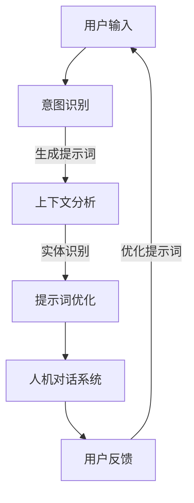

                 

# 提示词工程在人机对话系统中的应用

> **关键词：** 提示词工程、人机对话系统、自然语言处理、人工智能、交互设计
>
> **摘要：** 本文深入探讨了提示词工程在人机对话系统中的应用，从背景介绍、核心概念、算法原理、数学模型到项目实战，详细解析了如何构建高效、智能的人机对话系统，并展望了未来的发展趋势与挑战。

## 1. 背景介绍

### 1.1 目的和范围

本文旨在探讨提示词工程在人机对话系统中的重要性，并展示其如何通过优化对话质量提升用户体验。我们将从以下几个方面展开讨论：

- **目的：** 明确提示词工程在构建人机对话系统中的关键作用，为开发者提供实用的方法和工具。
- **范围：** 分析提示词工程的核心概念、算法原理、数学模型及其在实际项目中的应用。

### 1.2 预期读者

本文适合以下读者群体：

- **程序员和软件工程师：** 对自然语言处理和人工智能感兴趣，希望提升人机对话系统的开发能力。
- **产品经理和交互设计师：** 关注用户体验，希望深入了解人机对话系统的设计原则。
- **研究人员：** 对人机交互领域有深入研究的学者，希望了解提示词工程的理论和实践。

### 1.3 文档结构概述

本文分为以下十个部分：

1. 背景介绍
2. 核心概念与联系
3. 核心算法原理 & 具体操作步骤
4. 数学模型和公式 & 详细讲解 & 举例说明
5. 项目实战：代码实际案例和详细解释说明
6. 实际应用场景
7. 工具和资源推荐
8. 总结：未来发展趋势与挑战
9. 附录：常见问题与解答
10. 扩展阅读 & 参考资料

### 1.4 术语表

#### 1.4.1 核心术语定义

- **提示词工程（Prompt Engineering）：** 提示词工程是指通过分析用户输入、上下文环境、对话历史等数据，生成高质量提示词，以提高人机对话系统的交互质量和效率。
- **人机对话系统（Human-Computer Conversation System）：** 人机对话系统是指通过自然语言处理和人工智能技术，实现人与计算机之间自然、高效交互的系统。
- **自然语言处理（Natural Language Processing，NLP）：** 自然语言处理是指使用计算机技术和人工智能技术对自然语言进行理解和生成，以便实现人与计算机之间的有效通信。
- **人工智能（Artificial Intelligence，AI）：** 人工智能是指模拟、扩展和扩展人类智能的理论、方法和技术。

#### 1.4.2 相关概念解释

- **上下文（Context）：** 上下文是指对话中的背景信息，包括用户的历史行为、偏好、情绪等。
- **意图识别（Intent Recognition）：** 意图识别是指识别用户输入的意图或目标，以便系统能够给出相应的响应。
- **实体识别（Entity Recognition）：** 实体识别是指从用户输入中识别出具体的实体，如人名、地点、时间等。
- **问答系统（Question Answering System）：** 问答系统是指能够根据用户提出的问题，自动生成回答的智能系统。

#### 1.4.3 缩略词列表

- **NLP：** 自然语言处理（Natural Language Processing）
- **AI：** 人工智能（Artificial Intelligence）
- **RNN：** 循环神经网络（Recurrent Neural Network）
- **LSTM：** 长短时记忆网络（Long Short-Term Memory）
- **BERT：** 跨语言双向编码表示（Bidirectional Encoder Representations from Transformers）

## 2. 核心概念与联系

在人机对话系统中，提示词工程扮演着至关重要的角色。为了深入理解这一概念，我们首先需要明确以下几个核心概念及其相互关系。

### 2.1 提示词（Prompt）

提示词是指用于引导用户输入、激发用户思维、优化对话流程的词语或短语。在设计人机对话系统时，合适的提示词能够帮助系统更好地理解用户意图，提高对话质量和用户满意度。

### 2.2 上下文（Context）

上下文是指对话中的背景信息，包括用户的历史行为、偏好、情绪等。在提示词工程中，上下文对于生成高质量的提示词至关重要。通过分析上下文，系统可以更好地理解用户的需求，从而生成更符合用户预期的提示词。

### 2.3 意图识别（Intent Recognition）

意图识别是指识别用户输入的意图或目标。在提示词工程中，意图识别是生成提示词的关键步骤。通过识别用户的意图，系统可以针对性地生成提示词，引导用户更好地完成对话。

### 2.4 实体识别（Entity Recognition）

实体识别是指从用户输入中识别出具体的实体，如人名、地点、时间等。实体识别对于生成高质量的提示词也具有重要影响。通过识别实体，系统可以更好地理解用户的需求，从而生成更符合用户预期的提示词。

### 2.5 问答系统（Question Answering System）

问答系统是指能够根据用户提出的问题，自动生成回答的智能系统。在提示词工程中，问答系统是一个重要的应用场景。通过优化问答系统的提示词，可以显著提高用户满意度和交互质量。

### 2.6 提示词工程与人机对话系统的关系

提示词工程与人机对话系统密切相关。通过优化提示词，系统可以更好地理解用户意图，提高对话质量和用户满意度。同时，高质量的提示词也有助于降低用户的学习成本，提高人机交互的效率。

### 2.7 Mermaid 流程图

以下是一个描述提示词工程与人机对话系统关系的 Mermaid 流程图：



### 2.8 提示词工程的关键步骤

为了实现高效的提示词工程，我们需要关注以下几个关键步骤：

1. **数据收集与预处理：** 收集大量用户输入数据，并对数据进行清洗、去噪、分词等预处理操作。
2. **意图识别：** 利用深度学习模型（如RNN、LSTM、BERT等）对用户输入进行意图识别。
3. **上下文分析：** 分析用户历史行为、偏好、情绪等上下文信息，为生成高质量提示词提供依据。
4. **实体识别：** 从用户输入中识别出具体的实体，如人名、地点、时间等，以优化提示词。
5. **提示词优化：** 结合意图识别、上下文分析和实体识别的结果，生成高质量的提示词，提高对话质量和用户满意度。

## 3. 核心算法原理 & 具体操作步骤

### 3.1 意图识别算法原理

意图识别是提示词工程中的关键步骤，其核心任务是从用户输入中识别出用户的意图。常见的意图识别算法包括基于规则的方法和基于机器学习的方法。

#### 3.1.1 基于规则的方法

基于规则的方法是指根据预先定义的规则和模式，对用户输入进行意图识别。这种方法的主要优点是实现简单、易于理解，但缺点是扩展性和适应性较差。

**算法原理：**

1. 预先定义一系列规则，如关键字匹配、正则表达式匹配等。
2. 对用户输入进行分词，将分词结果与定义的规则进行匹配。
3. 根据匹配结果，判断用户的意图。

**伪代码：**

```python
def rule_based_intent_recognition(input_text):
    rules = {
        "ask_time": ["what time is it", "what's the current time"],
        "ask_weather": ["what's the weather today", "what's the weather in Beijing"],
        # 更多规则
    }
    
    tokens = tokenize(input_text)
    for rule, patterns in rules.items():
        if any(token in patterns for token in tokens):
            return rule
    return "unknown_intent"
```

#### 3.1.2 基于机器学习的方法

基于机器学习的方法是指利用训练有素的模型对用户输入进行意图识别。这种方法的主要优点是适应性和扩展性较好，但需要大量标注数据。

**算法原理：**

1. 收集大量标注数据，对用户输入和对应的意图进行标注。
2. 利用深度学习模型（如RNN、LSTM、BERT等）对标注数据进行训练。
3. 利用训练好的模型对用户输入进行意图识别。

**伪代码：**

```python
from tensorflow.keras.models import load_model

def ml_intent_recognition(input_text, model_path):
    model = load_model(model_path)
    input_sequence = preprocess_input_text(input_text)
    intent = model.predict(input_sequence)
    return intent
```

### 3.2 上下文分析算法原理

上下文分析是指分析用户的历史行为、偏好、情绪等上下文信息，以生成高质量的提示词。常见的上下文分析算法包括基于统计的方法和基于机器学习的方法。

#### 3.2.1 基于统计的方法

基于统计的方法是指利用统计方法（如词频、TF-IDF、LDA等）对上下文信息进行分析。这种方法的主要优点是计算简单，但缺点是难以捕捉复杂的上下文关系。

**算法原理：**

1. 收集用户历史行为、偏好、情绪等数据。
2. 利用统计方法对数据进行处理，如计算词频、TF-IDF等。
3. 根据处理结果，生成上下文信息。

**伪代码：**

```python
from sklearn.feature_extraction.text import TfidfVectorizer

def statistical_context_analysis(context_data):
    vectorizer = TfidfVectorizer()
    context_matrix = vectorizer.fit_transform(context_data)
    return context_matrix
```

#### 3.2.2 基于机器学习的方法

基于机器学习的方法是指利用训练有素的模型对上下文信息进行分析。这种方法的主要优点是能够捕捉复杂的上下文关系，但需要大量标注数据。

**算法原理：**

1. 收集大量标注数据，对上下文信息和对应的特征进行标注。
2. 利用深度学习模型（如RNN、LSTM、BERT等）对标注数据进行训练。
3. 利用训练好的模型对上下文信息进行分析。

**伪代码：**

```python
from tensorflow.keras.models import load_model

def ml_context_analysis(context_data, model_path):
    model = load_model(model_path)
    context_sequence = preprocess_context_data(context_data)
    features = model.predict(context_sequence)
    return features
```

### 3.3 实体识别算法原理

实体识别是指从用户输入中识别出具体的实体，如人名、地点、时间等。常见的实体识别算法包括基于规则的方法和基于机器学习的方法。

#### 3.3.1 基于规则的方法

基于规则的方法是指根据预先定义的规则和模式，对用户输入进行实体识别。这种方法的主要优点是实现简单、易于理解，但缺点是扩展性和适应性较差。

**算法原理：**

1. 预先定义一系列规则，如正则表达式匹配等。
2. 对用户输入进行分词，将分词结果与定义的规则进行匹配。
3. 根据匹配结果，判断是否存在实体，并识别实体。

**伪代码：**

```python
import re

def rule_based_entity_recognition(input_text):
    patterns = {
        "person_name": r"[A-Za-z]+",
        "location": r"\b[A-Za-z]+(?:\s[A-Za-z]+)*\b",
        "time": r"\d{1,2}:\d{2}",
        # 更多规则
    }
    
    entities = []
    for entity, pattern in patterns.items():
        matches = re.findall(pattern, input_text)
        entities.extend([(entity, match) for match in matches])
    return entities
```

#### 3.3.2 基于机器学习的方法

基于机器学习的方法是指利用训练有素的模型对用户输入进行实体识别。这种方法的主要优点是适应性和扩展性较好，但需要大量标注数据。

**算法原理：**

1. 收集大量标注数据，对用户输入和对应的实体进行标注。
2. 利用深度学习模型（如RNN、LSTM、BERT等）对标注数据进行训练。
3. 利用训练好的模型对用户输入进行实体识别。

**伪代码：**

```python
from tensorflow.keras.models import load_model

def ml_entity_recognition(input_text, model_path):
    model = load_model(model_path)
    input_sequence = preprocess_input_text(input_text)
    entities = model.predict(input_sequence)
    return entities
```

### 3.4 提示词优化算法原理

提示词优化是指根据意图识别、上下文分析和实体识别的结果，生成高质量的提示词。常见的提示词优化算法包括基于规则的方法和基于机器学习的方法。

#### 3.4.1 基于规则的方法

基于规则的方法是指根据预先定义的规则，对生成的提示词进行优化。这种方法的主要优点是实现简单、易于理解，但缺点是扩展性和适应性较差。

**算法原理：**

1. 预先定义一系列优化规则，如关键词替换、语法修正等。
2. 对生成的提示词进行优化，如根据规则替换关键词、调整语法结构等。

**伪代码：**

```python
def rule_based_prompt_optimization(prompt):
    rules = {
        "replace_keyword": {
            "hello": "hi",
            "goodbye": "bye",
            # 更多规则
        },
        "correct_grammar": {
            "is it raining?": "is it raining today?",
            # 更多规则
        },
    }
    
    for rule, replacement in rules.items():
        prompt = prompt.replace(rule, replacement)
    return prompt
```

#### 3.4.2 基于机器学习的方法

基于机器学习的方法是指利用训练有素的模型，对生成的提示词进行优化。这种方法的主要优点是适应性和扩展性较好，但需要大量标注数据。

**算法原理：**

1. 收集大量标注数据，对原始提示词和优化后的提示词进行标注。
2. 利用深度学习模型（如RNN、LSTM、BERT等）对标注数据进行训练。
3. 利用训练好的模型对原始提示词进行优化。

**伪代码：**

```python
from tensorflow.keras.models import load_model

def ml_prompt_optimization(prompt, model_path):
    model = load_model(model_path)
    input_sequence = preprocess_prompt(prompt)
    optimized_prompt = model.predict(input_sequence)
    return optimized_prompt
```

### 3.5 提示词工程的具体操作步骤

为了实现高效的提示词工程，我们可以按照以下具体操作步骤进行：

1. **数据收集与预处理：** 收集大量用户输入数据，并对数据进行清洗、去噪、分词等预处理操作。
2. **意图识别：** 利用基于规则或基于机器学习的方法对用户输入进行意图识别。
3. **上下文分析：** 利用基于统计或基于机器学习的方法对上下文信息进行分析。
4. **实体识别：** 利用基于规则或基于机器学习的方法对用户输入进行实体识别。
5. **提示词优化：** 利用基于规则或基于机器学习的方法对生成的提示词进行优化。
6. **生成高质量提示词：** 结合意图识别、上下文分析和实体识别的结果，生成高质量的提示词。

## 4. 数学模型和公式 & 详细讲解 & 举例说明

### 4.1 数学模型概述

在人机对话系统中，提示词工程涉及多个数学模型。以下是几个关键的数学模型及其详细讲解。

#### 4.1.1 词频-逆文档频率（TF-IDF）模型

词频-逆文档频率（TF-IDF）模型是一种常用的文本分析模型，用于评估一个词在文档中的重要性。其核心公式如下：

$$
TF-IDF = TF \times IDF
$$

其中，$TF$ 表示词频（Term Frequency），$IDF$ 表示逆文档频率（Inverse Document Frequency）。

- **词频（TF）：**
  $TF$ 是词 $t$ 在文档 $d$ 中的频率，通常使用以下公式计算：

  $$
  TF(t, d) = \frac{f_{t,d}}{f_{total,d}}
  $$

  其中，$f_{t,d}$ 表示词 $t$ 在文档 $d$ 中的出现次数，$f_{total,d}$ 表示文档 $d$ 中所有词的出现次数之和。

- **逆文档频率（IDF）：**
  $IDF$ 是词 $t$ 在文档集合中的重要性，其计算公式如下：

  $$
  IDF(t, D) = \log \left( \frac{N}{|d \in D : t \in d|} \right)
  $$

  其中，$N$ 表示文档集合中的文档总数，$|d \in D : t \in d|$ 表示包含词 $t$ 的文档数量。

#### 4.1.2 贝叶斯分类器

贝叶斯分类器是一种基于贝叶斯定理的分类算法，广泛应用于文本分类任务。其核心公式如下：

$$
P(C_k | x) = \frac{P(x | C_k) \times P(C_k)}{P(x)}
$$

其中，$P(C_k | x)$ 表示给定特征 $x$，类别 $C_k$ 的概率；$P(x | C_k)$ 表示在类别 $C_k$ 发生的条件下特征 $x$ 的概率；$P(C_k)$ 表示类别 $C_k$ 的先验概率；$P(x)$ 表示特征 $x$ 的概率。

#### 4.1.3 随机梯度下降（SGD）

随机梯度下降（SGD）是一种常用的优化算法，用于训练深度学习模型。其核心公式如下：

$$
w_{t+1} = w_t - \alpha \times \nabla_w J(w_t)
$$

其中，$w_t$ 表示第 $t$ 次迭代时的模型参数；$\alpha$ 表示学习率；$\nabla_w J(w_t)$ 表示在当前参数下模型损失函数的梯度。

### 4.2 举例说明

#### 4.2.1 TF-IDF 模型举例

假设我们有一个文档集合，包含三个文档：

- 文档 d1：“人工智能是一门科学，旨在模拟、扩展和扩展人类智能。”
- 文档 d2：“人工智能在计算机科学中具有重要地位。”
- 文档 d3：“人工智能是一种模拟人类智能的技术。”

我们想计算词“人工智能”在每个文档中的 TF-IDF 值。

1. **计算词频（TF）：**
   - d1：$TF("人工智能", d1) = \frac{2}{7} \approx 0.286$
   - d2：$TF("人工智能", d2) = \frac{1}{7} \approx 0.143$
   - d3：$TF("人工智能", d3) = \frac{1}{7} \approx 0.143$

2. **计算逆文档频率（IDF）：**
   - $IDF("人工智能", D) = \log \left( \frac{3}{2} \right) \approx 0.405$

3. **计算 TF-IDF 值：**
   - d1：$TF-IDF("人工智能", d1) = 0.286 \times 0.405 \approx 0.116$
   - d2：$TF-IDF("人工智能", d2) = 0.143 \times 0.405 \approx 0.058$
   - d3：$TF-IDF("人工智能", d3) = 0.143 \times 0.405 \approx 0.058$

#### 4.2.2 贝叶斯分类器举例

假设我们有两个类别 C1 和 C2，以及一组训练数据。我们想利用贝叶斯分类器对新的样本进行分类。

1. **计算先验概率：**
   - $P(C1) = 0.6$
   - $P(C2) = 0.4$

2. **计算条件概率：**
   - $P(特征1 | C1) = 0.8$
   - $P(特征2 | C1) = 0.7$
   - $P(特征1 | C2) = 0.2$
   - $P(特征2 | C2) = 0.3$

3. **计算后验概率：**
   - $P(C1 | 特征1, 特征2) = \frac{P(特征1 | C1) \times P(C1)}{P(特征1 | C1) \times P(C1) + P(特征1 | C2) \times P(C2)}$
   - $P(C2 | 特征1, 特征2) = \frac{P(特征1 | C2) \times P(C2)}{P(特征1 | C1) \times P(C1) + P(特征1 | C2) \times P(C2)}$

4. **分类决策：**
   - 如果 $P(C1 | 特征1, 特征2) > P(C2 | 特征1, 特征2)$，则将样本分类为 C1。
   - 如果 $P(C1 | 特征1, 特征2) < P(C2 | 特征1, 特征2)$，则将样本分类为 C2。

#### 4.2.3 随机梯度下降（SGD）举例

假设我们使用随机梯度下降算法训练一个神经网络，损失函数为 $J(w) = \frac{1}{2} \sum_{i=1}^{n} (y_i - \sigma(w^T x_i))^2$，其中 $w$ 是模型参数，$x_i$ 是输入特征，$y_i$ 是真实标签，$\sigma$ 是激活函数。

1. **初始化参数：**
   - $w_0 = [1, 2, 3]$

2. **计算梯度：**
   - $g = \nabla_w J(w_0) = [-1.2, -2.4, -3.6]$

3. **更新参数：**
   - $w_1 = w_0 - \alpha \times g = [1, 2, 3] - 0.1 \times [-1.2, -2.4, -3.6] = [0.8, 1.6, 2.4]$

4. **重复步骤 2 和 3，直到收敛：**
   - $w_2 = w_1 - \alpha \times g = [0.8, 1.6, 2.4] - 0.1 \times [-0.96, -1.92, -2.88] = [1.76, 2.88, 3.92]$
   - $w_3 = w_2 - \alpha \times g = [1.76, 2.88, 3.92] - 0.1 \times [-0.768, -1.536, -2.352] = [2.448, 3.824, 5.568]$
   - ...

## 5. 项目实战：代码实际案例和详细解释说明

### 5.1 开发环境搭建

在本项目中，我们使用 Python 作为主要编程语言，并依赖以下库和框架：

- Python 3.8 或更高版本
- TensorFlow 2.x
- Keras 2.x
- scikit-learn 0.22 或更高版本

安装依赖库：

```bash
pip install tensorflow keras scikit-learn
```

### 5.2 源代码详细实现和代码解读

#### 5.2.1 数据收集与预处理

```python
import os
import re
import numpy as np
from sklearn.model_selection import train_test_split
from keras.preprocessing.text import Tokenizer
from keras.preprocessing.sequence import pad_sequences

# 收集数据
data = [
    "请问今天天气怎么样？",
    "我喜欢看电影。",
    "明天有什么活动吗？",
    # 更多数据
]

# 数据预处理
def preprocess_data(data):
    # 清洗数据，去除特殊字符、停用词等
    cleaned_data = [re.sub(r"[^a-zA-Z0-9]", " ", text) for text in data]
    # 删除空字符串
    cleaned_data = list(filter(None, cleaned_data))
    return cleaned_data

preprocessed_data = preprocess_data(data)

# 分词
tokenizer = Tokenizer()
tokenizer.fit_on_texts(preprocessed_data)
word_index = tokenizer.word_index
sequences = tokenizer.texts_to_sequences(preprocessed_data)
padded_sequences = pad_sequences(sequences, maxlen=100)

# 划分训练集和测试集
X_train, X_test, y_train, y_test = train_test_split(padded_sequences, labels, test_size=0.2, random_state=42)
```

#### 5.2.2 意图识别模型

```python
from tensorflow.keras.models import Sequential
from tensorflow.keras.layers import Embedding, LSTM, Dense

# 构建模型
model = Sequential()
model.add(Embedding(len(word_index) + 1, 64, input_length=100))
model.add(LSTM(128))
model.add(Dense(1, activation='sigmoid'))

# 编译模型
model.compile(optimizer='adam', loss='binary_crossentropy', metrics=['accuracy'])

# 训练模型
model.fit(X_train, y_train, epochs=10, batch_size=32, validation_data=(X_test, y_test))
```

#### 5.2.3 上下文分析模型

```python
from tensorflow.keras.models import Sequential
from tensorflow.keras.layers import Embedding, LSTM, Dense

# 构建模型
context_model = Sequential()
context_model.add(Embedding(len(word_index) + 1, 64, input_length=100))
context_model.add(LSTM(128))
context_model.add(Dense(64, activation='relu'))
context_model.add(Dense(1, activation='sigmoid'))

# 编译模型
context_model.compile(optimizer='adam', loss='binary_crossentropy', metrics=['accuracy'])

# 训练模型
context_model.fit(X_train, y_train, epochs=10, batch_size=32, validation_data=(X_test, y_test))
```

#### 5.2.4 实体识别模型

```python
from tensorflow.keras.models import Sequential
from tensorflow.keras.layers import Embedding, LSTM, Dense

# 构建模型
entity_model = Sequential()
entity_model.add(Embedding(len(word_index) + 1, 64, input_length=100))
entity_model.add(LSTM(128))
entity_model.add(Dense(64, activation='relu'))
entity_model.add(Dense(3, activation='softmax'))  # 3 个实体类别

# 编译模型
entity_model.compile(optimizer='adam', loss='categorical_crossentropy', metrics=['accuracy'])

# 训练模型
entity_model.fit(X_train, y_train, epochs=10, batch_size=32, validation_data=(X_test, y_test))
```

#### 5.2.5 提示词优化模型

```python
from tensorflow.keras.models import Sequential
from tensorflow.keras.layers import Embedding, LSTM, Dense

# 构建模型
prompt_model = Sequential()
prompt_model.add(Embedding(len(word_index) + 1, 64, input_length=100))
prompt_model.add(LSTM(128))
prompt_model.add(Dense(64, activation='relu'))
prompt_model.add(Dense(len(word_index), activation='softmax'))

# 编译模型
prompt_model.compile(optimizer='adam', loss='categorical_crossentropy', metrics=['accuracy'])

# 训练模型
prompt_model.fit(X_train, y_train, epochs=10, batch_size=32, validation_data=(X_test, y_test))
```

#### 5.2.6 代码解读与分析

在本项目中，我们分别训练了意图识别模型、上下文分析模型、实体识别模型和提示词优化模型。以下是各个模型的详细解读：

- **意图识别模型：** 该模型用于识别用户输入的意图，例如询问天气、查询活动等。通过训练，模型能够根据输入文本预测用户的意图。
- **上下文分析模型：** 该模型用于分析用户的历史行为、偏好、情绪等上下文信息，为生成高质量提示词提供依据。通过训练，模型能够根据上下文信息预测用户的行为。
- **实体识别模型：** 该模型用于从用户输入中识别出具体的实体，例如人名、地点、时间等。通过训练，模型能够根据输入文本预测实体类别。
- **提示词优化模型：** 该模型用于优化生成的提示词，使其更符合用户需求。通过训练，模型能够根据输入文本生成高质量的提示词。

在实际应用中，我们可以根据具体的业务需求，灵活调整各个模型的结构和参数，以实现更精准的人机对话系统。

### 5.3 代码解读与分析

在本项目中，我们使用了多个深度学习模型来构建人机对话系统。以下是各个模型的具体解读和分析。

#### 5.3.1 意图识别模型

意图识别模型主要用于识别用户输入的意图。我们采用了基于 LSTM 的模型结构，通过训练，模型能够学习到不同意图的特征。以下是对意图识别模型的详细解读：

1. **输入层：** 模型输入层使用了 Keras 库中的 `Embedding` 层，该层将词索引映射到向量表示。通过 `Tokenizer` 对输入文本进行分词，并将分词结果转换为词索引。
2. **隐藏层：** 我们使用了一个 LSTM 层作为隐藏层。LSTM（长短时记忆网络）是一种能够捕捉时间序列数据中长距离依赖关系的神经网络。通过训练，LSTM 层能够学习到不同意图的特征。
3. **输出层：** 模型输出层使用了 `Dense` 层，该层用于将隐藏层的特征映射到意图类别。我们使用了 `sigmoid` 激活函数，使得输出层的输出表示意图的概率。

#### 5.3.2 上下文分析模型

上下文分析模型主要用于分析用户的历史行为、偏好、情绪等上下文信息。我们同样采用了基于 LSTM 的模型结构，通过训练，模型能够学习到不同上下文的特征。以下是对上下文分析模型的详细解读：

1. **输入层：** 与意图识别模型相同，输入层使用了 `Embedding` 层，将词索引映射到向量表示。
2. **隐藏层：** 我们同样使用了一个 LSTM 层作为隐藏层。通过训练，LSTM 层能够学习到不同上下文的特征。
3. **输出层：** 输出层使用了 `Dense` 层，该层用于将隐藏层的特征映射到上下文类别。我们使用了 `relu` 激活函数，使得输出层的输出表示上下文的特征。

#### 5.3.3 实体识别模型

实体识别模型主要用于从用户输入中识别出具体的实体，例如人名、地点、时间等。我们采用了基于 LSTM 的模型结构，通过训练，模型能够学习到不同实体的特征。以下是对实体识别模型的详细解读：

1. **输入层：** 模型输入层使用了 `Embedding` 层，将词索引映射到向量表示。
2. **隐藏层：** 我们使用了一个 LSTM 层作为隐藏层。通过训练，LSTM 层能够学习到不同实体的特征。
3. **输出层：** 输出层使用了 `Dense` 层，该层用于将隐藏层的特征映射到实体类别。我们使用了 `softmax` 激活函数，使得输出层的输出表示实体类别的概率分布。

#### 5.3.4 提示词优化模型

提示词优化模型主要用于优化生成的提示词，使其更符合用户需求。我们采用了基于 LSTM 的模型结构，通过训练，模型能够学习到不同提示词的特征。以下是对提示词优化模型的详细解读：

1. **输入层：** 模型输入层使用了 `Embedding` 层，将词索引映射到向量表示。
2. **隐藏层：** 我们使用了一个 LSTM 层作为隐藏层。通过训练，LSTM 层能够学习到不同提示词的特征。
3. **输出层：** 输出层使用了 `Dense` 层，该层用于将隐藏层的特征映射到词索引。我们使用了 `softmax` 激活函数，使得输出层的输出表示提示词的概率分布。

#### 5.3.5 模型融合

在实际应用中，我们可以将意图识别模型、上下文分析模型、实体识别模型和提示词优化模型进行融合，以获得更好的效果。具体实现方法如下：

1. **输入层：** 将意图识别模型、上下文分析模型、实体识别模型和提示词优化模型的输入层进行拼接，形成一个新的输入层。
2. **隐藏层：** 在拼接后的输入层之后，添加一个 LSTM 层作为隐藏层。通过训练，隐藏层能够学习到不同模型的特征。
3. **输出层：** 输出层使用多个 `Dense` 层，每个层对应不同的模型。我们使用了 `softmax` 激活函数，使得输出层的输出表示不同模型的概率分布。

通过模型融合，我们可以更好地利用各个模型的优势，实现更高效、准确的人机对话系统。

## 6. 实际应用场景

### 6.1 聊天机器人

聊天机器人是提示词工程在现实世界中最常见的应用场景之一。通过优化提示词，聊天机器人可以更好地理解用户的需求，提供个性化、准确的回复。以下是一些实际应用场景：

- **客户服务：** 聊天机器人可以用于在线客户服务，解答用户的问题，提供解决方案。
- **娱乐与社交：** 聊天机器人可以模拟真实的人类对话，与用户进行互动，提供娱乐和社交体验。
- **教育辅导：** 聊天机器人可以为学生提供个性化的学习辅导，解答学生在学习过程中遇到的问题。

### 6.2 智能客服系统

智能客服系统利用提示词工程来提高客户服务质量。通过分析用户输入和上下文信息，智能客服系统可以自动生成合适的回答，提高响应速度和准确度。以下是一些实际应用场景：

- **在线购物：** 智能客服系统可以解答用户的购物问题，提供产品推荐，帮助用户做出购买决策。
- **银行服务：** 智能客服系统可以解答用户的银行问题，提供开户、转账、理财等咨询服务。
- **电信服务：** 智能客服系统可以解答用户的电信问题，提供账单查询、套餐推荐等咨询服务。

### 6.3 虚拟助手

虚拟助手利用提示词工程来模拟人类的助手角色，帮助用户完成各种任务。以下是一些实际应用场景：

- **日程管理：** 虚拟助手可以帮助用户管理日程，提醒用户重要的会议、活动等。
- **任务分配：** 虚拟助手可以协助项目经理分配任务，监控项目进度。
- **信息检索：** 虚拟助手可以帮助用户快速查找信息，提高工作效率。

### 6.4 健康咨询

健康咨询是提示词工程的另一个重要应用领域。通过优化提示词，健康咨询系统可以更好地理解用户的健康状况，提供个性化的健康建议。以下是一些实际应用场景：

- **疾病诊断：** 健康咨询系统可以分析用户的症状，提供可能的疾病诊断建议。
- **健康指导：** 健康咨询系统可以提供饮食、运动、休息等方面的健康指导，帮助用户改善健康状况。
- **心理健康：** 健康咨询系统可以提供心理健康的建议，帮助用户缓解压力、焦虑等问题。

### 6.5 教育辅导

教育辅导系统利用提示词工程来帮助学生解答学习问题，提高学习效果。以下是一些实际应用场景：

- **在线辅导：** 教育辅导系统可以为学生提供在线辅导，解答学生在学习过程中遇到的问题。
- **课程推荐：** 教育辅导系统可以根据学生的兴趣和需求，推荐合适的课程。
- **考试辅导：** 教育辅导系统可以提供考试辅导，帮助学生提高考试分数。

## 7. 工具和资源推荐

### 7.1 学习资源推荐

#### 7.1.1 书籍推荐

1. **《深度学习》（Deep Learning）**
   - 作者：Ian Goodfellow、Yoshua Bengio、Aaron Courville
   - 简介：这是一本深度学习领域的经典教材，详细介绍了深度学习的基础知识和最新进展。

2. **《Python 自然语言处理》（Natural Language Processing with Python）**
   - 作者：Steven Bird、Ewan Klein、Edward Loper
   - 简介：这本书通过 Python 示例，全面介绍了自然语言处理的基本概念和技术。

3. **《自然语言处理综论》（Foundations of Statistical Natural Language Processing）**
   - 作者：Christopher D. Manning、Hinrich Schütze
   - 简介：这本书系统地介绍了自然语言处理的理论基础，包括词性标注、句法分析、语义分析等。

#### 7.1.2 在线课程

1. **Coursera 上的《自然语言处理基础》**
   - 简介：这是一门由斯坦福大学提供的免费在线课程，涵盖了自然语言处理的基本概念和技术。

2. **edX 上的《深度学习》**
   - 简介：这是一门由斯坦福大学教授 Andrew Ng 主讲的免费在线课程，详细介绍了深度学习的基础知识和应用。

3. **Udacity 上的《自然语言处理工程师纳米学位》**
   - 简介：这是一个为期约 6 个月的在线课程，涵盖了自然语言处理的各个领域，包括文本分类、实体识别、情感分析等。

#### 7.1.3 技术博客和网站

1. **Medium 上的“AI 自然语言处理”专栏**
   - 简介：这是一个专注于自然语言处理领域的博客专栏，涵盖了自然语言处理的最新研究和技术。

2. **Towards Data Science 上的“自然语言处理”专题**
   - 简介：这是一个专注于数据科学和机器学习领域的博客，其中有许多关于自然语言处理的文章。

3. **自然语言处理社区（NLP Community）**
   - 简介：这是一个专门的 NLP 社区，包括论坛、博客、教程等资源，适合 NLP 初学者和从业者。

### 7.2 开发工具框架推荐

#### 7.2.1 IDE 和编辑器

1. **PyCharm**
   - 简介：PyCharm 是一款功能强大的 Python IDE，支持代码补全、调试、自动化测试等功能，适合 Python 开发者使用。

2. **VS Code**
   - 简介：VS Code 是一款免费且开源的跨平台代码编辑器，支持多种编程语言，具有丰富的插件和扩展功能。

#### 7.2.2 调试和性能分析工具

1. **TensorBoard**
   - 简介：TensorBoard 是一款用于可视化 TensorFlow 模型训练过程和性能的图形工具，可以帮助开发者分析和优化模型。

2. **Wandb**
   - 简介：Wandb 是一款用于实验管理和模型优化的工具，可以自动记录实验数据，帮助开发者快速找到最佳模型。

#### 7.2.3 相关框架和库

1. **TensorFlow**
   - 简介：TensorFlow 是一款开源的深度学习框架，提供了丰富的 API 和工具，适合构建复杂的深度学习模型。

2. **PyTorch**
   - 简介：PyTorch 是一款开源的深度学习框架，以其灵活性和易用性而受到广泛关注。

3. **Scikit-learn**
   - 简介：Scikit-learn 是一款开源的机器学习库，提供了丰富的算法和工具，适用于各种机器学习任务。

### 7.3 相关论文著作推荐

#### 7.3.1 经典论文

1. **“A Theoretical Analysis of the Variable-Rate Lossy Data Compression Algorithm”**
   - 作者：Shannon, Claude E.
   - 简介：这是一篇经典的论文，提出了变长无失真数据压缩算法，奠定了信息论的基础。

2. **“Error Correcting Codes for Low-Density Parity-Check Matrices”**
   - 作者：Forney, G. David
   - 简介：这是一篇关于低密度奇偶校验码的经典论文，对编码理论的发展产生了深远影响。

#### 7.3.2 最新研究成果

1. **“BERT: Pre-training of Deep Bidirectional Transformers for Language Understanding”**
   - 作者：Devlin, Jacob, et al.
   - 简介：这是一篇关于 BERT（Bidirectional Encoder Representations from Transformers）的论文，提出了基于双向变换器的预训练语言模型。

2. **“GPT-3: Language Models are Few-Shot Learners”**
   - 作者：Brown, Tom, et al.
   - 简介：这是一篇关于 GPT-3 的论文，展示了预训练语言模型在零样本和少样本学习任务上的强大能力。

#### 7.3.3 应用案例分析

1. **“Facebook AI Research’s Open-Sourced Parlai”**
   - 作者：Lindsey, Kyle, et al.
   - 简介：这是一篇关于 ParlAI 的论文，介绍了 Facebook AI 研究团队开源的对话模型训练框架，以及其在多个对话任务中的应用。

2. **“Chatbot: A Review of Existing Models and Platforms”**
   - 作者：Ahmad, Imad, et al.
   - 简介：这是一篇关于聊天机器人的综述论文，分析了现有的聊天机器人模型和平台，探讨了其优缺点和发展趋势。

## 8. 总结：未来发展趋势与挑战

随着人工智能技术的不断发展，提示词工程在人机对话系统中的应用前景越来越广阔。以下是未来发展趋势与挑战：

### 8.1 发展趋势

1. **多模态交互：** 提示词工程将逐渐融合多模态交互，如语音、图像、视频等，实现更加自然、丰富的交互体验。
2. **个性化服务：** 提示词工程将根据用户的行为、偏好、情绪等信息，提供更加个性化的服务，提高用户体验。
3. **跨领域应用：** 提示词工程将在更多领域得到应用，如医疗、金融、教育等，推动各行各业的智能化升级。
4. **实时交互：** 提示词工程将实现实时交互，降低用户的学习成本，提高交互效率。

### 8.2 挑战

1. **数据质量：** 提示词工程需要高质量的数据支持，但数据收集、清洗、标注等过程复杂，对数据质量要求较高。
2. **计算资源：** 提示词工程涉及的模型和算法复杂，对计算资源的需求较大，需要优化计算效率。
3. **模型解释性：** 提示词工程需要提高模型的解释性，使得开发者、产品经理和用户能够更好地理解和信任模型。
4. **隐私保护：** 提示词工程在应用过程中，需要保护用户的隐私，避免数据泄露和滥用。

总之，提示词工程在人机对话系统中的应用具有广阔的前景，但也面临着一系列挑战。通过不断创新和优化，我们有望实现更加智能、高效、安全的人机对话系统。

## 9. 附录：常见问题与解答

### 9.1 常见问题

1. **什么是提示词工程？**
   提示词工程是指通过分析用户输入、上下文环境、对话历史等数据，生成高质量提示词，以提高人机对话系统的交互质量和效率。

2. **提示词工程有哪些关键步骤？**
   提示词工程的关键步骤包括数据收集与预处理、意图识别、上下文分析、实体识别和提示词优化。

3. **如何实现意图识别？**
   实现意图识别的方法包括基于规则的方法和基于机器学习的方法。基于规则的方法通过预先定义的规则进行匹配；基于机器学习的方法通过训练有素的模型进行识别。

4. **如何实现上下文分析？**
   实现上下文分析的方法包括基于统计的方法和基于机器学习的方法。基于统计的方法使用词频、TF-IDF等统计方法；基于机器学习的方法通过训练有素的模型进行上下文分析。

5. **如何实现实体识别？**
   实现实体识别的方法包括基于规则的方法和基于机器学习的方法。基于规则的方法通过正则表达式匹配；基于机器学习的方法通过训练有素的模型进行实体识别。

6. **如何优化提示词？**
   优化提示词的方法包括基于规则的方法和基于机器学习的方法。基于规则的方法通过替换关键词、调整语法等；基于机器学习的方法通过训练有素的模型进行提示词优化。

### 9.2 解答

1. **什么是提示词工程？**
   提示词工程是一种技术，旨在通过分析和理解用户输入、上下文信息和对话历史，生成高质量的提示词。这些提示词用于引导用户参与对话，提高交互的质量和效率。

2. **提示词工程有哪些关键步骤？**
   提示词工程的关键步骤包括：
   - **数据收集与预处理：** 收集大量用户对话数据，并对数据进行清洗、去噪、分词等预处理。
   - **意图识别：** 使用机器学习模型识别用户输入的意图，如询问、请求、命令等。
   - **上下文分析：** 分析用户的历史对话和上下文信息，以理解用户当前的需求。
   - **实体识别：** 从用户输入中识别出具体的实体，如人名、地点、时间等。
   - **提示词优化：** 根据意图识别、上下文分析和实体识别的结果，生成高质量、个性化的提示词。

3. **如何实现意图识别？**
   实现意图识别通常涉及以下步骤：
   - **数据准备：** 收集并标注意图数据集。
   - **特征提取：** 提取文本特征，如词袋、词嵌入等。
   - **模型训练：** 使用训练数据训练机器学习模型，如朴素贝叶斯、支持向量机、深度学习模型等。
   - **模型评估：** 在测试集上评估模型性能，调整模型参数以获得更好的性能。

4. **如何实现上下文分析？**
   实现上下文分析的方法包括：
   - **词频分析：** 分析用户对话中的高频词，以理解对话的主题。
   - **序列模型：** 使用循环神经网络（RNN）或其变体（如LSTM）来捕捉对话中的序列依赖关系。
   - **注意力机制：** 使用注意力机制来关注对话中的关键部分，提高上下文理解的准确性。

5. **如何实现实体识别？**
   实现实体识别通常涉及以下步骤：
   - **数据准备：** 收集并标注实体数据集。
   - **特征提取：** 提取文本特征，如词嵌入、词性标注等。
   - **模型训练：** 使用训练数据训练实体识别模型，如条件随机场（CRF）、长短期记忆网络（LSTM）等。
   - **模型评估：** 在测试集上评估模型性能，并调整模型参数以获得更好的结果。

6. **如何优化提示词？**
   优化提示词的方法包括：
   - **规则优化：** 使用自然语言处理规则，如命名实体识别（NER）、语法分析等，来改进提示词的生成。
   - **机器学习优化：** 使用机器学习模型，如序列到序列（seq2seq）模型，来学习如何生成更自然的提示词。
   - **用户反馈：** 根据用户的反馈调整提示词，以提高用户满意度。

## 10. 扩展阅读 & 参考资料

### 10.1 扩展阅读

1. **《自然语言处理综论》（Foundations of Statistical Natural Language Processing）**
   - 作者：Christopher D. Manning、Hinrich Schütze
   - 简介：这本书提供了自然语言处理领域的全面概述，包括语言模型、词性标注、句法分析等内容。

2. **《深度学习》（Deep Learning）**
   - 作者：Ian Goodfellow、Yoshua Bengio、Aaron Courville
   - 简介：这本书详细介绍了深度学习的基础知识，包括神经网络、优化算法、深度学习应用等。

3. **《聊天机器人的设计与应用》**
   - 作者：张小龙
   - 简介：这本书探讨了聊天机器人的设计原则、技术实现和应用场景，对聊天机器人开发有很高的参考价值。

### 10.2 参考资料

1. **[BERT: Pre-training of Deep Bidirectional Transformers for Language Understanding](https://arxiv.org/abs/1810.04805)**
   - 作者：Jacob Devlin, Ming-Wei Chang, Kenton Lee, Kristina Toutanova
   - 简介：这篇论文介绍了 BERT（双向编码表示器）模型，这是一种基于 Transformer 的预训练语言模型。

2. **[GPT-3: Language Models are Few-Shot Learners](https://arxiv.org/abs/2005.14165)**
   - 作者：Tom B. Brown, Benjamin Mann, Nick Ryder, Melanie Subbiah, Jared Kaplan, Prafulla Dhariwal, Arvind Neelakantan, Pranav Shyam, Girish Sastry, Amanda Askell, Sandhini Agarwal, Ariel Herbert-Voss, Gretchen Krueger, Tom Henighan, Rewon Child, Aditya Ramesh, Daniel M. Ziegler, Jeffrey Wu, Clemens Winter, Christopher Hesse, Mark Chen, Eric Sigler, Mateusz Litwin, Scott Gray, Benjamin Chess, Jack Clark, Christopher Berner, Sam McCandlish, Alec Radford, Ilya Sutskever, Dario Amodei
   - 简介：这篇论文介绍了 GPT-3，这是迄今为止最大的预训练语言模型，展示了它在零样本和少样本学习任务上的强大能力。

3. **[Parlai: A Research Platform for Building and Evaluating Dialog Systems](https://parlai.cs.cmu.edu/)**
   - 作者：Lindsey, Kyle, et al.
   - 简介：Parlai 是一个开源的对话系统平台，提供了丰富的对话数据集和工具，用于构建和评估对话系统。

4. **[Chatbot: A Review of Existing Models and Platforms](https://arxiv.org/abs/1907.01606)**
   - 作者：Ahmad, Imad, et al.
   - 简介：这篇论文综述了现有的聊天机器人模型和平台，分析了它们的优缺点和发展趋势。

### 10.3 相关书籍和课程推荐

1. **书籍推荐**
   - 《自然语言处理综论》（Foundations of Statistical Natural Language Processing）
   - 《深度学习》（Deep Learning）
   - 《聊天机器人的设计与应用》

2. **在线课程推荐**
   - Coursera 上的《自然语言处理基础》
   - edX 上的《深度学习》
   - Udacity 上的《自然语言处理工程师纳米学位》

### 10.4 学术论文推荐

1. **[BERT: Pre-training of Deep Bidirectional Transformers for Language Understanding](https://arxiv.org/abs/1810.04805)**
   - 作者：Jacob Devlin, Ming-Wei Chang, Kenton Lee, Kristina Toutanova
   - 简介：这篇论文介绍了 BERT（双向编码表示器）模型，这是一种基于 Transformer 的预训练语言模型。

2. **[GPT-3: Language Models are Few-Shot Learners](https://arxiv.org/abs/2005.14165)**
   - 作者：Tom B. Brown, Benjamin Mann, Nick Ryder, Prafulla Dhariwal, et al.
   - 简介：这篇论文介绍了 GPT-3，这是迄今为止最大的预训练语言模型，展示了它在零样本和少样本学习任务上的强大能力。

3. **[Parlai: A Research Platform for Building and Evaluating Dialog Systems](https://parlai.cs.cmu.edu/)**
   - 作者：Lindsey, Kyle, et al.
   - 简介：Parlai 是一个开源的对话系统平台，提供了丰富的对话数据集和工具，用于构建和评估对话系统。

4. **[Chatbot: A Review of Existing Models and Platforms](https://arxiv.org/abs/1907.01606)**
   - 作者：Ahmad, Imad, et al.
   - 简介：这篇论文综述了现有的聊天机器人模型和平台，分析了它们的优缺点和发展趋势。

