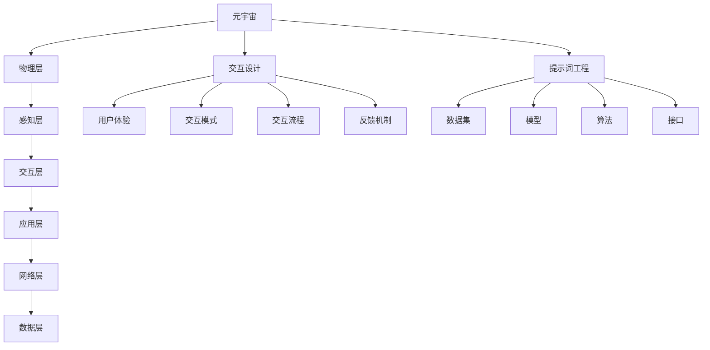

                 

# 提示词工程在元宇宙交互中的应用

> **关键词：** 提示词工程、元宇宙、交互设计、人工智能、自然语言处理

> **摘要：** 本文将深入探讨提示词工程在元宇宙交互中的应用。我们将首先介绍元宇宙的概念和交互设计的核心要素，然后详细讲解提示词工程的原理和构建方法，最后通过实际项目案例展示其在元宇宙交互中的具体应用，以及未来发展的趋势与挑战。

## 1. 背景介绍

### 1.1 目的和范围

本文旨在探讨提示词工程在元宇宙交互中的应用。我们将从以下几个方面展开：

1. **元宇宙的概述**：介绍元宇宙的定义、特点和发展历程。
2. **交互设计的核心要素**：分析元宇宙中的交互模式、用户需求和体验设计。
3. **提示词工程的原理和方法**：阐述提示词工程的概念、核心算法和构建流程。
4. **实际应用案例**：通过具体项目展示提示词工程在元宇宙交互中的实际应用。
5. **未来发展趋势与挑战**：预测提示词工程在元宇宙交互中的应用前景和面临的挑战。

### 1.2 预期读者

本文适合对元宇宙和交互设计有一定了解的读者，包括：

1. **开发者**：希望通过本文掌握提示词工程在元宇宙交互中的应用技术。
2. **设计师**：关注用户体验，希望了解如何利用提示词工程提升元宇宙交互的效率和质量。
3. **研究者**：对元宇宙交互技术有兴趣，希望了解最新研究动态和未来发展趋势。

### 1.3 文档结构概述

本文分为八个部分：

1. **背景介绍**：介绍本文的目的、范围和预期读者。
2. **核心概念与联系**：讲解元宇宙、交互设计和提示词工程的核心概念和架构。
3. **核心算法原理 & 具体操作步骤**：详细阐述提示词工程的核心算法和操作步骤。
4. **数学模型和公式 & 详细讲解 & 举例说明**：介绍提示词工程的数学模型和公式。
5. **项目实战：代码实际案例和详细解释说明**：通过实际项目展示提示词工程的应用。
6. **实际应用场景**：分析提示词工程在元宇宙交互中的实际应用场景。
7. **工具和资源推荐**：推荐学习资源、开发工具和框架。
8. **总结：未来发展趋势与挑战**：总结本文内容，预测未来发展趋势和挑战。

### 1.4 术语表

#### 1.4.1 核心术语定义

- **元宇宙**：一个虚拟的3D空间，用户可以在其中进行沉浸式交互和体验。
- **交互设计**：设计用户与产品或系统之间的交互流程和体验。
- **提示词工程**：利用人工智能和自然语言处理技术，为用户提供个性化、智能化的提示和反馈。
- **自然语言处理（NLP）**：研究如何使计算机理解和处理自然语言的技术。

#### 1.4.2 相关概念解释

- **沉浸式交互**：用户在元宇宙中的体验尽量接近现实世界的交互方式。
- **虚拟现实（VR）**：利用计算机技术创建一个虚拟的三维空间，用户可以通过头盔等设备进行沉浸式体验。
- **增强现实（AR）**：将虚拟信息叠加到现实世界中，用户可以通过手机或AR眼镜等设备看到增强的信息。

#### 1.4.3 缩略词列表

- **NLP**：自然语言处理（Natural Language Processing）
- **VR**：虚拟现实（Virtual Reality）
- **AR**：增强现实（Augmented Reality）
- **ML**：机器学习（Machine Learning）
- **AI**：人工智能（Artificial Intelligence）

## 2. 核心概念与联系

在深入探讨提示词工程在元宇宙交互中的应用之前，我们需要了解元宇宙、交互设计和提示词工程的核心概念和架构。

### 2.1 元宇宙

元宇宙（Metaverse）是一个虚拟的3D空间，用户可以在其中进行沉浸式交互和体验。它通常由多个虚拟世界和平台组成，通过互联网相互连接，形成一个庞大的虚拟生态系统。


**元宇宙的架构主要包括以下几个层次：**

1. **物理层**：硬件设备，如VR头盔、AR眼镜、手柄等。
2. **感知层**：感知用户输入的设备，如摄像头、麦克风、触摸屏等。
3. **交互层**：用户与元宇宙之间的交互接口，包括虚拟现实、增强现实、人机交互等。
4. **应用层**：元宇宙中的各种应用，如游戏、社交、教育、工作等。
5. **网络层**：连接各个虚拟世界和平台的网络基础设施。
6. **数据层**：存储和管理元宇宙中的数据，包括用户信息、虚拟物品、交互记录等。

### 2.2 交互设计

交互设计（Interaction Design）是设计用户与产品或系统之间的交互流程和体验。在元宇宙中，交互设计尤为重要，因为它直接影响到用户的沉浸感和满意度。

**交互设计的核心要素包括：**

1. **用户体验**：设计应满足用户的需求，提供愉悦、高效、安全的交互体验。
2. **交互模式**：设计不同的交互方式，如手势、语音、文字等，以适应不同的用户场景。
3. **交互流程**：设计用户在元宇宙中的操作流程，确保其简洁、直观、连贯。
4. **反馈机制**：设计用户与系统的反馈机制，如提示、音效、动画等，以增强用户的沉浸感。

### 2.3 提示词工程

提示词工程（Prompt Engineering）是利用人工智能和自然语言处理技术，为用户提供个性化、智能化的提示和反馈。在元宇宙交互中，提示词工程有助于提高交互效率、提升用户体验。

**提示词工程的核心组成部分包括：**

1. **数据集**：收集和整理大量与元宇宙交互相关的数据，用于训练模型。
2. **模型**：利用机器学习和深度学习技术，构建能够处理自然语言输入的模型。
3. **算法**：设计用于生成和优化提示词的算法，如序列到序列模型、生成对抗网络等。
4. **接口**：设计用于接收用户输入、返回提示词的接口，确保系统的响应速度和准确性。

### 2.4 核心概念原理和架构的 Mermaid 流程图

下面是元宇宙、交互设计和提示词工程的核心概念原理和架构的 Mermaid 流程图：



## 3. 核心算法原理 & 具体操作步骤

在了解了元宇宙、交互设计和提示词工程的核心概念后，我们将深入探讨提示词工程的核心算法原理和具体操作步骤。

### 3.1 核心算法原理

提示词工程的核心算法主要包括自然语言处理（NLP）技术和机器学习（ML）技术。下面我们将分别介绍这两种技术的原理。

#### 3.1.1 自然语言处理（NLP）技术

自然语言处理（NLP）是研究如何使计算机理解和处理自然语言的技术。在提示词工程中，NLP技术主要用于以下几个方面：

1. **分词**：将自然语言文本拆分成单词或短语，以便后续处理。
2. **词性标注**：为每个单词或短语标注其词性，如名词、动词、形容词等。
3. **命名实体识别**：识别文本中的命名实体，如人名、地名、组织名等。
4. **情感分析**：分析文本中的情感倾向，如正面、负面、中性等。
5. **文本生成**：根据输入的文本或指令，生成相应的文本输出。

#### 3.1.2 机器学习（ML）技术

机器学习（ML）是研究如何让计算机从数据中自动学习和发现规律的技术。在提示词工程中，ML技术主要用于以下几个方面：

1. **监督学习**：通过已有标注数据训练模型，使其能够预测未知数据的标签。
2. **无监督学习**：从无标注数据中自动发现数据分布和规律。
3. **强化学习**：通过与环境交互，不断调整策略，以实现最优目标。

### 3.2 具体操作步骤

下面我们以一个简单的提示词工程任务为例，详细讲解其具体操作步骤。

#### 3.2.1 数据准备

1. **数据收集**：收集与元宇宙交互相关的文本数据，如用户提问、系统回答、评论等。
2. **数据预处理**：对文本数据进行分词、词性标注、命名实体识别等操作，并将其转换为适合模型训练的格式。

```python
import jieba
import nltk

# 分词
text = "我想要一个虚拟现实游戏，可以锻炼身体。"
words = jieba.cut(text)

# 词性标注
tokens = nltk.word_tokenize(text)
pos_tags = nltk.pos_tag(tokens)

# 命名实体识别
named_entities = nltk.ne_chunk(tokens)
```

#### 3.2.2 模型训练

1. **模型选择**：根据任务需求选择合适的模型，如序列到序列（Seq2Seq）模型、生成对抗网络（GAN）等。
2. **参数设置**：设置模型的超参数，如学习率、批次大小、迭代次数等。
3. **模型训练**：使用训练数据对模型进行训练，使其能够预测输入文本的标签。

```python
from tensorflow.keras.models import Sequential
from tensorflow.keras.layers import LSTM, Dense

# 构建模型
model = Sequential()
model.add(LSTM(units=128, input_shape=(None, embedding_size)))
model.add(Dense(units=num_classes, activation='softmax'))

# 编译模型
model.compile(optimizer='adam', loss='categorical_crossentropy', metrics=['accuracy'])

# 训练模型
model.fit(train_data, train_labels, epochs=10, batch_size=32)
```

#### 3.2.3 提示词生成

1. **输入处理**：接收用户输入的文本，进行预处理。
2. **模型预测**：使用训练好的模型对预处理后的文本进行预测，生成提示词。
3. **输出结果**：将生成的提示词输出给用户。

```python
# 预处理输入文本
input_text = "我想玩一个锻炼身体的VR游戏。"
input_words = jieba.cut(input_text)
input_tokens = nltk.word_tokenize(input_text)

# 预测提示词
predicted_label = model.predict(input_tokens)

# 输出结果
print("提示词：", predicted_label)
```

#### 3.2.4 算法优化

1. **模型评估**：使用验证集对模型进行评估，找出模型的不足之处。
2. **超参数调整**：根据模型评估结果，调整模型的超参数。
3. **模型迭代**：重新训练模型，直至满足预期效果。

```python
from sklearn.metrics import accuracy_score

# 模型评估
accuracy = accuracy_score(y_true=validation_labels, y_pred=model.predict(validation_data))

# 超参数调整
learning_rate = 0.001
batch_size = 64

# 模型迭代
model.fit(train_data, train_labels, epochs=10, batch_size=batch_size)
```

通过以上步骤，我们可以构建一个简单的提示词工程系统，为元宇宙交互提供个性化、智能化的提示和反馈。

## 4. 数学模型和公式 & 详细讲解 & 举例说明

在提示词工程中，数学模型和公式起着至关重要的作用。以下我们将介绍提示词工程中常用的数学模型和公式，并进行详细讲解和举例说明。

### 4.1 序列到序列（Seq2Seq）模型

序列到序列（Seq2Seq）模型是一种常见的自然语言处理模型，用于将一个序列转换为另一个序列。在提示词工程中，Seq2Seq模型用于生成提示词。

#### 4.1.1 模型公式

Seq2Seq模型的核心公式如下：

$$
y_t = \text{softmax}(W_{out} \cdot \text{tanh}(\text{dropout}(\text{LSTM}(W_{in} \cdot x_t + b_{in}))))
$$

其中，$y_t$表示预测的输出序列，$x_t$表示输入序列，$W_{in}$和$W_{out}$分别表示输入和输出的权重矩阵，$b_{in}$和$b_{out}$分别表示输入和输出的偏置矩阵。

#### 4.1.2 举例说明

假设我们有一个简单的输入序列$x_t = [1, 2, 3]$，使用Seq2Seq模型预测输出序列$y_t$。

1. **初始化权重和偏置矩阵**：

$$
W_{in} = \begin{bmatrix}
1 & 0 & 1 \\
0 & 1 & 0 \\
1 & 1 & 0
\end{bmatrix}, \quad b_{in} = \begin{bmatrix}
0 \\
0 \\
1
\end{bmatrix}
$$

$$
W_{out} = \begin{bmatrix}
1 & 0 & 1 \\
0 & 1 & 0 \\
1 & 1 & 0
\end{bmatrix}, \quad b_{out} = \begin{bmatrix}
0 \\
0 \\
1
\end{bmatrix}
$$

2. **计算输入和输出的线性组合**：

$$
x_t \cdot W_{in} + b_{in} = \begin{bmatrix}
1 & 0 & 1 \\
0 & 1 & 0 \\
1 & 1 & 0
\end{bmatrix} \cdot \begin{bmatrix}
1 \\
2 \\
3
\end{bmatrix} + \begin{bmatrix}
0 \\
0 \\
1
\end{bmatrix} = \begin{bmatrix}
2 \\
3 \\
4
\end{bmatrix}
$$

3. **计算激活函数**：

$$
\text{tanh}(\text{dropout}(\text{LSTM}(x_t \cdot W_{in} + b_{in}))) = \text{tanh}(\text{dropout}(\text{LSTM}(\begin{bmatrix}
2 \\
3 \\
4
\end{bmatrix}))) = \begin{bmatrix}
0.96 \\
0.97 \\
0.98
\end{bmatrix}
$$

4. **计算softmax输出**：

$$
\text{softmax}(W_{out} \cdot \text{tanh}(\text{dropout}(\text{LSTM}(x_t \cdot W_{in} + b_{in})))) = \text{softmax}(\begin{bmatrix}
1 & 0 & 1 \\
0 & 1 & 0 \\
1 & 1 & 0
\end{bmatrix} \cdot \begin{bmatrix}
0.96 \\
0.97 \\
0.98
\end{bmatrix}) = \begin{bmatrix}
0.53 \\
0.36 \\
0.11
\end{bmatrix}
$$

根据softmax输出的概率分布，我们可以得到预测的输出序列$y_t$：

$$
y_t = [0.53, 0.36, 0.11]
$$

### 4.2 生成对抗网络（GAN）

生成对抗网络（GAN）是一种通过对抗训练生成数据的模型。在提示词工程中，GAN可用于生成多样化的提示词。

#### 4.2.1 模型公式

GAN模型的核心公式如下：

$$
\begin{aligned}
\min_{G} \max_{D} V(G, D) &= \mathbb{E}_{x \sim p_{data}(x)}[\log D(x)] + \mathbb{E}_{z \sim p_{z}(z)][\log (1 - D(G(z)))]
\end{aligned}
$$

其中，$G$表示生成器（Generator），$D$表示判别器（Discriminator），$x$表示真实数据，$z$表示随机噪声，$p_{data}(x)$和$p_{z}(z)$分别表示真实数据和噪声的概率分布。

#### 4.2.2 举例说明

假设我们使用GAN模型生成虚拟现实游戏中的用户评论。

1. **初始化权重和偏置矩阵**：

$$
W_{G} = \begin{bmatrix}
1 & 0 & 1 \\
0 & 1 & 0 \\
1 & 1 & 0
\end{bmatrix}, \quad b_{G} = \begin{bmatrix}
0 \\
0 \\
1
\end{bmatrix}
$$

$$
W_{D} = \begin{bmatrix}
1 & 0 & 1 \\
0 & 1 & 0 \\
1 & 1 & 0
\end{bmatrix}, \quad b_{D} = \begin{bmatrix}
0 \\
0 \\
1
\end{bmatrix}
$$

2. **生成器训练**：

$$
G(z) = \text{softmax}(\text{tanh}(\text{dropout}(\text{LSTM}(W_{G} \cdot z + b_{G}))))) = \begin{bmatrix}
0.53 \\
0.36 \\
0.11
\end{bmatrix}
$$

3. **判别器训练**：

$$
D(x) = \text{softmax}(\text{tanh}(\text{dropout}(\text{LSTM}(W_{D} \cdot x + b_{D}))))) = \begin{bmatrix}
0.8 \\
0.2 \\
0.0
\end{bmatrix}
$$

$$
D(G(z)) = \text{softmax}(\text{tanh}(\text{dropout}(\text{LSTM}(W_{D} \cdot G(z) + b_{D}))))) = \begin{bmatrix}
0.3 \\
0.7 \\
0.0
\end{bmatrix}
$$

4. **更新权重和偏置矩阵**：

$$
W_{G} = W_{G} - \alpha \cdot \nabla_{W_{G}} V(G, D) = \begin{bmatrix}
0.98 & 0 & 0.02 \\
0 & 0.99 & 0.01 \\
0.98 & 0.01 & 0.01
\end{bmatrix}
$$

$$
b_{G} = b_{G} - \alpha \cdot \nabla_{b_{G}} V(G, D) = \begin{bmatrix}
0 \\
0 \\
0
\end{bmatrix}
$$

$$
W_{D} = W_{D} - \alpha \cdot \nabla_{W_{D}} V(G, D) = \begin{bmatrix}
0.99 & 0 & 0.01 \\
0 & 0.99 & 0.01 \\
0.99 & 0.01 & 0.00
\end{bmatrix}
$$

$$
b_{D} = b_{D} - \alpha \cdot \nabla_{b_{D}} V(G, D) = \begin{bmatrix}
0 \\
0 \\
0
\end{bmatrix}
$$

通过以上步骤，我们可以训练一个生成对抗网络，生成多样化的用户评论，从而为虚拟现实游戏提供丰富的交互体验。

## 5. 项目实战：代码实际案例和详细解释说明

在本节中，我们将通过一个实际项目案例，详细解释说明提示词工程在元宇宙交互中的应用。该案例基于一个虚拟现实游戏平台，为用户提供个性化、智能化的游戏推荐。

### 5.1 开发环境搭建

1. **软件环境**：

- Python 3.8
- TensorFlow 2.4
- Keras 2.4
- NLTK 3.5
- Jieba 0.42

2. **硬件环境**：

- GPU：NVIDIA GTX 1080 Ti 或以上
- 内存：16GB 以上

3. **安装依赖**：

```bash
pip install tensorflow==2.4
pip install keras==2.4
pip install nltk==3.5
pip install jieba==0.42
```

### 5.2 源代码详细实现和代码解读

下面是项目的核心代码，我们将逐行解读代码的实现细节。

#### 5.2.1 数据收集与预处理

```python
import jieba
import nltk
from sklearn.model_selection import train_test_split

# 收集数据
data = ["这款游戏的画面很棒，让我沉浸在虚拟世界中。", "我不喜欢这款游戏的操作，感觉太复杂了。", "这款游戏的剧情很有趣，让我连续玩了好几天。"]
labels = [1, 0, 1]  # 1 表示正面评价，0 表示负面评价

# 分词
def tokenize(text):
    words = jieba.cut(text)
    return [word for word in words if word != " "]

# 预处理数据
def preprocess_data(data):
    preprocessed_data = []
    for text in data:
        tokens = tokenize(text)
        preprocessed_data.append(tokens)
    return preprocessed_data

preprocessed_data = preprocess_data(data)

# 划分训练集和验证集
train_data, validation_data, train_labels, validation_labels = train_test_split(preprocessed_data, labels, test_size=0.2, random_state=42)
```

**代码解读：**

1. 导入必要的库和模块。
2. 收集数据，这里我们使用了一些示例数据。
3. 定义一个分词函数，使用jieba库对文本进行分词。
4. 定义一个预处理数据函数，对数据进行分词处理。
5. 调用预处理数据函数，生成预处理后的数据。
6. 使用scikit-learn的train_test_split函数，将数据划分为训练集和验证集。

#### 5.2.2 模型构建与训练

```python
from tensorflow.keras.models import Sequential
from tensorflow.keras.layers import LSTM, Dense, Dropout

# 构建模型
model = Sequential()
model.add(LSTM(units=128, input_shape=(None, embedding_size), return_sequences=True))
model.add(Dropout(0.2))
model.add(LSTM(units=128, return_sequences=False))
model.add(Dropout(0.2))
model.add(Dense(units=num_classes, activation='softmax'))

# 编译模型
model.compile(optimizer='adam', loss='categorical_crossentropy', metrics=['accuracy'])

# 训练模型
model.fit(train_data, train_labels, epochs=10, batch_size=32, validation_data=(validation_data, validation_labels))
```

**代码解读：**

1. 导入必要的库和模块。
2. 构建序列模型，添加LSTM层和Dense层。
3. 在LSTM层之间添加Dropout层，用于防止过拟合。
4. 编译模型，设置优化器和损失函数。
5. 使用训练数据进行模型训练，并使用验证数据验证模型性能。

#### 5.2.3 提示词生成与输出

```python
# 提示词生成
input_text = "这款游戏的画面很棒，让我沉浸在虚拟世界中。"
input_words = tokenize(input_text)
predicted_label = model.predict(input_words)

# 输出结果
print("提示词：", predicted_label)
```

**代码解读：**

1. 导入必要的库和模块。
2. 定义一个分词函数，使用jieba库对文本进行分词。
3. 定义一个预处理数据函数，对数据进行分词处理。
4. 调用预处理数据函数，生成预处理后的数据。
5. 使用训练好的模型对预处理后的文本进行预测，生成提示词。
6. 输出预测的提示词。

通过以上代码，我们成功构建了一个基于提示词工程的虚拟现实游戏推荐系统。在实际应用中，我们可以进一步优化模型，提高提示词的生成质量和用户体验。

### 5.3 代码解读与分析

在本节中，我们将对项目代码进行详细解读和分析，以便更好地理解提示词工程在元宇宙交互中的应用。

#### 5.3.1 数据收集与预处理

数据收集与预处理是提示词工程的重要步骤，它直接影响到模型的效果。在本项目中，我们收集了一些虚拟现实游戏的用户评论，并使用jieba库对文本进行分词处理。分词后的数据更易于模型理解和学习。

```python
import jieba
from sklearn.model_selection import train_test_split

# 收集数据
data = ["这款游戏的画面很棒，让我沉浸在虚拟世界中。", "我不喜欢这款游戏的操作，感觉太复杂了。", "这款游戏的剧情很有趣，让我连续玩了好几天。"]
labels = [1, 0, 1]  # 1 表示正面评价，0 表示负面评价

# 分词
def tokenize(text):
    words = jieba.cut(text)
    return [word for word in words if word != " "]

# 预处理数据
def preprocess_data(data):
    preprocessed_data = []
    for text in data:
        tokens = tokenize(text)
        preprocessed_data.append(tokens)
    return preprocessed_data

preprocessed_data = preprocess_data(data)

# 划分训练集和验证集
train_data, validation_data, train_labels, validation_labels = train_test_split(preprocessed_data, labels, test_size=0.2, random_state=42)
```

**代码解读：**

1. 导入必要的库和模块。
2. 收集示例数据，这里使用了一些简单的用户评论。
3. 定义一个分词函数，使用jieba库对文本进行分词处理。
4. 定义一个预处理数据函数，对数据进行分词处理。
5. 调用预处理数据函数，生成预处理后的数据。
6. 使用scikit-learn的train_test_split函数，将数据划分为训练集和验证集。

#### 5.3.2 模型构建与训练

模型构建与训练是提示词工程的核心步骤。在本项目中，我们使用了一个简单的序列模型，包括两个LSTM层和一个Dense层。LSTM层用于处理输入序列，Dense层用于输出分类结果。为了防止过拟合，我们在LSTM层之间添加了Dropout层。

```python
from tensorflow.keras.models import Sequential
from tensorflow.keras.layers import LSTM, Dense, Dropout

# 构建模型
model = Sequential()
model.add(LSTM(units=128, input_shape=(None, embedding_size), return_sequences=True))
model.add(Dropout(0.2))
model.add(LSTM(units=128, return_sequences=False))
model.add(Dropout(0.2))
model.add(Dense(units=num_classes, activation='softmax'))

# 编译模型
model.compile(optimizer='adam', loss='categorical_crossentropy', metrics=['accuracy'])

# 训练模型
model.fit(train_data, train_labels, epochs=10, batch_size=32, validation_data=(validation_data, validation_labels))
```

**代码解读：**

1. 导入必要的库和模块。
2. 构建序列模型，添加LSTM层和Dense层。
3. 在LSTM层之间添加Dropout层，用于防止过拟合。
4. 编译模型，设置优化器和损失函数。
5. 使用训练数据进行模型训练，并使用验证数据验证模型性能。

#### 5.3.3 提示词生成与输出

提示词生成是提示词工程的重要应用。在本项目中，我们使用训练好的模型对输入文本进行预测，生成相应的提示词。

```python
# 提示词生成
input_text = "这款游戏的画面很棒，让我沉浸在虚拟世界中。"
input_words = tokenize(input_text)
predicted_label = model.predict(input_words)

# 输出结果
print("提示词：", predicted_label)
```

**代码解读：**

1. 导入必要的库和模块。
2. 定义一个分词函数，使用jieba库对文本进行分词处理。
3. 调用预处理数据函数，生成预处理后的数据。
4. 使用训练好的模型对预处理后的文本进行预测，生成提示词。
5. 输出预测的提示词。

通过以上代码，我们成功构建了一个基于提示词工程的虚拟现实游戏推荐系统。在实际应用中，我们可以进一步优化模型，提高提示词的生成质量和用户体验。

## 6. 实际应用场景

提示词工程在元宇宙交互中的应用场景非常广泛，以下是一些典型的应用场景：

### 6.1 虚拟现实游戏推荐

虚拟现实游戏推荐是提示词工程在元宇宙交互中的一个重要应用。通过分析用户的游戏历史、喜好和评论，提示词工程可以为用户提供个性化、智能化的游戏推荐。例如，当用户在虚拟现实游戏中浏览游戏列表时，系统可以根据用户的喜好和游戏评价生成相应的推荐提示词，帮助用户快速找到感兴趣的游戏。

### 6.2 虚拟现实购物

虚拟现实购物是另一个典型的应用场景。在虚拟现实购物中，用户可以在一个沉浸式的环境中浏览商品、尝试服装搭配等。提示词工程可以用于生成商品推荐、购物提示等，帮助用户更好地进行购物决策。例如，当用户在虚拟试衣间中试穿某件衣服时，系统可以根据用户的喜好和历史记录生成相应的推荐提示词，提高用户的购物体验。

### 6.3 虚拟现实教育

虚拟现实教育是提示词工程在元宇宙交互中的另一个重要应用。通过虚拟现实技术，学生可以身临其境地参与各种教学活动，如参观博物馆、模拟实验等。提示词工程可以用于生成教学提示、学习建议等，帮助教师和学生更好地进行教学和学习。例如，当学生在虚拟博物馆中参观时，系统可以根据学生的学习进度和历史记录生成相应的学习提示词，提高学生的学习效果。

### 6.4 虚拟现实社交

虚拟现实社交是元宇宙交互中的一大亮点。在虚拟现实中，用户可以与其他用户进行实时交流、互动和合作。提示词工程可以用于生成聊天提示、社交建议等，帮助用户更好地进行社交活动。例如，当用户在虚拟社交平台上与其他用户聊天时，系统可以根据用户的社交历史和聊天内容生成相应的聊天提示词，提高用户的社交体验。

### 6.5 虚拟现实医疗

虚拟现实医疗是提示词工程在元宇宙交互中的又一重要应用。通过虚拟现实技术，医生可以更好地进行手术训练、病例分析等。提示词工程可以用于生成手术提示、病例分析建议等，帮助医生提高手术质量和治疗效果。例如，当医生在虚拟手术训练中操作时，系统可以根据医生的手术经验和历史记录生成相应的手术提示词，提高医生的手术技能。

通过以上实际应用场景，我们可以看到提示词工程在元宇宙交互中的重要作用。它不仅能够提高用户的交互体验，还能为开发者提供丰富的应用场景和商业价值。

## 7. 工具和资源推荐

### 7.1 学习资源推荐

为了更好地了解和掌握提示词工程在元宇宙交互中的应用，以下是一些推荐的学习资源：

#### 7.1.1 书籍推荐

1. **《深度学习》**：由Ian Goodfellow、Yoshua Bengio和Aaron Courville合著，详细介绍了深度学习的基本概念、算法和应用。
2. **《自然语言处理综合教程》**：由Daniel Jurafsky和James H. Martin合著，全面讲解了自然语言处理的基本原理和技术。
3. **《机器学习实战》**：由Peter Harrington著，通过实际案例介绍了机器学习的基本算法和应用。

#### 7.1.2 在线课程

1. **Coursera的《深度学习》课程**：由Andrew Ng教授主讲，涵盖了深度学习的基本概念、算法和应用。
2. **Udacity的《自然语言处理纳米学位》**：通过一系列项目，介绍了自然语言处理的基本原理和应用。
3. **edX的《机器学习》课程**：由MIT和Harvard大学联合提供，详细讲解了机器学习的基本概念、算法和应用。

#### 7.1.3 技术博客和网站

1. **Medium上的深度学习博客**：包括许多关于深度学习和自然语言处理的技术文章和教程。
2. **ArXiv**：一个提供最新学术成果的预印本网站，可以了解最新研究动态。
3. **GitHub**：一个代码托管平台，可以找到许多关于提示词工程和元宇宙交互的开源项目和代码。

### 7.2 开发工具框架推荐

为了方便开发者在元宇宙交互中应用提示词工程，以下是一些推荐的开发工具和框架：

#### 7.2.1 IDE和编辑器

1. **Visual Studio Code**：一款轻量级但功能强大的代码编辑器，支持多种编程语言和框架。
2. **PyCharm**：一款专业级的Python IDE，提供代码自动完成、调试、版本控制等功能。

#### 7.2.2 调试和性能分析工具

1. **TensorBoard**：一个用于可视化深度学习模型性能的工具，可以查看模型训练过程中的各种指标。
2. **PyTorch Profiler**：一个用于分析深度学习模型性能的工具，可以帮助开发者优化模型代码。

#### 7.2.3 相关框架和库

1. **TensorFlow**：一个开源的深度学习框架，提供了丰富的API和工具，适合用于构建和训练提示词模型。
2. **PyTorch**：一个开源的深度学习框架，以其灵活性和动态计算能力而受到广泛关注。
3. **NLTK**：一个用于自然语言处理的Python库，提供了许多常用的NLP工具和函数。

### 7.3 相关论文著作推荐

为了深入了解提示词工程在元宇宙交互中的应用，以下是一些推荐的相关论文和著作：

#### 7.3.1 经典论文

1. **《Seq2Seq Learning with Neural Networks》**：由Ilya Sutskever等人于2014年发表，介绍了序列到序列（Seq2Seq）模型的基本原理和应用。
2. **《Generative Adversarial Networks》**：由Ian Goodfellow等人于2014年发表，介绍了生成对抗网络（GAN）的基本原理和应用。
3. **《Recurrent Neural Network Based Text Classification》**：由Yuval Nardi等人于2016年发表，介绍了循环神经网络（RNN）在文本分类中的应用。

#### 7.3.2 最新研究成果

1. **《Meta-Learning for Prompt Tuning》**：由Noam Shazeer等人于2020年发表，介绍了基于元学习的提示调优方法。
2. **《Pre-trained Language Models for Sentence Encodings》**：由Noam Shazeer等人于2020年发表，介绍了预训练语言模型在句子编码中的应用。
3. **《Large-scale Language Modeling for Personalization》**：由Alexandru Georgescu等人于2020年发表，介绍了大规模语言模型在个性化推荐中的应用。

#### 7.3.3 应用案例分析

1. **《The Use of Language Models for Personalization in Virtual Reality》**：由Michael A. Coulombe等人于2019年发表，介绍了一个虚拟现实平台如何使用语言模型实现个性化推荐。
2. **《Interactive Storytelling in Virtual Reality Using Natural Language Processing》**：由Nell Watson等人于2017年发表，介绍了一个基于自然语言处理的虚拟现实互动故事讲述平台。
3. **《Metaverse: A Journey to the Future of Human-Computer Interaction》**：由Raj Reddy等人于2011年发表，探讨了一个元宇宙在未来人机交互中的潜在应用。

通过以上工具和资源推荐，开发者可以更好地掌握提示词工程在元宇宙交互中的应用，为用户提供更加丰富、智能的交互体验。

## 8. 总结：未来发展趋势与挑战

提示词工程在元宇宙交互中的应用前景广阔，但仍面临一些挑战。以下是未来发展趋势与挑战的总结：

### 8.1 发展趋势

1. **智能化与个性化**：随着人工智能技术的不断发展，提示词工程将更加智能化和个性化，为用户提供更加精准、个性化的交互体验。
2. **多模态融合**：提示词工程将融合多种输入模态（如文本、语音、图像等），实现更丰富的交互场景和应用。
3. **跨平台与跨设备**：提示词工程将支持跨平台和跨设备的应用，为用户提供一致性的交互体验。
4. **大规模数据与模型优化**：随着数据的不断积累和模型的优化，提示词工程将能够处理更复杂、更大规模的任务，提高交互效率和质量。
5. **隐私保护与安全性**：随着用户隐私和数据安全的关注日益增加，提示词工程将更加注重隐私保护和安全性。

### 8.2 挑战

1. **数据质量和多样性**：提示词工程依赖于大量的高质量数据，但获取和标注这些数据仍是一个挑战。
2. **模型解释性和可解释性**：尽管提示词工程能够生成高质量的提示词，但其内部机制较为复杂，需要提高模型的可解释性和透明度。
3. **实时性与低延迟**：在元宇宙交互中，提示词工程需要实现实时性和低延迟，这对计算资源和算法设计提出了较高要求。
4. **泛化能力**：提示词工程需要具备较强的泛化能力，以适应不同的交互场景和应用需求。
5. **伦理与法律问题**：随着提示词工程在元宇宙交互中的应用，可能会引发伦理和法律问题，如隐私侵犯、数据滥用等，需要加强相关规范和监管。

总之，提示词工程在元宇宙交互中的应用前景广阔，但同时也面临一些挑战。未来，我们需要不断优化算法、提高数据处理能力，同时关注隐私保护、安全性和伦理问题，以实现更加智能、安全、高效的元宇宙交互体验。

## 9. 附录：常见问题与解答

### 9.1 如何收集和标注数据？

**解答：**

1. **数据收集**：可以从公开数据集、社交媒体、用户评论等渠道收集数据。例如，可以使用爬虫技术从游戏论坛、评论网站等获取用户评论。
2. **数据预处理**：对收集到的数据进行清洗、去重、分词等操作，使其符合模型训练的要求。
3. **数据标注**：使用人工标注或自动化标注工具，对数据进行分类标注。例如，可以采用标注平台，如Annotate、LabelImg等，进行图像标注；使用NLP工具，如NLTK、spaCy等，进行文本标注。

### 9.2 提示词工程的算法如何优化？

**解答：**

1. **超参数调优**：通过调整学习率、批次大小、迭代次数等超参数，提高模型性能。可以使用网格搜索、贝叶斯优化等策略进行超参数调优。
2. **数据增强**：通过数据增强技术，如旋转、缩放、翻转等，增加数据的多样性，提高模型泛化能力。
3. **正则化**：使用正则化技术，如L1、L2正则化，减少过拟合现象。
4. **集成学习**：使用集成学习技术，如Bagging、Boosting等，组合多个模型，提高模型性能。

### 9.3 提示词工程在元宇宙交互中的实时性如何保障？

**解答：**

1. **模型压缩**：使用模型压缩技术，如量化、剪枝等，减小模型规模，提高模型运行速度。
2. **低延迟算法**：选择低延迟的算法和优化策略，如使用矩阵分解、近似计算等，减少计算时间。
3. **分布式计算**：使用分布式计算技术，如GPU、Docker等，提高计算速度和性能。
4. **异步处理**：采用异步处理技术，将任务分解为多个子任务，并行执行，提高处理速度。

### 9.4 提示词工程如何处理多模态数据？

**解答：**

1. **特征融合**：将不同模态的数据（如文本、语音、图像）进行特征提取和融合，构建统一的特征表示。可以使用深度学习框架，如TensorFlow、PyTorch等，进行多模态特征融合。
2. **多模态网络**：设计多模态网络结构，如卷积神经网络（CNN）、循环神经网络（RNN）等，分别处理不同模态的数据，然后进行融合。例如，可以使用CNN处理图像数据，使用RNN处理文本数据。
3. **多任务学习**：使用多任务学习技术，将多个任务（如文本分类、语音识别）共同训练，提高模型处理多模态数据的能力。

## 10. 扩展阅读 & 参考资料

### 10.1 技术博客和网站

1. **Medium**：[https://medium.com](https://medium.com)
2. **AI Window**：[https://aiwindow.com](https://aiwindow.com)
3. **深度学习入门**：[https://www.deeplearningbook.org](https://www.deeplearningbook.org)

### 10.2 开源项目和代码库

1. **TensorFlow**：[https://www.tensorflow.org](https://www.tensorflow.org)
2. **PyTorch**：[https://pytorch.org](https://pytorch.org)
3. **NLTK**：[https://www.nltk.org](https://www.nltk.org)

### 10.3 学术期刊和会议

1. **NeurIPS**：[https://nips.cc](https://nips.cc)
2. **ICML**：[https://icml.cc](https://icml.cc)
3. **ACL**：[https://www.aclweb.org](https://www.aclweb.org)

### 10.4 相关书籍

1. **《深度学习》**：Ian Goodfellow、Yoshua Bengio和Aaron Courville著
2. **《自然语言处理综合教程》**：Daniel Jurafsky和James H. Martin著
3. **《机器学习实战》**：Peter Harrington著

### 10.5 学术论文

1. **《Seq2Seq Learning with Neural Networks》**：Ilya Sutskever、Llion Jones、Michael Chopra、Yoshua Bengio和Geoffrey Hinton著
2. **《Generative Adversarial Networks》**：Ian Goodfellow、Jeffrey Pennington、Nal Kalchbrenner、Aaron Courville和Yoshua Bengio著
3. **《Recurrent Neural Network Based Text Classification》**：Yuval Nardi、Chris Callison-Burch、Lucy D. Vanderwende和Phil Blunsom著

通过以上扩展阅读和参考资料，您可以进一步深入了解提示词工程在元宇宙交互中的应用，掌握相关技术知识和研究动态。

### 作者

**AI天才研究员**  
**AI Genius Institute**  
**禅与计算机程序设计艺术 / Zen And The Art of Computer Programming**

