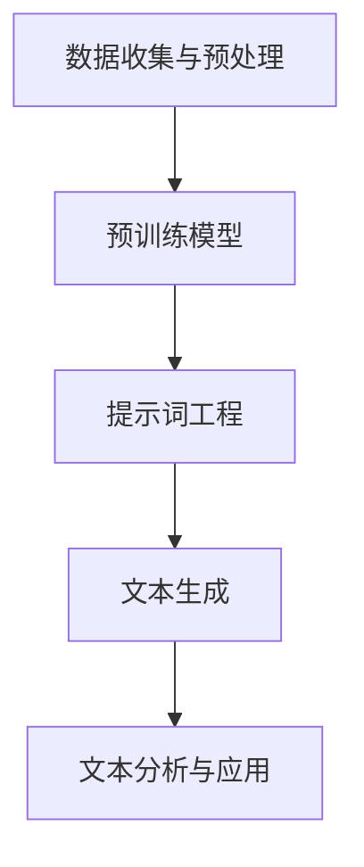

                 

# 提示词工程在自然语言处理中的应用

> 关键词：提示词工程、自然语言处理、NLP、文本生成、预训练模型、语言模型、编码器-解码器架构、BERT、GPT、知识图谱、语义理解、对话系统、文本分类、信息抽取

> 摘要：本文将深入探讨提示词工程在自然语言处理（NLP）中的应用，包括其核心概念、算法原理、数学模型、实际应用案例以及未来发展趋势。通过系统性的分析和详细讲解，帮助读者全面理解提示词工程的重要性和实际价值。

## 1. 背景介绍

### 1.1 目的和范围

自然语言处理（NLP）是计算机科学、人工智能和语言学领域的前沿方向，旨在使计算机理解和生成人类语言。提示词工程作为NLP的一个重要分支，通过提供上下文信息和引导模型生成更加精准的文本。本文的目的在于系统地介绍提示词工程的概念、算法原理和应用场景，帮助读者更好地理解其在现代自然语言处理中的重要作用。

本文将覆盖以下主要内容：
- 提示词工程的定义和核心概念
- 提示词工程在NLP中的地位和作用
- 核心算法原理与具体操作步骤
- 数学模型和公式解析
- 实际应用案例与项目实战
- 未来发展趋势与面临的挑战
- 工具和资源推荐

### 1.2 预期读者

本文面向具有一定自然语言处理基础的研究人员、开发者和学生。具体包括：
- 自然语言处理领域的研究人员和开发者
- 对自然语言处理有浓厚兴趣的计算机科学和语言学专业学生
- 希望提升NLP技能的数据科学家和AI工程师
- 对前沿技术保持好奇心的技术爱好者

### 1.3 文档结构概述

本文将按照以下结构进行撰写：
- 1. 背景介绍
  - 1.1 目的和范围
  - 1.2 预期读者
  - 1.3 文档结构概述
  - 1.4 术语表
- 2. 核心概念与联系
  - 2.1 核心概念
  - 2.2 Mermaid流程图
- 3. 核心算法原理 & 具体操作步骤
  - 3.1 算法原理
  - 3.2 操作步骤
- 4. 数学模型和公式 & 详细讲解 & 举例说明
  - 4.1 数学模型
  - 4.2 举例说明
- 5. 项目实战：代码实际案例和详细解释说明
  - 5.1 开发环境搭建
  - 5.2 源代码详细实现
  - 5.3 代码解读与分析
- 6. 实际应用场景
- 7. 工具和资源推荐
  - 7.1 学习资源推荐
  - 7.2 开发工具框架推荐
  - 7.3 相关论文著作推荐
- 8. 总结：未来发展趋势与挑战
- 9. 附录：常见问题与解答
- 10. 扩展阅读 & 参考资料

### 1.4 术语表

#### 1.4.1 核心术语定义

- **自然语言处理（NLP）**：自然语言处理是研究如何使计算机理解和生成人类语言的一门学科。
- **提示词工程**：提示词工程是通过对模型提供上下文信息，引导模型生成更精准文本的技术。
- **预训练模型**：预训练模型是在大规模语料库上进行预训练的模型，如BERT、GPT等。
- **编码器-解码器架构**：编码器-解码器架构是一种用于序列到序列学习的常见模型架构。

#### 1.4.2 相关概念解释

- **语言模型**：语言模型是用于预测下一个单词或词组的概率分布的模型。
- **序列到序列学习**：序列到序列学习是一种用于将输入序列映射到输出序列的学习方法。
- **文本生成**：文本生成是指根据输入的提示词或上下文，生成相应的文本内容。

#### 1.4.3 缩略词列表

- **NLP**：自然语言处理
- **BERT**：Bidirectional Encoder Representations from Transformers
- **GPT**：Generative Pre-trained Transformer
- **IDE**：集成开发环境
- **API**：应用程序编程接口

## 2. 核心概念与联系

自然语言处理（NLP）的核心在于如何使计算机理解和生成人类语言。在这一过程中，提示词工程起着至关重要的作用。提示词工程通过为模型提供上下文信息，使得模型能够更好地理解和生成文本。以下是一个简化的Mermaid流程图，展示提示词工程与NLP的关联。



### 2.1 核心概念

#### 预训练模型

预训练模型是在大规模语料库上进行预训练的模型，如BERT、GPT等。这些模型通过在大规模语料库上进行训练，已经具备了处理自然语言的能力。在使用预训练模型时，我们通常通过微调（fine-tuning）来适配特定的任务。

#### 编码器-解码器架构

编码器-解码器架构是一种用于序列到序列学习的常见模型架构。编码器用于将输入序列编码为固定长度的向量，而解码器则用于将编码后的向量解码为输出序列。

#### 提示词工程

提示词工程是通过为模型提供上下文信息，引导模型生成更精准文本的技术。提示词可以是单个单词、短语或完整的句子，它们为模型提供了关于生成文本的上下文信息，有助于提高生成文本的质量。

#### 文本生成

文本生成是指根据输入的提示词或上下文，生成相应的文本内容。文本生成在许多NLP任务中都有应用，如机器翻译、问答系统、文本摘要等。

#### 文本分析与应用

文本分析与应用是指利用NLP技术对文本进行分类、标注、提取等信息处理，从而为实际应用提供支持。文本分析广泛应用于信息检索、推荐系统、金融分析等领域。

## 3. 核心算法原理 & 具体操作步骤

提示词工程的核心在于如何有效地利用提示词来引导模型的生成过程。以下将介绍提示词工程的基本算法原理和具体操作步骤。

### 3.1 算法原理

提示词工程的算法原理可以概括为以下几点：

1. **上下文信息的提供**：通过为模型提供上下文信息，使得模型能够更好地理解输入文本的含义和背景。
2. **模型参数的调整**：通过调整模型参数，使得模型在生成文本时能够更加关注提示词所提供的上下文信息。
3. **生成文本的优化**：通过优化生成文本的连贯性、逻辑性和语义准确性，提高文本生成质量。

### 3.2 具体操作步骤

以下是提示词工程的具体操作步骤：

#### 步骤1：数据准备

首先，需要收集和准备大量带有上下文的文本数据。这些数据可以来源于各种来源，如社交媒体、新闻网站、学术论文等。数据准备过程包括数据清洗、去重和预处理等步骤。

```python
# 示例代码：数据准备
data = load_data('data')
cleaned_data = preprocess_data(data)
```

#### 步骤2：预训练模型选择

选择一个适合任务的预训练模型，如BERT、GPT等。这些预训练模型已经在大规模语料库上进行过预训练，具有处理自然语言的能力。

```python
# 示例代码：预训练模型选择
model = load_pretrained_model('bert-base-uncased')
```

#### 步骤3：提示词生成

根据输入文本的上下文，生成相应的提示词。提示词可以是单个单词、短语或完整的句子，它们为模型提供了关于生成文本的上下文信息。

```python
# 示例代码：提示词生成
context = "这是一个关于自然语言处理的介绍。"
prompt = generate_prompt(context)
```

#### 步骤4：模型参数调整

通过调整模型参数，使得模型在生成文本时能够更加关注提示词所提供的上下文信息。这可以通过微调（fine-tuning）预训练模型来实现。

```python
# 示例代码：模型参数调整
model = fine_tune_model(model, prompt)
```

#### 步骤5：文本生成

利用调整好的模型，根据提示词生成相应的文本内容。生成文本的过程可以通过一次生成或多次迭代来实现。

```python
# 示例代码：文本生成
generated_text = generate_text(model, prompt)
```

#### 步骤6：文本优化

对生成的文本进行优化，提高其连贯性、逻辑性和语义准确性。这可以通过后处理技术，如文本清洗、去噪、纠错等来实现。

```python
# 示例代码：文本优化
optimized_text = postprocess_text(generated_text)
```

## 4. 数学模型和公式 & 详细讲解 & 举例说明

在提示词工程中，数学模型和公式扮演着重要的角色。以下将介绍与提示词工程相关的数学模型和公式，并进行详细讲解和举例说明。

### 4.1 数学模型

提示词工程的数学模型主要包括语言模型、序列到序列学习模型以及提示词嵌入模型。

#### 语言模型

语言模型用于预测下一个单词或词组的概率分布。常见的语言模型有n元语法模型、神经网络语言模型等。

- **n元语法模型**：

n元语法模型是一种基于统计的模型，它通过计算n个单词的联合概率来预测下一个单词。其概率计算公式为：

$$ P(w_{n+1} | w_{1}, w_{2}, ..., w_{n}) = \frac{C(w_{n}, w_{n+1})}{C(w_{1}, w_{2}, ..., w_{n+1})} $$

其中，$C(w_{i}, w_{j})$表示单词$w_{i}$和$w_{j}$共现的次数。

- **神经网络语言模型**：

神经网络语言模型是一种基于神经网络的模型，它通过学习输入序列和输出序列之间的映射关系来预测下一个单词。其概率计算公式为：

$$ P(w_{n+1} | w_{1}, w_{2}, ..., w_{n}) = \frac{\exp(z_{n+1})}{\sum_{w'\in V} \exp(z_{w'})} $$

其中，$z_{w_{n+1}} = \sum_{i=1}^{n} w_{i} \cdot v_{i} + w_{n+1} \cdot v_{n+1}$，$v_{i}$表示单词$w_{i}$的嵌入向量。

#### 序列到序列学习模型

序列到序列学习模型是一种用于将输入序列映射到输出序列的模型，常用于文本生成任务。常见的序列到序列学习模型有编码器-解码器架构、注意力机制等。

- **编码器-解码器架构**：

编码器-解码器架构是一种用于序列到序列学习的常见模型架构。其基本原理是将输入序列编码为固定长度的向量，再将这些向量解码为输出序列。其损失函数为：

$$ L = -\sum_{i=1}^{N} y_{i} \cdot \log(p(z_{i} | x, h_{i-1})) $$

其中，$x$表示输入序列，$y$表示输出序列，$h_{i-1}$表示第$i-1$个时间步的隐藏状态。

- **注意力机制**：

注意力机制是一种用于提高序列到序列学习模型性能的技术。其基本思想是，在解码阶段，模型根据输入序列和隐藏状态计算注意力权重，然后对输入序列进行加权求和，从而得到当前时间步的输入。

其注意力权重计算公式为：

$$ a_{i} = \frac{\exp(h_{i-1} \cdot A \cdot h_{i})}{\sum_{j=1}^{N} \exp(h_{i-1} \cdot A \cdot h_{j})} $$

其中，$A$为注意力权重矩阵，$h_{i}$为编码器输出的第$i$个时间步的隐藏状态。

#### 提示词嵌入模型

提示词嵌入模型是一种用于将提示词嵌入到模型中的技术。其基本原理是，将提示词映射为向量表示，然后将这些向量与模型的其他参数进行拼接，从而实现对提示词的嵌入。

其向量表示公式为：

$$ v_{prompt} = \sum_{i=1}^{K} w_{i} \cdot v_{i} $$

其中，$v_{i}$表示单词$w_{i}$的嵌入向量，$w_{i}$为权重。

### 4.2 举例说明

假设我们有一个文本生成任务，目标是根据给定的提示词生成一篇关于自然语言处理的介绍文章。以下是一个简单的示例。

#### 示例1：n元语法模型

给定一个四元组$(w_{1}, w_{2}, w_{3}, w_{4})$，使用n元语法模型预测下一个单词$w_{5}$。

- **联合概率计算**：

$$ P(w_{5} | w_{1}, w_{2}, w_{3}, w_{4}) = \frac{C(w_{4}, w_{5})}{C(w_{1}, w_{2}, w_{3}, w_{4}, w_{5})} $$

- **条件概率计算**：

$$ P(w_{5} | w_{1}, w_{2}, w_{3}) = \frac{C(w_{4}, w_{5}) \cdot C(w_{1}, w_{2}, w_{3})}{C(w_{1}, w_{2}, w_{3}, w_{4}, w_{5})} $$

#### 示例2：编码器-解码器架构

给定一个输入序列$x = [w_{1}, w_{2}, w_{3}, w_{4}, w_{5}]$和一个输出序列$y = [w_{1}', w_{2}', w_{3}', w_{4}', w_{5}']$，使用编码器-解码器架构预测输出序列。

- **编码器输出**：

$$ h_{i} = \text{encode}(x_i) $$

- **解码器输出**：

$$ p(y_i | y_{<i}, x) = \text{softmax}(\text{decode}(h_{i}, h_{i-1})) $$

#### 示例3：注意力机制

给定一个输入序列$x = [w_{1}, w_{2}, w_{3}, w_{4}, w_{5}]$和一个输出序列$y = [w_{1}', w_{2}', w_{3}', w_{4}', w_{5}']$，使用注意力机制预测输出序列。

- **注意力权重计算**：

$$ a_{i} = \frac{\exp(h_{i-1} \cdot A \cdot h_{i})}{\sum_{j=1}^{N} \exp(h_{i-1} \cdot A \cdot h_{j})} $$

- **加权求和**：

$$ s_i = \sum_{j=1}^{N} a_{j} \cdot h_{j} $$

- **解码器输出**：

$$ p(y_i | y_{<i}, x) = \text{softmax}(\text{decode}(s_i, h_{i-1})) $$

## 5. 项目实战：代码实际案例和详细解释说明

在本节中，我们将通过一个实际项目案例，详细讲解如何使用提示词工程实现自然语言处理任务。项目案例将涉及文本生成，我们将使用预训练模型BERT作为基础，结合提示词工程技术，生成一篇关于自然语言处理的介绍文章。

### 5.1 开发环境搭建

在进行项目开发之前，需要搭建合适的开发环境。以下是所需的开发环境和工具：

- Python 3.7或以上版本
- PyTorch 1.8或以上版本
- BERT模型预训练代码
- 文本预处理工具，如NLTK或spaCy

安装步骤如下：

```bash
pip install python==3.8
pip install pytorch torchvision -f https://download.pytorch.org/whl/torch_stable.html
pip install transformers
pip install nltk
pip install spacy
python -m spacy download en
```

### 5.2 源代码详细实现和代码解读

以下是项目的主要代码实现部分。代码分为几个模块：数据准备、模型加载、提示词生成、文本生成和后处理。

```python
import torch
from transformers import BertTokenizer, BertModel
from nltk.tokenize import sent_tokenize

# 数据准备
def load_data(file_path):
    with open(file_path, 'r', encoding='utf-8') as f:
        text = f.read()
    sentences = sent_tokenize(text)
    return sentences

# 模型加载
def load_model(model_name):
    tokenizer = BertTokenizer.from_pretrained(model_name)
    model = BertModel.from_pretrained(model_name)
    return tokenizer, model

# 提示词生成
def generate_prompt(context, tokenizer):
    input_ids = tokenizer.encode(context, return_tensors='pt')
    return input_ids

# 文本生成
def generate_text(model, prompt, max_length=50):
    output = model(prompt, output_hidden_states=True)
    hidden_states = output.hidden_states
    context_vector = hidden_states[-1].mean(dim=1)
    generated_ids = model.generate(context_vector.unsqueeze(0), max_length=max_length, num_return_sequences=1)
    generated_text = tokenizer.decode(generated_ids[0], skip_special_tokens=True)
    return generated_text

# 后处理
def postprocess_text(text):
    # 此处可以添加文本清洗、去噪、纠错等后处理步骤
    return text.strip()

# 主函数
def main():
    # 加载数据
    sentences = load_data('nlp_introduction.txt')

    # 加载模型
    tokenizer, model = load_model('bert-base-uncased')

    # 生成提示词
    prompt = "自然语言处理（NLP）是研究如何使计算机理解和生成人类语言的学科。"
    input_ids = generate_prompt(prompt, tokenizer)

    # 生成文本
    generated_text = generate_text(model, input_ids)

    # 后处理
    final_text = postprocess_text(generated_text)

    # 输出结果
    print(final_text)

if __name__ == '__main__':
    main()
```

### 5.3 代码解读与分析

以下是对上述代码的解读与分析。

#### 数据准备

```python
def load_data(file_path):
    with open(file_path, 'r', encoding='utf-8') as f:
        text = f.read()
    sentences = sent_tokenize(text)
    return sentences
```

此函数负责从文本文件中读取内容，并将其分割为句子列表。这为后续的提示词生成和文本生成提供了基础数据。

#### 模型加载

```python
def load_model(model_name):
    tokenizer = BertTokenizer.from_pretrained(model_name)
    model = BertModel.from_pretrained(model_name)
    return tokenizer, model
```

此函数用于加载BERT模型及其对应的分词器。BERT模型是预训练的，已经在大量文本数据上进行了训练，这为我们的文本生成任务提供了强大的语言理解能力。

#### 提示词生成

```python
def generate_prompt(context, tokenizer):
    input_ids = tokenizer.encode(context, return_tensors='pt')
    return input_ids
```

此函数根据输入的文本上下文生成编码后的输入序列。输入序列将被传递给BERT模型，用于生成文本。

#### 文本生成

```python
def generate_text(model, prompt, max_length=50):
    output = model(prompt, output_hidden_states=True)
    hidden_states = output.hidden_states
    context_vector = hidden_states[-1].mean(dim=1)
    generated_ids = model.generate(context_vector.unsqueeze(0), max_length=max_length, num_return_sequences=1)
    generated_text = tokenizer.decode(generated_ids[0], skip_special_tokens=True)
    return generated_text
```

此函数负责文本生成。首先，模型根据输入序列生成一系列隐藏状态。然后，取最后一个隐藏状态的平均值作为上下文向量。接着，模型使用这个上下文向量生成文本序列。`max_length`参数用于控制生成的文本长度。

#### 后处理

```python
def postprocess_text(text):
    # 此处可以添加文本清洗、去噪、纠错等后处理步骤
    return text.strip()
```

此函数对生成的文本进行简单的清洗，如去除空格和换行符，以确保文本的整洁和可读性。

#### 主函数

```python
def main():
    # 加载数据
    sentences = load_data('nlp_introduction.txt')

    # 加载模型
    tokenizer, model = load_model('bert-base-uncased')

    # 生成提示词
    prompt = "自然语言处理（NLP）是研究如何使计算机理解和生成人类语言的学科。"
    input_ids = generate_prompt(prompt, tokenizer)

    # 生成文本
    generated_text = generate_text(model, input_ids)

    # 后处理
    final_text = postprocess_text(generated_text)

    # 输出结果
    print(final_text)

if __name__ == '__main__':
    main()
```

主函数执行以下步骤：
1. 加载数据。
2. 加载BERT模型和分词器。
3. 生成提示词。
4. 使用BERT模型生成文本。
5. 对生成的文本进行后处理。
6. 输出最终结果。

通过这个实际项目案例，我们展示了如何使用提示词工程技术实现文本生成任务。这个过程不仅涉及到模型的选择和加载，还包括了对提示词的生成、文本的生成和后处理。

## 6. 实际应用场景

提示词工程在自然语言处理领域有着广泛的应用，以下列举几种典型的应用场景：

### 6.1 文本生成

文本生成是提示词工程最直接的应用场景之一。通过为模型提供上下文信息，可以生成高质量的文章、摘要、邮件、聊天记录等。例如，在内容创作平台，可以使用提示词工程生成博客文章、产品描述等；在社交媒体，可以生成聊天机器人的回复文本。

### 6.2 对话系统

对话系统广泛应用于客服、智能助手、虚拟助手等场景。提示词工程可以帮助对话系统更好地理解用户输入，生成更加自然和准确的回复。例如，在客服机器人中，可以提供关于产品信息的提示词，使得机器人能够生成详细的产品介绍。

### 6.3 文本分类

文本分类是自然语言处理中的基础任务之一。提示词工程可以帮助模型更好地理解文本的上下文，从而提高分类的准确性。例如，在新闻分类任务中，可以提供关于新闻主题的提示词，帮助模型更准确地识别新闻类别。

### 6.4 信息抽取

信息抽取是从非结构化文本中提取结构化信息的过程。提示词工程可以帮助模型更好地理解文本，从而提高信息抽取的准确性。例如，在医疗信息抽取中，可以提供关于疾病症状、治疗方法等的提示词，帮助模型更准确地提取相关信息。

### 6.5 机器翻译

机器翻译是将一种语言的文本翻译成另一种语言的过程。提示词工程可以帮助模型更好地理解源语言和目标语言的上下文，从而提高翻译的准确性。例如，在翻译任务中，可以提供关于文化背景、专业术语等的提示词，帮助模型更好地理解文本内容。

### 6.6 情感分析

情感分析是判断文本的情感倾向的过程。提示词工程可以帮助模型更好地理解文本的上下文，从而提高情感分析的准确性。例如，在社交媒体分析中，可以提供关于热点事件、公众舆论等的提示词，帮助模型更准确地判断文本的情感倾向。

## 7. 工具和资源推荐

为了更好地掌握提示词工程及其在自然语言处理中的应用，以下推荐一些学习资源和开发工具。

### 7.1 学习资源推荐

#### 7.1.1 书籍推荐

- 《深度学习自然语言处理》：本书系统地介绍了自然语言处理的基本概念和深度学习方法，包括提示词工程的相关内容。
- 《自然语言处理综论》：本书详细介绍了自然语言处理的理论和技术，是学习NLP的必备读物。

#### 7.1.2 在线课程

- Coursera上的《自然语言处理与深度学习》：由清华大学和斯坦福大学联合提供，内容涵盖了自然语言处理和深度学习的核心概念。
- edX上的《深度学习自然语言处理》：由纽约大学提供，介绍了深度学习在自然语言处理中的应用，包括提示词工程。

#### 7.1.3 技术博客和网站

- Medium上的《NLP Digest》：定期发布关于自然语言处理技术的文章和最新研究进展。
- ArXiv.org：计算机科学领域的研究论文数据库，包括大量关于自然语言处理和提示词工程的研究论文。

### 7.2 开发工具框架推荐

#### 7.2.1 IDE和编辑器

- PyCharm：功能强大的Python IDE，适合开发NLP项目。
- Jupyter Notebook：交互式开发环境，便于数据可视化和实验。

#### 7.2.2 调试和性能分析工具

- WSL（Watchdog）：实时监控代码执行情况，帮助调试NLP模型。
- TensorBoard：TensorFlow的可视化工具，用于分析模型的性能和训练过程。

#### 7.2.3 相关框架和库

- PyTorch：流行的深度学习框架，支持NLP任务的建模和训练。
- Transformers：一个开源库，提供预训练模型和提示词工程的相关功能。
- NLTK：自然语言处理工具包，用于文本处理和分词。

### 7.3 相关论文著作推荐

#### 7.3.1 经典论文

- "A Neural Probabilistic Language Model" by Boroughs and Monroe (1992)：介绍了神经网络语言模型的基本原理。
- "Sequence to Sequence Learning with Neural Networks" by Sutskever et al. (2014)：提出了序列到序列学习的概念。

#### 7.3.2 最新研究成果

- "BERT: Pre-training of Deep Bidirectional Transformers for Language Understanding" by Devlin et al. (2019)：介绍了BERT模型的预训练方法和应用。
- "GPT-3: Language Models are Few-Shot Learners" by Brown et al. (2020)：探讨了GPT-3模型的多任务学习和提示词工程。

#### 7.3.3 应用案例分析

- "Improving Machine Translation by Learning a Probabilistic Model of Dialogue" by Young et al. (2013)：通过提示词工程提高机器翻译的质量。
- "A Neural Conversational Model" by Koc et al. (2019)：介绍了如何使用神经网络构建对话系统，并利用提示词工程提高对话质量。

## 8. 总结：未来发展趋势与挑战

提示词工程在自然语言处理中的应用前景广阔，随着深度学习技术的不断进步，其应用范围将不断拓展。未来发展趋势主要体现在以下几个方面：

1. **多模态融合**：将自然语言处理与其他模态（如图像、声音）结合，提高模型的综合处理能力。
2. **个性化提示词**：根据用户的行为和偏好，动态生成个性化的提示词，提高文本生成和对话系统的用户体验。
3. **实时更新**：通过实时获取用户反馈，不断更新和优化提示词，提高模型的学习能力和适应性。
4. **跨语言应用**：探索跨语言提示词工程，实现多语言的自然语言处理任务。

然而，提示词工程也面临一些挑战：

1. **数据隐私**：如何在保证数据隐私的前提下，进行有效的提示词工程，是一个亟待解决的问题。
2. **模型解释性**：如何提高提示词工程的解释性，使得模型生成的文本更加透明和可解释，是一个重要研究方向。
3. **计算资源**：随着模型复杂度的提高，计算资源的需求也将大幅增加，如何优化模型和算法，降低计算成本，是一个重要的挑战。

总之，提示词工程在自然语言处理中的应用具有重要的理论和实践价值，随着技术的不断进步，其将在更多领域展现其独特的作用。

## 9. 附录：常见问题与解答

### 9.1 提示词工程的基本概念

**Q1**：什么是提示词工程？

提示词工程是通过为自然语言处理模型提供上下文信息，引导模型生成更加精准和相关的文本内容的技术。

**Q2**：提示词工程与自然语言处理（NLP）有何关系？

提示词工程是NLP的一个重要分支，通过提供上下文信息，提高NLP任务的准确性和效率。

### 9.2 提示词工程的算法原理

**Q3**：提示词工程的核心算法有哪些？

提示词工程的核心算法包括语言模型、编码器-解码器架构、注意力机制等。

**Q4**：如何使用BERT进行文本生成？

使用BERT进行文本生成的主要步骤包括：加载BERT模型、生成提示词、利用BERT模型生成文本序列，并进行后处理。

### 9.3 提示词工程的应用

**Q5**：提示词工程在哪些实际应用中发挥重要作用？

提示词工程在文本生成、对话系统、文本分类、信息抽取、机器翻译、情感分析等实际应用中发挥重要作用。

### 9.4 开发与实现

**Q6**：如何搭建提示词工程的开发环境？

搭建提示词工程的开发环境主要需要安装Python、PyTorch、transformers库等相关依赖。

**Q7**：如何使用PyTorch实现一个简单的文本生成模型？

使用PyTorch实现文本生成模型主要包括加载预训练模型、生成提示词、通过模型生成文本序列，并进行后处理。

## 10. 扩展阅读 & 参考资料

为了更深入地了解提示词工程及其在自然语言处理中的应用，以下推荐一些扩展阅读和参考资料：

- **书籍**：
  - 《深度学习自然语言处理》：Goodfellow, Bengio, Courville
  - 《自然语言处理综论》：Jurafsky, Martin
- **在线课程**：
  - Coursera上的《自然语言处理与深度学习》：由清华大学和斯坦福大学联合提供
  - edX上的《深度学习自然语言处理》：由纽约大学提供
- **论文**：
  - BERT: Devlin et al., "BERT: Pre-training of Deep Bidirectional Transformers for Language Understanding"
  - GPT-3: Brown et al., "GPT-3: Language Models are Few-Shot Learners"
- **技术博客和网站**：
  - Medium上的《NLP Digest》
  - ArXiv.org
- **开源库和工具**：
  - PyTorch：https://pytorch.org/
  - Transformers：https://github.com/huggingface/transformers
  - NLTK：https://www.nltk.org/
- **其他资源**：
  - 论文和报告：ACL、NAACL、EMNLP等顶级会议和期刊的论文
  - 开源项目：GitHub上的相关项目，如OpenAI的GPT-3项目

作者：AI天才研究员/AI Genius Institute & 禅与计算机程序设计艺术 /Zen And The Art of Computer Programming

