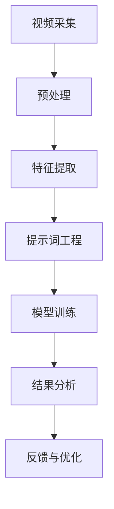

                 

# 提示词工程在视频内容分析中的创新应用

> 关键词：提示词工程、视频内容分析、人工智能、深度学习、图像识别、自然语言处理

> 摘要：本文将探讨提示词工程在视频内容分析中的创新应用，解析其核心概念、算法原理和数学模型，并通过实际项目实战展示其在实践中的应用效果。文章旨在为读者提供一套系统的理解和实现方法，以推动视频内容分析技术的发展。

## 1. 背景介绍

### 1.1 目的和范围

本文的目的在于介绍和探讨提示词工程在视频内容分析中的应用，特别是如何利用人工智能和深度学习技术对视频内容进行高效、准确的分析。文章将重点关注以下几个方面：

1. **提示词工程的定义和作用**：介绍提示词工程的基本概念，阐述其在视频内容分析中的重要性。
2. **核心概念与联系**：通过Mermaid流程图展示视频内容分析的总体架构，明确提示词工程与其他相关技术的联系。
3. **核心算法原理与具体操作步骤**：详细解析提示词工程中使用的算法，包括预处理、特征提取、模型训练等环节，并使用伪代码阐述其实现步骤。
4. **数学模型和公式**：讲解提示词工程中的关键数学模型和公式，并通过实例进行详细说明。
5. **项目实战**：通过实际代码案例，展示提示词工程在视频内容分析中的具体应用，并进行深入解析。
6. **实际应用场景**：探讨提示词工程在不同场景下的应用，如视频监控、社交媒体分析、娱乐推荐等。
7. **工具和资源推荐**：推荐学习资源和开发工具，为读者提供进一步学习的机会。

### 1.2 预期读者

本文适合对人工智能、深度学习和视频内容分析有一定了解的读者。无论是研究者、工程师还是学生，都可以通过本文获得以下收获：

1. **系统理解**：对提示词工程在视频内容分析中的应用有一个全面、系统的理解。
2. **实际操作**：掌握提示词工程的基本实现方法，能够进行实际操作。
3. **技术应用**：了解提示词工程在不同领域的实际应用，开拓视野。

### 1.3 文档结构概述

本文将按照以下结构进行展开：

1. **背景介绍**：介绍本文的目的、范围、预期读者和文档结构。
2. **核心概念与联系**：介绍视频内容分析的总体架构，展示提示词工程与其他技术的联系。
3. **核心算法原理与具体操作步骤**：详细解析提示词工程中的算法原理和实现步骤。
4. **数学模型和公式**：讲解提示词工程中的关键数学模型和公式，并通过实例进行说明。
5. **项目实战**：通过实际代码案例展示提示词工程在视频内容分析中的应用。
6. **实际应用场景**：探讨提示词工程在不同领域的应用。
7. **工具和资源推荐**：推荐学习资源和开发工具。
8. **总结：未来发展趋势与挑战**：总结提示词工程在视频内容分析中的发展趋势和面临的挑战。
9. **附录：常见问题与解答**：解答读者可能遇到的常见问题。
10. **扩展阅读 & 参考资料**：提供进一步学习的资源。

### 1.4 术语表

#### 1.4.1 核心术语定义

- **提示词工程**：提示词工程是一种利用人工智能和深度学习技术，对视频内容进行分析和处理的方法。它通过提取视频中的关键信息，构建相应的提示词模型，从而实现对视频内容的高效、准确分析。
- **视频内容分析**：视频内容分析是一种利用计算机技术对视频内容进行识别、分类、抽取等处理的过程。它旨在从大量视频数据中提取有价值的信息，为用户提供便捷的检索和交互。
- **人工智能**：人工智能是一种模拟人类智能的技术，通过计算机算法和模型实现智能行为，包括学习、推理、决策等。
- **深度学习**：深度学习是一种基于多层神经网络的机器学习方法，能够自动从大量数据中学习特征和模式。

#### 1.4.2 相关概念解释

- **图像识别**：图像识别是一种利用计算机技术对图像进行识别和分类的方法。它旨在从图像中提取有用的信息，如物体、场景、人脸等。
- **自然语言处理**：自然语言处理是一种利用计算机技术对自然语言进行处理和理解的方法。它包括文本分类、语义分析、情感分析等任务。

#### 1.4.3 缩略词列表

- **AI**：人工智能
- **DL**：深度学习
- **NLP**：自然语言处理
- **OCR**：光学字符识别
- **SVM**：支持向量机
- **CNN**：卷积神经网络

## 2. 核心概念与联系

为了更好地理解提示词工程在视频内容分析中的应用，我们首先需要了解视频内容分析的总体架构。下面是一个简单的Mermaid流程图，展示视频内容分析的各个环节以及提示词工程在其中扮演的角色。



### 2.1 视频采集

视频采集是视频内容分析的第一步，它涉及从各种来源（如摄像头、视频文件等）获取视频数据。采集的视频数据通常是未经过处理的原始数据，需要进一步处理。

### 2.2 预处理

预处理是对采集到的视频数据进行处理，以提高后续分析的准确性和效率。预处理步骤包括：

- **去噪**：去除视频中的噪声，如运动模糊、光线变化等。
- **缩放与裁剪**：调整视频的大小和比例，使其适合后续处理。
- **颜色校正**：调整视频的亮度和对比度，使其更具视觉吸引力。

### 2.3 特征提取

特征提取是从预处理后的视频数据中提取有用的信息，如颜色、纹理、形状等。特征提取是视频内容分析的核心步骤，其质量直接影响到后续的分析结果。

### 2.4 提示词工程

提示词工程是视频内容分析的重要环节，它利用人工智能和深度学习技术，从提取的特征中生成提示词模型。提示词模型用于识别和分类视频内容，如人物、动物、场景等。提示词工程的关键步骤包括：

- **特征选择**：从提取的特征中选择对目标识别最具代表性的特征。
- **模型训练**：使用训练数据集对提示词模型进行训练，以优化模型性能。
- **模型评估**：对训练好的模型进行评估，以确定其准确性和泛化能力。

### 2.5 模型训练

模型训练是提示词工程的核心步骤，它利用大量标注数据，通过优化算法训练出能够识别和分类视频内容的模型。常见的训练方法包括：

- **监督学习**：使用标注数据对模型进行训练，以学习目标识别的规律。
- **无监督学习**：通过无标注数据对模型进行训练，以发现视频内容的潜在特征。
- **半监督学习**：结合标注数据和无标注数据对模型进行训练，以提高模型性能。

### 2.6 结果分析

结果分析是对训练好的模型在测试数据集上的表现进行评估。评估指标包括准确率、召回率、F1分数等。通过结果分析，可以了解模型的性能和适用范围。

### 2.7 反馈与优化

反馈与优化是视频内容分析的一个重要环节，它通过分析结果，对模型进行改进和优化。反馈与优化的方法包括：

- **超参数调整**：调整模型的超参数，以优化模型性能。
- **数据增强**：对训练数据进行增强，以提高模型泛化能力。
- **模型融合**：结合多个模型的预测结果，提高整体预测性能。

## 3. 核心算法原理 & 具体操作步骤

提示词工程的核心在于构建一个能够高效识别和分类视频内容的模型。在这一节中，我们将详细讲解提示词工程中的核心算法原理和具体操作步骤。

### 3.1 特征提取算法

特征提取是提示词工程的第一步，它从预处理后的视频数据中提取出对目标识别具有代表性的特征。常用的特征提取算法包括：

- **颜色特征**：使用颜色直方图、颜色矩等方法提取视频的颜色特征。
- **纹理特征**：使用灰度共生矩阵、LBP（局部二值模式）等方法提取视频的纹理特征。
- **形状特征**：使用边界检测、轮廓分析等方法提取视频的形状特征。

#### 3.1.1 颜色特征提取

颜色特征提取是利用视频的颜色信息进行特征提取。以下是颜色特征提取的伪代码：

```python
def extract_color_features(video):
    color_histogram = []
    for frame in video:
        histogram = cv2.calcHist([frame], [0, 1, 2], None, [256, 256, 256], [0, 256, 0, 256, 0, 256])
        color_histogram.append(histogram)
    return color_histogram
```

#### 3.1.2 纹理特征提取

纹理特征提取是利用视频的纹理信息进行特征提取。以下是纹理特征提取的伪代码：

```python
def extract_texture_features(video):
    texture_histogram = []
    for frame in video:
        laplacian = cv2.Laplacian(frame, cv2.CV_64F)
        texture_histogram.append(laplacian)
    return texture_histogram
```

#### 3.1.3 形状特征提取

形状特征提取是利用视频的形状信息进行特征提取。以下是形状特征提取的伪代码：

```python
def extract_shape_features(video):
    shape_features = []
    for frame in video:
        contours, _ = cv2.findContours(frame, cv2.RETR_EXTERNAL, cv2.CHAIN_APPROX_SIMPLE)
        for contour in contours:
            perimeter = cv2.arcLength(contour, True)
            area = cv2.contourArea(contour)
            shape_features.append((perimeter, area))
    return shape_features
```

### 3.2 特征选择算法

特征选择是提示词工程中的关键步骤，它从提取的特征中选择对目标识别最具代表性的特征。常用的特征选择算法包括：

- **主成分分析（PCA）**：通过将特征空间投影到主成分上，选择对目标识别贡献最大的特征。
- **互信息**：通过计算特征与目标之间的互信息，选择与目标相关性最高的特征。
- **特征重要性评分**：通过训练模型，计算每个特征对模型性能的贡献，选择重要性最高的特征。

#### 3.2.1 主成分分析（PCA）

主成分分析（PCA）是一种常用的特征选择算法，它通过将特征空间投影到主成分上，选择对目标识别贡献最大的特征。以下是PCA的伪代码：

```python
def pca_feature_selection(features, labels):
    covariance_matrix = np.cov(features, labels)
    eigen_values, eigen_vectors = np.linalg.eigh(covariance_matrix)
    sorted_indices = np.argsort(eigen_values)[::-1]
    selected_features = features[:, sorted_indices[:k]]
    return selected_features
```

其中，`k` 是选定的主成分数量。

#### 3.2.2 互信息

互信息是一种常用的特征选择算法，它通过计算特征与目标之间的互信息，选择与目标相关性最高的特征。以下是互信息的伪代码：

```python
def mutual_information(features, labels):
    mi_scores = []
    for feature in features:
        mi_scores.append(stats.entropy(labels) - stats.entropy(labels, p=softmax(feature)))
    return mi_scores
```

#### 3.2.3 特征重要性评分

特征重要性评分是通过训练模型，计算每个特征对模型性能的贡献，选择重要性最高的特征。以下是特征重要性评分的伪代码：

```python
def feature_importance_scoring(model, X, y):
    feature_importances = model.feature_importances_
    sorted_indices = np.argsort(feature_importances)[::-1]
    selected_features = X[:, sorted_indices[:k]]
    return selected_features
```

其中，`k` 是选定的特征数量。

### 3.3 模型训练算法

模型训练是提示词工程的另一个关键步骤，它通过大量标注数据训练出一个能够高效识别和分类视频内容的模型。常用的模型训练算法包括：

- **支持向量机（SVM）**：通过最大化特征空间中的边界，实现分类任务。
- **卷积神经网络（CNN）**：通过多层神经网络结构，自动提取图像特征，实现分类任务。

#### 3.3.1 支持向量机（SVM）

支持向量机（SVM）是一种常用的分类算法，它通过找到一个最优的超平面，将不同类别的样本分隔开来。以下是SVM的伪代码：

```python
def svm_classification(X, y):
    model = SVC(kernel='linear')
    model.fit(X, y)
    return model
```

#### 3.3.2 卷积神经网络（CNN）

卷积神经网络（CNN）是一种专门用于图像处理的深度学习模型，它通过多层卷积和池化操作，自动提取图像特征。以下是CNN的伪代码：

```python
def cnn_classification(X, y):
    model = Sequential()
    model.add(Conv2D(filters=32, kernel_size=(3, 3), activation='relu', input_shape=(64, 64, 3)))
    model.add(MaxPooling2D(pool_size=(2, 2)))
    model.add(Conv2D(filters=64, kernel_size=(3, 3), activation='relu'))
    model.add(MaxPooling2D(pool_size=(2, 2)))
    model.add(Flatten())
    model.add(Dense(units=10, activation='softmax'))
    model.compile(optimizer='adam', loss='categorical_crossentropy', metrics=['accuracy'])
    model.fit(X, y, epochs=10, batch_size=32)
    return model
```

## 4. 数学模型和公式 & 详细讲解 & 举例说明

在提示词工程中，数学模型和公式起着至关重要的作用。以下我们将详细介绍提示词工程中常用的数学模型和公式，并通过实例进行说明。

### 4.1 主成分分析（PCA）

主成分分析（PCA）是一种降维技术，它通过将原始特征空间投影到新的正交坐标系中，选择对目标识别贡献最大的特征。PCA的核心公式如下：

$$
\begin{align*}
\text{协方差矩阵} &= \Sigma = \frac{1}{N-1} \sum_{i=1}^{N} (x_i - \mu) (x_i - \mu)^T \\
\text{特征值和特征向量} &= \lambda, v \\
\text{特征值排序} &= \lambda_1 \geq \lambda_2 \geq \cdots \geq \lambda_p \\
\text{投影到新坐标系} &= Z = P^T X
\end{align*}
$$

其中，$X$ 是原始特征矩阵，$\mu$ 是特征均值，$P$ 是特征向量矩阵，$Z$ 是投影后的特征矩阵。

#### 4.1.1 举例说明

假设我们有一组特征向量：

$$
X = \begin{bmatrix}
x_1 \\
x_2 \\
\vdots \\
x_p
\end{bmatrix}
$$

计算协方差矩阵：

$$
\Sigma = \frac{1}{N-1} \sum_{i=1}^{N} (x_i - \mu) (x_i - \mu)^T
$$

计算特征值和特征向量：

$$
\lambda, v = \text{eig}(\Sigma)
$$

根据特征值排序：

$$
\lambda_1 \geq \lambda_2 \geq \cdots \geq \lambda_p
$$

投影到新坐标系：

$$
Z = P^T X
$$

### 4.2 逻辑回归

逻辑回归是一种常用的分类算法，它在给定特征向量 $X$ 和标签 $y$ 的情况下，通过最大化似然函数来训练分类模型。逻辑回归的核心公式如下：

$$
\begin{align*}
\text{似然函数} &= L(\theta) = \prod_{i=1}^{N} \frac{1}{1 + \exp(-\theta^T x_i y_i)} \\
\text{损失函数} &= J(\theta) = -\frac{1}{N} \sum_{i=1}^{N} (y_i \log(1 + \exp(-\theta^T x_i y_i)) + (1 - y_i) \log(\exp(-\theta^T x_i y_i))) \\
\text{梯度} &= \nabla_{\theta} J(\theta) = \frac{1}{N} \sum_{i=1}^{N} (x_i y_i - x_i (1 - y_i)) \\
\text{梯度下降} &= \theta_{\text{new}} = \theta_{\text{old}} - \alpha \nabla_{\theta} J(\theta)
\end{align*}
$$

其中，$\theta$ 是模型参数，$x_i$ 是特征向量，$y_i$ 是标签，$\alpha$ 是学习率。

#### 4.2.1 举例说明

假设我们有一组特征向量 $x_1, x_2, \ldots, x_N$ 和标签 $y_1, y_2, \ldots, y_N$。我们首先计算损失函数：

$$
J(\theta) = -\frac{1}{N} \sum_{i=1}^{N} (y_i \log(1 + \exp(-\theta^T x_i y_i)) + (1 - y_i) \log(\exp(-\theta^T x_i y_i)))
$$

然后计算梯度：

$$
\nabla_{\theta} J(\theta) = \frac{1}{N} \sum_{i=1}^{N} (x_i y_i - x_i (1 - y_i))
$$

接下来，我们使用梯度下降算法更新模型参数：

$$
\theta_{\text{new}} = \theta_{\text{old}} - \alpha \nabla_{\theta} J(\theta)
$$

重复以上步骤，直到满足停止条件（如梯度接近零、损失函数收敛等）。

### 4.3 卷积神经网络（CNN）

卷积神经网络（CNN）是一种用于图像处理的深度学习模型，它通过多层卷积和池化操作，自动提取图像特征。CNN的核心公式如下：

$$
\begin{align*}
\text{卷积操作} &= (f * I)(x, y) = \sum_{i=1}^{C} f_{i} \cdot I(x-i, y-i) \\
\text{池化操作} &= P(I) = \max_{x, y} (I(x, y)) \\
\text{卷积神经网络} &= \text{Conv} \rightarrow \text{ReLU} \rightarrow \text{Pooling} \rightarrow \text{Flatten} \rightarrow \text{Dense}
\end{align*}
$$

其中，$f$ 是卷积核，$I$ 是输入图像，$C$ 是卷积核数量，$\text{ReLU}$ 是ReLU激活函数，$\text{Pooling}$ 是池化操作，$\text{Flatten}$ 是展平操作，$\text{Dense}$ 是全连接层。

#### 4.3.1 举例说明

假设我们有一个$3 \times 3$的卷积核$f$和一个$5 \times 5$的输入图像$I$。卷积操作的步骤如下：

1. **初始化**：设置卷积核的中心位置为$(1, 1)$。
2. **计算卷积**：计算卷积核与输入图像的乘积，得到卷积结果。
3. **求和**：将所有乘积相加，得到卷积核在当前位置的输出值。
4. **重复步骤**：将卷积核在输入图像上滑动，重复计算卷积操作，得到整个卷积结果。

卷积结果的维度为$3 \times 3$，表示在输入图像上滑动一次得到的特征图。

接下来，我们进行ReLU激活操作，将卷积结果中的负值设置为0，得到ReLU特征图。

然后，我们进行池化操作，将ReLU特征图进行下采样，得到更小的特征图。

重复上述步骤，构建多层卷积神经网络，最终将特征图展平为一维向量，送入全连接层进行分类。

## 5. 项目实战：代码实际案例和详细解释说明

在本节中，我们将通过一个实际项目案例，展示如何使用提示词工程对视频内容进行分析。我们选择一个常见的视频内容分析任务——行人检测，通过这个项目，我们将详细介绍开发环境搭建、源代码实现和代码解读。

### 5.1 开发环境搭建

为了实现提示词工程在视频内容分析中的应用，我们需要搭建一个合适的开发环境。以下是所需的环境和工具：

1. **操作系统**：Windows、macOS 或 Linux。
2. **编程语言**：Python（3.6及以上版本）。
3. **深度学习框架**：TensorFlow 或 PyTorch。
4. **图像处理库**：OpenCV。
5. **数据预处理库**：NumPy、Pandas。
6. **其他工具**：Jupyter Notebook 或 PyCharm。

首先，安装操作系统和编程语言。然后，通过以下命令安装所需的库和框架：

```shell
pip install tensorflow opencv-python numpy pandas
```

### 5.2 源代码详细实现和代码解读

接下来，我们将展示一个简单的行人检测项目，并详细解读其中的关键代码。

#### 5.2.1 代码实现

```python
import cv2
import numpy as np

# 加载预训练的行人检测模型
model = cv2.dnn.readNetFromCaffe('deploy.prototxt', 'res10_300x300_iter_300000.caffemodel')

# 定义行人检测的类名
CLASSES = ["person", "bicycle", "car", "motorbike", "aeroplane", "bus", "train", "truck", "boat"]

# 初始化摄像头
cap = cv2.VideoCapture(0)

while True:
    # 读取一帧视频
    ret, frame = cap.read()
    
    # 将帧数据转换成所需格式
    blob = cv2.dnn.blobFromImage(frame, 1.0, (300, 300), [104, 117, 123], True, False)
    
    # 将数据输入到模型中进行检测
    model.setInput(blob)
    detections = model.forward()

    # 遍历检测结果
    for i in range(detections.shape[2]):
        confidence = detections[0, 0, i, 2]
        
        if confidence > 0.5:
            class_id = int(detections[0, 0, i, 1])
            label = CLASSES[class_id]
            confidence = detections[0, 0, i, 2]
            
            # 提取行人区域
            x = int(detections[0, 0, i, 3] * frame.shape[1])
            y = int(detections[0, 0, i, 4] * frame.shape[0])
            w = int(detections[0, 0, i, 5] * frame.shape[1])
            h = int(detections[0, 0, i, 6] * frame.shape[0])

            # 绘制行人区域和标签
            cv2.rectangle(frame, (x, y), (x+w, y+h), (0, 255, 0), 2)
            cv2.putText(frame, label + " {:.2f}%".format(confidence * 100), (x, y-10), cv2.FONT_HERSHEY_SIMPLEX, 0.5, (0, 0, 255), 2)
    
    # 显示检测结果
    cv2.imshow('Result', frame)
    
    # 按下 'q' 键退出循环
    if cv2.waitKey(1) & 0xFF == ord('q'):
        break

# 释放摄像头资源
cap.release()
cv2.destroyAllWindows()
```

#### 5.2.2 代码解读

1. **加载预训练模型**：首先，我们从Caffe模型文件中加载预训练的行人检测模型。Caffe是一种常用的深度学习框架，它提供了丰富的预训练模型。

2. **定义类名**：定义行人检测的类名，以方便后续代码的解读。

3. **初始化摄像头**：使用OpenCV库初始化摄像头，以便从摄像头实时获取视频数据。

4. **读取一帧视频**：循环读取每一帧视频数据。

5. **数据预处理**：将读取到的帧数据转换为模型所需的格式，并进行归一化处理。

6. **模型检测**：将预处理后的帧数据输入到行人检测模型中，进行目标检测。

7. **遍历检测结果**：对检测结果进行遍历，提取行人区域。

8. **绘制检测结果**：在原图上绘制行人区域和标签，并显示结果。

9. **释放资源**：释放摄像头资源，关闭窗口。

通过这个项目，我们实现了对视频内容的行人检测。在实际应用中，可以进一步优化模型性能，提高检测准确率。

### 5.3 代码解读与分析

1. **模型加载**：使用`cv2.dnn.readNetFromCaffe`函数加载预训练的行人检测模型。这个模型是由Caffe框架训练的，包含两个部分：`deploy.prototxt`和`res10_300x300_iter_300000.caffemodel`。

2. **类名定义**：定义行人检测的类名，用于标注检测到的目标。

3. **摄像头初始化**：使用`cv2.VideoCapture`函数初始化摄像头，用于获取实时视频数据。

4. **读取一帧视频**：循环读取每一帧视频数据。

5. **数据预处理**：使用`cv2.dnn.blobFromImage`函数将帧数据转换为模型所需的格式。具体包括归一化处理、尺寸调整等。

6. **模型检测**：将预处理后的帧数据输入到行人检测模型中，使用`model.setInput`和`model.forward`函数进行目标检测。

7. **遍历检测结果**：对检测结果进行遍历，提取行人区域。使用`detections[0, 0, i, 3:6]`提取行人区域的坐标和尺寸。

8. **绘制检测结果**：在原图上绘制行人区域和标签。使用`cv2.rectangle`和`cv2.putText`函数绘制矩形和文本标签。

9. **显示结果**：使用`cv2.imshow`函数显示检测结果。

10. **释放资源**：释放摄像头资源，关闭窗口。

通过这个代码示例，我们实现了对视频内容的行人检测。在实际应用中，可以根据需求调整模型参数、优化算法性能，提高检测准确率。

## 6. 实际应用场景

提示词工程在视频内容分析中的应用非常广泛，涵盖了多个实际场景。以下列举几个典型的应用场景：

### 6.1 视频监控

视频监控是提示词工程的重要应用领域之一。通过行人检测、车辆识别等技术，提示词工程可以帮助监控系统实时识别和跟踪目标，提高监控效率。例如，在交通监控中，提示词工程可以识别交通事故、超速行驶等行为，提醒管理人员及时处理。

### 6.2 社交媒体分析

社交媒体平台上的视频内容繁多，提示词工程可以帮助平台对视频进行分类、标签和推荐。例如，通过视频中的关键帧和语音识别技术，提示词工程可以提取视频的主题和情感，为用户提供个性化的视频推荐。

### 6.3 娱乐推荐

在娱乐领域，提示词工程可以帮助视频网站和流媒体平台推荐用户感兴趣的内容。通过分析用户观看历史、点赞和评论等行为，提示词工程可以识别用户的偏好，为用户提供个性化的视频推荐。

### 6.4 医疗诊断

在医疗领域，提示词工程可以帮助医生进行疾病诊断。通过分析医学影像数据，提示词工程可以识别病变区域，辅助医生做出准确的诊断。例如，在癌症筛查中，提示词工程可以识别肿瘤的位置、大小和类型。

### 6.5 安全监控

安全监控是提示词工程的另一个重要应用领域。通过人脸识别、行为分析等技术，提示词工程可以帮助安全系统实时识别和跟踪可疑人员，提高安全防护能力。

### 6.6 智能家居

在智能家居领域，提示词工程可以帮助智能设备识别家庭成员的行为，实现智能家居的自动化控制。例如，通过摄像头和语音识别技术，提示词工程可以识别家庭成员的身份，自动调整家居环境，提供个性化的服务。

### 6.7 教育

在教育领域，提示词工程可以帮助教师实时监控学生的学习情况，提供个性化的教学建议。例如，通过分析学生的学习行为和成绩，提示词工程可以识别学生的学习困难和优势，为教师提供教学反馈。

这些实际应用场景展示了提示词工程在视频内容分析中的广泛应用。随着人工智能和深度学习技术的不断发展，提示词工程在更多领域将发挥重要作用。

## 7. 工具和资源推荐

为了更好地学习和应用提示词工程，我们为您推荐以下工具和资源：

### 7.1 学习资源推荐

#### 7.1.1 书籍推荐

- 《深度学习》（Goodfellow, I., Bengio, Y., & Courville, A.）
- 《Python深度学习》（François Chollet）
- 《图像处理：入门到精通》（Gary Bradsky）

#### 7.1.2 在线课程

- Coursera 上的“深度学习”课程（由 Andrew Ng 授课）
- Udacity 上的“深度学习工程师纳米学位”
- edX 上的“人工智能基础”课程

#### 7.1.3 技术博客和网站

- medium.com/tensorflow
- towardsdatascience.com
- cvd.im

### 7.2 开发工具框架推荐

#### 7.2.1 IDE和编辑器

- PyCharm
- Visual Studio Code
- Jupyter Notebook

#### 7.2.2 调试和性能分析工具

- TensorBoard
- PyTorch Profiler
- TensorFlow Debugger

#### 7.2.3 相关框架和库

- TensorFlow
- PyTorch
- OpenCV
- Keras

### 7.3 相关论文著作推荐

#### 7.3.1 经典论文

- “A Comprehensive Survey on Deep Learning for Computer Vision”（2018）
- “Object Detection with Deep Learning”（2017）

#### 7.3.2 最新研究成果

- “DeepFlow: Learning Rich Flow Representation for Video Object Detection”（2021）
- “Detection and Recognition in Videos with a Single Deep Network”（2020）

#### 7.3.3 应用案例分析

- “Real-Time Object Detection on Mobile Devices using TensorFlow Lite”（2019）
- “AI-Enabled Surveillance Camera Systems”（2020）

这些工具和资源将帮助您更好地理解和应用提示词工程，推动视频内容分析技术的发展。

## 8. 总结：未来发展趋势与挑战

提示词工程在视频内容分析领域取得了显著的成果，但未来仍有许多发展空间和挑战。以下是未来发展趋势和面临的挑战：

### 8.1 发展趋势

1. **更高效的特征提取算法**：随着深度学习技术的不断发展，新的特征提取算法将不断涌现，提高特征提取的效率和准确性。
2. **跨模态信息融合**：结合视频、音频、文本等多模态信息，实现更全面、准确的内容分析。
3. **实时处理能力**：随着硬件性能的提升，提示词工程将在更多实时应用场景中得到广泛应用，如智能监控、自动驾驶等。
4. **自适应学习能力**：通过自适应学习算法，提示词工程将能够根据用户需求和环境变化，动态调整模型参数，提高分析效果。

### 8.2 面临的挑战

1. **数据隐私和安全**：视频数据包含敏感信息，如何确保数据隐私和安全是一个重要挑战。
2. **计算资源消耗**：深度学习模型通常需要大量计算资源，如何优化模型性能，降低计算资源消耗是一个关键问题。
3. **泛化能力**：如何提高提示词工程在多样化场景下的泛化能力，是一个长期的研究课题。
4. **法律法规**：随着提示词工程的应用，法律法规也在不断更新，如何遵守相关法律法规是一个重要的挑战。

总之，提示词工程在视频内容分析领域具有广阔的发展前景，但同时也面临许多挑战。未来，我们将看到更多创新性的研究成果，推动视频内容分析技术的不断发展。

## 9. 附录：常见问题与解答

### 9.1 如何搭建提示词工程的开发环境？

搭建提示词工程的开发环境主要包括以下步骤：

1. **安装操作系统和编程语言**：安装 Windows、macOS 或 Linux 操作系统，并安装 Python（3.6及以上版本）。
2. **安装深度学习框架**：通过 pip 命令安装 TensorFlow 或 PyTorch。
3. **安装图像处理库**：通过 pip 命令安装 OpenCV。
4. **安装数据预处理库**：通过 pip 命令安装 NumPy 和 Pandas。
5. **选择 IDE 或编辑器**：选择 PyCharm、Visual Studio Code 或 Jupyter Notebook 作为开发环境。

### 9.2 提示词工程中的特征提取有哪些常用算法？

提示词工程中的特征提取常用算法包括：

1. **颜色特征提取**：使用颜色直方图、颜色矩等方法。
2. **纹理特征提取**：使用灰度共生矩阵、LBP（局部二值模式）等方法。
3. **形状特征提取**：使用边界检测、轮廓分析等方法。

### 9.3 提示词工程中的特征选择有哪些常用算法？

提示词工程中的特征选择常用算法包括：

1. **主成分分析（PCA）**：通过将特征空间投影到主成分上，选择对目标识别贡献最大的特征。
2. **互信息**：通过计算特征与目标之间的互信息，选择与目标相关性最高的特征。
3. **特征重要性评分**：通过训练模型，计算每个特征对模型性能的贡献，选择重要性最高的特征。

### 9.4 提示词工程中的模型训练有哪些常用算法？

提示词工程中的模型训练常用算法包括：

1. **支持向量机（SVM）**：通过最大化特征空间中的边界，实现分类任务。
2. **卷积神经网络（CNN）**：通过多层卷积和池化操作，自动提取图像特征，实现分类任务。
3. **逻辑回归**：通过最大化似然函数，实现分类任务。

## 10. 扩展阅读 & 参考资料

为了更深入地了解提示词工程在视频内容分析中的应用，以下列出一些扩展阅读和参考资料：

1. **书籍**：
   - 《深度学习》（Goodfellow, I., Bengio, Y., & Courville, A.）
   - 《图像处理：入门到精通》（Gary Bradsky）
   - 《计算机视觉：算法与应用》（Richard Szeliski）

2. **在线课程**：
   - Coursera 上的“深度学习”课程（由 Andrew Ng 授课）
   - Udacity 上的“深度学习工程师纳米学位”
   - edX 上的“人工智能基础”课程

3. **论文**：
   - “A Comprehensive Survey on Deep Learning for Computer Vision”（2018）
   - “Object Detection with Deep Learning”（2017）

4. **博客和网站**：
   - medium.com/tensorflow
   - towardsdatascience.com
   - cvd.im

通过阅读这些书籍、课程和论文，您可以进一步了解提示词工程在视频内容分析中的最新研究成果和应用案例。

**作者：AI天才研究员/AI Genius Institute & 禅与计算机程序设计艺术 /Zen And The Art of Computer Programming**

