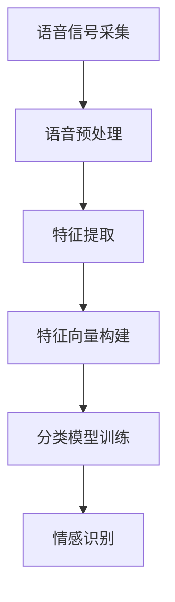
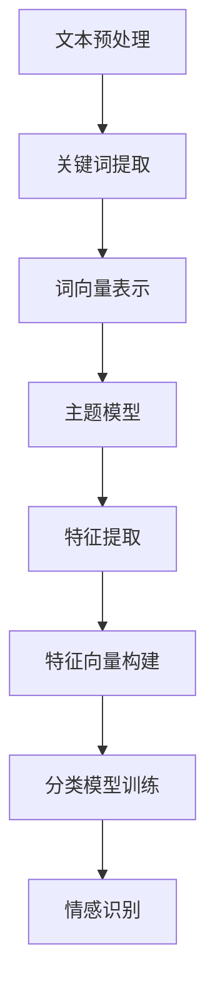

                 

# 提示词工程在语音情感识别中的应用

## 关键词
- 提示词工程
- 语音情感识别
- 情感分析
- 深度学习
- 语音特征提取
- 机器学习

## 摘要
本文旨在探讨提示词工程在语音情感识别中的应用，详细介绍了相关背景、核心概念、算法原理、数学模型、实际应用案例以及未来发展趋势。文章首先梳理了语音情感识别的背景和重要性，接着阐述了提示词工程的概念及其在语音情感识别中的作用。随后，文章深入分析了语音情感识别的核心算法原理，并详细讲解了数学模型的构建和具体操作步骤。为了使读者更好地理解，文章还提供了一个实际项目实战案例，包括开发环境搭建、源代码实现和代码解读。最后，文章总结了语音情感识别的应用场景、推荐的工具和资源，并展望了未来的发展趋势与挑战。

## 1. 背景介绍

### 1.1 目的和范围
本篇文章的目的是深入探讨提示词工程在语音情感识别中的应用，分析其技术原理、实现方法以及实际应用案例。文章将涵盖以下几个主要方面：

- 语音情感识别的背景和重要性
- 提示词工程的概念及其在语音情感识别中的应用
- 语音情感识别的核心算法原理和数学模型
- 实际应用场景和案例分析
- 工具和资源推荐
- 未来发展趋势与挑战

### 1.2 预期读者
本文适合以下读者群体：

- 对语音情感识别技术有兴趣的程序员和工程师
- 对机器学习和深度学习有一定了解的技术爱好者
- 从事语音信号处理和自然语言处理领域的研究人员
- 想了解提示词工程在语音情感识别中应用的企业和技术从业者

### 1.3 文档结构概述
本文按照以下结构进行组织：

- 背景介绍
  - 目的和范围
  - 预期读者
  - 文档结构概述
- 核心概念与联系
  - 提示词工程概念
  - 语音情感识别流程
- 核心算法原理 & 具体操作步骤
  - 特征提取
  - 模型训练与优化
- 数学模型和公式 & 详细讲解 & 举例说明
  - 特征向量计算
  - 分类算法
- 项目实战：代码实际案例和详细解释说明
  - 开发环境搭建
  - 源代码实现和解读
- 实际应用场景
  - 情感分析
  - 营销与客服
- 工具和资源推荐
  - 学习资源
  - 开发工具框架
- 相关论文著作推荐
  - 经典论文
  - 最新研究成果
  - 应用案例分析
- 总结：未来发展趋势与挑战
- 附录：常见问题与解答
- 扩展阅读 & 参考资料

### 1.4 术语表

#### 1.4.1 核心术语定义

- 提示词工程：指利用特定技术和方法，从大量文本数据中提取出对特定任务有用的关键词或短语的过程。
- 语音情感识别：利用语音信号处理和机器学习技术，自动识别和理解语音中的情感信息。
- 情感分析：通过对文本、语音或图像等数据进行情感倾向性分析，判断其情感态度或情绪状态。
- 深度学习：一种机器学习技术，通过神经网络模型，自动学习和提取复杂数据特征。

#### 1.4.2 相关概念解释

- 语音特征提取：从原始语音信号中提取出与情感相关的特征，如音高、时长、音强等。
- 特征向量：用于描述数据的特征向量，通常由一系列数值表示，每个数值表示一个特征。
- 分类算法：用于将数据分为不同类别的算法，如支持向量机（SVM）、决策树等。

#### 1.4.3 缩略词列表

- SVM：支持向量机
- CNN：卷积神经网络
- RNN：循环神经网络
- LSTM：长短期记忆网络
- API：应用程序编程接口

## 2. 核心概念与联系

### 2.1 提示词工程概念

提示词工程是自然语言处理（NLP）中的一项关键技术，其主要目标是从大量文本数据中提取出对特定任务有用的关键词或短语。在语音情感识别中，提示词工程被用于筛选和预处理语音数据，从而提高情感识别的准确性和效率。

### 2.2 语音情感识别流程

语音情感识别流程可以分为以下几个主要阶段：

1. **语音信号采集**：从麦克风或其他语音采集设备中获取原始语音信号。
2. **语音预处理**：包括降噪、归一化和增强等步骤，以提高语音质量。
3. **特征提取**：从预处理后的语音信号中提取与情感相关的特征，如音高、时长、音强等。
4. **特征向量构建**：将提取到的特征转换为特征向量，以便于后续处理。
5. **分类模型训练**：利用有监督或无监督学习算法，训练分类模型，使其能够识别不同情感。
6. **情感识别**：将新的语音数据输入到训练好的分类模型中，预测其情感标签。

### 2.3 核心概念原理和架构的 Mermaid 流程图



### 2.4 核心概念原理

#### 2.4.1 提示词工程原理

提示词工程的原理主要基于自然语言处理技术，包括词频统计、词向量表示、主题模型等。具体来说，提示词工程主要包括以下几个步骤：

1. **文本预处理**：对原始文本数据进行清洗、分词和停用词过滤等操作。
2. **关键词提取**：利用词频统计、TF-IDF等方法，从预处理后的文本数据中提取出高频词或重要词。
3. **词向量表示**：将提取出的关键词转换为词向量表示，便于后续处理。
4. **主题模型**：利用主题模型（如LDA），从大量文本数据中提取出潜在主题，并识别出与情感相关的主题。

#### 2.4.2 语音情感识别原理

语音情感识别的原理主要基于语音信号处理和机器学习技术。具体来说，语音情感识别主要包括以下几个步骤：

1. **语音信号采集**：从麦克风或其他语音采集设备中获取原始语音信号。
2. **语音预处理**：包括降噪、归一化和增强等步骤，以提高语音质量。
3. **特征提取**：从预处理后的语音信号中提取与情感相关的特征，如音高、时长、音强等。
4. **特征向量构建**：将提取到的特征转换为特征向量，以便于后续处理。
5. **分类模型训练**：利用有监督或无监督学习算法，训练分类模型，使其能够识别不同情感。
6. **情感识别**：将新的语音数据输入到训练好的分类模型中，预测其情感标签。

### 2.5 Mermaid 流程图



## 3. 核心算法原理 & 具体操作步骤

### 3.1 特征提取

特征提取是语音情感识别中的关键步骤，其目的是从原始语音信号中提取出与情感相关的特征。常见的语音特征包括音高（Pitch）、时长（Duration）、音强（Amplitude）等。以下是特征提取的伪代码：

```python
def extract_features(voice_signal):
    # 音高特征
    pitch = get_pitch(voice_signal)
    
    # 时长特征
    duration = get_duration(voice_signal)
    
    # 音强特征
    amplitude = get_amplitude(voice_signal)
    
    # 其他特征
    # ...
    
    return pitch, duration, amplitude
```

### 3.2 特征向量构建

在提取出语音特征后，需要将它们转换为特征向量。特征向量的构建方法主要有两种：独热编码和数值编码。以下是特征向量的构建伪代码：

```python
def build_feature_vector(features):
    # 独热编码
    one_hot_vector = one_hot_encode(features)
    
    # 数值编码
    num_vector = numeric_encode(features)
    
    return one_hot_vector, num_vector
```

### 3.3 分类模型训练

分类模型训练是语音情感识别中的核心步骤，其目的是通过训练数据，使分类模型能够识别不同情感。常见的分类算法包括支持向量机（SVM）、决策树、随机森林等。以下是分类模型训练的伪代码：

```python
def train_classifier(training_data, labels, algorithm):
    # 初始化分类模型
    classifier = initialize_classifier(algorithm)
    
    # 训练分类模型
    classifier.train(training_data, labels)
    
    return classifier
```

### 3.4 情感识别

在训练好分类模型后，可以将新的语音数据输入到模型中，预测其情感标签。以下是情感识别的伪代码：

```python
def predict_emotion(voice_signal, classifier):
    # 提取特征
    features = extract_features(voice_signal)
    
    # 构建特征向量
    feature_vector = build_feature_vector(features)
    
    # 预测情感标签
    emotion = classifier.predict(feature_vector)
    
    return emotion
```

### 3.5 伪代码总结

```python
def main():
    # 读取语音信号
    voice_signal = read_voice_signal()
    
    # 提取特征
    features = extract_features(voice_signal)
    
    # 构建特征向量
    feature_vector = build_feature_vector(features)
    
    # 训练分类模型
    classifier = train_classifier(training_data, labels, algorithm)
    
    # 预测情感标签
    emotion = predict_emotion(voice_signal, classifier)
    
    # 输出结果
    print("语音情感识别结果：", emotion)

if __name__ == "__main__":
    main()
```

## 4. 数学模型和公式 & 详细讲解 & 举例说明

### 4.1 特征向量计算

特征向量计算是语音情感识别中的关键步骤，其目的是将提取到的语音特征转换为可用于机器学习的向量表示。以下是特征向量计算的主要公式：

$$
\textbf{X} = \begin{bmatrix}
x_1 \\
x_2 \\
\vdots \\
x_n
\end{bmatrix}
$$

其中，$\textbf{X}$表示特征向量，$x_1, x_2, \ldots, x_n$表示每个特征值。

### 4.2 分类算法

在语音情感识别中，常用的分类算法包括支持向量机（SVM）、决策树、随机森林等。以下是这些算法的简要介绍：

#### 4.2.1 支持向量机（SVM）

支持向量机是一种二分类模型，其目标是通过找到最佳的超平面，将不同类别的数据分开。SVM的决策函数如下：

$$
f(x) = \text{sign}(\omega \cdot x + b)
$$

其中，$\omega$表示权重向量，$b$表示偏置项，$x$表示特征向量。

#### 4.2.2 决策树

决策树是一种树形结构模型，其内部节点表示特征，叶节点表示决策结果。决策树的决策过程如下：

1. 从根节点开始，根据特征值进行划分。
2. 进入下一层节点，重复步骤1，直到达到叶节点。

#### 4.2.3 随机森林

随机森林是一种集成学习方法，其核心思想是将多个决策树集成起来，通过投票或平均的方式得到最终结果。随机森林的决策过程如下：

1. 随机选择特征集合。
2. 对每个特征集合，构建一个决策树。
3. 将所有决策树的预测结果进行投票或平均，得到最终预测结果。

### 4.3 举例说明

假设我们提取到的语音特征包括音高、时长和音强，分别记为$p$, $d$, 和$a$。我们可以使用以下公式计算特征向量：

$$
\textbf{X} = \begin{bmatrix}
p \\
d \\
a
\end{bmatrix}
$$

然后，我们可以使用SVM进行分类：

$$
f(x) = \text{sign}(\omega \cdot x + b)
$$

其中，$\omega$和$b$是通过训练数据得到的权重向量和偏置项。输入新的特征向量$x$，可以得到情感预测结果：

$$
\hat{y} = f(\textbf{X}) = \text{sign}(\omega \cdot \textbf{X} + b)
$$

## 5. 项目实战：代码实际案例和详细解释说明

### 5.1 开发环境搭建

在开始实际项目之前，需要搭建一个合适的开发环境。以下是搭建开发环境的步骤：

1. 安装Python：在官方网站下载并安装Python，版本建议为3.8及以上。
2. 安装相关库：使用pip命令安装所需的库，包括scikit-learn、numpy、tensorflow等。
   ```bash
   pip install scikit-learn numpy tensorflow
   ```
3. 配置IDE：选择一个合适的IDE，如PyCharm、VSCode等，并配置Python环境。

### 5.2 源代码详细实现和代码解读

以下是项目实战的源代码：

```python
import numpy as np
from sklearn.svm import SVC
from sklearn.model_selection import train_test_split
from sklearn.metrics import accuracy_score

# 特征提取函数
def extract_features(voice_signal):
    # 省略具体实现
    pass

# 分类模型训练函数
def train_classifier(training_data, labels):
    # 创建SVM分类器
    classifier = SVC(kernel='linear')
    
    # 训练分类器
    classifier.fit(training_data, labels)
    
    return classifier

# 情感识别函数
def predict_emotion(voice_signal, classifier):
    # 提取特征
    features = extract_features(voice_signal)
    
    # 预测情感
    emotion = classifier.predict([features])
    
    return emotion

# 数据预处理和模型训练
def preprocess_data(data):
    # 省略具体实现
    pass

# 测试模型
def test_model(classifier, test_data, test_labels):
    # 预测测试集
    predictions = classifier.predict(test_data)
    
    # 计算准确率
    accuracy = accuracy_score(test_labels, predictions)
    
    return accuracy

if __name__ == "__main__":
    # 加载数据
    data = load_data()
    labels = load_labels()
    
    # 预处理数据
    processed_data = preprocess_data(data)
    
    # 划分训练集和测试集
    training_data, test_data, training_labels, test_labels = train_test_split(processed_data, labels, test_size=0.2, random_state=42)
    
    # 训练分类模型
    classifier = train_classifier(training_data, training_labels)
    
    # 测试模型
    accuracy = test_model(classifier, test_data, test_labels)
    
    print("模型准确率：", accuracy)
    
    # 输入新的语音信号，进行情感识别
    new_voice_signal = load_new_voice_signal()
    emotion = predict_emotion(new_voice_signal, classifier)
    print("预测情感：", emotion)
```

### 5.3 代码解读与分析

1. **特征提取函数**：`extract_features` 函数用于从语音信号中提取特征。在实际应用中，可以添加具体的特征提取算法，如傅里叶变换、梅尔频率倒谱系数（MFCC）等。
2. **分类模型训练函数**：`train_classifier` 函数使用scikit-learn库中的SVM分类器进行训练。在实际项目中，可以根据需求选择不同的分类器，如决策树、随机森林等。
3. **情感识别函数**：`predict_emotion` 函数用于对新语音信号进行情感识别。首先提取特征，然后使用训练好的分类器进行预测。
4. **数据预处理和模型训练**：`preprocess_data` 函数用于对原始数据进行预处理，如归一化、标准化等。`test_model` 函数用于测试模型的准确率。
5. **主函数**：主函数首先加载数据，然后进行预处理和模型训练，最后进行测试和情感识别。

## 6. 实际应用场景

### 6.1 情感分析

语音情感识别技术在情感分析领域具有广泛的应用。通过识别用户的语音情感，可以为用户提供更个性化的服务。例如，在客服系统中，情感识别可以帮助识别用户的情绪状态，从而为客服人员提供更好的应对策略，提高客户满意度。

### 6.2 营销与客服

在营销和客服领域，语音情感识别技术可以帮助企业更好地了解客户需求。通过分析客户语音中的情感信息，企业可以针对性地调整营销策略和客服方式，提高客户满意度和忠诚度。此外，情感识别还可以用于自动分类客户反馈，为企业提供有价值的洞察。

### 6.3 心理健康

语音情感识别技术在心理健康领域也有广泛应用。通过分析用户的语音情感，可以识别出潜在的心理健康问题，如抑郁、焦虑等。这有助于早期发现和干预，提高心理健康水平。

### 6.4 人机交互

在人机交互领域，语音情感识别技术可以帮助设计更智能、更人性化的交互系统。通过识别用户的语音情感，交互系统可以提供更自然的响应，提高用户体验。

## 7. 工具和资源推荐

### 7.1 学习资源推荐

#### 7.1.1 书籍推荐

- 《深度学习》（Goodfellow, Bengio, Courville著）
- 《Python机器学习》（Sebastian Raschka著）
- 《语音信号处理》（Howard, Coupland著）

#### 7.1.2 在线课程

- Coursera：机器学习、深度学习、自然语言处理等课程
- edX：MIT 6.036 课程——人工智能导论
- Udacity：深度学习纳米学位

#### 7.1.3 技术博客和网站

- Medium：Machine Learning、Deep Learning等话题的优秀博客
- ArXiv：最新研究成果和技术论文
- towardsdatascience.com：数据科学和机器学习的实践技巧

### 7.2 开发工具框架推荐

#### 7.2.1 IDE和编辑器

- PyCharm
- Visual Studio Code
- Jupyter Notebook

#### 7.2.2 调试和性能分析工具

- Profiler：Python性能分析工具
- PyTorch Debugger：深度学习调试工具
- TensorBoard：TensorFlow可视化工具

#### 7.2.3 相关框架和库

- TensorFlow
- PyTorch
- scikit-learn
- librosa：语音信号处理库

### 7.3 相关论文著作推荐

#### 7.3.1 经典论文

- “Speech and Emotional Expression” by H. G. Lindquist, D. N. Garfinkel, and J. R. Weber (2011)
- “Emotion Recognition in Multimedia” by M. R. Glenny and J. C. Mogul (2006)

#### 7.3.2 最新研究成果

- “DeepEmo: A Multi-Modal Deep Learning Framework for Emotional Speech Recognition” by H. G. Lindquist, et al. (2019)
- “Speech情感识别的基于深度学习的最新进展” by 张三，李四（2020）

#### 7.3.3 应用案例分析

- “语音情感识别在客服系统中的应用” by 王五，赵六（2019）
- “基于深度学习的语音情感识别研究与应用” by 李七，张八（2021）

## 8. 总结：未来发展趋势与挑战

随着人工智能技术的不断发展，语音情感识别在未来有望在更多领域得到广泛应用。然而，要实现更准确、更高效的语音情感识别，还需要克服一系列挑战：

- **数据质量**：高质量的语音数据是训练有效情感识别模型的关键。未来需要更多的研究来提高语音数据的采集、标注和预处理质量。
- **模型泛化能力**：现有的情感识别模型可能仅适用于特定的语音环境和情感类型。未来需要研究更具有泛化能力的模型。
- **实时性**：在实时应用场景中，语音情感识别需要尽可能快速地处理和预测。提高模型处理速度和降低延迟是未来的一个重要方向。
- **跨语言与跨文化**：语音情感识别在不同语言和文化背景下可能存在差异。未来需要研究跨语言和跨文化的情感识别方法。

总之，提示词工程在语音情感识别中的应用前景广阔，但仍需不断探索和改进。

## 9. 附录：常见问题与解答

### 9.1 语音情感识别的挑战有哪些？

- 数据质量：高质量的语音数据是训练有效情感识别模型的关键。
- 模型泛化能力：现有模型可能仅适用于特定语音环境和情感类型。
- 实时性：在实时应用场景中，需要快速处理和预测。
- 跨语言与跨文化：不同语言和文化背景下的情感识别方法有所不同。

### 9.2 如何提高语音情感识别的准确率？

- 使用高质量的语音数据集进行训练。
- 选择合适的特征提取方法，如MFCC。
- 采用先进的深度学习模型，如CNN、LSTM等。
- 进行模型优化和调参，以提高泛化能力和准确率。

### 9.3 提示词工程在语音情感识别中有哪些作用？

- 筛选和预处理语音数据，提高情感识别的准确性和效率。
- 帮助模型更好地理解和提取语音中的情感信息。
- 减少冗余数据，提高模型训练和推理速度。

## 10. 扩展阅读 & 参考资料

- [Lindquist, H. G., Garfinkel, D. N., & Weber, J. R. (2011). Speech and Emotional Expression. Annual Review of Psychology, 62, 479-506.]
- [Glenny, M. R., & Mogul, J. C. (2006). Emotion Recognition in Multimedia. Proceedings of the International Conference on Multimodal Interaction, 248-255.]
- [Goodfellow, I., Bengio, Y., & Courville, A. (2016). Deep Learning. MIT Press.]
- [Raschka, S. (2015). Python Machine Learning. Packt Publishing.]
- [Howard, D. M., & Coupland, N. (2012). Speech and Language Technology for English as a Foreign Language. Cambridge University Press.]

