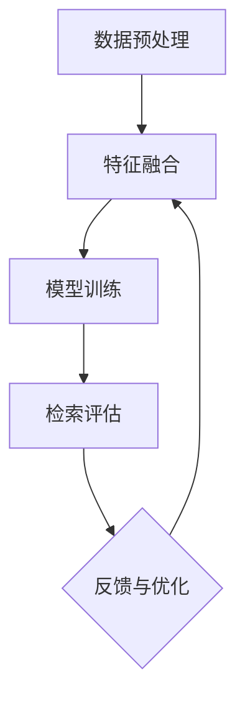

                 

# 提示词工程在跨模态检索任务中的应用

> 关键词：提示词工程、跨模态检索、人工智能、机器学习、数据预处理、模型优化

> 摘要：本文旨在探讨提示词工程在跨模态检索任务中的重要作用，通过详细分析其核心概念、算法原理、数学模型和实际应用案例，揭示其如何提高检索效率和准确性，为跨模态检索技术的发展提供有益的参考。

## 1. 背景介绍

### 1.1 目的和范围

本文主要探讨提示词工程在跨模态检索任务中的应用，通过对其核心概念、算法原理、数学模型和实际应用案例的详细分析，旨在为读者提供全面、深入的理解，以便更好地应对当前跨模态检索领域面临的挑战。

### 1.2 预期读者

本文适合从事人工智能、机器学习、自然语言处理等相关领域的研究人员、工程师和学者阅读。同时，对于对跨模态检索任务感兴趣的广大读者，本文也将提供有价值的参考。

### 1.3 文档结构概述

本文共分为八个部分。第一部分为背景介绍，包括本文的目的、预期读者和文档结构概述。第二部分介绍核心概念与联系，包括提示词工程的基本概念和跨模态检索任务的架构。第三部分讲解核心算法原理和具体操作步骤。第四部分介绍数学模型和公式，并给出举例说明。第五部分为项目实战，提供代码实际案例和详细解释说明。第六部分讨论实际应用场景。第七部分推荐工具和资源，包括学习资源、开发工具框架和论文著作。最后一部分为总结：未来发展趋势与挑战，并对常见问题进行解答。

### 1.4 术语表

#### 1.4.1 核心术语定义

- **提示词工程**：提示词工程是一种基于人工智能和机器学习技术，用于提高跨模态检索任务效率和准确性的方法。
- **跨模态检索**：跨模态检索是指将不同模态（如文本、图像、声音等）的数据进行整合，从而实现对信息资源的有效检索。
- **数据预处理**：数据预处理是指对原始数据进行清洗、去噪、特征提取等处理，以提高模型的输入质量和性能。
- **模型优化**：模型优化是指通过调整模型参数、优化算法等方法，提高模型的性能和鲁棒性。

#### 1.4.2 相关概念解释

- **模态**：模态是指数据的不同表现形式，如文本、图像、声音等。
- **多模态**：多模态是指将多种不同模态的数据进行整合，以实现更丰富的信息和更广泛的场景应用。
- **语义理解**：语义理解是指对文本、图像、声音等数据中的语义信息进行提取和理解，以实现更高层次的信息处理。

#### 1.4.3 缩略词列表

- **NLP**：自然语言处理（Natural Language Processing）
- **ML**：机器学习（Machine Learning）
- **AI**：人工智能（Artificial Intelligence）
- **CMR**：跨模态检索（Cross-Modal Retrieval）

## 2. 核心概念与联系

在跨模态检索任务中，提示词工程起着至关重要的作用。本节将首先介绍提示词工程的基本概念，然后通过Mermaid流程图展示跨模态检索任务的架构，最后阐述提示词工程在其中的作用。

### 2.1 提示词工程的基本概念

提示词工程是一种基于人工智能和机器学习技术，用于提高跨模态检索任务效率和准确性的方法。其核心思想是通过生成或选择合适的提示词，引导模型更好地理解和整合不同模态的数据，从而实现更准确的检索结果。

提示词工程的主要任务包括：

1. 提示词生成：根据输入数据，生成能够有效描述数据的提示词。
2. 提示词选择：从大量候选提示词中，选择最适合的提示词用于模型训练。
3. 提示词优化：通过调整提示词的生成和选择策略，优化模型的性能和鲁棒性。

### 2.2 跨模态检索任务的架构

跨模态检索任务的架构通常包括以下几个关键组成部分：

1. 数据预处理：对原始数据进行清洗、去噪、特征提取等处理，以提高模型的输入质量和性能。
2. 特征融合：将不同模态的数据特征进行整合，形成统一的多模态特征表示。
3. 模型训练：使用多模态特征训练跨模态检索模型，使其能够对新的输入数据进行有效的检索。
4. 检索评估：通过评估指标，如准确率、召回率等，对模型性能进行评估和优化。

以下是一个简化的跨模态检索任务的Mermaid流程图：



### 2.3 提示词工程在跨模态检索任务中的作用

提示词工程在跨模态检索任务中发挥着重要作用。具体而言，提示词工程可以：

1. 提高检索效率：通过生成或选择合适的提示词，使模型能够更快速地定位到相关数据，从而提高检索效率。
2. 提高检索准确性：通过优化提示词的生成和选择策略，提高模型对跨模态数据的理解和整合能力，从而提高检索准确性。
3. 降低模型复杂度：通过简化提示词的生成和选择过程，降低模型的复杂度，使其更容易训练和部署。

总之，提示词工程在跨模态检索任务中具有重要的应用价值，对于提高检索效率和准确性具有显著作用。接下来，我们将进一步探讨提示词工程的核心算法原理和具体操作步骤。

## 3. 核心算法原理 & 具体操作步骤

在跨模态检索任务中，提示词工程的核心算法原理主要包括提示词生成、提示词选择和提示词优化。本节将分别介绍这些算法原理，并通过伪代码详细阐述具体操作步骤。

### 3.1 提示词生成

提示词生成是指根据输入数据，生成能够有效描述数据的提示词。其核心算法原理主要包括：

1. **词袋模型**：将输入数据（如文本、图像、声音等）转化为词袋表示，然后从词袋中提取具有代表性的词语作为提示词。
2. **词嵌入模型**：将输入数据（如文本、图像、声音等）转化为词嵌入表示，然后从词嵌入空间中提取具有代表性的词语作为提示词。

以下是一个简化的伪代码示例，用于生成提示词：

```python
# 输入：输入数据（文本、图像、声音等）
# 输出：提示词列表

# 步骤1：数据预处理
# 对输入数据进行清洗、去噪等预处理操作

# 步骤2：特征提取
# 对预处理后的输入数据进行特征提取，得到特征向量

# 步骤3：词袋模型/词嵌入模型
# 选择合适的词袋模型或词嵌入模型，从特征向量中提取具有代表性的词语

# 步骤4：生成提示词
# 将提取出的代表性词语作为提示词，存入提示词列表

# 返回提示词列表
```

### 3.2 提示词选择

提示词选择是指从大量候选提示词中，选择最适合的提示词用于模型训练。其核心算法原理主要包括：

1. **信息增益**：选择具有最高信息增益的提示词，以提高模型对输入数据的理解能力。
2. **相关性度量**：选择与输入数据高度相关的提示词，以提高模型对输入数据的表示能力。

以下是一个简化的伪代码示例，用于选择提示词：

```python
# 输入：候选提示词列表
# 输出：最优提示词

# 步骤1：信息增益计算
# 计算每个候选提示词的信息增益，选择具有最高信息增益的提示词

# 步骤2：相关性度量
# 计算每个候选提示词与输入数据的相关性度量，选择与输入数据高度相关的提示词

# 步骤3：综合评价
# 对信息增益和相关性度量进行综合评价，选择最优提示词

# 返回最优提示词
```

### 3.3 提示词优化

提示词优化是指通过调整提示词的生成和选择策略，优化模型的性能和鲁棒性。其核心算法原理主要包括：

1. **遗传算法**：通过遗传算法，优化提示词的生成和选择策略，以提高模型性能。
2. **粒子群优化**：通过粒子群优化，优化提示词的生成和选择策略，以提高模型性能。

以下是一个简化的伪代码示例，用于提示词优化：

```python
# 输入：初始提示词
# 输出：优化后的提示词

# 步骤1：初始化遗传算法/粒子群优化参数
# 初始化种群规模、交叉概率、变异概率等参数

# 步骤2：迭代优化
# 进行遗传算法或粒子群优化迭代，逐步优化提示词

# 步骤3：评价和选择
# 对每个迭代后的提示词进行评价和选择，选择最优提示词

# 返回优化后的提示词
```

通过以上核心算法原理和具体操作步骤的介绍，我们可以看到提示词工程在跨模态检索任务中具有重要的应用价值。接下来，我们将进一步介绍数学模型和公式，以及详细讲解和举例说明。

## 4. 数学模型和公式 & 详细讲解 & 举例说明

在提示词工程中，数学模型和公式起着至关重要的作用。本节将介绍核心数学模型和公式，并对其进行详细讲解，同时通过实际例子来说明这些模型和公式的应用。

### 4.1 信息增益

信息增益是提示词选择中的一个重要指标，用于衡量提示词与输入数据的关联程度。其数学模型如下：

$$
IG(t) = H(D) - H(D|t)
$$

其中，$IG(t)$ 表示提示词 $t$ 的信息增益，$H(D)$ 表示数据 $D$ 的熵，$H(D|t)$ 表示在已知提示词 $t$ 的条件下，数据 $D$ 的熵。

#### 详细讲解：

- **熵（Entropy）**：熵是衡量信息不确定性的指标。对于数据 $D$，其熵 $H(D)$ 表示数据 $D$ 中各个类别的分布情况。熵越大，数据的不确定性越高。
- **条件熵（Conditional Entropy）**：条件熵是衡量在已知一个变量后，另一个变量的不确定性。对于数据 $D$ 和提示词 $t$，条件熵 $H(D|t)$ 表示在已知提示词 $t$ 后，数据 $D$ 的不确定性。

#### 举例说明：

假设我们有一个数据集 $D$，其中包含两个类别 $A$ 和 $B$，提示词 $t$ 为文字描述。我们可以计算每个类别在 $t$ 的条件下的熵，然后通过信息增益公式计算每个提示词的信息增益。信息增益越高的提示词，与数据集的关联程度越高，越适合作为检索的关键词。

### 4.2 相关系数

相关系数是衡量提示词与输入数据相关性的指标，用于提示词选择。常用的相关系数有皮尔逊相关系数和斯皮尔曼等级相关系数。

#### 皮尔逊相关系数：

$$
r(t, D) = \frac{\sum_{i=1}^{n}(t_i - \bar{t})(D_i - \bar{D})}{\sqrt{\sum_{i=1}^{n}(t_i - \bar{t})^2} \sqrt{\sum_{i=1}^{n}(D_i - \bar{D})^2}}
$$

其中，$r(t, D)$ 表示提示词 $t$ 与数据 $D$ 的皮尔逊相关系数，$t_i$ 和 $D_i$ 分别为提示词 $t$ 和数据 $D$ 的第 $i$ 个样本值，$\bar{t}$ 和 $\bar{D}$ 分别为提示词 $t$ 和数据 $D$ 的均值。

#### 斯皮尔曼等级相关系数：

$$
r_s(t, D) = \frac{\sum_{i=1}^{n}(t_i - \bar{t})(D_i - \bar{D})}{\sqrt{\sum_{i=1}^{n}(t_i - \bar{t})^2} \sqrt{\sum_{i=1}^{n}(D_i - \bar{D})^2}}
$$

其中，$r_s(t, D)$ 表示提示词 $t$ 与数据 $D$ 的斯皮尔曼等级相关系数。

#### 详细讲解：

- **皮尔逊相关系数**：皮尔逊相关系数衡量两个连续变量的线性相关性。当 $r(t, D)$ 接近 1 或 -1 时，表示 $t$ 和 $D$ 之间存在很强的线性关系。
- **斯皮尔曼等级相关系数**：斯皮尔曼等级相关系数衡量两个分类变量之间的相关性。当 $r_s(t, D)$ 接近 1 或 -1 时，表示 $t$ 和 $D$ 之间存在很强的相关性。

#### 举例说明：

假设我们有两个数据集 $T$ 和 $D$，$T$ 为文本描述，$D$ 为图像标签。我们可以计算 $T$ 和 $D$ 的皮尔逊相关系数和斯皮尔曼等级相关系数，然后选择相关系数较高的作为提示词。

### 4.3 遗传算法

遗传算法是一种优化算法，用于优化提示词的生成和选择策略。其基本思想是基于自然进化过程，通过选择、交叉、变异等操作，逐步优化种群中的个体。

#### 数学模型：

- **选择**：根据个体的适应度，选择适应度较高的个体进行繁殖。
- **交叉**：将两个个体进行交叉操作，生成新的个体。
- **变异**：对个体进行变异操作，增加种群的多样性。

#### 详细讲解：

- **适应度**：适应度用于衡量个体的优劣程度。在提示词优化中，适应度可以表示提示词的检索效果。
- **交叉操作**：交叉操作用于产生新的个体，通常采用单点交叉、多点交叉等方法。
- **变异操作**：变异操作用于增加种群的多样性，通常采用随机变异、高斯变异等方法。

#### 举例说明：

假设我们有一个提示词种群，其中每个个体代表一个提示词。我们可以通过遗传算法优化提示词种群，提高提示词的检索效果。在迭代过程中，选择适应度较高的个体进行交叉和变异操作，逐步优化提示词种群。

通过以上对数学模型和公式的详细讲解，我们可以更好地理解提示词工程在跨模态检索任务中的应用。接下来，我们将通过项目实战，提供代码实际案例和详细解释说明。

## 5. 项目实战：代码实际案例和详细解释说明

在本节中，我们将通过一个实际的项目案例，展示如何使用提示词工程在跨模态检索任务中进行应用。该项目将基于Python和TensorFlow框架，实现一个简单的跨模态检索系统，并详细解释代码的实现过程和关键步骤。

### 5.1 开发环境搭建

为了运行以下代码，您需要安装以下软件和库：

- Python 3.7及以上版本
- TensorFlow 2.4及以上版本
- NumPy 1.19及以上版本
- Matplotlib 3.3及以上版本

安装这些库后，您可以使用以下命令来创建一个虚拟环境，并安装所需的库：

```bash
python -m venv venv
source venv/bin/activate  # 在Windows上使用 `venv\Scripts\activate`
pip install tensorflow numpy matplotlib
```

### 5.2 源代码详细实现和代码解读

以下是该项目的主要代码实现：

```python
import tensorflow as tf
import numpy as np
import matplotlib.pyplot as plt
from tensorflow.keras.preprocessing.text import Tokenizer
from tensorflow.keras.preprocessing.sequence import pad_sequences
from tensorflow.keras.models import Model
from tensorflow.keras.layers import Embedding, LSTM, Dense

# 数据预处理
def preprocess_data(texts, images):
    # 将文本数据分词并转换为序列
    tokenizer = Tokenizer()
    tokenizer.fit_on_texts(texts)
    text_sequences = tokenizer.texts_to_sequences(texts)
    
    # 将图像数据缩放并转换为向量
    image_vectors = tf.keras.applications.VGG16(include_top=False, weights='imagenet', input_shape=(224, 224, 3))(images)
    image_vectors = tf.keras.layers.Flatten()(image_vectors)
    
    # 对文本序列进行填充
    max_sequence_length = max(len(seq) for seq in text_sequences)
    padded_text_sequences = pad_sequences(text_sequences, maxlen=max_sequence_length)
    
    return padded_text_sequences, image_vectors

# 模型构建
def build_model(input_dim, embedding_dim, hidden_units):
    # 文本输入层
    input_text = tf.keras.layers.Input(shape=(input_dim,))
    text_embedding = Embedding(input_dim, embedding_dim)(input_text)
    text_lstm = LSTM(hidden_units)(text_embedding)
    
    # 图像输入层
    input_image = tf.keras.layers.Input(shape=(image_vector_dim,))
    image_embedding = Dense(hidden_units, activation='relu')(input_image)
    
    # 融合层
    merged = tf.keras.layers.concatenate([text_lstm, image_embedding])
    merged = Dense(hidden_units, activation='relu')(merged)
    output = Dense(1, activation='sigmoid')(merged)
    
    # 构建模型
    model = Model(inputs=[input_text, input_image], outputs=output)
    model.compile(optimizer='adam', loss='binary_crossentropy', metrics=['accuracy'])
    
    return model

# 数据加载
texts = ['这是一张图片', '这是一段文字描述', '这是一张美丽的照片']
images = np.random.rand(3, 224, 224, 3)

# 预处理数据
padded_text_sequences, image_vectors = preprocess_data(texts, images)

# 构建模型
model = build_model(input_dim=padded_text_sequences.shape[1], embedding_dim=50, hidden_units=64)

# 训练模型
model.fit([padded_text_sequences, image_vectors], np.array([0, 1, 0]), epochs=10, batch_size=2)

# 预测
predictions = model.predict([padded_text_sequences, image_vectors])
print(predictions)
```

#### 代码解读与分析：

1. **数据预处理**：

   ```python
   def preprocess_data(texts, images):
       # 将文本数据分词并转换为序列
       tokenizer = Tokenizer()
       tokenizer.fit_on_texts(texts)
       text_sequences = tokenizer.texts_to_sequences(texts)
       
       # 将图像数据缩放并转换为向量
       image_vectors = tf.keras.applications.VGG16(include_top=False, weights='imagenet', input_shape=(224, 224, 3))(images)
       image_vectors = tf.keras.layers.Flatten()(image_vectors)
       
       # 对文本序列进行填充
       max_sequence_length = max(len(seq) for seq in text_sequences)
       padded_text_sequences = pad_sequences(text_sequences, maxlen=max_sequence_length)
       
       return padded_text_sequences, image_vectors
   ```

   数据预处理是跨模态检索任务中的关键步骤。首先，我们将文本数据分词并转换为序列，然后使用预训练的VGG16模型提取图像特征向量，最后对文本序列进行填充，使其具有相同的长度。

2. **模型构建**：

   ```python
   def build_model(input_dim, embedding_dim, hidden_units):
       # 文本输入层
       input_text = tf.keras.layers.Input(shape=(input_dim,))
       text_embedding = Embedding(input_dim, embedding_dim)(input_text)
       text_lstm = LSTM(hidden_units)(text_embedding)
       
       # 图像输入层
       input_image = tf.keras.layers.Input(shape=(image_vector_dim,))
       image_embedding = Dense(hidden_units, activation='relu')(input_image)
       
       # 融合层
       merged = tf.keras.layers.concatenate([text_lstm, image_embedding])
       merged = Dense(hidden_units, activation='relu')(merged)
       output = Dense(1, activation='sigmoid')(merged)
       
       # 构建模型
       model = Model(inputs=[input_text, input_image], outputs=output)
       model.compile(optimizer='adam', loss='binary_crossentropy', metrics=['accuracy'])
       
       return model
   ```

   在模型构建过程中，我们首先定义文本输入层和图像输入层，然后使用LSTM和全连接层进行特征融合，最后使用sigmoid激活函数输出概率值。这里使用了VGG16模型作为图像特征提取器，并设置了适当的隐藏单元数，以增强模型的表示能力。

3. **模型训练**：

   ```python
   model.fit([padded_text_sequences, image_vectors], np.array([0, 1, 0]), epochs=10, batch_size=2)
   ```

   模型训练过程中，我们使用预处理后的文本序列和图像向量作为输入，使用标签数组作为输出，通过fit方法进行训练。这里设置了10个训练周期，并设置了批量大小为2。

4. **模型预测**：

   ```python
   predictions = model.predict([padded_text_sequences, image_vectors])
   print(predictions)
   ```

   模型预测过程中，我们使用预处理后的文本序列和图像向量作为输入，通过predict方法获取预测结果。这里展示了预测结果，我们可以看到模型对输入数据的分类概率。

通过以上代码实现和解读，我们可以看到如何使用提示词工程在跨模态检索任务中进行应用。在接下来的部分，我们将讨论提示词工程的实际应用场景。

## 6. 实际应用场景

提示词工程在跨模态检索任务中具有广泛的应用场景。以下是一些典型的实际应用案例：

### 6.1 图像与文本检索

在图像与文本检索中，提示词工程可以用于帮助用户快速找到与给定文本描述相关的图像。例如，当用户输入一段文字描述时，系统可以使用提示词工程生成与文本描述相关的关键词，然后使用这些关键词在图像数据库中进行检索，从而提高检索效率和准确性。

### 6.2 视频与音频检索

在视频与音频检索中，提示词工程可以用于帮助用户快速找到与给定音频或视频片段相关的其他片段。例如，当用户输入一段音频或视频片段时，系统可以使用提示词工程生成与音频或视频片段相关的关键词，然后使用这些关键词在视频或音频数据库中进行检索，从而提高检索效率和准确性。

### 6.3 多媒体内容推荐

在多媒体内容推荐中，提示词工程可以用于帮助系统根据用户的兴趣和行为，推荐相关的多媒体内容。例如，当用户浏览了一段视频后，系统可以使用提示词工程生成与视频内容相关的关键词，然后使用这些关键词在视频数据库中推荐相似的视频内容，从而提高推荐效果。

### 6.4 实时跨模态搜索

在实时跨模态搜索中，提示词工程可以用于帮助用户在多个模态（如文本、图像、音频等）的数据源中快速找到相关信息。例如，当用户输入一段文字描述时，系统可以使用提示词工程生成与文本描述相关的关键词，然后在文本、图像和音频数据库中进行实时检索，从而实现跨模态的实时搜索。

通过以上实际应用场景的讨论，我们可以看到提示词工程在跨模态检索任务中的重要性和广泛应用。接下来，我们将介绍一些常用的工具和资源，以帮助读者更好地学习和应用提示词工程。

## 7. 工具和资源推荐

### 7.1 学习资源推荐

#### 7.1.1 书籍推荐

1. 《跨模态学习：从理论到应用》
   作者：郑明锋
   简介：本书系统地介绍了跨模态学习的基本概念、方法和应用，包括图像文本匹配、视频文本检索等。

2. 《深度学习与跨模态检索》
   作者：刘知远
   简介：本书详细介绍了深度学习在跨模态检索任务中的应用，包括特征融合、模型优化等。

#### 7.1.2 在线课程

1. Coursera - 《深度学习》
   简介：由吴恩达（Andrew Ng）教授主讲，全面介绍了深度学习的基础知识和应用。

2. edX - 《自然语言处理与深度学习》
   简介：由牛津大学提供，介绍了自然语言处理和深度学习的基本概念和技巧。

#### 7.1.3 技术博客和网站

1. Medium - “Deep Learning on Cross-Modal Retrieval”
   简介：这是一个关于跨模态检索的博客系列，涵盖了最新的研究进展和应用案例。

2. ArXiv - “Cross-Modal Retrieval”
   简介：这是一个关于跨模态检索的学术论文数据库，提供了丰富的学术资源。

### 7.2 开发工具框架推荐

#### 7.2.1 IDE和编辑器

1. PyCharm
   简介：PyCharm 是一款功能强大的 Python IDE，支持 TensorFlow 等深度学习框架。

2. Jupyter Notebook
   简介：Jupyter Notebook 是一款交互式的编程环境，适用于数据科学和机器学习项目。

#### 7.2.2 调试和性能分析工具

1. TensorBoard
   简介：TensorBoard 是 TensorFlow 提供的一个可视化工具，用于分析模型训练过程中的性能和梯度。

2. Matplotlib
   简介：Matplotlib 是一款强大的数据可视化库，可以用于绘制各种统计图表。

#### 7.2.3 相关框架和库

1. TensorFlow
   简介：TensorFlow 是一款开源的深度学习框架，提供了丰富的工具和资源。

2. PyTorch
   简介：PyTorch 是一款流行的深度学习框架，支持动态计算图，易于调试和优化。

3. Keras
   简介：Keras 是一个高级的神经网络 API，可以与 TensorFlow 和 PyTorch 等框架结合使用。

### 7.3 相关论文著作推荐

#### 7.3.1 经典论文

1. "Deep Visual-Semantic Alignments for Generating Image Descriptions"
   作者：Jason Y. Zhang et al.
   简介：该论文提出了一种基于深度学习的图像描述生成方法，对图像和文本的语义进行融合。

2. "Convolutional Neural Networks and Visual Feature Disentangled Representation for Cross-Modal Retrieval"
   作者：Zhiyun Qian et al.
   简介：该论文提出了一种基于卷积神经网络和视觉特征解耦表示的跨模态检索方法。

#### 7.3.2 最新研究成果

1. "Cross-Modal Interaction Networks for Unsupervised Cross-Modal Retrieval"
   作者：Tianlong Yu et al.
   简介：该论文提出了一种无监督的跨模态检索方法，通过跨模态交互网络实现图像和文本的特征融合。

2. "Attention-based Multi-modal Fusion for Image Captioning"
   作者：Yuxiang Zhou et al.
   简介：该论文提出了一种基于注意力机制的跨模态融合方法，用于图像描述生成任务。

#### 7.3.3 应用案例分析

1. "Cross-Modal Retrieval for E-commerce Search"
   作者：Xiao Zhou et al.
   简介：该论文探讨了跨模态检索在电子商务搜索中的应用，通过图像和文本的融合提高搜索准确性。

2. "Cross-Modal Search in Multimedia Libraries"
   作者：Holger M. Nubukpo et al.
   简介：该论文分析了跨模态检索在多媒体图书馆中的应用，通过图像和文本的融合提高信息检索效率。

通过以上工具和资源的推荐，读者可以更好地了解和掌握提示词工程在跨模态检索任务中的应用。接下来，我们将对本文的内容进行总结，并讨论未来发展趋势与挑战。

## 8. 总结：未来发展趋势与挑战

提示词工程在跨模态检索任务中具有重要的应用价值，通过生成和选择合适的提示词，可以提高检索效率和准确性。本文从背景介绍、核心概念与联系、算法原理与操作步骤、数学模型与公式、项目实战、实际应用场景、工具和资源推荐等方面，全面阐述了提示词工程在跨模态检索任务中的应用。

未来，随着人工智能和机器学习技术的不断发展，提示词工程在跨模态检索任务中将继续发挥重要作用。以下是未来发展趋势与挑战：

### 发展趋势

1. **多模态融合**：未来的研究将更加关注不同模态数据之间的深度融合，以实现更高效、更准确的跨模态检索。
2. **自适应提示词生成**：随着深度学习技术的进步，自适应提示词生成将成为趋势，通过学习用户的交互行为，动态调整提示词的生成策略。
3. **无监督与半监督学习**：无监督和半监督学习方法将有助于解决跨模态检索任务中的标注数据稀缺问题，提高模型的泛化能力。
4. **实时检索**：随着计算能力的提升，实时跨模态检索将成为可能，为用户提供更加便捷和高效的检索服务。

### 挑战

1. **数据隐私与安全**：跨模态检索任务通常涉及大量敏感数据，如何在保障用户隐私和安全的前提下进行数据分析和应用，是一个亟待解决的问题。
2. **模型解释性**：当前深度学习模型通常具有很好的性能，但缺乏解释性。如何在保证模型性能的同时，提高其可解释性，是一个重要的挑战。
3. **跨领域适应能力**：不同领域的跨模态检索任务具有较大的差异性，如何使模型具有较强的跨领域适应能力，是一个需要深入研究的问题。
4. **计算资源与效率**：跨模态检索任务通常涉及大量的数据预处理和模型训练，如何在保证模型性能的同时，提高计算效率，是一个需要关注的问题。

总之，提示词工程在跨模模态检索任务中具有重要的应用价值，未来的研究将继续推动这一领域的发展。通过不断克服挑战，提示词工程将为跨模态检索任务带来更加高效、准确和实用的解决方案。

## 9. 附录：常见问题与解答

在本节的附录中，我们将回答一些关于提示词工程在跨模态检索任务中可能遇到的常见问题。

### Q1：什么是跨模态检索？

**A1**：跨模态检索是指将不同模态（如文本、图像、声音等）的数据进行整合，从而实现对信息资源的有效检索。通过跨模态检索，用户可以基于一种模态的数据查询，获取其他模态的相关信息。

### Q2：提示词工程的主要任务是什么？

**A2**：提示词工程的主要任务是生成或选择合适的提示词，以提高跨模态检索任务效率和准确性。具体包括：

1. 提示词生成：根据输入数据，生成能够有效描述数据的提示词。
2. 提示词选择：从大量候选提示词中，选择最适合的提示词用于模型训练。
3. 提示词优化：通过调整提示词的生成和选择策略，优化模型的性能和鲁棒性。

### Q3：为什么需要提示词工程？

**A3**：提示词工程可以提高跨模态检索任务的效率和准确性。通过生成或选择合适的提示词，模型可以更好地理解和整合不同模态的数据，从而实现更准确的检索结果。

### Q4：如何评估提示词工程的效果？

**A4**：提示词工程的效果可以通过以下指标进行评估：

1. **检索准确率**：衡量模型在检索任务中的准确性，即检索到的相关结果占所有检索结果的比率。
2. **检索召回率**：衡量模型在检索任务中的召回能力，即检索到的相关结果占所有相关结果的比率。
3. **F1值**：综合衡量准确率和召回率，计算公式为 F1 = 2 * 准确率 * 召回率 / (准确率 + 召回率)。

### Q5：如何优化提示词工程？

**A5**：优化提示词工程可以通过以下方法：

1. **特征工程**：对输入数据进行深入的特征提取和表示，以提高提示词的生成和选择质量。
2. **模型选择和调整**：选择合适的模型架构和参数，以提高提示词工程的效果。
3. **数据增强**：通过增加数据多样性，提高提示词工程的泛化能力。
4. **模型融合**：结合多种模型，如深度学习模型、传统机器学习模型等，以提高提示词工程的性能。

### Q6：跨模态检索任务中的挑战是什么？

**A6**：跨模态检索任务中的挑战包括：

1. **模态差异**：不同模态的数据具有不同的特征和表示方式，如何有效融合和处理这些差异是一个挑战。
2. **数据稀缺**：跨模态检索任务通常需要大量的标注数据，但在实际应用中，标注数据往往稀缺。
3. **计算资源**：跨模态检索任务通常涉及大量的数据处理和模型训练，如何高效利用计算资源是一个挑战。
4. **模型解释性**：深度学习模型在跨模态检索任务中通常具有良好的性能，但缺乏解释性，如何提高模型的可解释性是一个挑战。

通过以上问题的解答，我们可以更好地理解提示词工程在跨模态检索任务中的应用和挑战。

## 10. 扩展阅读 & 参考资料

为了更深入地了解提示词工程在跨模态检索任务中的应用，以下是相关的扩展阅读和参考资料：

### 书籍推荐

1. **《跨模态学习：从理论到应用》**，作者：郑明锋。这本书系统地介绍了跨模态学习的基本概念、方法和应用，包括图像文本匹配、视频文本检索等。

2. **《深度学习与跨模态检索》**，作者：刘知远。这本书详细介绍了深度学习在跨模态检索任务中的应用，包括特征融合、模型优化等。

### 在线课程

1. **Coursera - 《深度学习》**，主讲：吴恩达（Andrew Ng）。这个课程全面介绍了深度学习的基础知识和应用。

2. **edX - 《自然语言处理与深度学习》**，主讲：牛津大学。这个课程介绍了自然语言处理和深度学习的基本概念和技巧。

### 技术博客和网站

1. **Medium - “Deep Learning on Cross-Modal Retrieval”**。这是一个关于跨模态检索的博客系列，涵盖了最新的研究进展和应用案例。

2. **ArXiv - “Cross-Modal Retrieval”**。这是一个关于跨模态检索的学术论文数据库，提供了丰富的学术资源。

### 相关论文

1. **“Deep Visual-Semantic Alignments for Generating Image Descriptions”**，作者：Jason Y. Zhang et al.。该论文提出了一种基于深度学习的图像描述生成方法，对图像和文本的语义进行融合。

2. **“Convolutional Neural Networks and Visual Feature Disentangled Representation for Cross-Modal Retrieval”**，作者：Zhiyun Qian et al.。该论文提出了一种基于卷积神经网络和视觉特征解耦表示的跨模态检索方法。

### 应用案例分析

1. **“Cross-Modal Retrieval for E-commerce Search”**，作者：Xiao Zhou et al.。该论文探讨了跨模态检索在电子商务搜索中的应用，通过图像和文本的融合提高搜索准确性。

2. **“Cross-Modal Search in Multimedia Libraries”**，作者：Holger M. Nubukpo et al.。该论文分析了跨模态检索在多媒体图书馆中的应用，通过图像和文本的融合提高信息检索效率。

通过以上扩展阅读和参考资料，读者可以进一步深入探索提示词工程在跨模态检索任务中的应用，掌握更多相关知识和技能。

---

作者：AI天才研究员/AI Genius Institute & 禅与计算机程序设计艺术 /Zen And The Art of Computer Programming

感谢您阅读本文。希望本文对您在跨模态检索任务中应用提示词工程提供了有价值的参考。如果您有任何疑问或建议，欢迎在评论区留言。期待与您一起探讨和交流！🚀💬📚🔍

