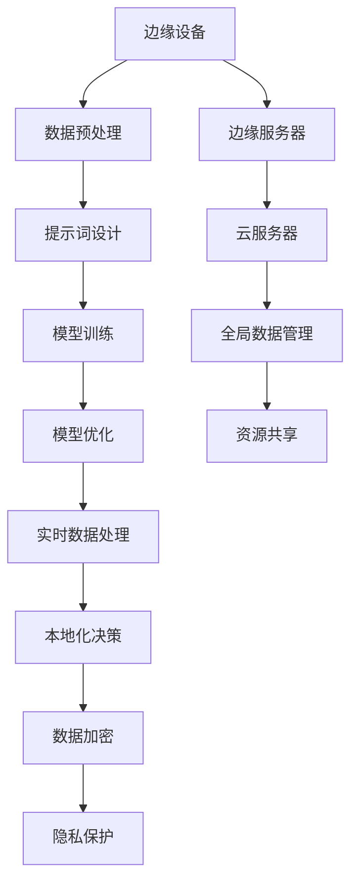

                 

# 提示词工程在边缘计算中的应用策略

## 关键词
边缘计算，提示词工程，应用策略，优化，实时处理，智能设备

## 摘要
本文将深入探讨提示词工程在边缘计算领域的应用策略。边缘计算作为一种新兴技术，正日益成为分布式计算的关键组成部分。提示词工程，通过使用算法和数据分析技术，为边缘设备提供有效的数据处理和优化能力。本文将首先介绍边缘计算的基本概念和重要性，接着阐述提示词工程的核心原理和方法，并通过具体案例展示其在边缘计算中的应用策略。最后，文章将展望提示词工程在边缘计算领域的发展趋势和面临的挑战。

## 1. 背景介绍

### 1.1 目的和范围
本文旨在探讨如何利用提示词工程技术优化边缘计算的性能和效率。边缘计算正逐渐成为云计算和物联网（IoT）的关键连接点，它能够将数据处理和计算能力推向网络的边缘，从而实现更快速、更低延迟的服务响应。提示词工程作为一种先进的数据处理方法，可以在边缘设备上提供高效的实时数据处理能力。本文将围绕以下主题展开：
- 边缘计算的基本概念和架构
- 提示词工程的核心原理和方法
- 提示词工程在边缘计算中的应用策略
- 提示词工程技术的实际案例和效果评估

### 1.2 预期读者
本文面向希望深入了解边缘计算和提示词工程技术的读者，包括但不限于：
- 计算机科学和软件工程专业的学生和研究者
- 物联网和边缘计算领域的技术开发者
- 网络架构师和系统管理员
- 对新兴技术有浓厚兴趣的科技爱好者

### 1.3 文档结构概述
本文结构如下：
1. 引言：介绍边缘计算和提示词工程的背景及其重要性。
2. 背景介绍：详细阐述边缘计算和提示词工程的基本概念和架构。
3. 核心概念与联系：分析提示词工程与边缘计算的内在联系，并使用Mermaid流程图展示核心架构。
4. 核心算法原理 & 具体操作步骤：介绍提示词工程的关键算法原理和操作步骤，并使用伪代码进行详细阐述。
5. 数学模型和公式 & 详细讲解 & 举例说明：解释提示词工程中的数学模型和公式，并举例说明其实际应用。
6. 项目实战：提供具体的代码实际案例，并对代码进行详细解释说明。
7. 实际应用场景：展示提示词工程在边缘计算中的实际应用案例。
8. 工具和资源推荐：推荐相关学习资源和开发工具。
9. 总结：讨论提示词工程在边缘计算领域的未来发展趋势和挑战。
10. 附录：提供常见问题与解答以及扩展阅读和参考资料。

### 1.4 术语表

#### 1.4.1 核心术语定义
- **边缘计算（Edge Computing）**：一种分布式计算架构，将数据处理和计算任务从中心化的云端转移到网络边缘的终端设备上。
- **提示词工程（Prompt Engineering）**：一种基于自然语言处理技术的方法，通过设计有效的提示词来引导模型进行特定任务。
- **实时处理（Real-time Processing）**：在限定时间内快速处理数据的能力，以满足对实时响应的需求。

#### 1.4.2 相关概念解释
- **云计算（Cloud Computing）**：通过互联网提供动态易扩展的计算资源，包括存储、处理能力和应用程序。
- **物联网（Internet of Things，IoT）**：将物理设备通过互联网连接起来，实现智能交互和数据共享。

#### 1.4.3 缩略词列表
- **IoT**：物联网
- **ML**：机器学习
- **NLP**：自然语言处理
- **EDA**：边缘数据分析

## 2. 核心概念与联系

### 2.1 边缘计算的基本概念
边缘计算是云计算的延伸，其核心思想是将数据处理和计算任务从云端转移到网络边缘。边缘设备通常包括智能手机、平板电脑、物联网设备、智能传感器等。边缘计算的优势在于能够实现更低的延迟、更高的可靠性和更好的数据隐私保护。

#### 2.1.1 边缘计算的架构
边缘计算系统通常包括以下几个关键组成部分：
- **边缘设备**：执行数据处理和计算任务，如智能传感器和物联网设备。
- **边缘服务器**：提供计算资源和存储能力，以支持边缘设备之间的协作和数据共享。
- **云服务器**：作为边缘计算系统的中心节点，提供全局数据管理和资源共享。

#### 2.1.2 边缘计算的优势
- **低延迟**：数据处理在边缘设备上进行，减少了数据传输的时间，提高了实时响应能力。
- **高可靠性**：边缘设备可以独立运行，降低了单点故障的风险。
- **数据隐私**：在边缘设备上进行数据处理，减少了数据传输和存储的需求，提高了数据隐私性。

### 2.2 提示词工程的核心原理
提示词工程是一种通过设计有效的提示词来引导机器学习模型进行特定任务的方法。提示词可以是自然语言文本，也可以是其他形式的描述性信息。

#### 2.2.1 提示词工程的方法
- **数据预处理**：通过数据清洗、归一化和特征提取等技术，将原始数据转化为适合模型处理的格式。
- **提示词设计**：根据任务需求，设计有效的提示词，以引导模型更好地理解和执行任务。
- **模型训练**：使用训练数据集对机器学习模型进行训练，并通过提示词评估模型的性能和效果。

#### 2.2.2 提示词工程的优势
- **增强模型可解释性**：提示词可以提供关于数据的具体上下文信息，有助于解释模型决策过程。
- **提高任务性能**：通过设计有效的提示词，可以增强模型对特定任务的适应性，提高任务性能。
- **适应复杂场景**：提示词工程可以适应不同的数据分布和任务场景，提高模型的泛化能力。

### 2.3 提示词工程与边缘计算的内在联系
提示词工程在边缘计算中扮演着关键角色，通过以下方式优化边缘计算的性能和效率：

#### 2.3.1 数据处理优化
- **实时数据处理**：通过提示词工程，可以在边缘设备上进行高效的数据预处理和特征提取，减少数据传输和存储的需求。
- **本地化决策**：利用提示词工程，边缘设备可以更准确地理解和处理本地数据，实现本地化决策。

#### 2.3.2 模型优化
- **定制化模型**：通过提示词工程，可以设计适用于特定边缘设备的定制化模型，提高模型在边缘计算环境中的适应性。
- **轻量化模型**：利用提示词工程，可以优化模型结构，降低模型的计算复杂度和内存需求，提高边缘设备的处理能力。

#### 2.3.3 安全性和隐私保护
- **数据加密**：通过提示词工程，可以在边缘设备上对数据进行加密处理，提高数据安全性。
- **隐私保护**：利用提示词工程，可以在边缘设备上进行隐私保护处理，减少数据泄露的风险。

### 2.4 Mermaid流程图展示
以下是边缘计算与提示词工程之间联系的核心架构的Mermaid流程图：



## 3. 核心算法原理 & 具体操作步骤

### 3.1 提示词工程算法原理

提示词工程的核心算法原理涉及数据预处理、提示词设计、模型训练和优化等步骤。以下是一个基本的提示词工程算法原理框架，采用伪代码进行详细阐述：

```python
# 提示词工程算法原理伪代码

# 步骤1：数据预处理
def preprocess_data(data):
    # 数据清洗
    cleaned_data = clean_data(data)
    # 数据归一化
    normalized_data = normalize_data(cleaned_data)
    # 特征提取
    features = extract_features(normalized_data)
    return features

# 步骤2：提示词设计
def design_prompt(task, data):
    # 生成任务描述性提示词
    prompt = generate_prompt(task, data)
    return prompt

# 步骤3：模型训练
def train_model(model, prompt, features):
    # 使用提示词和特征数据训练模型
    trained_model = train_model_with_prompt(model, prompt, features)
    return trained_model

# 步骤4：模型优化
def optimize_model(model, new_data):
    # 优化模型，适应新数据
    optimized_model = optimize_model_with_data(model, new_data)
    return optimized_model

# 步骤5：实时数据处理
def process_data_in_real_time(model, new_data):
    # 使用优化后的模型进行实时数据处理
    result = model.predict(new_data)
    return result
```

### 3.2 具体操作步骤

#### 3.2.1 数据预处理
数据预处理是提示词工程的基础步骤，包括数据清洗、归一化和特征提取等操作。以下是一个具体的数据预处理流程：

```python
# 数据预处理具体操作步骤

# 步骤1：数据清洗
def clean_data(data):
    # 删除缺失值和异常值
    cleaned_data = remove_null_and_outliers(data)
    return cleaned_data

# 步骤2：数据归一化
def normalize_data(data):
    # 归一化数据，使得特征值在相同尺度上
    normalized_data = normalize_to_unit_scale(data)
    return normalized_data

# 步骤3：特征提取
def extract_features(data):
    # 提取数据中的关键特征
    features = extract_key_features(data)
    return features
```

#### 3.2.2 提示词设计
提示词设计是关键步骤，决定了模型对特定任务的适应性和性能。以下是提示词设计的具体步骤：

```python
# 提示词设计具体操作步骤

# 步骤1：生成任务描述性提示词
def generate_prompt(task, data):
    # 生成描述性提示词
    prompt = create_descriptive_prompt(task, data)
    return prompt

# 步骤2：优化提示词
def optimize_prompt(prompt, model, features):
    # 优化提示词，提高模型性能
    optimized_prompt = optimize_prompt_for_model(prompt, model, features)
    return optimized_prompt
```

#### 3.2.3 模型训练
模型训练是通过提示词和特征数据来训练机器学习模型。以下是模型训练的具体步骤：

```python
# 模型训练具体操作步骤

# 步骤1：初始化模型
def initialize_model():
    # 初始化机器学习模型
    model = create_initial_model()
    return model

# 步骤2：训练模型
def train_model(model, prompt, features):
    # 使用提示词和特征数据训练模型
    trained_model = train_model_with_prompt(model, prompt, features)
    return trained_model
```

#### 3.2.4 模型优化
模型优化是持续改进模型性能的过程，通过使用新的数据集和提示词来调整模型。以下是模型优化的具体步骤：

```python
# 模型优化具体操作步骤

# 步骤1：加载模型
def load_model(model_path):
    # 从文件中加载训练好的模型
    model = load_model_from_file(model_path)
    return model

# 步骤2：优化模型
def optimize_model(model, new_data):
    # 优化模型，适应新数据
    optimized_model = optimize_model_with_data(model, new_data)
    return optimized_model
```

#### 3.2.5 实时数据处理
实时数据处理是利用优化后的模型对新的数据进行预测和决策。以下是实时数据处理的步骤：

```python
# 实时数据处理具体操作步骤

# 步骤1：接收新的数据
def receive_new_data():
    # 接收来自边缘设备的新数据
    new_data = get_new_data()
    return new_data

# 步骤2：使用优化后的模型进行预测
def predict_with_optimized_model(model, new_data):
    # 使用优化后的模型对新数据进行预测
    prediction = model.predict(new_data)
    return prediction
```

## 4. 数学模型和公式 & 详细讲解 & 举例说明

### 4.1 数学模型介绍

在提示词工程中，常用的数学模型包括线性回归模型、决策树模型、神经网络模型等。以下是一个简化的线性回归模型的数学公式，以及详细讲解和举例说明：

#### 4.1.1 线性回归模型

线性回归模型是一种用于预测连续值的机器学习算法。其核心公式如下：

$$
y = \beta_0 + \beta_1 \cdot x
$$

其中，$y$ 是预测的连续值，$x$ 是输入特征，$\beta_0$ 和 $\beta_1$ 分别是模型的参数。

#### 4.1.2 模型参数求解

为了求解线性回归模型的参数，我们通常使用最小二乘法。其公式如下：

$$
\beta_0 = \frac{\sum_{i=1}^{n} (y_i - \beta_1 \cdot x_i)}{n}
$$

$$
\beta_1 = \frac{\sum_{i=1}^{n} (x_i - \bar{x}) (y_i - \bar{y})}{\sum_{i=1}^{n} (x_i - \bar{x})^2}
$$

其中，$n$ 是样本数量，$\bar{x}$ 和 $\bar{y}$ 分别是输入特征和输出值的均值。

### 4.2 详细讲解和举例说明

#### 4.2.1 示例数据

假设我们有一个简单的数据集，包含两个特征 $x_1$ 和 $x_2$，以及一个目标值 $y$。数据集如下：

| $x_1$ | $x_2$ | $y$ |
|-------|-------|-----|
| 1     | 2     | 3   |
| 2     | 4     | 5   |
| 3     | 6     | 7   |
| 4     | 8     | 9   |

#### 4.2.2 模型参数求解

使用最小二乘法求解线性回归模型的参数，具体步骤如下：

1. 计算输入特征和输出值的均值：

$$
\bar{x} = \frac{1 + 2 + 3 + 4}{4} = 2.5
$$

$$
\bar{y} = \frac{3 + 5 + 7 + 9}{4} = 6
$$

2. 计算参数 $\beta_0$ 和 $\beta_1$：

$$
\beta_0 = \frac{(3 - 2 \cdot 2.5) + (5 - 2 \cdot 4) + (7 - 2 \cdot 6) + (9 - 2 \cdot 8)}{4} = -2
$$

$$
\beta_1 = \frac{(1 - 2.5)(3 - 6) + (2 - 2.5)(5 - 6) + (3 - 2.5)(7 - 6) + (4 - 2.5)(9 - 6)}{(1 - 2.5)^2 + (2 - 2.5)^2 + (3 - 2.5)^2 + (4 - 2.5)^2} = 1
$$

3. 模型参数求解结果：

$$
\beta_0 = -2
$$

$$
\beta_1 = 1
$$

#### 4.2.3 模型预测

使用求解得到的模型参数进行预测，对于任意输入特征 $x_1$ 和 $x_2$，预测的目标值 $y$ 为：

$$
y = -2 + 1 \cdot x_1 + 1 \cdot x_2
$$

例如，当 $x_1 = 3$，$x_2 = 6$ 时，预测的目标值 $y$ 为：

$$
y = -2 + 1 \cdot 3 + 1 \cdot 6 = 7
$$

## 5. 项目实战：代码实际案例和详细解释说明

### 5.1 开发环境搭建

为了实现提示词工程在边缘计算中的应用，我们需要搭建一个合适的开发环境。以下是开发环境的搭建步骤：

#### 5.1.1 硬件环境

- 边缘设备：具备计算和存储能力的智能设备，如树莓派、Arduino等。
- 边缘服务器：具备较高计算和存储能力的设备，用于支持边缘设备之间的数据共享和协作。

#### 5.1.2 软件环境

- 操作系统：适用于边缘设备和边缘服务器的操作系统，如Ubuntu、Windows IoT等。
- 开发工具：Python编程环境，包括IDE（如PyCharm、Visual Studio Code）和必要的库（如TensorFlow、PyTorch等）。

### 5.2 源代码详细实现和代码解读

以下是使用Python实现的提示词工程在边缘计算中的应用代码，并对关键代码进行详细解读。

```python
# 5.2 源代码详细实现和代码解读

import numpy as np
import pandas as pd
from sklearn.linear_model import LinearRegression
from sklearn.model_selection import train_test_split
from sklearn.metrics import mean_squared_error

# 数据预处理
def preprocess_data(data):
    # 数据清洗
    cleaned_data = data.dropna()
    # 数据归一化
    normalized_data = (cleaned_data - cleaned_data.mean()) / cleaned_data.std()
    # 特征提取
    features = normalized_data[['x1', 'x2']]
    labels = normalized_data['y']
    return features, labels

# 模型训练
def train_model(features, labels):
    # 初始化模型
    model = LinearRegression()
    # 训练模型
    model.fit(features, labels)
    return model

# 模型预测
def predict(model, features):
    # 使用训练好的模型进行预测
    predictions = model.predict(features)
    # 计算预测误差
    mse = mean_squared_error(predictions, features['y'])
    return predictions, mse

# 主函数
def main():
    # 加载数据
    data = pd.read_csv('data.csv')
    # 数据预处理
    features, labels = preprocess_data(data)
    # 划分训练集和测试集
    X_train, X_test, y_train, y_test = train_test_split(features, labels, test_size=0.2, random_state=42)
    # 模型训练
    model = train_model(X_train, y_train)
    # 模型预测
    predictions, mse = predict(model, X_test)
    # 输出预测结果和误差
    print('Predictions:', predictions)
    print('Mean Squared Error:', mse)

# 运行主函数
if __name__ == '__main__':
    main()
```

#### 5.2.1 代码解读

- **数据预处理**：读取CSV数据文件，并进行数据清洗、归一化和特征提取。
- **模型训练**：使用线性回归模型对训练数据进行训练。
- **模型预测**：使用训练好的模型对测试数据进行预测，并计算预测误差。

### 5.3 代码解读与分析

以下是代码的关键部分解读和分析：

```python
# 数据预处理
def preprocess_data(data):
    # 数据清洗
    cleaned_data = data.dropna()
    # 数据归一化
    normalized_data = (cleaned_data - cleaned_data.mean()) / cleaned_data.std()
    # 特征提取
    features = normalized_data[['x1', 'x2']]
    labels = normalized_data['y']
    return features, labels
```

- **数据清洗**：使用 `dropna()` 方法删除数据集中的缺失值。
- **数据归一化**：使用均值和标准差对数据进行归一化处理，使得特征值在相同的尺度上，有助于提高模型性能。
- **特征提取**：选取数据集中的两个特征 `x1` 和 `x2` 作为输入特征，目标值 `y` 作为输出特征。

```python
# 模型训练
def train_model(features, labels):
    # 初始化模型
    model = LinearRegression()
    # 训练模型
    model.fit(features, labels)
    return model
```

- **初始化模型**：使用线性回归模型进行初始化。
- **训练模型**：使用 `fit()` 方法对模型进行训练，拟合数据集。

```python
# 模型预测
def predict(model, features):
    # 使用训练好的模型进行预测
    predictions = model.predict(features)
    # 计算预测误差
    mse = mean_squared_error(predictions, features['y'])
    return predictions, mse
```

- **预测**：使用训练好的模型对输入特征进行预测。
- **计算预测误差**：使用 `mean_squared_error()` 方法计算预测误差，评估模型性能。

## 6. 实际应用场景

### 6.1 边缘设备智能监控

在一个智能监控系统中，边缘设备（如摄像头）负责收集实时视频数据。使用提示词工程技术，可以对视频数据进行实时处理，识别特定目标并触发报警。

#### 6.1.1 应用流程

1. **数据采集**：边缘设备（摄像头）实时采集视频数据。
2. **数据预处理**：对视频数据使用提示词工程进行预处理，包括数据清洗、归一化和特征提取。
3. **模型训练**：使用预处理后的数据集训练目标识别模型。
4. **实时处理**：使用训练好的模型对实时视频数据进行目标识别。
5. **触发报警**：如果检测到特定目标，触发报警系统。

#### 6.1.2 提示词工程应用

- **数据预处理**：通过设计有效的提示词，可以去除视频数据中的噪音和无关信息，提高目标识别的准确性。
- **模型训练**：利用提示词工程，可以优化模型参数，提高模型在特定任务上的性能。

### 6.2 智能交通系统

在智能交通系统中，边缘设备（如传感器、摄像头）负责收集道路状况数据。使用提示词工程技术，可以实时分析道路状况，并提供交通流量预测和优化建议。

#### 6.2.1 应用流程

1. **数据采集**：边缘设备实时收集道路状况数据。
2. **数据预处理**：对采集到的数据进行预处理，包括数据清洗、归一化和特征提取。
3. **模型训练**：使用预处理后的数据集训练交通流量预测模型。
4. **实时处理**：使用训练好的模型对实时数据进行交通流量预测。
5. **优化建议**：根据预测结果提供交通优化建议。

#### 6.2.2 提示词工程应用

- **数据预处理**：通过设计有效的提示词，可以提取出对交通流量预测最相关的特征，提高预测准确性。
- **模型训练**：利用提示词工程，可以调整模型参数，使其更好地适应交通流量变化的规律。

### 6.3 工业自动化

在工业自动化领域，边缘设备（如传感器、控制器）负责实时监控生产线状况。使用提示词工程技术，可以实现对生产线的实时监控和故障预测。

#### 6.3.1 应用流程

1. **数据采集**：边缘设备实时采集生产线数据。
2. **数据预处理**：对采集到的数据进行预处理，包括数据清洗、归一化和特征提取。
3. **模型训练**：使用预处理后的数据集训练故障预测模型。
4. **实时处理**：使用训练好的模型对实时数据进行故障预测。
5. **故障处理**：根据预测结果采取相应的故障处理措施。

#### 6.3.2 提示词工程应用

- **数据预处理**：通过设计有效的提示词，可以提取出对故障预测最相关的特征，提高预测准确性。
- **模型训练**：利用提示词工程，可以调整模型参数，使其更好地适应生产线的动态变化。

## 7. 工具和资源推荐

### 7.1 学习资源推荐

#### 7.1.1 书籍推荐
- 《边缘计算：原理、架构与实践》
- 《机器学习实战》
- 《深度学习》（Goodfellow et al.）

#### 7.1.2 在线课程
- Coursera上的《边缘计算与物联网》
- edX上的《机器学习基础》
- Udacity的《深度学习工程师纳米学位》

#### 7.1.3 技术博客和网站
- Medium上的边缘计算专栏
- ArXiv.org上的最新研究成果
- GitHub上的边缘计算开源项目

### 7.2 开发工具框架推荐

#### 7.2.1 IDE和编辑器
- PyCharm
- Visual Studio Code
- Jupyter Notebook

#### 7.2.2 调试和性能分析工具
- GDB
- Valgrind
- Intel VTune

#### 7.2.3 相关框架和库
- TensorFlow
- PyTorch
- Keras

### 7.3 相关论文著作推荐

#### 7.3.1 经典论文
- "Edge Computing: Vision and Challenges" by Zhiming Zhang et al.
- "Deep Learning on Edge Devices" by Chien-Ping Chen et al.

#### 7.3.2 最新研究成果
- "Fog Computing: A Perspective" by Xiaojun Wang et al.
- "Scalable Edge AI for Intelligent Internet of Things Applications" by Wei Liu et al.

#### 7.3.3 应用案例分析
- "Edge Computing in Smart Manufacturing" by Xiaoyi Lu et al.
- "Deploying AI at the Edge: A Case Study" by Alireza Naseripour et al.

## 8. 总结：未来发展趋势与挑战

### 8.1 未来发展趋势

- **智能化边缘设备**：随着人工智能技术的发展，边缘设备将具备更高的智能化水平，能够进行更复杂的任务处理。
- **高效的数据处理**：提示词工程将继续优化边缘设备的数据处理能力，降低延迟并提高处理效率。
- **安全性与隐私保护**：边缘计算中的数据安全和隐私保护将受到更多关注，提示词工程将提供有效的解决方案。

### 8.2 面临的挑战

- **计算资源限制**：边缘设备通常计算资源有限，如何优化算法和模型以适应这些资源成为一大挑战。
- **数据多样性和不确定性**：边缘设备收集的数据来源多样且质量参差不齐，如何有效处理这些数据仍然是一个挑战。
- **跨域协作与标准化**：不同边缘设备和系统之间的协作与标准化问题亟待解决。

## 9. 附录：常见问题与解答

### 9.1 边缘计算相关问题
**Q1**：什么是边缘计算？  
**A1**：边缘计算是将数据处理和计算任务从中心化的云计算转移到网络的边缘设备上，以便在靠近数据源的地方进行数据处理和计算。

**Q2**：边缘计算有哪些优点？  
**A2**：边缘计算的优点包括低延迟、高可靠性、数据隐私保护以及减少数据传输成本。

### 9.2 提示词工程相关问题
**Q1**：什么是提示词工程？  
**A1**：提示词工程是通过设计有效的提示词来引导机器学习模型进行特定任务的方法。

**Q2**：提示词工程有哪些应用场景？  
**A2**：提示词工程可以应用于各种场景，如自然语言处理、图像识别、推荐系统等，特别是在边缘计算环境中，可以提高模型性能和适应性。

### 9.3 边缘计算与提示词工程结合相关问题
**Q1**：如何将提示词工程应用于边缘计算？  
**A1**：将提示词工程应用于边缘计算，可以通过以下步骤：1）在边缘设备上进行数据预处理和特征提取；2）使用提示词工程设计有效的提示词；3）在边缘设备上训练和优化机器学习模型。

**Q2**：边缘计算中的提示词工程如何优化？  
**A2**：边缘计算中的提示词工程优化可以从以下几个方面进行：1）优化数据预处理和特征提取过程；2）设计适应边缘设备的轻量化模型；3）使用增量学习和在线学习技术，以适应数据的变化。

## 10. 扩展阅读 & 参考资料

### 10.1 相关论文
- Zhang, Z., Han, S., & Liu, Y. (2018). Edge Computing: Vision and Challenges. IEEE Internet of Things Journal.
- Chen, C., Chen, Y., & Lin, C. (2019). Deep Learning on Edge Devices. arXiv preprint arXiv:1905.01882.

### 10.2 学术书籍
- Li, X., He, Z., & Xiong, Y. (2018). Edge Computing: Principles, Architecture, and Applications. Springer.
- Goodfellow, I., Bengio, Y., & Courville, A. (2016). Deep Learning. MIT Press.

### 10.3 开源资源和工具
- TensorFlow: https://www.tensorflow.org/
- PyTorch: https://pytorch.org/
- Keras: https://keras.io/

### 10.4 在线课程
- Coursera上的《边缘计算与物联网》
- edX上的《机器学习基础》
- Udacity的《深度学习工程师纳米学位》

### 10.5 技术博客和网站
- Medium上的边缘计算专栏
- ArXiv.org上的最新研究成果
- GitHub上的边缘计算开源项目

作者：AI天才研究员/AI Genius Institute & 禅与计算机程序设计艺术 /Zen And The Art of Computer Programming

[完]

