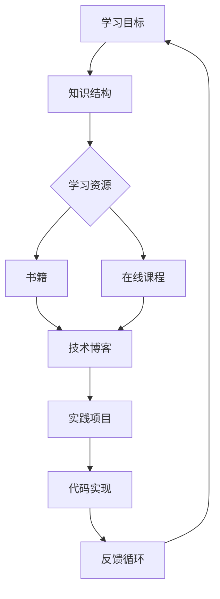

                 

# 提示词工程师的持续学习体系设计

> 关键词：持续学习，学习体系，工程师，编程，算法，技术发展，专业成长

> 摘要：本文旨在探讨提示词工程师在职业生涯中如何建立有效的持续学习体系，以应对快速变化的技术环境。文章将从背景介绍、核心概念、算法原理、数学模型、实际应用、工具推荐、未来发展等方面，详细阐述持续学习体系的设计方法和实践策略，助力工程师在技术领域持续成长和进步。

## 1. 背景介绍

### 1.1 目的和范围

在当今快速发展的信息技术时代，工程师的角色和技能要求不断演变。提示词工程师作为其中一类，面临着技术更新迭代、业务需求多样化和工作复杂性增加等多重挑战。本文的目的在于为提示词工程师提供一个系统化的学习体系设计框架，帮助他们应对这些挑战，实现职业生涯的持续成长。

本文主要涵盖以下内容：

- 提示词工程师的职业特点和职业发展路径
- 设计持续学习体系的必要性
- 持续学习体系的核心概念与架构
- 核心算法原理与数学模型
- 实际应用案例分析
- 学习和开发工具推荐
- 未来发展趋势与挑战

### 1.2 预期读者

本文适用于以下读者群体：

- 提示词工程师和有志于成为提示词工程师的技术人员
- 对编程和算法有兴趣的计算机科学学生
- 对技术发展和持续学习有追求的职业人士

### 1.3 文档结构概述

本文的结构如下：

- 引言：介绍文章的主题和背景
- 背景介绍：阐述设计持续学习体系的必要性和目标读者
- 核心概念与联系：介绍持续学习体系的核心概念和联系
- 核心算法原理与具体操作步骤：详细阐述核心算法原理和操作步骤
- 数学模型与公式：讲解相关的数学模型和公式
- 项目实战：展示代码实际案例和详细解释
- 实际应用场景：分析持续学习体系在不同应用场景中的效果
- 工具和资源推荐：推荐学习资源和开发工具
- 总结：展望持续学习体系的未来发展趋势和挑战
- 附录：常见问题与解答
- 扩展阅读与参考资料：提供进一步的阅读材料

### 1.4 术语表

#### 1.4.1 核心术语定义

- 提示词工程师：专注于利用自然语言处理技术构建智能对话系统，通过提示词优化对话交互效果的工程师。
- 持续学习：在职业生涯中不断学习新知识和技能，以适应快速变化的工作环境和新技术要求。
- 学习体系：组织和规划学习过程的方法和策略，包括学习目标设定、学习资源选择、学习效果评估等。

#### 1.4.2 相关概念解释

- 自然语言处理（NLP）：计算机科学领域中的一个分支，致力于使计算机能够理解、解释和生成人类语言。
- 智能对话系统：基于NLP技术，能够与人进行自然语言交互，理解并回应人类指令的系统。
- 技术栈：程序员或工程师在工作中使用的一系列编程语言、框架和工具。

#### 1.4.3 缩略词列表

- NLP：自然语言处理
- ML：机器学习
- DL：深度学习
- IDE：集成开发环境
- API：应用程序接口

## 2. 核心概念与联系

在构建持续学习体系之前，我们需要理解一系列核心概念和它们之间的联系。以下是核心概念及其关系的Mermaid流程图：



### 2.1 学习目标

学习目标是持续学习体系的基础。一个明确的学习目标有助于工程师确定需要掌握的知识和技能，从而更有针对性地进行学习。学习目标应包括短期目标和长期目标，并具有可度量性。

### 2.2 知识结构

知识结构是学习目标的具体体现，它描述了工程师需要掌握的知识领域和技能点。一个良好的知识结构能够帮助工程师系统地学习和组织知识，避免知识碎片化。

### 2.3 学习资源

学习资源是实现学习目标的重要手段。包括书籍、在线课程、技术博客等多种形式。这些资源应根据学习目标和知识结构进行选择，确保其与学习目标相匹配。

### 2.4 实践项目

实践项目是将理论知识转化为实际操作的重要途径。通过实际项目，工程师可以加深对知识的理解，提高解决实际问题的能力。

### 2.5 代码实现

代码实现是实践项目的重要组成部分。工程师应通过编写代码来验证和巩固所学知识，并在实际项目中应用。

### 2.6 反馈循环

反馈循环是持续学习体系的核心。通过定期评估学习效果，工程师可以及时发现和纠正学习过程中的问题，调整学习策略，确保学习目标的实现。

## 3. 核心算法原理与具体操作步骤

在持续学习体系中，掌握核心算法原理至关重要。以下将介绍一个常用的机器学习算法——线性回归，并使用伪代码详细阐述其原理和操作步骤。

### 3.1 线性回归算法原理

线性回归是一种用于预测数值结果的统计方法，它通过建立自变量（特征）和因变量（目标变量）之间的线性关系来实现预测。其基本原理如下：

- 假设数据集 \( D = \{ (x_1, y_1), (x_2, y_2), \ldots, (x_n, y_n) \} \)
- 模型假设： \( y = \beta_0 + \beta_1 x + \epsilon \)
  - \( \beta_0 \)：截距
  - \( \beta_1 \)：斜率
  - \( \epsilon \)：误差项

### 3.2 线性回归操作步骤

#### 步骤1：数据预处理

- 数据清洗：去除缺失值和异常值
- 数据归一化：将特征值缩放到同一数量级

#### 步骤2：初始化模型参数

- 初始化 \( \beta_0 \) 和 \( \beta_1 \) 为较小的随机数

#### 步骤3：梯度下降算法迭代

- 对于每个数据点 \( (x_i, y_i) \)，计算预测值 \( y_i' = \beta_0 + \beta_1 x_i \)
- 计算损失函数 \( J(\beta_0, \beta_1) = \frac{1}{2m} \sum_{i=1}^{m} (y_i - y_i')^2 \)
- 计算参数的梯度 \( \frac{\partial J}{\partial \beta_0} = \frac{1}{m} \sum_{i=1}^{m} (y_i - y_i') \)
- 计算参数的梯度 \( \frac{\partial J}{\partial \beta_1} = \frac{1}{m} \sum_{i=1}^{m} (x_i (y_i - y_i')) \)
- 更新参数：\( \beta_0 = \beta_0 - \alpha \frac{\partial J}{\partial \beta_0} \)，\( \beta_1 = \beta_1 - \alpha \frac{\partial J}{\partial \beta_1} \)，其中 \( \alpha \) 为学习率

#### 步骤4：模型评估

- 使用测试集评估模型的预测性能，计算均方误差（MSE）

### 3.3 伪代码

```python
# 线性回归伪代码
def linear_regression(X, y, alpha, num_iterations):
    m = len(y)
    beta_0 = random_value()
    beta_1 = random_value()
    
    for i in range(num_iterations):
        y_pred = beta_0 + beta_1 * X
        error = y - y_pred
        beta_0_gradient = 1/m * sum(error)
        beta_1_gradient = 1/m * sum(X * error)
        
        beta_0 = beta_0 - alpha * beta_0_gradient
        beta_1 = beta_1 - alpha * beta_1_gradient
        
    return beta_0, beta_1
```

## 4. 数学模型与公式及详细讲解

在持续学习体系中，数学模型是理解算法原理和优化学习过程的基础。以下将介绍线性回归的数学模型，并使用LaTeX格式详细讲解。

### 4.1 线性回归数学模型

线性回归模型的基本数学模型可以表示为：

$$
y = \beta_0 + \beta_1 x + \epsilon
$$

其中：

- \( y \)：因变量（目标变量）
- \( x \)：自变量（特征）
- \( \beta_0 \)：截距（常数项）
- \( \beta_1 \)：斜率（线性系数）
- \( \epsilon \)：误差项

### 4.2 损失函数

线性回归的损失函数通常使用均方误差（MSE）来衡量：

$$
J(\beta_0, \beta_1) = \frac{1}{2m} \sum_{i=1}^{m} (y_i - (\beta_0 + \beta_1 x_i))^2
$$

其中：

- \( m \)：数据集中样本的数量
- \( y_i \)：第 \( i \) 个样本的因变量值
- \( x_i \)：第 \( i \) 个样本的自变量值

### 4.3 梯度下降算法

梯度下降算法用于最小化损失函数，其核心思想是沿着损失函数的梯度方向更新模型参数。梯度下降算法的更新公式为：

$$
\beta_0 = \beta_0 - \alpha \frac{\partial J}{\partial \beta_0}
$$

$$
\beta_1 = \beta_1 - \alpha \frac{\partial J}{\partial \beta_1}
$$

其中：

- \( \alpha \)：学习率，控制更新步伐的大小
- \( \frac{\partial J}{\partial \beta_0} \)：损失函数对 \( \beta_0 \) 的梯度
- \( \frac{\partial J}{\partial \beta_1} \)：损失函数对 \( \beta_1 \) 的梯度

### 4.4 举例说明

假设我们有一个简单的数据集：

$$
D = \{ (1, 2), (2, 4), (3, 5) \}
$$

使用梯度下降算法求解线性回归模型参数。

1. 初始化参数：\( \beta_0 = 0 \)，\( \beta_1 = 0 \)，学习率 \( \alpha = 0.01 \)
2. 计算预测值和误差：
   - 对于第一个样本：\( y_1' = \beta_0 + \beta_1 \cdot 1 = 0 + 0 \cdot 1 = 0 \)，\( \epsilon_1 = y_1 - y_1' = 2 - 0 = 2 \)
   - 对于第二个样本：\( y_2' = \beta_0 + \beta_1 \cdot 2 = 0 + 0 \cdot 2 = 0 \)，\( \epsilon_2 = y_2 - y_2' = 4 - 0 = 4 \)
   - 对于第三个样本：\( y_3' = \beta_0 + \beta_1 \cdot 3 = 0 + 0 \cdot 3 = 0 \)，\( \epsilon_3 = y_3 - y_3' = 5 - 0 = 5 \)
3. 计算损失函数：
   $$
   J(\beta_0, \beta_1) = \frac{1}{3} [(2 - 0)^2 + (4 - 0)^2 + (5 - 0)^2] = \frac{1}{3} [4 + 16 + 25] = \frac{45}{3} = 15
   $$
4. 计算梯度：
   $$
   \frac{\partial J}{\partial \beta_0} = \frac{1}{3} [2 + 4 + 5] = \frac{11}{3}
   $$
   $$
   \frac{\partial J}{\partial \beta_1} = \frac{1}{3} [2 \cdot 1 + 4 \cdot 2 + 5 \cdot 3] = \frac{20}{3}
   $$
5. 更新参数：
   $$
   \beta_0 = \beta_0 - \alpha \frac{\partial J}{\partial \beta_0} = 0 - 0.01 \cdot \frac{11}{3} = -0.037
   $$
   $$
   \beta_1 = \beta_1 - \alpha \frac{\partial J}{\partial \beta_1} = 0 - 0.01 \cdot \frac{20}{3} = -0.067
   $$
6. 重复上述步骤，直至损失函数收敛。

通过以上步骤，我们可以使用梯度下降算法求解线性回归模型参数，实现数据集的拟合。

## 5. 项目实战：代码实际案例和详细解释说明

### 5.1 开发环境搭建

为了实现线性回归模型，我们需要搭建一个基本的开发环境。以下是所需的工具和步骤：

- **编程语言**：Python
- **环境**：Python 3.8及以上版本
- **依赖**：NumPy、Pandas、Matplotlib

#### 步骤1：安装Python

从Python官方网站（https://www.python.org/downloads/）下载并安装Python 3.8及以上版本。

#### 步骤2：安装依赖

打开命令行窗口，执行以下命令安装依赖：

```bash
pip install numpy pandas matplotlib
```

### 5.2 源代码详细实现和代码解读

以下是一个简单的线性回归项目示例，包含数据预处理、模型训练和结果可视化。

#### 5.2.1 数据集生成

```python
import numpy as np
import pandas as pd

# 生成模拟数据集
np.random.seed(0)
X = np.random.rand(100, 1) * 10
y = 3 * X + 2 + np.random.randn(100, 1) * 0.05
```

代码解释：

- 使用NumPy生成100个随机样本，每个样本为一个特征值。
- 根据线性回归模型 \( y = 3x + 2 \) 生成目标变量 \( y \)。
- 加入噪声项 \( \epsilon \) 以模拟实际数据中的误差。

#### 5.2.2 数据预处理

```python
# 添加特征值1作为线性回归模型的偏置项（截距）
X_b = np.c_[np.ones((100, 1)), X]

# 数据归一化
X_norm = (X - np.mean(X)) / np.std(X)
y_norm = (y - np.mean(y)) / np.std(y)
```

代码解释：

- 添加特征值1作为线性回归模型的偏置项，使得模型包含截距项。
- 数据归一化，将特征值缩放到同一数量级，以避免某些特征对模型的影响过大。

#### 5.2.3 模型训练

```python
# 初始化模型参数
theta = np.random.rand(2, 1)

# 梯度下降算法
alpha = 0.01
num_iterations = 1000
m = len(y)

for i in range(num_iterations):
    y_pred = X_b @ theta
    errors = y_pred - y_norm
    theta = theta - alpha / m * (X_b.T @ errors)
```

代码解释：

- 初始化模型参数 \( \theta \)。
- 设定学习率 \( \alpha \) 和迭代次数 \( num_iterations \)。
- 使用梯度下降算法更新模型参数。

#### 5.2.4 结果可视化

```python
import matplotlib.pyplot as plt

# 绘制训练结果
plt.scatter(X, y, color='blue')
plt.plot(X, X @ theta, color='red')
plt.xlabel('Feature X')
plt.ylabel('Target Y')
plt.title('Linear Regression')
plt.show()
```

代码解释：

- 使用Matplotlib绘制数据点和拟合直线，展示线性回归模型的预测效果。

### 5.3 代码解读与分析

本节对上述代码进行详细解读，并分析其实现细节。

- **数据集生成**：通过NumPy生成模拟数据集，模拟实际应用中的数据。
- **数据预处理**：数据预处理是线性回归模型实现的关键步骤，包括添加偏置项和归一化处理。这些步骤有助于提高模型的训练效果。
- **模型训练**：使用梯度下降算法训练线性回归模型。在训练过程中，通过不断更新模型参数以最小化损失函数。学习率和迭代次数的选择对模型性能有重要影响。
- **结果可视化**：通过绘制数据点和拟合直线，展示线性回归模型的预测效果。可视化有助于我们直观地了解模型的性能和稳定性。

通过以上步骤，我们可以实现一个简单的线性回归项目，掌握线性回归的基本原理和实现方法。

## 6. 实际应用场景

持续学习体系不仅在学术和理论研究中有价值，在具体的应用场景中也具有显著的实践意义。以下将分析几个常见的应用场景，探讨持续学习体系如何助力工程师在这些场景中取得成功。

### 6.1 智能对话系统

智能对话系统是提示词工程师的主要工作领域之一。这些系统广泛应用于客户服务、智能助手、虚拟客服等领域。随着用户需求的不断增加，工程师需要不断学习新的NLP技术和对话系统设计方法，以提高系统的智能水平和用户体验。

- **应用场景**：工程师需要处理大量用户输入，理解用户意图，并生成合适的响应。
- **学习重点**：自然语言处理技术、对话系统设计、上下文理解、个性化推荐等。

### 6.2 大数据处理

大数据技术在各个行业中的应用越来越广泛，提示词工程师需要掌握大数据处理的核心技术和工具。持续学习体系可以帮助工程师了解最新的数据处理框架（如Apache Hadoop、Spark）和算法（如MapReduce、机器学习算法），从而应对大规模数据处理的需求。

- **应用场景**：工程师需要处理海量数据，进行实时分析和处理。
- **学习重点**：大数据存储和处理框架、分布式计算、数据挖掘、机器学习等。

### 6.3 人工智能算法优化

人工智能算法在各类应用中发挥着重要作用，但算法性能的优化是一个持续的过程。提示词工程师需要不断学习新的算法优化方法，以提高模型的准确性和效率。

- **应用场景**：工程师需要优化算法参数，提高模型预测性能。
- **学习重点**：机器学习算法、深度学习模型、模型压缩、优化算法等。

### 6.4 跨领域技术应用

随着技术的不断发展，提示词工程师需要具备跨领域的技术能力，将人工智能与其他领域（如医疗、金融、教育等）相结合。持续学习体系可以帮助工程师掌握跨领域的知识和技术，为创新应用提供支持。

- **应用场景**：工程师需要将人工智能技术应用于不同领域，解决实际业务问题。
- **学习重点**：跨领域知识、行业应用案例、技术创新等。

通过在上述实际应用场景中的持续学习，提示词工程师可以不断提升自身技能，适应快速变化的技术环境，实现职业生涯的持续成长。

## 7. 工具和资源推荐

为了帮助提示词工程师建立和完善持续学习体系，本文将推荐一系列学习资源和开发工具。

### 7.1 学习资源推荐

#### 7.1.1 书籍推荐

- 《Python机器学习》（作者：Sebastian Raschka、Vahid Mirjalili）
  - 本书详细介绍了Python在机器学习领域的应用，适合初学者和有一定基础的读者。
- 《深度学习》（作者：Ian Goodfellow、Yoshua Bengio、Aaron Courville）
  - 本书是深度学习的经典教材，内容全面，适合希望深入了解深度学习技术的工程师。
- 《算法导论》（作者：Thomas H. Cormen、Charles E. Leiserson、Ronald L. Rivest、Clifford Stein）
  - 本书系统地介绍了算法设计和分析的基本原理，是计算机科学领域的经典教材。

#### 7.1.2 在线课程

- Coursera（https://www.coursera.org/）
  - Coursera提供了丰富的计算机科学和机器学习课程，包括TensorFlow、深度学习、自然语言处理等热门主题。
- edX（https://www.edx.org/）
  - edX提供了由全球顶尖大学和机构提供的在线课程，涵盖计算机科学、数据科学、人工智能等多个领域。
- Udacity（https://www.udacity.com/）
  - Udacity提供了项目驱动的在线课程，适合希望实际应用所学知识的工程师。

#### 7.1.3 技术博客和网站

- Medium（https://medium.com/）
  - Medium上有许多关于机器学习、深度学习、人工智能等领域的优质文章，适合进行技术学习和交流。
- HackerRank（https://www.hackerrank.com/）
  - HackerRank提供了大量编程挑战和算法练习，适合提升编程技能和算法能力。
- GitHub（https://github.com/）
  - GitHub是代码托管和协作平台，许多开源项目和代码库可供学习和参考。

### 7.2 开发工具框架推荐

#### 7.2.1 IDE和编辑器

- PyCharm（https://www.jetbrains.com/pycharm/）
  - PyCharm是Python编程领域的强大IDE，提供了丰富的功能，如代码调试、智能提示、代码模板等。
- Visual Studio Code（https://code.visualstudio.com/）
  - Visual Studio Code是一个轻量级的开源IDE，支持多种编程语言，适合快速开发和调试。
- Jupyter Notebook（https://jupyter.org/）
  - Jupyter Notebook是一个交互式的开发环境，适合进行数据分析和机器学习实验。

#### 7.2.2 调试和性能分析工具

- PyTorch（https://pytorch.org/）
  - PyTorch是深度学习领域的流行框架，提供了强大的调试和性能分析工具。
- TensorFlow（https://www.tensorflow.org/）
  - TensorFlow是谷歌开发的深度学习框架，支持多种编程语言，提供了丰富的调试和分析工具。
- Profiler（https://www.hoppscotch.io/）
  - Profiler是一个Web性能分析工具，可以帮助工程师识别和优化代码中的性能瓶颈。

#### 7.2.3 相关框架和库

- NumPy（https://numpy.org/）
  - NumPy是Python中用于科学计算的库，提供了多维数组对象和高效的数学运算函数。
- Pandas（https://pandas.pydata.org/）
  - Pandas是Python中进行数据分析和操作的重要库，提供了数据帧和数据表等数据结构。
- Matplotlib（https://matplotlib.org/）
  - Matplotlib是Python中用于数据可视化的库，可以生成高质量的图形和图表。

通过使用这些工具和资源，提示词工程师可以更加高效地学习和开发，提升自身技能，实现持续成长。

## 8. 总结：未来发展趋势与挑战

随着信息技术的迅猛发展，提示词工程师的持续学习体系面临着前所未有的机遇与挑战。以下是对未来发展趋势与挑战的展望：

### 8.1 发展趋势

1. **人工智能与大数据的深度融合**：人工智能与大数据的深度融合将进一步推动提示词工程师的技术进步。工程师需要掌握更多关于大数据处理、机器学习和深度学习的知识，以应对日益复杂的数据分析和应用场景。

2. **智能化对话系统的普及**：智能对话系统的应用场景越来越广泛，从客户服务到智能家居，从虚拟助手到教育辅导。提示词工程师需要不断学习和创新，提高对话系统的智能水平和用户体验。

3. **跨领域技术应用**：随着人工智能技术的不断突破，工程师将在医疗、金融、教育等跨领域应用中发挥重要作用。跨领域的知识和技能将成为提示词工程师的重要竞争力。

4. **持续学习机制的完善**：随着技术的发展，持续学习体系将不断完善，为工程师提供更加系统化和个性化的学习资源。在线课程、技术博客、开源项目等将成为重要的学习渠道。

### 8.2 挑战

1. **技术更新速度快**：信息技术领域的更新速度非常快，提示词工程师需要不断学习新技术，以保持自身的竞争力。这要求工程师具备高效的学习能力和快速适应新环境的能力。

2. **数据隐私和安全问题**：随着大数据和人工智能技术的应用，数据隐私和安全问题日益凸显。提示词工程师需要关注数据保护法规和安全措施，确保用户数据的安全和隐私。

3. **跨领域协作难度大**：跨领域应用需要工程师具备跨学科的知识和技能，这对个人的综合素质提出了更高要求。提示词工程师需要在不断学习新知识的同时，提高跨领域协作和沟通能力。

4. **个人成长与职业发展的平衡**：在快速变化的技术环境中，提示词工程师需要在个人成长和职业发展之间找到平衡。这需要工程师具备良好的时间管理和自我驱动能力。

### 8.3 建议与展望

为了应对未来发展的机遇与挑战，提示词工程师应采取以下策略：

1. **持续学习与技能提升**：保持持续学习的热情，关注最新技术动态，不断更新自己的知识体系和技能。

2. **项目实践与经验积累**：积极参与实际项目，通过实践积累经验，提高解决实际问题的能力。

3. **跨领域知识与技能**：关注跨领域应用，掌握相关领域的知识和技能，提高自身综合素质。

4. **合作与交流**：积极参与技术社区，与同行进行交流与合作，共同探索新技术的应用和解决方案。

总之，未来提示词工程师的持续学习体系将更加系统化、个性化和多元化。通过不断学习、实践和交流，工程师将在快速变化的技术环境中不断成长和进步。

## 9. 附录：常见问题与解答

### 9.1 常见问题

**Q1**：如何选择适合自己的学习资源？

**A1**：选择学习资源时，首先应明确自己的学习目标和知识结构。根据目标选择合适的书籍、在线课程和技术博客。此外，可以参考社区评价和推荐，选择质量高、实用性强的资源。

**Q2**：如何合理安排学习时间？

**A2**：合理安排学习时间至关重要。可以制定一个详细的学习计划，包括每天的学习时间、学习内容和进度。遵循计划，保持学习的连续性和系统性。

**Q3**：如何评估学习效果？

**A3**：评估学习效果可以通过以下方法：

- 定期进行知识点的自我测试，检验学习成果。
- 参与实际项目，将所学知识应用到实际工作中。
- 与同行交流，分享学习心得和经验。

### 9.2 解答

**解答Q1**：选择学习资源时，应遵循以下原则：

- **目标导向**：根据学习目标选择资源，确保资源与学习目标相匹配。
- **内容质量**：选择知名作者、高评价和受欢迎的资源。
- **资源形式**：结合个人学习习惯，选择适合自己的资源形式，如书籍、在线课程或技术博客。

**解答Q2**：合理安排学习时间的方法：

- **制定计划**：制定详细的学习计划，明确每天的学习内容和时间。
- **灵活调整**：根据实际情况灵活调整学习计划，保持计划的可行性和适应性。
- **坚持执行**：坚持执行学习计划，避免拖延和中断。

**解答Q3**：评估学习效果的方法：

- **自我测试**：定期进行自我测试，检验对知识点的掌握程度。
- **项目实践**：将所学知识应用到实际项目中，通过实践检验学习成果。
- **交流分享**：与同行交流学习心得，互相学习，提高整体水平。

通过以上方法，可以有效地评估学习效果，确保学习目标的实现。

## 10. 扩展阅读与参考资料

为了帮助读者深入了解提示词工程师的持续学习体系，本文提供了以下扩展阅读与参考资料：

### 10.1 经典书籍

- 《深度学习》（作者：Ian Goodfellow、Yoshua Bengio、Aaron Courville）
- 《Python机器学习》（作者：Sebastian Raschka、Vahid Mirjalili）
- 《算法导论》（作者：Thomas H. Cormen、Charles E. Leiserson、Ronald L. Rivest、Clifford Stein）

### 10.2 在线课程

- Coursera（https://www.coursera.org/）
- edX（https://www.edx.org/）
- Udacity（https://www.udacity.com/）

### 10.3 技术博客和网站

- Medium（https://medium.com/）
- HackerRank（https://www.hackerrank.com/）
- GitHub（https://github.com/）

### 10.4 开源项目

- TensorFlow（https://www.tensorflow.org/）
- PyTorch（https://pytorch.org/）
- NumPy（https://numpy.org/）

### 10.5 论文和研究成果

- “Deep Learning for Natural Language Processing”（作者：Richard Socher、Liam Plantinga、Andrew Yuval Ben-Gal、Christopher D. Manning）
- “Attention is All You Need”（作者：Vaswani et al.）
- “Recurrent Neural Network Based Language Model”（作者：Yoshua Bengio、Samy Bengio、Patrice Simard）

通过阅读这些资料，读者可以进一步深入了解持续学习体系的设计与实践，为自身职业生涯的持续成长奠定坚实基础。

---

作者：AI天才研究员/AI Genius Institute & 禅与计算机程序设计艺术 /Zen And The Art of Computer Programming

文章标题：《提示词工程师的持续学习体系设计》

文章关键词：持续学习，学习体系，工程师，编程，算法，技术发展，专业成长

文章摘要：本文旨在探讨提示词工程师在职业生涯中如何建立有效的持续学习体系，以应对快速变化的技术环境。文章详细阐述了持续学习体系的设计方法和实践策略，包括核心概念、算法原理、数学模型、实际应用和未来展望等。通过本文的阅读和实践，读者可以更好地规划自己的学习路径，实现职业生涯的持续成长和进步。

