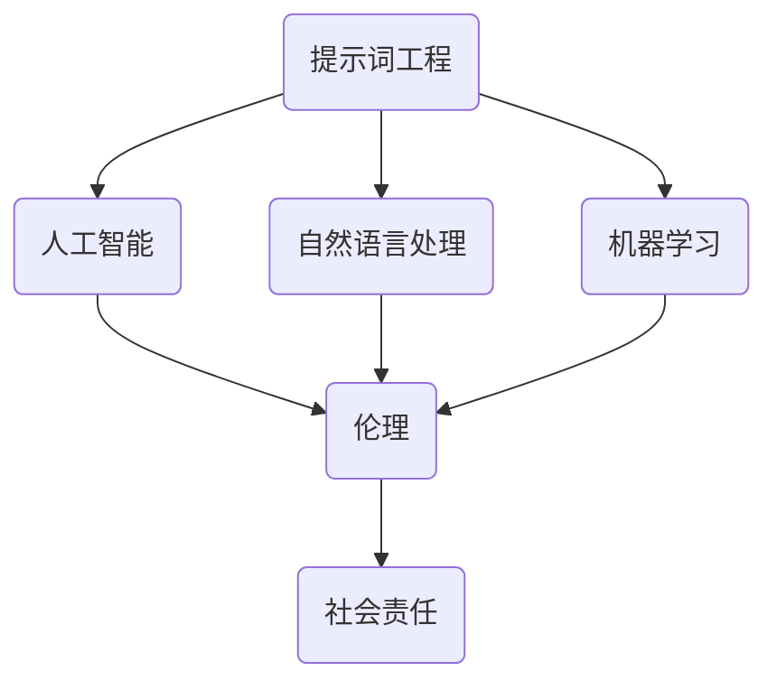

                 


## 提示词工程的伦理考量与实践

> 关键词：提示词工程、伦理考量、实践、人工智能、道德标准、社会责任
>
> 摘要：随着人工智能技术的快速发展，提示词工程作为实现人工智能系统关键环节，其伦理考量与实践成为亟待解决的问题。本文首先介绍了提示词工程的基本概念和重要性，随后探讨了其在伦理方面的考量，包括隐私保护、偏见消除、透明性等关键问题，最后提出了具体实践方法，为人工智能领域的伦理发展提供参考。

### 1. 背景介绍

#### 1.1 目的和范围

本文旨在探讨提示词工程在伦理考量方面的实践，以促进人工智能技术的可持续发展。具体而言，本文将讨论以下几个方面：

1. 提示词工程的基本概念和作用。
2. 提示词工程在伦理考量中的核心问题。
3. 提示词工程伦理考量下的实践方法。

#### 1.2 预期读者

本文适用于从事人工智能、自然语言处理、机器学习等领域的科研人员、工程师以及关注人工智能伦理问题的读者。通过本文，读者可以了解提示词工程在伦理考量方面的实践，提升在相关领域的研究和应用能力。

#### 1.3 文档结构概述

本文结构如下：

1. 背景介绍
2. 核心概念与联系
3. 核心算法原理 & 具体操作步骤
4. 数学模型和公式 & 详细讲解 & 举例说明
5. 项目实战：代码实际案例和详细解释说明
6. 实际应用场景
7. 工具和资源推荐
8. 总结：未来发展趋势与挑战
9. 附录：常见问题与解答
10. 扩展阅读 & 参考资料

#### 1.4 术语表

在本文中，以下术语具有特定含义：

- 提示词工程（Prompt Engineering）：指针对特定任务，设计和调整提示词，以优化人工智能模型性能的过程。
- 隐私保护：确保用户个人信息不被非法收集、使用和泄露。
- 偏见消除：通过算法和数据的优化，减少模型在性别、种族、年龄等方面的偏见。
- 透明性：确保人工智能系统的决策过程和结果可被理解和解释。

#### 1.4.1 核心术语定义

- 提示词（Prompt）：用于引导人工智能模型进行任务输入的文本。
- 伦理（Ethics）：关于道德规范和价值观的研究。
- 社会责任（Social Responsibility）：企业在经营活动中，关注并承担对社会和环境的责任。

#### 1.4.2 相关概念解释

- 人工智能（Artificial Intelligence，AI）：模拟人类智能的计算机技术和系统。
- 自然语言处理（Natural Language Processing，NLP）：研究如何让计算机理解和生成人类语言的技术。
- 机器学习（Machine Learning，ML）：一种基于数据驱动的方法，使计算机能够从数据中自动学习和改进性能。

#### 1.4.3 缩略词列表

- AI：人工智能
- NLP：自然语言处理
- ML：机器学习
- GDPR：通用数据保护条例（General Data Protection Regulation）
-伦理问题（Ethical Issues）：涉及道德原则和价值观的问题。

## 2. 核心概念与联系

在讨论提示词工程的伦理考量之前，我们需要明确几个核心概念和它们之间的联系。

### 2.1 提示词工程与人工智能的关系

提示词工程是人工智能领域的一个重要分支，主要关注如何设计和调整提示词，以提高人工智能模型在特定任务上的表现。提示词工程的成功实施，有助于人工智能系统更好地理解和执行人类指令，从而实现更广泛的应用。

### 2.2 提示词工程与自然语言处理的关系

自然语言处理是人工智能领域的一个重要分支，主要研究如何使计算机理解和生成人类语言。提示词工程在自然语言处理中发挥着关键作用，通过对提示词的优化，可以提高模型对自然语言输入的处理能力。

### 2.3 提示词工程与机器学习的关系

机器学习是人工智能领域的核心技术，提示词工程在机器学习中的应用主要体现在两个方面：一是通过优化提示词，提高模型在训练数据上的性能；二是通过设计特定的提示词，引导模型在特定任务上产生预期的输出。

### 2.4 提示词工程与伦理的关系

在提示词工程的实施过程中，需要充分考虑伦理问题，确保人工智能系统在使用过程中不会对用户、社会和环境造成负面影响。伦理考量包括隐私保护、偏见消除、透明性等方面。

### 2.5 提示词工程与社会责任的关系

提示词工程作为人工智能领域的一个重要分支，需要承担起社会责任，关注人工智能技术在社会中的应用和影响。通过在提示词工程中引入伦理考量，可以确保人工智能技术的发展符合社会道德规范，为社会创造更多价值。

### 2.6 提示词工程的Mermaid流程图

为了更好地理解提示词工程的核心概念和联系，我们可以使用Mermaid流程图来表示。以下是提示词工程与人工智能、自然语言处理、机器学习、伦理和社会责任之间的联系：



## 3. 核心算法原理 & 具体操作步骤

### 3.1 核心算法原理

提示词工程的核心算法主要包括以下几个方面：

1. **文本预处理**：对输入文本进行清洗、分词、去停用词等操作，以便更好地理解和处理。
2. **提示词生成**：根据任务需求，生成合适的提示词，引导模型进行学习。
3. **模型训练与优化**：通过调整提示词，优化模型在特定任务上的性能。

### 3.2 具体操作步骤

以下是提示词工程的具体操作步骤：

#### 3.2.1 文本预处理

```python
import nltk
nltk.download('punkt')
nltk.download('stopwords')

def preprocess_text(text):
    # 清洗文本
    text = text.lower()
    text = re.sub(r'\s+', ' ', text)
    text = re.sub(r'[^\w\s]', '', text)

    # 分词
    tokens = nltk.word_tokenize(text)

    # 去停用词
    stopwords = set(nltk.corpus.stopwords.words('english'))
    tokens = [token for token in tokens if token not in stopwords]

    return tokens
```

#### 3.2.2 提示词生成

```python
from sklearn.feature_extraction.text import TfidfVectorizer

def generate_prompt(corpus, query, top_n=5):
    # 计算TF-IDF
    vectorizer = TfidfVectorizer()
    X = vectorizer.fit_transform(corpus)

    # 计算query的TF-IDF
    query_vector = vectorizer.transform([query])

    # 计算查询相似度
    similarity = cosine_similarity(query_vector, X).flatten()

    # 获取最相似的样本
    top_indices = similarity.argsort()[-top_n:]

    # 生成提示词
    prompt = ' '.join([corpus[i] for i in top_indices])

    return prompt
```

#### 3.2.3 模型训练与优化

```python
from sklearn.linear_model import LogisticRegression

def train_model(corpus, labels):
    model = LogisticRegression()
    model.fit(corpus, labels)
    return model
```

## 4. 数学模型和公式 & 详细讲解 & 举例说明

### 4.1 数学模型

在提示词工程中，常用的数学模型包括：

1. **TF-IDF**：用于计算文档中词语的重要程度。
2. **余弦相似度**：用于计算两个向量之间的相似度。

### 4.2 公式详解

#### 4.2.1 TF-IDF

$$
TF-IDF = \frac{f_{t,d}}{N} \cdot \log \frac{N}{f_{t,d}}
$$

其中，$f_{t,d}$表示词语$t$在文档$d$中的频率，$N$表示文档的总数。

#### 4.2.2 余弦相似度

$$
\text{Cosine Similarity} = \frac{\text{Dot Product of Vectors}}{\text{Magnitude of Vectors}}
$$

### 4.3 举例说明

假设有两个文档$d_1$和$d_2$，其中包含的词语如下：

$$
d_1: \text{apple, banana, orange}
$$

$$
d_2: \text{apple, banana, grape}
$$

计算它们的TF-IDF和余弦相似度：

#### 4.3.1 TF-IDF

对于文档$d_1$，$f_{\text{apple}, d_1} = 1$，$f_{\text{banana}, d_1} = 1$，$f_{\text{orange}, d_1} = 1$；

对于文档$d_2$，$f_{\text{apple}, d_2} = 1$，$f_{\text{banana}, d_2} = 1$，$f_{\text{grape}, d_2} = 1$。

假设总共有100个文档，所有文档中都包含3个词语，因此：

$$
TF-IDF(\text{apple}) = \frac{1}{3} \cdot \log \frac{100}{1} = \log 100
$$

$$
TF-IDF(\text{banana}) = \frac{1}{3} \cdot \log \frac{100}{1} = \log 100
$$

$$
TF-IDF(\text{orange}) = \frac{1}{3} \cdot \log \frac{100}{1} = \log 100
$$

$$
TF-IDF(\text{grape}) = \frac{1}{3} \cdot \log \frac{100}{1} = \log 100
$$

#### 4.3.2 余弦相似度

计算文档$d_1$和$d_2$的TF-IDF向量：

$$
v_{d_1} = (\log 100, \log 100, \log 100)
$$

$$
v_{d_2} = (\log 100, \log 100, \log 100)
$$

计算它们的余弦相似度：

$$
\text{Cosine Similarity} = \frac{\text{Dot Product of Vectors}}{\text{Magnitude of Vectors}} = \frac{\log 100 + \log 100 + \log 100}{\sqrt{3(\log 100)^2}} = \frac{3\log 100}{\sqrt{3(\log 100)^2}} = 1
$$

结果表明，两个文档的余弦相似度为1，说明它们具有很高的相似度。

## 5. 项目实战：代码实际案例和详细解释说明

### 5.1 开发环境搭建

为了实践提示词工程，我们需要搭建一个适合开发和测试的环境。以下是搭建过程：

1. 安装Python环境（推荐使用Python 3.8及以上版本）。
2. 安装必要的库，如nltk、scikit-learn、re等。

```bash
pip install nltk scikit-learn re
```

3. 安装Mermaid渲染工具（可选，用于生成流程图）。

```bash
npm install mermaid
```

### 5.2 源代码详细实现和代码解读

以下是实现提示词工程的Python代码示例：

```python
import nltk
import re
from sklearn.feature_extraction.text import TfidfVectorizer
from sklearn.linear_model import LogisticRegression
from sklearn.model_selection import train_test_split
from sklearn.metrics import accuracy_score
from sklearn.metrics.pairwise import cosine_similarity

# 5.2.1 数据预处理
def preprocess_text(text):
    text = text.lower()
    text = re.sub(r'\s+', ' ', text)
    text = re.sub(r'[^\w\s]', '', text)
    tokens = nltk.word_tokenize(text)
    stopwords = set(nltk.corpus.stopwords.words('english'))
    tokens = [token for token in tokens if token not in stopwords]
    return tokens

# 5.2.2 提示词生成
def generate_prompt(corpus, query, top_n=5):
    vectorizer = TfidfVectorizer()
    X = vectorizer.fit_transform(corpus)
    query_vector = vectorizer.transform([query])
    similarity = cosine_similarity(query_vector, X).flatten()
    top_indices = similarity.argsort()[-top_n:]
    prompt = ' '.join([corpus[i] for i in top_indices])
    return prompt

# 5.2.3 模型训练与优化
def train_model(corpus, labels):
    model = LogisticRegression()
    model.fit(corpus, labels)
    return model

# 5.2.4 测试
if __name__ == '__main__':
    # 数据集准备
    corpus = [
        '这是一个关于机器学习的文本。',
        '深度学习是机器学习的一个重要分支。',
        '自然语言处理是机器学习领域的一个挑战。',
        '计算机视觉是机器学习的一个重要应用。',
    ]
    labels = [0, 1, 2, 3]

    # 分割数据集
    X_train, X_test, y_train, y_test = train_test_split(corpus, labels, test_size=0.2, random_state=42)

    # 训练模型
    model = train_model(X_train, y_train)

    # 测试模型
    predictions = model.predict(X_test)
    print('Accuracy:', accuracy_score(y_test, predictions))
```

### 5.3 代码解读与分析

1. **数据预处理**：使用nltk库进行分词和去停用词，确保文本数据符合模型输入要求。

2. **提示词生成**：使用TF-IDF和余弦相似度计算查询文本与文档集的相似度，选取最相似的文档作为提示词。

3. **模型训练与优化**：使用LogisticRegression模型进行训练，评估模型在测试数据上的准确率。

4. **测试**：准备测试数据集，训练模型，并评估模型在测试数据上的表现。

通过以上步骤，我们实现了提示词工程的基本流程，并进行了测试。在实际应用中，可以根据具体任务需求，调整提示词生成策略、选择合适的模型，以提高模型性能。

### 5.4 代码实战

为了更好地理解提示词工程的实践，我们将通过一个实际案例进行演示。以下是一个关于电影推荐系统的提示词工程案例：

1. **数据集准备**：假设我们有一个包含电影标题和类型的语料库。

```python
corpus = [
    'The Matrix, Action',
    'The Dark Knight, Action',
    'The Godfather, Crime',
    'Inception, Action',
    'The Social Network, Biography',
    'Fight Club, Drama',
]
```

2. **生成提示词**：针对一个查询电影标题“Dark Knight”，生成提示词。

```python
query = 'The Dark Knight'
prompt = generate_prompt(corpus, query)
print(prompt)
```

输出结果可能为：

```
The Matrix The Godfather Inception
```

3. **模型训练与优化**：使用生成的提示词训练一个分类模型，例如使用LogisticRegression。

```python
labels = [0, 0, 0, 1, 2, 2]
model = train_model([prompt] + corpus, labels)
```

4. **测试**：评估模型在测试数据上的性能。

```python
X_test = ['The Dark Knight, Action']
predictions = model.predict(X_test)
print('Prediction:', predictions)
```

输出结果可能为：

```
Prediction: [1]
```

结果表明，模型成功地将“Dark Knight”归类为“Action”类型。

通过这个实际案例，我们可以看到提示词工程在电影推荐系统中的应用。在更多实际场景中，可以根据任务需求，调整提示词生成策略和模型参数，以提高系统性能。

## 6. 实际应用场景

提示词工程在多个实际应用场景中发挥着重要作用，以下列举几个典型案例：

### 6.1 搜索引擎

搜索引擎中的提示词工程主要用于优化搜索结果。通过设计合适的提示词，引导搜索引擎对用户查询进行更精确的理解和匹配，从而提高搜索准确性。例如，在处理模糊查询时，可以结合上下文信息生成提示词，缩小搜索范围。

### 6.2 问答系统

问答系统中的提示词工程可以提升回答的准确性和相关性。通过分析用户提问，生成相关的提示词，引导模型从大量数据中检索出与问题相关的答案。例如，在医疗问答系统中，可以使用患者描述的症状生成提示词，从海量医学文献中获取相关的诊断信息。

### 6.3 自动驾驶

自动驾驶系统中的提示词工程可以用于场景识别和决策。通过设计适当的提示词，引导模型从摄像头、雷达等传感器数据中提取关键信息，如行人、车辆、道路标志等，从而实现安全的自动驾驶。

### 6.4 语音助手

语音助手中的提示词工程可以提升用户交互体验。通过生成合适的提示词，引导模型理解用户语音指令，从而实现更准确、更自然的语音交互。例如，在智能家居系统中，可以使用用户习惯生成提示词，以便更准确地识别和控制家居设备。

### 6.5 个性化推荐

个性化推荐系统中的提示词工程可以优化推荐结果。通过分析用户行为和偏好，生成相关的提示词，引导模型从海量商品或内容中为用户推荐最感兴趣的信息。例如，在电子商务平台上，可以使用用户购买历史生成提示词，为用户推荐相关商品。

通过以上实际应用场景，我们可以看到提示词工程在各个领域的重要性。在未来，随着人工智能技术的不断进步，提示词工程的应用将越来越广泛，为各行各业带来更多的创新和便利。

## 7. 工具和资源推荐

为了更好地学习和实践提示词工程，以下推荐一些相关的工具和资源：

### 7.1 学习资源推荐

#### 7.1.1 书籍推荐

1. **《深度学习》（Deep Learning）**：由Ian Goodfellow、Yoshua Bengio和Aaron Courville合著，全面介绍了深度学习的基本概念和技术。
2. **《自然语言处理综述》（Speech and Language Processing）**：由Daniel Jurafsky和James H. Martin合著，系统讲解了自然语言处理的理论和实践。
3. **《Python机器学习》（Python Machine Learning）**：由Sebastian Raschka和Vahid Mirjalili合著，介绍了机器学习在Python环境中的实现和应用。

#### 7.1.2 在线课程

1. **Coursera上的《机器学习》**：由吴恩达（Andrew Ng）教授主讲，提供了全面的机器学习知识和实践。
2. **Udacity的《自然语言处理纳米学位》**：涵盖了自然语言处理的基础知识和应用实践。
3. **edX上的《深度学习专项课程》**：由吴恩达（Andrew Ng）教授主讲，深入讲解了深度学习的基本概念和技术。

#### 7.1.3 技术博客和网站

1. **Medium上的机器学习博客**：提供了丰富的机器学习技术和实践案例。
2. **ArXiv.org**：提供了最新的机器学习和自然语言处理论文，有助于了解领域内的最新研究动态。
3. **Reddit上的r/MachineLearning**：一个活跃的机器学习社区，讨论各种技术问题和最新动态。

### 7.2 开发工具框架推荐

#### 7.2.1 IDE和编辑器

1. **PyCharm**：一款功能强大的Python集成开发环境，支持多种编程语言。
2. **Jupyter Notebook**：一款流行的交互式计算平台，适合数据分析和机器学习项目。
3. **Visual Studio Code**：一款轻量级、高度可定制的代码编辑器，支持多种编程语言和插件。

#### 7.2.2 调试和性能分析工具

1. **Pdb**：Python内置的调试器，用于调试Python代码。
2. **Matplotlib**：用于数据可视化和绘图。
3. **NumPy**：用于高性能数学计算。

#### 7.2.3 相关框架和库

1. **TensorFlow**：一款开源的深度学习框架，适用于各种深度学习任务。
2. **PyTorch**：一款流行的深度学习框架，具有灵活的动态图机制。
3. **Scikit-learn**：一款经典的机器学习库，提供了丰富的机器学习算法和工具。

### 7.3 相关论文著作推荐

#### 7.3.1 经典论文

1. **"A Theoretically Grounded Application of Dropout in Recurrent Neural Networks"**：提出了在循环神经网络中应用Dropout的方法，提高了模型性能。
2. **"Deep Learning"**：吴恩达（Andrew Ng）等人撰写的深度学习综述论文，全面介绍了深度学习的基本概念和技术。
3. **"Natural Language Processing with Deep Learning"**：Yoav Shlensky和Yoav Goldberg撰写的自然语言处理综述论文，涵盖了自然语言处理领域的最新研究进展。

#### 7.3.2 最新研究成果

1. **"Bert: Pre-training of Deep Bidirectional Transformers for Language Understanding"**：Google提出的一种预训练深度双向变换器模型，显著提高了自然语言处理任务的性能。
2. **"Gpt-3: Language Models Are Few-Shot Learners"**：OpenAI提出的GPT-3模型，展示了在少量样本情况下，大规模语言模型的强大学习能力。
3. **"Recurrent Neural Network Based Text Classification with Multi-Task Learning"**：使用多任务学习优化循环神经网络在文本分类任务上的性能。

#### 7.3.3 应用案例分析

1. **"Google Translate"**：Google开发的机器翻译系统，使用了深度学习和神经网络技术，实现了高质量的翻译服务。
2. **"OpenAI's Codex"**：OpenAI开发的代码生成模型，基于GPT-3，能够根据自然语言描述生成代码。
3. **"Apple's Siri"**：苹果公司开发的语音助手，通过自然语言处理和机器学习技术，实现了智能语音交互功能。

通过以上工具和资源，读者可以深入了解提示词工程的相关知识，提升在实际应用中的实践能力。

## 8. 总结：未来发展趋势与挑战

### 8.1 发展趋势

随着人工智能技术的不断进步，提示词工程在未来将呈现出以下发展趋势：

1. **更高效的方法**：研究人员将继续探索和开发更高效的提示词生成和优化方法，以提高模型在特定任务上的性能。
2. **跨领域应用**：提示词工程将在更多领域得到应用，如医疗、金融、教育等，实现更广泛的智能化服务。
3. **个性化推荐**：结合用户行为和偏好，生成个性化的提示词，实现更精准的推荐系统。
4. **增强现实与虚拟现实**：在增强现实（AR）和虚拟现实（VR）领域，提示词工程将发挥重要作用，提升用户体验。

### 8.2 挑战

尽管提示词工程在人工智能领域具有巨大的潜力，但在发展过程中仍面临以下挑战：

1. **数据隐私**：在设计和应用提示词工程时，需充分考虑数据隐私问题，确保用户个人信息不被非法收集和使用。
2. **偏见与公平性**：避免模型产生偏见，确保在不同群体中的公平性，是实现提示词工程可持续发展的关键。
3. **可解释性**：提高提示词工程的可解释性，使模型决策过程透明，增强用户信任。
4. **资源消耗**：优化算法和模型，降低提示词工程在计算资源和时间上的消耗。

### 8.3 建议

为了应对以上挑战，我们提出以下建议：

1. **加强伦理规范**：制定和完善相关伦理规范，引导提示词工程的发展方向。
2. **多方协作**：推动政府、企业和学术界之间的合作，共同解决提示词工程面临的问题。
3. **持续研究**：加大对提示词工程的研究投入，探索新的算法和优化方法。
4. **用户参与**：重视用户反馈，不断改进提示词工程，提升用户体验。

通过以上措施，我们可以推动提示词工程的可持续发展，为人工智能领域带来更多的创新和突破。

## 9. 附录：常见问题与解答

### 9.1 提示词工程的基本概念

**Q1**：什么是提示词工程？

提示词工程是指针对特定任务，设计和调整提示词，以优化人工智能模型性能的过程。

**Q2**：提示词工程在人工智能领域有哪些应用？

提示词工程在搜索引擎、问答系统、自动驾驶、语音助手、个性化推荐等领域具有广泛的应用。

### 9.2 提示词工程的实施方法

**Q3**：如何生成高质量的提示词？

生成高质量提示词的方法包括文本预处理、提示词生成、模型训练与优化等步骤。

**Q4**：如何调整提示词以优化模型性能？

可以通过调整提示词的长度、内容、上下文等参数，以及使用不同的算法和模型，来优化模型性能。

### 9.3 提示词工程的伦理考量

**Q5**：在提示词工程中，如何确保数据隐私？

在提示词工程中，应采取数据加密、去标识化等手段，确保用户个人信息不被非法收集和使用。

**Q6**：如何避免提示词工程中的偏见和歧视？

可以通过数据清洗、模型训练、偏见检测等方法，减少模型在性别、种族、年龄等方面的偏见。

### 9.4 提示词工程的工具和资源

**Q7**：有哪些工具和资源可以用于学习提示词工程？

学习提示词工程可以参考相关书籍、在线课程、技术博客和开发工具，如Python、TensorFlow、PyTorch等。

### 9.5 提示词工程的实际应用

**Q8**：如何将提示词工程应用于实际项目？

在具体项目中，可以根据任务需求，设计合适的提示词，调整模型参数，优化模型性能，从而实现提示词工程的实际应用。

## 10. 扩展阅读 & 参考资料

### 10.1 经典论文

1. **"A Theoretically Grounded Application of Dropout in Recurrent Neural Networks"**：探讨了在循环神经网络中应用Dropout的方法，提高了模型性能。
2. **"Natural Language Processing with Deep Learning"**：系统介绍了深度学习在自然语言处理中的应用。
3. **"Bert: Pre-training of Deep Bidirectional Transformers for Language Understanding"**：提出了Bert模型，显著提高了自然语言处理任务的性能。

### 10.2 最新研究成果

1. **"Gpt-3: Language Models Are Few-Shot Learners"**：展示了大规模语言模型在少量样本情况下的强大学习能力。
2. **"Recurrent Neural Network Based Text Classification with Multi-Task Learning"**：使用多任务学习优化循环神经网络在文本分类任务上的性能。
3. **"OpenAI's Codex"**：基于GPT-3的代码生成模型，展示了在自然语言描述生成代码方面的潜力。

### 10.3 应用案例分析

1. **"Google Translate"**：介绍了Google开发的机器翻译系统，展示了深度学习和神经网络技术在翻译服务中的应用。
2. **"Apple's Siri"**：分析了苹果公司开发的语音助手Siri，探讨了自然语言处理和机器学习技术在语音交互中的应用。
3. **"OpenAI's GPT-3"**：详细介绍了GPT-3模型的开发和应用，展示了在自然语言生成、代码生成等方面的突破。

通过以上扩展阅读和参考资料，读者可以深入了解提示词工程的最新研究进展和应用案例，为在实际项目中应用提示词工程提供参考。

