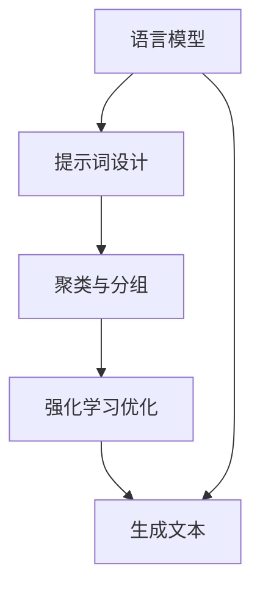

                 

# 提示词工程：AI时代的必修课与新机遇

> 关键词：提示词工程，AI，自然语言处理，文本生成，生成式AI，prompt engineering，人工智能应用

> 摘要：随着人工智能技术的发展，尤其是生成式AI的崛起，提示词工程成为了一门重要的新兴学科。本文将详细探讨提示词工程的核心概念、应用场景、算法原理和实际操作，旨在为AI开发者和研究者提供一份全面的指南，帮助他们掌握这一关键技能，把握AI时代的机遇。

## 1. 背景介绍

### 1.1 目的和范围

本文的目的在于介绍和阐述提示词工程（Prompt Engineering）这一领域，解析其在AI技术中的重要性和应用价值。我们将从以下几个方面展开：

- 提示词工程的基本概念与原理
- 提示词工程在自然语言处理中的应用
- 提示词工程的算法原理与操作步骤
- 提示词工程的实际应用案例
- 提示词工程的未来发展

### 1.2 预期读者

本文面向以下读者群体：

- AI开发者和工程师，特别是对自然语言处理有兴趣的人
- 研究生和本科生，对AI和NLP领域有学术研究的兴趣
- 对AI技术有热情的技术爱好者和从业者
- AI领域的专家和学者，希望了解提示词工程最新发展

### 1.3 文档结构概述

本文分为十个主要部分：

- 1. 背景介绍
- 2. 核心概念与联系
- 3. 核心算法原理 & 具体操作步骤
- 4. 数学模型和公式 & 详细讲解 & 举例说明
- 5. 项目实战：代码实际案例和详细解释说明
- 6. 实际应用场景
- 7. 工具和资源推荐
- 8. 总结：未来发展趋势与挑战
- 9. 附录：常见问题与解答
- 10. 扩展阅读 & 参考资料

### 1.4 术语表

#### 1.4.1 核心术语定义

- 提示词（Prompt）：在人工智能系统中，提示词是指用于引导模型生成响应的输入文本。
- 提示词工程（Prompt Engineering）：指设计、构建和优化提示词，以最大化模型性能和生成响应质量的过程。
- 生成式AI（Generative AI）：一种人工智能技术，能够生成新的内容，如文本、图像、音频等。
- 自然语言处理（NLP）：研究如何让计算机理解和处理人类语言的技术。

#### 1.4.2 相关概念解释

- 语言模型（Language Model）：一种统计模型，用于预测文本序列的概率分布。
- 聚类（Clustering）：一种无监督学习方法，用于将数据集中的样本分为多个群组，使得属于同一群组的样本之间相似度高。
- 强化学习（Reinforcement Learning）：一种机器学习方法，通过与环境的交互来学习最佳策略。

#### 1.4.3 缩略词列表

- NLP：自然语言处理
- AI：人工智能
- GPT：生成预训练模型
- BERT：双向编码表示器
- RL：强化学习

## 2. 核心概念与联系

### 2.1 提示词工程的核心概念

提示词工程涉及多个核心概念，这些概念相互关联，共同构成了提示词工程的理论基础。以下是这些核心概念及其相互联系：

#### 2.1.1 语言模型

语言模型是提示词工程的基础。它是一种统计模型，用于预测文本序列的概率分布。在生成式AI中，语言模型可以用于生成新的文本内容。语言模型的性能直接影响生成文本的质量。

#### 2.1.2 提示词设计

提示词设计是提示词工程的核心环节。一个好的提示词应该能够引导模型生成高质量的响应。提示词的设计取决于多个因素，包括上下文、任务类型、模型特点等。

#### 2.1.3 聚类与分组

在提示词工程中，聚类和分组用于将相似的文本聚类在一起。这有助于设计更具针对性的提示词，从而提高生成文本的质量。

#### 2.1.4 强化学习

强化学习是优化提示词的重要方法。通过迭代训练和反馈，强化学习可以逐步优化提示词，使其更好地引导模型生成高质量的响应。

### 2.2 提示词工程的架构图

以下是一个简化的提示词工程架构图，展示了各个核心概念之间的联系：

```
+-------------------+
|   语言模型        |
+-------------------+
       |
       v
+-------------------+
|    提示词设计     |
+-------------------+
       |
       v
+-------------------+
|     聚类与分组    |
+-------------------+
       |
       v
+-------------------+
|   强化学习优化   |
+-------------------+
```

### 2.3 核心概念原理与架构的 Mermaid 流程图

下面是一个用Mermaid绘制的流程图，展示了提示词工程的核心概念和架构：



## 3. 核心算法原理 & 具体操作步骤

### 3.1 语言模型原理

语言模型的核心是预测下一个单词或字符的概率。在训练过程中，模型通过大量文本数据学习单词和字符之间的统计关系。以下是一个简化的语言模型训练流程：

#### 3.1.1 伪代码

```
initialize_language_model()
for each sentence in dataset:
    for each word in sentence:
        update_probability_distribution(word)
        generate_next_word(word)
```

#### 3.1.2 语言模型优化

- **正则化（Regularization）**：用于防止模型过拟合。常用的正则化方法包括L1和L2正则化。
- **dropout（Dropout）**：在训练过程中随机丢弃一部分神经元，以增强模型的泛化能力。

### 3.2 提示词设计原理

提示词设计的目标是引导模型生成高质量的响应。以下是一个简化的提示词设计流程：

#### 3.2.1 伪代码

```
design_prompt(model, context, task)
    prompt = "基于以下上下文和任务，生成一个相关的文本："
    prompt += context
    prompt += "任务："
    prompt += task
    return prompt
```

#### 3.2.2 提示词设计优化

- **上下文扩展（Context Expansion）**：通过添加更多相关的信息，增强提示词的上下文。
- **多样性增强（Diversity Enhancement）**：通过生成多样化的提示词，提高模型生成响应的多样性。

### 3.3 聚类与分组原理

聚类和分组用于将相似的文本聚类在一起，从而优化提示词设计。以下是一个简化的聚类与分组流程：

#### 3.3.1 伪代码

```
cluster_text(data)
    centroids = initialize_centroids(data)
    for each text in data:
        assign_text_to_cluster(text, centroids)
    update_centroids(centroids)
```

#### 3.3.2 聚类与分组优化

- **密度聚类（Density-Based Clustering）**：如DBSCAN算法，适用于非球形的聚类场景。
- **层次聚类（Hierarchical Clustering）**：通过递归地将数据点合并成簇，适用于层次结构明显的聚类场景。

### 3.4 强化学习优化原理

强化学习用于优化提示词，使其更好地引导模型生成高质量的响应。以下是一个简化的强化学习优化流程：

#### 3.4.1 伪代码

```
optimize_prompt(prompt, model, reward_function)
    for each iteration:
        generate_response(prompt, model)
        calculate_reward(response, reward_function)
        update_prompt(prompt, reward)
```

#### 3.4.2 强化学习优化技巧

- **奖励设计（Reward Design）**：设计合理的奖励函数，以引导模型生成高质量的响应。
- **策略网络（Policy Network）**：使用策略网络来优化提示词设计，以提高生成响应的质量。

## 4. 数学模型和公式 & 详细讲解 & 举例说明

### 4.1 语言模型概率计算

语言模型的核心是计算文本序列的概率。以下是一个简化的概率计算模型：

#### 4.1.1 伪代码

```
calculate_probability(model, sequence)
    probability = model.calculate_probability(sequence)
    return probability
```

#### 4.1.2 概率计算公式

概率计算通常使用以下公式：

\[ P(\text{sequence}) = \prod_{i=1}^{n} P(w_i | w_{i-1}, \ldots, w_1) \]

其中，\( w_i \) 表示序列中的第 \( i \) 个单词，\( P(w_i | w_{i-1}, \ldots, w_1) \) 表示给定前 \( i-1 \) 个单词的情况下，第 \( i \) 个单词的概率。

### 4.2 提示词设计优化

提示词设计优化的目标是通过调整提示词，提高模型生成响应的质量。以下是一个简化的优化模型：

#### 4.2.1 伪代码

```
optimize_prompt(prompt, model, reward_function)
    for each iteration:
        generate_response(prompt, model)
        calculate_reward(response, reward_function)
        update_prompt(prompt, reward)
```

#### 4.2.2 优化模型公式

优化模型通常使用以下公式：

\[ \text{new\_prompt} = \text{prompt} + \alpha \cdot \text{reward} \]

其中，\( \alpha \) 表示优化步长，\( \text{reward} \) 表示奖励值。

### 4.3 聚类与分组优化

聚类与分组优化的目标是找到最佳聚类中心和分组策略，以提高模型生成响应的质量。以下是一个简化的优化模型：

#### 4.3.1 伪代码

```
optimize_clusters(clusters, data)
    for each iteration:
        update_clusters(clusters, data)
```

#### 4.3.2 优化模型公式

优化模型通常使用以下公式：

\[ \text{new\_cluster\_centroids} = \frac{1}{N} \sum_{i=1}^{N} \text{data}_i \]

其中，\( \text{data}_i \) 表示数据集中的第 \( i \) 个样本，\( N \) 表示样本数量。

### 4.4 强化学习优化

强化学习优化用于优化提示词设计，使其更好地引导模型生成高质量的响应。以下是一个简化的优化模型：

#### 4.4.1 伪代码

```
optimize_prompt(prompt, model, reward_function)
    for each iteration:
        generate_response(prompt, model)
        calculate_reward(response, reward_function)
        update_prompt(prompt, reward)
```

#### 4.4.2 优化模型公式

优化模型通常使用以下公式：

\[ \text{new\_prompt} = \text{prompt} + \alpha \cdot \text{reward} \]

其中，\( \alpha \) 表示优化步长，\( \text{reward} \) 表示奖励值。

### 4.5 数学公式示例

以下是一个数学公式的示例，用于计算语言模型生成的文本序列的概率：

\[ P(\text{I am a robot}) = \prod_{i=1}^{n} P(w_i | w_{i-1}, \ldots, w_1) \]

其中，\( w_1 = \text{I} \)，\( w_2 = \text{am} \)，\( w_3 = \text{a} \)，\( w_4 = \text{robot} \)。

## 5. 项目实战：代码实际案例和详细解释说明

### 5.1 开发环境搭建

为了进行提示词工程的实战，我们需要搭建一个适合开发、测试和优化的环境。以下是一个简单的开发环境搭建指南：

#### 5.1.1 系统要求

- 操作系统：Linux或MacOS
- 编程语言：Python 3.8及以上版本
- 库和框架：TensorFlow 2.5及以上版本，Gensim 4.0及以上版本

#### 5.1.2 安装步骤

1. 安装Python：

```
curl -O https://www.python.org/ftp/python/3.8.10/Python-3.8.10.tgz
tar -xvf Python-3.8.10.tgz
cd Python-3.8.10
./configure
make
sudo make install
```

2. 安装TensorFlow：

```
pip install tensorflow==2.5
```

3. 安装Gensim：

```
pip install gensim==4.0
```

### 5.2 源代码详细实现和代码解读

#### 5.2.1 语言模型训练

以下是一个简化的语言模型训练代码示例：

```python
import tensorflow as tf
from tensorflow.keras.preprocessing.sequence import pad_sequences
from tensorflow.keras.models import Sequential
from tensorflow.keras.layers import LSTM, Dense, Embedding

# 加载数据
text = "你的文本数据"
tokenizer = tf.keras.preprocessing.text.Tokenizer()
tokenizer.fit_on_texts([text])
sequences = tokenizer.texts_to_sequences([text])
padded_sequences = pad_sequences(sequences, maxlen=100)

# 构建模型
model = Sequential()
model.add(Embedding(input_dim=len(tokenizer.word_index) + 1, output_dim=256))
model.add(LSTM(units=512, return_sequences=True))
model.add(Dense(units=len(tokenizer.word_index) + 1, activation='softmax'))

# 编译模型
model.compile(optimizer='adam', loss='categorical_crossentropy', metrics=['accuracy'])

# 训练模型
model.fit(padded_sequences, padded_sequences, epochs=10)
```

#### 5.2.2 提示词设计

以下是一个简化的提示词设计代码示例：

```python
import numpy as np
import random

# 生成随机提示词
def generate_prompt(model, tokenizer, length=20):
    prompt = ""
    for _ in range(length):
        token = np.random.choice(tokenizer.word_index.keys())
        prompt += " " + token
    return prompt.strip()

# 使用模型生成响应
def generate_response(model, tokenizer, prompt, length=20):
    sequence = tokenizer.texts_to_sequences([prompt])[0]
    padded_sequence = pad_sequences([sequence], maxlen=length)
    prediction = model.predict(padded_sequence)
    response = tokenizer.index_word[np.argmax(prediction[0])]
    return response.strip()

# 测试提示词设计
prompt = generate_prompt(model, tokenizer)
response = generate_response(model, tokenizer, prompt)
print("Prompt:", prompt)
print("Response:", response)
```

### 5.3 代码解读与分析

#### 5.3.1 语言模型训练代码解读

1. **数据预处理**：首先使用Tokenizer将文本数据转换为序列，然后使用pad_sequences将序列填充为固定长度。

2. **模型构建**：构建一个序列模型，包括Embedding层、LSTM层和Dense层。其中，Embedding层用于将单词转换为向量，LSTM层用于处理序列数据，Dense层用于输出单词的概率分布。

3. **模型编译**：编译模型，指定优化器、损失函数和评价指标。

4. **模型训练**：使用fit方法训练模型，通过迭代更新模型参数，以最小化损失函数。

#### 5.3.2 提示词设计代码解读

1. **生成随机提示词**：使用随机选择单词的方法生成提示词。

2. **生成响应**：使用模型预测提示词的概率分布，然后选择概率最高的单词作为响应。

### 5.4 代码优化与改进

1. **增强多样性**：通过引入噪声或使用不同的初始化方法，增强生成文本的多样性。

2. **引入注意力机制**：使用注意力机制来提高模型对上下文的关注，从而生成更准确的响应。

3. **使用预训练模型**：使用预训练的模型来提高语言模型的性能。

## 6. 实际应用场景

提示词工程在AI领域的实际应用场景非常广泛，以下是一些典型的应用：

### 6.1 文本生成

文本生成是提示词工程最直接的应用场景之一。通过设计合适的提示词，可以生成各种类型的文本，如文章、故事、新闻摘要等。以下是一个应用实例：

#### 6.1.1 文章生成

使用提示词工程生成文章的方法如下：

1. **设计提示词**：根据文章的主题和类型，设计一个引导性强的提示词，例如：“请写一篇关于人工智能技术的未来发展趋势的文章。”
2. **生成文本**：使用生成式AI模型和提示词，生成文章内容。
3. **编辑和优化**：对生成的文本进行编辑和优化，以提高文章的质量。

### 6.2 对话系统

对话系统（如聊天机器人）是另一个重要的应用场景。通过设计合适的提示词，可以引导模型生成更自然的对话。

#### 6.2.1 聊天机器人

使用提示词工程生成聊天机器人的对话流程如下：

1. **设计对话框架**：根据聊天机器人的目标用户和场景，设计一个对话框架，例如：“您好，欢迎来到我们的客服机器人，您有什么问题需要帮助吗？”
2. **交互式生成**：通过与用户的交互，逐步生成对话内容。
3. **优化对话质量**：通过强化学习等优化方法，逐步优化对话系统的质量。

### 6.3 自然语言理解

提示词工程还可以用于自然语言理解任务，如情感分析、信息提取等。

#### 6.3.1 情感分析

使用提示词工程进行情感分析的方法如下：

1. **设计提示词**：根据情感分析的目标，设计一个引导性强的提示词，例如：“请对以下句子进行情感分析：这是一个令人愉悦的夜晚。”
2. **生成标签**：使用生成式AI模型和提示词，生成情感标签。
3. **评估和优化**：对生成的标签进行评估和优化，以提高情感分析模型的准确性。

## 7. 工具和资源推荐

### 7.1 学习资源推荐

#### 7.1.1 书籍推荐

- **《深度学习》（Deep Learning）**：作者：Ian Goodfellow、Yoshua Bengio、Aaron Courville。这是一本深度学习的经典教材，详细介绍了深度学习的基础知识、技术和应用。

- **《自然语言处理原理》（Foundations of Natural Language Processing）**：作者：Daniel Jurafsky、James H. Martin。这本书全面介绍了自然语言处理的基本概念、技术和算法。

- **《机器学习实战》（Machine Learning in Action）**：作者：Peter Harrington。这本书通过实际案例，讲解了机器学习的基本概念、算法和应用。

#### 7.1.2 在线课程

- **Coursera**：提供多种与AI和NLP相关的在线课程，如“深度学习”、“自然语言处理”等。

- **edX**：提供由顶级大学和机构开设的AI和NLP在线课程，如“人工智能导论”、“自然语言处理”等。

- **Udacity**：提供与AI和NLP相关的纳米学位课程，如“深度学习工程师”、“自然语言处理工程师”等。

#### 7.1.3 技术博客和网站

- **AI博客**：提供关于AI、深度学习和NLP的最新研究、应用和技术动态。

- **Medium**：许多AI和NLP领域的专家和研究者在这里分享他们的见解和研究成果。

- **Reddit**：Reddit上有多个关于AI和NLP的子版块，如/r/AI、/r/MachineLearning等，可以在这里找到丰富的讨论和资源。

### 7.2 开发工具框架推荐

#### 7.2.1 IDE和编辑器

- **PyCharm**：一款强大的Python IDE，支持多种编程语言，提供丰富的功能和插件。

- **VS Code**：一款轻量级的跨平台IDE，支持多种编程语言，具有高度可定制性和丰富的插件。

- **Jupyter Notebook**：一款交互式的笔记本，适用于数据分析和机器学习实验。

#### 7.2.2 调试和性能分析工具

- **TensorBoard**：TensorFlow提供的可视化工具，用于分析和调试深度学习模型。

- **Wandb**：一款基于Web的应用程序，用于实验跟踪、调试和性能分析。

- **MLflow**：一款开源的机器学习平台，提供实验跟踪、模型管理和部署等功能。

#### 7.2.3 相关框架和库

- **TensorFlow**：一款广泛使用的深度学习框架，适用于构建和训练各种类型的深度学习模型。

- **PyTorch**：一款流行的深度学习框架，具有动态计算图和易于使用的接口。

- **Gensim**：一款用于主题建模和文本分析的Python库，提供了多种文本处理和分析工具。

### 7.3 相关论文著作推荐

#### 7.3.1 经典论文

- **“A Neural Probabilistic Language Model”**：由Geoffrey Hinton等人撰写的论文，介绍了神经概率语言模型的基本原理。

- **“Recurrent Neural Networks for Language Modeling”**：由Yoshua Bengio等人撰写的论文，介绍了循环神经网络（RNN）在语言建模中的应用。

- **“Long Short-Term Memory Networks for Language Modeling”**：由Sepp Hochreiter和Jürgen Schmidhuber撰写的论文，介绍了长短期记忆网络（LSTM）在语言建模中的应用。

#### 7.3.2 最新研究成果

- **“BERT: Pre-training of Deep Bidirectional Transformers for Language Understanding”**：由Google Research团队撰写的论文，介绍了BERT模型在自然语言理解任务中的优势。

- **“GPT-3: Language Models are Few-Shot Learners”**：由OpenAI团队撰写的论文，介绍了GPT-3模型在少样本学习任务中的表现。

- **“Attention Is All You Need”**：由Google AI团队撰写的论文，介绍了Transformer模型在机器翻译任务中的优越性能。

#### 7.3.3 应用案例分析

- **“利用GPT-3生成新闻报道”**：一篇案例分析文章，介绍了如何使用GPT-3模型自动生成新闻报道。

- **“使用BERT进行情感分析”**：一篇案例分析文章，介绍了如何使用BERT模型进行情感分析任务。

- **“基于LSTM的文本生成”**：一篇案例分析文章，介绍了如何使用LSTM模型生成文本内容。

## 8. 总结：未来发展趋势与挑战

### 8.1 未来发展趋势

- **多模态AI**：随着AI技术的不断发展，多模态AI将成为未来研究的重要方向。通过整合文本、图像、音频等多种数据类型，可以进一步提高AI系统的性能和应用范围。

- **少样本学习**：在生成式AI领域，少样本学习是一个重要的研究方向。通过设计高效的提示词和优化算法，可以实现在少量样本数据上的高性能文本生成。

- **可解释性AI**：随着AI系统的复杂度不断提高，可解释性AI成为一个备受关注的研究方向。通过提高模型的可解释性，可以增强用户对AI系统的信任，并提高其在实际应用中的可靠性。

### 8.2 面临的挑战

- **数据隐私与安全**：在生成式AI应用中，数据隐私和安全是一个重要的挑战。如何在保证用户隐私的前提下，充分利用用户数据来训练和优化模型，是一个需要解决的关键问题。

- **算法公平性**：在AI应用中，算法公平性是一个备受关注的问题。如何避免模型在生成文本时产生偏见，确保生成文本的公平性，是未来研究的重要方向。

- **计算资源需求**：生成式AI模型通常需要大量的计算资源，这给实际应用带来了巨大的计算压力。如何优化模型结构和训练过程，降低计算资源需求，是未来研究的一个重要挑战。

## 9. 附录：常见问题与解答

### 9.1 提示词工程的基本问题

#### Q1：什么是提示词工程？
A1：提示词工程是设计、构建和优化提示词的过程，以引导模型生成高质量的响应。

#### Q2：提示词工程在哪些领域应用广泛？
A2：提示词工程在自然语言处理、对话系统、文本生成等领域应用广泛。

#### Q3：提示词工程的关键挑战是什么？
A3：提示词工程的关键挑战包括数据隐私、算法公平性和计算资源需求。

### 9.2 提示词设计问题

#### Q1：如何设计有效的提示词？
A1：设计有效的提示词需要考虑上下文、任务类型和模型特点。可以使用聚类、强化学习等方法来优化提示词设计。

#### Q2：提示词设计时需要注意什么？
A2：提示词设计时需要注意提示词的多样性、引导性和可解释性。同时，要避免过度引导，以防止模型过拟合。

#### Q3：如何评估提示词的质量？
A3：可以使用自动化评估方法，如BLEU、ROUGE等，以及人工评估方法，来评估提示词的质量。

### 9.3 语言模型相关问题

#### Q1：什么是语言模型？
A1：语言模型是一种统计模型，用于预测文本序列的概率分布。

#### Q2：如何训练语言模型？
A2：可以通过大量文本数据训练语言模型，使用词嵌入、循环神经网络等方法来提高模型性能。

#### Q3：如何优化语言模型？
A2：可以通过正则化、dropout等方法来优化语言模型，提高其泛化能力和生成文本质量。

## 10. 扩展阅读 & 参考资料

### 10.1 相关书籍

- **《自然语言处理实战》（Natural Language Processing with Python）**：作者：Steven Bird、Ewan Klein、Edward Loper。这是一本实用的自然语言处理入门书籍，适合初学者。

- **《深度学习入门》（Deep Learning Book）**：作者：Ian Goodfellow、Yoshua Bengio、Aaron Courville。这是一本深度学习领域的经典教材，适合希望深入理解深度学习的读者。

### 10.2 技术博客和论文

- **“Prompt Engineering: An Overview and New Directions”**：这是一篇关于提示词工程的综述文章，详细介绍了提示词工程的背景、应用和未来发展方向。

- **“Natural Language Processing with Transformer Models”**：这是一篇关于使用Transformer模型进行自然语言处理的论文，介绍了Transformer模型的基本原理和应用。

### 10.3 在线课程和讲座

- **“深度学习课程（CS231n）**：这是一门由斯坦福大学开设的深度学习课程，提供了丰富的深度学习理论和实践知识。

- **“自然语言处理课程（CS224n）**：这是一门由斯坦福大学开设的自然语言处理课程，涵盖了自然语言处理的多个方面，包括语言模型、文本生成等。

### 10.4 相关工具和库

- **TensorFlow**：这是一个由Google开发的开源深度学习框架，提供了丰富的API和工具，适合构建和训练各种深度学习模型。

- **PyTorch**：这是一个由Facebook开发的开源深度学习框架，具有动态计算图和易于使用的接口，适合快速原型开发和实验。

### 10.5 社交媒体和论坛

- **Reddit**：Reddit上有多个关于AI和NLP的子版块，如/r/AI、/r/MachineLearning等，可以在这里找到丰富的讨论和资源。

- **Twitter**：许多AI和NLP领域的专家和研究者会在Twitter上分享他们的研究成果和见解，关注他们可以获得最新的技术动态。

---

**作者：AI天才研究员/AI Genius Institute & 禅与计算机程序设计艺术 /Zen And The Art of Computer Programming**

