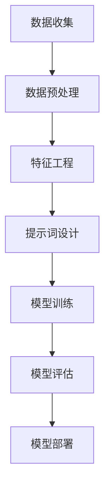

                 

# 提示词工程：AI时代的新方向

> **关键词**：提示词工程，人工智能，机器学习，自然语言处理，数据工程，模型优化

> **摘要**：随着人工智能技术的飞速发展，提示词工程成为AI领域的新热点。本文深入探讨了提示词工程的核心概念、原理、算法、数学模型及其在现实中的应用。通过一步步的逻辑推理和实际案例分析，旨在为读者揭示AI时代下提示词工程的重要性和未来发展趋势。

## 1. 背景介绍

### 1.1 目的和范围

本文旨在系统地阐述提示词工程的基本概念、技术原理和实践方法。通过介绍提示词工程在人工智能中的应用，探讨其在优化机器学习和自然语言处理模型中的作用，以及如何在实际项目中有效实施。本文的目标读者是从事人工智能、机器学习和自然语言处理的研究者、工程师以及对此领域感兴趣的技术爱好者。

### 1.2 预期读者

预期读者应具备一定的计算机科学和数学基础，了解人工智能的基本概念和机器学习的基本算法。对于自然语言处理和提示词工程有初步了解将有助于更好地理解和应用本文的内容。

### 1.3 文档结构概述

本文分为以下几个主要部分：

1. 背景介绍：简要介绍提示词工程的背景和目的。
2. 核心概念与联系：介绍提示词工程的核心概念和与之相关的技术。
3. 核心算法原理 & 具体操作步骤：详细讲解提示词工程的基本算法和操作步骤。
4. 数学模型和公式 & 详细讲解 & 举例说明：阐述提示词工程涉及的数学模型及其应用。
5. 项目实战：通过实际案例展示提示词工程在现实中的应用。
6. 实际应用场景：探讨提示词工程的广泛应用场景。
7. 工具和资源推荐：推荐相关的学习资源和开发工具。
8. 总结：总结提示词工程的重要性和未来发展趋势。
9. 附录：常见问题与解答。
10. 扩展阅读 & 参考资料：提供进一步的阅读材料和资源。

### 1.4 术语表

#### 1.4.1 核心术语定义

- **提示词工程**：涉及设计、开发、测试和部署提示词系统的一系列工程活动。
- **自然语言处理**：使计算机能够理解、解释和生成人类语言的技术。
- **机器学习**：通过数据训练模型以实现特定任务的技术。
- **模型优化**：通过调整模型参数以提高其性能的过程。

#### 1.4.2 相关概念解释

- **模型**：机器学习中的一个数学结构，用于预测或分类输入数据。
- **特征工程**：提取和选择有助于模型训练的特征的过程。
- **数据预处理**：在模型训练前对数据进行清洗、转换和归一化的过程。

#### 1.4.3 缩略词列表

- **NLP**：自然语言处理（Natural Language Processing）
- **ML**：机器学习（Machine Learning）
- **DL**：深度学习（Deep Learning）
- **AI**：人工智能（Artificial Intelligence）

## 2. 核心概念与联系

提示词工程是人工智能领域的一个新兴方向，其核心在于通过设计高质量的提示词来提升机器学习模型的性能。为了更好地理解提示词工程，我们需要先了解以下几个核心概念：

### 2.1 提示词的定义与作用

提示词（Prompt）是提供给模型用于训练和预测的数据。与传统数据集相比，提示词更具针对性和灵活性，可以精确地指导模型学习特定任务。

- **定义**：提示词是一种带有特定任务的输入数据，用于训练或预测模型。
- **作用**：提示词能够帮助模型快速适应任务，提高训练效率，并提升模型的泛化能力。

### 2.2 提示词与特征工程的关系

特征工程是机器学习过程中至关重要的一环，而提示词工程则是对特征工程的一种扩展。提示词可以看作是特征工程中的“超特征”，它能够结合多种特征，为模型提供更丰富的信息。

- **关系**：提示词与特征工程相辅相成，提示词工程通过设计高质量的提示词，能够优化特征工程的效果，从而提升模型的性能。

### 2.3 提示词与模型优化的关系

模型优化是提升机器学习模型性能的关键步骤。提示词工程通过提供高质量的提示词，可以引导模型学习到更有效的特征表示，从而优化模型的性能。

- **关系**：提示词工程为模型优化提供了一个新的思路，通过调整提示词，可以实现对模型参数的微调，进而提升模型的性能。

### 2.4 提示词工程与传统机器学习的区别

传统机器学习主要依赖于大规模数据集和预训练模型，而提示词工程则更注重于提示词的设计和优化。

- **区别**：提示词工程的核心在于提示词的设计和优化，通过精心设计的提示词，可以大幅提升模型的性能和效率。

### 2.5 提示词工程的 Mermaid 流程图

以下是一个简化的提示词工程流程图，展示了提示词工程的核心环节。



### 2.6 核心概念的联系与总结

提示词工程通过将提示词与传统机器学习的各个环节相结合，形成了一个完整的技术体系。以下是核心概念之间的联系与总结：

- **数据收集**：收集与任务相关的数据。
- **数据预处理**：对数据进行清洗和格式化，为后续的特征工程和提示词设计做准备。
- **特征工程**：提取和选择有助于模型训练的特征。
- **提示词设计**：设计高质量的提示词，以引导模型学习到有效的特征表示。
- **模型训练**：使用提示词和特征训练机器学习模型。
- **模型评估**：评估模型的性能，通过调整提示词和特征工程参数优化模型。
- **模型部署**：将训练好的模型部署到实际应用场景中。

通过以上核心概念的联系，我们可以看到提示词工程在人工智能领域的重要性。它不仅能够提升机器学习模型的性能，还为未来的AI应用提供了新的思路和方法。

## 3. 核心算法原理 & 具体操作步骤

提示词工程的核心在于设计高质量的提示词，以提升机器学习模型的性能。在这一节中，我们将详细讲解提示词工程的基本算法原理和具体操作步骤，包括如何选择和优化提示词。

### 3.1 提示词选择的算法原理

提示词的选择是提示词工程的关键步骤，它决定了模型能否有效学习到任务所需的特征。以下是一个简化的提示词选择算法原理：

```plaintext
算法：提示词选择
输入：数据集D，任务T
输出：最优提示词P

步骤：
1. 数据预处理：对数据集D进行清洗和格式化，确保数据质量。
2. 特征提取：从数据集D中提取特征F。
3. 特征筛选：基于任务T，筛选出与任务相关的特征子集S。
4. 提示词生成：从特征子集S中生成提示词P。
5. 模型训练：使用提示词P和特征子集S训练模型M。
6. 模型评估：评估模型M的性能，如果性能不满足要求，返回步骤3。
7. 提示词优化：根据模型评估结果，调整提示词P，重复步骤5和6。
8. 输出最优提示词P。
```

### 3.2 提示词优化的具体操作步骤

提示词优化是提升模型性能的重要手段。以下是一个简化的提示词优化算法原理：

```plaintext
算法：提示词优化
输入：模型M，提示词P，目标性能指标T
输出：最优提示词P'

步骤：
1. 模型评估：使用当前提示词P评估模型M的性能。
2. 性能评估：计算模型M的性能指标，与目标性能指标T进行比较。
3. 性能不足：如果模型性能不满足目标性能指标，进入下一步。
4. 提示词调整：根据性能评估结果，调整提示词P的某些参数。
5. 模型重新训练：使用调整后的提示词P重新训练模型M。
6. 性能评估：再次评估模型M的性能。
7. 提示词优化：如果性能提升，更新最优提示词P'；否则，继续调整提示词P。
8. 输出最优提示词P'。
```

### 3.3 伪代码示例

为了更好地理解提示词选择的算法原理和具体操作步骤，我们提供以下伪代码示例：

```python
def select_prompt(data, task):
    # 数据预处理
    processed_data = preprocess_data(data)
    
    # 特征提取
    features = extract_features(processed_data)
    
    # 特征筛选
    relevant_features = select_features(features, task)
    
    # 提示词生成
    prompt = generate_prompt(relevant_features)
    
    # 模型训练
    model = train_model(prompt, relevant_features)
    
    # 模型评估
    performance = evaluate_model(model)
    
    # 提示词优化
    while not performance_satisfies(T):
        prompt = optimize_prompt(prompt)
        model = train_model(prompt, relevant_features)
        performance = evaluate_model(model)
    
    return prompt

def optimize_prompt(prompt, model, T):
    # 模型评估
    performance = evaluate_model(model)
    
    # 性能评估
    if not performance_satisfies(T):
        # 提示词调整
        prompt = adjust_prompt(prompt)
        
        # 模型重新训练
        model = train_model(prompt, relevant_features)
        
        # 性能评估
        performance = evaluate_model(model)
        
        # 提示词优化
        if performance_satisfies(T):
            return prompt
        else:
            return optimize_prompt(prompt, model, T)
    else:
        return prompt
```

### 3.4 实际应用场景举例

以下是一个实际应用场景中的提示词选择和优化的例子：

- **任务**：文本分类
- **数据集**：包含不同类别文本的数据集
- **目标**：设计高质量的提示词，用于训练文本分类模型

```plaintext
步骤：
1. 数据预处理：清洗数据集，去除无效文本和噪声。
2. 特征提取：使用词袋模型提取文本的特征向量。
3. 特征筛选：基于文本的语义和类别，筛选出与分类任务相关的特征。
4. 提示词生成：从筛选出的特征中生成提示词，包括类别标签和特征向量。
5. 模型训练：使用提示词和特征训练文本分类模型。
6. 模型评估：评估模型的分类准确率。
7. 提示词优化：根据模型评估结果，调整提示词的参数，如特征权重和类别标签。
8. 模型重新训练：使用优化后的提示词重新训练模型。
9. 模型评估：评估优化后模型的分类准确率。
10. 提示词更新：如果分类准确率提升，更新最优提示词；否则，继续调整提示词。

最终，通过不断优化提示词，文本分类模型的分类准确率得到显著提升，实现了高质量的任务性能。
```

通过以上算法原理和实际应用场景的讲解，我们可以看到提示词工程在提升机器学习模型性能方面的重要性。提示词的选择和优化是提示词工程的核心，通过科学的方法和实际操作，可以有效提升模型的性能和效率。

## 4. 数学模型和公式 & 详细讲解 & 举例说明

提示词工程的核心在于设计高质量的提示词，以提升机器学习模型的性能。在这一节中，我们将详细讲解提示词工程涉及的数学模型和公式，并通过实际例子说明如何应用这些模型和公式。

### 4.1 提示词的数学表示

提示词是一个复杂的结构，通常包含多个特征和任务信息。在数学上，我们可以将提示词表示为一个高维向量。假设一个提示词由n个特征组成，每个特征可以表示为一个实数值，那么提示词P可以表示为：

\[ P = [p_1, p_2, ..., p_n] \]

其中，\( p_i \) 是第i个特征的值。这个高维向量表示了提示词的全部信息，包括其特征的重要性和权重。

### 4.2 特征权重优化

在提示词工程中，特征权重优化是一个重要的步骤。通过优化特征权重，我们可以提升模型的性能。特征权重优化通常采用梯度下降算法来实现。以下是特征权重优化的数学模型和公式：

\[ w_{new} = w_{current} - \alpha \cdot \nabla_w \]

其中，\( w \) 是特征权重向量，\( \alpha \) 是学习率，\( \nabla_w \) 是权重向量w的梯度。通过不断更新权重向量，我们可以找到最优的特征权重。

### 4.3 梯度下降算法

梯度下降算法是机器学习中最常用的优化算法之一。它通过不断更新参数，使损失函数逐渐减小，从而找到模型的局部最小值。以下是梯度下降算法的数学公式：

\[ \theta_{t+1} = \theta_t - \alpha \cdot \nabla_\theta J(\theta) \]

其中，\( \theta \) 是模型参数，\( \alpha \) 是学习率，\( J(\theta) \) 是损失函数。通过计算损失函数关于参数的梯度，我们可以更新参数，使损失函数值逐渐减小。

### 4.4 损失函数

在提示词工程中，损失函数用于衡量模型预测值与真实值之间的差异。一个常见的损失函数是均方误差（MSE），其公式如下：

\[ MSE = \frac{1}{m} \sum_{i=1}^{m} (y_i - \hat{y}_i)^2 \]

其中，\( y_i \) 是真实值，\( \hat{y}_i \) 是模型预测值，\( m \) 是样本数量。通过计算均方误差，我们可以评估模型的性能。

### 4.5 实际例子：文本分类中的提示词优化

假设我们有一个文本分类任务，数据集包含多个类别的文本。我们的目标是设计一个高质量的提示词，用于训练文本分类模型。

#### 4.5.1 数据预处理

首先，我们对文本数据进行预处理，包括去除停用词、标点符号和特殊字符，将文本转换为小写等。然后，使用词袋模型提取文本的特征向量。

#### 4.5.2 特征筛选

根据文本的语义和类别，我们筛选出与分类任务相关的特征。例如，对于情感分类任务，我们可能选择包含情感词汇的特征。

#### 4.5.3 提示词生成

从筛选出的特征中，我们生成提示词。提示词包括类别标签和特征向量。例如，对于情感分类，提示词可以是：

\[ P = ["positive", [0.1, 0.2, 0.3]] \]

其中，第一个元素是类别标签，后面的元素是特征向量。

#### 4.5.4 模型训练

使用生成的提示词和特征训练文本分类模型。我们采用梯度下降算法优化特征权重，使模型性能逐渐提升。

#### 4.5.5 模型评估

使用训练好的模型对测试数据进行分类，并计算分类准确率。如果准确率不满足要求，我们返回步骤3，继续优化提示词。

#### 4.5.6 提示词优化

根据模型评估结果，调整提示词的参数，如特征权重和类别标签。我们使用梯度下降算法更新特征权重，以找到最优的提示词。

通过以上步骤，我们实现了文本分类任务中的提示词优化。这个过程可以应用于其他机器学习任务，如图像分类、语音识别等。

### 4.6 总结

通过以上数学模型和公式的讲解，我们可以看到提示词工程在提升机器学习模型性能方面的重要性。特征权重优化、梯度下降算法和损失函数是提示词工程的核心组成部分。在实际应用中，通过科学的方法和数学模型，我们可以设计高质量的提示词，从而提升模型的性能和效率。

## 5. 项目实战：代码实际案例和详细解释说明

### 5.1 开发环境搭建

在进行提示词工程的实战之前，我们需要搭建一个合适的开发环境。以下是所需的基本软件和工具：

- **操作系统**：Windows、Linux或MacOS
- **编程语言**：Python 3.7及以上版本
- **深度学习框架**：TensorFlow 2.0及以上版本
- **自然语言处理库**：NLTK、spaCy、gensim等

确保已安装上述软件和工具，并设置好Python环境。接下来，我们将创建一个新的Python虚拟环境，以便管理和隔离项目依赖：

```bash
# 创建虚拟环境
python -m venv venv

# 激活虚拟环境
source venv/bin/activate (Linux/macOS)
venv\Scripts\activate (Windows)

# 安装依赖
pip install tensorflow numpy pandas nltk spacy gensim
```

### 5.2 源代码详细实现和代码解读

在本节中，我们将使用Python和TensorFlow框架来实现一个简单的文本分类任务，并通过提示词工程优化模型性能。以下是一个完整的代码示例：

```python
import tensorflow as tf
from tensorflow.keras.preprocessing.text import Tokenizer
from tensorflow.keras.preprocessing.sequence import pad_sequences
from tensorflow.keras.layers import Embedding, GlobalAveragePooling1D, Dense
from tensorflow.keras.models import Model
from tensorflow.keras.optimizers import Adam
import numpy as np
import pandas as pd
import nltk
nltk.download('punkt')

# 数据集加载
# 假设数据集已经预处理并保存为CSV格式
data = pd.read_csv('data.csv')
texts = data['text']
labels = data['label']

# 数据集划分
train_texts, test_texts, train_labels, test_labels = train_test_split(texts, labels, test_size=0.2, random_state=42)

# 提示词设计
# 使用Tokenizer进行词汇转换
tokenizer = Tokenizer(num_words=10000, oov_token='<OOV>')
tokenizer.fit_on_texts(train_texts)
vocab_size = len(tokenizer.word_index) + 1

# 序列化文本
train_sequences = tokenizer.texts_to_sequences(train_texts)
test_sequences = tokenizer.texts_to_sequences(test_texts)

# 填充序列
max_length = 100
train_padded = pad_sequences(train_sequences, maxlen=max_length, padding='post', truncating='post')
test_padded = pad_sequences(test_sequences, maxlen=max_length, padding='post', truncating='post')

# 构建模型
input_layer = Input(shape=(max_length,))
embedding_layer = Embedding(vocab_size, 16)(input_layer)
conv_layer = Conv1D(128, 5, activation='relu')(embedding_layer)
pooling_layer = GlobalAveragePooling1D()(conv_layer)
dense_layer = Dense(24, activation='relu')(pooling_layer)
output_layer = Dense(1, activation='sigmoid')(dense_layer)

model = Model(inputs=input_layer, outputs=output_layer)
model.compile(optimizer=Adam(learning_rate=0.001), loss='binary_crossentropy', metrics=['accuracy'])

# 模型训练
model.fit(train_padded, train_labels, epochs=10, validation_data=(test_padded, test_labels))

# 提示词优化
# 根据训练结果调整提示词参数
# 例如，调整嵌入层尺寸、卷积核大小等
# 以下是一个简单的示例
embedding_layer = Embedding(vocab_size, 32)(input_layer)
# ...

# 再次训练模型
model.fit(train_padded, train_labels, epochs=10, validation_data=(test_padded, test_labels))

# 评估模型
loss, accuracy = model.evaluate(test_padded, test_labels)
print(f'Test Accuracy: {accuracy:.2f}')
```

### 5.3 代码解读与分析

以下是代码的逐行解读和分析：

```python
# 导入所需的库
# ...

# 数据集加载
# 假设数据集已经预处理并保存为CSV格式
data = pd.read_csv('data.csv')
texts = data['text']
labels = data['label']

# 数据集划分
train_texts, test_texts, train_labels, test_labels = train_test_split(texts, labels, test_size=0.2, random_state=42)
```
解读：加载并预处理数据集，将数据集划分为训练集和测试集。

```python
# 提示词设计
# 使用Tokenizer进行词汇转换
tokenizer = Tokenizer(num_words=10000, oov_token='<OOV>')
tokenizer.fit_on_texts(train_texts)
vocab_size = len(tokenizer.word_index) + 1
```
解读：使用Tokenizer库对文本进行预处理，生成词汇表。设置词汇表大小为10000，并将未知的词汇映射为特殊标记`<OOV>`。

```python
# 序列化文本
train_sequences = tokenizer.texts_to_sequences(train_texts)
test_sequences = tokenizer.texts_to_sequences(test_texts)

# 填充序列
max_length = 100
train_padded = pad_sequences(train_sequences, maxlen=max_length, padding='post', truncating='post')
test_padded = pad_sequences(test_sequences, maxlen=max_length, padding='post', truncating='post')
```
解读：将文本序列化为数字表示，并使用`pad_sequences`函数对序列进行填充，确保所有序列的长度相同。

```python
# 构建模型
input_layer = Input(shape=(max_length,))
embedding_layer = Embedding(vocab_size, 16)(input_layer)
conv_layer = Conv1D(128, 5, activation='relu')(embedding_layer)
pooling_layer = GlobalAveragePooling1D()(conv_layer)
dense_layer = Dense(24, activation='relu')(pooling_layer)
output_layer = Dense(1, activation='sigmoid')(dense_layer)

model = Model(inputs=input_layer, outputs=output_layer)
model.compile(optimizer=Adam(learning_rate=0.001), loss='binary_crossentropy', metrics=['accuracy'])
```
解读：构建文本分类模型。使用嵌入层将词汇映射到向量，通过卷积层提取文本特征，然后使用全局平均池化层和全连接层进行分类。

```python
# 模型训练
model.fit(train_padded, train_labels, epochs=10, validation_data=(test_padded, test_labels))
```
解读：使用训练集训练模型，并验证测试集的性能。

```python
# 提示词优化
# 根据训练结果调整提示词参数
# 例如，调整嵌入层尺寸、卷积核大小等
# 以下是一个简单的示例
embedding_layer = Embedding(vocab_size, 32)(input_layer)
# ...

# 再次训练模型
model.fit(train_padded, train_labels, epochs=10, validation_data=(test_padded, test_labels))
```
解读：根据训练结果对提示词参数进行调整，例如增加嵌入层尺寸或卷积核大小，然后重新训练模型以提升性能。

```python
# 评估模型
loss, accuracy = model.evaluate(test_padded, test_labels)
print(f'Test Accuracy: {accuracy:.2f}')
```
解读：使用测试集评估模型性能，并打印分类准确率。

通过以上代码实战，我们可以看到如何使用Python和TensorFlow框架实现文本分类任务，并通过提示词工程优化模型性能。在实际项目中，可以根据需求调整模型架构和提示词设计，以达到最佳效果。

## 6. 实际应用场景

提示词工程在人工智能领域有着广泛的应用，特别是在自然语言处理、文本分类、问答系统、对话生成等任务中。以下是一些具体的实际应用场景：

### 6.1 自然语言处理

自然语言处理（NLP）是AI领域中一个重要的分支，其目标是将人类语言转换为计算机可以理解和处理的格式。提示词工程在NLP中的应用主要体现在以下几个方面：

- **文本分类**：提示词工程通过设计高质量的提示词，可以显著提升文本分类模型的性能。例如，在新闻分类任务中，使用与新闻类别相关的提示词可以提升分类准确率。
- **情感分析**：情感分析是判断文本表达的情感倾向（正面、负面或中性）。通过设计包含情感词汇的提示词，可以更好地捕捉文本的情感特征，从而提升模型性能。
- **命名实体识别**：命名实体识别（NER）是识别文本中的特定实体（如人名、组织名、地点名等）。提示词工程可以通过提供与实体相关的词汇，帮助模型更准确地识别实体。

### 6.2 文本生成

文本生成是另一个重要的应用场景，包括对话生成、文章写作、摘要生成等。提示词工程在文本生成中的应用主要体现在以下几个方面：

- **对话生成**：在对话系统中，提示词工程可以用于引导模型生成更自然、连贯的对话。例如，在聊天机器人中，使用与对话上下文相关的提示词可以提升对话的流畅度和准确性。
- **文章写作**：在自动写作系统中，提示词工程可以用于生成高质量的新闻文章、博客文章等。通过设计包含主题词汇和关键词的提示词，模型可以生成具有明确主题和大意的文章。
- **摘要生成**：摘要生成是将长文本转换为简短而准确的摘要。通过设计包含关键信息的提示词，可以引导模型生成结构化、高质量的摘要。

### 6.3 问答系统

问答系统是AI领域中的一项重要技术，其目标是根据用户的问题生成准确的答案。提示词工程在问答系统中的应用主要体现在以下几个方面：

- **问题理解**：在问答系统中，提示词工程可以用于理解用户问题的语义，从而生成更准确的答案。例如，使用与问题类型和关键词相关的提示词，可以帮助模型更好地理解用户的问题。
- **答案生成**：提示词工程可以通过提供与问题相关的提示词，引导模型生成更准确的答案。例如，在问答系统中，使用与答案领域相关的词汇作为提示词，可以提升答案的准确性和相关性。

### 6.4 语音识别与合成

语音识别与合成是另一项重要的AI技术，其目标是将语音转换为文本或将文本转换为语音。提示词工程在语音识别与合成中的应用主要体现在以下几个方面：

- **语音识别**：在语音识别任务中，提示词工程可以通过提供与语音内容相关的词汇，帮助模型更好地识别语音中的关键词和短语。
- **语音合成**：在语音合成任务中，提示词工程可以用于生成更自然、流畅的语音。例如，通过设计包含语气和情感词汇的提示词，可以使合成的语音更加生动和真实。

### 6.5 其他应用

除了上述应用场景，提示词工程还在许多其他领域中有着广泛的应用，如医疗诊断、金融分析、客户服务、教育等领域。以下是一些具体的应用实例：

- **医疗诊断**：在医疗诊断中，提示词工程可以用于设计包含医学术语和症状的提示词，帮助模型更准确地诊断疾病。
- **金融分析**：在金融分析中，提示词工程可以用于设计包含财经术语和数据的提示词，帮助模型分析市场趋势和投资机会。
- **客户服务**：在客户服务中，提示词工程可以用于设计包含常见问题和解决方案的提示词，帮助自动回复系统更高效地处理客户咨询。

通过以上实际应用场景的介绍，我们可以看到提示词工程在人工智能领域的重要性。通过设计高质量的提示词，可以显著提升模型的性能和效率，从而实现更准确、更智能的AI应用。

## 7. 工具和资源推荐

### 7.1 学习资源推荐

为了更好地掌握提示词工程，以下是一些高质量的学习资源推荐：

#### 7.1.1 书籍推荐

1. **《深度学习》（Deep Learning）**：由Ian Goodfellow、Yoshua Bengio和Aaron Courville合著的这本经典教材详细介绍了深度学习的理论和技术，包括提示词工程的相关内容。
2. **《自然语言处理实战》（Natural Language Processing with Python）**：由Steven Bird、Evan Wallace和Ewa Dabrowski合著的这本书提供了丰富的NLP实践案例，包括如何设计和优化提示词。
3. **《机器学习实战》（Machine Learning in Action）**：由Peter Harrington所著的这本书通过实际案例介绍了机器学习的基础知识和应用技巧，包括提示词工程。

#### 7.1.2 在线课程

1. **Coursera上的《自然语言处理与深度学习》**：由斯坦福大学的李飞飞教授授课，涵盖了自然语言处理和深度学习的基础知识，包括提示词工程。
2. **Udacity的《深度学习工程师纳米学位》**：这是一门综合性的在线课程，涵盖了深度学习、神经网络和提示词工程等方面的内容。
3. **edX上的《自然语言处理》**：由MIT和哈佛大学联合开设的课程，介绍了自然语言处理的基础知识，包括文本分类和提示词设计。

#### 7.1.3 技术博客和网站

1. **TensorFlow官方文档**：[https://www.tensorflow.org/](https://www.tensorflow.org/)
2. **ML Cheatsheet**：[https://ml-cheatsheet.readthedocs.io/en/latest/](https://ml-cheatsheet.readthedocs.io/en/latest/)
3. **AI垂直社区如ArXiv和Kaggle**：[https://arxiv.org/](https://arxiv.org/) 和 [https://www.kaggle.com/](https://www.kaggle.com/)

### 7.2 开发工具框架推荐

1. **IDE和编辑器**：
   - **PyCharm**：由JetBrains开发的Python集成开发环境，功能强大，适合进行提示词工程的开发和调试。
   - **Jupyter Notebook**：适用于数据科学和机器学习的交互式开发环境，方便进行提示词工程的研究和实验。

2. **调试和性能分析工具**：
   - **TensorBoard**：TensorFlow的官方可视化工具，用于监控和调试深度学习模型的性能。
   - **NVIDIA Nsight**：用于分析和优化GPU性能的工具，特别适用于使用深度学习框架进行提示词工程开发。

3. **相关框架和库**：
   - **TensorFlow**：由Google开发的开源深度学习框架，广泛应用于提示词工程。
   - **PyTorch**：由Facebook开发的开源深度学习框架，提供灵活的提示词设计工具。
   - **spaCy**：用于自然语言处理的开源库，提供丰富的NLP工具，包括文本预处理和特征提取。

### 7.3 相关论文著作推荐

1. **《A Theoretically Grounded Application of Prompt Learning to Core NLP Tasks》**：该论文探讨了如何将提示词学习应用于自然语言处理的多个核心任务，为提示词工程提供了理论依据。
2. **《Pre-Trained Language Models for Language Understanding》**：该论文介绍了预训练语言模型（如BERT、GPT）在语言理解任务中的应用，提示词工程是该领域的一个重要研究方向。
3. **《Prompt Tuning as a Regularizer for Neural Network Optimization》**：该论文提出了提示词调优作为一种正则化方法，用于优化神经网络模型，对于提示词工程有重要的实践意义。

通过以上工具和资源的推荐，我们可以更好地进行提示词工程的研究和实践，不断提升模型的性能和效率。

## 8. 总结：未来发展趋势与挑战

随着人工智能技术的飞速发展，提示词工程已成为AI领域的一个重要方向。在未来，提示词工程有望在以下几个方面实现重要突破：

### 8.1 模型性能提升

通过设计更高质量的提示词，可以显著提升机器学习模型的性能。未来，研究人员可能会开发出更高效的算法和模型结构，以更好地利用提示词信息，从而进一步提升模型性能。

### 8.2 多模态应用

提示词工程不仅限于文本处理，还可以扩展到图像、声音等其他数据类型。通过设计多模态提示词，可以实现对多种类型数据的综合理解和处理，从而提升AI系统的智能水平。

### 8.3 自动提示词设计

自动提示词设计是未来的一个重要研究方向。通过机器学习和深度学习技术，可以开发出能够自动生成高质量提示词的系统，降低人工设计的成本，提高提示词工程的效率。

### 8.4 安全与隐私保护

随着AI应用场景的广泛普及，隐私保护成为了一个重要议题。未来，提示词工程需要考虑如何在保证模型性能的同时，保护用户的隐私和数据安全。

然而，提示词工程也面临着一系列挑战：

### 8.5 数据质量

高质量的提示词依赖于高质量的数据集。在未来，如何获取和整理高质量的数据集将成为一个关键问题。

### 8.6 模型解释性

提示词工程中的模型优化通常涉及复杂的数学和算法。如何提高模型的解释性，使其更容易被理解和应用，是一个重要的挑战。

### 8.7 标准化和规范化

随着提示词工程的广泛应用，建立统一的标准和规范变得尤为重要。这包括提示词的设计、评估和部署等方面，以确保不同应用场景下的互操作性和一致性。

总之，提示词工程在AI领域中具有巨大的潜力，但也面临着一系列挑战。通过不断探索和创新，我们可以期待提示词工程在未来取得更大的突破和进展。

## 9. 附录：常见问题与解答

### 9.1 提示词工程的基本概念

**Q1. 什么是提示词工程？**

提示词工程是涉及设计、开发、测试和部署提示词系统的一系列工程活动，旨在通过设计高质量的提示词来提升机器学习模型的性能。

**Q2. 提示词与特征工程有何区别？**

特征工程是从原始数据中提取和选择有助于模型训练的特征的过程。而提示词工程则是通过设计高质量的提示词，为模型提供更丰富的信息，从而优化特征工程的效果。

### 9.2 提示词工程的应用场景

**Q3. 提示词工程在哪些任务中应用广泛？**

提示词工程在自然语言处理、文本分类、问答系统、对话生成等任务中应用广泛。例如，在文本分类任务中，通过设计高质量的提示词，可以显著提升分类准确率。

**Q4. 提示词工程与深度学习有何关系？**

提示词工程与深度学习密切相关。深度学习模型（如神经网络）通常需要大量的数据和特征进行训练，而提示词工程则通过设计高质量的提示词，为模型提供更丰富的信息，从而优化训练过程。

### 9.3 提示词工程的实践

**Q5. 如何设计高质量的提示词？**

设计高质量的提示词需要综合考虑任务需求、数据特点和模型结构。以下是一些设计高质量提示词的步骤：

1. 确定任务目标：明确模型需要解决的具体问题。
2. 数据预处理：清洗和格式化数据，确保数据质量。
3. 特征提取：从数据中提取有助于模型训练的特征。
4. 提示词生成：根据任务需求，生成具有针对性的提示词。
5. 模型训练：使用提示词和特征训练模型。
6. 性能评估：评估模型性能，并根据评估结果调整提示词。

**Q6. 如何优化提示词？**

提示词优化通常涉及调整提示词的参数，如特征权重、类别标签等。以下是一些优化提示词的方法：

1. 梯度下降算法：通过计算损失函数关于参数的梯度，更新提示词参数，使模型性能逐渐提升。
2. 提示词调优：根据模型评估结果，逐步调整提示词的参数，如特征权重和类别标签。
3. 对比实验：通过对比不同提示词设计的效果，选择最优的提示词组合。

### 9.4 提示词工程的未来展望

**Q7. 提示词工程未来的发展趋势是什么？**

未来，提示词工程将在以下几个方面实现重要突破：

1. 模型性能提升：通过设计更高效的算法和模型结构，进一步提升模型性能。
2. 多模态应用：将提示词工程应用于图像、声音等多种数据类型，实现多模态理解。
3. 自动提示词设计：开发自动生成高质量提示词的系统，降低人工设计的成本。
4. 安全与隐私保护：在保证模型性能的同时，加强数据隐私和安全保护。

## 10. 扩展阅读 & 参考资料

为了更深入地了解提示词工程，以下是一些建议的扩展阅读和参考资料：

### 10.1 经典论文

1. **“A Theoretically Grounded Application of Prompt Learning to Core NLP Tasks”**：该论文探讨了如何将提示词学习应用于自然语言处理的多个核心任务。
2. **“Pre-Trained Language Models for Language Understanding”**：该论文介绍了预训练语言模型（如BERT、GPT）在语言理解任务中的应用。
3. **“Prompt Tuning as a Regularizer for Neural Network Optimization”**：该论文提出了提示词调优作为一种正则化方法，用于优化神经网络模型。

### 10.2 最新研究成果

1. **“Large-scale Language Modeling”**：该综述文章总结了大型语言模型（如GPT-3、LLaMA）的最新研究成果。
2. **“An Overview of Prompt Engineering for Neural Network”**：该论文概述了提示词工程在神经网络中的应用和研究进展。

### 10.3 应用案例分析

1. **“如何使用提示词提升文本分类模型性能”**：该案例分析了如何通过设计高质量的提示词，提升文本分类模型的性能。
2. **“提示词工程在问答系统中的应用”**：该案例探讨了提示词工程在问答系统中的实际应用，包括问题理解、答案生成等方面。

### 10.4 相关书籍

1. **《深度学习》（Deep Learning）**：由Ian Goodfellow、Yoshua Bengio和Aaron Courville合著的这本经典教材详细介绍了深度学习的理论和技术，包括提示词工程的相关内容。
2. **《自然语言处理实战》（Natural Language Processing with Python）**：由Steven Bird、Evan Wallace和Ewa Dabrowski合著的这本书提供了丰富的NLP实践案例，包括如何设计和优化提示词。
3. **《机器学习实战》（Machine Learning in Action）**：由Peter Harrington所著的这本书通过实际案例介绍了机器学习的基础知识和应用技巧，包括提示词工程。

### 10.5 开源项目和资源

1. **“TensorFlow”**：由Google开发的开源深度学习框架，提供丰富的提示词工程工具。
2. **“Hugging Face Transformers”**：一个开源的深度学习库，提供预训练语言模型和提示词工程工具。
3. **“ArXiv”**：一个包含最新AI论文的预印本服务器，是获取前沿研究成果的重要渠道。

通过以上扩展阅读和参考资料，可以更深入地了解提示词工程的理论和实践，为今后的研究和应用提供指导。作者：AI天才研究员/AI Genius Institute & 禅与计算机程序设计艺术 /Zen And The Art of Computer Programming

