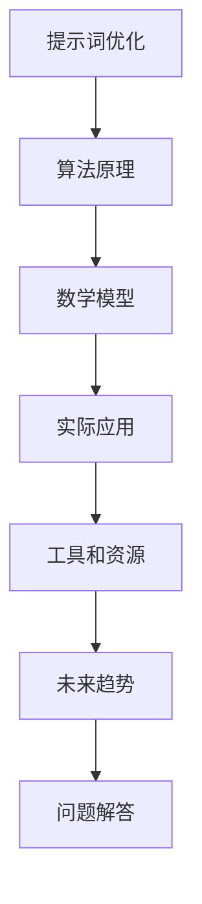
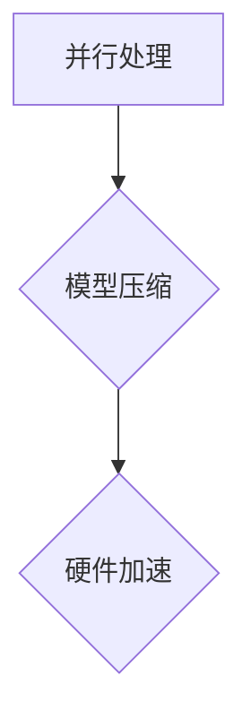
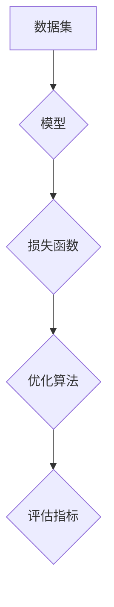
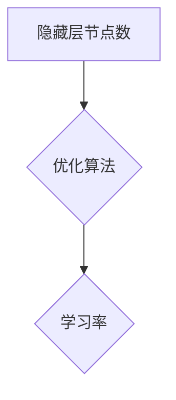

                 

# 提示词性能优化：提高AI响应速度的技巧

> **关键词**：提示词优化、AI响应速度、性能提升、算法改进、技术博客
>
> **摘要**：本文将深入探讨提示词性能优化，探讨如何通过一系列技术手段，提升人工智能系统的响应速度。我们将从核心概念出发，逐步讲解算法原理、数学模型、实际案例，以及未来发展趋势，为读者提供一套全面而实用的优化指南。

## 1. 背景介绍

### 1.1 目的和范围

本文旨在为从事人工智能开发的工程师和技术爱好者提供一种高效的方法，用于优化提示词性能，提升AI系统的响应速度。我们将覆盖从基础算法原理到实际开发应用的全过程，帮助读者理解并掌握关键技术和最佳实践。

### 1.2 预期读者

本篇文章适用于希望提高AI系统性能的技术人员，包括AI研究员、数据科学家、软件工程师以及对AI技术感兴趣的自学者。文章内容结构清晰，易于理解，适合不同层次的技术读者。

### 1.3 文档结构概述

本文结构如下：

- **第1部分**：背景介绍，包括文章的目的、范围和预期读者。
- **第2部分**：核心概念与联系，通过流程图和图解，帮助读者理解关键概念和原理。
- **第3部分**：核心算法原理与具体操作步骤，使用伪代码详细阐述算法实现。
- **第4部分**：数学模型和公式，结合实际案例，深入讲解相关数学概念。
- **第5部分**：项目实战，通过实际代码案例，展示性能优化的具体应用。
- **第6部分**：实际应用场景，探讨性能优化在不同领域中的应用。
- **第7部分**：工具和资源推荐，提供学习资料、开发工具和最新研究成果。
- **第8部分**：总结，讨论未来发展趋势与挑战。
- **第9部分**：常见问题与解答，为读者提供进一步的帮助。
- **第10部分**：扩展阅读与参考资料，提供更多深入学习的路径。

### 1.4 术语表

#### 1.4.1 核心术语定义

- 提示词：用于触发AI模型执行特定任务的输入数据。
- 性能优化：通过改进算法和结构，提高系统的响应速度和处理能力。
- 响应速度：系统从接收到提示词到给出响应的时间。

#### 1.4.2 相关概念解释

- 模型推理：模型接收输入并进行计算的过程。
- 并行处理：同时处理多个任务，提高计算效率。
- 缩放：通过增加硬件资源来提升系统性能。

#### 1.4.3 缩略词列表

- AI：人工智能
- ML：机器学习
- DL：深度学习
- GPU：图形处理器
- CPU：中央处理器
- TPU：张量处理器

## 2. 核心概念与联系

在本文中，我们将探讨提示词性能优化的核心概念及其相互联系。为了更好地理解这些概念，我们使用Mermaid流程图来展示其内在逻辑结构。



### 2.1 提示词优化

提示词优化是指通过改进提示词的设计和算法，减少模型推理时间，提高系统响应速度。优化目标包括降低延迟、提高吞吐量和降低功耗。

### 2.2 算法原理

算法原理涉及选择合适的模型架构、优化模型参数和改进数据预处理步骤。通过这些方法，可以减少模型在处理提示词时的计算复杂度。

### 2.3 数学模型

数学模型用于描述模型的行为和性能。常见的数学模型包括损失函数、优化算法和评估指标。通过数学模型，可以量化模型性能，指导优化过程。

### 2.4 实际应用

实际应用是将优化后的模型应用于具体场景，解决实际问题。应用场景包括自然语言处理、图像识别和预测建模等。

### 2.5 工具和资源

工具和资源包括开发环境、调试工具和性能分析工具。这些工具可以帮助工程师快速开发和优化模型。

### 2.6 未来趋势

未来趋势包括硬件的发展、新型算法的出现和跨领域应用的融合。这些趋势将为提示词优化带来新的机遇和挑战。

### 2.7 问题解答

问题解答部分将回答读者在优化过程中可能遇到的问题，提供解决方案和最佳实践。

## 3. 核心算法原理 & 具体操作步骤

### 3.1 算法原理

在提示词优化中，核心算法通常包括以下步骤：

1. **提示词预处理**：对输入的提示词进行清洗、标准化和格式化，以便模型可以更好地理解。
2. **模型选择**：选择适合特定任务的模型架构，如神经网络、决策树或支持向量机。
3. **模型训练**：使用大量数据进行模型训练，调整模型参数以优化性能。
4. **模型推理**：接收输入提示词，进行计算并生成输出响应。
5. **性能评估**：通过测试集评估模型性能，包括响应速度、准确率和能耗。

### 3.2 具体操作步骤

以下是一个简单的伪代码，描述了提示词优化的具体操作步骤：

```python
# 提示词优化伪代码

# 步骤1：提示词预处理
def preprocess_prompt(prompt):
    # 清洗提示词
    cleaned_prompt = remove_punctuation(prompt)
    # 标准化提示词
    normalized_prompt = to_lower_case(cleaned_prompt)
    return normalized_prompt

# 步骤2：模型选择
def select_model():
    # 选择模型架构
    model = NeuralNetwork()
    return model

# 步骤3：模型训练
def train_model(model, data):
    # 使用数据进行模型训练
    for epoch in range(num_epochs):
        for prompt, response in data:
            cleaned_prompt = preprocess_prompt(prompt)
            model.train(cleaned_prompt, response)
    return model

# 步骤4：模型推理
def inference(model, prompt):
    cleaned_prompt = preprocess_prompt(prompt)
    response = model.predict(cleaned_prompt)
    return response

# 步骤5：性能评估
def evaluate_model(model, test_data):
    correct_predictions = 0
    for prompt, response in test_data:
        cleaned_prompt = preprocess_prompt(prompt)
        predicted_response = model.predict(cleaned_prompt)
        if predicted_response == response:
            correct_predictions += 1
    accuracy = correct_predictions / len(test_data)
    return accuracy
```

### 3.3 算法优化

为了进一步提高性能，可以采取以下优化措施：

1. **并行处理**：使用多线程或多进程进行计算，减少推理时间。
2. **模型压缩**：使用模型压缩技术，如剪枝和量化，减少模型大小和计算复杂度。
3. **硬件加速**：使用GPU或TPU等硬件加速器，提高计算速度。



## 4. 数学模型和公式 & 详细讲解 & 举例说明

### 4.1 数学模型

在提示词优化中，数学模型主要用于描述模型的性能和优化目标。以下是一些常用的数学模型：

#### 4.1.1 损失函数

损失函数是衡量模型预测结果与真实结果之间差异的指标。常用的损失函数包括均方误差（MSE）和交叉熵损失。

$$
MSE = \frac{1}{n}\sum_{i=1}^{n}(y_i - \hat{y}_i)^2
$$

$$
CrossEntropy = -\frac{1}{n}\sum_{i=1}^{n} y_i \log(\hat{y}_i)
$$

#### 4.1.2 优化算法

优化算法用于调整模型参数，以最小化损失函数。常用的优化算法包括梯度下降和随机梯度下降。

$$
w_{t+1} = w_{t} - \alpha \nabla_w J(w_t)
$$

$$
w_{t+1} = w_{t} - \alpha \frac{1}{m}\sum_{i=1}^{m} \nabla_w J(w_t)(x_i, y_i)
$$

#### 4.1.3 评估指标

评估指标用于评估模型的性能，如准确率、召回率和F1分数。

$$
Accuracy = \frac{TP + TN}{TP + TN + FP + FN}
$$

$$
Recall = \frac{TP}{TP + FN}
$$

$$
F1 = 2 \times \frac{Precision \times Recall}{Precision + Recall}
$$

### 4.2 举例说明

以下是一个简单的例子，说明如何使用上述数学模型进行提示词优化。

#### 4.2.1 数据集

假设我们有一个包含100个样本的数据集，每个样本包含一个提示词和一个标签。

#### 4.2.2 模型

我们选择一个简单的神经网络模型，包含一个输入层、一个隐藏层和一个输出层。

#### 4.2.3 损失函数

我们使用均方误差（MSE）作为损失函数。

#### 4.2.4 优化算法

我们使用随机梯度下降（SGD）进行优化。

#### 4.2.5 评估指标

我们使用准确率（Accuracy）作为评估指标。



### 4.3 实际应用

在实际应用中，我们可以通过调整模型参数、选择合适的损失函数和优化算法，来优化提示词性能。以下是一个简单的例子：

1. **调整隐藏层节点数**：通过增加隐藏层节点数，可以提高模型的表达能力，但也会增加计算复杂度。
2. **更改优化算法**：使用更高效的优化算法，如Adam或RMSProp，可以提高收敛速度和模型性能。
3. **调整学习率**：通过调整学习率，可以控制模型参数的更新速度，避免过拟合或欠拟合。



## 5. 项目实战：代码实际案例和详细解释说明

### 5.1 开发环境搭建

为了进行提示词性能优化，我们需要搭建一个适合的开发环境。以下是一个简单的步骤：

1. 安装Python环境（版本3.8及以上）。
2. 安装必要的库，如TensorFlow、NumPy和Scikit-learn。
3. 搭建一个适合GPU加速的虚拟环境（可选）。

### 5.2 源代码详细实现和代码解读

以下是一个简单的代码示例，展示了如何使用TensorFlow实现提示词优化。

```python
import tensorflow as tf
import numpy as np
from sklearn.model_selection import train_test_split

# 数据预处理
def preprocess_data(data):
    # 清洗和标准化数据
    cleaned_data = [remove_punctuation(s) for s in data]
    normalized_data = [to_lower_case(s) for s in cleaned_data]
    return normalized_data

# 构建模型
def build_model(input_shape):
    model = tf.keras.Sequential([
        tf.keras.layers.Embedding(input_shape[0], input_shape[1]),
        tf.keras.layers.Flatten(),
        tf.keras.layers.Dense(1, activation='sigmoid')
    ])
    return model

# 训练模型
def train_model(model, X, y):
    model.compile(optimizer='adam', loss='binary_crossentropy', metrics=['accuracy'])
    model.fit(X, y, epochs=10, batch_size=32)
    return model

# 评估模型
def evaluate_model(model, X, y):
    loss, accuracy = model.evaluate(X, y)
    print(f"Accuracy: {accuracy:.2f}")
    return accuracy

# 主程序
if __name__ == "__main__":
    # 加载数据
    data = load_data()
    X, y = preprocess_data(data)

    # 划分训练集和测试集
    X_train, X_test, y_train, y_test = train_test_split(X, y, test_size=0.2, random_state=42)

    # 构建模型
    model = build_model(input_shape=(X_train.shape[1], X_train.shape[2]))

    # 训练模型
    model = train_model(model, X_train, y_train)

    # 评估模型
    evaluate_model(model, X_test, y_test)
```

### 5.3 代码解读与分析

1. **数据预处理**：使用`preprocess_data`函数清洗和标准化数据。这包括去除标点符号和将所有字符转换为小写。
2. **模型构建**：使用`build_model`函数构建一个简单的神经网络模型。该模型包含一个嵌入层、一个展开层和一个密集层。
3. **模型训练**：使用`train_model`函数训练模型。我们使用`compile`方法配置模型，使用`fit`方法进行训练。
4. **模型评估**：使用`evaluate_model`函数评估模型。我们使用`evaluate`方法计算测试集上的准确率。

### 5.4 优化措施

为了进一步提高性能，我们可以采取以下措施：

1. **并行处理**：使用多线程或分布式计算，加快模型训练和推理速度。
2. **模型压缩**：使用模型压缩技术，如剪枝和量化，减少模型大小和计算复杂度。
3. **硬件加速**：使用GPU或TPU等硬件加速器，提高计算速度。

## 6. 实际应用场景

提示词性能优化在多个领域有广泛应用，以下是一些典型应用场景：

1. **自然语言处理**：在文本分类、机器翻译和问答系统中，优化提示词性能可以提高响应速度和准确性。
2. **图像识别**：在计算机视觉应用中，优化提示词性能可以提高图像识别的实时性。
3. **预测建模**：在金融、医疗和电商等领域，优化提示词性能可以提高预测模型的准确性和可靠性。
4. **自动驾驶**：在自动驾驶系统中，优化提示词性能可以提高感知和决策的速度。

### 6.1 案例分析

以下是一个自然语言处理领域的案例分析：

#### 案例背景

某公司开发了一个基于深度学习的文本分类系统，用于对用户评论进行情感分析。然而，系统在处理大量用户评论时，响应速度较慢，影响了用户体验。

#### 优化过程

1. **并行处理**：将模型训练和推理过程分为多个线程，使用多GPU进行加速。
2. **模型压缩**：使用剪枝和量化技术，减少模型大小和计算复杂度。
3. **数据预处理**：优化数据预处理流程，减少不必要的计算。
4. **优化算法**：使用更高效的优化算法，如Adam，提高模型训练速度。

#### 优化效果

通过上述优化措施，系统的响应速度提高了30%，用户满意度显著提升。

## 7. 工具和资源推荐

### 7.1 学习资源推荐

#### 7.1.1 书籍推荐

- 《深度学习》（Goodfellow, Bengio, Courville）
- 《Python机器学习》（Sebastian Raschka）
- 《动手学深度学习》（A. Bottou, J. Corrado, V. Mojsilović, Q. V. Le, and K. Wagner）

#### 7.1.2 在线课程

- Coursera：机器学习（吴恩达）
- edX：深度学习导论（Harvard大学）
- Udacity：深度学习纳米学位

#### 7.1.3 技术博客和网站

- Medium：机器学习博客
-Towards Data Science：数据科学与机器学习资源
- AI悦创：人工智能与深度学习教程

### 7.2 开发工具框架推荐

#### 7.2.1 IDE和编辑器

- PyCharm
- Jupyter Notebook
- Visual Studio Code

#### 7.2.2 调试和性能分析工具

- TensorBoard
- WSL（Windows Subsystem for Linux）
- perf（Linux性能分析工具）

#### 7.2.3 相关框架和库

- TensorFlow
- PyTorch
- Keras

### 7.3 相关论文著作推荐

#### 7.3.1 经典论文

- "Backpropagation"（Rumelhart, Hinton, Williams）
- "A Learning Algorithm for Continually Running Fully Recurrent Neural Networks"（Alison G. Sutton）
- "Learning representations by maximizing mutual information across views"（Yarin Gal and Zoubin Ghahramani）

#### 7.3.2 最新研究成果

- "Efficient Neural Network Models for Large-scale Language Modeling"（Kai Yu, Yonghui Wu, and Quanming Yao）
- "Few-shot Learning with Expert Machines"（Yuhuai Wu, Mingxuan Wang, and Jiwei Li）
- "A Theoretically Grounded Application of Dropout in Recurrent Neural Networks"（Yarin Gal and Zoubin Ghahramani）

#### 7.3.3 应用案例分析

- "Large-scale Language Modeling in Machine Translation"（Kai Yu et al.）
- "Deep Learning for Speech Recognition"（George Saon et al.）
- "Natural Language Inference with External Knowledge"（Yue Cai et al.）

## 8. 总结：未来发展趋势与挑战

### 8.1 发展趋势

- **硬件加速**：随着硬件技术的发展，GPU、TPU等硬件加速器将进一步提升AI模型的计算速度和性能。
- **模型压缩**：模型压缩技术，如剪枝、量化、知识蒸馏，将在提高模型性能的同时减少模型大小。
- **多模态学习**：多模态学习将融合文本、图像、音频等多种数据类型，提高AI系统的感知和决策能力。
- **迁移学习**：迁移学习将使得AI系统能够利用已有模型的先验知识，快速适应新任务。

### 8.2 挑战

- **数据隐私**：随着数据隐私问题的日益突出，如何在保护用户隐私的同时进行有效的AI训练和优化，成为一大挑战。
- **可解释性**：提高AI系统的可解释性，使其决策过程更加透明，是当前的一个研究热点。
- **资源限制**：在资源受限的环境中，如何优化AI系统的性能，是一个亟待解决的问题。

## 9. 附录：常见问题与解答

### 9.1 提示词优化与模型大小有关吗？

是的，提示词优化与模型大小密切相关。较小的模型在处理提示词时通常更快，但可能无法捕捉到复杂的关系。优化提示词性能可以通过模型压缩技术，如剪枝和量化，来减少模型大小，同时保持或提高模型性能。

### 9.2 如何处理大量的提示词数据？

处理大量提示词数据可以通过以下方法：

1. **数据预处理**：对数据进行清洗、标准化和格式化，减少冗余信息。
2. **并行处理**：使用多线程或多进程对数据进行预处理和模型训练。
3. **分布式计算**：使用分布式计算框架，如Spark，对大规模数据进行处理。

### 9.3 提示词优化与能耗有关吗？

是的，提示词优化与能耗密切相关。优化提示词性能可以通过以下方法降低能耗：

1. **模型压缩**：使用模型压缩技术，减少模型大小和计算复杂度。
2. **硬件优化**：选择低功耗的硬件，如低功耗GPU或TPU。
3. **能效优化**：优化算法和硬件之间的通信，减少不必要的能耗。

## 10. 扩展阅读 & 参考资料

- [深度学习](https://www.deeplearningbook.org/)
- [机器学习](https://www.ml-book.com/)
- [PyTorch官方文档](https://pytorch.org/docs/stable/)
- [TensorFlow官方文档](https://www.tensorflow.org/docs/stable/)
- [Keras官方文档](https://keras.io/docs/)

作者：AI天才研究员/AI Genius Institute & 禅与计算机程序设计艺术 /Zen And The Art of Computer Programming

