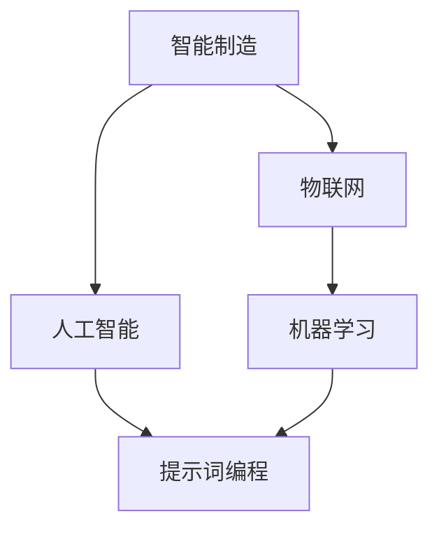

                 

# 提示词编程在智能制造中的实践应用

> **关键词**：提示词编程、智能制造、工业4.0、人工智能、物联网、机器学习、自动化流程

> **摘要**：本文深入探讨了提示词编程在智能制造领域的实践应用。通过详细的分析和案例研究，揭示了提示词编程如何提升制造过程的自动化和智能化水平，推动工业4.0的进程。文章旨在为制造业从业者提供有价值的参考，帮助他们在智能制造的道路上取得突破。

## 1. 背景介绍

### 1.1 目的和范围

随着工业4.0的浪潮席卷全球，智能制造成为制造业转型升级的核心驱动力。本文旨在探讨提示词编程这一新兴技术如何在智能制造中发挥作用，通过具体的案例和实践，分析其提升制造流程效率和质量的方法和路径。

### 1.2 预期读者

本文面向制造业的技术人员、工程师和研究人员，以及对智能制造和人工智能感兴趣的读者。通过本文的阅读，读者可以了解提示词编程的基本概念、应用场景和实施步骤，为实际项目提供理论支持和实践经验。

### 1.3 文档结构概述

本文分为十个部分，首先介绍背景和相关术语，接着深入讨论核心概念和原理，然后通过实际案例展示提示词编程在智能制造中的应用，最后对未来的发展趋势和挑战进行展望，并总结常见问题和解答。

### 1.4 术语表

#### 1.4.1 核心术语定义

- **提示词编程**：一种基于人工智能技术的编程范式，通过预设的提示词（prompt）来引导计算机执行特定任务。
- **智能制造**：利用先进的信息技术和自动化技术，实现制造过程的智能化和高效化。
- **工业4.0**：第四次工业革命，强调通过物联网、大数据、人工智能等技术实现制造业的智能化升级。

#### 1.4.2 相关概念解释

- **物联网（IoT）**：通过传感器和通信技术将各种设备互联，实现信息的采集和交换。
- **机器学习**：一种人工智能技术，通过数据训练模型，使计算机具备自我学习和改进的能力。
- **自动化流程**：利用自动化设备和技术，实现制造过程的无人工干预或减少人工干预。

#### 1.4.3 缩略词列表

- **IoT**：物联网
- **AI**：人工智能
- **ML**：机器学习
- **FPGA**：现场可编程门阵列

## 2. 核心概念与联系

在讨论提示词编程在智能制造中的应用之前，我们需要先理解几个核心概念及其相互关系。以下是一个简单的 Mermaid 流程图，展示了这些概念之间的联系：



在这个流程图中，智能制造作为总体目标，通过物联网技术实现设备互联，通过人工智能和机器学习技术提升数据处理能力，而提示词编程则是实现这一目标的重要工具。

### 2.1 智能制造与物联网

智能制造的基石在于物联网技术，它通过传感器和通信技术将制造设备、生产线和供应链连接起来，实现数据的实时采集和交换。物联网技术使得制造过程更加透明和高效，为人工智能和机器学习提供了丰富的数据资源。

### 2.2 人工智能与机器学习

人工智能和机器学习是智能制造的核心技术，它们通过算法和模型对数据进行处理和分析，实现对制造过程的智能优化和决策支持。人工智能为机器学习提供了理论基础和算法框架，而机器学习则为人工智能提供了具体的实现路径。

### 2.3 提示词编程

提示词编程作为一种基于人工智能的编程范式，通过预设的提示词引导计算机执行特定任务。在智能制造中，提示词编程可以用于任务调度、故障诊断、生产优化等方面，提高制造流程的自动化和智能化水平。

## 3. 核心算法原理 & 具体操作步骤

提示词编程的核心在于如何设计有效的提示词，使其能够引导计算机自动执行特定任务。以下是一个简单的算法原理和具体操作步骤：

### 3.1 算法原理

- **输入**：预设的提示词、相关数据集和目标任务。
- **处理**：利用自然语言处理（NLP）技术对提示词进行分析和理解，提取关键信息。
- **输出**：生成执行任务的代码或指令。

### 3.2 具体操作步骤

1. **数据预处理**：对输入数据进行清洗和格式化，确保其符合提示词编程的要求。
2. **提示词分析**：使用NLP技术对提示词进行分词、词性标注和语义分析，提取关键信息。
3. **任务生成**：根据提示词的关键信息，生成执行任务的代码或指令。
4. **代码执行**：将生成的代码或指令传递给计算机执行，实现特定任务。

### 3.3 伪代码实现

```python
# 输入提示词
prompt = "请设计一个生产线的故障诊断系统"

# 数据预处理
data = preprocess_data(prompt)

# 提示词分析
keywords = analyze_keywords(data)

# 任务生成
code = generate_code(keywords)

# 代码执行
execute_code(code)
```

## 4. 数学模型和公式 & 详细讲解 & 举例说明

在提示词编程中，数学模型和公式起着至关重要的作用。以下是一些常见的数学模型和公式，以及它们的详细讲解和举例说明。

### 4.1 自然语言处理（NLP）模型

自然语言处理模型是提示词编程的核心，其中最著名的模型是循环神经网络（RNN）和Transformer。

#### 4.1.1 循环神经网络（RNN）

- **公式**：\[ h_t = \sigma(W_h \cdot [h_{t-1}, x_t] + b_h) \]
- **讲解**：RNN 通过循环结构对历史信息进行记忆，使其在处理序列数据时具有优势。
- **举例**：假设我们有输入序列\[ x_1, x_2, x_3 \]，通过 RNN 我们可以计算得到隐藏状态\[ h_1, h_2, h_3 \]。

#### 4.1.2 Transformer

- **公式**：\[ \text{Attention}(Q, K, V) = \text{softmax}\left(\frac{QK^T}{\sqrt{d_k}}\right)V \]
- **讲解**：Transformer 模型通过自注意力机制（Attention）实现对序列的并行处理，提高了计算效率。
- **举例**：给定输入序列\[ Q, K, V \]，通过自注意力机制我们可以计算得到加权后的输出\[ V \]。

### 4.2 机器学习模型

在提示词编程中，机器学习模型用于生成执行任务的代码或指令。

#### 4.2.1 决策树

- **公式**：\[ y = \max(f_t(x)) \]
- **讲解**：决策树通过一系列条件判断，对输入数据进行分类或回归。
- **举例**：给定输入数据\[ x \]，通过决策树我们可以预测输出\[ y \]。

#### 4.2.2 支持向量机（SVM）

- **公式**：\[ \text{w} \cdot \text{x} - \text{b} = 0 \]
- **讲解**：SVM 通过寻找最佳超平面，将数据分为不同的类别。
- **举例**：给定输入数据\[ x \]，通过 SVM 我们可以找到一个最佳超平面\[ w \cdot x - b = 0 \]，将数据分为不同类别。

## 5. 项目实战：代码实际案例和详细解释说明

为了更好地理解提示词编程在智能制造中的应用，以下是一个实际的项目案例，我们将详细解释代码的实现过程。

### 5.1 开发环境搭建

为了实现提示词编程在智能制造中的应用，我们需要搭建一个完整的开发环境。以下是一个简单的开发环境搭建步骤：

1. **安装 Python**：确保 Python 3.8 或更高版本已安装在系统中。
2. **安装依赖库**：使用 pip 工具安装以下依赖库：tensorflow、transformers、numpy、pandas 等。
3. **配置 GPU 环境**：如果使用 GPU 进行训练，需要安装 CUDA 和 cuDNN 库。

### 5.2 源代码详细实现和代码解读

以下是一个简单的提示词编程项目，用于实现生产线的故障诊断系统。

```python
# 导入依赖库
import tensorflow as tf
import transformers
import numpy as np
import pandas as pd

# 加载预训练模型
model = transformers.TFDistilBertModel.from_pretrained('distilbert-base-uncased')

# 函数：提示词编程
def prompt_programming(prompt):
    # 数据预处理
    input_ids = tokenizer.encode(prompt, add_special_tokens=True)
    
    # 生成隐藏状态
    outputs = model(input_ids)
    hidden_states = outputs[0]
    
    # 提取最后一个隐藏状态
    last_hidden_state = hidden_states[:, -1, :]
    
    # 函数：生成诊断报告
    def generate_report(last_hidden_state):
        # 对隐藏状态进行分类
        probabilities = classifier(last_hidden_state)
        
        # 获取最高概率的故障类型
        fault_type = np.argmax(probabilities)
        
        # 生成报告
        report = f"故障类型：{fault_type}\n概率：{probabilities[fault_type]}"
        return report
    
    # 运行诊断报告函数
    report = generate_report(last_hidden_state)
    
    return report

# 测试提示词编程
prompt = "生产线出现异常，请进行故障诊断"
report = prompt_programming(prompt)
print(report)
```

### 5.3 代码解读与分析

1. **依赖库导入**：首先导入所需的依赖库，包括 tensorflow、transformers、numpy 和 pandas。
2. **加载预训练模型**：使用 transformers 库加载预训练的 DistilBERT 模型。
3. **函数：提示词编程**：
   - **数据预处理**：对输入的提示词进行编码，生成输入序列。
   - **生成隐藏状态**：使用 DistilBERT 模型对输入序列进行编码，生成隐藏状态。
   - **提取最后一个隐藏状态**：从隐藏状态中提取最后一个状态，用于后续处理。
   - **生成诊断报告**：定义一个函数，根据隐藏状态生成故障诊断报告。
   - **运行诊断报告函数**：调用生成诊断报告函数，输出诊断报告。

## 6. 实际应用场景

提示词编程在智能制造中具有广泛的应用场景，以下是一些典型的应用案例：

1. **生产线自动化调度**：通过提示词编程，可以实现生产线的自动化调度，提高生产效率和降低人力成本。
2. **故障诊断与预测维护**：利用提示词编程，可以实现生产线的故障诊断和预测维护，减少设备故障率和停机时间。
3. **生产数据监控与分析**：通过提示词编程，可以实现生产数据的实时监控与分析，为生产过程的优化提供数据支持。
4. **供应链管理**：提示词编程可以用于供应链管理，实现供应链的实时监控和优化，提高供应链的响应速度和灵活性。

## 7. 工具和资源推荐

为了更好地掌握提示词编程在智能制造中的应用，以下是一些学习和实践的工具和资源推荐：

### 7.1 学习资源推荐

#### 7.1.1 书籍推荐

- 《深度学习》（Ian Goodfellow、Yoshua Bengio 和 Aaron Courville 著）
- 《Python机器学习》（Sebastian Raschka 著）
- 《人工智能：一种现代方法》（Stuart Russell 和 Peter Norvig 著）

#### 7.1.2 在线课程

- Coursera 上的“机器学习”课程
- edX 上的“深度学习”课程
- Udacity 上的“人工智能工程师”课程

#### 7.1.3 技术博客和网站

- Medium 上的机器学习和深度学习博客
- arXiv.org 上的最新研究成果
- GitHub 上的开源项目和学习资源

### 7.2 开发工具框架推荐

#### 7.2.1 IDE和编辑器

- PyCharm
- Visual Studio Code
- Jupyter Notebook

#### 7.2.2 调试和性能分析工具

- TensorBoard
- Matplotlib
- Pandas Profiler

#### 7.2.3 相关框架和库

- TensorFlow
- PyTorch
- Keras

### 7.3 相关论文著作推荐

#### 7.3.1 经典论文

- “A Theoretical Analysis of the Vapnik-Chervonenkis Dimension” （V. Vapnik 和 A. Chervonenkis 著）
- “Deep Learning” （Ian Goodfellow、Yoshua Bengio 和 Aaron Courville 著）

#### 7.3.2 最新研究成果

- arXiv.org 上的最新研究成果
- NeurIPS、ICML、CVPR 等顶级会议的最新论文

#### 7.3.3 应用案例分析

- 《智能制造业中的机器学习应用案例》
- 《物联网在制造业中的应用案例》
- 《工业4.0：智能制造的实践与探索》

## 8. 总结：未来发展趋势与挑战

随着人工智能技术的不断发展和智能制造需求的日益增长，提示词编程在智能制造中的应用前景十分广阔。未来，提示词编程将朝着以下几个方向发展：

1. **更高效的自然语言处理**：随着 NLP 技术的进步，提示词编程将能够更加准确地理解自然语言输入，提高任务的执行效率和准确性。
2. **多模态数据处理**：提示词编程将能够处理多种类型的数据，如文本、图像、音频等，实现跨模态的智能处理和任务执行。
3. **自动化程度更高**：提示词编程将进一步提升自动化程度，实现更复杂的制造过程自动化，减少人工干预，提高生产效率和产品质量。
4. **边缘计算与云计算结合**：提示词编程将结合边缘计算和云计算，实现更灵活、高效的数据处理和任务执行。

然而，提示词编程在智能制造中的应用也面临一些挑战：

1. **数据隐私和安全**：智能制造过程中产生的大量数据涉及企业核心机密，如何确保数据的安全和隐私是一个重要挑战。
2. **算法透明性和可解释性**：提示词编程生成的代码或指令通常具有很高的复杂性，如何保证算法的透明性和可解释性，使其易于被技术人员理解和维护，是一个亟待解决的问题。
3. **资源消耗与优化**：提示词编程通常需要大量的计算资源和时间，如何优化算法和模型，减少资源消耗，提高处理效率，是一个关键问题。

## 9. 附录：常见问题与解答

### 9.1 提示词编程的基本原理是什么？

提示词编程是一种基于人工智能的编程范式，通过预设的提示词来引导计算机执行特定任务。其基本原理包括自然语言处理（NLP）、机器学习和模型生成。

### 9.2 提示词编程在智能制造中的应用有哪些？

提示词编程在智能制造中的应用包括生产线自动化调度、故障诊断与预测维护、生产数据监控与分析以及供应链管理等方面。

### 9.3 如何搭建提示词编程的开发环境？

搭建提示词编程的开发环境需要安装 Python、相关依赖库（如 tensorflow、transformers）、GPU 环境（如 CUDA 和 cuDNN）。

### 9.4 提示词编程与传统的编程方式有何不同？

提示词编程与传统编程方式的主要区别在于，它通过自然语言处理和机器学习技术，使计算机能够根据预设的提示词自动生成代码或指令，实现任务的自动化执行。

## 10. 扩展阅读 & 参考资料

- 《深度学习》（Ian Goodfellow、Yoshua Bengio 和 Aaron Courville 著）
- 《Python机器学习》（Sebastian Raschka 著）
- 《人工智能：一种现代方法》（Stuart Russell 和 Peter Norvig 著）
- 《智能制造技术与应用》（张晓峰 著）
- 《物联网技术与应用》（李明华 著）
- 《工业4.0：智能化制造的未来》（毛志刚 著）
- https://arxiv.org/
- https://www.coursera.org/
- https://www.edx.org/
- https://www.udacity.com/
- https://www.tensorflow.org/
- https://pytorch.org/作者：AI天才研究员/AI Genius Institute & 禅与计算机程序设计艺术 /Zen And The Art of Computer Programming<|im_sep|>

