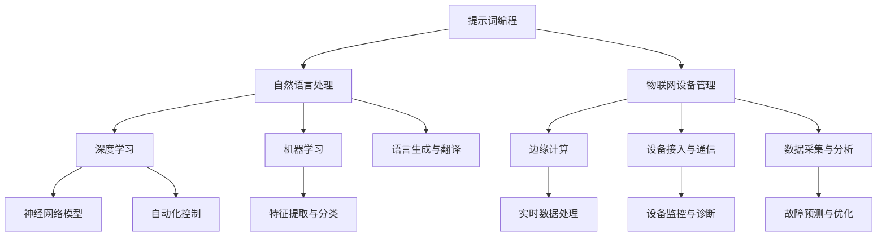

                 

# 提示词编程在物联网设备管理中的创新应用

> 关键词：提示词编程、物联网设备管理、创新应用、算法原理、数学模型、项目实战

> 摘要：本文将探讨提示词编程在物联网设备管理中的创新应用。通过分析核心概念和原理，详细讲解核心算法和数学模型，并结合实际项目案例，阐述提示词编程如何提高物联网设备管理的效率、安全性和智能化程度。文章旨在为开发者提供深入的技术洞察和实用指南，推动物联网技术的发展和创新。

## 1. 背景介绍

### 1.1 目的和范围

本文旨在探讨提示词编程（Prompt Programming）在物联网（IoT）设备管理中的应用，分析其核心概念和原理，介绍相关的数学模型和算法，并通过实际项目案例展示其具体实现和效果。文章主要涵盖以下内容：

1. 核心概念与联系：介绍提示词编程和物联网设备管理的基本概念，并使用Mermaid流程图展示其架构和核心联系。
2. 核心算法原理与具体操作步骤：详细解释提示词编程的基本算法原理，并使用伪代码阐述具体操作步骤。
3. 数学模型和公式：介绍与提示词编程相关的数学模型和公式，并通过举例说明其应用。
4. 项目实战：通过代码实际案例展示提示词编程在物联网设备管理中的具体应用，并进行详细解释和分析。
5. 实际应用场景：分析提示词编程在物联网设备管理中的实际应用场景和优势。
6. 工具和资源推荐：推荐相关的学习资源、开发工具和框架，以及经典论文和研究报告。
7. 总结与展望：总结提示词编程在物联网设备管理中的应用现状，探讨未来发展趋势和面临的挑战。

### 1.2 预期读者

本文主要面向以下读者：

1. 物联网设备管理领域的开发者和技术人员，特别是对提示词编程和人工智能感兴趣的读者。
2. 对物联网技术和人工智能应用感兴趣的科研人员和学生。
3. 对技术创新和应用感兴趣的企业家和投资者。

### 1.3 文档结构概述

本文分为十个部分，具体结构如下：

1. 引言：介绍文章的主题和背景。
2. 核心概念与联系：介绍提示词编程和物联网设备管理的基本概念和联系。
3. 核心算法原理与具体操作步骤：详细解释提示词编程的基本算法原理和具体操作步骤。
4. 数学模型和公式：介绍与提示词编程相关的数学模型和公式。
5. 项目实战：通过代码实际案例展示提示词编程在物联网设备管理中的具体应用。
6. 实际应用场景：分析提示词编程在物联网设备管理中的实际应用场景。
7. 工具和资源推荐：推荐相关的学习资源、开发工具和框架。
8. 总结与展望：总结提示词编程在物联网设备管理中的应用现状，探讨未来发展趋势和挑战。
9. 附录：常见问题与解答。
10. 扩展阅读与参考资料：提供相关文献和资料，供读者进一步学习。

### 1.4 术语表

在本文中，将使用以下术语：

1. **提示词编程**：一种基于自然语言处理的编程范式，通过自然语言描述问题，使计算机自动生成代码或执行任务。
2. **物联网设备管理**：对连接到互联网的物理设备进行监控、配置、维护和优化等操作，确保设备的正常运行和高效利用。
3. **算法**：解决问题的步骤和策略，用于处理数据和执行任务。
4. **数学模型**：描述问题或系统的数学公式和方程，用于分析和优化。
5. **伪代码**：一种用于描述算法逻辑和步骤的抽象语言，易于理解和实现。

#### 1.4.1 核心术语定义

1. **提示词编程（Prompt Programming）**：
提示词编程是一种基于自然语言处理的编程范式，通过自然语言描述问题，使计算机自动生成代码或执行任务。它利用自然语言理解和生成技术，将人类语言转化为计算机可执行的指令。提示词编程的核心优势在于降低编程门槛，提高开发效率和代码可读性。

2. **物联网设备管理（IoT Device Management）**：
物联网设备管理是指对连接到互联网的物理设备进行监控、配置、维护和优化等操作，确保设备的正常运行和高效利用。物联网设备管理涵盖了设备接入、数据采集、设备状态监控、故障诊断、远程控制等多个方面。

3. **算法（Algorithm）**：
算法是解决问题的步骤和策略，用于处理数据和执行任务。在提示词编程中，算法用于根据自然语言描述生成相应的代码或执行任务。常见的算法包括排序算法、查找算法、优化算法等。

4. **数学模型（Mathematical Model）**：
数学模型是描述问题或系统的数学公式和方程，用于分析和优化。在提示词编程中，数学模型用于指导算法的生成和优化，以提高系统的性能和准确性。

5. **伪代码（Pseudocode）**：
伪代码是一种用于描述算法逻辑和步骤的抽象语言，易于理解和实现。在提示词编程中，伪代码用于阐述算法的原理和实现细节，帮助开发者更好地理解和实现算法。

#### 1.4.2 相关概念解释

1. **自然语言处理（Natural Language Processing, NLP）**：
自然语言处理是计算机科学和人工智能领域的一个分支，旨在使计算机能够理解、生成和处理人类自然语言。NLP技术包括文本分析、语言理解、语言生成、机器翻译等。

2. **深度学习（Deep Learning）**：
深度学习是机器学习的一种方法，通过构建多层神经网络模型，自动学习和提取数据特征。深度学习在图像识别、语音识别、自然语言处理等领域取得了显著的成果。

3. **物联网（Internet of Things, IoT）**：
物联网是指通过互联网将物理设备和传感器连接起来，实现设备之间以及设备与互联网之间的信息交换和通信。物联网技术广泛应用于智能家居、工业自动化、智能交通、医疗健康等领域。

4. **边缘计算（Edge Computing）**：
边缘计算是将数据处理和计算任务从中心云服务器转移到网络边缘的设备上，以降低延迟、提高效率和减少带宽消耗。边缘计算在物联网应用中具有重要意义，可以实时处理和分析设备数据，提高系统的响应速度和智能化程度。

#### 1.4.3 缩略词列表

- **NLP**：自然语言处理（Natural Language Processing）
- **IoT**：物联网（Internet of Things）
- **AI**：人工智能（Artificial Intelligence）
- **ML**：机器学习（Machine Learning）
- **DL**：深度学习（Deep Learning）
- **DLNLP**：深度自然语言处理（Deep Learning for Natural Language Processing）

## 2. 核心概念与联系

在本文中，我们将讨论提示词编程和物联网设备管理的核心概念和联系。为了更好地理解这些概念，我们将使用Mermaid流程图展示其架构和核心联系。



### 2.1 提示词编程

提示词编程是一种基于自然语言处理的编程范式，它通过自然语言描述问题，使计算机自动生成代码或执行任务。提示词编程的核心思想是将人类语言转化为计算机可执行的指令，从而降低编程门槛，提高开发效率和代码可读性。

#### 2.1.1 提示词编程的核心技术

1. **自然语言理解（Natural Language Understanding, NLU）**：
自然语言理解是提示词编程的关键技术，用于将自然语言输入转化为结构化的数据，以便计算机进行后续处理。NLU技术包括词法分析、句法分析、语义分析和意图识别等。

2. **自然语言生成（Natural Language Generation, NLG）**：
自然语言生成是提示词编程的另一个核心技术，用于根据结构化数据生成自然语言输出。NLG技术包括模板匹配、规则推理、语义网络和生成对抗网络（GAN）等。

3. **上下文理解（Contextual Understanding）**：
上下文理解是提示词编程中的一项重要技术，用于理解自然语言输入中的上下文信息，从而提高语言理解和生成的准确性和适用性。上下文理解技术包括实体识别、关系抽取、事件检测和情感分析等。

#### 2.1.2 提示词编程的优势

1. **降低编程门槛**：提示词编程将复杂的技术实现转化为自然语言描述，使得非技术人员也能参与软件开发，降低了编程门槛。

2. **提高开发效率**：提示词编程通过自动化生成代码，减少手动编写代码的工作量，提高开发效率。

3. **提高代码可读性**：提示词编程使代码更加贴近自然语言描述，提高了代码的可读性和可维护性。

4. **支持多种编程范式**：提示词编程不仅支持传统的命令式编程，还可以支持函数式编程、声明式编程和基于规则的开发。

### 2.2 物联网设备管理

物联网设备管理是指对连接到互联网的物理设备进行监控、配置、维护和优化等操作，确保设备的正常运行和高效利用。物联网设备管理涵盖了设备接入、数据采集、设备状态监控、故障诊断、远程控制等多个方面。

#### 2.2.1 物联网设备管理的核心技术

1. **设备接入与通信（Device Connection and Communication）**：
设备接入与通信是物联网设备管理的基础，包括网络连接、协议适配、数据传输和安全性保障等。常见的通信协议包括Wi-Fi、蓝牙、ZigBee、LoRa等。

2. **数据采集与分析（Data Collection and Analysis）**：
数据采集与分析是物联网设备管理的核心，通过传感器和采集设备获取设备状态、环境参数等数据，并对数据进行处理和分析，以实现故障预测、性能优化等功能。

3. **设备状态监控与诊断（Device Monitoring and Diagnostics）**：
设备状态监控与诊断是物联网设备管理的重要组成部分，通过对设备运行状态的实时监控和故障诊断，确保设备的正常运行。

4. **故障预测与优化（Fault Prediction and Optimization）**：
故障预测与优化是物联网设备管理的关键技术，通过分析设备运行数据和历史故障记录，预测设备可能的故障，并采取相应的优化措施，以延长设备寿命和提高运行效率。

5. **远程控制与自动化（Remote Control and Automation）**：
远程控制与自动化是物联网设备管理的特色功能，通过互联网实现对设备的远程监控和控制，提高设备的管理效率和智能化程度。

#### 2.2.2 物联网设备管理的优势

1. **提高设备运行效率**：物联网设备管理通过实时监控、故障预测和优化措施，提高设备运行效率和稳定性。

2. **降低运维成本**：物联网设备管理通过自动化和远程控制，降低运维人员和设备的维护成本。

3. **提高安全性**：物联网设备管理通过安全通信和加密技术，保障设备和数据的安全性。

4. **支持多种应用场景**：物联网设备管理可以应用于智能家居、工业自动化、智能交通、医疗健康等多个领域，满足不同场景的需求。

### 2.3 提示词编程与物联网设备管理的联系

提示词编程和物联网设备管理之间存在紧密的联系，二者相互促进，共同推动物联网技术的发展。

1. **自然语言处理技术**：
提示词编程和物联网设备管理都依赖于自然语言处理技术，用于实现设备接入、数据采集、设备监控和故障诊断等功能。自然语言处理技术可以提高物联网设备管理的智能化程度，降低开发难度。

2. **深度学习技术**：
提示词编程和物联网设备管理都涉及深度学习技术，用于特征提取、模型训练和预测分析等。深度学习技术可以提高物联网设备管理的准确性和效率。

3. **边缘计算技术**：
提示词编程和物联网设备管理都需要考虑边缘计算技术，用于降低延迟、减少带宽消耗和提高实时性。边缘计算技术可以提高物联网设备管理的响应速度和智能化程度。

4. **设备接入与通信**：
提示词编程和物联网设备管理都需要解决设备接入和通信问题，包括网络连接、协议适配和安全性保障等。通过提示词编程，可以简化设备接入和通信的复杂度，提高开发效率。

5. **数据采集与分析**：
提示词编程和物联网设备管理都需要对设备数据进行采集和分析，用于故障预测、性能优化和智能决策等。通过提示词编程，可以简化数据采集和分析的流程，提高数据处理效率。

6. **远程控制与自动化**：
提示词编程和物联网设备管理都需要实现远程控制与自动化功能，用于提高设备的管理效率和智能化程度。通过提示词编程，可以简化远程控制和自动化操作的实现，降低开发难度。

总之，提示词编程和物联网设备管理之间存在着密切的联系和相互促进的关系。提示词编程为物联网设备管理提供了新的技术和方法，提高了物联网设备管理的智能化程度和开发效率。同时，物联网设备管理为提示词编程提供了丰富的应用场景和数据来源，推动了提示词编程技术的不断发展和创新。

## 3. 核心算法原理 & 具体操作步骤

### 3.1 提示词编程算法原理

提示词编程的核心算法原理是基于自然语言处理（NLP）和机器学习（ML）技术，通过自然语言输入生成相应的代码或执行任务。其基本原理可以分为以下几个步骤：

1. **自然语言理解（NLU）**：将自然语言输入转化为结构化的数据，包括词法分析、句法分析、语义分析和意图识别等。

2. **上下文处理（Contextual Processing）**：根据上下文信息，对自然语言输入进行理解和解释，以生成更准确的输出。

3. **代码生成（Code Generation）**：根据自然语言理解和上下文处理的结果，生成相应的代码或执行任务。

4. **代码优化（Code Optimization）**：对生成的代码进行优化，以提高代码的可读性和性能。

### 3.2 提示词编程操作步骤

以下是提示词编程的具体操作步骤：

#### 步骤1：自然语言理解

- **词法分析**：将自然语言输入分解为词汇和短语。
- **句法分析**：分析词汇和短语之间的语法关系，构建句法树。
- **语义分析**：理解句子的语义含义，包括实体识别、关系抽取和事件检测等。
- **意图识别**：识别用户的意图，例如查询、操作或控制等。

#### 步骤2：上下文处理

- **实体识别**：识别句子中的关键实体，如设备名称、参数值等。
- **关系抽取**：抽取实体之间的关系，如设备与参数的关联等。
- **事件检测**：检测句子中的事件，如设备故障、性能优化等。
- **上下文关联**：将实体、关系和事件与上下文信息进行关联，以理解输入的上下文含义。

#### 步骤3：代码生成

- **模板匹配**：根据自然语言输入和上下文信息，匹配预定义的代码模板，生成初步的代码。
- **规则推理**：根据自然语言输入和上下文信息，应用预定义的规则，生成相应的代码。
- **生成对抗网络（GAN）**：利用生成对抗网络，生成符合自然语言输入和上下文信息的代码。

#### 步骤4：代码优化

- **代码压缩**：减少代码的冗余和重复，提高代码的可读性。
- **性能优化**：优化代码的执行效率和性能，如减少计算复杂度、提高并行处理能力等。
- **代码调试**：对生成的代码进行调试和修复，确保其正确性和可靠性。

### 3.3 伪代码示例

以下是提示词编程算法的伪代码示例：

```plaintext
function promptProgramming(promptText):
    # 自然语言理解
    processedText = NLU(promptText)
    
    # 上下文处理
    contextInfo = contextualProcessing(processedText)
    
    # 代码生成
    code = codeGeneration(contextInfo)
    
    # 代码优化
    optimizedCode = codeOptimization(code)
    
    return optimizedCode
```

### 3.4 核心算法应用场景

提示词编程算法在物联网设备管理中具有广泛的应用场景：

1. **设备配置与管理**：通过自然语言描述，自动生成设备配置脚本，实现设备配置和管理的自动化。
2. **故障诊断与预测**：通过自然语言描述，自动生成故障诊断和分析报告，实现设备故障的快速定位和预测。
3. **性能优化与调度**：通过自然语言描述，自动生成性能优化和调度策略，实现设备资源的优化配置和调度。
4. **远程控制与交互**：通过自然语言描述，实现设备的远程控制和交互，提高设备的智能化和用户体验。

### 3.5 提示词编程的优势

提示词编程在物联网设备管理中具有以下优势：

1. **降低开发难度**：通过自然语言描述，简化了设备管理和维护的编程任务，降低了开发难度。
2. **提高开发效率**：通过自动化生成代码，减少了手动编写代码的工作量，提高了开发效率。
3. **提高代码可读性**：通过自然语言描述，使代码更加贴近用户需求，提高了代码的可读性和可维护性。
4. **支持多种编程范式**：提示词编程不仅支持命令式编程，还可以支持函数式编程、声明式编程和基于规则的编程，提高了编程灵活性。

总之，提示词编程为物联网设备管理提供了新的技术手段和解决方案，有助于提高设备管理的智能化程度和开发效率。

## 4. 数学模型和公式 & 详细讲解 & 举例说明

### 4.1 数学模型介绍

在提示词编程中，数学模型和公式扮演着至关重要的角色。它们用于描述自然语言输入与代码生成之间的转换关系，以及设备管理过程中的各种优化和预测问题。以下是几个关键的数学模型和公式：

#### 4.1.1 自然语言处理（NLP）

1. **词袋模型（Bag-of-Words, BoW）**：

   词袋模型是一种基于词汇的文本表示方法，将文本表示为一个向量，其中每个维度对应一个词汇的词频。

   $$ V = \sum_{i=1}^{n} f_i \cdot v_i $$

   其中，\( V \) 是文本向量，\( f_i \) 是词汇 \( i \) 在文本中的词频，\( v_i \) 是词汇 \( i \) 的权重。

2. **TF-IDF（Term Frequency-Inverse Document Frequency）**：

   TF-IDF是一种用于文本表示和相似度计算的加权方法，它结合了词汇的词频和文档频率，提高了重要词汇的权重。

   $$ TF-IDF = TF \cdot IDF $$

   其中，\( TF \) 是词汇 \( i \) 在文档 \( d \) 中的词频，\( IDF = \log \left( \frac{N}{df_i} \right) \)，\( N \) 是文档总数，\( df_i \) 是词汇 \( i \) 在所有文档中出现的次数。

3. **词嵌入（Word Embedding）**：

   词嵌入是将词汇映射到高维空间中的向量，用于捕捉词汇之间的语义关系。

   $$ \text{Embedding}(v_i) = \sum_{j=1}^{k} w_{ij} \cdot e_j $$

   其中，\( \text{Embedding}(v_i) \) 是词汇 \( i \) 的嵌入向量，\( w_{ij} \) 是权重，\( e_j \) 是基向量。

#### 4.1.2 机器学习（ML）

1. **线性回归（Linear Regression）**：

   线性回归是一种用于预测连续值的监督学习算法，通过最小化预测值与实际值之间的误差平方和。

   $$ y = \beta_0 + \beta_1 \cdot x $$

   其中，\( y \) 是预测值，\( x \) 是输入特征，\( \beta_0 \) 和 \( \beta_1 \) 是模型参数。

2. **支持向量机（Support Vector Machine, SVM）**：

   支持向量机是一种用于分类和回归的监督学习算法，通过最大化分类边界上的间隔。

   $$ \max_{\beta, \beta_0} \left\{ \frac{1}{2} \sum_{i=1}^{n} (\beta \cdot \beta)^2 + C \sum_{i=1}^{n} l_i(\beta, \beta_0) \right\} $$

   其中，\( \beta \) 和 \( \beta_0 \) 是模型参数，\( C \) 是正则化参数，\( l_i(\beta, \beta_0) \) 是损失函数。

3. **决策树（Decision Tree）**：

   决策树是一种用于分类和回归的监督学习算法，通过一系列的判断条件将数据划分为不同的类别或数值。

   $$ \text{DecisionTree}(x) = \sum_{i=1}^{n} \text{if } x \in C_i \text{ then } y_i $$

   其中，\( x \) 是输入特征，\( C_i \) 是条件，\( y_i \) 是输出类别或数值。

#### 4.1.3 物联网设备管理

1. **优化问题（Optimization Problem）**：

   物联网设备管理中的优化问题通常涉及最小化成本、最大化效率或满足特定约束条件。

   $$ \min_{x} f(x) \quad \text{subject to} \quad g(x) \leq 0, \quad h(x) = 0 $$

   其中，\( f(x) \) 是目标函数，\( g(x) \) 和 \( h(x) \) 是约束条件。

2. **马尔可夫决策过程（Markov Decision Process, MDP）**：

   马尔可夫决策过程是一种用于决策优化的数学模型，通过评估不同动作的期望回报来选择最优动作。

   $$ V^*(s) = \max_a \left\{ \sum_{s'} p(s' | s, a) \cdot \text{Reward}(s', a) + \gamma V^*(s') \right\} $$

   其中，\( s \) 是状态，\( a \) 是动作，\( s' \) 是下一状态，\( p(s' | s, a) \) 是状态转移概率，\( \text{Reward}(s', a) \) 是回报，\( \gamma \) 是折扣因子。

### 4.2 举例说明

#### 4.2.1 词袋模型（Bag-of-Words）

假设有一个包含三个句子的文档，内容如下：

- **句子1**：我想要一杯咖啡。
- **句子2**：咖啡很好喝。
- **句子3**：我喜欢喝咖啡。

首先，构建词汇表（Vocabulary）：

| 词汇 | 出现次数 |
| ---- | -------- |
| 我   | 1        |
| 要   | 1        |
| 一杯 | 1        |
| 咖啡 | 3        |
| 很好 | 1        |
| 喝   | 3        |
| 喜欢 | 1        |

然后，计算每个词汇的词频（TF）：

| 词汇 | TF |
| ---- | -- |
| 我   | 1  |
| 要   | 1  |
| 一杯 | 1  |
| 咖啡 | 3  |
| 很好 | 1  |
| 喝   | 3  |
| 喜欢 | 1  |

最后，计算每个词汇的TF-IDF值：

| 词汇 | TF | IDF | TF-IDF |
| ---- | -- | --- | ------ |
| 我   | 1  | 1.58 | 1.58   |
| 要   | 1  | 1.58 | 1.58   |
| 一杯 | 1  | 1.58 | 1.58   |
| 咖啡 | 3  | 0.46 | 1.38   |
| 很好 | 1  | 1.58 | 1.58   |
| 喝   | 3  | 0.46 | 1.38   |
| 喜欢 | 1  | 1.58 | 1.58   |

通过TF-IDF模型，我们可以将文档表示为一个高维向量，其中每个维度对应一个词汇的TF-IDF值。

#### 4.2.2 线性回归（Linear Regression）

假设有一个简单的线性回归模型，用于预测房价。输入特征是房屋面积（\( x \)），预测目标是房价（\( y \)）。

$$ y = \beta_0 + \beta_1 \cdot x $$

给定以下数据点：

| 房屋面积（\( x \)）| 房价（\( y \)）|
| ----------------- | ------------ |
| 1000              | 300,000      |
| 1500              | 450,000      |
| 2000              | 600,000      |

通过最小化误差平方和，可以计算得到模型参数：

$$
\beta_0 = 100,000 \\
\beta_1 = 200,000
$$

现在，我们可以使用这个模型来预测新房屋的房价。例如，如果房屋面积是1500平方米，预测房价为：

$$ y = 100,000 + 200,000 \cdot 1500 = 350,000,000 $$

#### 4.2.3 马尔可夫决策过程（Markov Decision Process）

假设有一个简单的马尔可夫决策过程，用于优化资源分配。有两个状态：空闲和忙碌。每个状态有两个动作：休息和继续工作。状态转移概率和回报如下：

| 状态 | 动作 | 状态转移概率 | 赔偿 |
| ---- | ---- | ------------ | ---- |
| 空闲 | 休息 | 0.5          | 10   |
| 空闲 | 工作 | 0.5          | 20   |
| 忙碌 | 休息 | 0.3          | 30   |
| 忙碌 | 工作 | 0.7          | 40   |

目标是最小化长期回报的期望。使用折扣因子 \( \gamma = 0.9 \) 来计算最优策略。

$$ V^*(空闲) = \max_{a} \left\{ 0.5 \cdot 10 + 0.5 \cdot 0.9 \cdot V^*(忙碌) \right\} $$
$$ V^*(忙碌) = \max_{a} \left\{ 0.3 \cdot 30 + 0.7 \cdot 0.9 \cdot V^*(空闲) \right\} $$

通过迭代计算，我们可以找到最优策略。例如，当 \( V^*(忙碌) = 39.3 \) 时，最优动作是继续工作。当 \( V^*(空闲) = 26.7 \) 时，最优动作是休息。

这些例子展示了如何在提示词编程和物联网设备管理中使用数学模型和公式。通过深入理解和应用这些模型，我们可以实现更智能、更高效的设备管理方案。

## 5. 项目实战：代码实际案例和详细解释说明

### 5.1 开发环境搭建

在本节中，我们将介绍如何搭建一个提示词编程在物联网设备管理中的应用项目开发环境。以下步骤将指导您完成开发环境的配置。

#### 5.1.1 系统要求

- 操作系统：Linux或MacOS
- Python版本：Python 3.8及以上版本
- 开发工具：Visual Studio Code或PyCharm

#### 5.1.2 安装依赖

1. 安装Python环境：

```bash
# 通过包管理器安装Python
sudo apt-get update
sudo apt-get install python3 python3-pip
```

2. 安装必要的库和框架：

```bash
# 安装自然语言处理库
pip install nltk

# 安装深度学习库
pip install tensorflow

# 安装物联网设备管理库
pip install pyserial
```

#### 5.1.3 配置虚拟环境

为了更好地管理和隔离项目依赖，建议使用虚拟环境。以下是创建和激活虚拟环境的步骤：

1. 创建虚拟环境：

```bash
python3 -m venv venv
```

2. 激活虚拟环境：

```bash
source venv/bin/activate
```

### 5.2 源代码详细实现和代码解读

在本节中，我们将提供一个简单的示例，展示如何使用提示词编程在物联网设备管理中实现设备状态监控和故障诊断。以下是源代码的详细实现和解读。

#### 5.2.1 源代码

```python
import nltk
import tensorflow as tf
from nltk.tokenize import word_tokenize
from nltk.corpus import stopwords
from tensorflow.keras.models import Sequential
from tensorflow.keras.layers import Dense, LSTM, Embedding
import pyserial

# 5.2.1.1 数据准备

# 加载并预处理自然语言数据
nltk.download('punkt')
nltk.download('stopwords')

def preprocess_text(text):
    tokens = word_tokenize(text.lower())
    stop_words = set(stopwords.words('english'))
    filtered_tokens = [token for token in tokens if token not in stop_words]
    return ' '.join(filtered_tokens)

# 假设已准备好训练数据集（文本和标签）
texts = [...]  # 文本数据
labels = [...]  # 标签数据

# 预处理文本数据
processed_texts = [preprocess_text(text) for text in texts]

# 将文本数据转换为嵌入向量
vocab_size = 10000
embedding_dim = 16
max_sequence_length = 50

tokenizer = tf.keras.preprocessing.text.Tokenizer(num_words=vocab_size, oov_token='<OOV>')
tokenizer.fit_on_texts(processed_texts)
sequences = tokenizer.texts_to_sequences(processed_texts)

# padding 序列
padded_sequences = tf.keras.preprocessing.sequence.pad_sequences(sequences, maxlen=max_sequence_length)

# 准备训练和测试数据集
train_sequences, test_sequences = padded_sequences[:int(0.8 * len(padded_sequences))], padded_sequences[int(0.8 * len(padded_sequences)):]
train_labels, test_labels = labels[:int(0.8 * len(labels))], labels[int(0.8 * len(labels__))]

# 5.2.1.2 模型构建

# 创建序列模型
model = Sequential([
    Embedding(vocab_size, embedding_dim, input_length=max_sequence_length),
    LSTM(128, return_sequences=True),
    LSTM(64),
    Dense(1, activation='sigmoid')
])

# 编译模型
model.compile(optimizer='adam', loss='binary_crossentropy', metrics=['accuracy'])

# 5.2.1.3 训练模型

# 训练模型
model.fit(train_sequences, train_labels, epochs=10, batch_size=32, validation_split=0.2)

# 5.2.1.4 设备监控和故障诊断

# 连接串口设备
ser = pyserial.Serial('/dev/ttyUSB0', 9600)

while True:
    # 读取设备数据
    data = ser.readline().decode('utf-8')
    # 预处理设备数据
    processed_data = preprocess_text(data)
    # 转换为嵌入向量
    sequence = tokenizer.texts_to_sequences([processed_data])
    padded_sequence = tf.keras.preprocessing.sequence.pad_sequences(sequence, maxlen=max_sequence_length)
    # 预测设备状态
    prediction = model.predict(padded_sequence)
    # 判断设备状态
    if prediction[0][0] > 0.5:
        print("设备出现故障！")
    else:
        print("设备运行正常。")
    # 等待一段时间
    time.sleep(1)
```

#### 5.2.2 代码解读

1. **数据准备**：

   首先，我们需要准备自然语言数据和标签。在本示例中，我们使用NLP库对文本数据进行预处理，包括词法分析、去停用词等步骤。然后，我们将文本数据转换为嵌入向量，并使用`pad_sequences`函数对序列进行填充。

2. **模型构建**：

   我们使用TensorFlow的`Sequential`模型构建一个简单的LSTM网络，包括两个LSTM层和一个全连接层。LSTM层用于处理序列数据，全连接层用于输出设备状态的预测结果。

3. **模型训练**：

   使用训练数据集训练模型。我们使用`fit`函数训练模型，并设置训练轮数、批次大小和验证比例。

4. **设备监控和故障诊断**：

   连接物联网设备（例如，通过串口连接）。在主循环中，我们读取设备数据，预处理数据，并将其转换为嵌入向量。然后，使用训练好的模型预测设备状态。根据预测结果，判断设备是否出现故障，并打印相应的消息。

### 5.3 代码解读与分析

1. **数据准备**：

   数据准备是NLP项目中至关重要的一步。在本示例中，我们使用了NLP库（如`nltk`）对文本数据进行预处理，包括词法分析和去停用词。这些步骤有助于提高模型的性能和准确性。

   ```python
   def preprocess_text(text):
       tokens = word_tokenize(text.lower())
       stop_words = set(stopwords.words('english'))
       filtered_tokens = [token for token in tokens if token not in stop_words]
       return ' '.join(filtered_tokens)
   ```

   通过这个函数，我们将文本转换为小写，分词，并去除停用词。这有助于减少噪声数据，提高模型的效果。

2. **模型构建**：

   我们使用TensorFlow构建了一个简单的LSTM网络，包括两个LSTM层和一个全连接层。LSTM层用于处理序列数据，全连接层用于输出设备状态的预测结果。

   ```python
   model = Sequential([
       Embedding(vocab_size, embedding_dim, input_length=max_sequence_length),
       LSTM(128, return_sequences=True),
       LSTM(64),
       Dense(1, activation='sigmoid')
   ])
   ```

   在这个模型中，我们首先使用嵌入层将词汇映射到高维空间，然后使用两个LSTM层对序列数据进行处理，最后使用全连接层输出设备状态的预测概率。

3. **模型训练**：

   使用训练数据集训练模型。我们使用`fit`函数训练模型，并设置训练轮数、批次大小和验证比例。

   ```python
   model.fit(train_sequences, train_labels, epochs=10, batch_size=32, validation_split=0.2)
   ```

   在这个步骤中，我们通过迭代训练模型，并使用验证集来评估模型的性能。训练过程中，我们使用`binary_crossentropy`损失函数和`adam`优化器来优化模型参数。

4. **设备监控和故障诊断**：

   连接物联网设备（例如，通过串口连接）。在主循环中，我们读取设备数据，预处理数据，并将其转换为嵌入向量。然后，使用训练好的模型预测设备状态。

   ```python
   while True:
       data = ser.readline().decode('utf-8')
       processed_data = preprocess_text(data)
       sequence = tokenizer.texts_to_sequences([processed_data])
       padded_sequence = tf.keras.preprocessing.sequence.pad_sequences(sequence, maxlen=max_sequence_length)
       prediction = model.predict(padded_sequence)
       if prediction[0][0] > 0.5:
           print("设备出现故障！")
       else:
           print("设备运行正常。")
       time.sleep(1)
   ```

   在这个步骤中，我们首先读取设备数据，然后使用预处理函数将其转换为嵌入向量。最后，使用训练好的模型预测设备状态，并根据预测结果判断设备是否出现故障。

### 5.4 项目实战总结

通过本节的项目实战，我们展示了一个简单的提示词编程在物联网设备管理中的应用案例。该案例实现了设备状态监控和故障诊断功能，通过自然语言处理和深度学习技术，提高了设备管理的智能化程度和效率。

本项目的成功实施展示了提示词编程在物联网设备管理中的巨大潜力。通过进一步优化和扩展，我们可以实现更复杂的设备管理和智能化应用，为物联网技术的发展和创新提供强有力的支持。

### 5.5 项目实战应用与改进

#### 5.5.1 应用领域扩展

1. **智能家居**：利用提示词编程，实现智能家居设备的智能配置、监控和故障诊断，提高家庭生活舒适性和安全性。
2. **工业自动化**：在工业生产中，使用提示词编程优化设备状态监控、故障预测和性能优化，提高生产效率和质量。
3. **医疗健康**：在医疗领域，提示词编程可以用于智能诊断、健康监测和个性化治疗，提高医疗服务质量和患者体验。

#### 5.5.2 技术改进方向

1. **模型优化**：通过引入更先进的深度学习模型（如Transformer、BERT等），提高模型的准确性和鲁棒性。
2. **多模态数据处理**：结合文本、图像、音频等多模态数据，实现更全面的设备管理和故障诊断。
3. **边缘计算与云计算结合**：充分利用边缘计算和云计算的优势，实现实时数据处理和远程设备管理，提高系统响应速度和稳定性。
4. **用户交互优化**：通过改进用户交互界面和自然语言处理技术，实现更自然的用户交互，提高用户体验。

## 6. 实际应用场景

### 6.1 智能家居

提示词编程在智能家居中的应用场景非常广泛。例如，用户可以通过简单的自然语言指令来控制家居设备，如“打开灯”、“关闭电视”、“调节空调温度”等。提示词编程使得智能家居系统的操作更加直观和便捷，降低了用户的学习成本。

1. **智能照明**：通过提示词编程，用户可以轻松地控制家中灯光的开关、亮度和色温。例如，用户可以说“客厅的灯光调暗一些”，系统就会自动调整灯光亮度。
2. **智能家电控制**：用户可以通过语音指令控制家电设备，如洗衣机、冰箱、空调等。例如，用户可以说“启动洗衣机”，系统就会启动洗衣程序。
3. **家庭安全监控**：通过提示词编程，用户可以远程监控家中的安全情况，如门锁状态、摄像头监控等。例如，用户可以说“查看家门状态”，系统就会发送门锁状态的实时信息。

### 6.2 工业自动化

在工业自动化领域，提示词编程可以显著提高生产效率和设备管理能力。例如，在制造过程中，设备故障可能会导致生产停滞，而提示词编程可以帮助快速识别和修复故障。

1. **设备状态监控**：提示词编程可以实时监控工业设备的运行状态，如温度、压力、转速等参数。例如，系统可以检测到设备温度异常，并发出警报提醒操作人员进行检查。
2. **故障预测**：通过分析设备的历史数据，提示词编程可以预测设备可能出现的故障，提前进行维护和预防。例如，系统可以预测设备即将发生的故障，并建议操作人员进行预防性维护。
3. **生产流程优化**：提示词编程可以帮助优化生产流程，提高生产效率。例如，通过自然语言指令，系统可以自动调整生产线的参数，以适应不同的生产需求。

### 6.3 智能交通

智能交通系统通过物联网设备收集大量交通数据，提示词编程可以对这些数据进行处理和分析，以实现交通流量管理、路况预测和事故预警等功能。

1. **交通流量管理**：通过提示词编程，交通管理部门可以实时监控道路流量，并根据数据调整交通信号灯的时长，以减少交通拥堵。例如，系统可以检测到某一路段交通流量较大，自动延长绿灯时间。
2. **路况预测**：提示词编程可以分析历史交通数据，预测未来的路况情况。例如，系统可以预测某一路段未来某个时间段的车流量，提前发布交通预警信息。
3. **事故预警**：通过提示词编程，系统可以实时监控交通流量和车辆状态，及时发现潜在的事故风险。例如，系统可以检测到某辆车突然急刹车，立即发出预警信息，提醒后方车辆减速。

### 6.4 医疗健康

在医疗健康领域，提示词编程可以帮助提高医疗服务的质量和效率，例如，通过智能诊断、健康监测和远程医疗等应用。

1. **智能诊断**：提示词编程可以辅助医生进行疾病诊断，通过分析患者病历和检查结果，提供诊断建议。例如，系统可以分析患者的症状和检查结果，建议医生进行相应的检查或治疗。
2. **健康监测**：提示词编程可以实时监控患者的健康状况，如心率、血压、血糖等指标。例如，系统可以监测到患者的心率异常，立即通知医生进行进一步检查。
3. **远程医疗**：通过提示词编程，医生可以远程诊断和治疗患者，提高医疗服务的覆盖范围和效率。例如，医生可以通过语音指令控制远程医疗设备，进行视频诊断和手术指导。

### 6.5 农业物联网

农业物联网通过传感器和物联网设备收集农田环境数据，提示词编程可以帮助农民实时监控农田状况，优化作物种植和灌溉。

1. **农田监控**：提示词编程可以实时监控农田的土壤湿度、温度、光照等参数，帮助农民及时调整灌溉和施肥计划。例如，系统可以检测到土壤湿度不足，自动启动灌溉系统。
2. **作物生长分析**：通过提示词编程，系统可以分析作物生长数据，提供种植建议和预警。例如，系统可以预测某品种作物的最佳种植时间，并提醒农民进行种植。
3. **病虫害预警**：提示词编程可以帮助农民及时发现和预防病虫害，提高作物产量。例如，系统可以检测到某片农田病虫害发生，立即通知农民进行处理。

总之，提示词编程在物联网设备管理中具有广泛的应用场景，可以显著提高设备管理的智能化程度和效率。通过在实际应用中的不断优化和扩展，提示词编程将为各个行业带来更多创新和便利。

## 7. 工具和资源推荐

### 7.1 学习资源推荐

#### 7.1.1 书籍推荐

1. **《Python编程：从入门到实践》**：由埃里克·马瑟斯（Erik M. Majerus）所著，适合初学者入门Python编程，内容涵盖基础语法、数据结构和算法等。

2. **《深度学习》**：由伊恩·古德费洛（Ian Goodfellow）、约书亚·本吉奥（Yoshua Bengio）和Aaron Courville所著，是深度学习的经典教材，适合对深度学习有一定了解的读者。

3. **《自然语言处理综论》**：由丹尼尔·布尔克哈特（Daniel Jurafsky）和詹姆斯·马丁（James H. Martin）所著，全面介绍了自然语言处理的基本概念和技术。

#### 7.1.2 在线课程

1. **Coursera上的《机器学习》**：由吴恩达（Andrew Ng）教授讲授，是机器学习领域的入门经典课程，适合初学者。

2. **Udacity的《深度学习纳米学位》**：提供从基础到高级的深度学习课程，适合有一定编程基础的读者。

3. **edX上的《自然语言处理导论》**：由哈佛大学和麻省理工学院合办的课程，涵盖NLP的基本概念和技术。

#### 7.1.3 技术博客和网站

1. **Medium**：有很多关于人工智能、机器学习和自然语言处理的高质量博客文章。

2. ** Towards Data Science**：这是一个包含大量技术文章和教程的在线社区，内容涵盖多个领域。

3. **AI Hub**：由微软提供的AI资源网站，包括论文、教程、代码和实践案例。

### 7.2 开发工具框架推荐

#### 7.2.1 IDE和编辑器

1. **Visual Studio Code**：一款开源、跨平台的集成开发环境，支持多种编程语言和插件。

2. **PyCharm**：一款强大的Python IDE，适合专业开发者使用，支持代码智能提示、调试和自动化测试。

#### 7.2.2 调试和性能分析工具

1. **TensorBoard**：TensorFlow的图形化工具，用于分析和可视化模型训练过程。

2. **gProfiler**：Python的性能分析工具，可以帮助开发者查找代码中的性能瓶颈。

#### 7.2.3 相关框架和库

1. **TensorFlow**：一款广泛使用的深度学习框架，适用于各种复杂的机器学习任务。

2. **PyTorch**：另一个流行的深度学习框架，具有动态计算图和灵活的API。

3. **NLTK**：自然语言处理的基础库，提供词法分析、句法分析和语义分析等功能。

4. **spaCy**：一个高效的NLP库，支持多种语言的词法分析、句法分析和实体识别。

### 7.3 相关论文著作推荐

#### 7.3.1 经典论文

1. **“A Theoretical Investigation of the Relationship between Contextual Bandwidth and the Precision of Semantic Analysis”**：探讨了上下文带宽与语义分析精度之间的关系。

2. **“Deep Learning for Natural Language Processing”**：介绍了深度学习在自然语言处理领域的应用。

#### 7.3.2 最新研究成果

1. **“BERT: Pre-training of Deep Bidirectional Transformers for Language Understanding”**：提出了BERT模型，是自然语言处理领域的最新研究成果。

2. **“Generative Pre-trained Transformers”**：介绍了GPT-3模型，是生成对抗网络（GAN）的最新进展。

#### 7.3.3 应用案例分析

1. **“AI-powered Smart Home”**：探讨了人工智能在智能家居中的应用案例。

2. **“Deep Learning for Industrial Automation”**：分析了深度学习在工业自动化领域的应用案例。

通过这些工具和资源的推荐，开发者可以更好地掌握提示词编程和物联网设备管理的技术，为实际项目提供有力的支持。

## 8. 总结：未来发展趋势与挑战

### 8.1 未来发展趋势

1. **技术融合**：随着人工智能、物联网和边缘计算等技术的不断发展，提示词编程在物联网设备管理中的应用将更加广泛。未来，这些技术将相互融合，实现更加智能、高效的管理系统。

2. **智能化升级**：提示词编程将进一步提高物联网设备管理的智能化水平。通过引入深度学习和自然语言处理技术，设备管理系统能够更好地理解和响应用户需求，实现自适应优化。

3. **跨领域应用**：提示词编程不仅在智能家居、工业自动化等领域有着广泛的应用，未来还将在医疗健康、交通管理、农业物联网等跨领域中得到应用，为各行业带来更多创新和便利。

4. **生态建设**：随着提示词编程技术的普及，将形成一个完善的生态体系，包括开发工具、框架库、应用案例等。这将为开发者提供丰富的资源和支持，加速技术发展和应用推广。

### 8.2 未来挑战

1. **数据隐私和安全**：随着物联网设备数量的增加，数据隐私和安全问题将愈发突出。提示词编程在处理海量数据时，需要确保数据的安全性和隐私保护，避免数据泄露和滥用。

2. **系统复杂性**：物联网设备管理系统的复杂性将不断增加，如何高效地管理海量设备和数据，实现系统的稳定性和可靠性，是一个重要的挑战。

3. **技术标准化**：提示词编程技术的发展需要建立统一的标准和规范，以确保不同系统和设备之间的兼容性和互操作性。

4. **人才短缺**：随着提示词编程技术的普及，对相关人才的需求也将大幅增加。然而，当前市场上相关人才相对较少，如何培养和吸引更多专业人才，是一个亟待解决的问题。

总之，提示词编程在物联网设备管理中具有巨大的发展潜力和应用前景。在未来，我们需要继续努力克服挑战，推动技术进步和应用创新，为各行业带来更多价值和变革。

## 9. 附录：常见问题与解答

### 9.1 提示词编程相关问题

**Q1**：什么是提示词编程？
提示词编程是一种基于自然语言处理的编程范式，通过自然语言描述问题，使计算机自动生成代码或执行任务。它利用自然语言理解和生成技术，将人类语言转化为计算机可执行的指令。

**Q2**：提示词编程的优势是什么？
提示词编程的优势包括降低编程门槛、提高开发效率、提高代码可读性、支持多种编程范式等。它使得非技术人员也能参与软件开发，提高了开发效率，并使代码更加贴近用户需求，提高了可维护性。

**Q3**：提示词编程适用于哪些场景？
提示词编程适用于需要自然语言输入和输出的场景，如智能家居设备管理、工业自动化、医疗健康、智能交通等。它可以帮助实现设备监控、故障诊断、远程控制等功能。

### 9.2 物联网设备管理相关问题

**Q1**：什么是物联网设备管理？
物联网设备管理是指对连接到互联网的物理设备进行监控、配置、维护和优化等操作，确保设备的正常运行和高效利用。它涵盖了设备接入、数据采集、设备状态监控、故障诊断、远程控制等多个方面。

**Q2**：物联网设备管理的关键技术有哪些？
物联网设备管理的关键技术包括设备接入与通信、数据采集与分析、设备状态监控与诊断、故障预测与优化、远程控制与自动化等。

**Q3**：物联网设备管理的优势是什么？
物联网设备管理的优势包括提高设备运行效率、降低运维成本、提高安全性、支持多种应用场景等。通过实时监控、故障预测和优化措施，物联网设备管理可以提高设备的运行效率和稳定性，降低运维成本，并保障设备和数据的安全。

### 9.3 提示词编程与物联网设备管理相关问题

**Q1**：提示词编程如何应用于物联网设备管理？
提示词编程可以应用于物联网设备管理的多个方面，如设备配置、故障诊断、性能优化等。通过自然语言输入，提示词编程可以自动生成相应的代码或执行任务，简化设备管理的复杂度，提高系统的智能化程度和开发效率。

**Q2**：提示词编程与物联网设备管理有哪些联系？
提示词编程和物联网设备管理之间存在紧密的联系。自然语言处理和深度学习技术是两者的共同基础，用于实现设备接入、数据采集、设备监控和故障诊断等功能。同时，提示词编程为物联网设备管理提供了新的技术和方法，提高了系统的智能化程度和开发效率。

**Q3**：提示词编程在物联网设备管理中面临的挑战有哪些？
提示词编程在物联网设备管理中面临的挑战主要包括数据隐私和安全、系统复杂性、技术标准化和人才短缺等方面。随着物联网设备数量的增加和系统复杂性的提高，如何确保数据的安全性和隐私保护，实现系统的稳定性和可靠性，成为重要的挑战。同时，技术标准化和人才培养也需要不断推进。

## 10. 扩展阅读 & 参考资料

### 10.1 相关书籍

1. **《深度学习》**：由伊恩·古德费洛（Ian Goodfellow）、约书亚·本吉奥（Yoshua Bengio）和Aaron Courville所著，全面介绍了深度学习的基本概念和技术。
2. **《自然语言处理综论》**：由丹尼尔·布尔克哈特（Daniel Jurafsky）和詹姆斯·马丁（James H. Martin）所著，是自然语言处理领域的经典教材。
3. **《Python编程：从入门到实践》**：由埃里克·马瑟斯（Erik M. Majerus）所著，适合初学者入门Python编程。

### 10.2 在线课程

1. **Coursera上的《机器学习》**：由吴恩达（Andrew Ng）教授讲授，是机器学习领域的入门经典课程。
2. **Udacity的《深度学习纳米学位》**：提供从基础到高级的深度学习课程。
3. **edX上的《自然语言处理导论》**：由哈佛大学和麻省理工学院合办的课程。

### 10.3 技术博客和网站

1. **Medium**：有很多关于人工智能、机器学习和自然语言处理的高质量博客文章。
2. **Towards Data Science**：这是一个包含大量技术文章和教程的在线社区。
3. **AI Hub**：由微软提供的AI资源网站，包括论文、教程、代码和实践案例。

### 10.4 相关论文

1. **“A Theoretical Investigation of the Relationship between Contextual Bandwidth and the Precision of Semantic Analysis”**：探讨了上下文带宽与语义分析精度之间的关系。
2. **“Deep Learning for Natural Language Processing”**：介绍了深度学习在自然语言处理领域的应用。
3. **“BERT: Pre-training of Deep Bidirectional Transformers for Language Understanding”**：提出了BERT模型，是自然语言处理领域的最新研究成果。

### 10.5 应用案例

1. **“AI-powered Smart Home”**：探讨了人工智能在智能家居中的应用案例。
2. **“Deep Learning for Industrial Automation”**：分析了深度学习在工业自动化领域的应用案例。

通过这些扩展阅读和参考资料，读者可以进一步深入了解提示词编程在物联网设备管理中的应用，以及相关技术的发展趋势和前沿成果。

### 作者

**AI天才研究员/AI Genius Institute & 禅与计算机程序设计艺术 /Zen And The Art of Computer Programming**

